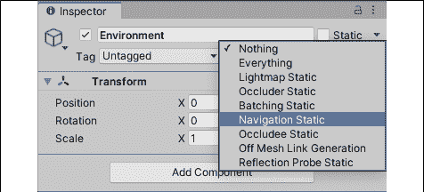
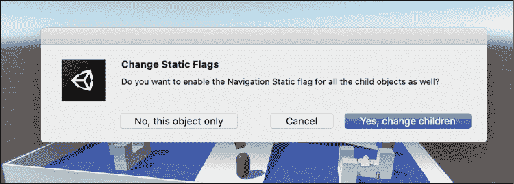
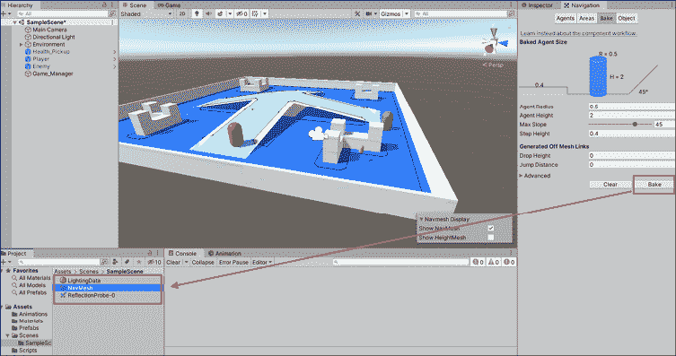
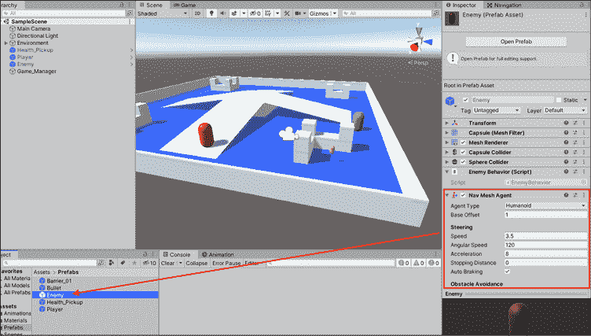
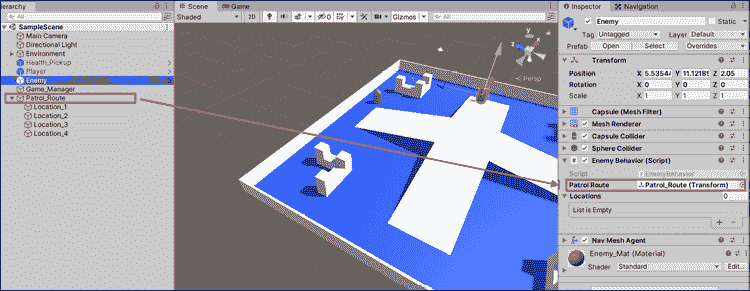
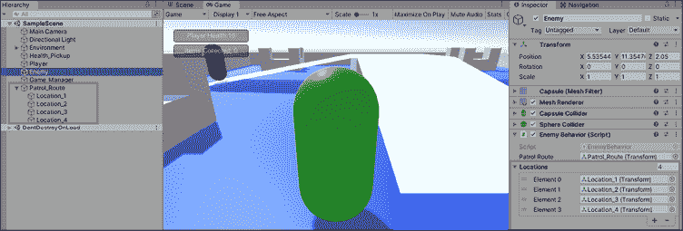
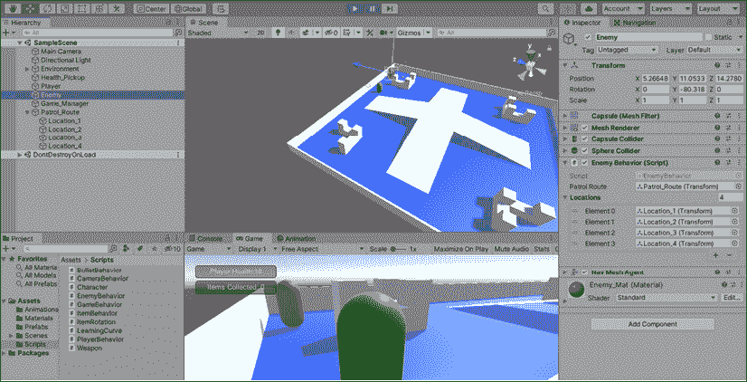
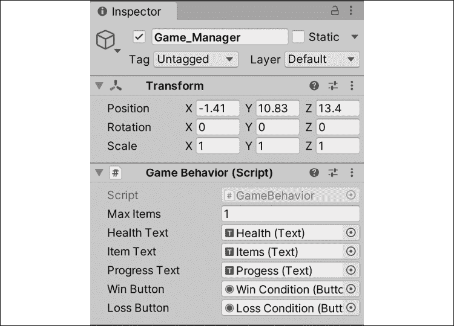

# 第九章：9

# 基本 AI 和敌人行为

虚拟场景需要冲突、后果和潜在奖励才能感觉真实。没有这三样东西，玩家就没有动力去关心他们游戏中的角色发生了什么，更不用说继续玩游戏了。虽然有很多游戏机制可以满足这些条件中的一个或多个，但没有什么能比得上一个会寻找你并试图结束你游戏的敌人。

编写一个智能敌人并不容易，并且通常需要长时间的工作和挫折。然而，Unity 内置了我们可以使用的功能、组件和类，以更用户友好的方式设计和实现 AI 系统。这些工具将推动*Hero Born*的第一个可玩版本完成，并为更高级的 C#主题提供一个跳板。

在本章中，我们将重点关注以下主题：

+   Unity 导航系统

+   静态对象和导航网格

+   导航代理

+   程序化编程和逻辑

+   承受和造成伤害

+   添加失败条件

+   重构和保持 DRY

让我们开始吧！

# 在 Unity 中导航 3D 空间

当我们谈论现实生活中的导航时，通常是关于如何从 A 点到 B 点的对话。在虚拟 3D 空间中导航基本上是一样的，但我们如何考虑自从我们第一次开始爬行以来积累的经验知识呢？从在平坦表面行走到爬楼梯和跳台阶，这些都是我们通过实践学会的技能；我们怎么可能在游戏中编程所有这些而不发疯呢？

在回答这些问题之前，您需要了解 Unity 提供了哪些导航组件。

## 导航组件

简短的答案是，Unity 花了很多时间完善其导航系统，并提供了我们可以用来控制可玩和不可玩角色如何移动的组件。以下每个组件都是 Unity 的标准组件，并且已经内置了复杂的功能：

+   **NavMesh**本质上是给定级别中可行走表面的地图；NavMesh 组件本身是从级别几何中创建的，在一个称为烘焙的过程中。将 NavMesh 烘焙到您的级别中会创建一个持有导航数据的独特项目资产。

+   如果**NavMesh**是级别地图，那么**NavMeshAgent**就是棋盘上的移动棋子。任何附有 NavMeshAgent 组件的对象都会自动避开其接触到的其他代理或障碍物。

+   导航系统需要意识到级别中任何可能导致 NavMeshAgent 改变其路线的移动或静止对象。将 NavMeshObstacle 组件添加到这些对象可以让系统知道它们需要避开。

虽然这对 Unity 导航系统的描述远非完整，但对于我们继续进行敌人行为已经足够了。在本章中，我们将专注于向我们的级别添加 NavMesh，将敌人预制件设置为 NavMeshAgent，并让敌人预制件以看似智能的方式沿着预定义路线移动。

在本章中，我们只会使用 NavMesh 和 NavMeshAgent 组件，但如果您想为您的级别增添一些趣味，可以查看如何在这里创建障碍物：[`docs.unity3d.com/Manual/nav-CreateNavMeshObstacle.html`](https://docs.unity3d.com/Manual/nav-CreateNavMeshObstacle.html)。

在设置“智能”敌人的第一个任务是在竞技场的可行走区域上创建一个 NavMesh。让我们设置和配置我们级别的 NavMesh：

1.  选择**环境**游戏对象，单击**检视器**窗口中**静态**旁边的箭头图标，并选择**导航静态**：

图 9.1：将对象设置为导航静态

1.  点击**是，更改子对象**当对话框弹出时，将所有**环境**子对象设置为**导航静态**：

图 9.2：更改所有子对象

1.  转到**窗口** | **AI** | **导航**，并选择**烘焙**选项卡。将所有设置保持为默认值，然后单击**烘焙**。烘焙完成后，你将在**场景**文件夹内看到一个新文件夹，其中包含照明、导航网格和反射探针数据：

图 9.3：烘焙导航网格

我们级别中的每个对象现在都标记为**导航静态**，这意味着我们新烘焙的 NavMesh 已根据其默认 NavMeshAgent 设置评估了它们的可访问性。在前面的屏幕截图中，你可以看到浅蓝色覆盖的地方是任何附有 NavMeshAgent 组件的对象的可行走表面，这是你的下一个任务。

## 设置敌人代理

让我们将敌人预制件注册为 NavMeshAgent：

1.  在**预制件**文件夹中选择敌人预制件，在**检视器**窗口中单击**添加组件**，并搜索**NavMesh Agent**：

图 9.4：添加 NavMeshAgent 组件

1.  从**层次结构**窗口中单击**+** **|** **创建空对象**，并将游戏对象命名为`Patrol_Route`：

+   选择`Patrol_Route`，单击**+** **|** **创建空对象**以添加一个子游戏对象，并将其命名为`Location_1`。将`Location_1`放置在级别的一个角落中：

图 9.5：创建一个空的巡逻路线对象

1.  在`Patrol_Route`中创建三个空的子对象，分别命名为`Location_2`，`Location_3`和`Location_4`，并将它们放置在级别的剩余角落，形成一个正方形：

图 9.6：创建所有空的巡逻路线对象

向敌人添加 NavMeshAgent 组件告诉 NavMesh 组件注意并将其注册为具有访问其自主导航功能的对象。在每个级别角落创建四个空游戏对象，布置我们希望敌人最终巡逻的简单路线；将它们分组在一个空的父对象中，使得在代码中更容易引用它们，并使得层次结构窗口更加有组织。现在剩下的就是编写代码让敌人走巡逻路线，这将在下一节中添加。

# 移动敌人代理

我们的巡逻地点已经设置好，敌人预制件有一个 NavMeshAgent 组件，但现在我们需要找出如何引用这些地点并让敌人自行移动。为此，我们首先需要谈论软件开发世界中的一个重要概念：程序化编程。

## 程序化编程

尽管在名称中有，但程序化编程的概念可能难以理解，直到你完全掌握它；一旦你掌握了，你就永远不会以相同的方式看待代码挑战。

任何在一个或多个连续对象上执行相同逻辑的任务都是程序化编程的完美候选者。当你调试数组、列表和字典时，已经做了一些程序化编程，使用`for`和`foreach`循环。每次执行这些循环语句时，都会对每个项目进行相同的`Debug.Log()`调用，依次迭代每个项目。现在的想法是利用这种技能获得更有用的结果。

程序化编程的最常见用途之一是将一个集合中的项目添加到另一个集合中，并在此过程中经常对其进行修改。这对我们的目的非常有效，因为我们希望引用`Patrol_Route`父对象中的每个子对象，并将它们存储在一个列表中。

## 参考巡逻地点

现在我们了解了程序化编程的基础知识，是时候获取对我们巡逻地点的引用，并将它们分配到一个可用的列表中了：

1.  将以下代码添加到`EnemyBehavior`中：

```cs
public class EnemyBehavior : MonoBehaviour
{ 
    **// 1** 
    **public** **Transform PatrolRoute;**
    **// 2** 
    **public** **List<Transform> Locations;**
    **void****Start****()** 
    **{** 
        **// 3** 
        **InitializePatrolRoute();**
    **}** 
          **// 4** 
    **void****InitializePatrolRoute****()** 
    **{** 
        **// 5** 
        **foreach****(Transform child** **in** **PatrolRoute)** 
        **{** 
            **// 6** 
            **Locations.Add(child);**
        **}** 
    **}**
    void OnTriggerEnter(Collider other) 
    { 
        // ... No changes needed ... 
    } 
    void OnTriggerExit(Collider other) 
    { 
        // ... No changes needed ... 
    } 
} 
```

1.  选择`Enemy`，并将`Patrol_Route`对象从**层次结构**窗口拖放到`EnemyBehavior`中的**Patrol Route**变量上：

图 9.7：将 Patrol_Route 拖到敌人脚本中

1.  点击**检视器**窗口中**位置**变量旁边的箭头图标，并运行游戏以查看列表填充：

图 9.8：测试过程式编程

让我们来分解一下代码：

1.  首先，声明一个变量来存储`PatrolRoute`空父级 GameObject。

1.  然后，声明一个`List`变量来保存`PatrolRoute`中所有子`Transform`组件。

1.  之后，它使用`Start()`在游戏开始时调用`InitializePatrolRoute()`方法。

1.  接下来，创建`InitializePatrolRoute()`作为一个私有的实用方法，以过程化地填充`Locations`与`Transform`值：

+   记住，不包括访问修饰符会使变量和方法默认为`private`。

1.  然后，使用`foreach`语句循环遍历`PatrolRoute`中的每个子 GameObject 并引用其 Transform 组件：

+   每个 Transform 组件都在`foreach`循环中声明的本地`child`变量中捕获。

1.  最后，通过使用`Add()`方法将每个顺序的`child` `Transform`组件添加到位置列表中，以便在`PatrolRoute`中循环遍历子对象时使用。

+   这样，无论我们在**Hierarchy**窗口中做出什么更改，`Locations`都将始终填充所有`PatrolRoute`父级下的`child`对象。

虽然我们可以通过直接从**Hierarchy**窗口将每个位置 GameObject 分配给`Locations`，通过拖放的方式，但是很容易丢失或破坏这些连接；对位置对象名称进行更改、对象的添加或删除，或项目的更新都可能导致类的初始化出现问题。通过在`Start()`方法中以过程化的方式填充 GameObject 列表或数组，更加安全和可读。

由于这个原因，我也倾向于在`Start()`方法中使用`GetComponent()`来查找并存储附加到给定类的组件引用，而不是在**Inspector**窗口中分配它们。

现在，我们需要让敌人对象按照我们制定的巡逻路线移动，这是你的下一个任务。

## 移动敌人

在`Start()`中初始化了一个巡逻位置列表后，我们可以获取敌人 NavMeshAgent 组件并设置它的第一个目的地。

更新`EnemyBehavior`使用以下代码并点击播放：

```cs
**// 1** 
**using** **UnityEngine.AI;** 
public class EnemyBehavior : MonoBehaviour  
{ 
    public Transform PatrolRoute;
    public List<Transform> Locations;
    **// 2** 
    **private****int** **_locationIndex =** **0****;** 
    **// 3** 
    **private** **NavMeshAgent _agent;** 
    void Start() 
    { 
        **// 4** 
        **_agent = GetComponent<NavMeshAgent>();** 
        InitializePatrolRoute(); 
        **// 5** 
        **MoveToNextPatrolLocation();** 
    }
    void InitializePatrolRoute()  
    { 
         // ... No changes needed ... 
    } 
    **void****MoveToNextPatrolLocation****()** 
    **{** 
        **// 6** 
        **_agent.destination = Locations[_locationIndex].position;** 
    **}** 
    void OnTriggerEnter(Collider other) 
    { 
        // ... No changes needed ... 
    } 
    void OnTriggerExit(Collider other) 
    { 
        // ... No changes needed ... 
    }
} 
```

让我们来分解一下代码：

1.  首先，添加`UnityEngine.AI`的`using`指令，以便`EnemyBehavior`可以访问 Unity 的导航类，这种情况下是`NavMeshAgent`。

1.  然后，声明一个变量来跟踪敌人当前正在向其行走的巡逻位置。由于`List`项是从零开始索引的，我们可以让 Enemy Prefab 在`Locations`中存储的顺序中移动巡逻点之间移动。

1.  接下来，声明一个变量来存储附加到 Enemy GameObject 的 NavMeshAgent 组件。这是`private`的，因为没有其他类应该能够访问或修改它。

1.  之后，它使用`GetComponent()`来查找并返回附加的 NavMeshAgent 组件给代理。

1.  然后，在`Start()`方法中调用`MoveToNextPatrolLocation()`方法。

1.  最后，声明`MoveToNextPatrolLocation()`为一个私有方法并设置`_agent.destinat``ion`：

+   `destination`是 3D 空间中的`Vector3`位置。

+   `Locations[_locationIndex]`获取`Locations`中给定索引处的 Transform 项。

+   添加`.position`引用了 Transform 组件的`Vector3`位置。

现在，当我们的场景开始时，位置被填充了巡逻点，并且`MoveToNextPatrolLocation()`被调用以将 NavMeshAgent 组件的目标位置设置为位置列表中的第一个项目`_locationIndex 0`。下一步是让敌人对象从第一个巡逻位置移动到所有其他位置。

我们的敌人移动到第一个巡逻点没问题，但然后停下了。我们希望它能够在每个顺序位置之间持续移动，这将需要在`Update()`和`MoveToNextPatrolLocation()`中添加额外的逻辑。让我们创建这个行为。

添加以下代码到`EnemyBehavior`并点击播放：

```cs
public class EnemyBehavior : MonoBehaviour  
{ 
    // ... No changes needed ... 
    **void****Update****()** 
    **{** 
        **// 1** 
        **if****(_agent.remainingDistance <** **0.2f** **&& !_agent.pathPending)** 
        **{** 
            **// 2** 
            **MoveToNextPatrolLocation();**
        **}**
    **}**
    void MoveToNextPatrolLocation() 
    { 
        **// 3** 
        **if** **(Locations.Count ==** **0****)** 
            **return****;** 

        _agent.destination = Locations[_locationIndex].position;
        **// 4** 
        **_locationIndex = (_locationIndex +** **1****) % Locations.Count;**
    }
    // ... No other changes needed ... 
} 
```

让我们来分解一下代码：

1.  首先，它声明`Update()`方法，并添加一个`if`语句来检查两个不同条件是否为真：

+   `remainingDistance`返回 NavMeshAgent 组件当前距离其设定目的地的距离，所以我们检查是否小于 0.2。

+   `pathPending`根据 Unity 是否为 NavMeshAgent 组件计算路径返回`true`或`false`布尔值。

1.  如果`_agent`非常接近目的地，并且没有其他路径正在计算，`if`语句将返回`true`并调用`MoveToNextPatrolLocation()`。

1.  在这里，我们添加了一个`if`语句来确保在执行`MoveToNextPatrolLocation()`中的其余代码之前，`Locations`不为空：

+   如果`Locations`为空，我们使用`return`关键字退出方法而不继续执行。

这被称为防御性编程，结合重构，这是在向更中级的 C#主题迈进时必不可少的技能。我们将在本章末考虑重构。

1.  然后，我们将`_locationIndex`设置为它的当前值，`+1`，然后取`Locations.Count`的模(`%`)：

+   这将使索引从 0 增加到 4，然后重新从 0 开始，这样我们的敌人预制就会沿着连续的路径移动。

+   模运算符返回两个值相除的余数——当结果为整数时，2 除以 4 的余数为 2，所以 2 % 4 = 2。同样，4 除以 4 没有余数，所以 4 % 4 = 0。

将索引除以集合中的最大项目数是一种快速找到下一个项目的方法。如果你对模运算符不熟悉，请回顾*第二章*，*编程的基本组成部分*。

现在我们需要在`Update()`中每帧检查敌人是否朝着设定的巡逻位置移动；当它靠近时，将触发`MoveToNextPatrolLocation()`，这会增加`_locationIndex`并将下一个巡逻点设置为目的地。

如果你将**Scene**视图拖到**Console**窗口旁边，如下截图所示，然后点击播放，你可以看到敌人预制在关卡的拐角处连续循环行走：



图 9.9：测试敌人巡逻路线

敌人现在沿着地图外围巡逻路线，但当它在预设范围内时，它不会寻找玩家并发动攻击。在下一节中，您将使用 NavAgent 组件来做到这一点。

# 敌人游戏机制

现在我们的敌人正在持续巡逻，是时候给它一些互动机制了；如果我们让它一直在走动而没有对抗我们的方式，那就没有太多的风险或回报了。

## 寻找并摧毁：改变代理的目的地

在本节中，我们将专注于在玩家靠近时切换敌人 NavMeshAgent 组件的目标，并在发生碰撞时造成伤害。当敌人成功降低玩家的健康时，它将返回到巡逻路线，直到下一次与玩家相遇。

然而，我们不会让我们的玩家束手无策；我们还将添加代码来跟踪敌人的健康状况，检测敌人是否成功被玩家的子弹击中，以及何时需要摧毁敌人。

现在敌人预制正在巡逻移动，我们需要获取玩家位置的引用，并在它靠近时改变 NavMeshAgent 的目的地。

1.  将以下代码添加到`EnemyBehavior`中：

```cs
public class EnemyBehavior : MonoBehaviour  
{ 
    **// 1** 
    **public** **Transform Player;**
    public Transform PatrolRoute;
    public List<Transform> Locations;
    private int _locationIndex = 0;
    private NavMeshAgent _agent;
    void Start() 
    { 
        _agent = GetComponent<NavMeshAgent>();
        **// 2** 
        **Player = GameObject.Find(****"Player"****).transform;** 
        // ... No other changes needed ... 
    } 
    /* ... No changes to Update,  
           InitializePatrolRoute, or  
           MoveToNextPatrolLocation ... */ 
    void OnTriggerEnter(Collider other) 
    { 
        if(other.name == "Player") 
        { 
            **// 3** 
            **_agent.destination = Player.position;**
            Debug.Log("Enemy detected!");
        } 
    } 
    void OnTriggerExit(Collider other)
    { 
        // .... No changes needed ... 
    }
} 
```

让我们来分解这段代码：

1.  首先，它声明一个`public`变量来保存`Player`胶囊体的`Transform`值。

1.  然后，我们使用`GameObject.Find("Player")`来返回场景中玩家对象的引用：

+   直接添加`.transform`引用了同一行中对象的`Transform`值。

1.  最后，在`OnTriggerEnter()`中，当玩家进入我们之前设置的敌人攻击区域时，我们将`_agent.destination`设置为玩家的`Vector3`位置。

如果你现在玩游戏并离巡逻的敌人太近，你会发现它会中断原来的路径直接向你走来。一旦它到达玩家，`Update()`方法中的代码将再次接管，敌人预制件将恢复巡逻。

我们仍然需要让敌人以某种方式伤害玩家，我们将在下一节中学习如何做到这一点。

## 降低玩家生命值

虽然我们的敌人机制已经取得了长足的进步，但当敌人预制件与玩家预制件发生碰撞时什么都不发生仍然让人失望。为了解决这个问题，我们将新的敌人机制与游戏管理器联系起来。

使用以下代码更新`PlayerBehavior`并点击播放：

```cs
public class PlayerBehavior : MonoBehaviour  
{ 
    // ... No changes to public variables needed ... 
    **// 1** 
    **private** **GameBehavior _gameManager;**
    void Start() 
    { 
        _rb = GetComponent<Rigidbody>();
        _col = GetComponent<CapsuleCollider>();
        **// 2** 
        **_gameManager = GameObject.Find(****"Game_Manager"****).GetComponent<GameBehavior>();**
    **}** 
    /* ... No changes to Update,  
           FixedUpdate, or  
           IsGrounded ... */ 
    **// 3** 
    **void****OnCollisionEnter****(****Collision collision****)**
    **{**
        **// 4** 
        **if****(collision.gameObject.name ==** **"Enemy"****)**
        **{**
            **// 5** 
            **_gameManager.HP -=** **1****;**
        **}**
    **}**
} 
```

让我们来分解一下代码：

1.  首先，它声明一个`private`变量来保存我们在场景中拥有的`GameBehavior`实例的引用。

1.  然后，它找到并返回附加到场景中的`Game Manager`对象的`GameBehavior`脚本：

+   在同一行上使用`GetComponent()`和`GameObject.Find()`是减少不必要的代码行的常见方法。

1.  由于我们的玩家是发生碰撞的对象，因此在`PlayerBehavior`中声明`OnCollisionEnter()`是有道理的。

1.  接下来，我们检查碰撞对象的名称；如果是敌人预制件，我们执行`if`语句的主体。

1.  最后，我们使用`_gameManager`实例从公共`HP`变量中减去`1`。

现在每当敌人跟踪并与玩家发生碰撞时，游戏管理器将触发 HP 的设置属性。UI 将使用新的玩家生命值更新，这意味着我们有机会为失败条件后期添加一些额外的逻辑。

## 检测子弹碰撞

现在我们有了失败条件，是时候为我们的玩家添加一种反击敌人攻击并幸存下来的方式了。

打开`EnemyBehavior`并使用以下代码进行修改：

```cs
public class EnemyBehavior : MonoBehaviour  
{ 
    //... No other variable changes needed ... 
    **// 1** 
    **private****int** **_lives =** **3****;** 
    **public****int** **EnemyLives** 
    **{** 
        **// 2** 
        **get** **{** **return** **_lives; }**
        **// 3** 
        **private****set** 
        **{** 
            **_lives =** **value****;** 
            **// 4** 
            **if** **(_lives <=** **0****)** 
            **{** 
                **Destroy(****this****.gameObject);** 
                **Debug.Log(****"Enemy down."****);** 
            **}**
        **}**
    **}**
    /* ... No changes to Start,  
           Update,  
           InitializePatrolRoute,  
           MoveToNextPatrolLocation,  
           OnTriggerEnter, or  
           OnTriggerExit ... */ 
    **void****OnCollisionEnter****(****Collision collision****)** 
    **{** 
        **// 5** 
        **if****(collision.gameObject.name ==** **"Bullet(Clone)"****)** 
        **{** 
            **// 6** 
            **EnemyLives -=** **1****;**
            **Debug.Log(****"Critical hit!"****);**
        **}**
    **}**
} 
```

让我们来分解一下代码：

1.  首先，它声明了一个名为`_lives`的`private int`变量，并声明了一个名为`EnemyLives`的`public`后备变量。这将使我们能够控制`EnemyLives`的引用和设置方式，就像在`GameBehavior`中一样。

1.  然后，我们将`get`属性设置为始终返回`_lives`。

1.  接下来，我们使用`private set`将`EnemyLives`的新值分配给`_lives`，以保持它们两者同步。

我们之前没有见过`private get`或`set`，但它们可以像任何其他可执行代码一样具有访问修饰符。将`get`或`set`声明为`private`意味着只有父类才能访问它们的功能。

1.  然后，我们添加一个`if`语句来检查`_lives`是否小于或等于 0，这意味着敌人应该死了：

+   在这种情况下，我们销毁`Enemy`游戏对象并在控制台上打印一条消息。

1.  因为`Enemy`是被子弹击中的对象，所以在`EnemyBehavior`中包含对这些碰撞的检查是合理的，使用`OnCollisionEnter()`。

1.  最后，如果碰撞对象的名称与子弹克隆对象匹配，我们将`EnemyLives`减少`1`并打印出另一条消息。

请注意，我们检查的名称是`Bullet(Clone)`，即使我们的子弹预制件的名称是`Bullet`。这是因为 Unity 会在使用`Instantiate()`方法创建的任何对象后添加`(Clone)`后缀，而我们的射击逻辑就是这样创建的。

你也可以检查游戏对象的标签，但由于这是 Unity 特有的功能，我们将保持代码不变，只用纯 C#来处理事情。

现在，玩家可以在敌人试图夺取其生命时进行反击，射击三次并摧毁敌人。再次，我们使用`get`和`set`属性来处理额外的逻辑，证明这是一个灵活且可扩展的解决方案。完成这些后，你的最后任务是更新游戏管理器的失败条件。

## 更新游戏管理器

要完全实现失败条件，我们需要更新管理器类：

1.  打开`GameBehavior`并添加以下代码：

```cs
public class GameBehavior : MonoBehaviour  
{ 
    // ... No other variable changes... 
    **// 1** 
    **public** **Button LossButton;** 
    private int _itemsCollected = 0; 
    public int Items 
    { 
        // ... No changes needed ... 
    } 
    private int _playerHP = 10; 
    public int HP 
    { 
        get { return _playerHP; } 
        set {  
            _playerHP = value; 
                HealthText.text = "Player Health: " + HP; 
            **// 2** 
            **if****(_playerHP <=** **0****)** 
            **{** 
                **ProgressText.text=** **"You want another life with** **that?"****;**
    **LossButton.gameObject.SetActive(****true****);** 
                **Time.timeScale =** **0****;** 
            **}** 
            **else** 
            **{** 
                **ProgressText.text =** **"Ouch... that's got hurt."****;** 
            **}**
        }
    }
} 
```

1.  在**Hierarchy**窗口中，右键单击**Win Condition**，选择**Duplicate**，并将其命名为**Loss Condition**：

+   单击**Loss Condition**左侧的箭头以展开它，选择**Text**对象，并将文本更改为**You lose...**

1.  在**Hierarchy**窗口中选择**Game_Manager**，并将**Loss Condition**拖放到**Game Behavior（Script）**组件中的**Loss Button**插槽中：

图 9.10：在检查器窗格中完成了带有文本和按钮变量的游戏行为脚本

让我们分解一下代码：

1.  首先，我们声明了一个新的按钮，当玩家输掉游戏时我们想要显示它。

1.  然后，我们添加一个`if`语句来检查`_playerHP`何时下降到`0`以下：

+   如果为`true`，则更新`ProgessText`和`Time.timeScale`，并激活失败按钮。

+   如果玩家在敌人碰撞后仍然存活，`ProgessText`会显示不同的消息：“哎呀...那一定很疼。”。

现在，在`GameBehavior.cs`中将`_playerHP`更改为 1，并让敌人预制件与您发生碰撞，观察发生了什么。

完成了！您已成功添加了一个可以对玩家造成伤害并受到反击的“智能”敌人，以及通过游戏管理器的失败界面。在我们完成本章之前，还有一个重要的主题需要讨论，那就是如何避免重复的代码。

重复的代码是所有程序员的梦魇，因此学会如何在项目中尽早避免它是有意义的！

# 重构和保持 DRY

**不要重复自己**（DRY）首字母缩写是软件开发者的良心：它告诉您何时有可能做出糟糕或可疑的决定，并在工作完成后给您一种满足感。

在实践中，重复的代码是编程生活的一部分。试图通过不断思考未来来避免它会在项目中设置许多障碍，这似乎不值得继续。处理重复代码的更有效和理智的方法是快速识别它何时何地发生，然后寻找最佳的移除方法。这个任务被称为重构，我们的`GameBehavior`类现在可以使用一些它的魔力。

您可能已经注意到我们在两个不同的地方设置了进度文本和时间刻度，但我们可以很容易地在一个地方为自己创建一个实用方法来完成这些工作。

要重构现有的代码，您需要按照以下步骤更新`GameBehavior.cs`：

```cs
public class GameBehavior: MonoBehaviour
{
    **// 1**
    **public****void****UpdateScene****(****string** **updatedText****)**
    **{**
        **ProgressText.text = updatedText;**
        **Time.timeScale =** **0f****;**
    **}**
    private int _itemsCollected = 0;
    public int Items
    {
        get { return _itemsCollected; }
        set
        {
            _itemsCollected = value;
            ItemText.text = "Items Collected: " + Items;
            if (_itemsCollected >= MaxItems)
            {
                WinButton.gameObject.SetActive(true);
                **// 2**
                **UpdateScene(****"You've found all the items!"****);**
            }
            else
            {
                ProgressText.text = "Item found, only " + (MaxItems - _itemsCollected) + " more to go!";
            }
        }
    }
    private int _playerHP = 10;
    public int HP
    {
        get { return _playerHP; }
        set
        {
            _playerHP = value;
            HealthText.text = "Player Health: " + HP;
            if (_playerHP <= 0)
            {
                LossButton.gameObject.SetActive(true);
                **// 3**
                **UpdateScene(****"You want another life with that?"****);**
            }
            else
            {
                ProgressText.text = "Ouch... that's got hurt.";
            }
            Debug.LogFormat("Lives: {0}", _playerHP);
        }
    }
} 
```

让我们分解一下代码：

1.  我们声明了一个名为`UpdateScene`的新方法，它接受一个字符串参数，我们想要将其分配给`ProgressText`，并将`Time.timeScale`设置为`0`。

1.  我们删除了重复代码的第一个实例，并使用我们的新方法在游戏获胜时更新了场景。

1.  我们删除了重复代码的第二个实例，并在游戏失败时更新了场景。

如果您在正确的地方寻找，总是有更多的重构工作可以做。

# 总结

通过这样，我们的敌人和玩家互动就完成了。我们可以造成伤害，也可以承受伤害，失去生命，并进行反击，同时更新屏幕上的 GUI。我们的敌人使用 Unity 的导航系统在竞技场周围行走，并在玩家指定范围内时切换到攻击模式。每个 GameObject 负责其行为、内部逻辑和对象碰撞，而游戏管理器则跟踪管理游戏状态的变量。最后，我们学习了简单的过程式编程，以及当重复指令被抽象成它们的方法时，代码可以变得更加清晰。

在这一点上，您应该感到有所成就，特别是如果您作为一个完全的初学者开始阅读本书。在构建一个可工作的游戏的同时熟悉一种新的编程语言并不容易。在下一章中，您将被介绍一些 C#中级主题，包括新的类型修饰符、方法重载、接口和类扩展。

# 小测验-人工智能和导航

1.  在 Unity 场景中如何创建 NavMesh 组件？

1.  什么组件将 GameObject 标识为 NavMesh？

1.  在一个或多个连续对象上执行相同的逻辑是哪种编程技术的例子？

1.  DRY 首字母缩写代表什么？

# 加入我们的 Discord！

与其他用户一起阅读这本书，与 Unity/C#专家和 Harrison Ferrone 一起阅读。提出问题，为其他读者提供解决方案，通过*问我任何事*与作者交流，以及更多内容。

立即加入！

[`packt.link/csharpunity2021`](https://packt.link/csharpunity2021)


