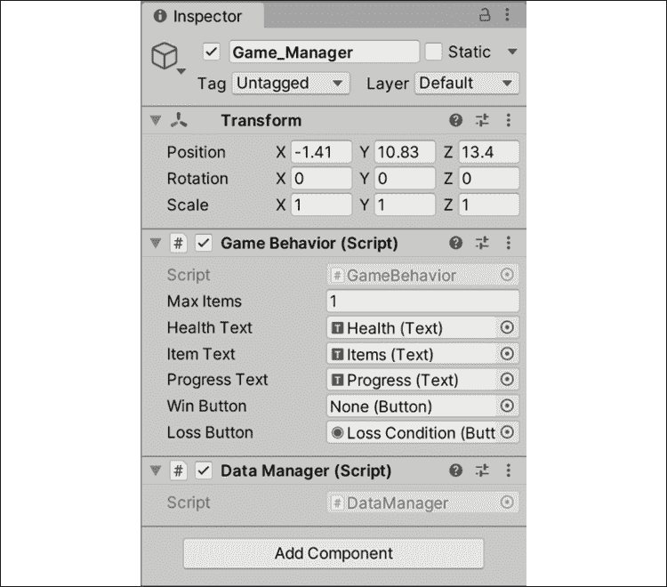

# 第十章：重新审视类型、方法和类

现在您已经使用 Unity 内置类编写了游戏的机制和交互，是时候扩展我们的核心 C#知识，专注于我们所奠定的基础的中级应用。我们将重新审视旧朋友——变量、类型、方法和类——但我们将针对它们的更深层次应用和相关用例。我们将要讨论的许多主题并不适用于*Hero Born*的当前状态，因此一些示例将是独立的，而不是直接应用于游戏原型。

我将向您介绍大量新信息，所以如果您在任何时候感到不知所措，请不要犹豫，重新阅读前几章以巩固这些基础知识。我们还将利用本章来摆脱游戏机制和特定于 Unity 的功能，而是专注于以下主题：

+   中级修饰符

+   方法重载

+   使用`out`和`ref`参数

+   使用接口

+   抽象类和重写

+   扩展类功能

+   命名空间冲突

+   类型别名

让我们开始吧！

# 访问修饰符

虽然我们已经习惯了将公共和私有访问修饰符与变量声明配对，就像我们对玩家健康和收集的物品所做的那样，但我们还有一长串修饰符关键字没有看到。在本章中，我们无法详细介绍每一个，但我们将专注于五个关键字，这将进一步加深您对 C#语言的理解，并提高您的编程技能。

本节将涵盖以下列表中的前三个修饰符，而剩下的两个将在*中级 OOP*部分讨论：

+   `const`

+   `readonly`

+   `静态`

+   `抽象`

+   `override`

您可以在[`docs.microsoft.com/en-us/dotnet/csharp/language-reference/keywords/modifiers`](https://docs.microsoft.com/en-us/dotnet/csharp/language-reference/keywords/modifiers)找到可用修饰符的完整列表。

让我们从前面列表中提供的前三个访问修饰符开始。

## 常量和只读属性

有时您需要创建存储常量、不变值的变量。在变量的访问修饰符后添加`const`关键字就可以做到这一点，但只适用于内置的 C#类型。例如，您不能将我们的`Character`类的实例标记为常量。`GameBehavior`类中`MaxItems`是一个常量值的好选择：

```cs
public **const** int MaxItems = 4; 
```

上面的代码本质上将`MaxItems`的值锁定为`4`，使其不可更改。常量变量的问题在于它们只能在声明时分配一个值，这意味着我们不能让`MaxItems`没有初始值。作为替代方案，我们可以使用`readonly`，它不允许您写入变量，这意味着它不能被更改：

```cs
public **readonly** int MaxItems; 
```

使用`readonly`关键字声明变量将为我们提供与常量相同的不可修改的值，同时仍然允许我们随时分配其初始值。这个关键字的一个好地方可能是我们脚本中的`Start()`或`Awake()`方法。

## 使用`static`关键字

我们已经讨论了如何从类蓝图创建对象或实例，以及所有属性和方法都属于特定的实例，就像我们的第一个`Character`类实例一样。虽然这对于面向对象的功能非常有用，但并非所有类都需要被实例化，也不是所有属性都需要属于特定的实例。但是，静态类是封闭的，这意味着它们不能用于类继承。

实用方法是这种情况的一个很好的例子，我们不一定关心实例化特定的`Utility`类实例，因为它的所有方法都不依赖于特定对象。您的任务是在一个新的脚本中创建这样一个实用方法。

让我们创建一个新的类来保存一些未来处理原始计算或重复逻辑的方法，这些方法不依赖于游戏玩法：

1.  在`Scripts`文件夹中创建一个新的 C#脚本，并将其命名为`Utilities`。

1.  打开它并添加以下代码：

```cs
using System.Collections; 
using System.Collections.Generic; 
using UnityEngine; 

// 1 
using UnityEngine.SceneManagement; 

// 2 
public static class Utilities  
{ 
    // 3 
    public static int PlayerDeaths = 0; 

    // 4 
    public static void RestartLevel() 
    { 
        SceneManager.LoadScene(0); 
        Time.timeScale = 1.0f; 
    } 
} 
```

1.  从`GameBehavior`中删除`RestartLevel()`中的代码，而是使用以下代码调用新的`utility`方法：

```cs
// 5
public void RestartScene()
{
    Utilities.RestartLevel();
} 
```

让我们来分解一下代码：

1.  首先，它添加了`using SceneManagement`指令，以便我们可以访问`LoadScene()`方法。

1.  然后，它将`Utilities`声明为一个不继承自`MonoBehavior`的公共`static`类，因为我们不需要它在游戏场景中。

1.  接下来，它创建一个公共的`static`变量来保存我们的玩家死亡并重新开始游戏的次数。

1.  然后，它声明一个公共的`static`方法来保存我们的级别重启逻辑，这目前是硬编码在`GameBehavior`中的。

1.  最后，我们在`GameBehavior`中对`RestartLevel()`的更新在赢或输按钮被按下时从静态的`Utilities`类调用。请注意，我们不需要`Utilities`类的实例来调用该方法，因为它是静态的——只需使用点符号。

我们现在已经将重启逻辑从`GameBehavior`中提取出来，并放入其静态类中，这样可以更容易地在整个代码库中重用。将其标记为`static`也将确保我们在使用其类成员之前永远不必创建或管理`Utilities`类的实例。

非静态类可以具有静态和非静态的属性和方法。但是，如果整个类标记为静态，所有属性和方法都必须遵循相同的规则。

这就结束了我们对变量和类型的第二次访问，这将使您能够在未来管理更大更复杂的项目时构建自己的一套工具和实用程序。现在是时候转向方法及其中级功能，其中包括方法重载和`ref`和`out`参数。

# 重温方法

自从我们在*第三章*学习如何使用方法以来，方法一直是我们代码的重要组成部分，但有两种中级用例我们还没有涵盖：方法重载和使用`ref`和`out`参数关键字。

## 方法重载

术语**方法重载**指的是创建多个具有相同名称但不同签名的方法。方法的签名由其名称和参数组成，这是 C#编译器识别它的方式。以以下方法为例：

```cs
public bool AttackEnemy(int damage) {} 
```

`AttackEnemy()`的方法签名如下所示：

```cs
AttackEnemy(int) 
```

现在我们知道了`AttackEnemy()`的签名，可以通过改变参数的数量或参数类型本身来重载它，同时保持其名称不变。这在您需要给定操作的多个选项时提供了额外的灵活性。

`Utilities`中的`RestartLevel()`方法是方法重载派上用场的一个很好的例子。目前，`RestartLevel()`只重新启动当前级别，但如果我们扩展游戏，使其包含多个场景会怎么样？我们可以重构`RestartLevel()`以接受参数，但这通常会导致臃肿和混乱的代码。

`RestartLevel()`方法再次是测试我们新知识的一个很好的候选项。您的任务是重载它以接受不同的参数。

让我们添加一个重载版本的`RestartLevel()`：

1.  打开`Utilities`并添加以下代码：

```cs
public static class Utilities  
{
    public static int PlayerDeaths = 0;
    public static void RestartLevel()
    {
        SceneManager.LoadScene(0);
        Time.timeScale = 1.0f;
    }
    **// 1** 
    **public****static****bool****RestartLevel****(****int** **sceneIndex****)**
    **{** 
        **// 2** 
        **SceneManager.LoadScene(sceneIndex);**
        **Time.timeScale =** **1.0f****;**
        **// 3** 
        **return****true****;**
    **}** 
} 
```

1.  打开`GameBehavior`并将对`Utilities.RestartLevel()`方法的调用更新为以下内容：

```cs
// 4
public void RestartScene()
{
    Utilities.RestartLevel(0);
} 
```

让我们来分解一下代码：

1.  首先，它声明了一个重载版本的`RestartLevel()`方法，该方法接受一个`int`参数并返回一个`bool`。

1.  然后，它调用`LoadScene()`并传入`sceneIndex`参数，而不是手动硬编码该值。

1.  接下来，在新场景加载后，它将返回`true`并且`timeScale`属性已被重置。

1.  最后，我们对`GameBehavior`的更新调用了重载的`RestartLevel()`方法，并将`0`作为`sceneIndex`传入。重载方法会被 Visual Studio 自动检测到，并按数字显示，如下所示：

图 10.1：Visual Studio 中的多个方法重载

`RestartLevel()`方法中的功能现在更加可定制，可以处理以后可能需要的其他情况。在这种情况下，它是从我们选择的任何场景重新开始游戏。

方法重载不仅限于静态方法——这只是与前面的示例一致。只要其签名与原始方法不同，任何方法都可以进行重载。

接下来，我们将介绍另外两个可以提升你的方法游戏水平的主题——`ref`和`out`参数。

## ref 参数

当我们在*第五章* *使用类、结构体和面向对象编程*中讨论类和结构体时，我们发现并非所有对象都是以相同的方式传递的：值类型是按副本传递的，而引用类型是按引用传递的。然而，我们没有讨论当对象或值作为参数传递到方法中时，它们是如何使用的。

默认情况下，所有参数都是按值传递的，这意味着传递到方法中的变量不会受到方法体内对其值所做更改的影响。当我们将它们用作方法参数时，这可以保护我们免受不需要的变量更改。虽然这对大多数情况都适用，但在某些情况下，您可能希望通过引用传递方法参数，以便可以更新它并在原始变量中反映出这种更改。在参数声明前加上`ref`或`out`关键字将标记参数为引用。

以下是使用`ref`关键字时需要牢记的几个关键点：

+   参数在传递到方法之前必须初始化。

+   在结束方法之前，您不需要初始化或分配引用参数值。

+   具有 get 或 set 访问器的属性不能用作`ref`或`out`参数。

让我们通过添加一些逻辑来跟踪玩家重新开始游戏的次数来尝试一下。

让我们创建一个方法来更新`PlayerDeaths`，以查看正在通过引用传递的方法参数的作用。

打开`Utilities`并添加以下代码：

```cs
public static class Utilities  
{ 
    public static int PlayerDeaths = 0; 
    **// 1** 
    **public****static****string****UpdateDeathCount****(****ref****int** **countReference****)** 
    **{** 
        **// 2** 
        **countReference +=** **1****;** 
        **return****"Next time you'll be at number "** **+ countReference;**
    **}**
    public static void RestartLevel()
    { 
       // ... No changes needed ...   
    } 
    public static bool RestartLevel(int sceneIndex)
    { 
        **// 3** 
        **Debug.Log(****"Player deaths: "** **+ PlayerDeaths);** 
        **string** **message = UpdateDeathCount(****ref** **PlayerDeaths);**
        **Debug.Log(****"Player deaths: "** **+ PlayerDeaths);**
        **Debug.Log(message);**
        SceneManager.LoadScene(sceneIndex);
        Time.timeScale = 1.0f;
        return true;
    }
} 
```

让我们来分解一下代码：

1.  首先，声明一个新的`static`方法，返回一个`string`并接受一个通过引用传递的`int`。

1.  然后，它直接更新引用参数，将其值增加 1，并返回一个包含新值的字符串。

1.  最后，它在将`PlayerDeaths`变量传递给`UpdateDeathCount()`之前和之后，在`RestartLevel(int sceneIndex)`中对其进行调试。我们还将`UpdateDeathCount()`返回的字符串值的引用存储在`message`变量中并打印出来。

如果你玩游戏并且失败，调试日志将显示`UpdateDeathCount()`内的`PlayerDeaths`增加了 1，因为它是通过引用而不是通过值传递的：


图 10.2：`ref`参数的示例输出

为了清晰起见，我们可以在没有`ref`参数的情况下更新玩家死亡计数，因为`UpdateDeathCount()`和`PlayerDeaths`在同一个脚本中。但是，如果情况不是这样，而你希望具有相同的功能，`ref`参数非常有用。

在这种情况下，我们使用`ref`关键字是为了举例说明，但我们也可以直接在`UpdateDeathCount()`内更新`PlayerDeaths`，或者在`RestartLevel()`内添加逻辑，只有在由于失败而重新开始时才触发`UpdateDeathCount()`。

现在我们知道如何在项目中使用`ref`参数，让我们来看看`out`参数以及它如何起到略有不同的作用。

## out 参数

`out`关键字和`ref`执行相同的工作，但有不同的规则，这意味着它们是相似的工具，但不能互换使用，每个都有自己的用例。

+   参数在传递到方法之前不需要初始化。

+   引用的参数值在调用方法中返回之前不需要初始化或赋值。

例如，我们可以在`UpdateDeathCount()`中用`out`替换`ref`，只要在方法返回之前初始化或赋值`countReference`参数：

```cs
public static string UpdateDeathCount(**out** int countReference) 
{ 
     countReference = 1;
     return "Next time you'll be at number " + countReference;
} 
```

使用`out`关键字的方法更适合需要从单个函数返回多个值的情况，而`ref`关键字在只需要修改引用值时效果最好。它也比`ref`关键字更灵活，因为在方法中使用参数之前不需要设置初始参数值。`out`关键字在需要在更改之前初始化参数值时特别有用。尽管这些关键字有点晦涩，但对于特殊用例来说，将它们放入你的 C#工具包中是很重要的。

有了这些新的方法特性，现在是重新审视**面向对象编程**（**OOP**）的时候了。这个主题涉及的内容太多，不可能在一两章中覆盖所有内容，但在你的开发生涯初期，有一些关键工具会很有用。OOP 是一个你鼓励在完成本书后继续学习的主题。

# 中级 OOP

面向对象的思维方式对于创建有意义的应用程序和理解 C#语言在幕后的工作方式至关重要。棘手的部分在于，类和结构本身并不是面向对象编程和设计对象的终点。它们始终是你的代码的构建块，但是类在单一继承方面受到限制，这意味着它们只能有一个父类或超类，而结构根本不能继承。因此，你现在应该问自己的问题很简单：“我如何才能根据特定情况创建出相同蓝图的对象，并让它们执行不同的操作？”

为了回答这个问题，我们将学习接口、抽象类和类扩展。

## 接口

将功能组合在一起的一种方法是通过接口。与类一样，接口是数据和行为的蓝图，但有一个重要的区别：它们不能有任何实际的实现逻辑或存储值。相反，它们包含了实现蓝图，由采用的类或结构填写接口中概述的值和方法。你可以在类和结构中使用接口，一个类或结构可以采用的接口数量没有上限。

记住，一个类只能有一个父类，结构根本不能有子类。将功能分解为接口可以让你像从菜单中选择食物一样构建类，选择你希望它们表现的方式。这将极大地提高你的代码库的效率，摆脱了冗长、混乱的子类层次结构。

例如，如果我们希望我们的敌人在靠近时能够还击我们的玩家，我们可以创建一个父类，玩家和敌人都可以从中派生，这将使它们都基于相同的蓝图。然而，这种方法的问题在于敌人和玩家不一定会共享相同的行为和数据。

更有效的处理方式是定义一个接口，其中包含可射击对象需要执行的蓝图，然后让敌人和玩家都采用它。这样，它们就可以自由地分开并展示不同的行为，同时仍然共享共同的功能。

将射击机制重构为接口是一个我留给你的挑战，但我们仍然需要知道如何在代码中创建和采用接口。在这个例子中，我们将创建一个所有管理器脚本可能需要实现的接口，以共享一个公共结构。

在`Scripts`文件夹中创建一个新的 C#脚本，命名为`IManager`，并更新其代码如下：

```cs
using System.Collections;
using System.Collections.Generic;
using UnityEngine; 
// 1 
public interface IManager  
{ 
    // 2 
    string State { get; set; } 
    // 3 
    void Initialize();
} 
```

让我们来分解一下代码：

1.  首先，它使用`interface`关键字声明了一个名为`IManager`的公共接口。

1.  然后，它在`IManager`中添加了一个名为`State`的`string`变量，带有`get`和`set`访问器来保存采用类的当前状态。

所有接口属性至少需要一个 get 访问器才能编译，但如果需要的话也可以有 get 和 set 访问器。

1.  最后，它定义了一个名为`Initialize()`的方法，没有返回类型，供采用类实现。但是，你绝对可以在接口内部的方法中有一个返回类型；没有规定不允许这样做。

你现在为所有管理器脚本创建了一个蓝图，这意味着采用这个接口的每个管理器脚本都需要有一个状态属性和一个初始化方法。你的下一个任务是使用`IManager`接口，这意味着它需要被另一个类采用。

为了保持简单，让游戏管理器采用我们的新接口并实现其蓝图。

使用以下代码更新`GameBehavior`：

```cs
**// 1** 
public class GameBehavior : MonoBehaviour, **IManager** 
{ 
    **// 2** 
    **private****string** **_state;** 
    **// 3** 
    **public****string** **State**  
    **{** 
        **get** **{** **return** **_state; }** 
        **set** **{ _state =** **value****; }** 
    **}**
    // ... No other changes needed ... 
    **// 4** 
    **void****Start****()** 
    **{** 
        **Initialize();** 
    **}**
    **// 5** 
    **public****void****Initialize****()**  
    **{** 
        **_state =** **"Game Manager initialized.."****;**
        **Debug.Log(_state);**
    **}**
} 
```

让我们来分解一下代码：

1.  首先，它声明了`GameBehavior`采用`IManager`接口，使用逗号和它的名称，就像子类化一样。

1.  然后，它添加了一个私有变量，我们将用它来支持我们必须从`IManager`实现的公共`State`值。

1.  接下来，它添加了在`IManager`中声明的公共`State`变量，并使用`_state`作为其私有备份变量。

1.  之后，它声明了`Start()`方法并调用了`Initialize()`方法。

1.  最后，它声明了在`IManager`中声明的`Initialize()`方法，其中包含一个设置和打印公共`State`变量的实现。

通过这样做，我们指定`GameBehavior`采用`IManager`接口，并实现其`State`和`Initialize()`成员，如下所示：


图 10.3：接口的示例输出

这样做的好处是，实现是特定于`GameBehavior`的；如果我们有另一个管理器类，我们可以做同样的事情，但逻辑不同。只是为了好玩，让我们设置一个新的管理器脚本来测试一下：

1.  在**Project**中，在**Scripts**文件夹内右键单击，选择**Create** | **C# Script**，然后命名为`DataManager`。

1.  使用以下代码更新新脚本并采用`IManager`接口：

```cs
using System.Collections;
using System.Collections.Generic;
using UnityEngine;
public class DataManager : MonoBehaviour, IManager
{
    private string _state;
    public string State
    {
        get { return _state; }
        set { _state = value; }
    }
    void Start()
    {
        Initialize();
    }
    public void Initialize()
    {
        _state = "Data Manager initialized..";
        Debug.Log(_state);
    }
} 
```

1.  将新脚本拖放到**Hierarchy**面板中的**Game_Manager**对象上：

图 10.4：附加到 GameObject 的数据管理器脚本

1.  然后点击播放：

图 10.5：数据管理器初始化的输出

虽然我们可以通过子类化来完成所有这些工作，但我们将受到一个父类限制，适用于所有我们的管理器。相反，我们可以选择添加新的接口。我们将在*第十二章*“保存、加载和序列化数据”中重新讨论这个新的管理器脚本。这为构建类打开了一整个新的可能性世界，其中之一是一个称为抽象类的新面向对象编程概念。

## 抽象类

另一种分离常见蓝图并在对象之间共享它们的方法是抽象类。与接口类似，抽象类不能包含任何方法的实现逻辑；但是，它们可以存储变量值。这是与接口的关键区别之一——在可能需要设置初始值的情况下，抽象类将是一种选择。

任何从抽象类继承的类都必须完全实现所有标记为`abstract`关键字的变量和方法。在想要使用类继承而不必编写基类默认实现的情况下，它们可能特别有用。

例如，让我们将刚刚编写的`IManager`接口功能作为抽象基类来看看它会是什么样子。*不要更改我们项目中的任何实际代码*，因为我们仍然希望保持事情的正常运行：

```cs
// 1 
public abstract class BaseManager  
{ 
    // 2 
    protected string _state = "Manager is not initialized...";
    public abstract string State { get; set; }
    // 3 
    public abstract void Initialize();
} 
```

让我们分解一下代码：

1.  首先，使用`abstract`关键字声明了一个名为`BaseManager`的新类。

1.  然后，它创建了两个变量：一个名为`_state`的`protected string`，只能被从`BaseManager`继承的类访问。我们还为`_state`设置了一个初始值，这是我们在接口中无法做到的。

+   我们还有一个名为`State`的抽象字符串，带有要由子类实现的`get`和`set`访问器。

1.  最后，它将`Initialize()`作为`abstract`方法添加，也要在子类中实现。

这样做，我们创建了一个与接口相同的抽象类。在这种设置中，`BaseManager`具有与`IManager`相同的蓝图，允许任何子类使用`override`关键字定义它们对`state`和`Initialize()`的实现：

```cs
// 1 
public class CombatManager: BaseManager  
{ 
    // 2 
    public override string State 
    { 
        get { return _state; } 
        set { _state = value; } 
    }
    // 3 
    public override void Initialize() 
    { 
        _state = "Combat Manager initialized..";
        Debug.Log(_state);
    }
} 
```

如果我们分解前面的代码，我们可以看到以下内容：

1.  首先，它声明了一个名为`CombatManager`的新类，该类继承自`BaseManager`抽象类。

1.  然后，它使用`override`关键字添加了从`BaseManager`中实现的`State`变量。

1.  最后，它再次使用`override`关键字从`BaseManager`中添加了`Initialize()`方法的实现，并设置了受保护的`_state`变量。

尽管这只是接口和抽象类的冰山一角，但它们的可能性应该在你的编程大脑中跳动。接口将允许您在不相关的对象之间传播和共享功能片段，从而在代码方面形成类似构建块的组装。

另一方面，抽象类将允许您保持 OOP 的单继承结构，同时将类的实现与其蓝图分离。这些方法甚至可以混合使用，因为抽象类可以像非抽象类一样采用接口。

对于复杂的主题，您的第一站应该是文档。在[`docs.microsoft.com/en-us/dotnet/csharp/language-reference/keywords/abstract`](https://docs.microsoft.com/en-us/dotnet/csharp/language-reference/keywords/abstract)和[`docs.microsoft.com/en-us/dotnet/csharp/language-reference/keywords/interface`](https://docs.microsoft.com/en-us/dotnet/csharp/language-reference/keywords/interface)上查看它。

您并不总是需要从头开始构建一个新类。有时，向现有类添加您想要的功能或逻辑就足够了，这称为类扩展。

## 类扩展

让我们远离自定义对象，谈谈如何扩展现有类，使它们符合我们自己的需求。类扩展的理念很简单：取一个现有的内置 C#类，并添加任何您需要的功能。由于我们无法访问 C#构建的底层代码，这是获取对象语言已经具有的自定义行为的唯一方法。

类只能通过方法进行修改——不允许变量或其他实体。然而，尽管这可能有所限制，但它使语法保持一致：

```cs
public **static** returnType MethodName(**this** **ExtendingClass** localVal) {} 
```

扩展方法的声明与普通方法相同，但有一些注意事项：

+   所有扩展方法都需要标记为`static`。

+   第一个参数需要是`this`关键字，后面跟着我们想要扩展的类的名称和一个本地变量名称：

+   这个特殊的参数让编译器识别该方法为扩展方法，并为我们提供了现有类的本地引用。

+   任何类方法和属性都可以通过局部变量访问。

+   将扩展方法存储在静态类中是常见的，而静态类又存储在其命名空间中。这使您可以控制其他脚本可以访问您的自定义功能。

您的下一个任务是通过向内置的 C# `String`类添加一个新方法来将类扩展付诸实践。

通过向`String`类添加自定义方法来实践扩展。在`Scripts`文件夹中创建一个新的 C#脚本，命名为`CustomExtensions`，并添加以下代码：

```cs
using System.Collections; 
using System.Collections.Generic;
using UnityEngine;  
// 1 
namespace CustomExtensions  
{ 
    // 2 
    public static class StringExtensions 
    { 
        // 3 
        public static void FancyDebug(this string str)
        { 
            // 4 
            Debug.LogFormat("This string contains {0} characters.", str.Length);
        }
    }
} 
```

让我们来分解一下代码：

1.  首先，它声明了一个名为`CustomExtensions`的命名空间，用于保存所有扩展类和方法。

1.  然后，为了组织目的，它声明了一个名为`StringExtensions`的`static`类；每组类扩展都应遵循此设置。

1.  接下来，它向`StringExtensions`类添加了一个名为`FancyDebug`的`static`方法：

+   第一个参数`this string str`标记该方法为扩展。

+   `str`参数将保存对`FancyDebug()`所调用的实际文本值的引用；我们可以在方法体内操作`str`，作为所有字符串文字的替代。

1.  最后，每当执行`FancyDebug`时，它都会打印出一个调试消息，使用`str.Length`来引用调用该方法的字符串变量。

实际上，这将允许您向现有的 C#类或甚至您自己的自定义类添加任何自定义功能。现在扩展是`String`类的一部分，让我们来测试一下。要使用我们的新自定义字符串方法，我们需要在想要访问它的任何类中包含它。

打开`GameBehavior`并使用以下代码更新类：

```cs
using System.Collections; 
using System.Collections.Generic; 
using UnityEngine; 
**// 1** 
**using** **CustomExtensions;** 

public class GameBehavior : MonoBehaviour, IManager 
{ 
    // ... No changes needed ... 
    void Start() 
    { 
        // ... No changes needed ... 
    } 
    public void Initialize()  
    { 
        _state = "Game Manager initialized..";
        **// 2** 
        **_state.FancyDebug();**
        Debug.Log(_state);
    }
} 
```

让我们来分解一下代码：

1.  首先，在文件顶部使用`using`指令添加`CustomExtensions`命名空间。

1.  然后，它在`Initialize()`内部使用点表示法在`_state`字符串变量上调用`FancyDebug`，以打印出其值具有的个体字符数。

通过`FancyDebug()`扩展整个`string`类意味着任何字符串变量都可以访问它。由于第一个扩展方法参数引用了`FancyDebug()`所调用的任何`string`值，因此其长度将被正确打印出来，如下所示：


图 10.6：自定义扩展的示例输出

也可以使用相同的语法扩展自定义类，但如果您控制一个类，直接将额外功能添加到类中更常见。

本章我们将探讨的最后一个主题是命名空间，我们在本书的前面简要了解过。在下一节中，您将了解命名空间在 C#中扮演的更大角色，以及如何创建您自己的类型别名。

# 命名空间冲突和类型别名

随着您的应用程序变得更加复杂，您将开始将代码分成命名空间，确保您可以控制何时何地访问它。您还将使用第三方软件工具和插件，以节省实现已经可用的功能的时间。这两种情况都表明您正在不断提高您的编程知识，但它们也可能引起命名空间冲突。

**命名空间冲突**发生在有两个或更多具有相同名称的类或类型时，这种情况比你想象的要多。

良好的命名习惯往往会产生类似的结果，不知不觉中，您将处理多个名为`Error`或`Extension`的类，而 Visual Studio 则会抛出错误。幸运的是，C#对这些情况有一个简单的解决方案：**类型别名**。

定义类型别名可以让您明确选择在给定类中要使用的冲突类型，或者为现有的冗长名称创建一个更用户友好的名称。类型别名是通过`using`指令在类文件顶部添加的，后跟别名和分配的类型：

```cs
using AliasName = type; 
```

例如，如果我们想要创建一个类型别名来引用现有的`Int64`类型，我们可以这样说：

```cs
using CustomInt = System.Int64; 
```

现在`CustomInt`是`System.Int64`类型的类型别名，编译器将把它视为`Int64`，让我们可以像使用其他类型一样使用它：

```cs
public CustomInt PlayerHealth = 100; 
```

你可以使用类型别名来使用你的自定义类型，或者使用相同的语法来使用现有的类型，只要它们在脚本文件的顶部与其他`using`指令一起声明。

有关`using`关键字和类型别名的更多信息，请查看 C#文档[`docs.microsoft.com/en-us/dotnet/csharp/language-reference/keywords/using-directive`](https://docs.microsoft.com/en-us/dotnet/csharp/language-reference/keywords/using-directive)。

# 摘要

有了新的修饰符、方法重载、类扩展和面向对象的技能，我们离 C#之旅的终点只有一步之遥。记住，这些中级主题旨在让你思考知识的更复杂应用；不要认为你在本章学到的就是这些概念的全部。把它当作一个起点，然后继续前进。

在下一章中，我们将讨论泛型编程的基础知识，获得一些委托和事件的实际经验，并最后概述异常处理。

# 小测验-升级

1.  哪个关键字会将变量标记为不可修改，但需要初始值？

1.  你会如何创建一个基本方法的重载版本？

1.  类和接口之间的主要区别是什么？

1.  你会如何解决类中的命名空间冲突？

# 加入我们的 Discord！

与其他用户、Unity/C#专家和 Harrison Ferrone 一起阅读本书。提出问题，为其他读者提供解决方案，通过*问我任何事*与作者交流等等。

立即加入！

[`packt.link/csharpunity2021`](https://packt.link/csharpunity2021)


