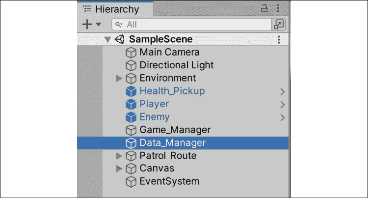
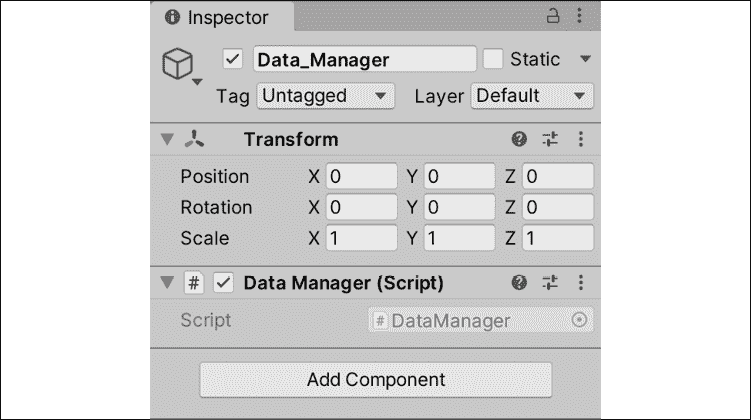
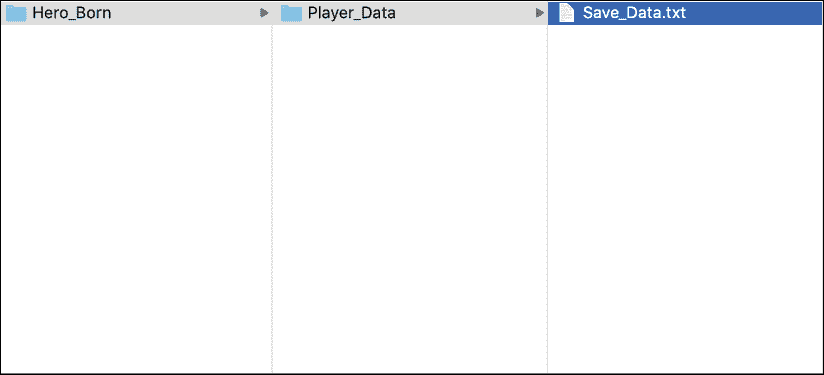
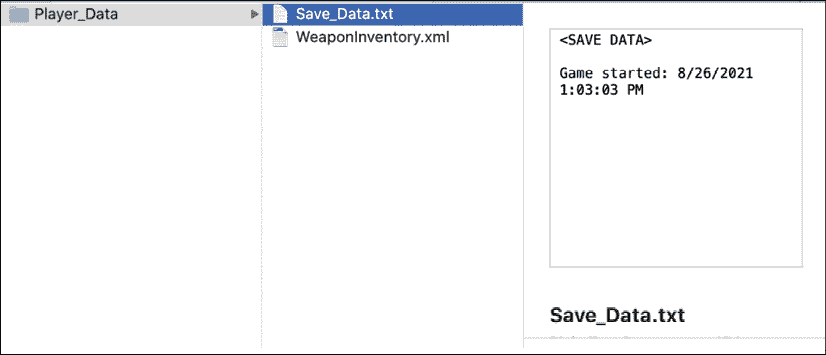
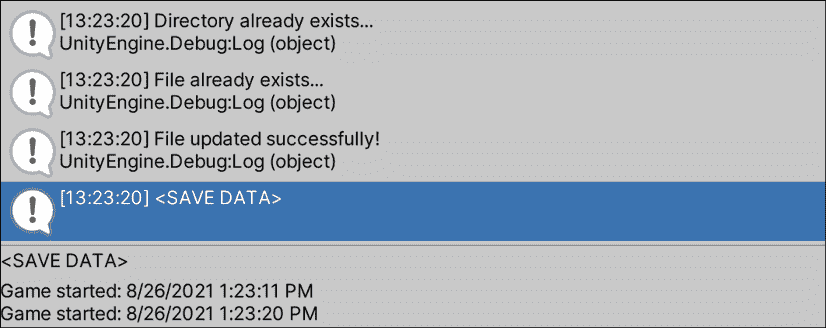
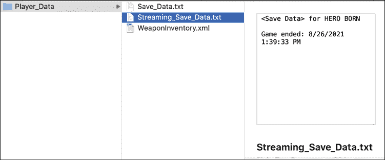
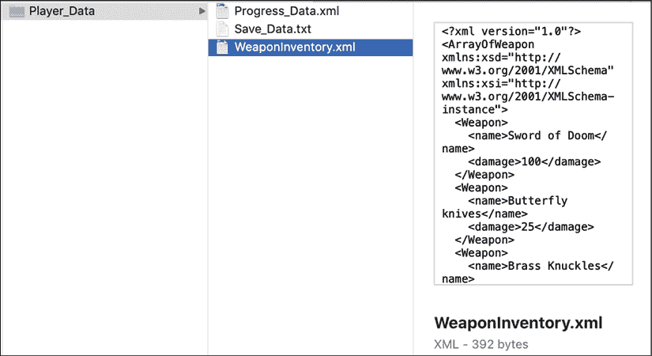
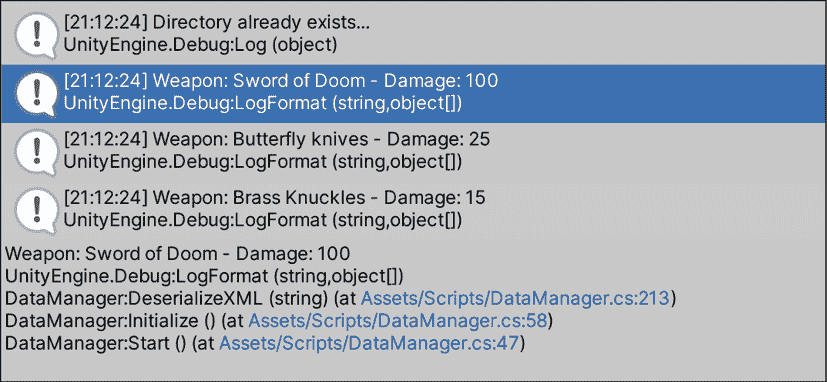
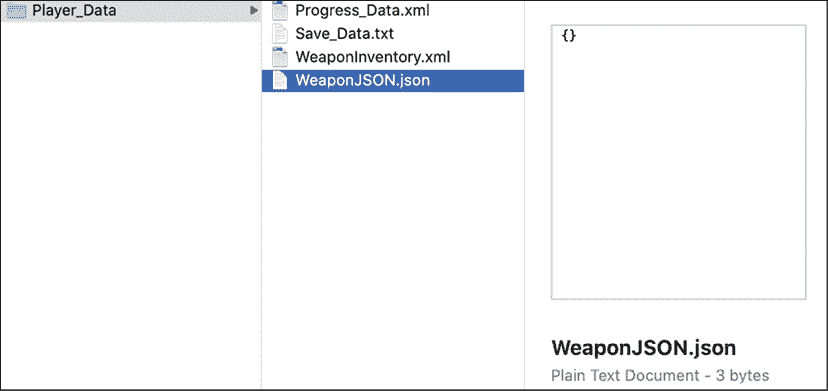
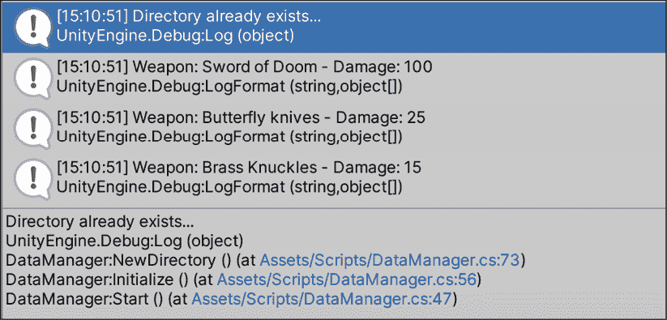

# 第十二章：12

# 保存、加载和序列化数据

您玩过的每个游戏都使用数据，无论是您的玩家统计数据、游戏进度还是在线多人游戏积分榜。您最喜欢的游戏还管理内部数据，这意味着程序员使用硬编码信息来构建级别、跟踪敌人统计数据并编写有用的实用程序。换句话说，数据无处不在。

在本章中，我们将从 C#和 Unity 如何处理计算机上的文件系统开始，并继续阅读、写入和序列化我们的游戏数据。我们的重点是处理您可能会遇到的三种最常见的数据格式：文本文件、XML 和 JSON。

在本章结束时，您将对计算机的文件系统、数据格式和基本的读写功能有一个基础的理解。这将是您构建游戏数据的基础，为玩家创造更丰富和引人入胜的体验。您还将有一个很好的起点，开始思考哪些游戏数据是重要的，以及您的 C#类和对象在不同的数据格式中会是什么样子。

在这个过程中，我们将涵盖以下主题：

+   介绍文本、XML 和 JSON 格式

+   了解文件系统

+   使用不同的流类型

+   阅读和写入游戏数据

+   序列化对象

# 介绍数据格式

数据在编程中可以采用不同的形式，但您在数据旅程开始时应熟悉的三种格式是：

+   **文本**，这就是您现在正在阅读的内容

+   **XML**（**可扩展标记语言**），这是一种编码文档信息的方式，使其对您和计算机可读

+   **JSON**（**JavaScript 对象表示**），这是一种由属性-值对和数组组成的可读文本格式

每种数据格式都有其自身的优势和劣势，以及在编程中的应用。例如，文本通常用于存储更简单、非分层或嵌套的信息。XML 更擅长以文档格式存储信息，而 JSON 在数据库信息和应用程序的服务器通信方面具有更广泛的能力。

您可以在[`www.xml.com`](https://www.xml.com)找到有关 XML 的更多信息，以及在[`www.json.org`](https://www.json.org)找到有关 JSON 的信息。

数据在任何编程语言中都是一个重要的主题，因此让我们从下两节中实际了解 XML 和 JSON 格式是什么样子开始。

## 分解 XML

典型的 XML 文件具有标准化格式。XML 文档的每个元素都有一个开放标签(`<element_name>`)，一个关闭标签(`</element_name>`)，并支持标签属性(`<element_name attribute= "attribute_name"></element_name>`)。一个基本文件将以正在使用的版本和编码开始，然后是起始或根元素，然后是元素项列表，最后是关闭元素。作为蓝图，它将如下所示：

```cs
<?xml version="1.0" encoding="utf-8"?>
<root_element>
    <element_item>[Information goes here]</element_item>
    <element_item>[Information goes here]</element_item>
    <element_item>[Information goes here]</element_item>
</root_element> 
```

XML 数据还可以通过使用子元素存储更复杂的对象。例如，我们将使用我们在本书中早些时候编写的`Weapon`类，将武器列表转换为 XML。由于每个武器都有其名称和伤害值的属性，它将如下所示：

```cs
// 1
<?xml version="1.0"?>
// 2
<ArrayOfWeapon>
     // 3
    <Weapon>
     // 4
        <name>Sword of Doom</name>
        <damage>100</damage>
     // 5
    </Weapon>
    <Weapon>
        <name>Butterfly knives</name>
        <damage>25</damage>
    </Weapon>
    <Weapon>
        <name>Brass Knuckles</name>
        <damage>15</damage>
    </Weapon>
// 6
</ArrayOfWeapon> 
```

让我们分解上面的示例，确保我们理解正确：

1.  XML 文档以正在使用的版本开头

1.  根元素使用名为`ArrayOfWeapon`的开放标签声明，它将保存所有我们的元素项

1.  使用开放标签`Weapon`创建了一个武器项目

1.  其子属性是通过单行上的开放和关闭标签添加的，用于`name`和`damage`

1.  武器项目已关闭，并添加了两个武器项目

1.  数组关闭，标志着文档的结束

好消息是我们的应用程序不必手动以这种格式编写我们的数据。C#有一个完整的类和方法库，可以帮助我们直接将简单文本和类对象转换为 XML。

稍后我们将深入实际的代码示例，但首先我们需要了解 JSON 的工作原理。

## 解析 JSON

JSON 数据格式类似于 XML，但没有标签。相反，一切都基于属性-值对，就像我们在*第四章*“控制流和集合类型”中使用的**Dictionary**集合类型一样。每个 JSON 文档都以一个父字典开始，其中包含您需要的许多属性-值对。字典使用开放和关闭的大括号（`{}`），冒号分隔每个属性和值，每个属性-值对之间用逗号分隔：

```cs
// Parent dictionary for the entire file
{
    // List of attribute-value pairs where you store your data
    "attribute_name": value,
    "attribute_name": value
} 
```

JSON 也可以通过将属性-值对的值设置为属性-值对数组来具有子结构。例如，如果我们想要存储一把武器，它会是这样的：

```cs
// Parent dictionary
{
    // Weapon attribute with its value set to an child dictionary
    "weapon": {
          // Attribute-value pairs with weapon data
          "name": "Sword of Doom",
          "damage": 100
    }
} 
```

最后，JSON 数据通常由列表、数组或对象组成。继续我们的例子，如果我们想要存储玩家可以选择的所有武器的列表，我们将使用一对方括号来表示一个数组：

```cs
// Parent dictionary
{
    // List of weapon attribute set to an array of weapon objects
    "weapons": [
        // Each weapon object stored as its own dictionary
        {
            "name": "Sword of Doom",
            "damage": 100
        },
        {
            "name": "Butterfly knives",
            "damage": 25
        },
        {
            "name": "Brass Knuckles",
            "damage": 15
        }
    ]
} 
```

您可以混合和匹配这些技术来存储您需要的任何类型的复杂数据，这是 JSON 的主要优势之一。但就像 XML 一样，不要被新的语法所吓倒——C#和 Unity 都有辅助类和方法，可以将文本和类对象转换为 JSON，而无需我们做任何繁重的工作。阅读 XML 和 JSON 有点像学习一门新语言——您使用得越多，它就会变得越熟悉。很快它就会成为第二天性！

现在我们已经初步了解了数据格式化的基础知识，我们可以开始讨论计算机上的文件系统是如何工作的，以及我们可以从 C#代码中访问哪些属性。

# 了解文件系统

当我们说文件系统时，我们指的是您已经熟悉的东西——文件和文件夹如何在计算机上创建、组织和存储。当您在计算机上创建一个新文件夹时，您可以为其命名并将文件或其他文件夹放入其中。它也由图标表示，这既是一种视觉提示，也是一种拖放和移动到任何您喜欢的位置的方式。

您可以在桌面上做的任何事情都可以在代码中完成。您只需要文件夹的名称，或者称为目录，以及存储它的位置。每当您想要添加文件或子文件夹时，您都需要引用父目录并添加新内容。

为了更好地理解文件系统，让我们开始构建`DataManager`类：

1.  在**Hierarchy**中右键单击并选择**Create Empty**，然后命名为**Data_Manager**：

图 12.1：Hierarchy 中的 Data_Manager

1.  在**Hierarchy**中选择**Data_Manager**对象，并将我们在*第十章*“重新审视类型、方法和类”中创建的`DataManager`脚本从**Scripts**文件夹拖放到**Inspector**中：

图 12.2：Inspector 中的 Data_Manager

1.  打开`DataManager`脚本，并使用以下代码更新它以打印出一些文件系统属性：

```cs
using System.Collections;
using System.Collections.Generic;
using UnityEngine;

**// 1**
**using** **System.IO;**

public class DataManager : MonoBehaviour, IManager
{
    // ... No variable changes needed ...

    public void Initialize()
    {
        _state = "Data Manager initialized..";
        Debug.Log(_state);

        **// 2**
        **FilesystemInfo();**
    }
    public void FilesystemInfo()
    {
        **// 3**
        **Debug.LogFormat(****"Path separator character: {0}"****,**
          **Path.PathSeparator);**
        **Debug.LogFormat(****"Directory separator character: {0}"****,**
          **Path.DirectorySeparatorChar);**
        **Debug.LogFormat(****"Current directory: {0}"****,**
          **Directory.GetCurrentDirectory());**
        **Debug.LogFormat(****"Temporary path: {0}"****,**
          **Path.GetTempPath());**
    }
} 
```

让我们分解代码：

1.  首先，我们添加`System.IO`命名空间，其中包含了我们需要处理文件系统的所有类和方法。

1.  我们调用我们在下一步创建的`FilesystemInfo`方法。

1.  我们创建`FilesystemInfo`方法来打印出一些文件系统属性。每个操作系统都以不同的方式处理其文件系统路径——路径是以字符串形式写入的目录或文件的位置。在 Mac 上：

+   路径由冒号(`:`)分隔

+   目录由斜杠(`/`)分隔

+   当前目录路径是*Hero Born*项目存储的位置

+   临时路径是您文件系统的临时文件夹的位置

如果您使用其他平台和操作系统，请在使用文件系统之前自行检查`Path`和`Directory`方法。

运行游戏并查看输出：


图 12.3：来自数据管理器的控制台消息

`Path`和`Directory`类是我们将在接下来的部分中用来存储数据的基础。然而，它们都是庞大的类，所以我鼓励您在继续数据之旅时查阅它们的文档。

您可以在[`docs.microsoft.com/en-us/dotnet/api/system.io.path`](https://docs.microsoft.com/en-us/dotnet/api/system.io.path)找到`Path`类的更多文档，以及在[`docs.microsoft.com/en-us/dotnet/api/system.io.directory`](https://docs.microsoft.com/en-us/dotnet/api/system.io.directory)找到`Directory`类的更多文档。

现在我们在`DataManager`脚本中打印出了文件系统属性的简单示例，我们可以创建一个文件系统路径，将数据保存到我们想要保存数据的位置。

## 处理资源路径

在纯 C#应用程序中，您需要选择要保存文件的文件夹，并将文件夹路径写入字符串中。然而，Unity 提供了一个方便的预配置路径作为`Application`类的一部分，您可以在其中存储持久游戏数据。持久数据意味着信息在每次程序运行时都会被保存和保留，这使得它非常适合这种玩家信息。

重要的是要知道，Unity 持久数据目录的路径是跨平台的，这意味着为 iOS、Android、Windows 等构建游戏时会有所不同。您可以在 Unity 文档中找到更多信息[`docs.unity3d.com/ScriptReference/Application-persistentDataPath.html`](https://docs.unity3d.com/ScriptReference/Application-persistentDataPath.html)。

我们需要对`DataManager`进行的唯一更新是创建一个私有变量来保存我们的路径字符串。我们将其设置为私有，因为我们不希望任何其他脚本能够访问或更改该值。这样，`DataManager`负责所有与数据相关的逻辑，而不会有其他东西。

在`DataManager.cs`中添加以下变量：

```cs
public class DataManager : MonoBehaviour, IManager
{
    // ... No other variable changes needed ...

    **// 1**
    **private****string** **_dataPath;**
    **// 2**
    **void****Awake****()**
    **{**
        **_dataPath = Application.persistentDataPath +** **"/Player_Data/"****;**

        **Debug.Log(_dataPath);**
    **}**

    // ... No other changes needed ...
} 
```

让我们分解一下我们的代码更新：

1.  我们创建了一个私有变量来保存数据路径字符串

1.  我们将数据路径字符串设置为应用程序的`persistentDataPath`值，使用开放和关闭的斜杠添加了一个名为**Player_Data**的新文件夹，并打印出完整路径：

+   重要的是要注意，`Application.persistentDataPath`只能在`MonoBehaviour`方法中使用，如`Awake()`、`Start()`、`Update()`等，游戏需要运行才能让 Unity 返回有效的路径。

图 12.4：Unity 持久数据文件的文件路径

由于我使用的是 Mac，我的持久数据文件夹嵌套在我的`/Users`文件夹中。如果您使用不同的设备，请记得查看[`docs.unity3d.com/ScriptReference/Application-persistentDataPath.html`](https://docs.unity3d.com/ScriptReference/Application-persistentDataPath.html)以找出您的数据存储在何处。

当您不使用类似 Unity 持久数据目录这样的预定义资源路径时，C#中有一个名为`Combine`的便利方法，位于`Path`类中，用于自动配置路径变量。`Combine()`方法最多可以接受四个字符串作为输入参数，或者表示路径组件的字符串数组。例如，指向您的`User`目录的路径可能如下所示：

```cs
var path = Path.Combine("/Users", "hferrone", "Chapter_12"); 
```

这解决了路径和目录中的分隔字符和反斜杠或正斜杠的任何潜在跨平台问题。

现在我们有了一个存储数据的路径，让我们在文件系统中创建一个新目录，或文件夹。这将使我们能够安全地存储我们的数据，并在游戏运行之间进行存储，而不是在临时存储中被删除或覆盖。

## 创建和删除目录

创建新目录文件夹很简单-我们检查是否已经存在具有相同名称和相同路径的目录，如果没有，我们告诉 C#为我们创建它。每个人都有自己处理文件和文件夹中重复内容的方法，因此在本章的其余部分中我们将重复相当多的重复检查代码。

我仍然建议在现实世界的应用程序中遵循**DRY**（**不要重复自己**）原则；重复检查代码只是为了使示例完整且易于理解而在这里重复。

1.  在`DataManager`中添加以下方法：

```cs
public void NewDirectory()
{
    // 1
    if(Directory.Exists(_dataPath))
    {
        // 2
        Debug.Log("Directory already exists...");
        return;
    }
    // 3
    Directory.CreateDirectory(_dataPath);
    Debug.Log("New directory created!");
} 
```

1.  在`Initialize()`中调用新方法：

```cs
public void Initialize()
{
    _state = "Data Manager initialized..";
    Debug.Log(_state);
    **NewDirectory();**
} 
```

让我们分解一下我们所做的事情：

1.  首先，我们使用上一步创建的路径检查目录文件夹是否已经存在

1.  如果已经创建，我们会在控制台中发送消息，并使用`return`关键字退出方法，不再继续执行

1.  如果目录文件夹不存在，我们将向`CreateDirectory()`方法传递我们的数据路径，并记录它已被创建

运行游戏，并确保您在控制台中看到正确的调试日志，以及您的持久数据文件夹中的新目录文件夹。

如果找不到它，请使用我们在上一步中打印出的`_dataPath`值。


图 12.5：新目录创建的控制台消息


图 12.6：在桌面上创建的新目录

如果您第二次运行游戏，将不会创建重复的目录文件夹，这正是我们想要的安全代码。


图 12.7：重复目录文件夹的控制台消息

删除目录与创建方式非常相似-我们检查它是否存在，然后使用`Directory`类删除我们传入路径的文件夹。

在`DataManager`中添加以下方法：

```cs
public void DeleteDirectory()
{
    // 1
    if(!Directory.Exists(_dataPath))
    {
        // 2
        Debug.Log("Directory doesn't exist or has already been
deleted...");

        return;
    }
    // 3
    Directory.Delete(_dataPath, true);
    Debug.Log("Directory successfully deleted!");
} 
```

由于我们想保留我们刚刚创建的目录，您现在不必调用此函数。但是，如果您想尝试它，您只需要在`Initialize()`函数中用`DeleteDirectory()`替换`NewDirectory()`。

空目录文件夹并不是很有用，所以让我们创建我们的第一个文本文件并将其保存在新位置。

## 创建、更新和删除文件

与创建和删除目录类似，处理文件也是如此，因此我们已经拥有了我们需要的基本构件。为了确保我们不重复数据，我们将检查文件是否已经存在，如果不存在，我们将在新目录文件夹中创建一个新文件。

在本节中，我们将使用`File`类来处理文件，该类具有大量有用的方法来帮助我们实现我们的功能。您可以在[`docs.microsoft.com/en-us/dotnet/api/system.io.file`](https://docs.microsoft.com/en-us/dotnet/api/system.io.file)找到整个列表。

在我们开始之前，关于文件的一个重要观点是，在添加文本之前需要打开文件，并且在完成后需要关闭文件。如果不关闭正在程序化处理的文件，它将保持在程序的内存中。这既使用了计算能力，又可能导致内存泄漏。稍后在本章中会详细介绍。

我们将为我们想要执行的每个操作（创建、更新和删除）编写单独的方法。我们还将在每种情况下检查我们正在处理的文件是否存在，这是重复的。我构建了本书的这一部分，以便您可以牢固掌握每个过程。但是，在学会基础知识后，您绝对可以将它们合并为更经济的方法。

采取以下步骤：

1.  为新文本文件添加一个新的私有字符串路径，并在`Awake`中设置其值：

```cs
private string _dataPath;
**private****string** **_textFile;**
void Awake()
{
    _dataPath = Application.persistentDataPath + "/Player_Data/";

    Debug.Log(_dataPath);

    **_textFile = _dataPath +** **"Save_Data.txt"****;**
} 
```

1.  在`DataManager`中添加一个新方法：

```cs
public void NewTextFile()
{
    // 1
    if (File.Exists(_textFile))
    {
        Debug.Log("File already exists...");
        return;
    }
    // 2
    File.WriteAllText(_textFile, "<SAVE DATA>\n\n");
    // 3
    Debug.Log("New file created!");
} 
```

1.  在`Initialize()`中调用新方法：

```cs
public void Initialize()
{
    _state = "Data Manager initialized..";
    Debug.Log(_state);

    FilesystemInfo();
    NewDirectory();
    **NewTextFile();**
} 
```

让我们分解一下我们的新代码：

1.  我们检查文件是否已经存在，如果存在，我们将使用`return`退出方法以避免重复：

+   值得注意的是，这种方法适用于不会被更改的新文件。我们将在下一个练习中讨论更新和覆盖文件数据。

1.  我们使用`WriteAllText()`方法，因为它可以一次完成所有需要的操作：

+   使用我们的`_textFile`路径创建一个新文件

+   我们添加一个标题字符串，写着`<SAVE DATA>`，并添加两个新行，使用`\n`字符

+   然后文件会自动关闭

1.  我们打印一个日志消息，让我们知道一切顺利进行

现在玩游戏，你会在控制台看到调试日志和持久数据文件夹位置中的新文本文件：


图 12.8：新文件创建的控制台消息



图 12.9：在桌面上创建的新文件

要更新我们的新文本文件，我们将进行类似的操作。知道新游戏何时开始总是很好，所以你的下一个任务是添加一个方法将这些信息写入我们的保存数据文件：

1.  在`DataManager`的顶部添加一个新的`using`指令：

```cs
using System.Collections;
using System.Collections.Generic;
using UnityEngine;
using System.IO;
**using** **System;** 
```

1.  在`DataManager`中添加一个新方法：

```cs
public void UpdateTextFile()
{
    // 1
    if (!File.Exists(_textFile))
    {
        Debug.Log("File doesn't exist...");
        return;
    }

    // 2
    File.AppendAllText(_textFile, $"Game started: {DateTime.Now}\n");
    // 3
    Debug.Log("File updated successfully!");
} 
```

1.  在`Initialize()`中调用新方法：

```cs
public void Initialize()
{
    _state = "Data Manager initialized..";
    Debug.Log(_state);

    FilesystemInfo();
    NewDirectory();
    NewTextFile();
    **UpdateTextFile();**
} 
```

让我们来分解上面的代码：

1.  如果文件存在，我们不想重复创建，所以我们只是退出方法而不采取进一步的行动

1.  如果文件存在，我们使用另一个名为`AppendAllText()`的一体化方法来添加游戏的开始时间：

+   这个方法打开文件

+   它添加一个作为方法参数传入的新文本行

+   它关闭文件

1.  打印一个日志消息，让我们知道一切顺利进行

再次玩游戏，你会看到我们的控制台消息和文本文件中的新行，显示了新游戏的日期和时间：


图 12.10：更新文本文件的控制台消息



图 12.11：更新的文本文件数据

为了读取我们的新文件数据，我们需要一个方法来获取文件的所有文本并以字符串形式返回给我们。幸运的是，`File`类有相应的方法：

1.  在`DataManager`中添加一个新方法：

```cs
// 1
public void ReadFromFile(string filename)
{
    // 2
    if (!File.Exists(filename))
    {
        Debug.Log("File doesn't exist...");
        return;
    }

    // 3
    Debug.Log(File.ReadAllText(filename));
} 
```

1.  在`Initialize()`中调用新方法，并将`_textFile`作为参数传入：

```cs
public void Initialize()
{
    _state = "Data Manager initialized..";
    Debug.Log(_state);

    FilesystemInfo();
    NewDirectory();
    NewTextFile();
    UpdateTextFile();
    **ReadFromFile(_textFile);**
} 
```

让我们来分解下面的新方法代码：

1.  我们创建一个接受文件名参数的新方法

1.  如果文件不存在，就不需要采取任何行动，所以我们退出方法

1.  我们使用`ReadAllText()`方法将文件的所有文本数据作为字符串获取并打印到控制台

玩游戏，你会看到一个控制台消息，显示我们之前的保存和一个新的保存！



图 12.12：从文件中读取的保存文本数据的控制台消息

最后，让我们添加一个方法来删除我们的文本文件。实际上，我们不会使用这个方法，因为我们想保持我们的文本文件不变，但你可以自己尝试一下：

```cs
public void DeleteFile(string filename)
{
    if (!File.Exists(filename))
    {
        Debug.Log("File doesn't exist or has already been deleted...");

        return;
    }

    File.Delete(_textFile);
    Debug.Log("File successfully deleted!");
} 
```

现在我们已经深入了一点文件系统的水域，是时候谈谈一个稍微升级的处理信息方式了——数据流！

# 使用流进行操作

到目前为止，我们一直让`File`类来处理我们的数据。我们还没有讨论的是`File`类，或者任何其他处理读写数据的类是如何在底层工作的。

对于计算机来说，数据由字节组成。把字节想象成计算机的原子，它们构成了一切——甚至有一个 C#的`byte`类型。当我们读取、写入或更新文件时，我们的数据被转换为字节数组，然后使用`Stream`将这些字节流到文件中或从文件中流出。数据流负责将数据作为字节序列传输到文件中或从文件中传输，充当我们的游戏应用程序和数据文件之间的翻译器或中介。


图 12.13：将数据流到文件的图示

`File`类自动为我们使用`Stream`对象，不同的`Stream`子类有不同的功能：

+   使用`FileStream`来读取和写入文件数据

+   使用`MemoryStream`来读取和写入数据到内存

+   使用`NetworkStream`来读取和写入数据到其他网络计算机

+   使用`GZipStream`来压缩数据以便更容易存储和下载

在接下来的章节中，我们将深入了解管理流资源，使用名为`StreamReader`和`StreamWriter`的辅助类来创建、读取、更新和删除文件。您还将学习如何使用`XmlWriter`类更轻松地格式化 XML。

## 管理您的流资源

我们还没有谈论的一个重要主题是资源分配。这意味着您的代码中的一些进程将把计算能力和内存放在一种类似分期付款的计划中，您无法触及它。这些进程将等待，直到您明确告诉您的程序或游戏关闭并将分期付款资源归还给您，以便您恢复到全功率。流就是这样一个进程，它们在使用完毕后需要关闭。如果您不正确地关闭流，您的程序将继续使用这些资源，即使您不再使用它们。

幸运的是，C#有一个方便的接口叫做`IDisposable`，所有的`Stream`类都实现了这个接口。这个接口只有一个方法，`Dispose()`，它告诉流何时将使用的资源归还给您。

您不必太担心这个问题，因为我们将介绍一种自动方式来确保您的流始终正确关闭。资源管理只是一个很好的编程概念需要理解。

在本章的其余部分，我们将使用`FileStream`，但我们将使用称为`StreamWriter`和`StreamReader`的便利类。这些类省去了将数据手动转换为字节的步骤，但仍然使用`FileStream`对象本身。

## 使用 StreamWriter 和 StreamReader

`StreamWriter`和`StreamReader`类都是`FileStream`的辅助类，用于将文本数据写入和读取到特定文件。这些类非常有帮助，因为它们创建、打开并返回一个流，您可以使用最少的样板代码。到目前为止，我们已经涵盖的示例代码对于小型数据文件来说是可以的，但是如果您处理大型和复杂的数据对象，流是最好的选择。

我们只需要文件的名称，我们就可以开始了。您的下一个任务是使用流将文本写入新文件：

1.  为新的流文本文件添加一个新的私有字符串路径，并在`Awake()`中设置其值：

```cs
private string _dataPath;
private string _textFile;
**private****string** **_streamingTextFile;**

void Awake()
{
    _dataPath = Application.persistentDataPath + "/Player_Data/";
    Debug.Log(_dataPath);

    _textFile = _dataPath + "Save_Data.txt";
    **_streamingTextFile = _dataPath +** **"Streaming_Save_Data.txt"****;**
} 
```

1.  向`DataManager`添加一个新的方法：

```cs
public void WriteToStream(string filename)
{
    // 1
    if (!File.Exists(filename))
    {
        // 2
        StreamWriter newStream = File.CreateText(filename);

        // 3
        newStream.WriteLine("<Save Data> for HERO BORN \n\n");
        newStream.Close();
        Debug.Log("New file created with StreamWriter!");
    }

    // 4
    StreamWriter streamWriter = File.AppendText(filename);

    // 5
    streamWriter.WriteLine("Game ended: " + DateTime.Now);
    streamWriter.Close();
    Debug.Log("File contents updated with StreamWriter!");
} 
```

1.  删除或注释掉我们在上一节中使用的`Initialize()`中的方法，并添加我们的新代码：

```cs
public void Initialize()
{
    _state = "Data Manager initialized..";
    Debug.Log(_state);

    FilesystemInfo();
    NewDirectory();
    **WriteToStream(_streamingTextFile);**
} 
```

让我们分解上述代码中的新方法：

1.  首先，我们检查文件是否不存在

1.  如果文件尚未创建，我们添加一个名为`newStream`的新`StreamWriter`实例，该实例使用`CreateText()`方法创建和打开新文件

1.  文件打开后，我们使用`WriteLine()`方法添加标题，关闭流，并打印出调试消息

1.  如果文件已经存在，我们只想要更新它，我们通过使用`AppendText()`方法的新`StreamWriter`实例来获取我们的文件，以便我们的现有数据不被覆盖

1.  最后，我们写入游戏数据的新行，关闭流，并打印出调试消息！[](img/B17573_12_14.png)

图 12.14：使用流写入和更新文本的控制台消息



图 12.15：使用流创建和更新的新文件

从流中读取几乎与我们在上一节中创建的`ReadFromFile()`方法几乎完全相同。唯一的区别是我们将使用`StreamReader`实例来打开和读取信息。同样，当处理大数据文件或复杂对象时，您希望使用流，而不是使用`File`类手动创建和写入文件：

1.  向`DataManager`添加一个新的方法：

```cs
public void ReadFromStream(string filename)
{
    // 1
    if (!File.Exists(filename))
    {
        Debug.Log("File doesn't exist...");
        return;
    }

    // 2
    StreamReader streamReader = new StreamReader(filename);
    Debug.Log(streamReader.ReadToEnd());
} 
```

1.  在`Initialize()`中调用新方法，并将`_streamingTextFile`作为参数传入：

```cs
public void Initialize()
{
    _state = "Data Manager initialized..";
    Debug.Log(_state);

    FilesystemInfo();
    NewDirectory();
    WriteToStream(_streamingTextFile);
    **ReadFromStream(_streamingTextFile);**
} 
```

让我们分解一下我们的新代码：

1.  首先，我们检查文件是否不存在，如果不存在，我们打印出一个控制台消息并退出方法

1.  如果文件存在，我们使用要访问的文件的名称创建一个新的`StreamReader`实例，并使用`ReadToEnd`方法打印出整个内容！[](img/B17573_12_16.png)

图 12.16：控制台打印出从流中读取的保存数据

正如你将开始注意到的，我们的很多代码开始看起来一样。唯一的区别是我们使用流类来进行实际的读写工作。然而，重要的是要记住不同的用例将决定你采取哪种路线。回顾本节开头，了解每种流类型的不同之处。

到目前为止，我们已经介绍了使用文本文件的**CRUD**（**创建**，**读取**，**更新**和**删除**）应用程序的基本功能。但文本文件并不是你在 C#游戏和应用程序中使用的唯一数据格式。一旦你开始使用数据库和自己的复杂数据结构，你可能会看到大量的 XML 和 JSON，这些文本无法比拟的效率和存储。

在下一节中，我们将使用一些基本的 XML 数据，然后讨论一种更容易管理流的方法。

## 创建 XMLWriter

有时候你不只是需要简单的文本来写入和读取文件。你的项目可能需要 XML 格式的文档，这种情况下你需要知道如何使用常规的`FileStream`来保存和加载 XML 数据。

将 XML 数据写入文件并没有太大的不同，与我们之前使用文本和流的方式相似。唯一的区别是我们将显式创建一个`FileStream`并使用它来创建一个`XmlWriter`的实例。将`XmlWriter`类视为一个包装器，它接受我们的数据流，应用 XML 格式，并将我们的信息输出为 XML 文件。一旦我们有了这个，我们可以使用`XmlWriter`类的方法在适当的 XML 格式中构造文档并关闭文件。

你的下一个任务是为新的 XML 文档创建一个文件路径，并使用`DataManager`类的能力来将 XML 数据写入该文件：

1.  在`DataManager`类的顶部添加突出显示的`using`指令：

```cs
using System.Collections;
using System.Collections.Generic;
using UnityEngine;
using System.IO;
using System;
**using** **System.Xml;** 
```

1.  为新的 XML 文件添加一个新的私有字符串路径，并在`Awake()`中设置其值：

```cs
// ... No other variable changes needed ...
**private****string** **_xmlLevelProgress;**
void Awake()
{
     // ... No other changes needed ...
     **_xmlLevelProgress = _dataPath +** **"Progress_Data.xml"****;**
} 
```

1.  在`DataManager`类的底部添加一个新的方法：

```cs
public void WriteToXML(string filename)
{
    // 1
    if (!File.Exists(filename))
    {
        // 2
        FileStream xmlStream = File.Create(filename);

        // 3
        XmlWriter xmlWriter = XmlWriter.Create(xmlStream);

        // 4
        xmlWriter.WriteStartDocument();
        // 5
        xmlWriter.WriteStartElement("level_progress");

        // 6
        for (int i = 1; i < 5; i++)
        {
            xmlWriter.WriteElementString("level", "Level-" + i);
        }

        // 7
        xmlWriter.WriteEndElement();

        // 8
        xmlWriter.Close();
        xmlStream.Close();
    }
} 
```

1.  在`Initialize()`中调用新方法，并传入`_xmlLevelProgress`作为参数：

```cs
public void Initialize()
{
    _state = "Data Manager initialized..";
    Debug.Log(_state);

    FilesystemInfo();
    NewDirectory();
    **WriteToXML(_xmlLevelProgress);**
} 
```

让我们分解一下我们的 XML 写入方法：

1.  首先，我们检查文件是否已经存在

1.  如果文件不存在，我们使用我们创建的新路径变量创建一个新的`FileStream`

1.  然后我们创建一个新的`XmlWriter`实例，并将其传递给我们的新的`FileStream`。

1.  接下来，我们使用`WriteStartDocument`方法指定 XML 版本 1.0

1.  然后我们调用`WriteStartElement`方法添加名为`level_progress`的根元素标签

1.  现在我们可以使用`WriteElementString`方法向我们的文档添加单独的元素，通过使用`for`循环和其索引值`i`传入`level`作为元素标签和级别数字

1.  为了关闭文档，我们使用`WriteEndElement`方法添加一个闭合的`level`标签

1.  最后，我们关闭写入器和流，释放我们一直在使用的流资源

如果现在运行游戏，你会在我们的**Player_Data**文件夹中看到一个新的`.xml`文件，其中包含了级别进度信息：


图 12.17：使用文档数据创建的新 XML 文件

你会注意到没有缩进或格式化，这是预期的，因为我们没有指定任何输出格式。在这个例子中，我们不会使用任何输出格式，因为我们将在下一节中讨论一种更有效的写入 XML 数据的方法，即序列化。

你可以在[`docs.microsoft.com/dotnet/api/system.xml.xmlwriter#specifying-the-output-format`](https://docs.microsoft.com/dotnet/api/system.xml.xmlwriter#specifying-the-output-format)找到输出格式属性的列表。

好消息是，读取 XML 文件与读取任何其他文件没有任何区别。您可以在`initialize()`内部调用`readfromfile()`或`readfromstream()`方法，并获得相同的控制台输出：

```cs
public void Initialize()
{
    _state = "Data Manager initialized..";
    Debug.Log(_state);
    FilesystemInfo();
    NewDirectory();
    WriteToXML(_xmlLevelProgress);
    **ReadFromStream(_xmlLevelProgress);**
} 
```


图 12.18：从读取 XML 文件数据的控制台输出

现在我们已经编写了一些使用流的方法，让我们看看如何高效地，更重要的是自动地关闭任何流。

## 自动关闭流

当您使用流时，将它们包装在`using`语句中会通过从我们之前提到的`IDisposable`接口调用`Dispose()`方法来自动关闭流。

这样，您就永远不必担心程序可能会保持打开但未使用的分配资源。

语法几乎与我们已经完成的内容完全相同，只是在行的开头使用`using`关键字，然后在一对括号内引用一个新的流，然后是一组花括号。我们想要流执行的任何操作，比如读取或写入数据，都是在花括号的代码块内完成的。例如，创建一个新的文本文件，就像我们在`WriteToStream()`方法中所做的那样：

```cs
// The new stream is wrapped in a using statement
using(StreamWriter newStream = File.CreateText(filename))
{
     // Any writing functionality goes inside the curly braces
     newStream.WriteLine("<Save Data> for HERO BORN \n");
} 
```

一旦流逻辑在代码块内部，外部的`using`语句将自动关闭流并将分配的资源返回给您的程序。从现在开始，我建议您始终使用这种语法来编写您的流代码。这样更有效率，更安全，并且将展示您对基本资源管理的理解！

随着我们的文本和 XML 流代码的运行，是时候继续前进了。如果你想知道为什么我们没有流传输任何 JSON 数据，那是因为我们需要向我们的数据工具箱中添加一个工具——序列化！

# 序列化数据

当我们谈论序列化和反序列化数据时，我们实际上在谈论翻译。虽然在之前的章节中我们一直在逐步翻译我们的文本和 XML，但能够一次性地将整个对象翻译成另一种格式是一个很好的工具。

根据定义：

+   **序列化**对象的行为是将对象的整个状态转换为另一种格式

+   **反序列化**的行为是相反的，它将数据从文件中恢复到其以前的对象状态


图 12.19：将对象序列化为 XML 和 JSON 的示例

让我们从上面的图像中拿一个实际的例子——我们的`Weapon`类的一个实例。每个武器都有自己的名称和伤害属性以及相关的值，这被称为它的状态。对象的状态是独一无二的，这使得程序可以区分它们。

对象的状态还包括引用类型的属性或字段。例如，如果我们有一个`Character`类，它有一个`Weapon`属性，那么当序列化和反序列化时，C#仍然会识别武器的`name`和`damage`属性。您可能会在编程世界中听到具有引用属性的对象被称为对象图。

在我们开始之前，值得注意的是，如果您没有密切关注确保对象属性与文件中的数据匹配，反之亦然，那么序列化对象可能会很棘手。例如，如果您的类对象属性与正在反序列化的数据不匹配，序列化程序将返回一个空对象。当我们尝试在本章后面将 C#列表序列化为 JSON 时，我们将更详细地介绍这一点。

为了真正掌握这一点，让我们以我们的`Weapon`示例并将其转换为可工作的代码。

## 序列化和反序列化 XML

本章剩下的任务是将武器列表序列化和反序列化为 XML 和 JSON，首先是 XML！

1.  在`DataManager`类的顶部添加一个新的`using`指令：

```cs
using System.Collections;
using System.Collections.Generic;
using UnityEngine;
using System.IO;
using System;
using System.Xml;
**using** **System.Xml.Serialization;** 
```

1.  向`Weapon`类添加一个可序列化的属性，以便 Unity 和 C#知道该对象可以被序列化：

```cs
**[****Serializable****]**
public struct Weapon
{
    // ... No other changes needed ...
} 
```

1.  添加两个新变量，一个用于 XML 文件路径，一个用于武器列表：

```cs
// ... No other variable changes needed ...
**private****string** **_xmlWeapons;**
**private** **List<Weapon> weaponInventory =** **new** **List<Weapon>**
**{**
    **new** **Weapon(****"Sword of Doom"****,** **100****),**
    **new** **Weapon(****"Butterfly knives"****,** **25****),**
    **new** **Weapon(****"Brass Knuckles"****,** **15****),**
**};** 
```

1.  在`Awake`中设置 XML 文件路径值：

```cs
void Awake()
{
    // ... No other changes needed ...
    **_xmlWeapons = _dataPath +** **"WeaponInventory.xml"****;**
} 
```

1.  在`DataManager`类的底部添加一个新方法：

```cs
public void SerializeXML()
{
    // 1
    var xmlSerializer = new XmlSerializer(typeof(List<Weapon>));

    // 2
    using(FileStream stream = File.Create(_xmlWeapons))
    {
        // 3
        xmlSerializer.Serialize(stream, weaponInventory);
    }
} 
```

1.  在`Initialize`中调用新方法：

```cs
public void Initialize()
{
    _state = "Data Manager initialized..";
    Debug.Log(_state);

    FilesystemInfo();
    NewDirectory();
    **SerializeXML();**
} 
```

让我们来分解我们的新方法：

1.  首先，我们创建一个`XmlSerializer`实例，并传入我们要翻译的数据类型。在这种情况下，`weaponInventory`的类型是`List<Weapon>`，这是我们在`typeof`运算符中使用的类型：

+   `XmlSerializer`类是另一个有用的格式包装器，就像我们之前使用的`XmlWriter`类一样

1.  然后，我们使用`FileStream`创建一个`_xmlWeapons`文件路径，并包装在`using`代码块中以确保它被正确关闭。

1.  最后，我们调用`Serialize()`方法，并传入流和我们想要翻译的数据。

再次运行游戏，并查看我们创建的新 XML 文档，而无需指定任何额外的格式！



图 12.20：武器清单文件中的 XML 输出

要将我们的 XML 读回武器列表，我们几乎设置了完全相同的一切，只是我们使用了`XmlSerializer`类的`Deserialize()`方法：

1.  在`DataManager`类的底部添加以下方法：

```cs
public void DeserializeXML()
{
    // 1
    if (File.Exists(_xmlWeapons))
    {
        // 2
        var xmlSerializer = new XmlSerializer(typeof(List<Weapon>));

        // 3
        using (FileStream stream = File.OpenRead(_xmlWeapons))
        {
           // 4
            var weapons = (List<Weapon>)xmlSerializer.Deserialize(stream);

           // 5
           foreach (var weapon in weapons)
           {
               Debug.LogFormat("Weapon: {0} - Damage: {1}", 
                 weapon.name, weapon.damage);
           }
        }
    }
} 
```

1.  在`Initialize`中调用新方法，并将`_xmlWeapons`作为参数传入：

```cs
public void Initialize()
{
    _state = "Data Manager initialized..";
    Debug.Log(_state);

    FilesystemInfo();
    NewDirectory();
    SerializeXML();
    **DeserializeXML();**
} 
```

让我们来分解`deserialize()`方法：

1.  首先，我们检查文件是否存在

1.  如果文件存在，我们创建一个`XmlSerializer`对象，并指定我们将把 XML 数据放回`List<Weapon>`对象中

1.  然后，我们用`FileStream`打开`_xmlWeapons`文件名：

+   我们使用`File.OpenRead()`来指定我们要打开文件进行读取，而不是写入

1.  接下来，我们创建一个变量来保存我们反序列化的武器列表：

+   我们在`Deserialize()`调用前放置了显式的`List<Weapon>`转换，以便我们从序列化程序中获得正确的类型

1.  最后，我们使用`foreach`循环在控制台中打印出每个武器的名称和伤害值

当您再次运行游戏时，您会看到我们从 XML 列表中反序列化的每个武器都会得到一个控制台消息。



图 12.21：从反序列化 XML 中的控制台输出

这就是我们对 XML 数据所需做的一切，但在我们完成本章之前，我们仍然需要学习如何处理 JSON！

## 序列化和反序列化 JSON

在序列化和反序列化 JSON 方面，Unity 和 C#并不完全同步。基本上，C#有自己的`JsonSerializer`类，它的工作方式与我们在先前示例中使用的`XmlSerializer`类完全相同。

为了访问 JSON 序列化程序，您需要`System.Text.Json`的`using`指令。这就是问题所在——Unity 不支持该命名空间。相反，Unity 使用`System.Text`命名空间，并实现了自己的 JSON 序列化程序类`JsonUtility`。

因为我们的项目在 Unity 中，我们将使用 Unity 支持的序列化类。但是，如果您正在使用非 Unity 的 C#项目，概念与我们刚刚编写的 XML 代码相同。

您可以在[`docs.microsoft.com/en-us/dotnet/standard/serialization/system-text-json-how-to#how-to-write-net-objects-as-json-serialize`](https://docs.microsoft.com/en-us/dotnet/standard/serialization/system-text-json-how-to#how-to-write-net-objects-as-json-serialize)找到包含来自 Microsoft 的完整操作指南和代码。

您的下一个任务是序列化单个武器，以熟悉`JsonUtility`类：

1.  在`DataManager`类的顶部添加一个新的`using`指令：

```cs
using System.Collections;
using System.Collections.Generic;
using UnityEngine;
using System.IO;
using System;
using System.Xml;
using System.Xml.Serialization;
**using** **System.Text;** 
```

1.  为新的 XML 文件添加一个私有字符串路径，并在`Awake()`中设置其值：

```cs
**private****string** **_jsonWeapons;**
void Awake()
{
    **_jsonWeapons = _dataPath +** **"WeaponJSON.json"****;**
} 
```

1.  在`DataManager`类的底部添加一个新方法：

```cs
public void SerializeJSON()
{
    // 1
    Weapon sword = new Weapon("Sword of Doom", 100);
    // 2
    string jsonString = JsonUtility.ToJson(sword, true);

    // 3
    using(StreamWriter stream = File.CreateText(_jsonWeapons))
    {
        // 4
        stream.WriteLine(jsonString);
    }
} 
```

1.  在`Initialize()`中调用新方法，并将`_jsonWeapons`作为参数传入：

```cs
public void Initialize()
{
    _state = "Data Manager initialized..";
    Debug.Log(_state);

    FilesystemInfo();
    NewDirectory();
    **SerializeJSON();**
} 
```

这是序列化方法的分解：

1.  首先，我们需要一个要处理的武器，因此我们使用我们的类初始化器创建一个

1.  然后，我们声明一个变量来保存格式化为字符串的翻译 JSON 数据，并调用`ToJson()`方法：

+   我们正在使用的`ToJson()`方法接受我们要序列化的`sword`对象和一个布尔值`true`，以便字符串以正确的缩进方式漂亮打印。如果我们没有指定`true`值，JSON 仍然会打印出来，只是一个常规字符串，不容易阅读。

1.  现在我们有一个要写入文件的文本字符串，我们创建一个`StreamWriter`流，并传入`_jsonWeapons`文件名

1.  最后，我们使用`WriteLine()`方法，并将`jsonString`值传递给它以写入文件。

运行程序并查看我们创建并写入数据的新 JSON 文件！


图 12.22：序列化武器属性的 JSON 文件

现在让我们尝试序列化我们在 XML 示例中使用的武器列表，看看会发生什么。

更新`SerializeJSON()`方法，使用现有的武器列表而不是单个`sword`实例：

```cs
public void SerializeJSON()
{
    string jsonString = JsonUtility.ToJson(**weaponInventory,** true);

    using(StreamWriter stream = 
      File.CreateText(_jsonWeapons))
    {
        stream.WriteLine(jsonString);
    }
} 
```

当你再次运行游戏时，你会看到 JSON 文件数据被覆盖，我们最终得到的只是一个空数组：



图 12.23：序列化后为空对象的 JSON 文件

这是因为 Unity 处理 JSON 序列化的方式不支持单独的列表或数组。任何列表或数组都需要作为类对象的一部分，以便 Unity 的`JsonUtility`类能够正确识别和处理它。

不要惊慌，如果我们考虑一下，这是一个相当直观的修复方法——我们只需要创建一个具有武器列表属性的类，并在将数据序列化为 JSON 时使用它！

1.  打开`Weapon.cs`并在文件底部添加以下可序列化的`WeaponShop`类。一定要小心将新类放在`Weapon`类花括号之外：

```cs
[Serializable]
public class WeaponShop
{
    public List<Weapon> inventory;
} 
```

1.  在`DataManager`类中，使用以下代码更新`SerializeJSON()`方法：

```cs
public void SerializeJSON()
{
    // 1
    **WeaponShop shop =** **new** **WeaponShop();**
    **// 2**
    **shop.inventory = weaponInventory;**

    // 3
    string jsonString = JsonUtility.ToJson(**shop**, true);

    using(StreamWriter stream = File.CreateText(_jsonWeapons))
    {
        stream.WriteLine(jsonString);
    }
} 
```

让我们来分解刚刚做的更改：

1.  首先，我们创建一个名为`shop`的新变量，它是`WeaponShop`类的一个实例

1.  然后，我们将“库存”属性设置为我们已经声明的武器列表`weaponInventory`

1.  最后，我们将`shop`对象传递给`ToJson()`方法，并将新的字符串数据写入 JSON 文件

再次运行游戏，并查看我们创建的漂亮打印的武器列表：


图 12.24：列表对象正确序列化为 JSON

将 JSON 文本反序列化为对象是刚才所做的过程的逆过程：

1.  在`DataManager`类的底部添加一个新方法：

```cs
public void DeserializeJSON()
{
    // 1
    if(File.Exists(_jsonWeapons))
    {
        // 2
        using (StreamReader stream = new StreamReader(_jsonWeapons))
        {
            // 3
            var jsonString = stream.ReadToEnd();

            // 4
            var weaponData = JsonUtility.FromJson<WeaponShop>
              (jsonString);

            // 5
            foreach (var weapon in weaponData.inventory)
            {
                Debug.LogFormat("Weapon: {0} - Damage: {1}", 
                  weapon.name, weapon.damage);
            }
        }
    }
} 
```

1.  在`Initialize()`中调用新方法，并将`_jsonWeapons`作为参数传递：

```cs
public void Initialize()
{
    _state = "Data Manager initialized..";
    Debug.Log(_state);

    FilesystemInfo();
    NewDirectory();
    SerializeJSON();
    **DeserializeJSON();**
} 
```

让我们来分解下面的`DeserializeJSON()`方法：

1.  首先，我们检查文件是否存在

1.  如果存在，我们创建一个包装在`using`代码块中的`_jsonWeapons`文件路径的流

1.  然后，我们使用流的`ReadToEnd()`方法从文件中获取整个 JSON 文本

1.  接下来，我们创建一个变量来保存我们反序列化的武器列表，并调用`FromJson()`方法：

+   请注意，在传入 JSON 字符串变量之前，我们指定要将我们的 JSON 转换为`WeaponShop`对象的`<WeaponShop>`语法

1.  最后，我们循环遍历武器商店的“库存”列表属性，并在控制台中打印出每个武器的名称和伤害值

再次运行游戏，你会看到我们的 JSON 数据中为每个武器打印出一个控制台消息：



图 12.25：反序列化 JSON 对象列表的控制台输出

# 数据汇总

本章中涵盖的每个单独的模块和主题都可以单独使用，也可以组合使用以满足项目的需求。例如，您可以使用文本文件存储角色对话，并且只在需要时加载它。这比游戏每次运行时都跟踪它更有效，即使信息没有被使用。

你也可以将角色数据或敌人统计数据放入 XML 或 JSON 文件中，并在需要升级角色或生成新怪物时从文件中读取。最后，你可以从第三方数据库中获取数据并将其序列化为你自己的自定义类。这在存储玩家账户和外部游戏数据时非常常见。

你可以在[`docs.microsoft.com/en-us/dotnet/framework/wcf/feature-details/types-supported-by-the-data-contract-serializer`](https://docs.microsoft.com/en-us/dotnet/framework/wcf/feature-details/types-supported-by-the-data-contract-serializer)找到 C#中可以序列化的数据类型列表。Unity 处理序列化的方式略有不同，所以确保你在[`docs.unity3d.com/ScriptReference/SerializeField.html`](https://docs.unity3d.com/ScriptReference/SerializeField.html)上检查可用的类型。

我想要表达的是，数据无处不在，你的工作就是创建一个能够按照你的游戏需求处理数据的系统，一步一步地构建。

# 总结

关于处理数据的基础知识就介绍到这里了！恭喜你成功地完成了这一庞大的章节。在任何编程环境中，数据都是一个重要的话题，所以把这一章学到的东西当作一个起点。

你已经知道如何浏览文件系统，创建、读取、更新和删除文件。你还学会了如何有效地处理文本、XML 和 JSON 数据格式，以及数据流。你知道如何将整个对象的状态序列化或反序列化为 XML 和 JSON。总的来说，学习这些技能并不是一件小事。不要忘记多次复习和重温这一章；这里有很多东西可能不会在第一次阅读时变得很熟悉。

在下一章中，我们将讨论泛型编程的基础知识，获得一些关于委托和事件的实践经验，并最后概述异常处理。

# 快速测验-数据管理

1.  哪个命名空间让你可以访问`Path`和`Directory`类？

1.  在 Unity 中，你使用什么文件夹路径来在游戏运行之间保存数据？

1.  `Stream`对象使用什么数据类型来读写文件中的信息？

1.  当你将一个对象序列化为 JSON 时会发生什么？

# 加入我们的 Discord！

与其他用户、Unity/C#专家和 Harrison Ferrone 一起阅读本书。提出问题，为其他读者提供解决方案，通过*问我任何事*会话与作者交流，以及更多。

立即加入！

[`packt.link/csharpunity2021`](https://packt.link/csharpunity2021)


