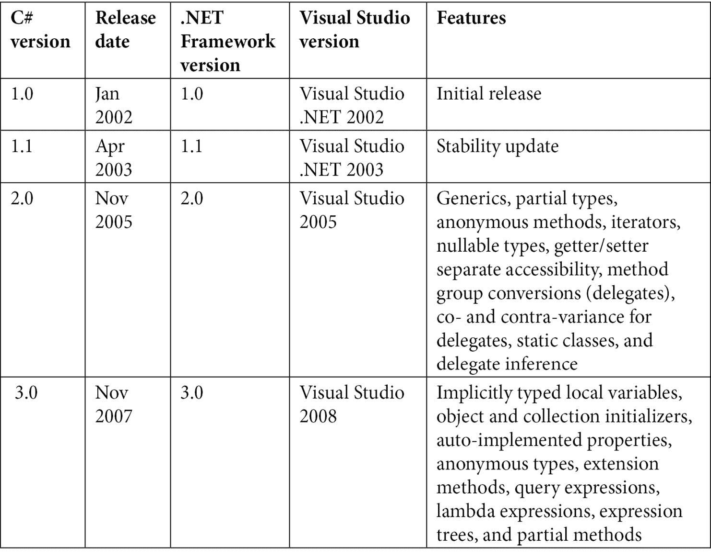
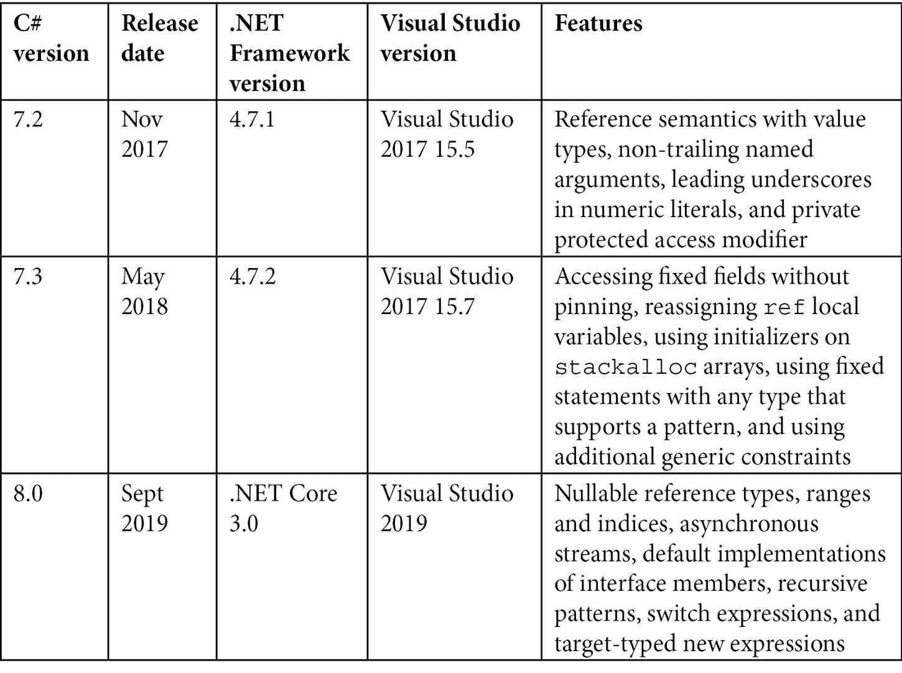
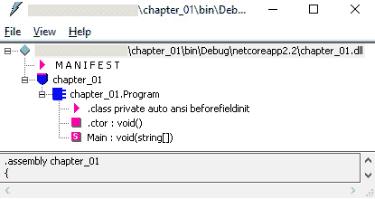
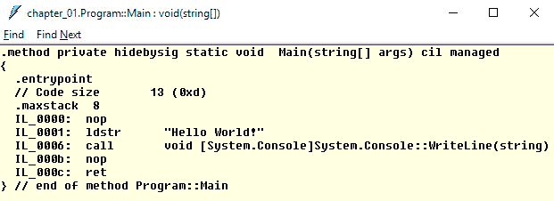
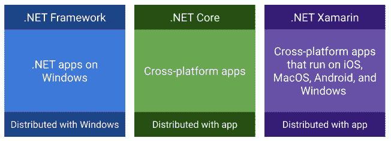
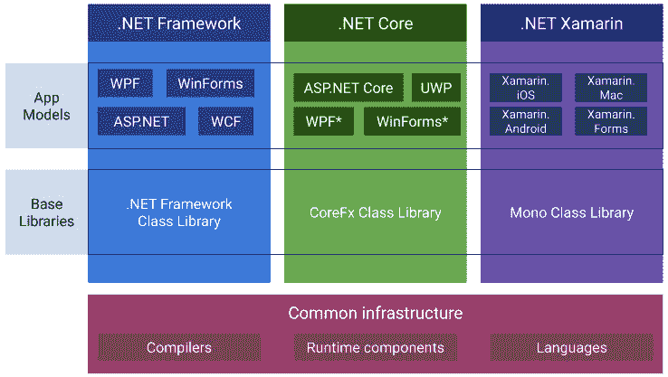
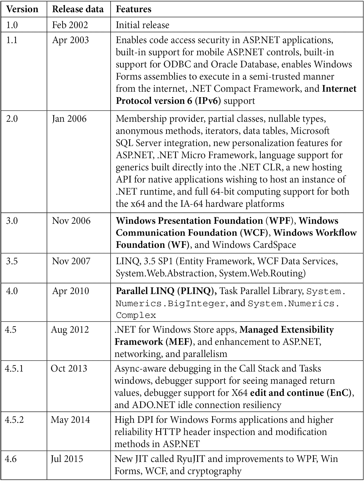
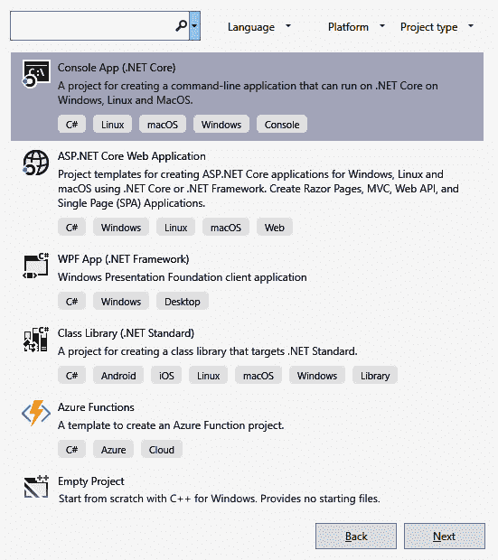
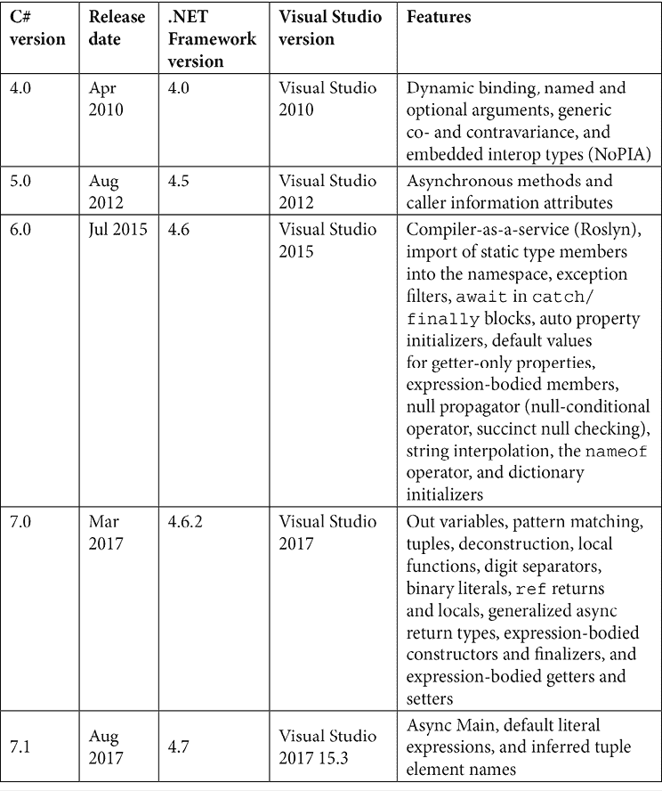

# 第一章：从 C#的基本构建块开始

C#是最广泛使用的通用编程语言之一。它是一种多范式语言，结合了面向对象、命令式、声明式、函数式、泛型和动态编程。C#是为**公共语言基础设施**（**CLI**）平台设计的编程语言之一，这是由微软开发并由**国际标准化组织**（**ISO**）和**欧洲计算机制造商协会**（**ECMA**）标准化的开放规范，描述了可在不同计算机平台上使用的可执行代码和运行时环境，而无需为特定架构重新编写。

多年来，C#随着版本的发布而不断演进，引入了强大的功能。最近的版本（在撰写本文时）是 C# 8，它引入了几个功能，使开发人员能够更加高效。这些功能包括可空引用类型、范围和索引、异步流、接口成员的默认实现、递归模式、开关表达式等。您将在*第十五章*中详细了解这些功能，*C# 8 的新功能*。

在本章中，我们将向您介绍语言、.NET Framework 以及围绕它们的基本概念。我们将本章的内容结构化如下：

+   了解 C#的历史

+   理解 CLI

+   了解.NET 框架家族

+   .NET 中的程序集

+   理解 C#程序的基本结构

在本章结束时，您将学会如何在 C#中编写一个`Hello World!`程序。

# C#的历史

C#的开发始于 1990 年代末的微软团队，由 Anders Hejlsberg 领导。最初它被称为 Cool，但当.NET 项目在 2002 年夏天首次公开宣布时，语言被重新命名为 C#。使用井号后缀的用意是表示该语言是 C++的一个增量，C++与 Java、Delphi 和 Smalltalk 一起，为 CLI 和 C#语言设计提供了灵感。

C#的第一个版本称为**1.0**，于 2002 年与.NET Framework 1.0 和 Visual Studio .NET 2002 捆绑发布。从那时起，随着新版本的.NET Framework 和 Visual Studio 的发布，语言的主要和次要增量版本也相继发布。以下表格列出了所有版本以及每个版本的一些关键功能：



在撰写本文时，最新版本的语言是 8.0，它将与.NET Core 3.0 一起发布。虽然大多数功能也适用于针对.NET Framework 的项目，但其中一些功能不适用，因为它们需要对运行时进行更改，而微软将不再这样做，因为.NET Framework 正在被淘汰，取而代之的是.NET Core。

现在您已经了解了 C#语言随时间的演变概况，让我们开始看一下语言所针对的平台。

# 理解 CLI

CLI 是一项规范，描述了运行时环境如何在不同计算机平台上使用，而无需为特定架构重新编写。它由微软开发，并由 ECMA 和 ISO 标准化。以下图示显示了 CLI 的高级功能：


图 1.1 - CLI 的高级功能图示

CLI 使得用各种编程语言（符合 CLS 的）编写的程序可以在任何操作系统上以及单个运行时上执行。CLI 指定了一个通用语言，称为**公共语言规范（CLS）**，任何语言必须支持的一组通用数据类型，称为**公共类型系统**，以及其他一些内容，例如异常处理和状态管理方式。CLI 指定的各个方面在以下各节中有更详细的描述。

信息框

由于本章的范围有限，深入研究规范是不可能的。如果您想了解更多关于 CLI 的信息，可以访问 ISO 网站[`www.iso.org/standard/58046.html`](https://www.iso.org/standard/58046.html)。

CLI 有几种实现，其中最重要的是.NET Framework、.NET Core 和 Mono/Xamarin。

## 公共类型系统（CTS）

CTS 是 CLI 的一个组成部分，描述了类型定义和值的表示以及内存的用途，旨在促进数据在编程语言之间的共享。以下是 CTS 的一些特点和功能：

+   它实现了跨平台集成、类型安全和高性能代码执行。

+   它提供了一个支持许多编程语言完整实现的面向对象模型。

+   它为语言提供规则，以确保不同编程语言中编写的对象和数据类型可以相互交互。

+   它定义了类型可见性和对成员的访问规则。

+   它定义了类型继承、虚拟方法和对象生命周期的规则。

CTS 支持两类类型：

+   **值类型**：这些类型直接包含其数据，并具有复制语义，这意味着当此类型的对象被复制时，其数据也被复制。

+   **引用类型**：这些类型包含对数据存储的内存地址的引用。当引用类型的对象被复制时，复制的是引用而不是它指向的数据。

尽管这是一个实现细节，值类型通常存储在堆栈上，引用类型存储在堆上。值类型和引用类型之间的转换是可能的，称为**装箱**，而反之则称为**拆箱**。这些概念将在下一章中进一步详细解释。

## 公共语言规范（CLS）

CLS 包括一组规则，任何针对 CLI 的语言都需要遵守这些规则，以便与其他符合 CLS 的语言进行互操作。CLS 规则属于 CTS 的更广泛规则，因此可以说 CLS 是 CTS 的子集。除非 CLS 规则更严格，否则所有 CTS 规则都适用于 CLS。使代码的类型安全性难以验证的语言构造被排除在 CLS 之外，以便所有与 CLS 一起工作的语言都可以生成可验证的代码。

CTS 与 CLS 之间的关系以及针对 CLI 的编程语言在以下图表中概念上显示：


图 1.2 - 显示 CTS 和 CLS 之间的概念关系以及针对 CLI 的编程语言

仅使用 CLS 规则构建的组件称为**CLS 兼容**。这样的组件的一个例子是需要在.NET 上支持的所有语言中工作的框架库。

## 公共中间语言（CIL）

CIL 是一个平台中立的中间语言（以前称为**Microsoft 中间语言**或**MSIL**），代表了 CLI 定义的中间语言二进制指令集。它是一种基于堆栈的面向对象的汇编语言，代表了以字节码格式的代码。

一旦应用程序的源代码被编译，编译器将其转换为 CIL 字节码并生成 CLI 程序集。当执行 CLI 程序集时，字节码通过**即时编译器**传递，生成本机代码，然后由计算机的处理器执行。CIL 的 CPU 和平台无关性使得代码可以在支持 CLI 的任何环境上执行。

为了帮助我们理解 CIL，让我们看一个例子。以下列表显示了一个非常简单的 C#程序，它向控制台打印`Hello, World!`消息：

```cs
using System;
namespace chapter_01
{
   class Program
   {
      static void Main(string[] args)
      {
         Console.WriteLine("Hello World!");
      }
   }
}
```

可以使用各种实用工具查看编译器生成的程序集的内容，例如.NET Framework 附带的`ildasm.exe`或 ILSpy，后者是一个开源的.NET 程序集浏览器和反编译器（可在[`www.ilspy.net/`](http://www.ilspy.net/)上找到）。`ildasm.exe`文件显示了程序及其组件（如类和成员）的可视化表示：



图 1.3 - ildasm 工具显示程序集内容的屏幕截图

如果双击它，还可以看到清单的内容（包括程序集元数据）以及每个方法的 CIL 代码。以下屏幕截图显示了`Main`方法的反汇编代码：



图 1.4 - ildasm 工具显示 Main 方法的 IL 代码的屏幕截图

CIL 代码的可读性转储也是可用的。这从清单开始，然后继续类成员的声明。以下是前面程序的 CIL 代码的部分列表：

```cs
// Metadata version: v4.0.30319
.assembly extern System.Runtime
{
  .publickeytoken = (B0 3F 5F 7F 11 D5 0A 3A )                         // .?_....:
  .ver 4:2:1:0
}
.assembly extern System.Console
{
  .publickeytoken = (B0 3F 5F 7F 11 D5 0A 3A )                         // .?_....:
  .ver 4:1:1:0
}
.assembly chapter_01
{
}
.module chapter_01.dll
// MVID: {1CFF5587-0C75-4C14-9BE5-1605F27AE750}
.imagebase 0x00400000
.file alignment 0x00000200
.stackreserve 0x00100000
.subsystem 0x0003       // WINDOWS_CUI
.corflags 0x00000001    //  ILONLY
// Image base: 0x00F30000
// =============== CLASS MEMBERS DECLARATION ===================
.class private auto ansi beforefieldinit chapter_01.Program
       extends [System.Runtime]System.Object
{
  .method private hidebysig static void  Main(string[] args) cil managed
  {
    .entrypoint
    // Code size       13 (0xd)
    .maxstack  8
    IL_0000:  nop
    IL_0001:  ldstr      "Hello World!"
    IL_0006:  call       void [System.Console]System.Console::WriteLine(string)
    IL_000b:  nop
    IL_000c:  ret
  } // end of method Program::Main
  .method public hidebysig specialname rtspecialname 
          instance void  .ctor() cil managed
  {
    // Code size       8 (0x8)
    .maxstack  8
    IL_0000:  ldarg.0
    IL_0001:  call       instance void [System.Runtime]System.Object::.ctor()
    IL_0006:  nop
    IL_0007:  ret
  } // end of method Program::.ctor
} // end of class chapter_01.Program
```

这里对代码的解释超出了本章的范围，但你可能一眼就能识别出其中的部分，比如类、方法以及每个方法中执行的指令。

## 虚拟执行系统（VES）

VES 是 CLI 的一部分，代表提供执行托管代码的环境的运行时系统。它具有几个内置服务，以支持代码的执行和异常处理等功能。

公共语言运行时是.NET Framework 对虚拟执行系统的实现。CLI 的其他实现提供了它们自己的 VES 实现。

# .NET 框架家族

.NET 是由微软开发的通用开发平台，用于编写各种类型的桌面、云和移动应用程序。.NET Framework 是 CLI 的第一个实现，但随着时间的推移，已经创建了一系列其他框架，如.NET Micro Framework、.NET Native 和 Silverlight。虽然.NET Framework 适用于 Windows，但其他当前的实现，如.NET Core 和 Mono/Xamarin，是跨平台的，可以在其他操作系统上运行，如 Linux、macOS、iOS 或 Android。

以下屏幕截图显示了当前顶级.NET 框架的主要特征。.NET Framework 用于开发 Windows 的.NET 应用程序，并随操作系统分发。.NET Core 是跨平台和开源的，针对现代应用程序需求和开发人员工作流程进行了优化，并随应用程序分发。Xamarin 使用基于 Mono 的运行时，也是跨平台和开源的。它用于开发 iOS、macOS、Android 和 Windows 的移动应用程序，并随应用程序分发：



图 1.5 - 具有最重要的.NET 框架主要特征的图表

所有这些实现都基于一个共同的基础设施，包括语言、编译器和运行时组件，并支持各种应用模型，其中一些显示在以下截图中：



图 1.6 - .NET 框架基础设施和它们支持的应用模型的高级图表

在这里，您可以看到每个框架都位于共同基础设施的顶部，并提供一组基本库以及不同的应用模型。

## .NET 框架

.NET 框架是 CLI 的第一个实现。它是 Windows 服务器和客户端开发人员的主要开发平台。它包含一个支持许多类型应用程序的大型类库。该框架作为操作系统的一部分分发，因此新版本通过**Windows Update**进行更新，尽管也提供独立的安装程序。最初，.NET 框架是由微软开发的专有软件。近年来，.NET 框架的部分内容已经开源。

以下表格显示了.NET 框架的历史，以及每个版本中可用的主要功能：



在未来，微软打算将所有.NET 框架统一为一个。在撰写本书时，计划将其命名为.NET 5。

.NET 框架包括**公共语言运行时**（**CLR**），它是框架的执行引擎，提供诸如内存管理、类型安全、垃圾回收、异常处理、线程管理等服务。它还包括 CLI 基础标准库的实现。以下是标准库的组件列表（尽管不是全部）：

+   **基础类库**（**BCL**）：它提供用于表示 CLI 内置类型、简单文件访问、自定义属性、字符串处理、格式化、集合、流等的类型。

+   **运行时基础设施库**：它提供从流中动态加载类型以及其他允许编译器针对 CLI 的服务。

+   **反射库**：它提供使得在运行时检查类型结构、实例化对象和调用方法成为可能的服务。

+   **网络库**：它提供网络服务。

+   **扩展数值库**：它提供对浮点和扩展精度数据类型的支持。

+   **并行库**：它提供简单形式的并行性。

除了这些库，还有`System.*`或`Microsoft.*`命名空间。

在.NET 平台上开发 C#的一个关键方面是内存管理。一般来说，开发人员不必担心对象的生命周期和内存的释放。内存管理由 CLR 通过**垃圾回收器**（**GC**）自动完成。GC 处理堆上对象的分配和在堆对象不再使用时的内存释放。

垃圾回收是一个*非确定性的过程*，因为它是根据需要进行的，而不是在某些确定的时刻进行的。有关垃圾回收工作方式的详细描述，请参阅*第九章*，*资源管理*。

## .NET Core

.NET Core 是 CLI 的新实现，它是跨平台的、开源的和模块化的。它旨在开发各种应用程序，如运行在 Windows、Linux 和 macOS 上的 Web 应用程序、微服务、库或控制台应用程序。.NET Core 框架使用 NuGet 打包；因此，它要么直接编译到应用程序中，要么放入应用程序内的文件夹中。因此，.NET Core 应用程序直接分发框架组件，尽管从 2.0 版本开始，也提供了一个用于集中部署的缓存系统，称为**运行时包存储**。

.NET Core 的 VES 实现称为**CoreCLR**。同样，CLI 基础标准库的实现称为**CoreFX**。

ASP.NET Core 是.NET Core 的一部分，但也可以在.NET Framework CLR 上运行。但是，当目标是.NET Core 时，ASP.NET Core 应用程序才是跨平台的。

随着 2019 年 9 月发布的 3.0 版本，开发人员可以使用.NET Core 创建 Web 应用程序、微服务、桌面应用程序、机器学习和人工智能应用程序、物联网应用程序、库和控制台应用程序。

您将在*第十六章*中了解更多关于.NET Core 的信息，*使用.NET Core 3 进行 C#编程*。

## Xamarin

Xamarin 是基于**Mono**的 CLI 实现，它是一个跨平台的开源.NET 框架。一般来说，Mono API 遵循了.NET Framework 的进展，而不是.NET Core。该框架旨在编写可以在 iOS、Android、macOS 和 Windows 设备上运行的移动应用程序。

使用 Xamarin 开发的应用程序是*本机*的，提供了与使用 Objective-C 或 Swift 开发的 iOS 和 Java 或 Kotlin 开发的 Android 应用程序类似的性能。Xamarin 还提供了直接调用 Objective-C、Java、C 和 C++库的功能。

Xamarin 应用程序是用 C#编写的，并使用.NET 基类库。它们可以共享大部分代码，只需要少量特定于平台的代码。

有关 Xamarin 的详细信息超出了本书的范围。如果您想了解更多关于这个实现的信息，您应该使用其他资源。

# .NET 中的程序集

程序集是部署、版本控制和安全性的基本单位。程序集有两种形式，要么是`.exe`，要么是`.dll`。程序集是类型、资源和元信息的集合，形成一个逻辑功能单元。只有在需要时，程序集才会加载到内存中。对于.NET Framework 应用程序，程序集可以位于应用程序私有文件夹中，也可以共享在全局程序集缓存中，只要它们是强命名的。对于.NET Core 应用程序，后一种解决方案不可用。

每个程序集都包含一个包含以下信息的清单：

+   程序集的身份（如名称和版本）

+   文件表描述了组成程序集的文件，例如其他程序集或资源（如图像）

+   包含应用程序所需的外部依赖项的程序集引用列表

一个程序集的身份由几个部分组成：

+   文件的**名称**，其中名称应符合 Windows 可移植可执行文件格式

+   一个`major.minor.build.revision`，例如 1.12.3.0

+   **文化**，除了卫星程序集（这些是区域感知的程序集）外，应该是与区域无关的

+   **公钥标记**，它是用于签署程序集的私钥的 64 位哈希；签名程序集具有旨在提供唯一名称的强名称

您将在*第十一章*中了解更多关于程序集的信息，*反射和动态编程*。

## 全局程序集缓存（GAC）

如前一节所述，.NET Framework 程序集可以存储在*本地*，即应用程序文件夹中，也可以存储在*GAC*中。这是一个机器范围的代码缓存，可以在应用程序之间共享程序集。自.NET Framework 4 发布以来，GAC 的默认位置是`%windir%\Microsoft.NET\assembly`；然而，以前的位置是`%windir%\assembly`。GAC 还可以存储同一程序集的多个版本，而在私有文件夹中实际上是不可能的，因为您不能在同一文件夹中存储多个同名文件。

要将程序集部署到 GAC，您可以使用名为`gacutil.exe`的 Windows SDK 实用工具或能够与 GAC 一起工作的安装程序。但是，程序集必须具有强名称才能部署到 GAC。一个`sn.exe`）。

注意

有关如何对程序集进行签名的更多详细信息，请参阅以下文档，其中描述了如何使用强名称对程序集进行签名：[`docs.microsoft.com/en-us/dotnet/framework/app-domains/how-to-sign-an-assembly-with-a-strong-name`](https://docs.microsoft.com/en-us/dotnet/standard/assembly/sign-strong-name)。

将程序集添加到 GAC 时，将对程序集中包含的所有文件执行完整性检查。这样做是为了确保程序集没有被篡改。加密签名确保对程序集中任何文件的更改都会使签名无效，只有拥有私钥访问权限的人才能重新对程序集进行签名。

## 运行时包存储

GAC 不用于.NET Core 程序集。这些程序集可以在任何平台上运行，而不仅仅是 Windows。在.NET Core 2.0 之前，部署的唯一选项是应用程序文件夹。然而，自 2.0 版本以来，可以将应用程序打包并部署到目标环境中已知的一组包中。这样可以实现更快的部署和更低的磁盘空间要求。通常，此存储库在 macOS 和 Linux 上可用于`/usr/local/share/dotnet/store`，在 Windows 上可用于`C:/Program Files/dotnet/store`。

运行时包存储中可用的包列在目标清单文件中，该文件在发布应用程序时使用。此文件的格式与项目文件格式（`.csproj`）兼容。

详细介绍定位过程超出了本章的范围，但您可以通过访问以下链接了解有关运行时包存储的更多信息：[`docs.microsoft.com/en-us/dotnet/core/deploying/runtime-store`](https://docs.microsoft.com/en-us/dotnet/core/deploying/runtime-store)。

# 了解 C#程序的基本结构

到目前为止，我们已经了解了 C#和.NET 运行时的基础知识。在本节中，我们将编写一个简单的 C#程序，以便简要介绍一些简单程序的关键要素。

在编写程序之前，您必须创建一个项目。为此，您应该使用 Visual Studio 2019；或者，您可以在本书的大部分内容中使用任何其他版本。本书附带的源代码是在 Visual Studio 2019 中使用.NET Core 项目编写的。创建新项目时，选择`chapter_01`：



图 1.7 - 在 Visual Studio 中创建新项目时选择控制台应用程序(.NET Core)模板

将自动为您创建具有以下内容的项目：


图 1.8 - Visual Studio 的屏幕截图和所选模板生成的代码

这段代码代表了一个 C#程序必须包含的最小内容：一个包含一个名为`Main`的方法的单个文件。您可以编译和运行该项目，控制台将显示消息**Hello World!**。然而，为了更好地理解它，让我们看一下实际的 C#程序。

程序的第一行（`using System;`）声明了我们想在这个程序中使用的命名空间。命名空间包含类型，这里使用的是基类库的核心命名空间。

在下一行，我们定义了自己的命名空间，名为`chapter_01`，其中包含我们的代码。命名空间是用`namespace`关键字引入的。在这个命名空间中，我们定义了一个名为`Program`的类。类是用`class`关键字引入的。此外，这个类包含一个名为`Main`的方法，它有一个名为`args`的字符串数组参数。命名空间、类型（无论是类、结构、接口还是枚举）和方法中的代码总是用大括号`{}`提供。这个方法是程序的入口点，这意味着程序的执行从这里开始。一个 C#程序必须有且只有一个`Main`方法。

`Main`方法包含一行代码。它使用`System.Console.WriteLine`静态方法将文本打印到控制台。静态方法是属于类型而不是类型的实例的方法，这意味着您不通过对象调用它。`Main`方法本身是一个静态方法，而且是一个特殊的方法。每个 C#程序必须有一个名为`Main`的静态方法，它被认为是程序的入口点，在程序执行开始时首先被调用。

在接下来的章节中，我们将学习命名空间、类型、方法和 C#的其他关键特性。

# 总结

在本章中，我们简要介绍了 C#的历史。然后，我们探讨了 CLI 背后的基本概念及其组成部分，如 CTS、CLS、CIL 和 VES。接着，我们了解了.NET 框架家族，并简要讨论了.NET Framework、.NET Core 和 Xamarin。我们还谈到了程序集、GAC（针对.NET Framework）和运行时包存储（针对.NET Core）。最后，我们编写了我们的第一个 C#程序，并了解了它的结构。

这些框架和运行时的概述将帮助您了解编写和执行 C#程序的背景，并在我们讨论更高级功能（如反射、程序集加载）或研究.NET Core 框架时提供良好的背景知识。

在下一章中，我们将探讨 C#中的基本数据类型和运算符，并学习如何使用它们。

# 测试你所学到的知识

1.  C#是何时首次发布的，目前的语言版本是多少？

1.  什么是公共语言基础设施？它的主要组成部分是什么？

1.  什么是公共中间语言，它与即时编译器有什么关系？

1.  您可以使用什么工具来反汇编和探索编译器生成的程序集？

1.  什么是公共语言运行时？

1.  什么是基类库？

1.  目前主要的.NET 框架是什么？哪一个将不再开发？

1.  什么是程序集？程序集的标识包括什么？

1.  什么是全局程序集缓存？运行时包存储又是什么？

1.  一个 C#程序必须包含什么最少才能执行？


