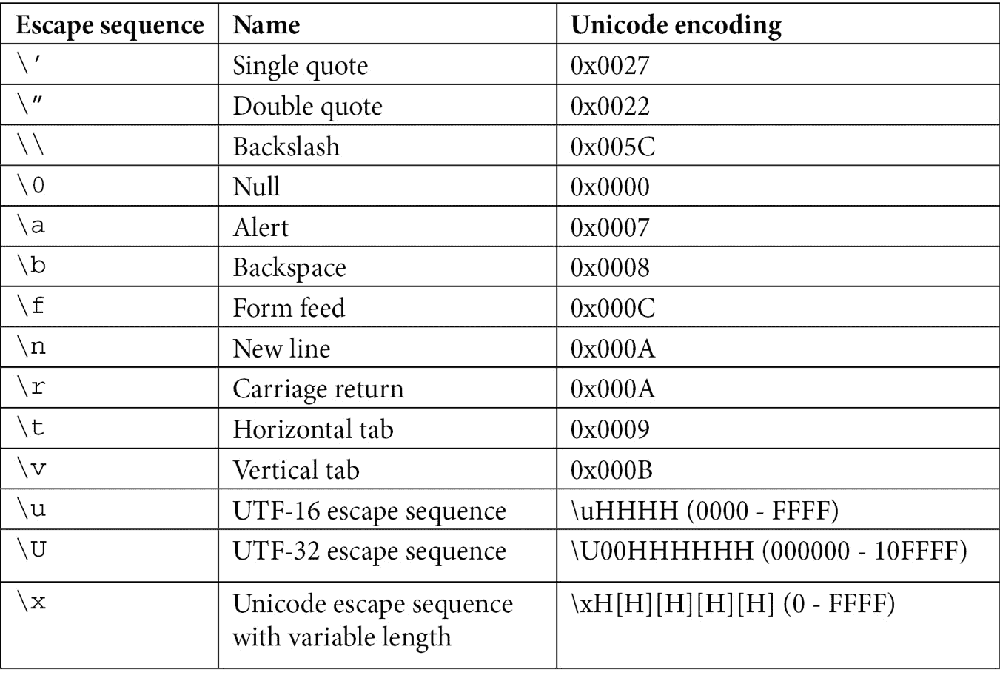
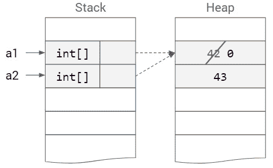
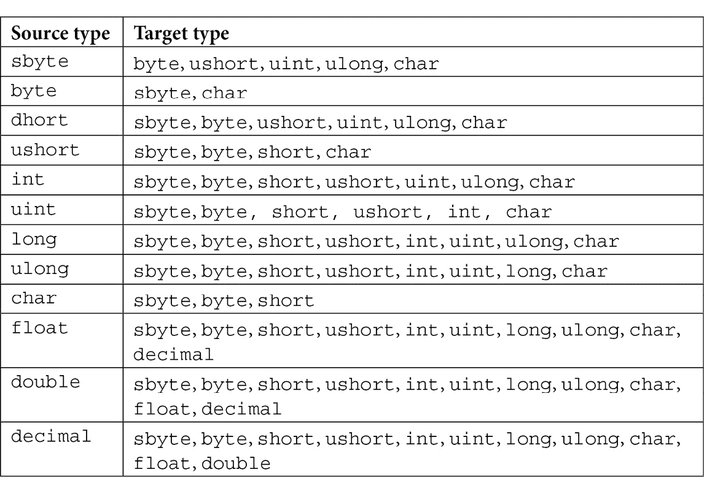
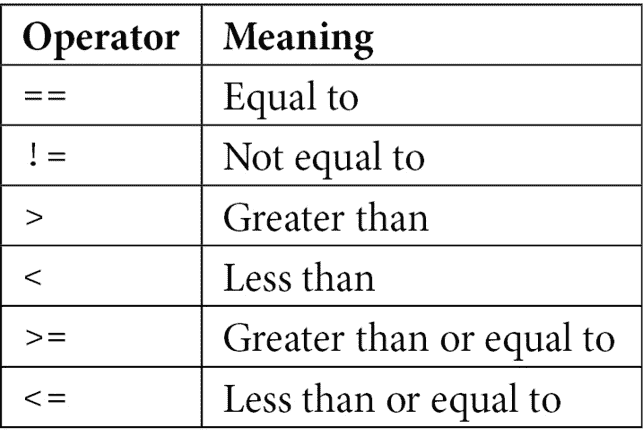
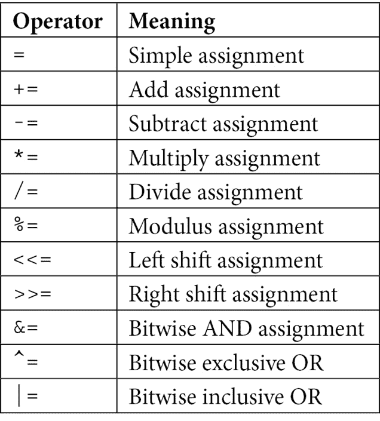

# 第二章：数据类型和运算符

在上一章中，我们了解了.NET Framework 并理解了 C#程序的基本结构。在本章中，我们将学习 C#中的数据类型和对象。除了控制语句，我们将在下一章中探讨，这些是每个程序的构建块。我们将讨论内置数据类型，解释值类型和引用类型之间的区别，并学习如何在类型之间进行转换。随着我们的学习，我们还将讨论语言定义的运算符。

本章将涵盖以下主题：

+   基本内置数据类型

+   变量和常量

+   引用类型和值类型

+   可空类型

+   数组

+   类型转换

+   运算符

通过本章结束时，您将能够使用上述语言特性编写一个简单的 C#程序。

# 基本数据类型

在这一部分，我们将探讨基本数据类型。`System`命名空间。然而，它们都有*C#别名*。这些别名是 C#语言中的关键字，这意味着它们只能在它们指定的上下文中使用，而不能在其他地方使用，比如变量、类或方法名。C#名称和.NET 名称以及每种类型的简短描述列在以下表中（按 C#名称字母顺序列出）：


此表中列出的类型称为**简单类型**或**原始类型**。除了这些，还有两种内置类型：


让我们在接下来的章节中详细探讨所有原始类型。 

## 整数类型

C#支持表示各种整数范围的八种整数类型。它们的位数和范围如下表所示：


如前表所示，C#定义了有符号和无符号整数类型。有符号和无符号整数之间的主要区别在于高阶位的读取方式。对于有符号整数，高阶位被视为符号标志。如果符号标志为 0，则数字为正数，但如果符号标志为 1，则数字为负数。

所有整数类型的默认值都是 0。所有这些类型都定义了两个常量，称为`MinValue`和`MaxValue`，它们提供了类型的最小值和最大值。

整数字面值，即直接出现在代码中的数字（如 0、-42 等），可以指定为十进制、十六进制或二进制字面值。十进制字面值不需要任何后缀。十六进制字面值以`0x`或`0X`为前缀，二进制字面值以`0b`或`0B`为前缀。下划线（`_`）可以用作所有数字字面值的数字分隔符。此类字面值的示例如下片段所示：

```cs
int dec = 32;
int hex = 0x2A;
int bin = 0b_0010_1010;
```

编译器推断没有后缀的整数值为`int`。要表示长整数，使用`l`或`L`表示有符号 64 位整数，使用`ul`或`UL`表示无符号 64 位整数。

## 浮点类型

浮点类型用于表示具有小数部分的数字。C#定义了两种浮点类型，如下表所示：


`float`类型表示 32 位单精度浮点数，而`double`表示 64 位双精度浮点数。这些类型是**IEEE 浮点算术标准（IEEE 754）**的实现，这是**电气和电子工程师学会（IEEE）**在 1985 年制定的浮点算术标准。

浮点类型的默认值是 0。这些类型还定义了两个常量，称为 `MinValue` 和 `MaxValue`，提供类型的最小值和最大值。然而，这些类型还提供了表示非数字（`System.Double.NaN`）和无穷大（`System.Double.NegativeInfinity` 和 `System.Double.PositiveInfinity`）的常量。下面的代码列表显示了用浮点值初始化的几个变量：

```cs
var a = 42.99;
float b = 19.50f;
System.Double c = -1.23;
```

默认情况下，非整数数字如 `42.99` 被视为双精度。如果要将其指定为浮点类型，则需要在值后加上 `f` 或 `F` 字符，如 `42.99f` 或 `42.99F`。另外，也可以使用 `d` 或 `D` 后缀来明确指定双精度字面量，如 `42.99d` 或 `42.99D`。

浮点类型将小数部分存储为二的倒数。因此，它们只能表示精确值，如 `10`、`10.25`、`10.5` 等。其他数字，如 `1.23` 或 `19.99`，无法精确表示，只是一个近似值。即使 `double` 有 15 位小数精度，而 `float` 只有 7 位，但在执行重复计算时，精度损失开始积累。

这使得 `double` 和 `float` 在某些类型的应用中难以使用，甚至不合适，比如金融应用，其中精度很重要。为此，提供了 `decimal` 类型。

## 十进制类型

`decimal` 类型最多可以表示 28 位小数。`decimal` 类型的详细信息如下表所示：


十进制类型的默认值是 0。还有定义了类型的最小值和最大值的 `MinValue` 和 `MaxValue` 常量。十进制字面量可以使用 `m` 或 `M` 后缀来指定，如下面的片段所示：

```cs
decimal a = 42.99m;
var b = 12.45m;
System.Decimal c = 100.75M;
```

需要注意的是，`decimal` 类型可以最小化舍入误差，但并不能消除对舍入的需求。例如，`1m / 3 * 3` 的操作结果不是 1，而是 `0.9999999999999999999999999999`。另一方面，`Math.Round(1m / 3 * 3)` 得到的值是 1。

`decimal` 类型适用于需要精度的应用程序。浮点数和双精度是更快的类型（因为它们使用二进制数学，计算速度更快），而 `decimal` 类型较慢（顾名思义，它使用十进制数学，计算速度较慢）。`decimal` 类型可能比 `double` 类型慢一个数量级。金融应用程序是 `decimal` 类型的典型用例，其中小的不准确性可能在重复计算中积累成重要的值。在这种应用中，速度不重要，但精度很重要。

## 字符类型

字符类型用于表示 16 位 Unicode 字符。Unicode 定义了一个字符集，旨在表示世界上大多数语言的字符。字符用单引号括起来表示（`''`）。例如，`'A'`、`'B'`、`'c'` 和 `'\u0058'`：


字符值可以是字面量、十六进制转义序列（形式为 `'\xdddd'`），或者具有形式 `'\udddd'` 的 Unicode 表示（其中 `dddd` 是一个十六进制值）。下面的列表显示了几个示例：

```cs
char a = 'A';
char b = '\x0065';
char c = '\u15FE';
```

`char` 类型的默认值是十进制 0，或其等价值 `'\0'`、`'\x0000'` 或 `'\u0000'`。

## 布尔类型

C# 使用 `bool` 关键字来表示布尔类型。它可以有两个值，`true` 或 `false`，如下表所示：


布尔类型的默认值是 `false`。与其他语言（如 C++）不同，整数值或任何其他值不会隐式转换为 `bool` 类型。布尔变量可以被赋予布尔字面量（`true` 或 `false`）或求值为 `bool` 的表达式。

## 字符串类型

字符串是字符数组。在 C#中，表示字符串的类型称为`string`，它是.NET`System.String`的别名。您可以互换使用这两种类型。在内部，字符串包含一个只读的`char`对象集合。这使得字符串是不可变的，这意味着您不能更改字符串，但需要每次修改现有字符串的内容时创建一个新的字符串。字符串不是*以 null 结尾*（与其他语言如 C++不同），可以包含任意数量的空字符(`'\0'`)。字符串长度将包含`char`对象的总数。

字符串可以以各种方式声明和初始化，如下所示：

```cs
string s1;                       // unitialized
string s2 = null;                // initialized with null
string s3 = String.Empty;        // empty string
string s4 = "hello world";       // initialized with text
var s5 = "hello world";
System.String s6 = "hello world";
char[] letters = { 'h', 'e', 'l', 'l', 'o'};
string s7 = new string(letters); // from an array of chars
```

重要的是要注意，唯一需要使用`new`运算符创建字符串对象的情况是当您从字符数组初始化它时。

如前所述，字符串是不可变的。虽然您可以访问字符串的字符，但您可以读取它们，但不能更改它们：

```cs
char c = s4[0];  // OK
s4[0] = 'H';     // error
```

以下是似乎修改字符串的方法：

+   `Remove()`: 这会删除字符串的一部分。

+   `ToUpper()`/`ToLower()`: 这将所有字符转换为大写或小写。

这些方法都不会修改现有字符串，而是返回一个新的字符串。

在下面的示例中，`s6`是之前定义的字符串，`s8`将包含`hello`，`s9`将包含`HELLO WORLD`，而`s6`将继续包含`hello world`：

```cs
var s8 = s6.Remove(5);       // hello
var s9 = s6.ToUpper();       // HELLO WORLD
```

您可以使用`ToString()`方法将任何内置类型，如整数或浮点数，转换为字符串。这实际上是`System.Object`类型的虚拟方法，即任何.NET 类型的基类。通过重写此方法，任何类型都可以提供一种将对象序列化为字符串的方法：

```cs
int i = 42;
double d = 19.99;
var s1 = i.ToString();
var s2 = d.ToString();
```

字符串可以以几种方式组成：

+   可以使用连接运算符`+`来完成。

+   使用`Format()`方法：此方法的第一个参数是格式，在其中每个参数都用花括号中指定的索引位置表示，例如`{0}`，`{1}`，`{2}`等。指定超出参数数量的索引会导致运行时异常。

+   使用字符串插值，这实际上是使用`String.Format()`方法的一种语法快捷方式：字符串必须以`$`为前缀，并且参数直接在花括号中指定。

这里显示了所有这些方法的示例：

```cs
int i = 42;
string s1 = "This is item " + i.ToString();
string s2 = string.Format("This is item {0}", i);
string s3 = $"This is item {i}";
```

一些字符具有特殊含义，并以反斜杠(`\`)为前缀。这些称为转义序列。以下表列出了所有这些转义序列：



在某些情况下，需要使用转义序列，例如当指定 Windows 文件路径或需要生成多行文本时。以下代码显示了使用转义序列的几个示例：

```cs
var s1 = "c:\\Program Files (x86)\\Windows Kits\\";
var s2 = "That was called a \"demo\"";
var s3 = "This text\nspawns multiple lines.";
```

但是，您可以通过使用逐字字符串来避免使用转义序列。这些字符串以`@`符号为前缀。当编译器遇到这样的字符串时，它不会解释转义序列。如果要在使用逐字字符串时在字符串中使用引号，必须将其加倍。以下示例显示了使用逐字字符串重写的前面的示例：

```cs
var s1 = @"c:\Program Files (x86)\Windows Kits\";
var s2 = @"That was called a ""demo""";
var s3 = @"This text
spawns multiple lines.";
```

在 C# 8 之前，如果要在逐字字符串中使用字符串插值，必须首先为字符串插值指定`$`符号，然后为逐字字符串指定`@`。在 C# 8 中，您可以以任何顺序指定这两个符号。

## 对象类型

`object`类型是 C#中所有其他类型的基本类型，即使您没有明确指定，我们将在接下来的章节中看到。C#中的`object`关键字是.NET`System.Object`类型的别名。您可以互换使用这两个。

`object`类型以几种虚拟方法的形式为所有其他类提供一些基本功能，任何派生类都可以覆盖这些方法，如果有必要的话。这些方法列在下表中：


除此之外，`object`类包含几个其他方法。一个重要的方法是`GetType()`方法，它不是虚拟的，并返回一个`System.Type`对象，其中包含有关当前实例类型的信息。

另一个重要的事情要注意的是`Equals()`方法的工作方式，因为它对于引用类型和值类型的行为是不同的。我们还没有涵盖这些概念，但稍后在本章中会详细介绍。暂时要记住的是，对于引用类型，这个方法执行引用相等性；这意味着它检查两个变量是否指向堆上的同一个对象。对于值类型，它执行值相等性；这意味着两个变量是相同类型，并且两个对象的公共和私有字段是相等的。

`object`类型是一个引用类型。`object`类型的变量的默认值是`null`。然而，`object`类型的变量可以被赋予任何类型的任何值。当你将值类型的值赋给`object`时，这个操作被称为**拆箱**。这将在本章的后面部分详细介绍。

你将在本书中更多地了解`object`类型及其方法。

# 变量

变量被定义为一个命名的内存位置，可以赋予一个值。有几种类型的变量，包括以下几种：

+   **局部变量**：这些是在方法内部定义的变量，它们的作用域局限于该方法。

+   **方法参数**：这些是在函数调用期间传递给方法的参数。

+   **类字段**：这些是在类范围内定义的变量，可以被所有类方法访问，并取决于字段对其他类的可访问性。

+   **数组元素**：这些是指向数组中元素的变量。

在本节中，我们将提到局部变量，这些变量是在函数体中声明的。这些变量使用以下语法声明：

```cs
datatype variable_name;
```

在这个语句中，`datatype`是变量的数据类型，`variable_name`是变量的名称。以下是几个例子：

```cs
bool f;
char ch = 'x';
int a, b = 20, c = 42;
a = -1;
f = true;
```

在这个例子中，`f`是一个未初始化的`bool`变量。未初始化的变量不能在任何表达式中使用。这样做将导致编译器错误。所有变量在使用之前必须初始化。变量可以在声明时初始化，比如前面例子中的`ch`、`b`和`c`，也可以在以后的任何时间初始化，比如`a`和`f`。

相同类型的多个变量可以在单个语句中声明和初始化，用逗号分隔。在前面的代码片段中，`int`变量`a`、`b`和`c`就是一个例子。

## 命名约定

有几条规则必须遵循以命名变量：

+   变量名只能由字母、数字和下划线字符（`_`）组成。

+   在命名变量时，不能使用除下划线（`_`）之外的任何特殊字符。因此，*@sample*、*#tag*、*name%*等都是非法的变量名。

+   变量名必须以字母或下划线字符（`_`）开头。变量的名称不能以数字开头。因此，`2small`作为变量名将会引发编译时错误。

+   变量名区分大小写。因此，`person`和`PERSON`被视为两个不同的变量。

+   变量名不能是 C#的任何保留关键字。因此，`true`、`false`、`double`、`float`、`var`等都是非法的变量名。然而，使用`@`前缀使编译器将它们视为标识符而不是关键字。因此，像`@true`、`@return`、`@var`这样的变量名是允许的。这些被称为**逐字标识符**。

+   除了在命名变量时必须遵循的语言规则外，你还应该确保所选择的名称具有描述性且易于理解。你应该始终优先选择这种名称，而不是难以理解的缩写名称。有各种编码规范和命名约定，你应该遵循其中的一种。这有助于保持一致性，并使代码更易于阅读、理解和维护。

在命名约定方面，编写 C#代码时应该遵循以下规则：

+   对于类、结构、枚举、委托、构造函数、方法、属性和常量，使用*帕斯卡命名法*。在帕斯卡命名法中，名称中的每个单词都首字母大写；例如`ConnectionString`、`UserGroup`和`XmlReader`。

+   对于字段、局部变量和方法参数，使用*驼峰命名法*。在驼峰命名法中，名称的第一个单词不大写，但其他单词都大写；例如`userId`、`xmlDocument`和`uiControl`。

+   除了用于私有字段前缀的情况外，不要在标识符中使用*下划线*，例如`_firstName`和`_lastName`。

+   优先选择*描述性名称*而不是缩写。例如，优先选择`labelText`而不是`lbltxt`或`employeeId`而不是`eid`。

你可以通过查阅其他资源了解更多关于 C#编码规范和命名约定的信息。

## 隐式类型的变量

正如我们在之前的例子中看到的，当我们声明变量时，需要指定变量的类型。然而，C#还提供了另一种声明变量的方式，允许编译器根据初始化时赋予的值推断变量的类型。这些被称为**隐式类型的变量**。

我们可以使用`var`关键字创建一个隐式类型的变量。这种变量必须在声明时进行初始化，因为编译器会根据初始化的值推断变量的类型。以下是一个例子：

```cs
var a = 10;
```

由于`a`变量被初始化为整数字面量，编译器将`a`视为`int`类型的变量。

在使用`var`声明变量时，你必须牢记以下事项：

+   隐式类型的变量必须在声明时初始化一个值，否则编译器无法推断变量类型，会导致编译时错误。

+   你不能将其初始化为 null。

+   变量类型一旦声明并初始化后就不能更改。

信息框

`var`关键字不是一种数据类型，而是实际类型的占位符。在声明变量时使用`var`是有用的，当类型名称很长并且你想避免输入大量内容时（例如`Dictionary<string, KeyValuePair<int, string>>`），或者你只关心值而不关心实际类型时。

现在你已经学会了如何声明变量，让我们来看一个关键概念：变量的作用域。

## 理解变量的作用域和生命周期

在 C#中，**作用域**被定义为在开放大括号和对应的闭合大括号之间的代码块。作用域定义了变量的可见性和生命周期。变量只能在其定义的作用域内访问。在特定作用域中定义的变量对该作用域外的代码不可见。

让我们通过一个例子来理解这一点：

```cs
class Program
{
    static void Main(string[] args)
    {
        for (int i = 1; i < 10; i++)
        {
            Console.WriteLine(i);
        }
        i = 20; // i is out of scope
    }
}
```

在这个例子中，`i`变量是在`for`循环内部定义的，因此一旦控制流退出循环，它就超出了作用域，无法在`for`循环外部访问。你将在下一章学习更多关于`for`循环的知识。

我们也可以有嵌套作用域。这意味着在一个作用域中定义的变量可以在包含在该作用域内的另一个作用域中访问。然而，外部作用域的变量对内部作用域可见，但内部作用域的变量在外部作用域中不可访问。C#编译器不允许在一个作用域内创建两个同名的变量。

让我们扩展前面例子中的代码来理解这一点：

```cs
class Program
{
    static void Main(string[] args)
    {
        int a = 5;
        for (int i = 1; i < 10; i++)
        {
            char a = 'w';                 // compiler error
            if (i % 2 == 0)
            {
                Console.WriteLine(i + a); // a is within the 
                                          // scope of Main
            }
        }
        i = 20;                           // i is out of scope
    }
}
```

在这里，整数变量`a`在`for`循环之外定义，但在`Main`的作用域内。因此，它可以在`for`循环内部访问，因为它在此作用域内。然而，在`for`循环内部定义的`i`变量无法在`Main`的作用域内访问。

如果我们尝试在作用域内声明另一个同名变量，将会得到一个编译时错误。因此，我们不能在`for`循环内部声明字符变量`a`，因为我们已经有一个同名的整数变量。

# 理解常量

有一些情况下，我们不希望在初始化后改变变量的值。例如数学常数（π，欧拉数等），物理常数（阿伏伽德罗常数，玻尔兹曼常数等），或任何应用程序特定的常数（最大允许的登录次数，失败操作的最大重试次数，状态码等）。C#为我们提供了常量变量来实现这一目的。一旦定义，常量变量的值在其作用域内不能被改变。如果尝试在初始化后改变常量变量的值，编译器将抛出错误。

要使变量成为常量，我们需要在前面加上`const`关键字。常量变量必须在声明时初始化。下面是一个初始化为`42`的整数常量的例子：

```cs
const int a = 42;
```

重要的是要注意，只有内置类型可以用来声明常量。用户定义的类型不能用于此目的。

# 引用类型和值类型

C#中的数据类型分为值类型和引用类型。这两者之间有一些重要的区别，比如**复制语义**。我们将在接下来的章节中详细讨论这些区别。

## 值类型

值类型的变量直接包含值。当从另一个值类型变量赋值时，存储的值会被复制。我们之前看到的原始数据类型都是值类型。所有使用`struct`关键字声明的用户定义类型都是值类型。尽管所有类型都是隐式从`object`派生的，值类型不支持显式继承，这是*第四章*中讨论的一个主题，*理解各种用户定义类型*。

让我们在这里看一个例子：

```cs
int a = 20;
DateTime dt = new DateTime(2019, 12, 25);
```

值类型通常存储在内存中的堆栈上，尽管这是一个实现细节，而不是值类型的特征。如果将值类型的值赋给另一个变量，那么该值将被复制到新变量中，改变一个变量不会影响另一个变量：

```cs
int a = 20;
int b = a;  // b is 20
a = 42;     // a is 42, b is 20
```

在前面的例子中，`a`的值被初始化为`20`，然后赋给变量`b`。此时，两个变量都包含相同的值。然而，在将值`42`赋给`a`变量后，`b`的值保持不变。这在下面的图表中概念上显示出来：


图 2.1 - 在执行前面代码时堆栈中的变化的概念表示

在这里，你可以看到，最初在堆栈上分配了一个对应于整数`a`的存储位置，并且其值为 20。然后，分配了第二个存储位置，并将第一个的值复制到了第二个存储位置。然后，我们改变了`a`变量的值，因此第一个存储位置中的值也改变了。第二个存储位置保持不变。

## 引用类型

引用类型的变量不直接包含值，而是包含对存储实际值的内存位置的引用。内置数据类型`object`和`string`都是引用类型。数组、接口、委托和任何定义为类的用户定义类型也被称为**引用类型**。以下示例显示了几个不同引用类型的变量：

```cs
int[]  a = new int[10];
string s = "sample";
object o = new List<int>();
```

引用类型存储在堆上。引用类型的变量可以被分配`null`值，表示变量不存储对对象实例的引用。当尝试使用分配了`null`值的变量时，结果是运行时异常。当引用类型的变量被分配一个值时，复制的是对象的实际内存位置的引用，而不是对象本身的值。

在下面的例子中，`a1`是一个包含两个整数的数组。数组的引用被复制到变量`a2`中。当数组的内容发生变化时，通过`a1`和`a2`都可以看到这些变化，因为这两个变量都指向同一个数组：

```cs
int[] a1 = new int[] { 42, 43 };
int[] a2 = a1;   // a2 is { 42, 43 }
a1[0] = 0;       // a1 is { 0, 43 }, a2 is { 0, 43 }
```

这个例子在下面的图中以概念方式解释：



图 2.2 - 在上述片段执行期间堆栈和堆的概念表示

您可以在此图中看到，`a1`和`a2`是堆上分配的相同整数数组的堆栈上的变量。当通过`a1`变量更改数组的第一个元素时，这些更改会自动显示在`a2`变量上，因为`a1`和`a2`指向同一个对象。

尽管`string`类型是引用类型，但它似乎表现不同。看下面的例子：

```cs
string s1 = "help";
string s2 = s1;     // s2 is "help"
s1 = "demo";        // s1 is "demo", s2 is "help"
```

在这里，`s1`用`"help"`字面量初始化，然后将实际数组堆对象的引用复制到变量`s2`中。此时，它们都指向`"help"`字符串。然而，稍后`s1`被分配一个新的字符串`"demo"`。此时，`s2`将继续指向`"help"`字符串。原因是字符串是不可变的。这意味着当您修改一个字符串对象时，将创建一个新的字符串，并且变量将接收对新字符串对象的引用。任何其他引用旧字符串的变量将继续这样做。

## 装箱和拆箱

我们在本章前面简要提到了装箱和拆箱，当我们谈到`object`类型时。装箱是将值类型存储在`object`中的过程，而拆箱是将`object`的值转换为值类型的相反操作。让我们通过一个例子来理解这一点：

```cs
int a = 42;
object o = a;   // boxing
o = 43;
int b = (int)o; // unboxing
Console.WriteLine(x);  // 42
Console.WriteLine(y);  // 43
```

在上述代码中，`a`是一个初始化为值`42`的整数类型的变量。作为值类型，整数值`42`存储在堆栈上。另一方面，`o`是一个`object`类型的变量。这是一个引用类型。这意味着它只包含对存储实际对象的堆内存位置的引用。因此，当`a`分配给`o`时，发生了称为**装箱**的过程。

在堆栈上分配一个对象，将`a`的值（即`42`）复制到该对象中，然后将对该对象的引用分配给变量`o`。当我们稍后将值`43`分配给`o`时，只有装箱对象发生变化，而`a`没有发生变化。最后，我们将由`o`引用的对象的值复制到一个名为`b`的新变量中。这将具有值`43`，并且作为`int`也存储在堆栈上。

这里描述的过程在下面的图中以图形方式显示：


图 2.3 - 显示先前描述的装箱和拆箱过程的堆栈的概念表示

现在您了解了值类型和引用类型之间的区别，让我们来看看可空类型的主题。

# 可空类型

引用类型的默认值是`null`，表示变量未分配给任何对象的实例。值类型没有这样的选项。但是，有些情况下，对于值类型来说，没有值也是有效的值。为了表示这样的情况，可以使用可空类型。

`System.Nullable<T>`是一个泛型值类型，可以表示基础`T`类型的值，该类型只能是值类型，还可以表示额外的`null`值。以下示例展示了一些示例：

```cs
Nullable<int> a;
Nullable<int> b = null;
Nullable<int> c = 42;
```

您可以使用简写语法`T?`来代替`Nullable<T>`；这两者是可以互换的。以下示例是前面示例的替代方案：

```cs
int? a;
int? b = null;
int? c = 42;
```

您可以使用`HasValue`属性来检查可空类型对象是否有值，使用`Value`来访问基础值：

```cs
if (c.HasValue)
    Console.WriteLine(c.Value);
```

以下是一些可空类型的特征列表：

+   您可以像为基础类型赋值一样为可空类型对象赋值。

+   您可以使用`GetValueOrDefault()`方法来获取已分配的值或基础类型的默认值（如果没有分配值）。

+   装箱是在基础类型上执行的。如果可空类型对象没有分配任何值，装箱的结果是一个`null`对象。

+   您可以使用空值合并运算符`??`来访问可空类型对象的值（例如，`int d = c ?? -1;`）。

在 C# 8 中，引入了可空引用类型和非可空引用类型。这是一个您必须在项目属性中选择的功能。它允许您确保只有声明为可空的引用类型对象，使用`T?`语法可以被赋予`null`值。尝试在非可空引用类型上这样做将导致编译器警告（不是错误，因为这可能会影响大量现有代码的部分）：

```cs
string? s1 = null; // OK, nullable type
string s2 = null;  // error, non-nullable type
```

您将在第十五章“C# 8 的新特性”中了解更多关于可空引用类型的内容。

# 数组

数组是一种数据结构，可以容纳相同数据类型的多个值（包括零个或一个）。它是一系列同类元素的固定大小序列，存储在连续的内存位置中。C#中的数组是从零开始索引的，意味着数组的第一个元素的位置是零，最后一个元素的位置是元素总数减一。

数组类型是引用类型，因此数组是在堆上分配的。数值数组的元素的默认值是零，引用类型数组的默认值是`null`。数组的元素类型可以是任何类型，包括另一个数组类型。

C#中的数组可以是一维的、多维的或交错的。让我们详细探讨这些。

## 一维数组

可以使用语法`datatype[] variable_name`来定义一维数组。数组可以在声明时初始化。如果数组变量没有初始化，它的值为`null`。您可以在初始化时指定数组的元素数量，也可以跳过这一步，让编译器从初始化表达式中推断出来。以下示例展示了声明和初始化数组的各种方式：

```cs
int[] arr1;
int[] arr2 = null;
int[] arr3 = new int[6];
int[] arr4 = new int[] { 1, 1, 2, 3, 5, 8 };
int[] arr5 = new int[6] { 1, 1, 2, 3, 5, 8 };
int[] arr6 = { 1, 1, 2, 3, 5, 8 };
```

在这个例子中，`arr1`和`arr2`的值为`null`。`arr3`是一个包含六个整数元素的数组，因为没有提供初始化，所以所有元素都被设置为`0`。`arr4`、`arr5`和`arr6`是包含相同值的六个整数的数组。

初始化后，数组的大小不能改变。如果需要改变，必须创建一个新的数组对象，或者使用可变大小的容器，比如`List<T>`，我们将在第七章“集合”中讨论。

您可以使用索引器或枚举器访问数组的元素。以下代码片段是等价的：

```cs
for(int i = 0; i < arr6.Length; ++i)
 Console.WriteLine(arr6[i]);
foreach(int element in arr6)
 Console.WriteLine(element);
```

尽管这两个循环的效果是相同的，但有一个细微的区别——使用枚举器不允许修改数组的元素。使用索引运算符按索引访问元素确实提供了对元素的写访问权限。使用枚举器是可能的，因为数组类型隐式地从基本类型`System.Array`派生，该类型实现了`IEnumerable`和`IEnumerable<T>`。

这在以下示例中显示：

```cs
for (int i = 0; i < arr6.Length; ++i)
   arr6[i] *= 2;  // OK
foreach (int element in arr6)
   element *= 2;  // error
```

在第一个循环中，我们通过它们的索引访问数组的元素并且可以修改它们。然而，在第二个循环中，使用了一个迭代器，这提供了对元素的只读访问。试图修改它们会产生编译时错误。

## 多维数组

多维数组是具有多个维度的数组。它也被称为**矩形数组**。这可以是一个二维数组（矩阵）或一个三维数组（立方体），最大维数为**32**。

可以使用以下语法定义二维数组：`datatype[,] variable_name;`。多维数组的声明和初始化方式与单维数组类似。您可以指定每个维度的秩（即元素的数量），也可以让编译器从初始化表达式中推断出来。以下代码片段显示了声明和初始化二维数组的不同方式：

```cs
int[,] arr1;
arr1 = new int[2, 3] { { 1, 2, 3 }, { 4, 5, 6 } };
int[,] arr2 = null;
int[,] arr3 = new int[2,3];
int[,] arr4 = new int[,] { { 1, 2, 3 }, { 4, 5, 6 } };
int[,] arr5 = new int[2,3] { { 1, 2, 3 }, { 4, 5, 6 } };
int[,] arr6 = { { 1, 2, 3 }, { 4, 5, 6 } };
```

在这个例子中，`arr1`最初是`null`，然后被赋予一个包含两行三列的数组的引用。同样，`arr2`也是`null`。另一方面，`arr3`、`arr4`、`arr5`和`arr6`都是包含两行三列的数组；`arr3`的所有元素都设置为零，而其他元素则使用指定的值进行初始化。这个例子中的数组具有以下形式：

```cs
1 2 3
4 5 6
```

您可以使用`GetLength()`或`GetLongLength()`方法检索每个维度的元素数量（第一个返回 32 位整数，第二个返回 64 位整数）。以下示例将`arr6`数组的内容打印到控制台：

```cs
for (int i = 0; i < arr6.GetLength(0); ++i)
{
   for (int j = 0; j < arr6.GetLength(1); ++j)
   {
      Console.Write($"{arr6[i, j]} ");
   }
   Console.WriteLine();
}
```

超过两个维度的数组以类似的方式创建和处理。以下示例显示了如何声明和初始化一个*4 x 3 x 2*元素的三维数组：

```cs
int[,,] arr7 = new int[4, 3, 2]
{
    { { 11, 12}, { 13, 14}, {15, 16 } },
    { { 21, 22}, { 23, 24}, {25, 26 } },
    { { 31, 32}, { 33, 34}, {35, 36 } },
    { { 41, 42}, { 43, 44}, {45, 46 } }
};
```

另一种多维数组的形式是所谓的**不规则数组**。我们将在下面学习这个。

## 不规则数组

不规则数组是数组的数组。这些包含其他数组，不规则数组中的每个数组的大小可以不同。例如，我们可以使用语法`datatype [][] variable_name;`声明一个二维不规则数组。以下代码片段显示了声明和初始化不规则数组的各种示例：

```cs
int[][] arr1;
int[][] arr2 = null;
int[][] arr3 = new int[2][];
arr3[0] = new int[3];
arr3[1] = new int[] { 1, 1, 2, 3, 5, 8 };
int[][] arr4 = new int[][]
{
   new int[] { 1, 2, 3 },
   new int[] { 1, 1, 2, 3, 5, 8 }
};
int[][] arr5 =
{
   new int[] { 1, 2, 3 },
   new int[] { 1, 1, 2, 3, 5, 8 }
};
int[][,] arr6 = new int[][,]
{
    new int[,] { { 1, 2}, { 3, 4 } },
    new int[,] { {11, 12, 13}, { 14, 15, 16} }
};
```

在这个例子中，`arr1`和`arr2`都被设置为`null`。另一方面，`arr3`是一个包含两个数组的数组。它的第一个元素被设置为一个包含三个初始化为零的元素的数组；它的第二个元素被设置为一个包含从提供的值初始化的六个元素的数组。

`arr4`和`arr5`数组是等价的，但`arr5`使用了数组初始化的简写语法。`arr6`混合了不规则数组和多维数组。它是一个包含两个数组的数组，第一个数组是一个*2x2*的二维数组，第二个数组是一个*2x3*元素的二维数组。

可以使用`arr[i][j]`语法访问不规则数组的元素（此示例适用于二维数组）。以下代码片段显示了如何打印先前显示的`arr5`数组的内容：

```cs
for(int i = 0; i < arr5.Length; ++i)
{
   for(int j = 0; j < arr5[i].Length; ++j)
   {
      Console.Write($"{arr5[i][j]} ");
   }
   Console.WriteLine();
}
```

现在我们已经看过了在 C#中可以使用的数组类型，让我们转移到另一个重要的主题，即各种数据类型之间的转换。

# 类型转换

有时我们需要将一种数据类型转换为另一种数据类型，这就是**类型转换**的作用。类型转换可以分为几类：

+   隐式类型转换

+   显式类型转换

+   用户定义的转换

+   使用辅助类进行转换

让我们详细探讨这些内容。

## 隐式类型转换

对于内置的数字类型，当我们将一个变量的值赋给另一个数据类型时，如果两种类型兼容且目标类型的范围大于源类型的范围，则会发生隐式类型转换。例如，`int`和`float`是兼容的类型。因此，我们可以将整数变量赋给`float`类型的变量。同样，`double`类型足够大，可以容纳任何其他数字类型的值，包括`long`和`float`，如下例所示：

```cs
int i = 10;
float f = i;
long l = 7195467872;
double d = l;
```

以下表格显示了 C#中数字类型之间的隐式类型转换：


隐式数字转换有几点需要注意：

+   您可以将任何整数类型转换为任何浮点类型。

+   `char`、`byte`和`sbyte`类型之间没有隐式转换。

+   `double`和`decimal`之间没有隐式转换；这包括从`decimal`到`double`或`float`的隐式转换。

对于引用类型，类和其直接或间接基类或接口之间始终可以进行隐式转换。以下是一个从`string`到`object`的隐式转换的示例：

```cs
string s = "example";
object o = s;
```

`object`类型（它是`System.Object`的别名）是所有.NET 类型的基类，包括`string`（它是`System.String`的别名）。因此，存在从`string`到`object`的隐式转换。

## 显式类型转换

当两种类型之间无法进行隐式转换，因为存在丢失信息的风险（例如将 32 位整数的值赋给 16 位整数时），就需要进行显式类型转换。**显式类型**转换也称为**强制转换**。要执行强制转换，我们需要在源变量前面的括号中指定目标数据类型。

例如，`double`和`int`是*不兼容的类型*。因此，我们需要在它们之间进行显式类型转换。在下面的例子中，我们使用显式类型转换将`double`值（`d`）赋给整数。但是，在进行此转换时，`double`变量的小数部分将被截断。因此，`i`的值将为`12`：

```cs
double d = 12.34;
int i = (int)d;
```

以下表格显示了 C#中数字类型之间的预定义显式转换列表：



有几点需要注意关于显式数字转换：

+   显式转换可能导致精度丢失或抛出异常，例如`OverflowException`。

+   当从一个整数类型转换为另一个整数类型时，结果取决于所谓的**checked 上下文**，可能会导致成功转换，可能会丢弃额外的最高有效字节，也可能会导致溢出异常。

+   当将浮点类型转换为整数类型时，值将向零舍入到最接近的整数值。但是，该操作也可能导致溢出异常。

C#语句可以在*checked*或*unchecked*上下文中执行，可以使用`check`和`unchecked`关键字或编译器选项`-checked`来控制。当没有指定这些选项时，对于非常量表达式，上下文被视为未经检查。对于可以在编译时计算的常量表达式，默认上下文始终为 checked。在 checked 上下文中，对于整数类型的算术操作和转换启用了溢出检查。在 unchecked 上下文中，这些检查被抑制。当启用溢出检查并发生溢出时，运行时会抛出`System.OverflowException`异常。

对于引用类型，在想要从基类或接口转换为派生类时，需要进行显式转换。以下示例显示了从`object`到`string`值的转换：

```cs
string s = "example";
object o = s;          // implicit conversion
string r = (string)o;  // explicit conversion
```

从`string`到`object`的转换是隐式进行的。然而，相反的情况需要在`(string)o`形式中进行显式转换，如前面的代码片段所示。

## 用户定义的类型转换

用户定义的转换可以定义从一种类型到另一种类型的隐式转换或显式转换，或者两者都定义。定义这些转换的类型必须是*源*类型或*目标类型*之一。为此，您必须使用`operator`关键字，后面跟隐式或显式。以下示例显示了一个名为`fancyint`的类型，它定义了从`int`到`int`的隐式和显式转换：

```cs
public readonly struct fancyint
{
    private readonly int value;
    public fancyint(int value)
    {
        this.value = value;
    }
    public static implicit operator int(fancyint v) => v.value;
    public static explicit operator fancyint(int v) => new fancyint(v);
    public override string ToString() => $"{value}";
}
```

您可以如下使用这种类型：

```cs
fancyint a = new fancyint(42);
int i = a;                 // implicit conversion
fancyint b = (fancyint)i;  // explicit conversion
```

在这个例子中，`a`是`fancyint`类型的对象。`a`的值可以隐式转换为`int`，因为定义了隐式转换运算符。然而，从`int`到`fancyint`的转换被定义为显式，因此需要进行转换，如`(fancyint)i`。

## 使用辅助类进行转换

使用辅助类或方法进行转换对于在不兼容类型之间进行转换非常有用，比如在字符串和整数之间或`System.DateTime`对象之间。框架提供了各种辅助类，如`System.BitConverter`类，`System.Convert`类以及内置数值类型的`Parse()`和`TryParse()`方法。但是，您可以提供自己的类和方法来在任何类型之间进行转换。

以下清单显示了使用辅助类进行转换的几个示例：

```cs
DateTime dt1 = DateTime.Parse("2019.08.31");
DateTime.TryParse("2019.08.31", out DateTime dt2);
int i1 = int.Parse("42");          // successful, i1 = 42
int i2 = int.Parse("42.15");       // error, throws exception
int.TryParse("42.15", out int i3); // error, returns false, 
                                   // i3 = 0
```

重要的是要注意`Parse()`和`TryParse()`之间的关键区别。前者尝试执行解析，如果成功，则返回解析后的值；但如果失败，则会抛出异常。后者不会抛出异常，而是返回`bool`，指示成功或失败，并将第二个`out`参数设置为解析成功时的值，或者在失败时设置为默认值。

# 运算符

C#为内置类型提供了广泛的运算符集。运算符在以下类别中广泛分类：算术、关系、逻辑、位、赋值和其他运算符。一些运算符可以被重载为用户定义的类型。这个主题将在*第五章*，*C#面向对象编程*中进一步讨论。

在评估表达式时，运算符优先级和结合性确定了操作的执行顺序。您可以通过使用*括号*来改变这个顺序，就像您在数学表达式中所做的那样。

以下表格列出了具有最高优先级的运算符在顶部，最低优先级在底部的顺序。在同一行上列出的运算符具有相同的优先级：


对于具有相同优先级的运算符，结合性决定了首先计算哪个。有两种类型的结合性：

+   **左结合性**：这确定了运算符从*左到右*进行计算。除了赋值运算符和空值合并运算符之外，所有二元运算符都是左结合的。

+   **右结合性**：这确定了运算符从*右到左*进行计算。赋值运算符、空值合并运算符和条件运算符都是右结合的。

在接下来的几节中，我们将更详细地研究每个运算符类别。

## 算术运算符

**算术运算符**对数字类型执行算术运算，并且可以是一元或二元运算符。一元运算符有一个操作数，而二元运算符有两个操作数。在 C#中定义了以下一组算术运算符：


`+`，`-`和`*`将按照加法，减法和乘法的数学规则工作。但是，`/`操作符的行为有点不同。当应用于整数时，它将截断除法的余数。例如，20/3 将返回 6。要获得余数，我们需要使用模运算符。例如，20%3 将返回 2。

在这些中，递增和递减操作符需要特别注意。这些操作符有两种形式：

+   后缀形式

+   前缀形式

递增操作符将增加其操作数的值`1`，而递减操作符将减少其操作数的值`1`。在以下示例中，`a`变量最初为`10`，但应用递增操作符后，其值将为`11`：

```cs
int a = 10;
a++;
```

前缀和后缀变体在以下方面不同：

+   前缀操作符首先执行操作，然后返回值。

+   后缀运算符首先保留值，然后递增它，然后返回原始值。

让我们通过以下代码片段来理解这一点。在以下示例中，`a`为`10`。当`a++`赋值给`b`时，`b`取值`10`，`a`递增为`11`：

```cs
int a = 10;
int b = a++;
```

然而，如果我们将`++a`赋值给`b`，那么`a`将递增为`11`，并且该值将被赋给`b`，因此`a`和`b`都将具有值`11`：

```cs
int a = 10;
int b = ++a;
```

我们将要学习的下一个操作符类别是关系操作符。

## 关系操作符

关系操作符，也称为**比较操作符**，对其操作数执行比较。C#定义了以下一组关系操作符：



关系操作符的结果是`bool`值。这些操作符支持所有内置的数值和浮点类型。但是，枚举类型也支持这些操作符。对于相同枚举类型的操作数，将比较基础整数类型的相应值。枚举将在稍后讨论*第四章*，*理解各种用户定义类型*中。

下一个代码清单显示了几个关系操作符的使用：

```cs
int a = 42;
int b = 10;
bool v1 = a != b;
bool v2 = 0 <= a && a <= 100;
if(a == 42) { /* ... */ }
```

`<`，`>`，`<=`和`>=`操作符可以为用户定义的类型进行重载。但是，如果类型重载了`<`或`>`，它必须同时重载两者。同样，如果类型重载了`<=`或`>=`，它必须同时重载两者。

## 逻辑操作符

逻辑操作符对`bool`操作数执行逻辑操作。C#中定义了以下一组逻辑操作符：


以下示例显示了这些操作数的使用：

```cs
bool a = true, b = false;
bool c = a && b;
bool d = a || !b;
```

在这个例子中，由于`a`为`true`，`b`为`false`，`c`将为`false`，`d`将为`true`。

## 按位和移位操作符

按位操作符将直接在其操作数的位上工作。按位操作符只能与整数操作数一起使用。以下表格列出了所有按位和移位操作符：


在以下示例中，`a`为`10`，在二进制中为`1010`，`b`为`5`，在二进制中为`0101`。按位 AND 的结果是`0000`，因此`c`将具有值`0`，按位 OR 的结果是`1111`，因此`d`将具有值`15`：

```cs
int a = 10;    // 1010
int b = 5;     // 0101
int c = a & b; // 0000
int d = a | b; // 1111
```

左移运算符将左操作数向左移动右操作数定义的位数。类似地，右移运算符将左操作数向右移动右操作数定义的位数。左移运算符丢弃超出结果类型范围的高阶位，并将低阶位设置为零。右移运算符丢弃低阶位，并将高阶位设置如下：

+   如果被移位的值是`int`或`long`，则执行算术移位。这意味着符号位在高阶空位上向右传播。因此，对于正数，高阶位设置为零（因为符号位为*0*），对于负数，高阶位设置为 1（因为符号位为*1*）。

+   如果被移位的值是`uint`或`ulong`，则执行逻辑移位。在这种情况下，高阶位始终设置为`0`。

移位操作仅对`int`、`uint`、`long`和`ulong`定义。如果左操作数是另一种整数类型，则在应用操作之前将其转换为`int`。移位操作的结果将始终包含至少 32 位。

以下清单显示了移位操作的示例：

```cs
// left-shifting
int x = 0b_0000_0110;
x = x << 4;  // 0b_0110_0000
uint y = 0b_1111_0000_0000_0000_1111_1110_1100_1000;
y = y << 2;  // 0b_1100_0000_0000_0011_1111_1011_0010_0000;
// right-shifting
int x = 0b_0000_0000;
x = x >> 4;  // 0b_0110_0000
uint y = 0b_1111_0000_0000_0000_1111_1110_1100_1000;
y = y >> 2;  // 0b_0011_1100_0000_0000_0011_1111_1011_0010;
```

在这个例子中，我们使用二进制字面量初始化了`x`和`y`变量，以便更容易理解移位的工作原理。移位后变量的值也以二进制形式显示在注释中。

## 赋值运算符

赋值运算符根据其右操作数的值将一个值分配给其左操作数。C#中提供了以下赋值运算符：



在这个表中，我们有简单的赋值运算符（`=`），它将右操作数的值分配给左操作数，然后我们有复合赋值运算符，它首先执行一个操作（算术、移位或位运算），然后将操作的结果分配给左操作数。因此，诸如`a = a + 2`和`a += 2`的操作是等价的。

## 其他运算符

除了迄今为止讨论的运算符外，C#中还有其他对内置类型和用户定义类型都适用的有用运算符。这些包括条件运算符、空值条件运算符、空值合并运算符和空值合并赋值运算符。我们将在接下来的页面中介绍这些运算符。

三元条件运算符

`?:`通常简称为*条件运算符*。它允许您根据布尔条件的评估结果返回两个可用选项中的一个值。

三元运算符的语法如下：

```cs
condition ? consequent : alternative;
```

如果布尔条件评估为`true`，则将评估`consequent`表达式并返回其结果。否则，将评估`alternative`表达式并返回其结果。三元条件运算符也可以被视为`if-else`语句的简写。

在下面的例子中，名为`max()`的函数返回两个整数中的最大值。条件运算符用于检查`a`是否大于或等于`b`，在这种情况下返回`a`的值；否则，结果是`b`的值：

```cs
static int max(int a, int b)
{
   return a >= b ? a : b;
}
```

还有另一种形式的这个运算符叫做**条件 ref 表达式**（自 C# 7.2 起可用），它允许返回对两个表达式中的一个结果的引用。在这种情况下，语法如下：

```cs
condition ? ref consequent : ref alternative;
```

结果引用可以分配给`ref`本地变量或`ref`只读本地变量，并将其用作引用返回值或作为 ref 方法参数。条件`ref`表达式要求`consequent`和`alternative`的类型相同。

在下面的例子中，条件`ref`表达式用于根据用户输入在两个选择项之间进行选择。如果输入的是偶数，则`v`变量将保存对`a`的引用；否则，它将保存对`b`的引用。增加`v`的值，然后将`a`和`b`打印到控制台：

```cs
int a = 42;
int b = 21;
int.TryParse(Console.ReadLine(), out int alt);
ref int v = ref (alt % 2 == 0 ? ref a : ref b);
v++;
Console.WriteLine($"a={a}, b={b}");
```

虽然条件运算符检查条件是否为真，但空值条件运算符检查操作数是否为 null。我们将在下一节中介绍这个运算符。

### 空值条件运算符

`?.`（也称为`?[]`用于数组的元素访问）。这些运算符仅在其操作数不为`null`时才应用操作。否则，应用运算符的结果也为`null`。

下面的示例展示了如何使用空合并运算符来调用名为`run()`的方法，通过一个可能为`null`的类`foo`的实例，通过`?.`的操作数是`null`，那么其评估结果也是`null`：

```cs
class foo
{
    public int run() { return 42; }
}
foo f = null;
int? i = f?.run()
```

空合并运算符可以*链接*在一起。但是，如果链中的一个运算符求值为`null`，则链的其余部分将被*短路*，不进行求值。

在下面的示例中，`bar`类具有`foo`类型的属性。创建了一个`bar`对象数组，并尝试从数组中的第一个`bar`元素的`f`属性的`run()`方法的执行中检索值：

```cs
class bar
{
    public foo f { get; set; }
}
bar[] bars = new bar[] { null };
int? i = bars[0]?.f?.run();
```

如果我们将空合并运算符与空合并赋值运算符结合起来，并在空合并运算符返回`null`时提供默认值，就可以避免使用可空类型。下面是一个示例：

```cs
int i = bars[0]?.f?.run() ?? -1;
```

空合并运算符在下一节中讨论。

### 空合并和空合并赋值运算符

`??`如果左操作数不为`null`，则返回左操作数；否则，将对右操作数进行求值并返回其结果。左操作数不能是非可空值类型。只有在左操作数为`null`时才会对右操作数进行求值。

`??=`是 C# 8 中新增的一个新操作符。如果左操作数求值为`null`，则将其右操作数的值赋给左操作数。如果左操作数不为`null`，则不会对右操作数进行求值。

`??`和`??=`都是*右关联*的。这意味着表达式`a ?? b ?? c`将被解释为`a ?? (b ?? c)`。同样，表达式`a ??= b ??= c`将被解释为`a ??= (b ??= c)`。

看一下下面的代码片段：

```cs
int? n1 = null;
int n2 = n1 ?? 2;  // n2 is set to 2
n1 = 5;
int n3 = n1 ?? 2;  // n3 is set to 5
```

我们定义了一个可空变量`n1`，并将其初始化为`null`。由于`n1`为`null`，因此`n2`的值将被设置为`2`。在给`n1`赋予非空值后，我们将在`n1`和整数`2`上应用条件运算符。在这种情况下，由于`n1`不为`null`，因此`n3`的值将与`n1`的值相同。

空合并运算符可以在表达式中多次使用。在下面的示例中，`GetDisplayName()`函数返回`name`的值（如果不为`null`），否则返回`email`的值（如果不为`null`）；如果`email`也为`null`，则返回`"unknown"`：

```cs
string GetDisplayName(string name, string email)
{
    return name ?? email ?? "unknown";
}
```

空合并运算符也可以用于参数检查。如果期望参数为非空，但实际上为`null`，则可以从右操作数抛出异常。下面是一个示例：

```cs
class foo
{
   readonly string text;
   public foo(string value)
   {
      text = value ?? throw new
        ArgumentNullException(nameof(value));
   }
}
```

空合并赋值运算符在替换检查变量是否为`null`的代码时非常有用，可以用更简洁的形式来实现。基本上，`??=`运算符是以下代码的语法糖：

```cs
if(a is null)
   a = b;
```

可以用`a ??= b`来替换。

# 总结

在本章中，我们学习了 C#中的内置数据类型，包括数值类型、浮点类型、布尔和字符类型、字符串和对象。此外，我们还涵盖了可空类型和数组类型。我们学习了变量和常量，并查看了值类型和引用类型之间的区别。除此之外，我们还涵盖了类型转换和强制转换的概念。在本章的最后，我们学习了 C#中可用的各种类型的运算符。

在下一章中，我们将探讨 C#中的控制语句和异常。

# 测试你所学到的知识

1.  C#中的整数内置类型有哪些？

1.  浮点类型和`decimal`类型之间有什么区别？

1.  如何连接字符串？

1.  转义序列是什么，它们与逐字字符串有什么关系？

1.  隐式类型变量是什么？这些变量可以用`null`初始化吗？

1.  什么是值类型？什么是引用类型？它们之间的主要区别是什么？

1.  什么是装箱和拆箱？

1.  什么是可空类型，如何声明可空整数变量？

1.  有多少种类型的数组存在，它们之间有什么区别？

1.  有哪些可用的类型转换，如何提供用户定义的类型转换？
