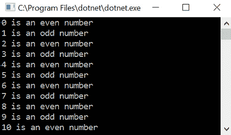
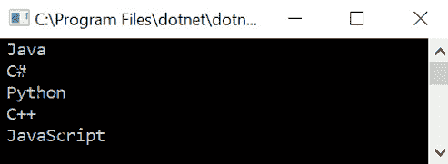
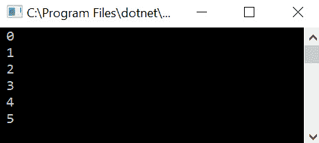
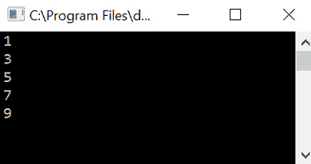
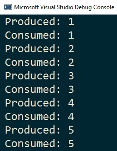

# 第三章：*第三章*：控制语句和异常

在上一章中，我们讨论了 C#中的数据类型和运算符。在本章中，我们将探讨 C#中的控制语句。控制语句允许我们在代码中实现条件执行路径。我们还将学习如何实现异常处理，这将帮助我们处理在执行应用程序时可能发生的错误。

在这一章中，我们将涵盖以下概念：

+   控制语句

+   异常处理

在本章结束时，我们将看到如何实际实现这些语句和子句。让我们使用示例详细讨论每个主题。

# 理解控制语句

控制语句允许我们控制程序的执行流程。它们还允许我们根据特定条件执行特定的代码块。C#定义了三种控制语句的类别，如下所述：

+   `if` 和 `switch`

+   `for`, `while`, `do-while`, 和 `foreach`

+   `break`, `continue`, `goto`, `return`, 和 `yield`

我们将在接下来的章节中详细探讨这些语句。

## 选择语句

选择语句允许我们根据条件是否为真来改变执行流程。C#为我们提供了两种类型的选择语句：`if`和`switch`。

### if 语句

以下代码片段显示了`if`语句的语法：

```cs
if (condition1)
    statement1;
else if(condition2)
    statement2;
else
    statement3;
```

如果`condition1`评估为`true`，那么将执行`statement1`。否则，如果`condition2`评估为`true`，那么将执行`statement2`。否则，将执行`statement3`。

`else-if`和`else`子句是*可选的*，可以*省略*其中任何一个，或者两者都可以*省略*。另一方面，您可以有尽可能多的`else-if`子句。

在这个例子中，我们只有一个语句要执行`if`和`else`子句。如果我们需要执行一系列语句，我们需要添加大括号（`{}`）使其成为一个代码块。对于单个语句来说，这是可选的，尽管这通常是使代码更清晰或更不容易出错的好方法。在这种情况下，语法将如下改变：

```cs
if (condition)
{
  statement 1;
  statement 2;
}
else
{
  statement 3;
  statement 4;
}
```

如果`condition`评估为`true`，那么`statement1`和`statement2`都将被执行。否则，将执行`statement3`和`statement4`。让我们尝试通过以下代码片段来理解`if-else`语句。

```cs
class Program
{
    static void Main(string[] args)
    {
        Console.WriteLine("Enter a positive integer");
        var line = Console.ReadLine(); 
        int.TryParse(line, out int number);
        if (number % 2 == 0)
        {
            Console.WriteLine("Even number");
        }
        else
        {
            Console.WriteLine("Odd number");
        }
    }
}
```

前面的程序检查正整数是偶数还是奇数。我们从控制台读取一个整数作为输入。由于控制台上输入的值被视为字符串，我们需要将其转换为整数。然后，我们将通过应用模运算符（`%`）找到除以`2`的余数。如果余数是`0`，那么数字是*偶数*，如果不是，那么数字是*奇数*。

`if`语句可以嵌套。我们可以在另一个`if`语句或`else`语句中放置一个`if`语句。以下语法显示了嵌套`if`语句的示例：

```cs
if (condition1)
{
  if(condition2)
      statement 1;
  if(condition3)
      statement 2;
  else
      statement 3;
}
else
{
  if(condition4)
      statement 4;
  else
      statement 5;
}
```

在这个例子中，如果`condition1`评估为`true`，那么控制将进入`if`块并根据嵌套`if`语句的评估执行语句。如果`condition1`是`false`，那么将执行`else`子句内的嵌套`if`语句。

在嵌套的`if`语句中，每个`else`子句都属于最后一个没有相应`else`语句的`if`语句。为了避免混淆和错误，建议在嵌套`if`语句时使用大括号正确配对`if`和`else`子句。例如，以下示例：

```cs
if(condition1)
    if(condition2)
        statement1;
    else
        statement2;
```

前面的例子与以下内容不同：

```cs
if(condition1)
{
    if(condition2)
        statement1;
}
else
{
    statement2;
}
```

在第一个例子中，`else`子句属于第二个内部`if`子句。另一方面，在第二个例子中，`else`子句属于第一个外部`if`子句。

### switch 语句

`switch`语句为我们提供了一种执行多个可用替代方案的方法。它将表达式的值与可用值列表进行匹配。如果找到匹配项，则执行与该值相关联的代码。

`switch`语句是级联`if-else-if`语句的替代方案。如果匹配的数量很少，可能更喜欢使用`if`语句。但是，如果匹配条件的数量较大，则更喜欢使用`switch`语句而不是`if`语句，因为它更易读和易维护。

`switch`语句的语法如下：

```cs
switch (expression)
{
  case value1:
    statement 1;
    break;
  case value2:
    statement 2;
    statement 3;
    break;
  default:
    statement 4;
    break;
}
```

`switch`语句包含一个或多个部分，每个部分都有一个或多个`case`标签。每个`case`标签可以有一个或多个语句。每个`case`标签指定一个将与`switch`表达式匹配的值。如果找到匹配项，控制将转移到匹配的`case`标签。

`case`标签中的语句将执行，直到遇到`break`语句。如果找不到匹配项，控制将转到`default`情况。在执行特定`case`标签后，控制将退出 switch。`default`情况是可选的。如果没有`default`情况，并且没有找到任何 case 标签的匹配项，控制将跳出`switch`语句。

请注意，我们在 case 标签内没有使用大括号`({})`。`default`情况可以出现在列表的任何位置。在评估所有`case`标签之后，它始终最后进行评估。

您可以在同一个 switch 部分中放置多个 case 标签；在这种情况下，任何一个 case 标签的匹配都将触发 switch 部分的执行。在`switch`语句中，只能执行一个 switch 部分。不可能从一个部分跳转到另一个部分。每个`switch`语句必须跟随一个`break`，`goto`或`return`语句。

以下示例显示了一个带有多个 switch 部分的`switch`语句，其中一些带有多个`case`标签。`default`情况放在最后，通常会这样做。每个部分都用`break`语句退出：

```cs
Console.WriteLine("Enter number (1-10)");
var line = Console.ReadLine();
int.TryParse(line, out int number);
switch(number)
{
   case 1:
      Console.WriteLine("Smallest number");
      break;
   case 2: case 3: case 5: case 7:
      Console.WriteLine("Prime number");
      break;
   case 4: case 6: case 8:
      Console.WriteLine("Even number");
      break;
   case 9:
      Console.WriteLine("Odd number");
      break;
   default:
      Console.WriteLine("Not in the range");
      break;
}
```

`switch`语句支持各种形式的模式匹配。但这是一个更高级的主题，将在*第八章*中详细介绍，*高级主题*，以及*第十五章*中介绍，*C# 8 的新特性*。

## 迭代语句

迭代语句允许我们在循环中执行一组代码，只要满足某个条件。C#为我们提供了四种不同类型的循环：

+   `for`

+   `while`

+   `do-while`

+   `foreach`

让我们详细探讨一下。

### `for`循环

`for`循环允许我们执行代码块，只要布尔表达式评估为`true`。以下代码段显示了`for`循环的一般语法：

```cs
for(initializer; condition; iterator)
{
    statement1;
    statement2;
}
```

`initializer`部分由一个或多个初始化语句组成，用于初始化控制循环的计数器。这将在第一次进入循环之前执行一次。如果`initializer`部分中有多个语句，它们必须用逗号分隔。但是，`initializer`部分是*可选的，可以留空*。

循环控制计数器也称为循环控制变量。此变量局限于循环范围内，不能在`for`循环范围外访问。

`condition`是一个布尔表达式，将确定循环是否执行。它将在每次循环迭代时进行评估。如果评估为`true`，则执行循环。一旦布尔条件评估为`false`，循环将终止，并且程序控制将跳出循环。此语句是可选的，可以留空。

`iterator`是一个表达式，用于在循环的每次迭代后更改（增加/减少）循环控制变量。它可以有多个用逗号分隔的语句。这个语句也是*可选的，可以留空*。实际上，这三个语句（`initializer`、`condition`和`iterator`）都可以被省略，这样我们就有了一个无限循环，就像下面的片段一样：

```cs
for(;;)
{
    /* infinite loop, unless a break, goto, return, or throw
    executes */
}
```

`for`循环是一个入口控制循环，这意味着在进入循环之前将评估布尔条件。如果条件在第一次迭代中评估为`false`，那么循环内部的代码块将根本不会被执行。

让我们通过以下代码片段来理解`for`循环：

```cs
for (int i = 0; i <= 10; i++)
{
    if (i % 2 == 0)
    {
        Console.WriteLine($"{i} is an even number");
    }
    else
    {
        Console.WriteLine($"{i} is an odd number");
    }
}
```

在这里，我们运行一个`for`循环来检查`0`到`10`之间的哪些整数是偶数或奇数。当您执行此代码时，您将看到以下输出屏幕：



图 3.1 - 控制台截图显示前面片段的输出

我们还可以在另一个`for`循环中放置一个`for`循环。在这种情况下，内部循环将完全执行每次外部循环的迭代。看看以下代码片段。在这里，`j`变量的所有值（即`1`和`2`）将被打印到`i`变量的每个值（即`1`、`2`、`3`和`4`）：

```cs
for (int i = 1; i < 5; i++)
{
   for (int j = 1; j < 3; j++)
   {
      Console.WriteLine($"i = {i},j = {j}");
   }
}
```

在执行时，您可以看到程序的以下输出：


图 3.2 - 控制台截图显示前面片段的输出

嵌套`for`循环的典型示例是多维数组遍历。在下面的示例中，我们有一个整数数组，有三行两列，在声明时进行了初始化。嵌套`for`循环用于将其元素的值打印到控制台：

```cs
var arr = new int[3, 2] { { 1, 2, }, { 3, 4 }, { 5, 6 } };
for (int r = 0; r <= arr.GetUpperBound(0); r++)
{
    for (int c = 0; c <= arr.GetUpperBound(1); c++)
    {
        Console.Write($"{arr[r, c]} ");
    }
    Console.WriteLine();
}
```

请注意，我们使用`GetUpperBound()`方法来检索指定维度的最后一个元素的索引，以避免为数组大小硬编码数值。

您可以在条件仍为`true`时退出循环迭代，使用`break`、`goto`、`return`或`throw`语句。您可以使用`continue`语句跳过当前迭代的循环块的执行。对于其他循环（`while`、`do`和`foreach`）也是如此。`jump`语句将在本章后面详细探讨。

`while`循环

`while`循环是一个*入口控制循环*。只要指定的布尔表达式评估为`true`，它就会执行一系列语句的块。`while`循环的语法如下：

```cs
while (condition)
{
    statement1;
    statement2;
}
```

在这里，`condition`是一个布尔表达式，它控制着循环。当`condition`评估为`true`时，循环内部的代码块将被执行。当`condition`变为`false`时，程序控制将跳出循环。因为`condition`首先被评估，如果`condition`最初为`false`，`while`循环可能根本不会执行。

`while`循环与`for`循环非常相似。实际上，您可以将任何`while`循环重写为`for`循环，反之亦然。您可以在以下代码片段中看到如何使用`while`循环重新编写`for`循环的语法：

```cs
initializer;
while(condition)
{
    statement1;
    statement2;
    iterator;
}
```

在以下代码片段中，我们已经使用`while`循环重新编写了上一节中打印偶数和奇数到控制台的示例：

```cs
int i = 0;
while (i <= 10)
{
    if (i % 2 == 0)
    {
        Console.WriteLine($"{i} is an even number");
    }
    else
    {
        Console.WriteLine($"{i} is an odd number");
    }
    i++;
}
```

程序的执行结果没有改变。实际上，还有另一种方法可以实现相同的结果，那就是使用`do`语句。

### `do-while`循环

`do-while`循环是一个*退出控制循环*。这意味着布尔条件将在循环结束时被检查。这确保了`do-while`循环至少会被执行一次，即使条件在第一次迭代中求值为`false`。这是`while`和`do-while`循环之间的关键区别；前者可能根本不执行，但后者至少会执行一次。

`do-while`循环的语法如下：

```cs
do
{
    statement1;
    statement2;
} while (condition);
```

在下面的代码片段中，我们使用`do-while`循环打印出`0`到`10`之间的所有数字，并指定哪些是奇数，哪些是偶数。这段代码将产生与`while`循环示例中所示的相同输出：

```cs
int i = 0;
do
{
    if (i % 2 == 0)
    {
        Console.WriteLine($"{i} is an even number");
    }
    else
    {
        Console.WriteLine($"{i} is an odd number");
    }
    i++;
}
while (i <= 10);
```

到目前为止，我们学习的循环允许我们重复执行一个或多个语句，比如根据索引迭代集合的元素。另一种循环语句，比如`foreach`，简化了在我们只关心元素而不关心索引的所有情况下的迭代。让我们接下来看一下`foreach`。

### foreach 循环

`foreach`循环允许我们迭代实现了`System.Collections.IEnumerable`或`System.Collections.Generic.IEnumerable<T>`接口的集合的项。集合在*第七章* *Collections*中有详细讨论。

`foreach`循环的语法如下：

```cs
foreach(datatype iterator in collection)
{
  statement1;
  statement2;
}
```

这里，`datatype`表示 C#中的一个有效类型，它必须与集合的数据类型相同，或者存在隐式转换的类型。你也可以使用`var`代替实际的类型名，这样编译器将从集合元素的类型推断出`iterator`变量的类型。

`iterator`变量是一个循环迭代变量。在`foreach`循环中，循环迭代变量是只读的。这意味着我们不能在循环体内改变它的值。在循环的每次迭代中，迭代器被赋予集合中的一个值。当集合的所有元素都被迭代完时，循环退出。退出循环也可以通过`break`、`goto`、`return`或`throw`语句来实现。

让我们通过以下代码片段来看一下`foreach`循环：

```cs
string[] languages = { "Java", "C#", "Python", "C++", "JavaScript" };
foreach (string lang in languages)
{
    Console.WriteLine(lang);
}
```

在这个例子中，我们定义了一个包含编程语言列表的字符串数组。我们使用`foreach`循环来迭代它，并在控制台上打印数组的每个元素。这段代码的输出如下截图所示：



图 3.3 - 使用 foreach 语句将字符串数组的内容打印到控制台的输出

前面的`foreach`语句在语义上等同于以下内容：

```cs
var enumerator = languages.GetEnumerator();
while(enumerator.MoveNext())
{
    Console.WriteLine(enumerator.Current);
}
```

集合类型可能并不一定实现`IEnumerable`或`IEnumerable<T>`接口，但它必须有一个名为`GetEnumerator()`的公共方法，不带参数并返回一个类、结构或接口，具有包含名为`Current`的公共属性和一个返回`bool`的公共无参数方法`MoveNext()`。

如果枚举器类型的`Current`属性返回一个引用返回值（这是在 C# 7.3 中实现的），那么你可以用`ref`或`ref only`修饰符声明迭代变量。这个片段中展示了一个例子：

```cs
Span<int> arr = stackalloc int[]{ 1, 1, 2, 3, 5, 8 };
foreach(ref int n in arr)
{
    n *= 2;
}
foreach(ref readonly var n in arr)
{
    Console.WriteLine(n);
}
```

在这里，`arr`变量是`System.Span<int>`。其`GetEnumerator()`方法的返回类型`Span<T>.Enumerator`满足前面提到的条件。第一个`foreach`循环遍历数组的元素（`stackalloc`数组在堆栈上分配并在函数调用返回时被释放），并将每个元素的初始值加倍。第二个`foreach`循环再次以只读方式遍历元素。在只读循环中尝试更改迭代变量的值将导致编译器错误。

## 跳转语句

跳转语句允许我们立即将控制从应用程序中的一个点转移到另一个点。C#为我们提供了五种不同的跳转语句：

+   `break`

+   `continue`

+   `goto`

+   `return`

+   `yield`

我们将在接下来的章节中详细探讨它们。

### `break`语句

我们已经看到如何使用`break`来退出`switch` case。我们还可以使用`break`语句终止循环的执行。一旦程序控制在循环中遇到`break`语句，循环立即终止，控制流出循环。

看一下以下代码片段：

```cs
for (int i = 0; i <= 10; i++)
{
    Console.WriteLine(i);
    if (i == 5)
        break;
}
```

在这里，我们从`0`到`10`进行迭代，并将当前值写入控制台。如果循环控制变量的值变为`5`，循环将中断，不会再将任何元素打印到控制台。尽管循环预计会运行 10 次，但`break`语句使其立即终止，因为迭代器的值变为`5`。执行后，您可以看到以下输出：



图 3.4 – 控制台截图显示前面片段的输出

`break`语句不是唯一可以控制循环执行的语句。另一个是`continue`，我们将在下一节中看到。

### `continue`语句

`continue`语句将控制传递到封闭循环的下一次迭代，无论是`for`、`while`、`do`还是`foreach`。它用于终止当前迭代中循环体的执行并跳到下一个迭代。`continue`语句不确定循环语句的返回，而只是中止当前迭代的执行并将控制移动到循环条件的评估。

看一下以下代码片段：

```cs
for (int i = 0; i <= 10; i++)
{
    if (i % 2 == 0)
        continue;
    Console.WriteLine(i);
}
```

在这个例子中，我们从`0`到`10`进行迭代；如果值是偶数，则跳过当前迭代循环，继续下一个。这段代码将只打印出`0`到`10`之间的奇数。输出如下：



图 3.5 – 打印到控制台的前一个片段的输出，小于 10 的奇数

`break`和`continue`语句控制循环的执行。下一个语句用于结束函数的执行。

### 返回语句

`return`语句终止当前执行流并将控制返回到调用方法。可选地，我们还可以向调用方法返回一个值。如果方法有定义返回类型，我们需要返回一个值。否则，当返回类型为 void 时，我们可以返回而不指定任何值。

以下示例显示了一个可能的实现，该函数返回第 n 个斐波那契数：

```cs
static int Fibonacci(int n)
{
    if (n > 1)
        return Fibonacci(n - 1) + Fibonacci(n - 2);
    else
        return n;
}
```

`return`语句触发当前函数执行的停止，并将控制返回到调用函数。

### 跳转语句

`goto`语句是一个无条件跳转语句。当程序控制遇到`goto`语句时，它将跳转到指定的位置。`goto`的目标使用*标签*指定，标签是一个标识符后跟一个冒号（`:`）。我们也可以使用`goto`来退出循环。在这种情况下，它的行为类似于`break`语句。

考虑以下代码片段：

```cs
for (int i = 0; i <= 10; i++)
{
    Console.WriteLine(i);
    if (i == 5)
    {
        goto printmessage;
    }
}
printmessage:
    Console.WriteLine("The goto statement is executed");
```

在这个例子中，我们从`0`到`10`进行迭代。如果迭代器的值变为`5`，我们将使用`goto`语句跳出循环。这段代码的输出如下所示：


图 3.6 - 前述代码片段的控制台输出

通常应避免使用`goto`语句作为良好的编程实践，因为它可能导致代码结构混乱且难以维护。

### yield 语句

`yield`是一个上下文关键字（即，在代码中提供特定含义而不是保留字的单词）。它表示在出现在`return`或`break`语句之前的方法、运算符或`get`访问器中，它是一个迭代器。从迭代器方法返回的序列可以使用`foreach`语句进行消耗。`yield`语句使得可以在生成时返回值并在可用时进行消耗，这在异步环境中特别有用。

为了更好地理解`yield`的用法，让我们考虑以下例子。我们有一个函数，让我们称之为`GetNumbers()`，它返回从`1`到`100`的所有数字的集合。可能的实现如下所示：

```cs
IEnumerable<int> GetNumbers()
{
    var list = new List<int>();
    for (int i = 1; i <= 100; ++i)
    {
        list.Add(i);
    }
    return list;
}
```

这种实现的问题在于我们无法在所有数字都生成之前消耗这些数字。一方面，在实际例子中，这可能是耗时的，我们可能希望在生成数字时消耗这些数字。另一方面，我们可能只对其中一些数字感兴趣，而不是所有数字。

使用这种实现方式，我们必须先生成所有需要的数字，然后再使用我们需要的数字。在下面的例子中，我们只将前五个数字打印到控制台上：

```cs
var numbers = GetNumbers().Take(5);
Console.WriteLine(string.Join(",", numbers));
```

`yield return`语句会在项目可用时立即返回该项目。这是创建迭代器的一种简写，这样会使代码变得更加费力。

`GetNumbers()`的实现将改为以下内容：

```cs
IEnumerable<int> GetNumbers()
{
   for (int i = 1; i <= 100; ++i)
   {
      yield return i;
   }
}
```

我们会在项目可用时返回每个数字，并且只有在我们通过枚举器进行迭代时才这样做，比如使用`foreach`语句。前面的例子，将前五个数字打印到控制台上的例子，保持不变。但是，执行方式不同，因为`for`循环只会执行五次迭代。

为了更好地理解这一点，让我们稍微改变一下例子，以便在生成和消耗每个项目之前分别在控制台上显示一条消息：

```cs
IEnumerable<int> GetNumbers()
{
    for (int i = 1; i <= 100; ++i)
    {
        Thread.Sleep(1000);
        Console.WriteLine($"Produced: {i}");
        yield return i;
    }
}
foreach(var i in GetNumbers().Take(5))
{
    Console.WriteLine($"Consumed: {i}");
}
```

调用`Thread.Sleep()`用于模拟产生下一个数字时的一秒延迟。这段代码的执行结果如下图所示：



图 3.7 - 前述代码的执行结果

现在我们已经看到了如何从代码的正常执行中返回，让我们快速看一下在代码执行过程中发生意外错误时如何处理异常情况。

# 异常处理

有些情况下我们的代码会产生错误。错误可能是由于代码中的逻辑问题引起的，比如试图除以零或访问数组中超出数组边界的元素。例如，试图访问一个大小为三的数组中的第四个元素。错误也可能是由外部因素引起的，比如试图读取磁盘上不存在的文件。

C#为我们提供了一个内置的异常处理机制，以处理代码级别的这些类型的错误。异常处理的语法如下：

```cs
try
{
    Statement1;
    Statement2;
} 
catch (type)
{
    // code for error handling
}
finally
{
    // code to always run at the end
}
```

`try`块可以包含一个或多个语句。`catch`块包含错误处理代码。`finally`块包含在`try`部分之后将执行的代码。这无论执行是否恢复正常，或者控制是否因`break`、`continue`、`goto`或`return`语句而离开`try`块。

如果发生异常并且存在`catch`块，则`finally`块也一定会执行。如果异常未被处理，`finally`块的执行取决于异常展开操作是如何触发的，这取决于运行机器的设置。`finally`块是可选的。

在执行时，程序控制将执行`try`块内的代码。如果`try`块中没有发生错误，执行将继续正常进行，并且控制转移到`finally`块（如果存在）。当`try`块内发生异常时，程序控制将转移到`catch`块（如果存在）。在执行`catch`块后，程序控制将转移到`finally`块（如果存在）。

同一个`try`块可能存在多个`catch`子句。它们列出的顺序很重要，因为它们按照给定的顺序进行评估。这意味着更具体的异常应该在更一般的异常之前捕获。可以指定一个没有异常类型的`catch`子句，以捕获所有异常。但是，这被认为是一个不好的做法，因为您应该只捕获您知道如何处理和恢复的异常。

当发生异常时，`catch`块处理当前执行的方法。如果不存在`catch`块，则会查找调用当前方法的方法，依此类推。如果找不到匹配的`catch`块，则会显示未处理的异常消息，并且程序的执行将被中止。

让我们尝试通过以下代码片段来理解异常处理：

```cs
class Program
{
    static void Main(string[] args)
    {
        try
        {
            int a = 10;
            int b = a / 0;
        }
        catch (Exception ex)
        {
            Console.WriteLine(ex);
        }
    }
}
```

在这里，我们试图模拟*除零错误*。当在`try`块内发生错误时，它将创建`Exception`类的一个实例并抛出异常。在`catch`块中，我们指定了`Exception`类型的参数。异常提供了错误消息，还提供了关于错误发生位置（文件名和路径）以及调用堆栈的信息。

如果我们只想要与异常相关联的消息，我们可以使用`Exception`类的`Message`属性。此代码片段的输出如下：


图 3.8 - 控制台显示除零异常的消息

异常是使用`throw`语句抛出的。您必须指定`System.Exception`类的一个实例或从它派生的类。类将在*第四章*，*理解各种用户定义类型*中讨论，继承在*第五章*，*C#面向对象编程*中讨论，但目前请记住，有许多异常类型，它们都基于`System.Exception`。`throw`语句可以在`catch`块中使用，而不带任何参数来重新抛出异常，保留调用堆栈。当您想在发生异常时执行某些操作（如记录），但也希望将异常传递到另一个地方进行完全处理时，这是有用的。

在下面的例子中，一个名为`FunctionThatThrows()`的函数做一些事情，但在检查其输入参数之前。如果`object`参数为`null`，它会抛出`ArgumentNullException`类型的异常。然而，如果参数不为 null，但类型不是`string`，它会抛出`ArgumentException`类型的异常。这是`ArgumentNullException`的基类。在调用该方法时，我们捕获多个异常类型：

+   `ArgumentNullException`

+   `ArgumentException`

+   `Exception`

顺序很重要，因为它从最派生的类开始，以所有异常的基类结束。`finally`块用于在执行结束时显示消息：

```cs
void FunctionThatThrows(object o)
{
    if (o is null)
        throw new ArgumentNullException(nameof(o));
    if (!(o is string))
        throw new ArgumentException("A string is expected");
    // do something
}
try
{
    Console.WriteLine("executing");
    FunctionThatThrows(42);
}
catch (ArgumentNullException e)
{
    Console.WriteLine($"Null argument: {e.Message}");
}
catch (ArgumentException e)
{
    Console.WriteLine($"Wrong argument: {e.Message}");
}
catch(Exception e)
{
    Console.WriteLine($"Error: {e.Message}");
}
finally
{
    Console.WriteLine("done");
}
```

该程序的执行输出如下：


图 3.9 - 从前面片段执行的控制台输出

异常处理的主题将在*第十四章*中进行更详细的讨论，*错误处理*。如果你想在这一点上了解更多关于异常的知识，你可以继续阅读这一章，然后再继续下一章。

# 总结

在本章中，我们探讨了 C#中的控制语句。我们通过示例学习了不同类型的循环和跳转语句的工作原理。我们还简要介绍了如何抛出和捕获异常。

在下一章中，我们将看看用户定义的类型，并探索类中的字段、属性、方法、索引器和构造函数。

# 测试你学到的东西

1.  C#语言中有哪些选择语句可用？

1.  `switch`语句的默认情况可以出现在哪里，何时进行评估？

1.  `for`和`foreach`语句有什么区别？

1.  `while`和`do-while`语句有什么区别？

1.  你可以使用哪些语句来从函数返回？

1.  你可以在哪里使用`break`语句，它是如何工作的？

1.  `yield`语句是做什么的，它在哪些场景中使用？

1.  如何捕获函数调用中的所有异常？

1.  `finally`块是做什么的？

1.  .NET 中所有异常的基类是什么？
