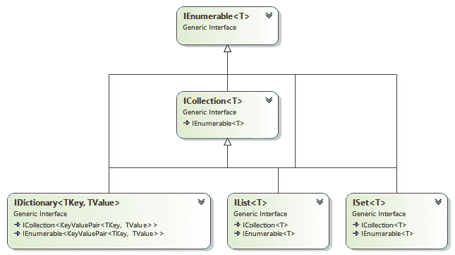
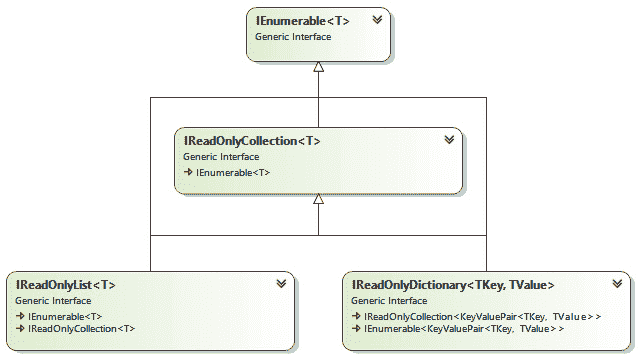

# 第七章：集合

在上一章中，我们学习了 C#中的泛型编程。泛型的最重要的应用之一就是创建泛型集合。**集合**是一组对象。我们学习了如何在*第二章*，*数据类型和运算符*中使用数组。然而，数组是固定大小的序列，在大多数情况下，我们需要处理可变大小的序列。

.NET 框架提供了代表各种类型集合的泛型类，如列表、队列、集合、映射等。使用这些类，我们可以轻松地对对象集合执行插入、更新、删除、排序和搜索等操作。

在本章中，您将学习以下泛型集合：

+   `List<T>`集合

+   `Stack<T>`集合

+   `Queue<T>`集合

+   `LinkedList<T>`集合

+   `Dictionary<TKey, TValue>`集合

+   `HashSet<T>`集合

在本章结束时，您将对.NET 中最重要的集合有很好的理解，它们模拟了什么数据结构，它们之间的区别是什么，以及何时应该使用它们。

之前提到的所有集合都不是线程安全的。这意味着它们不能在多线程场景中使用，当一个线程可能在读取时，另一个线程可能在写入相同的集合，而不使用外部同步机制。然而，.NET 还提供了几个线程安全的集合，它们位于`System.Collections.Concurrent`命名空间中，使用高效的锁定或无锁同步机制，在许多情况下，提供比使用外部锁更好的性能。在本章中，我们还将介绍这些集合，并了解何时适合使用它们。

让我们通过查看`System.Collections.Generic`命名空间来概述泛型集合库，这是所有泛型集合的所在地。

# 介绍 System.Collections.Generic 命名空间

我们将在本章介绍的泛型集合类是`System.Collections.Generic`命名空间的一部分。该命名空间包含定义泛型集合和操作的接口和类。所有泛型集合都实现了一系列泛型接口，这些接口也在该命名空间中定义。这些接口可以大致分为两类：

+   可变的，支持更改集合内容的操作，如添加新元素或删除现有元素。

+   只读集合，不提供更改集合内容的方法。

表示可变集合的接口如下：

+   `IEnumerable<T>`：这是所有其他接口的基本接口，并公开一个支持遍历`T`类型集合元素的枚举器。

+   `ICollection<T>`：这定义了操作泛型集合的方法——`Add()`、`Clear()`、`Contains()`、`CopyTo()`和`Remove()`——以及`Count`等属性。这些成员应该是*不言自明*的。

+   `IList<T>`：表示可以通过*索引*访问其元素的泛型集合。它定义了三种方法：`IndexOf()`，用于检索元素的索引，`Insert()`，用于在指定索引处插入元素，`RemoveAt()`，用于移除指定索引处的元素，此外，它还提供了一个用于直接访问元素的索引器。

+   `ISet<T>`：这是抽象集合集合的基本接口。它定义了诸如`Add()`、`ExceptWith()`、`IntersetWith()`、`UnionWith()`、`IsSubsetOf()`和`IsSupersetOf()`等方法。

+   `IDictionary<TKey, TValue>`：这是抽象出键值对集合的基本接口。它定义了`Add()`、`ContainsKey()`、`Remove()`和`TryGetValue()`方法，以及一个索引器和`Keys`和`Values`属性，分别返回键和值的集合。

这些接口之间的关系如下图所示：



图 7.1 - System.Collections.Generic 命名空间中通用集合接口的层次结构。

代表只读集合的接口如下：

+   `IReadOnlyCollection<T>`：这代表了一个只读的元素的通用集合。它只定义了一个成员：`Count`属性。

+   `IReadOnlyList<T>`：这代表了一个只读的可以通过索引访问的元素的通用集合。它只定义了一个成员：一个只读的索引器。

+   `IReadOnlyDictionary<TKey, TValue>`：这代表了一个只读的键值对的通用集合。这个接口定义了`ContainsKey()`和`TryGetValue()`方法，以及`Keys`和`Values`属性和一个只读的索引器。

再次，这些接口的关系如下图所示：



图 7.2 - 只读通用集合接口的层次结构。

每个通用集合都实现了几个这些接口。例如，`List<T>`实现了`IList<T>`、`ICollection<T>`、`IEnumerable<T>`、`IReadOnlyCollection<T>`和`IReadOnlyList<T>`。下图显示了我们将在本章学习的通用集合所实现的所有接口：


图 7.3 - 一个类图显示了最重要的通用集合和它们实现的接口。

这些图表中显示的继承层次实际上是实际继承层次的简化。所有的通用集合都有一个非通用的等价物。例如，`IEnumerable<T>`是`IEnumerable`的通用等价物，`ICollection<T>`是`ICollection`的通用等价物，`IList<T>`是`Ilist`的通用等价物，依此类推。这些是由`ArrayList`、`Queue`、`Stack`、`DictionaryBase`、`Hashtable`等遗留集合实现的遗留接口，所有这些都在`System.Collections`命名空间中可用。这些非通用的遗留集合没有强类型。出于几个原因，使用通用集合是首选的：`

+   它们提供了类型安全的好处。不需要从基本集合派生并实现特定类型的成员。

+   对于值类型，它们具有更好的性能，因为没有元素的装箱和拆箱，这是非通用集合中必要的过程。

+   一些通用集合提供了非通用集合中不可用的功能，比如接受委托用于搜索或对每个元素执行操作的方法。

当你需要将集合作为参数传递给函数或从函数返回集合时，应该避免使用具体的实现，而是使用接口。当你只想遍历元素时，`IEnumerable<T>`是合适的，但如果你需要多次这样做，你可以使用`IReadOnlyCollection<T>`。只读集合应该在两种情况下被优先选择：

+   当一个方法不修改作为参数传递的集合时

+   当你返回一个集合，如果集合已经在内存中，调用者不应该修改它

最终，最合适的接口因情况而异。

在接下来的几节中，我们将介绍最常用的类型安全的泛型集合。非泛型集合在遗留代码之外几乎没有什么意义。

# List<T> 集合

`List<T>` 泛型类表示可以通过索引访问其元素的集合。`List<T>` 与数组非常相似，只是集合的大小不是固定的，而是可变的，可以随着元素的添加或删除而增长或减少。事实上，`List<T>` 的实现使用数组来存储元素。当元素的数量超过数组的大小时，将分配一个新的更大的数组，并将先前数组的内容复制到新数组中。这意味着 `List<T>` 在连续的内存位置中存储元素。但是，对于值类型，这些位置包含值，但对于引用类型，它们包含对实际对象的引用。可以将对同一对象的多个引用添加到列表中。

`List<T>` 类实现了一系列泛型和非泛型接口，如下面的类声明所示：

```cs
public class List<T> : ICollection<T>, ICollection
                       IEnumerable<T>, IEnumerable, 
                       IList<T>, IList,
                       IReadOnlyCollection<T>, IReadOnlyList<T> {}
```

列表可以通过几种方式创建：

+   使用默认构造函数，这会导致一个具有默认容量的空列表。

+   通过指定特定的容量但没有初始元素，这会再次使列表为空。

+   从一系列元素中。

在以下示例中，`numbers` 是一个空的整数列表，`words` 是一个空的字符串列表：

```cs
var numbers = new List<int>();
var words = new List<string>();
```

另一方面，以下示例初始化了一些元素的列表。第一个列表将包含六个整数，第二个列表将包含两个字符串：

```cs
var numbers = new List<int> { 1, 2, 3, 5, 7, 11 };
var words = new List<string> { "one", "two" };
```

这个类支持你从这样的集合中期望的所有典型操作——添加、删除和搜索元素。有几种方法可以向列表中添加元素：

+   `Add()` 将元素添加到列表的末尾。

+   `AddRange()` 将一系列元素（以 `IEnumerable<T>` 的形式）添加到列表的末尾。

+   `Insert()` 在指定位置插入一个元素。位置必须是有效的索引，在列表的范围内；否则，将抛出 `ArgumentOutOfRangeException` 异常。

+   `InsertRange()` 在指定的索引处插入一系列元素（以 `IEnumerable<T>` 的形式），该索引必须在列表的范围内。

如果内部数组的容量超过了，所有这些操作可能需要重新分配存储元素的内部数组。如果不需要分配空间，`Add()` 是一个 *O(1)* 操作，当需要分配空间时，为 *O(n)*。

如果不需要分配空间，`AddRange()` 的时间复杂度为 *O(n)*，如果需要分配空间，则为 *O(n+k)*。`Insert()` 操作始终为 *O(n)*，`InsertRange()` 如果不需要分配空间，则为 *O(n)*，如果需要分配空间，则为 *O(n+k)*。在这个表示法中，*n* 是列表中的元素数量，*k* 是要添加的元素数量。我们可以在以下示例中看到这些操作的示例：

```cs
var numbers = new List<int> {1, 2, 3}; // 1 2 3
numbers.Add(5);                        // 1 2 3 5
numbers.AddRange(new int[] { 7, 11 }); // 1 2 3 5 7 11
numbers.Insert(5, 1);                  // 1 2 3 5 7 1 11
numbers.Insert(5, 1);                  // 1 2 3 5 7 1 1 11
numbers.InsertRange(                   // 1 13 17 19 2 3 5..
    1, new int[] {13, 17, 19});        // ..7 1 1 11
```

使用不同的方法也可以以几种方式删除元素：

+   `Remove()` 从列表中删除指定的元素。

+   `RemoveAt()` 删除指定索引处的元素，该索引必须在列表的范围内。

+   `RemoveRange()` 删除指定数量的元素，从给定的索引开始。

+   `RemoveAll()` 删除列表中满足提供的谓词要求的所有元素。

+   `Clear()` 删除列表中的所有元素。

所有这些操作都在 *O(n)* 中执行，其中 *n* 是列表中的元素数量。`RemoveAt()` 是一个例外，其中 *n* 是 `Count - index`。原因是在删除一个元素后，必须在内部数组中移动元素。使用这些函数的示例在以下代码片段中显示：

```cs
numbers.Remove(1);              // 13 17 19  2  3  5  7  1  
                                // 1 11
numbers.RemoveRange(2, 3);      // 13 17  5  7  1  1 11
numbers.RemoveAll(e => e < 10); // 13 17 11
numbers.RemoveAt(1);            // 13 11
numbers.Clear();                // empty
```

可以通过指定谓词来搜索列表中的元素。

信息框

**谓词** 是返回布尔值的委托。它们通常用于过滤元素，例如在搜索集合时。

有几种可以用于搜索元素的方法：

+   `Find()` 返回与谓词匹配的第一个元素，如果找不到则返回`T`的默认值。

+   `FindLast()` 返回与谓词匹配的最后一个元素，如果找不到则返回`T`的默认值。

+   `FindAll()` 返回与谓词匹配的所有元素的`List<T>`，如果找不到则返回一个空列表。

所有这些方法都在*O(n)*中执行，如下面的代码片段所示：

```cs
var numbers = new List<int> { 1, 2, 3, 5, 7, 11 };
var a = numbers.Find(e => e < 10);      // 1
var b = numbers.FindLast(e => e < 10);  // 7
var c = numbers.FindAll(e => e < 10);   // 1 2 3 5 7
```

还可以搜索元素的从零开始的索引。有几种方法允许我们这样做：

+   `IndexOf()` 返回与提供的参数相等的第一个元素的索引。

+   `LastIndexOf()` 返回搜索元素的最后一个索引。

+   `FindIndex()` 返回满足提供的谓词的第一个元素的索引。

+   `FindLastIndex()` 返回满足提供的谓词的最后一个元素的索引。

+   `BinarySearch()` 使用二进制搜索返回满足提供的元素或比较器的第一个元素的索引。此函数假定列表已经排序；否则，结果是不正确的。

`BinarySearch()` 在*O(log n)*中执行，而其他所有操作都在*O(n)*中执行。这是因为它们使用线性搜索。如果找不到满足搜索条件的元素，它们都返回`-1`。示例如下所示：

```cs
var numbers = new List<int> { 1, 1, 2, 3, 5, 8, 11 };
var a = numbers.FindIndex(e => e < 10);     // 0
var b = numbers.FindLastIndex(e => e < 10); // 5
var c = numbers.IndexOf(5);                 // 4
var d = numbers.LastIndexOf(1);             // 1
var e = numbers.BinarySearch(8);            // 5
```

有一些方法允许我们修改列表的内容，例如对元素进行排序或反转：

+   `Sort()` 根据默认或指定的条件对列表进行排序。有几个重载允许我们指定比较委托或`IComparer<T>`对象，甚至是要排序的列表的子范围。在大多数情况下，此操作在*O(n log n)*中执行，但在最坏的情况下为*O(n2)*。

+   `Reverse()` 反转列表中的元素。有一个重载允许您指定要恢复的子范围。此操作在*O(n)*中执行。

以下是使用这些函数的示例：

```cs
var numbers = new List<int> { 1, 5, 3, 11, 8, 1, 2 };
numbers.Sort();     // 1 1 2 3 5 8 11
numbers.Reverse();  // 11 8 5 3 2 1 1
```

`List<T>`类中有更多的方法，不仅限于此处显示的方法。但是，浏览所有这些方法超出了本书的范围。您应该在线查阅该类的官方文档，以获取该类所有成员的完整参考。

# `Stack<T>`集合

栈是一种线性数据结构，允许我们按特定顺序插入和删除项目。新项目添加到栈顶。如果要从栈中移除项目，只能移除顶部项目。由于只允许从一端插入和删除，因此最后插入的项目将是首先删除的项目。因此，栈被称为**后进先出（LIFO）**集合。

以下图表描述了一个栈，其中*push*表示向栈中添加项目，*pop*表示从栈中删除项目：


图 7.4 - 栈的概念表示。

.NET 提供了用于处理栈的通用`Stack<T>`类。该类包含几个构造函数，允许我们创建空栈或使用元素集合初始化栈。看一下以下代码片段，我们正在创建一个包含三个初始元素和一个空整数栈的字符串栈：

```cs
var arr = new string[] { "Ankit", "Marius", "Raffaele" };
Stack<string> names = new Stack<string>(arr);
Stack<int> numbers = new Stack<int>();
```

栈支持的主要操作如下：

+   `Push()`: 在栈顶插入一个项目。如果不需要重新分配，则这是一个*O(1)*操作，否则为*O(n)*。

+   `Pop()`: 从栈顶移除并返回项目。这是一个*O(1)*操作。

+   `Peek()`: 返回栈顶的项目，而不移除它。这是一个*O(1)*操作。

+   `Clear()`: 从栈中移除所有元素。这是一个*O(n)*操作。

让我们通过以下示例来理解它们是如何工作的，在左侧，您可以看到每个操作后栈的内容：

```cs
var numbers = new Stack<int>(new int[]{ 1, 2, 3 });// 3 2 1
numbers.Push(5);                                   // 5 3 2 1
numbers.Push(7);                                   // 7 5 3 2 1
numbers.Pop();                                     // 5 3 2 1
var n = numbers.Peek();                            // 5 3 2 1
numbers.Push(11);                                 // 11 5 3 2 1
numbers.Clear();                                  // empty
```

`Pop()`和`Peek()`方法如果栈为空会抛出`InvalidOperationException`异常。在.NET Core 中，自 2.0 版本以来，有两种替代的非抛出方法可用——`TryPop()`和`TryPeek()`。这些方法返回一个布尔值，指示是否找到了顶部元素，如果找到了，它将作为`out`参数返回。

# 队列<T>集合

队列是一种线性数据结构，其中插入和删除元素是从两个不同的端口执行的。新项目从队列的后端添加，现有项目的删除从前端进行。因此，要首先插入的项目将是要首先删除的项目。因此，队列被称为**先进先出（FIFO）**集合。下图描述了一个队列，其中**Enqueue**表示向队列添加项目，**Dequeue**表示从队列中删除项目：


图 7.5 – 队列的概念表示。

在.NET 中，实现通用队列的类是`Queue<T>`。类似于`Stack<T>`，有重载的构造函数，允许我们创建一个空队列或一个从`IEnumerable<T>`集合中的元素初始化的队列。看一下下面的代码片段，我们正在创建一个包含三个初始元素的字符串队列和一个空的整数队列：

```cs
var arr = new string[] { "Ankit", "Marius", "Raffaele" };
Queue<string> names = new Queue<string>(arr);
Queue<int> numbers = new Queue<int>();
```

队列支持的主要操作如下：

+   `Enqueue()`: 在队列的末尾插入一个项目。这是一个*O(1)*操作，除非需要重新分配内部数组，否则它将成为一个*O(n)*操作。

+   `Dequeue()`: 从队列的前端移除并返回一个项目。这是一个*O(1)*操作。

+   `Peek()`: 从队列的前端返回一个项目，但不移除它。这是一个*O(1)*操作。

+   `Clear()`: 从队列中移除所有元素。这是一个*O(n)*操作。

要了解这些方法如何工作，让我们看下面的例子：

```cs
var numbers = new Queue<int>(new int[] { 1, 2, 3 });// 1 2 3
numbers.Enqueue(5);                                 // 1 2 3 5
numbers.Enqueue(7);                                // 1 2 3 5 7
numbers.Dequeue();                                 // 2 3 5 7
var n = numbers.Peek();                            // 2 3 5 7
numbers.Enqueue(11);                              // 2 3 5 7 11
numbers.Clear();                                 // empty
```

`Dequeue()`和`Peek()`方法如果队列为空会抛出`InvalidOperationException`异常。在.NET Core 中，自 2.0 版本以来，有两种替代的非抛出方法可用——`TryDequeue()`和`TryPeek()`。这些方法返回一个布尔值，指示是否找到了顶部元素，如果找到了，它将作为一个 out 参数返回。

从这些示例中可以看出，`Stack<T>`和`Queue<T>`有非常相似的实现，尽管语义不同。它们的公共成员几乎相同，不同之处在于栈操作称为`Push()`和`Pop()`，队列操作称为`Enqueue()`和`Dequeue()`。

# LinkedList<T>集合

链表是一种线性数据结构，由一组节点组成，每个节点包含数据以及一个或多个节点的地址。这里有四种类型的链表，如下所述：

+   **单链表**：包含存储值和对节点序列中下一个节点的引用的节点。最后一个节点的下一个节点的引用将指向 null。

+   **双向链表**：在这里，每个节点包含两个链接——第一个链接指向前一个节点，下一个链接指向序列中的下一个节点。第一个节点的上一个节点的引用和最后一个节点的下一个节点的引用将指向 null。

+   **循环单链表**：最后一个节点的下一个节点的引用将指向第一个节点，从而形成一个循环链。

+   **双向循环链表**：在这种类型的链表中，最后一个节点的下一个节点的引用将指向第一个节点，第一个节点的上一个节点的引用将指向最后一个节点。

双向链表的概念表示如下：


图 7.6 – 双向链表的概念表示。

在这里，每个节点包含一个值和两个指针。**Next** 指针包含对序列中下一个节点的引用，并允许在链表的正向方向上进行简单导航。**Prev** 指针包含对序列中前一个节点的引用，并允许我们在链表中向后移动。

.NET 提供了 `LinkedList<T>` 类，表示双向链表。该类包含 `LinkedListNode<T>` 类型的项。插入和删除操作在 *O(1)* 中执行，搜索在 *O(n)* 中执行。节点可以从同一链表对象或另一个链表中移除和重新插入。列表维护内部计数，因此使用 `Count` 属性检索列表的大小也是 *O(1)* 操作。链表不支持循环、分割、链接或其他可能使列表处于不一致状态的操作。

`LinkedListNode<T>` 类具有以下四个属性：

+   `List`：此属性将返回对 `LinkedList<T>` 对象的引用，该对象属于 `LinkedListNode<T>`。

+   `Next`：表示对 `LinkedList<T>` 对象中下一个节点的引用，如果当前节点是最后一个节点，则为 `null`。

+   `Previous`：表示对 `LinkedList<T>` 对象中前一个节点的引用，如果当前节点是第一个节点，则为 `null`。

+   `Value`：此属性的类型为 `T`，表示节点中包含的值。

对于值类型，`LinkedListNode<T>` 包含实际值，而对于引用类型，它包含对对象的引用。

该类具有重载的构造函数，使我们能够创建一个空的链表或一个以 `IEnumerable<T>` 形式的元素序列进行初始化的链表。看一下以下示例，看一些示例：

```cs
var arr = new string[] { "Ankit", "Marius", "Raffaele" };
var words = new LinkedList<string>(arr);
var numbers = new LinkedList<int>();
```

使用以下方法可以以多种方式向链表添加新元素：

+   `AddFirst()` 在列表开头添加一个新节点或值。

+   `AddLast()` 在列表末尾添加一个新节点或值。

+   `AddAfter()` 在指定节点之后的列表中添加一个新节点或值。

+   `AddBefore()` 在指定节点之前的列表中添加一个新节点或值。

我们可以在以下示例中看到为这些方法添加新值的重载的示例：

```cs
var numbers = new LinkedList<int>();
var n2 = numbers.AddFirst(2);      // 2
var n1 = numbers.AddFirst(1);      // 1 2
var n7 = numbers.AddLast(7);       // 1 2 7
var n11 = numbers.AddLast(11);     // 1 2 7 11
var n3 = numbers.AddAfter(n2, 3);  // 1 2 3 7 11
var n5 = numbers.AddBefore(n7, 5); // 1 2 3 5 7 11
```

可以使用以下方法之一在链表中搜索元素：

+   `Contains()`：这检查指定的值是否在列表中，并返回一个布尔值以指示成功或失败。

+   `Find()`：查找并返回包含指定值的第一个节点。

+   `FindLast()`：查找并返回包含指定值的最后一个节点。

以下是使用这些函数的示例：

```cs
var fn1 = numbers.Find(5);
var fn2 = numbers.FindLast(5);
Console.WriteLine(fn1 == fn2);           // True
Console.WriteLine(numbers.Contains(3));  // True
Console.WriteLine(numbers.Contains(13)); // False
```

使用以下方法可以以多种方式从列表中移除元素：

+   `RemoveFirst()` 从列表中移除第一个节点。

+   `RemoveLast()` 移除列表中的最后一个节点。

+   `Remove()` 从列表中移除指定的节点或指定值的第一个出现。

+   `Clear()` 从列表中移除所有元素。

您可以在以下列表中看到所有这些方法的工作方式：

```cs
numbers.RemoveFirst(); // 2 3 5 7 11
numbers.RemoveLast();  // 2 3 5 7
numbers.Remove(3);     // 2 5 7
numbers.Remove(n5);    // 2 7
numbers.Clear();       // empty
```

链表类还具有几个属性，包括 `Count`，它返回列表中的元素数量，`First`，它返回第一个节点，以及 `Last`，它返回最后一个节点。如果列表为空，则 `Count` 为 `0`，`First` 和 `Last` 都设置为 `null`。

# `Dictionary<TKey, TValue>` 集合

字典是一组键值对，允许根据键进行快速查找。添加、搜索和删除项目都是非常快速的操作，并且在 *O(1)* 中执行。唯一的例外是在必须增加容量时添加新值，此时它变为 *O(n)*。

在.NET 中，泛型`Dictionary<TKey,TValue>`类实现了一个字典。`TKey`表示键的类型，`TValue`表示值的类型。字典的元素是`KeyValuePair<TKey,TValue>`对象。

`Dictionary<TKey, TValue>`有几个重载的构造函数，允许我们创建一个空字典或一个填充了一些初始值的字典。该类的默认构造函数将创建一个空字典。看一下以下代码片段：

```cs
var languages = new Dictionary<int, string>(); 
```

在这里，我们正在创建一个名为`languages`的空字典，它具有`int`类型的键和`string`类型的值。我们还可以在声明时初始化字典。考虑以下代码片段：

```cs
var languages = new Dictionary<int, string>()
{
    {1, "C#"}, 
    {2, "Java"}, 
    {3, "Python"}, 
    {4, "C++"}
};
```

在这里，我们正在创建一个字典，该字典初始化了四个具有键`1`、`2`、`3`和`4`的值。这在语义上等同于以下初始化：

```cs
var languages = new Dictionary<int, string>()
{
    [1] = "C#",
    [2] = "Java",
    [3] = "Python",
    [4] = "C++"
};
```

字典必须包含唯一的键；但是，值可以是*重复*的。同样，键不能是`null`，但是值（如果是引用类型）可以是`null`。要添加、删除或搜索字典值，我们可以使用以下方法：

+   `Add()`：这向字典中添加具有指定键的新值。如果键为`null`或键已存在于字典中，则会抛出异常。

+   `Remove()`：这删除具有指定键的值。

+   `Clear()`：这从字典中删除所有值。

+   `ContainsKey()`：这检查字典是否包含指定的键，并返回一个布尔值以指示。

+   `ContainsValue()`：这检查字典是否包含指定的值，并返回一个布尔值以指示。该方法执行线性搜索；因此，它是一个*O(n)*操作。

+   `TryGetValue()`：这检查字典是否包含指定的键，如果是，则将关联的值作为`out`参数返回。如果成功获取了值，则该方法返回`true`，否则返回`false`。如果键不存在，则输出参数设置为`TValue`类型的默认值（即数值类型为`0`，布尔类型为`false`，引用类型为`null`）。

在.NET Core 2.0 及更高版本中，还有一个名为`TryAdd()`的额外方法，它尝试向字典中添加新值。该方法仅在键尚未存在时成功。它返回一个布尔值以指示成功或失败。

该类还包含一组属性，其中最重要的是以下属性：

+   `Count`：这返回字典中键值对的数量。

+   `Keys`：这返回一个集合（类型为`Dictionary<TKey,TValue>.KeyCollection`）包含字典中的所有键。此集合中键的顺序未指定。

+   `Values`：这返回一个集合（类型为`Dictionary<TKey,TValue>.ValueCollection`）包含字典中的所有值。此集合中值的顺序未指定，但保证与`Keys`集合中的关联键的顺序相同。

+   `Item[]`：这是一个索引器，用于获取或设置与指定键关联的值。索引器可用于向字典中添加值。如果键不存在，则会添加新的键值对。如果键已存在，则值将被覆盖。

看一下以下示例，我们在创建一个字典，然后以几种方式添加键值对：

```cs
var languages = new Dictionary<int, string>()
{
    {1, "C#"},
    {2, "Java"},
    {3, "Python"},
    {4, "C++"}
};
languages.Add(5, "JavaScript");
languages.TryAdd(5, "JavaScript");
languages[6] = "F#";
languages[5] = "TypeScript";
```

最初，字典包含了对[1, C#] [2, Java] [3, Python] [4, C++]的配对，然后我们两次添加了[5, JavaScript]。但是，因为第二次使用了`TryAdd()`，操作将在不抛出任何异常的情况下发生。然后我们使用索引器添加了另一对[6, F#]，并且还更改了现有键（即 5）的值，即从 JavaScript 更改为 TypeScript。

我们可以使用前面提到的方法搜索字典：

```cs
Console.WriteLine($"Has 5: {languages.ContainsKey(5)}");
Console.WriteLine($"Has C#: {languages.ContainsValue("C#")}");
if (languages.TryGetValue(1, out string lang))
    Console.WriteLine(lang);
else
    Console.WriteLine("Not found!");
```

我们还可以通过枚举器遍历字典的元素，在这种情况下，键值对被检索为`KeyValuePair<TKey, TValue>`对象：

```cs
foreach(var kvp in languages)
{
    Console.WriteLine($"[{kvp.Key}] = {kvp.Value}");
}
```

要删除元素，我们可以使用`Remove()`或`Clear()`，后者用于从字典中删除所有键值对：

```cs
languages.Remove(5);
languages.Clear();
```

另一个基于哈希的集合，只维护键或唯一值的集合，是`HashSet<T>`。我们将在下一节中看到它。

# HashSet<T>集合

集合是一个只包含不同项的集合，可以是任何顺序。.NET 提供了`HashSet<T>`类来处理集合。该类包含处理集合元素的方法，还包含建模数学集合操作如**并集**或**交集**的方法。

与所有其他集合一样，`HashSet<T>`包含多个重载的构造函数，允许我们创建空集或填充有初始值的集合。要声明一个空集，我们使用默认构造函数（即没有参数的构造函数）：

```cs
HashSet<int> numbers = new HashSet<int>();
```

但我们也可以使用一些值初始化集合，如下例所示：

```cs
HashSet<int> numbers = new HashSet<int>()
{
    1, 1, 2, 3, 5, 8, 11
};
```

要使用集合，我们可以使用以下方法：

+   `Add()` 如果元素尚未存在，则将新元素添加到集合中。该函数返回一个布尔值以指示成功或失败。

+   `Remove()` 从集合中移除指定的元素。

+   `RemoveWhere()` 从集合中删除与提供的谓词匹配的所有元素。

+   `Clear()` 从集合中移除所有元素。

+   `Contains()` 检查指定的元素是否存在于集合中。

我们可以在以下示例中看到这些方法的运行情况：

```cs
HashSet<int> numbers = new HashSet<int>() { 11, 3, 8 };
numbers.Add(1);                       // 11 3 8 1
numbers.Add(1);                       // 11 3 8 1
numbers.Add(2);                       // 11 3 8 1 2
numbers.Add(5);                       // 11 3 8 1 2 5
Console.WriteLine(numbers.Contains(1));
Console.WriteLine(numbers.Contains(7));
numbers.Remove(1);                    // 11 3 8 2 5
numbers.RemoveWhere(n => n % 2 == 0); // 11 3 5
numbers.Clear();                      // empty
```

如前所述，`HashSet<T>`类提供了以下数学集合操作的方法：

+   `UnionWith()`: 这执行两个集合的并集。当前集合对象通过添加来自提供的集合中不在集合中的所有元素来进行修改。

+   `IntersectWith()`: 这执行两个集合的交集。当前集合对象被修改，以便它仅包含在提供的集合中也存在的元素。

+   `ExceptWith()`: 这执行集合减法。当前集合对象通过移除在提供的集合中也存在的所有元素来进行修改。

+   `SymmetricExceptWith()`: 这执行集合对称差。当前集合对象被修改为仅包含存在于集合或提供的集合中的元素，但不包含两者都存在的元素。

使用这些方法的示例在以下清单中显示：

```cs
HashSet<int> a = new HashSet<int>() { 1, 2, 5, 6, 9};
HashSet<int> b = new HashSet<int>() { 1, 2, 3, 4};
var s1 = new HashSet<int>(a);
s1.IntersectWith(b);               // 1 2
var s2 = new HashSet<int>(a);
s2.UnionWith(b);                   // 1 2 5 6 9 3 4
var s3 = new HashSet<int>(a);
s3.ExceptWith(b);                  // 5 6 9
var s4 = new HashSet<int>(a);
s4.SymmetricExceptWith(b);         // 4 3 5 6 9
```

除了这些数学集合操作，该类还提供了用于确定集合相等性、重叠或一个集合是否是另一个集合的子集或超集的方法。其中一些方法列在这里：

+   `Overlaps()` 确定当前集合和提供的集合是否包含任何共同元素。如果至少存在一个共同元素，则该方法返回`true`，否则返回`false`。

+   `IsSubsetOf()` 确定当前集合是否是另一个集合的子集，这意味着它的所有元素也存在于另一个集合中。空集是任何集合的子集。

+   `IsSupersetOf()` 确定当前集合是否是另一个集合的超集，这意味着当前集合包含另一个集合的所有元素。

使用这些方法的示例在以下片段中显示：

```cs
HashSet<int> a = new HashSet<int>() { 1, 2, 5, 6, 9 };
HashSet<int> b = new HashSet<int>() { 1, 2, 3, 4 };
HashSet<int> c = new HashSet<int>() { 2, 5 };
Console.WriteLine(a.Overlaps(b));     // True
Console.WriteLine(a.IsSupersetOf(c)); // True
Console.WriteLine(c.IsSubsetOf(a));   // True
```

`HashSet<T>`类包含其他方法和属性。您应该查看在线文档以获取该类成员的完整参考。

## 选择正确的集合类型

到目前为止，我们已经看过最常用的泛型集合类型，尽管基类库提供了更多。在单独查看每个集合后出现的关键问题是何时应该使用这些集合。在本节中，我们将提供一些选择正确集合的指南。让我们来看一下：

+   `List<T>` 是在需要连续存储元素并直接访问它们时的默认集合，而且没有其他特定约束时可以使用。列表的元素可以通过它们的索引直接访问。在末尾添加和删除元素非常高效，但在开头或中间这样做是昂贵的，因为它涉及移动至少一些元素。

+   `Stack<T>` 是在需要按 LIFO 方式检索后通常丢弃元素的顺序列表时的典型选择。元素从栈顶添加和移除，这两个操作都需要恒定时间。

+   `Queue<T>` 是在需要按 FIFO 方式检索后也通常丢弃元素的顺序列表时的一个不错的选择。元素在末尾添加并从队列顶部移除。这两个操作都非常快。

+   `LinkedList<T>` 在需要快速添加和删除列表中的许多元素时非常有用。然而，这是以牺牲通过索引随机访问列表元素的能力为代价。链表不会连续存储其元素，您必须从一端遍历列表以找到一个元素。

+   `Dictionary<TKey, TValue>` 应该在需要存储与键关联的值时使用。插入、删除和查找都非常快 - 无论字典的大小如何，都需要恒定时间。实现使用哈希表，这意味着键被哈希，因此键的类型必须实现 `GetHashCode()` 和 `Equals()`。或者，您需要在构建字典对象时提供 `IEqualityComparer` 实现。字典的元素是无序存储的，这会阻止您以特定顺序遍历字典中的值。

+   `HashSet<T>` 是在需要唯一值列表时可以使用的集合。插入、删除和查找非常高效。元素无序但连续存储。哈希集合在逻辑上类似于字典，其中值也是键，尽管它是一个非关联容器。因此，其元素的类型必须实现 `GetHashCode()` 和 `Equals()`，或者在构建哈希集合时必须提供 `IEqualityComparer` 实现。

以下表格总结了前面列表中的信息：


如果性能对您的应用程序至关重要，那么无论您基于指南和最佳实践做出何种选择，都很重要的是要进行测量，以查看所选的集合类型是否符合您的要求。此外，请记住，基类库中有比本章讨论的更多的集合。在某些特定场景中，`SortedList<TKey, TValue>`、`SortedDictionary<TKey, TValue>` 和 `SortedSet<T>` 也可能很有价值。

# 使用线程安全集合

到目前为止我们看到的泛型集合都不是线程安全的。这意味着在多线程场景中使用它们时，您需要使用外部锁来保护对这些集合的访问，这在许多情况下可能会降低性能。.NET 提供了几种线程安全的集合，它们使用高效的锁定和无锁同步机制来实现线程安全。这些集合提供在 `System.Collections.Concurrent` 命名空间中，并应在多个线程同时访问集合的场景中使用。然而，实际的好处可能比使用外部锁保护的标准集合要小或大。本节稍后将讨论这个问题。

信息框

多线程和异步编程的主题将在*第十二章*中进行讨论，*多线程和异步编程*，您将学习有关线程和任务、同步机制、等待/异步模型等内容。

尽管`System.Collections.Concurrent`命名空间中的集合是线程安全的，但不能保证通过扩展方法或显式接口实现对其元素的访问也是线程安全的，可能需要调用者进行额外的显式同步。

线程安全的通用集合是可用的，并将在以下小节中进行讨论。

## IProducerConsumerCollection<T>

这不是一个实际的集合，而是一个定义了操作线程安全集合的方法的接口。它提供了两个名为`TryAdd()`和`TryTake()`的方法，可以以线程安全的方式向集合添加和移除元素，并且还支持使用`CancellationToken`对象进行取消。

此外，它还有一个`ToArray()`方法，它将元素从基础集合复制到一个新数组，并且有`CopyTo()`的重载，它将集合的元素复制到从指定索引开始的数组。所有实现都必须确保此接口的所有方法都是线程安全的。`ConcurrentBag<T>`、`ConcurrentStack<T>`、`ConcurrentQueue<T>`和`BlockingCollection<T>`都实现了这个接口。如果标准实现不满足您的需求，您也可以提供自己的实现。

## BlockingCollection<T>

这是一个实现了`IProducerConsumerCollection<T>`接口定义的生产者-消费者模式的类。它实际上是`IProducerConsumerCollection<T>`接口的简单包装器，并没有内部基础存储；相反，必须提供一个（实现了`IProducerConsumerCollection<T>`接口的集合）。如果没有提供实现，它将默认使用`ConcurrentQueue<T>`类。

`BlockingCollection<T>`类支持**限制**和**阻塞**。限制意味着您可以设置集合的容量。这意味着当集合达到最大容量时，任何生产者（向集合添加元素的线程）将被阻塞，直到消费者（从集合中移除元素的线程）移除一个元素。

另一方面，任何想要在集合为空时移除元素块的消费者，直到生产者向集合添加元素。添加和移除可以使用`Add()`和`Take()`，也可以使用`TryAdd()`和`TryTake()`版本，与前者不同，它们支持取消操作。还有一个`CompleteAdding()`方法，它将集合标记为完成，这种情况下进一步添加将不再可能，并且在集合为空时尝试移除元素将不再被阻塞。

让我们看一个例子来理解这是如何工作的。在以下示例代码中，我们有一个任务正在向`BlockingCollection<int>`中生产元素，还有两个任务正在从中消费。集合创建如下：

```cs
using var bc = new BlockingCollection<int>();
```

这使用了类的默认构造函数，它将使用`ConcurrentQueue<int>`类作为集合的基础存储来实例化它。生产者任务使用阻塞集合添加数字，在这种特殊情况下是斐波那契序列的前 12 个元素。请注意，最后，我们调用`CompleteAdding()`来标记集合为完成。进一步尝试添加将失败：

```cs
using var producer = Task.Run(() => {
   int a = 1, b = 1;
   bc.Add(a);
   bc.Add(b);
   for(int i = 0; i < 10; ++i)
   {
      int c = a + b;
      bc.Add(c);
      a = b;
      b = c;
   }
   bc.CompleteAdding();
});
```

第一个消费者是一个任务，它通过集合无限迭代，每次取一个元素。如果集合为空，调用`Take()`会阻塞调用线程。但是，如果集合为空并且已标记为完成，该操作将抛出`InvalidOperationException`：

```cs
using var consumer1 = Task.Run(() => { 
   try
   {
      while (true)
         Console.WriteLine($"[1] {bc.Take()}");
   }
   catch (InvalidOperationException)
   {
      Console.WriteLine("[1] collection completed");
   }
   Console.WriteLine("[1] work done");
});
```

第二个消费者是一个执行非常相似工作的任务。但是，它使用`foreach`语句而不是使用无限循环。这是因为`BlockingCollection<T>`有一个名为`GetConsumingEnumerable()`的方法，它检索`IEnumerable<T>`，使得可以使用`foreach`循环或`Parallel.ForEach`从集合中移除项目。

与无限循环不同，枚举器提供项目，直到集合被标记为已完成。如果集合为空但未标记为已完成，则该操作将阻塞，直到有一个项目可用。在调用`GetConsumingEnumerable()`时，检索操作也可以通过使用`CancellationToken`对象进行取消：

```cs
using var consumer2 = Task.Run(() => {
   foreach(var n in bc.GetConsumingEnumerable())
      Console.WriteLine($"[2] {n}");
   Console.WriteLine("[2] work done");
});
```

有了这三个任务，我们应该等待它们全部完成：

```cs
await Task.WhenAll(producer, consumer1, consumer2); 
```

执行此示例的可能输出如下：


图 7.7 - 前面片段执行的可能输出。

请注意，输出将因不同运行而异（这意味着处理元素的顺序将不同且来自同一任务）。

## ConcurrentQueue<T>

这是一个队列（即 FIFO 集合）的线程安全实现。它提供了三种方法：`Enqueue()`，将元素添加到集合的末尾，`TryPeek()`，尝试返回队列开头的元素而不移除它，`TryDequeue()`，尝试移除并返回集合开头的元素。它还为`IProducerConsumerCollection<T>`接口提供了显式实现。

## ConcurrentStack<T>

这个类实现了一个线程安全的堆栈（即 LIFO 集合）。它提供了四种方法：`Push()`，在堆栈顶部添加一个元素，`TryPeek()`，尝试返回顶部的元素而不移除它，`TryPop()`，尝试移除并返回顶部的元素，`TryPopRange()`，尝试移除并返回堆栈顶部的多个对象。此外，它还为`IProducerConsumerCollection<T>`接口提供了显式实现。

## ConcurrentBag<T>

这个类表示一个线程安全的无序对象集合。当您想要存储对象（包括重复项）且它们的顺序不重要时，这可能很有用。该实现针对同一线程既是生产者又是消费者的情况进行了优化。添加使用`Add()`完成，移除使用`TryPeek()`和`TryTake()`完成。您还可以通过调用`Clear()`来移除包中的所有元素。与并发堆栈和队列实现一样，该类还为`IProducerConsumerCollection<T>`接口提供了显式实现。

## ConcurrentDictionary<TKey, TValue>

这代表了一个线程安全的键值对集合。它提供了诸如`TryAdd()`（尝试添加新的键值对）、`TryUpdate()`（尝试更新现有项）、`AddOrUpdate()`（添加新项或更新现有项）和`GetOrAdd()`（检索现有项或添加新项（如果找不到键））等方法。

这些操作是原子的，并且是线程安全的，但其重载除外，它们采用委托。这些在锁之外执行，因此它们的代码不是操作的原子性的一部分。此外，`TryGetValue()`尝试获取指定键的值，`TryRemove()`尝试移除并返回与指定键关联的值。

## 选择正确的并发集合类型

现在我们已经了解了并发集合是什么，重要的问题是何时应该使用它们，特别是与非线程安全集合相关。一般来说，您可以按以下方式使用它们：

+   `BlockingCollection<T>`用于需要边界和阻塞场景。

+   当处理时间至少为 500 时，应优先选择`ConcurrentQueue<T>`而不是带有外部锁的`Queue<T>`。`ConcurrentQueue<T>`在一个线程进行入队操作，另一个线程进行出队操作时表现最佳。

+   如果同一个线程可以添加或移除元素，则应优先选择`ConcurrentStack<T>`而不是带有外部锁的`Stack<T>`，在这种情况下，无论处理时间长短都更快。然而，如果一个线程添加，另一个线程移除元素，则`ConcurrentStack<T>`和带有外部锁的`Stack<T>`的性能相对相同。但是当线程数量增加时，`Stack<T>`实际上可能表现更好。

+   在所有同时进行多线程添加和更新的场景中，`ConcurrentDictionary<TKey, TValue>`的性能优于`Dictionary<TKey, TValue>`，尽管如果更新频繁但读取很少，则好处非常小。如果读取和更新都频繁，那么`ConcurrentDictionary<TKey, TValue>`会显著更快。`Dictionary<TKey, TValue>`只适用于所有线程只进行读取而不进行更新的场景。

+   `ConcurrentBag<T>`适用于同一个线程既添加又消耗元素的场景。然而，在只添加或只移除的场景中，它比所有其他并发集合都慢。

请记住，前面的列表只代表指南和一般行为，可能并不适用于所有情况。一般来说，当你处理并发和并行时，你需要考虑你的场景的特定方面。无论你使用什么算法和数据结构，你都必须对它们的执行进行分析，看它们的表现如何，无论是与顺序实现还是其他并发替代方案相比。

# 总结

在本章中，我们了解了.NET 中的通用集合，它们模拟的数据结构以及它们实现的接口。我们看了`System.Collections.Generic`命名空间中最重要的集合，`List<T>`、`Stack<T>`、`Queue<T>`、`LinkedList<T>`、`Dictionary<TKey, TValue>`和`HashSet<T>`，并学习了如何使用它们以及执行添加、移除或搜索元素等操作。在本章的最后部分，我们还看了`System.Collection.Concurrent`命名空间和它提供的线程安全集合。然后，我们了解了每个集合的特点以及它们适合使用的典型场景。

在下一章中，我们将探讨一些高级主题，如委托和事件、元组、正则表达式、模式匹配和扩展方法。

# 测试你所学到的知识

1.  通用集合位于哪个命名空间下？

1.  所有定义通用集合功能的其他接口的基本接口是什么？

1.  使用通用集合而不是非通用集合的好处是什么？

1.  `List<T>`是什么，如何向其中添加或移除元素？

1.  `Stack<T>`是什么，如何向其中添加或移除元素？

1.  `Queue<T>`是什么？它的`Dequeue()`和`Peek()`方法有什么区别？

1.  `LinkedList<T>`是什么？你可以使用哪些方法向集合中添加元素？

1.  `Dictionary<K, V>`是什么，它的元素是什么类型？

1.  `HashSet<T>`是什么，它与`Dictionary<K, V>`有什么不同？

1.  `BlockingCollection<T>`是什么？它适用于哪些并发场景？
