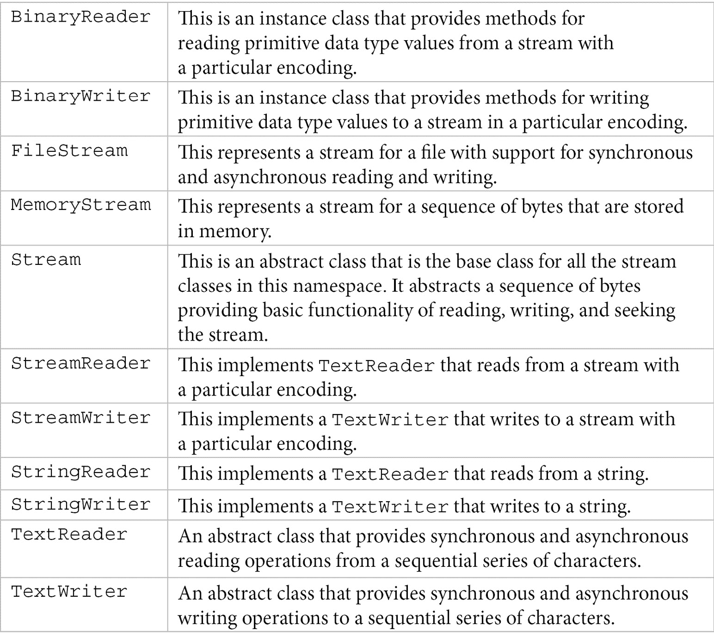
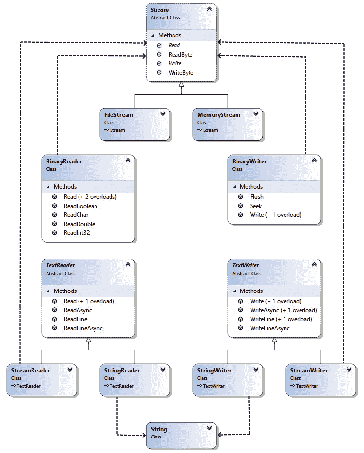
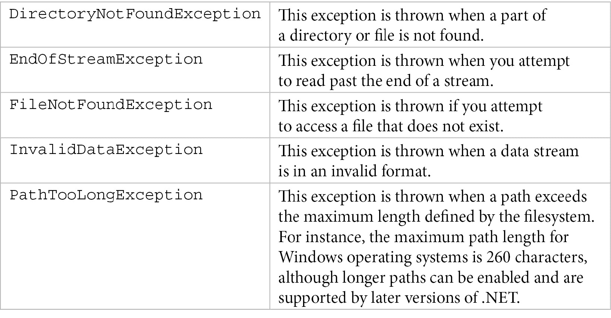
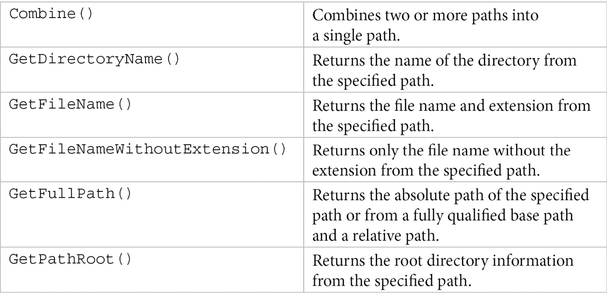
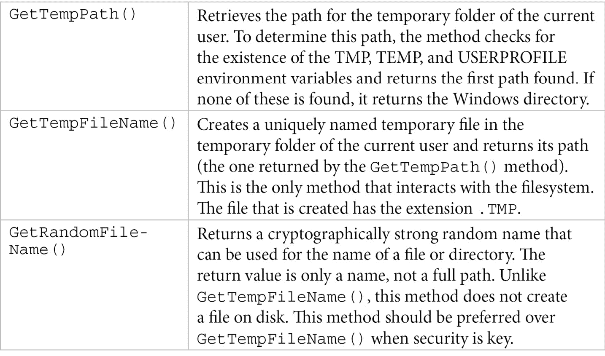
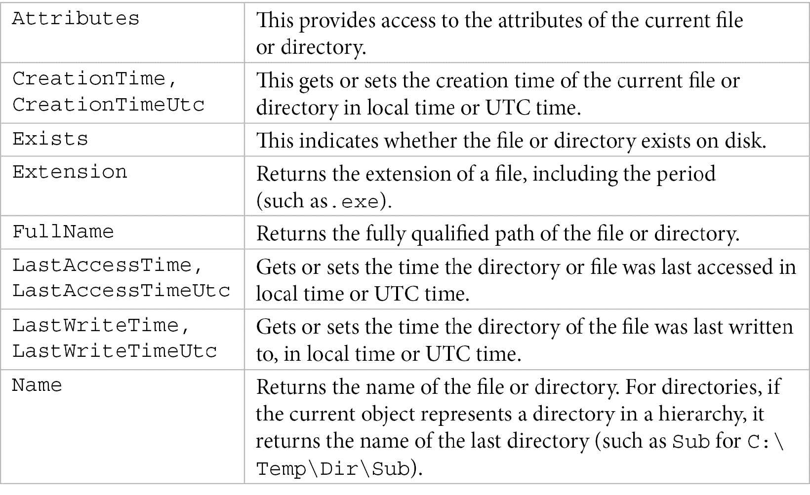
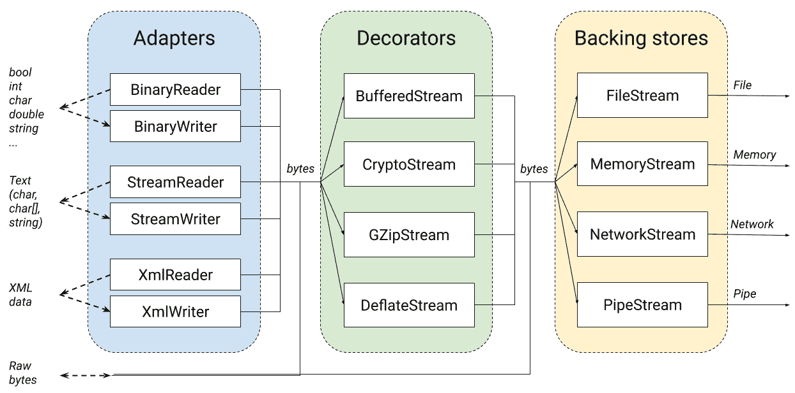
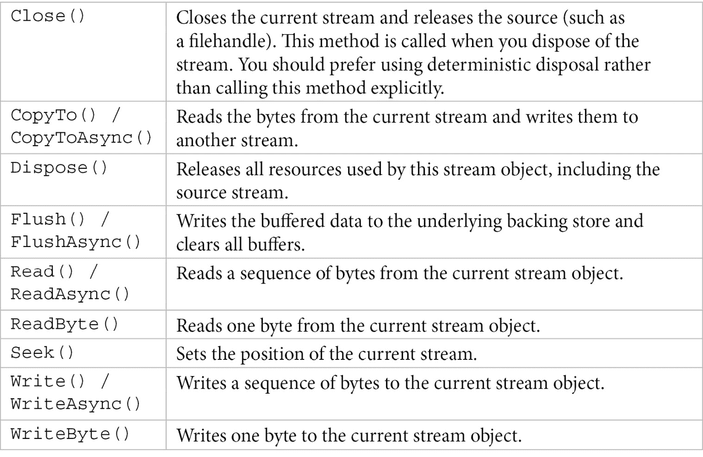

# 第十三章：文件、流和序列化

编程主要涉及处理可能来自各种来源的数据，例如本地内存、磁盘文件或通过网络从远程服务器获取的数据。大多数数据必须被持久化，以供长时间或无限期使用。它必须在不同应用程序重新启动之间可用，或在多个应用程序之间共享。无论存储是纯文本文件还是各种类型的数据库，无论它们是本地的、来自网络的还是云端的，无论物理位置是硬盘驱动器、固态驱动器还是 USB 存储设备，所有数据都保存在文件系统中。不同的平台具有不同类型的文件系统，但它们都使用相同的抽象：路径、文件和目录。

在本章中，我们将探讨.NET 为处理文件系统提供的功能。本章将涵盖的主要主题如下：

+   System.IO 命名空间概述

+   处理路径

+   处理文件和目录

+   处理流

+   序列化和反序列化 XML

+   序列化和反序列化 JSON

通过本章的学习，您将学会如何创建、修改和删除文件和目录。您还将学会如何读取和写入不同类型的数据文件（包括二进制和文本）。最后，您将学会如何将对象序列化为 XML 和 JSON。

让我们从探索`System.IO`命名空间开始。

# System.IO 命名空间概述

.NET 框架提供了类以及其他辅助类型，如枚举、接口和委托，帮助我们在基类库中使用`System.IO`命名空间。类型的完整列表相当长，但以下表格显示了其中最重要的类型，分成几个类别。

用于处理*文件系统对象*的最重要的类如下：


用于处理*流*的最重要的类如下：



如前表所示，此列表中的具体类是成对出现的：一个读取器和一个写入器。通常，它们的使用方式如下：

+   `BinaryReader`和`BinaryWriter`用于显式地将原始数据类型序列化和反序列化到二进制文件中。

+   `StreamReader`和`StreamWriter`用于处理来自文本文件的具有不同编码的基于字符的数据。

+   `StringReader`和`StringWriter`具有与前一对类似的接口和目的，尽管它们在字符串和字符串缓冲区上工作，而不是流。

前表中类之间的关系如下简化的类图所示：



图 13.1 - 流类以及先前提到的读取器和写入器类的类图

从这个图表中，您可以看到只有`FileStream`和`MemoryStream`实际上是流类。`BinaryReader`和`StreamReader`是适配器，从流中读取数据，而`BinaryWriter`和`StreamWriter`向流中写入数据。所有这些类都需要一个流来创建实例（流作为参数传递给构造函数）。另一方面，`StringReader`和`StringWriter`根本不使用流；相反，它们从字符串或字符串缓冲区中读取和写入。

文件系统对象或流的大多数操作在发生错误时会抛出异常。其中最重要的异常如下所列：



在本章的后续部分，我们将详细介绍其中一些类。现在，我们将从`Path`类开始。

# 处理路径

`System.IO.Path`是一个静态类，对表示文件系统对象（文件或目录）的路径执行操作。该类的方法都不验证字符串是否表示有效文件或目录的路径。但是，接受输入路径的成员会验证路径是否格式良好；否则，它们会抛出异常。该类可以处理不同平台的路径。路径的格式，如根元素的存在或路径分隔符，取决于平台，并由应用程序运行的平台确定。

路径可以是*相对的*或*绝对的*。绝对路径是完全指定位置的路径。另一方面，相对路径是由当前位置确定的部分位置，可以通过调用`Directory.GetCurrentDirector()`方法检索。

`Path`类的所有成员都是静态的。最重要的成员列在下表中：



为了了解这是如何工作的，我们可以考虑以下示例，其中我们使用`Path`类的各种方法打印有关`c:\Windows\System32\mmc.exe`路径的信息：

```cs
var path = @"c:\Windows\System32\mmc.exe";
Console.WriteLine(Path.HasExtension(path));
Console.WriteLine(Path.IsPathFullyQualified(path));
Console.WriteLine(Path.IsPathRooted(path));
Console.WriteLine(Path.GetPathRoot(path));
Console.WriteLine(Path.GetDirectoryName(path));
Console.WriteLine(Path.GetFileName(path));
Console.WriteLine(Path.GetFileNameWithoutExtension(path));
Console.WriteLine(Path.GetExtension(path));
Console.WriteLine(Path.ChangeExtension(path, ".dll"));
```

该程序的输出如下屏幕截图所示：

图 13.2 - 执行前面示例的屏幕截图，打印有关路径的信息

](img/Figure_13.2_B12346.jpg)

图 13.2 - 执行前面示例的屏幕截图，打印有关路径的信息

`Path`类包含一个名为`Combine()`的方法，建议使用它来从两个或多个路径组合新路径。该方法有四个重载；这些重载接受两个、三个、四个路径或路径数组作为输入参数。为了理解这是如何工作的，我们将看一下以下示例，其中我们正在连接两个路径：

```cs
var path1 = Path.Combine(@"c:\temp", @"sub\data.txt");
Console.WriteLine(path1); // c:\temp\sub\data.txt 
var path2 = Path.Combine(@"c:\temp\sub", @"..\", "log.txt");
Console.WriteLine(path2); // c:\temp\sub\..\log.txt
```

在第一个例子中，连接的结果是`c:\temp\sub\data.txt`，这在`temp`和`sub`之间正确地包括了路径分隔符，而这两个输入路径中都没有。在第二个例子中，连接三个路径的结果是`c:\temp\sub\..\log.txt`。请注意，路径被正确组合，但未解析为实际路径，即`c:\temp\log.txt`。

除了前面列出的方法之外，`Path`类中还有几个其他静态方法，其中一些用于处理临时文件。这些在这里列出：



让我们看一个处理临时路径的例子：

```cs
var temp = Path.GetTempPath();
var name = Path.GetRandomFileName();
var path1 = Path.Combine(temp, name);
Console.WriteLine(path1);
var path2 = Path.GetTempFileName();
Console.WriteLine(path2);
File.Delete(path2);
```

如下屏幕截图所示，`path1`将包含一个路径，例如`C:\Users\Marius\AppData\Local\Temp\w22fbbqw.y34`，尽管文件名（包括扩展名）会随着每次执行而改变。此外，这个路径不会在磁盘上创建，不像第二个例子，其中`C:\Users\Marius\AppData\Local\Temp\tmp8D5A.tmp`路径实际上代表一个新创建的文件：

图 13.3 - 屏幕截图，演示了使用 GetRandomFileName()方法

](img/Figure_13.3_B12346.jpg)

图 13.3 - 屏幕截图，演示了使用 GetRandomFileName()和 GetTempFileName()方法

这两个临时路径之间有两个重要的区别——第一个使用了加密强大的方法来生成名称，而第二个使用了一个更简单的算法。另一方面，`GetRandomFileName()`返回一个带有随机扩展名的名称，而`GetTempFileName()`总是返回一个带有`.TMP`扩展名的文件名。

要验证路径是否存在并执行创建、移动、删除或打开目录或文件等操作，我们必须使用`System.IO`命名空间中的其他类。我们将在下一节中看到这些类。

# 处理文件和目录

`System.IO`命名空间包含两个用于处理目录的类（`Directory`和`DirectoryInfo`），以及两个用于处理文件的类（`File`和`FileInfo`）。`Directory`和`File`是`DirectoryInfo`和`FileInfo`。

后两者都是从`FileSystemInfo`基类派生的，该基类提供了对文件和目录进行操作的常用成员。其中最重要的成员是以下表中列出的属性：



`DirectoryInfo`类的最重要成员（不包括在前面的表中列出的从基类继承的成员）如下：


同样，`FileInfo`类的最重要成员（不包括从基类继承的成员）如下：


现在我们已经看过了用于处理文件系统对象及其最重要成员的类，让我们看一些使用它们的示例。

在第一个示例中，我们将使用`DirectoryInfo`的实例来打印有关目录（在本例中为`C:\Program Files (x86)\Microsoft SDKs\Windows\`）的信息，如名称、父级、根、创建时间和属性，以及所有子目录的名称：

```cs
var dir = new DirectoryInfo(@"C:\Program Files (x86)\Microsoft SDKs\Windows\");
Console.WriteLine($"Full name : {dir.FullName}");
Console.WriteLine($"Name      : {dir.Name}");
Console.WriteLine($"Parent    : {dir.Parent}");
Console.WriteLine($"Root      : {dir.Root}");
Console.WriteLine($"Created   : {dir.CreationTime}");
Console.WriteLine($"Attribute : {dir.Attributes}");
foreach(var subdir in dir.EnumerateDirectories())
{
    Console.WriteLine(subdir.Name);
}
```

执行此代码的输出如下（请注意，每台执行代码的机器都会有所不同）：


图 13.4 - 屏幕截图显示先前示例的目录信息

`DirectoryInfo`还允许我们创建和删除目录，这是我们将在下一个示例中做的事情。首先，我们创建`C:\Temp\Dir\Sub`目录。其次，我们相对于先前的目录创建子目录层次结构`sub1\sub2\sub3`。最后，我们从`C:\Temp\Dir\Sub\sub1\sub2`目录中删除最内部的目录`sub3`：

```cs
var dir = new DirectoryInfo(@"C:\Temp\Dir\Sub");
Console.WriteLine($"Exists: {dir.Exists}");
dir.Create();
var sub = dir.CreateSubdirectory(@"sub1\sub2\sub3");
Console.WriteLine(sub.FullName);
sub.Delete();
```

请注意，`CreateSubdirectory()`方法返回一个表示创建的最内部子目录的`DirectoryInfo`实例，在这种情况下是`C:\Temp\Dir\Sub\sub1\sub2\sub3`。因此，在此实例上调用`Delete()`时，只会删除`sub3`子目录。

我们可以使用`Directory`静态类及其`CreateDirectory()`和`Delete()`方法来编写相同的功能，如下面的代码所示：

```cs
var path = @"C:\Temp\Dir\Sub";
Console.WriteLine($"Exists: {Directory.Exists(path)}");
Directory.CreateDirectory(path);
var sub = Path.Combine(path, @"sub1\sub2\sub3");
Directory.CreateDirectory(sub);
Directory.Delete(sub);
Directory.Delete(path, true);
```

第一次调用`Delete()`将删除`C:\Temp\Dir\Sub\sub1\sub2\sub3`子目录，但仅当它为空时。第二次调用将以递归方式删除`C:\Temp\Dir\Sub`子目录及其所有内容（文件和子目录）。

在下一个示例中，我们将列出从给定目录（在本例中为`C:\Program Files (x86)\Microsoft SDKs\Windows\v10.0A\bin\NETFX 4.8 Tools\`）开始以字母`T`开头的所有可执行文件。为此，我们将使用`GetFiles()`方法提供适当的过滤器。该方法返回一个`FileInfo`对象数组，我们使用该类的不同属性打印有关文件的信息：

```cs
var dir = new DirectoryInfo(@"C:\Program Files (x86)\Microsoft SDKs\Windows\v10.0A\bin\NETFX 4.8 Tools\");
foreach(var file in dir.GetFiles("t*.exe"))
{
    Console.WriteLine(
      $"{file.Name} [{file.Length}] 
    [{file.Attributes}]");}
```

执行此代码示例的输出可能如下所示：


图 13.5 - 屏幕截图显示从给定目录中以字母 T 开头的可执行文件列表

为了打印有关文件的信息，我们使用了之前提到的`FileInfo`类。`Name`、`Length`和`Attributes`只是该类提供的一些属性。其他包括扩展名和文件时间。下面的代码片段显示了使用它们的示例：

```cs
var file = new FileInfo(@"C:\Windows\explorer.exe");
Console.WriteLine($"Name: {file.Name}");
Console.WriteLine($"Extension: {file.Extension}");
Console.WriteLine($"Full name: {file.FullName}");
Console.WriteLine($"Length: {file.Length}");
Console.WriteLine($"Attributes: {file.Attributes}");
Console.WriteLine($"Creation: {file.CreationTime}");
Console.WriteLine($"Last access:{file.LastAccessTime}");
Console.WriteLine($"Last write: {file.LastWriteTime}");
```

尽管输出在每台机器上会有所不同，但应如下所示：


图 13.6 - 使用 FileInfo 类显示的详细文件信息

我们可以利用到目前为止学到的知识来创建一个函数，将目录的内容递归地写入控制台，并在这样做的同时，随着在目录层次结构中的深入导航，也缩进文件和目录的名称。这样的函数可能如下所示：

```cs
void PrintContent(string path, string indent = null)
{
    try
    {
        foreach(var file in Directory.EnumerateFiles(path))
        {
            var fi = new FileInfo(file);
            Console.WriteLine($"{indent}{fi.Name}");
        }
       foreach(var dir in Directory.EnumerateDirectories(path))
        {
            var di = new DirectoryInfo(dir);
            Console.WriteLine($"{indent}[{di.Name}]");
            PrintContent(dir, indent + " ");
        }
    }
    catch(Exception ex)
    {
        Console.Error.WriteLine(ex.Message);
    }
}
```

当以项目目录的路径作为输入执行时，它会将以下输出打印到控制台（以下截图是完整输出的一部分）：


图 13.7 - 打印指定目录内容的程序的部分输出

您可能已经注意到，我们同时使用了`GetFiles()`和`EnumerateFile()`，以及`EnumerateDirectories()`。这两组方法，以`Get`和`Enumerate`为前缀的方法，在返回文件或目录的集合方面是相似的。

然而，它们在一个关键方面有所不同——`Get`方法返回一个对象数组，而`Enumerate`方法返回一个`IEnumerable<T>`，允许客户端在检索到所有文件系统对象之前开始迭代，并且只消耗他们想要的。因此，在许多情况下，这些方法可能是一个更好的选择。

到目前为止，大多数示例都集中在获取文件和目录信息上，尽管我们确实创建和删除了目录。我们可以使用`File`和`FileInfo`类来创建和删除文件。例如，我们可以使用`File.Create()`来创建一个新文件或打开并覆盖现有文件，如下例所示：

```cs
using (var file = new StreamWriter(
   File.Create(@"C:\Temp\Dir\demo.txt")))
{
    file.Write("This is a demo");
}
```

`File.Create()`返回一个`FileStream`，在这个例子中，然后用它来创建一个`StreamWriter`，允许我们向文件写入文本`This is a demo`。然后流被处理，文件句柄被正确关闭。

如果您只对写入文本或二进制数据感兴趣，可以使用`File`类的静态成员，如`WriteAllText()`、`WriteAllLines()`或`WriteAllBytes()`。这些方法有多个重载，允许您指定文本编码，例如。还有异步对应方法，`WriteAllTextAsync()`、`WriteAllLinesAsync()`和`WriteAllBytesAsync()`。所有这些方法都会覆盖文件的当前内容（如果文件已经存在）。如果您希望保留内容并追加到文件的末尾，那么可以使用`AppendAllText()`和`AppendAllLines()`方法及其异步对应方法`AppendAllTextAsync()`和`AppendAllLinesAsync()`。

以下示例显示了如何使用这里提到的一些方法向现有文件写入和追加文本：

```cs
var path = @"C:\Temp\Dir\demo.txt";
File.WriteAllText(path, "This is a demo");
File.AppendAllText(path, "1st line");
File.AppendAllLines(path, new string[]{ 
   "2nd line", "3rd line"});
```

第一次调用`WriteAllText()`将`This is a demo`写入文件，覆盖任何内容。第二次调用`AppendAllText()`将`1st line`追加到文件中，而不添加任何新行。第三次调用`AppendAllLines()`将每个字符串写入文件，并在每个字符串后添加一个新行。因此，执行此代码后，文件的内容将如下所示：

```cs
This is a demo1st line2nd line
3rd line
```

与向文件写入内容类似，使用`File`类及其`ReadAllText()`、`ReadAllLines()`和`ReadAllBytes()`方法也可以进行读取。与写入方法一样，还有异步版本，`ReadAllTextAsync()`、`ReadAllLinesAsync()`和`ReadAllBytesAsync()`。下面的代码示例展示了如何使用其中一些方法：

```cs
var path = @"C:\Temp\Dir\demo.txt";
string text = File.ReadAllText(path);
string[] lines = File.ReadAllLines(path);
```

执行此代码后，`text`变量将包含从文件中读取的整个文本。另一方面，`lines`将是一个包含两个元素的数组，第一个是`This is a demo1st line2nd line`，第二个是`3rd line`。

纯文本并不是我们通常会写入文件的唯一类型的数据，文件也不是数据的唯一存储系统。有时，我们可能对从管道、网络、本地内存或其他地方读取和写入感兴趣。为了处理所有这些，.NET 提供了*流*，这是下一节的主题。

# 处理流

`Stream`，提供了对流进行读取和写入的支持。另一方面，流在概念上分为三类：

+   `FileStream`、`MemoryStream`和`NetworkStream`来实现后备存储。

+   `BufferedStream`、`CryptoStream`、`DeflateStream`和`GZipStream`。

+   `bool`、`int`、`double`等）、文本、XML 数据等。.NET 提供的适配器包括`BinaryReader`和`BinaryWriter`、`StreamReader`和`StreamWriter`，以及`XmlReader`和`XmlWriter`。

以下图表概念上展示了流架构：



图 13.8 - 流架构的概念图

讨论前面图中显示的所有流类超出了本书的范围。然而，在本节中，我们将重点关注`BinaryReader`/`BinaryWriter`和`StreamReader`/`StreamWriter`适配器，以及`FileStream`和`MemoryStream`后备存储流。

## 流类的概述

正如我之前提到的，所有流类的基类是`System.IO.Stream`类。这是一个提供从流中读取和写入的方法和属性的抽象类。其中许多是抽象的，并且在派生类中实现。以下是该类的最重要的方法：



列出的一些操作有异步伴侣，其后缀为`Async`（例如`ReadAsync()`或`WriteAsync()`）。读取和写入操作会使指示当前流位置的指针前进读取或写入的字节数。

`Stream`类还提供了几个有用的属性，列在下表中：


代表文件的后备存储流的类称为`FileStream`。这个类是从抽象的`Stream`类派生而来的，并实现了抽象成员。它支持同步和异步操作，并且不仅可以用于打开、读取、写入和关闭磁盘文件，还可以用于其他操作系统对象，比如管道和标准输入和输出。异步方法对于执行耗时操作而不阻塞主线程非常有用。

`FileStream`类支持对文件的随机访问。`Seek()`方法允许我们在流内移动当前指针的位置进行读取/写入。在改变位置时，必须指定一个字节偏移量和一个查找原点。字节偏移量是相对于查找原点的，查找原点可以是流的开头、当前位置或者末尾。

该类提供了许多构造函数来创建类的实例。您可以以各种组合提供文件句柄（作为`IntPtr`或`SafeFileHandle`）、文件路径、文件模式（确定文件应该如何打开）、文件访问（确定文件应该如何访问 - 读取、写入或两者）、以及文件共享（确定其他文件流如何访问相同的文件）。在这里列出所有这些构造函数是不切实际的，但我们将在本章中看到几个示例。

表示内存备份存储的类称为`MemoryStream`，也是从`Stream`派生而来的。该类的大多数成员都是基类的抽象成员的实现。但是，该类具有几个构造函数，允许我们创建**可调整大小的流**（初始为空或具有指定容量）或从字节数组创建**不可调整大小的流**。从字节数组创建的内存流不能扩展或收缩，可以是可写的或只读的。

## 使用文件流

`FileStream`类允许我们从文件中读取和写入一系列字节。它可以操作原始数据，如`byte[]`、`Span<byte>`或`Memory<byte>`。我们可以使用`File`类的静态方法或`FileInfo`类的非静态方法来获取`FileStream`对象：


我们可以通过以下示例看到这是如何工作的，我们将四个字节写入到位于`C:\Temp\data.raw`的文件中，然后读取文件的整个内容并将其打印到控制台上：

```cs
var path = @"C:\Temp\data.raw";
var data = new byte[] { 0xBA, 0xAD, 0xF0, 0x0D};
using(FileStream wr = File.Create(path))
{
    wr.Write(data, 0, data.Length);
}
using(FileStream rd = File.OpenRead(path))
{
    var buffer = new byte[rd.Length];
    rd.Read(buffer, 0, buffer.Length);
    Console.WriteLine(
       string.Join(" ", buffer.Select(
                   e => $"{e:X02}")));
}
```

在第一部分中，我们使用`File.Create()`打开一个文件进行写入。如果文件不存在，则会创建文件。如果文件存在，则其内容将被覆盖。使用`FileStream.Write()`方法将字节数组的内容写入文件。当`FileStream`对象在`using`语句结束时被处理时，流将被刷新到文件，并关闭文件句柄。

在第二部分中，我们使用`File.OpenRead()`打开先前写入的文件，但这次是用于读取。我们分配了一个足够大的数组来接收文件的整个内容，并使用`FileStream.Read()`来读取其内容。这段代码的输出如下：


图 13.9 - 显示在控制台上创建的二进制文件的内容

处理原始数据可能很麻烦。因此，.NET 提供了流适配器，允许我们处理更高级别的数据。第一对适配器是`BinaryReader`和`BinaryWriter`，它们提供了对二进制格式中的原始类型和字符串的读取和写入支持。以下是使用这两个适配器的示例：

```cs
var path = @"C:\Temp\data.bin";
using (var wr = new BinaryWriter(File.Create(path)))
{
    wr.Write(true);
    wr.Write('x');
    wr.Write(42);
    wr.Write(19.99);
    wr.Write(49.99M);
    wr.Write("text");
}
using(var rd = new BinaryReader(File.OpenRead(path)))
{
    Console.WriteLine(rd.ReadBoolean()); // True
    Console.WriteLine(rd.ReadChar());    // x
    Console.WriteLine(rd.ReadInt32());   // 42
    Console.WriteLine(rd.ReadDouble());  // 19.99
    Console.WriteLine(rd.ReadDecimal()); // 49.99
    Console.WriteLine(rd.ReadString());  // text
} 
```

我们首先使用`File.Create()`打开一个文件，返回`FileStream`。这个流被用作`BinaryWriter`流适配器的构造函数的参数。`Write()`方法对所有原始类型（`char`、`bool`、`sbyte`、`byte`、`short`、`ushort`、`int`、`uint`、`long`、`ulong`、`float`、`double`和`decimal`）以及`byte[]`、`char[]`和`string`进行了重载。

其次，我们重新打开相同的文件，但这次是用于读取，使用`File.OpenRead()`。这个方法返回的`FileStream`对象被用作`BinaryReader`流适配器的构造函数的参数。该类有一组读取方法，每种原始类型都有一个，比如`ReadBoolean()`、`ReadChar()`、`ReadInt16()`、`ReadInt32()`、`ReadDouble()`和`ReadDecimal()`，以及用于读取`byte[]`的方法 - `ReadBytes()`，`char[]` - `ReadChars()`，和字符串 - `ReadString()`。你可以在前面的示例中看到其中一些方法的使用。

默认情况下，`BinaryReader`和`BinaryWriter`都使用*UTF-8 编码*处理字符串。但是，它们都有重载的构造函数，允许我们使用`System.Text.Encoding`类指定另一种编码。

尽管这两个适配器可以用于处理字符串，但由于缺乏对诸如行处理之类的功能的支持，因此使用它们来读写文本文件可能会很麻烦。为了处理文本文件，应该使用`StreamReader`和`StreamWriter`适配器。默认情况下，它们将文本处理为 UTF-8 编码，但它们的构造函数允许我们指定不同的编码。在以下示例中，我们将文本写入文件，然后将其读取并打印到控制台：

```cs
var path = @"C:\Temp\data.txt";
using(StreamWriter wr = File.CreateText(path))
{
    wr.WriteLine("1st line");
    wr.WriteLine("2nd line");
}
using(StreamReader rd = File.OpenText(path))
{
    while(!rd.EndOfStream)
        Console.WriteLine(rd.ReadLine());
}
```

`File.CreateText()`方法打开一个文件进行写入（创建或覆盖），并返回一个使用 UTF-8 编码的`StreamWriter`类的实例。`WriteLine()`方法将字符串写入文件，然后添加一个新行。`WriteLine()`有重载版本，还有重载的`Write()`方法，可以在不添加新行的情况下写入`char`、`char[]`或`string`。

在第二部分中，我们使用`File.OpenText()`方法打开先前写入的文本文件进行读取。这会返回一个读取 UTF-8 文本的`StreamReader`对象。`ReadLine()`方法用于在循环中逐行读取内容，直到流的末尾。`EndOfStream`属性用于检查当前流位置是否达到流的末尾。

我们可以使用`File.Open()`方法，而不是使用`File.OpenText()`方法，这允许我们指定打开模式、文件访问和共享。我们可以将之前显示的读取部分重写如下：

```cs
using(var rd = new StreamReader(
  File.Open(path, FileMode.Open,
         FileAccess.Read, 
         FileShare.Read)))
{
    while (!rd.EndOfStream)
        Console.WriteLine(rd.ReadLine());
}
```

有时，我们需要一个流来处理临时数据。使用文件可能很麻烦，也会给 I/O 操作增加不必要的开销。为此，内存流是最合适的。

## 使用内存流

**内存流**是本地内存的后备存储。这样的流在需要临时存储转换数据时非常有用。示例可以包括 XML 序列化或数据压缩和解压缩。我们将在接下来的代码中看到这两个操作。

下面的代码中显示的静态`Serializer<T>`类包含两个方法——`Serialize()`和`Deserialize()`。前者接受一个`T`对象，使用`XmlSerializer`生成其 XML 表示，并将 XML 数据作为字符串返回。后者接受包含 XML 数据的字符串，并使用`XmlSerializer`读取它并从中创建一个新的`T`类型对象。以下是代码：

```cs
public static class Serializer<T>
{
    static readonly XmlSerializer _serializer =
       new XmlSerializer(typeof(T));
    static readonly Encoding _encoding = Encoding.UTF8;
    public static string Serialize(T value)
    {
        using (var ms = new MemoryStream())
        {
            _serializer.Serialize(ms, value);
            return _encoding.GetString(ms.ToArray());
        }
    }
    public static T Deserialize(string value)
    {
        using (var ms = new MemoryStream(
           _encoding.GetBytes(value)))
        {
            return (T)_serializer.Deserialize(ms);
        }
    }
}
```

在`Serialize()`方法中创建的内存流是可调整大小的。它最初是空的，根据需要增长。然而，在`Deserialize()`方法中创建的内存流是不可调整大小的，因为它是从字节数组初始化的。这个流用于只读目的。

`MemoryStream`类实现了`IDisposable`接口，因为它继承自`Stream`，而`Stream`实现了`IDisposable`。然而，`MemoryStream`没有需要处理的资源，因此`Dispose()`方法什么也不做。显式调用对流没有影响。因此，不需要像前面的例子中那样将内存流变量包装在`using`语句中。

让我们考虑一个`Employee`类的以下实现：

```cs
public class Employee
{
    public int EmployeeId { get; set; }
    public string FirstName { get; set; }
    public string LastName { get; set; }
    public override string ToString() => 
        $"[{EmployeeId}] {LastName}, {FirstName}";
}
```

我们可以按照以下方式对这个类的实例进行序列化和反序列化：

```cs
var employee = new Employee
{
    EmployeeId = 42,
    FirstName = "John",
    LastName = "Doe"
};
var text = Serializer<Employee>.Serialize(employee);
var result = Serializer<Employee>.Deserialize(text);
Console.WriteLine(employee);
Console.WriteLine(text);
Console.WriteLine(result);
```

执行此代码的结果显示在以下屏幕截图中：


图 13.10 – 在控制台上显示的 XML 序列化的 Employee 对象

我们提到的另一个内存流很方便的例子是*数据的压缩和解压缩*。`System.IO.Compression`命名空间中的`GZipStream`类是一个流装饰器，支持使用 GZip 数据格式规范对流进行压缩和解压缩。`MemoryStream`对象被用作`GZipStream`装饰器的后备存储。这里显示的静态`Compression`类提供了压缩和解压缩字节数组的两个方法：

```cs
public static class Compression
{
    public static byte[] Compress(byte[] data)
    {
        if (data == null) return null;
        if (data.Length == 0) return new byte[] { };
        using var ms = new MemoryStream();
        using var gzips =
           new GZipStream(ms,
        CompressionMode.Compress);
        gzips.Write(data, 0, data.Length);
        gzips.Close();
        return ms.ToArray();
    }
    public static byte[] Decompress(byte[] data)
    {
        if (data == null) return null;
        if (data.Length == 0) return new byte[] { };

        using var source = new MemoryStream(data);
        using var gzips =
           new GZipStream(source,
        CompressionMode.Decompress);
        using var target = new MemoryStream(data.Length * 2);
        gzips.CopyTo(target);
        return target.ToArray();
    }
}
```

我们可以使用这个辅助类将字符串压缩为字节数组，然后将其解压缩为字符串。以下代码显示了这样一个例子：

```cs
var text = "Lorem ipsum dolor sit amet, consectetur adipiscing elit, sed do eiusmod tempor incididunt ut labore et dolore magna aliqua.";
var data = Encoding.UTF8.GetBytes(text);
var compressed = Compression.Compress(data);
var decompressed = Compression.Decompress(compressed);
var result = Encoding.UTF8.GetString(decompressed);
Console.WriteLine($"Text size: {text.Length}");
Console.WriteLine($"Compressed: {compressed.Length}");
Console.WriteLine($"Decompressed: {decompressed.Length}");
Console.WriteLine(result);
if (text == result)
    Console.WriteLine("Decompression successful!");
```

执行此示例代码的输出显示在以下屏幕截图中：


图 13.11 – 一个屏幕截图，显示了压缩和解压文本的结果

在本节中，我们已经看到了如何简单地序列化和反序列化 XML。我们将在下一节详细介绍这个主题。

# 序列化和反序列化 XML

在前一节中，我们已经看到了如何使用`System.Xml.Serialization`命名空间中的`XmlSerializer`类对数据进行序列化和反序列化。这个类对于将对象序列化为 XML 和将 XML 反序列化为对象非常方便。尽管在前面的示例中，我们使用了内存流进行序列化，但它实际上可以与任何流一起使用；此外，它还可以与`TextWriter`和`XmlWriter`适配器一起使用。

以下示例显示了一个修改后的`Serializer<T>`类，其中我们指定了要将 XML 文档写入或从中读取的文件的路径：

```cs
public static class Serializer<T>
{
    static readonly XmlSerializer _serializer = 
        new XmlSerializer(typeof(T));
    public static void Serialize(T value, string path)
    {
        using var ms = File.CreateText(path);
        _serializer.Serialize(ms, value);
    }
    public static T Deserialize(string path)
    {
        using var ms = File.OpenText(path);
        return (T)_serializer.Deserialize(ms);
    }
}
```

我们可以像下面这样使用这个新的实现：

```cs
var employee = new Employee
{
    EmployeeId = 42,
    FirstName = "John",
    LastName = "Doe"
};
var path = Path.Combine(Path.GetTempPath(), "employee1.xml");
Serializer<Employee>.Serialize(employee, path);
var result = Serializer<Employee>.Deserialize(path);
```

使用此代码进行 XML 序列化的结果是具有以下内容的文档：

```cs
<?xml version="1.0" encoding="utf-8"?>
<Employee xmlns:xsi="http://www.w3.org/2001/XMLSchema-instance" xmlns:xsd="http://www.w3.org/2001/XMLSchema">
  <EmployeeId>42</EmployeeId>
  <FirstName>John</FirstName>
  <LastName>Doe</LastName>
</Employee>
```

`XmlSerializer`通过将类型的所有公共属性和字段序列化为 XML 来工作。它使用一些默认设置，例如类型变为节点，属性和字段变为元素。类型、属性或字段的名称成为节点或元素的名称，字段或属性的值成为其文本。它还添加了默认命名空间（您可以在前面的代码中看到）。但是，可以使用类型和成员上的属性来控制序列化的方式。下面的代码示例中显示了这样一个示例：

```cs
[XmlType("employee")]
public class Employee
{
    [XmlAttribute("id")]
    public int EmployeeId { get; set; }
    [XmlElement(ElementName = "firstName")]
    public string FirstName { get; set; }
    [XmlElement(ElementName = "lastName")]
    public string LastName { get; set; }
    public override string ToString() => 
        $"[{EmployeeId}] {LastName}, {FirstName}";
}
```

对这个`Employee`类实现的实例进行序列化将产生以下 XML 文档：

```cs
<?xml version="1.0" encoding="utf-8"?>
<employee xmlns:xsi="http://www.w3.org/2001/XMLSchema-instance" xmlns:xsd="http://www.w3.org/2001/XMLSchema" id="42">
  <firstName>John</firstName>
  <lastName>Doe</lastName>
</employee>
```

我们在这里使用了几个属性，`XmlType`、`XmlAttribute`和`XmlElement`，但列表很长。以下表列出了最重要的 XML 属性及其作用。这些属性位于`System.Xml.Serialization`命名空间中：


`XmlSerializer`类的工作方式是，在运行时，每次应用程序运行时，为临时序列化程序集中的每种类型生成序列化代码。在某些情况下，这可能是一个性能问题，可以通过预先生成这些程序集来避免。`Sgen.exe`可以用来生成这些程序集。如果包含序列化代码的程序集称为`MyAssembly.dll`，则生成的序列化程序集将被称为`MyAssembly.XmlSerializer.dll`。该工具作为 Windows SDK 的一部分部署。

您还可以使用`xsd.exe`从类生成 XML 模式（XSD 文档）或从现有 XML 模式生成类。该工具作为 Windows SDK 的一部分或与 Visual Studio 一起分发。

`XmlSerializer`可能存在的问题是，它将单个.NET 对象序列化为 XML 文档（当然，该对象可以是复杂的，并包含其他对象和对象数组）。如果您有两个要写入同一文档的单独对象，则无法正常工作。假设我们还有以下类，表示公司中的一个部门：

```cs
public class Department
{
    [XmlAttribute]
    public int Id { get; set; }

    public string Name { get; set; }
}
```

我们可能希望编写一个包含员工和部门的 XML 文档。使用`XmlSerializer`将无法正常工作。这在以下示例中显示：

```cs
public static class Serializer<T>
{
    static readonly XmlSerializer _serializer = 
        new XmlSerializer(typeof(T));
    public static void Serialize(T value, StreamWriter stream)
    {
        _serializer.Serialize(stream, value);
    }
    public static T Deserialize(StreamReader stream)
    {
        return (T)_serializer.Deserialize(stream);
    }
}
```

我们可以尝试使用以下代码将员工和部门序列化到同一个 XML 文档中：

```cs
var employee = new Employee
{
    EmployeeId = 42,
    FirstName = "John",
    LastName = "Doe"
};
var department = new Department
{
    Id = 102, 
    Name = "IT"
};
var path = Path.Combine(Path.GetTempPath(), "employee.xml");
using (var wr = File.CreateText(path))
{
    Serializer<Employee>.Serialize(employee, wr);
    wr.WriteLine();
    Serializer<Department>.Serialize(department, wr);
}
```

生成到磁盘文件的 XML 文档将具有以下代码中显示的内容。这不是有效的 XML，因为它具有多个文档声明，并且没有单个根元素：

```cs
<?xml version="1.0" encoding="utf-8"?>
<employee xmlns:xsi="http://www.w3.org/2001/XMLSchema-instance" xmlns:xsd="http://www.w3.org/2001/XMLSchema" id="42">
   <firstName>John</firstName>
   <lastName>Doe</lastName>
</employee>
<?xml version="1.0" encoding="utf-8"?>
<Department xmlns:xsi="http://www.w3.org/2001/XMLSchema-instance" xmlns:xsd="http://www.w3.org/2001/XMLSchema" Id="102">
   <Name>IT</Name>
</Department>
```

要使其工作，我们必须创建一个额外的类型，该类型将包含一个员工和一个部门，并且我们必须序列化此类型的实例。此额外对象将作为 XML 文档的根元素进行序列化。我们将通过以下示例进行演示（请注意，这里有一个额外的名为`Version`的属性）：

```cs
public class Data
{
    [XmlAttribute]
    public int Version { get; set; }
    public Employee Employee { get; set; }
    public Department Department { get; set; }
}
var data = new Data()
{
    Version = 1,
    Employee = new Employee {
        EmployeeId = 42,
        FirstName = "John",
        LastName = "Doe"
    },
    Department = new Department {
        Id = 102,
        Name = "IT"
    }
};
var path = Path.Combine(Path.GetTempPath(), "employee.xml");
using (var wr = File.CreateText(path))
{
    Serializer<Data>.Serialize(data, wr);
}
```

这次，输出是一个格式良好的 XML 文档，列在以下代码中：

```cs
<?xml version="1.0" encoding="utf-8"?>
<Data xmlns:xsi="http://www.w3.org/2001/XMLSchema-instance" xmlns:xsd="http://www.w3.org/2001/XMLSchema" Version="1">
  <Employee id="42">
    <firstName>John</firstName>
    <lastName>Doe</lastName>
  </Employee>
  <Department Id="102">
    <Name>IT</Name>
  </Department>
</Data>
```

为了进一步控制读取和写入 XML，.NET 基类库包含两个名为`XmlReader`和`XmlWriter`的类，它们提供了一种快速、非缓存、仅向前的方式来从流或文件读取或生成 XML 数据。

`XmlWriter`类可用于将 XML 数据写入流、文件、文本读取器或字符串。它提供了以下功能：

+   验证字符和 XML 名称

+   验证 XML 文档是否格式良好

+   支持 CLR 类型，这样您就不需要手动将所有内容转换为字符串

+   用于在 XML 文档中写入二进制数据的 Base64 和 BaseHex 编码

`XmlWriter`类包含许多方法；其中一些方法列在下表中。尽管此列表仅包括同步方法，但它们都有异步伴侣，比如`WriteElementStringAsync()`对应于`WriteElementString()`：


在使用`XmlWriter`时，可以指定各种设置，如编码、缩进、属性应该如何写入（在新行上还是同一行上）、省略 XML 声明等。这些设置由`XmlWriterSettings`类控制。

以下清单显示了使用`XmlWriter`创建包含员工和部门的 XML 文档的示例，作为名为`Data`的根元素的一部分。实际上，结果与前一个示例相同，只是没有创建命名空间：

```cs
var employee = new Employee
{
    EmployeeId = 42,
    FirstName = "John",
    LastName = "Doe"
};
var department = new Department
{
    Id = 102,
    Name = "IT"
};
var path = Path.Combine(Path.GetTempPath(), "employee.xml");
var settings = new XmlWriterSettings 
{ 
    Encoding = Encoding.UTF8, 
    Indent = true 
};
var namespaces = new XmlSerializerNamespaces();
namespaces.Add(string.Empty, string.Empty);
using (var wr = XmlWriter.Create(path, settings))
{
    wr.WriteStartDocument();
    wr.WriteStartElement("Data");
    wr.WriteStartAttribute("Version");
    wr.WriteValue(1);
    wr.WriteEndAttribute();
    var employeeSerializer = 
      new XmlSerializer(typeof(Employee));
    employeeSerializer.Serialize(wr, employee, namespaces);
    var depSerializer = new XmlSerializer(typeof(Department));
    depSerializer.Serialize(wr, department, namespaces);
    wr.WriteEndElement();
    wr.WriteEndDocument();
}
```

在这个例子中，我们使用了以下组件：

+   `XmlWriterSettings`的一个实例，用于将编码设置为 UTF-8 并启用输出的缩进。

+   `XmlWriter.Create()`用于创建`XmlWriter`类的实现的实例。

+   `XmlWriter`类的各种方法来写入 XML 数据。

+   `XmlSerializerNamespaces`的实例，用于控制生成的命名空间。在这个例子中，我们添加了一个空的方案和命名空间，这导致 XML 文档中没有命名空间。

+   `XmlSerializer`类的实例，用于简化`Employee`和`Department`对象到 XML 文档的序列化。这是可能的，因为`Serialize()`方法可以将`XmlWriter`作为生成的 XML 文档的目的地。

`XmlWriter`的伴侣类是`XmlReader`。这个类允许我们在 XML 数据中移动并读取其内容，但是以一种只能向前的方式，这意味着您不能从给定点返回。`XmlReader`类是一个抽象类，就像`XmlWriter`一样，有具体的实现，比如`XmlTextReader`、`XmlNodeReader`或`XmlValidatingReader`。

然而，对于大多数情况，您应该使用`XmlReader`。要创建它的实例，请使用静态的`XmlReader.Create()`方法。该类包含一长串的方法和属性，以下表格列出了其中的一些。就像在`XmlWriter`的情况下一样，`XmlReader`也有同步和异步方法。这里只列出了一些同步方法：


在创建`XmlReader`的实例时，您可以指定要启用的一组功能，例如应使用的模式、忽略注释或空格、类型分配的验证等。`XmlReaderSettings`类用于此目的。

在下面的示例中，我们使用`XmlReader`来读取先前写入的 XML 文档的内容，并在控制台上显示其内容的表示：

```cs
var rdsettings = new XmlReaderSettings()
{
    IgnoreComments = true,
    IgnoreWhitespace = true
};
using (var rd = XmlReader.Create(path, rdsettings))
{
    string indent = string.Empty;
    while(rd.Read())
    {
        switch(rd.NodeType)
        {
            case XmlNodeType.Element:
                Console.Write(
                  $"{indent}{{ {rd.Name} : ");
                indent = indent + " ";
                while (rd.MoveToNextAttribute())
                {
                    Console.WriteLine();
                    Console.WriteLine($"{indent}{{{rd.Name}:{rd.Value}}}");
                } 
                break;
            case XmlNodeType.Text:
                Console.Write(rd.Value);
                break;
            case XmlNodeType.EndElement:
                indent = indent.Remove(0, 2);
                Console.WriteLine($"{indent}}}");
                break;
            default:
                Console.WriteLine($"[{rd.Name} {rd.Value}]");
                break;
        }
    }
}
```

执行此代码的输出如下：


图 13.12 - 从磁盘读取的 XML 文档内容的屏幕截图并显示在控制台上

以下是此示例的几个关键点：

+   我们创建了一个`XmlReaderSettings`的实例，告诉`XmlReader`忽略注释和空格。

+   我们使用`XmlReader.Create()`创建了一个新的`XmlReader`实现的实例，用于从指定路径的文件中读取 XML 数据。

+   `Read()`方法用于循环读取 XML 文档的每个节点。

+   我们使用属性，如`NodeType`，`Name`和`Value`来检查每个节点的类型，名称和值。

有关使用`XmlReader`和`XmlWriter`处理 XML 数据以及使用`XmlSerializer`进行序列化的许多细节。在这里讨论所有这些内容将花费太多时间。我们建议您使用其他资源，如官方文档，来了解更多关于这些类的信息。

现在我们已经看到了如何处理 XML 数据，让我们来看看 JSON。

# 序列化和反序列化 JSON

近年来，**JavaScript 对象表示法（JSON）**已成为数据序列化的事实标准，不仅用于 Web 和移动端，也用于桌面端。.NET 没有提供适当的库来序列化和反序列化 JSON；因此，开发人员转而使用第三方库。其中一个库是**Json.NET**（也称为**Newtonsoft.Json**，以其创建者 Newton-King 命名）。这已成为大多数.NET 开发人员的首选库，并且是 ASP.NET Core 的依赖项。然而，随着.NET Core 3.0 的发布，微软提供了自己的 JSON 序列化器，称为**System.Text.Json**，根据其可用的命名空间命名。在本章的最后部分，我们将看看这两个库，并了解它们的一些功能以及它们之间的比较。

## 使用 Json.NET

Json.NET 目前是最广泛使用的.NET 库，用于 JSON 序列化和反序列化。它是一个高性能、易于使用的开源库，可作为名为**Newtonsoft.Json**的 NuGet 包使用。事实上，这是迄今为止在 NuGet 上下载量最大的包。它提供的一些功能列在这里：

+   大多数常见序列化和反序列化场景的简单 API，使用`JsonConvert`，它是`JsonSerializer`的包装器。

+   使用`JsonSerializer`对序列化/反序列化过程进行更精细的控制。该类可以通过`JsonTextWriter`和`JsonTextReader`直接向流中写入文本或从流中读取文本。

+   使用`JObject`，`JArray`和`JValue`创建，修改，解析和查询 JSON 的可能性。

+   在 XML 和 JSON 之间进行转换的可能性。

+   使用 JSON Path 查询 JSON 的可能性，这是一种类似于 XPath 的查询语言。

+   使用 JSON 模式验证 JSON。

+   支持`BsonReader`和`BsonWriter`。这是一种类似于 JSON 的文档的二进制编码序列化。

在本节中，我们将使用以下`Employee`类的实现来探索几种常见的序列化和反序列化场景：

```cs
public enum EmployeeStatus { Active, Inactive }
public class Employee
{
    public int EmployeeId { get; set; }
    public string FirstName { get; set; }
    public string LastName { get; set; }
    public DateTime? HireDate { get; set; }
    public List<string> Telephones { get; set; }
    public bool IsOnLeave { get; set; }   

    [JsonConverter(typeof(StringEnumConverter))]
    public EmployeeStatus Status { get; set; }
    [JsonIgnore]
    public DateTime LastModified { get; set; }
    public override string ToString() => 
        $"[{EmployeeId}] {LastName}, {FirstName}";
}
```

尽管该库功能丰富，但在这里涵盖所有功能超出了本书的范围。我们建议阅读 Json.NET 的在线文档，网址为 https://www.newt](https://www.newtonsoft.com/json)onsoft.com/json。

获取包含`Employee`对象的 JSON 序列化的字符串非常简单，如下例所示：

```cs
var employee = new Employee
{
    EmployeeId = 42,
    FirstName = "John",
    LastName = "Doe"
};
var text = JsonConvert.SerializeObject(employee);
```

默认情况下，`JsonConvert.SerializeObject()`将生成缩小的 JSON，不包含缩进和空格。上述代码的结果是以下 JSON：

```cs
{"EmployeeId":42,"FirstName":"John","LastName":"Doe",
"HireDate":null,"Telephones":null,"IsOnLeave":false,
"Status":"Active"}
```

尽管这适用于在网络上传输数据，比如与 web 服务通信时，因为大小较小，它更难以被人类阅读。如果您希望 JSON 文档可读性强，应该使用缩进。这可以通过提供格式选项来指定，该选项可用于`Formatting`枚举。这里显示了一个示例：

```cs
var text = JsonConvert.SerializeObject(
    employee, Formatting.Indented);
```

这次，结果如下：

```cs
{
  "EmployeeId": 42,
  "FirstName": "John",
  "LastName": "Doe",
  "HireDate": null,
  "Telephones": null,
  "IsOnLeave": false,
  "Status": "Active"
}
```

缩进不是我们可以指定的唯一序列化选项。实际上，您可以使用`JsonSerializerSettings`类设置许多选项，该类可以作为`SerializeObject()`方法的参数提供。例如，我们可能希望跳过序列化引用的属性或字段，或者将设置为`null`的可空类型。例如，`HireDate`和`Telephones`分别是`DateTime?`和`List<string>`类型。可以按以下方式完成：

```cs
var text = JsonConvert.SerializeObject(
    employee,
    Formatting.Indented,
    new JsonSerializerSettings()
    {
        NullValueHandling = NullValueHandling.Ignore,
    });
```

在前面的示例中，我们使用的`employee`对象序列化的结果如下所示。您会注意到`HireDate`和`Telephones`不再出现在生成的 JSON 中：

```cs
{
  "EmployeeId": 42,
  "FirstName": "John",
  "LastName": "Doe",
  "IsOnLeave": false,
  "Status": "Active"
}
```

可以为序列化指定的另一个选项控制默认值的处理方式。`DefaultValueHandling`是一个枚举，指定了默认值的成员应该如何被序列化或反序列化。通过指定`Ignore`，您可以使序列化器跳过输出中值与其类型的默认值相同的成员（对于数字类型为`0`，对于`bool`为`false`，对于引用和可空类型为`null`）。实际上可以使用一个名为`DefaultValueAttribute`的属性来更改被忽略的默认值，该属性被指定在成员上。让我们考虑以下示例：

```cs
var text = JsonConvert.SerializeObject(
    employee,
    Formatting.Indented,
    new JsonSerializerSettings()
    {
        NullValueHandling = NullValueHandling.Ignore,
        DefaultValueHandling = DefaultValueHandling.Ignore
    });
```

这次，生成的 JSON 更加简单，如下所示。这是因为`IsOnLeave`和`Status`属性分别设置为它们的默认值，即`false`和`EmployeeStatus.Active`：

```cs
{
  "EmployeeId": 42,
  "FirstName": "John",
  "LastName": "Doe"
}
```

我们之前提到了一个叫做`DefaultValueAttribute`的属性。您可能已经注意到在`Employee`类的声明中使用了另外两个属性，`JsonIgnoreAttribute`和`JsonConverterAttribute`。序列化可以通过属性进行控制，该库支持标准的.NET 序列化属性（如`SerializableAttribute`、`DataContractAttribute`、`DataMemberAttribute`和`NonSerializedAttributes`）和内置的 Json.NET 属性。当两者同时存在时，内置的 Json.NET 属性优先于其他属性。内置的 Json.NET 属性如下表所示：


在这些属性中，我们使用了`JsonIgnoreAttribute`来指示`Employee`类的`LastModified`属性不应该被序列化，并使用了`JsonConverterAttribute`来指示`Status`属性应该使用`StringEnumConverter`类进行序列化。结果是该属性将被序列化为一个字符串（值为`Active`或`Inactive`），而不是一个数字（值为`0`或`1`）。

`JsonConvert.SerializeObject()`方法返回一个字符串。可以使用流（如文件或内存流）进行序列化和反序列化。但是，为此我们必须使用`JsonSerializer`类。该类具有重载的`Serialize()`和`Deserialize()`方法，以及一系列属性，允许我们自定义序列化。以下示例显示了如何使用该类将迄今为止使用的员工对象序列化到磁盘上的文本文件中：

```cs
var path = Path.Combine(Path.GetTempPath() + "employee.json");
var serializer = new JsonSerializer()
{
    Formatting = Formatting.Indented,
    NullValueHandling = NullValueHandling.Ignore,
    DefaultValueHandling = DefaultValueHandling.Ignore
};
using (var sw = File.CreateText(path))
using (var jw = new JsonTextWriter(sw))
{
    serializer.Serialize(jw, employee);
}
```

我们指定了我们想要使用缩进并跳过`null`或具有类型默认值的成员。序列化的结果是一个文本文件，内容如下：

```cs
{
  "EmployeeId": 42,
  "FirstName": "John",
  "LastName": "Doe"
}
```

反序列化的相反过程也是直接的。使用`JsonSerializer`，我们可以从之前创建的文本文件中读取。为此，我们使用`JsonTextReader`，这是`JsonTextWriter`的伴侣类：

```cs
using (var sr = File.OpenText(path))
using (var jr = new JsonTextReader(sr))
{
    var result = serializer.Deserialize<Employee>(jr);
    Console.WriteLine(result);
}
```

从字符串反序列化也是可能且直接的，使用`JsonConvert`类。为此目的使用了重载的`DeserializeObject()`方法，如下所示：

```cs
var json = @"{
    ""EmployeeId"": 42,
    ""FirstName"": ""John"",
    ""LastName"": ""Doe""
}";
var result = JsonConvert.DeserializeObject<Employee>(json);
```

尽管被广泛使用，Json.NET 库也有一些缺点：

+   .NET 的`string`类型使用 UTF-16 编码，然而大多数网络协议，包括 HTTP，使用 UTF-8。Json.NET 在这两者之间进行转换，这会影响性能。

+   作为第三方库，而不是基类库（或基础类库）的组件，您可能有依赖于不同版本的项目。ASP.NET Core 使用 Json.NET 作为依赖项，这有时会导致版本冲突。

+   它没有利用新的.NET 类型，比如`Span<T>`，这些类型旨在增加某些情况下的性能，比如解析文本时。

为了克服这些问题，微软提供了自己的 JSON 序列化程序的实现，我们将在下一节中看到。

## 使用 System.Text.Json

这是.NET Core 随附的新 JSON 序列化程序。它取代了 ASP.NET Core 中的 Json.NET，现在提供了一个集成包。如果您的目标是.NET Framework 或.NET Standard，您仍然可以使用**System.Text.Json**，它作为一个 NuGet 包可用，也称为**System.Text.Json**。

新的序列化程序的性能优于 Json.NET，主要有两个原因：它使用`Span<T>`和 UTF-8 本地化（因此避免了 UTF-8 和 UTF-16 之间的转码）。根据微软的说法，这个序列化程序在不同情况下可以提供 1.3 倍到 5 倍的加速。

然而，这些 API 受到了 Json.NET 的启发，对于简单的情况，如我们在本章的前一节中看到的情况，从 Json.NET 过渡是无缝的。以下示例显示了如何将`Employee`对象序列化为`string`：

```cs
var employee = new Employee
{
    EmployeeId = 42,
    FirstName = "John",
    LastName = "Doe"
};
var text = JsonSerializer.Serialize(employee);
```

这看起来与 Json.NET 非常相似，它也生成了压缩的 JSON，您可以在以下代码中看到：

```cs
{"EmployeeId":42,"FirstName":"John","LastName":"Doe",
"HireDate":null,"Telephones":null,"IsOnLeave":false,
"Status":"Active"}
```

然而，可以通过提供各种选项来自定义序列化，例如缩进、处理空值、命名策略、尾随逗号、忽略只读属性等。这些选项由`JsonSerializerOptions`类提供。这里展示了一个缩进和跳过空值的示例：

```cs
var text = JsonSerializer.Serialize(
    employee,
    new JsonSerializerOptions()
    {
        WriteIndented = true,
        IgnoreNullValues = true 
    });
```

在这种情况下，输出如下：

```cs
{
  "EmployeeId": 42,
  "FirstName": "John",
  "LastName": "Doe",
  "IsOnLeave": false,
  "Status": "Active"
}
```

在这些示例中使用的`Employee`类的实现几乎与上一节中的实现相同。让我们看一下以下代码，试着找出区别：

```cs
public class Employee
{
    public int EmployeeId { get; set; }
    public string FirstName { get; set; }
    public string LastName { get; set; }
    public DateTime? HireDate { get; set; }
    public List<string> Telephones { get; set; }
    public bool IsOnLeave { get; set; }
    [JsonConverter(typeof(JsonStringEnumConverter))]
    public EmployeeStatus Status { get; set; }
    [JsonIgnore]
    public DateTime LastModified { get; set; }
    public override string ToString() => 
        $"[{EmployeeId}] {LastName}, {FirstName}";
}
```

我们再次使用了`JsonIgnoreAttribute`和`JsonConverterAttribute`属性，指定`LastModified`属性应该被跳过，`Status`属性应该被序列化为字符串而不是数字。唯一的区别是我们在这里使用的转换器类型，称为`JsonStringEnumConverter`（而在 Json.NET 中称为`StringEnumConverter`）。然而，这些都不是`System.Text.Json.Serialization`命名空间。这些属性列在下表中：


从这个表中，我们可以看到**System.Text.Json**序列化程序不支持序列化和反序列化字段，这是 Json.NET 支持的功能。如果这是您需要的功能，您必须将字段更改为属性，为字段提供属性，或者使用支持字段的序列化程序。

如果您想对写入或读取的内容有更多控制，可以使用`Utf8JsonWriter`和`Utf8JsonReader`类。这些类提供了高性能的 API，用于仅向前、无缓存的写入或只读读取 UTF-8 编码的 JSON 文本。在下面的示例中，我们将使用`Utf8JsonWriter`将 JSON 文档写入到磁盘上的文件中，其中包含一个员工：

```cs
var path = Path.Combine(Path.GetTempPath() + "employee.json");
var options = new JsonWriterOptions()
{
    Indented = true
};
using (var sw = File.CreateText(path))
using (var jw = new Utf8JsonWriter(sw.BaseStream, options))
{
    jw.WriteStartObject();
    jw.WriteNumber("EmployeeId", 42);
    jw.WriteString("FirstName", "John");
    jw.WriteString("LastName", "Doe");
    jw.WriteBoolean("IsOnLeave", false);
    jw.WriteString("Status", EmployeeStatus.Active.ToString());
    jw.WriteEndObject();
}
```

执行此代码的结果是一个文本文件，内容如下：

```cs
{
  "EmployeeId": 42,
  "FirstName": "John",
  "LastName": "Doe",
  "IsOnLeave": false,
  "Status": "Active"
}
```

要读取此处生成的 JSON 文档，我们可以使用`Utf8JsonReader`。但是，这个阅读器不适用于流，而是适用于原始数据的视图，以`ReadOnlySpan<byte>`或`ReadOnlySequence<byte>`的形式。这个阅读器允许我们逐个令牌地读取数据并相应地处理它。下面的代码段中显示了一个示例：

```cs
byte[] data = Encoding.UTF8.GetBytes(text);
Utf8JsonReader reader = new Utf8JsonReader(data, true,
                                           default);
while (reader.Read())
{
    switch (reader.TokenType)
    {
        case JsonTokenType.PropertyName:
            Console.Write($@"""{reader.GetString()}"" : ");
            break;
        case JsonTokenType.String:
            Console.WriteLine($"{reader.GetString()},");
            break;
        case JsonTokenType.Number:
            Console.WriteLine($"{reader.GetInt32()},");
            break;
        case JsonTokenType.False:
        case JsonTokenType.True:
            Console.WriteLine($"{reader.GetBoolean()},");
            break;
    }
}
```

执行此代码的输出如下：

```cs
"EmployeeId" : 42,
"FirstName" : John,
"LastName" : Doe,
"IsOnLeave" : False,
"Status" : Active,
```

**System.Text.Json**序列化器比这里的示例所展示的要复杂。我们建议您阅读在线文档，以更好地熟悉其 API。

**Json.NET**和**System.Text.Json**并不是.NET 中唯一的 JSON 序列化器，也不是性能最好的。如果 JSON 性能对您的应用程序很重要，您可能希望使用**Utf8Json**（可在[`github.com/neuecc/Utf8`](https://github.com/neuecc/Utf8Json)Json）或**Jil**（可在[`github.com/kevin-montrose`](https://github.com/kevin-montrose/Jil)/Jil）这两个序列化器，它们的性能优于本章中介绍的两个序列化器。

# 摘要

我们从`System.IO`命名空间的概述开始本章，并了解了它为处理文件系统提供的功能。然后我们学习了处理路径和文件系统对象。我们看到了如何创建、编辑、移动、删除或枚举文件和目录。

我们还学习了如何使用流从磁盘文件读取和写入数据。我们研究了不同类型的流，并学习了如何使用不同的流适配器向文件和内存流写入和读取数据。

在本章的最后部分，我们学习了数据序列化，学会了如何序列化和反序列化 XML 和 JSON。对于后者，我们探讨了 Json.NET 序列化器，这是最流行的.NET JSON 库，以及`System.Text.Json`，这是新的.NET JSON 库。

在下一章中，我们将讨论一个名为错误处理的不同主题。您将学习有关错误代码和异常以及处理错误的最佳实践。

# 测试你所学到的知识

1.  `System.IO`命名空间中用于处理文件系统对象的最重要的类是什么？

1.  什么是连接路径的推荐方法？

1.  如何获取当前用户临时文件夹的路径？

1.  `File`和`FileInfo`类之间有什么区别？`Directory`和`DirectoryInfo`之间的区别呢？

1.  您可以使用哪些方法来创建目录？枚举目录呢？

1.  .NET 中流的三个类别是什么？

1.  .NET 中流类的基类是什么，它提供了哪些功能？

1.  `BinaryReader`和`BinaryWriter`默认假定使用什么编码来处理字符串？如何更改这个设置？

1.  如何将`T`类型的对象序列化为 XML？

1.  .NET Core 附带的 JSON 序列化器是什么，如何使用它来序列化`T`类型的对象？
