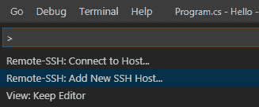
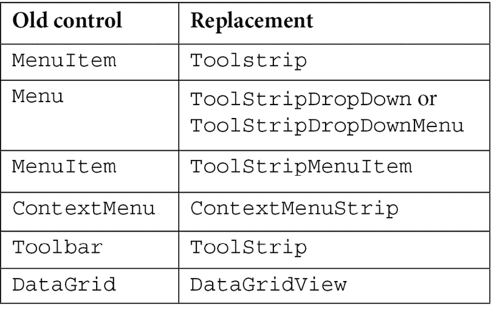

# 第十六章：使用.NET Core 3 中的 C#

C#编程语言是我们用来将想法转化为可运行代码的媒介。在编译时，整套规则、语法、约束和语义都被转换为中间语言——一种用于指导公共语言运行时（CLR）的高级汇编语言，后者提供运行代码所需的必要服务。

为了执行一些代码，像 C、C++和 Rust 这样的本地语言需要一个轻量级的运行时库来与操作系统（OS）交互，并执行*程序加载*、*构造函数*和*析构函数*等抽象。另一方面，像 C#和 Java 这样的高级语言需要一个更复杂的运行时引擎来提供其他基本服务，如*垃圾回收*、*即时编译*和*异常管理*。

当.NET Framework 首次创建时，CLR 被设计为仅在 Windows 上运行，但后来，许多其他运行时（实现相同的 ECMA 规范）出现，对市场起着重要作用。例如，Mono 运行时是第一个在 Linux 平台上运行的社区驱动项目，而微软的 Silverlight 项目在所有主要平台的浏览器中都取得了短暂的成功。其他运行时，如用于微控制器的.NET Micro Framework，用于针对嵌入式 Windows CE 操作系统的.NET Compact Framework，以及在 Windows Phone 和通用 Windows 平台上运行的更近期的运行时的例子，都展示了.NET 实现的多样性，这些实现能够运行我们今天仍在使用的相同一组指令。

这些运行时都是根据当时的历史背景所规定的一系列要求构建的，没有例外。在大约 20 年前诞生时，.NET Framework 旨在满足不断增长的基于 Windows 的个人电脑生态系统，其 CPU 功率、内存和存储空间随着时间的推移而增长。多年来，大多数这些运行时成功地转向了更受限制的硬件规格，仍然提供大致相同的功能集。例如，即使现代手机具有非常强大的微处理器，代码效率对于保护这些设备的电池寿命仍然至关重要，这是.NET Framework 最初设计时不相关的要求。

尽管这些运行时使用的.NET 规范仍然相同，但存在差异，使得每个开发人员在尝试设计能够在多个运行时上运行的应用程序时变得困难，特别是当要求它能够跨平台和/或跨设备运行时。

.NET Core 3 运行时诞生于解决这些问题，通过提供满足所有现代要求的新运行时。在本章中，我们将研究开发 C#应用程序时与运行时相关的因素：

+   使用.NET 命令行界面（CLI）

+   在 Linux 发行版上开发

+   .NET 标准是什么以及它如何帮助应用程序设计

+   消费 NuGet 包

+   迁移使用.NET Framework 设计的应用程序

+   发布应用程序

到本章结束时，您将更熟悉允许您编译和发布应用程序的.NET Core 工具，以便您可以设计一个库，与在.NET Core 或其他运行时版本上运行的其他应用程序共享代码。此外，如果您已经有一个基于.NET Framework 的应用程序，您将学习迁移它以充分利用.NET Core 运行时的主要步骤。

# 使用.NET 命令行界面（CLI）

**命令行界面**（**CLI**）是.NET 生态系统中的一个新但战略性的工具，它可以在所有平台上以相同的方式使用，实现现代的开发方法。乍一看，基于旧控制台的工具定义为“现代”可能看起来很奇怪，但在现代开发世界中，脚本化构建过程以支持**持续集成**和**持续交付**/**部署**（**CI**/**CD**）策略对于提供更快和更高质量的开发生命周期至关重要。

安装.NET Core SDK（参见[`dotnet.microsoft.com/`](https://dotnet.microsoft.com/)）后，可以通过 Linux 终端或 Windows 命令提示符使用.NET CLI。在 Windows 上的一个很好的替代品是新的**Windows 终端**应用程序，可以通过 Windows 商店下载，并提供了传统命令提示符以及**PowerShell**终端的很好替代。

.NET CLI 具有丰富的命令列表，可以完成整个开发生命周期的一整套操作。通过将`––help`字符串添加为最后一个参数，可以获得每个命令的详细和上下文帮助。最相关的命令如下：

+   `dotnet new`：`new`命令基于预定义的模板创建一个新的应用程序项目或解决方案的文件夹，这些模板可以很容易地安装在默认模板之外。仅输入此命令将列出所有可用的模板。

+   `dotnet restore`：`restore`命令从 NuGet 服务器还原引用的库（在默认的`nuget.org`互联网软件包存储库之外，用户可以创建一个`nuget.config`文件来指定其他位置，如 GitHub，甚至是本地文件夹）。

+   `dotnet run`：`run`命令在一个步骤中构建，还原和运行项目。

+   `dotnet test`：`test`命令运行指定项目的测试。

+   `dotnet publish`：`publish`命令创建可部署的二进制文件，我们将在*发布应用程序*部分讨论。

除了这些命令之外，.NET CLI 还可以用于调用其他工具。其中一些是预安装的。例如，`dotnet dev-certs`是一个用于管理本地机器上的 HTTPS 证书的工具。提供的预安装工具的另一个例子是`dotnet watch`，它观察项目中对源文件所做的更改，并在发生任何更改时自动重新运行应用程序。

`dotnet tool`命令是扩展 CLI 功能的入口，因为它允许我们通过配置的 NuGet 服务器下载和安装附加工具。在撰写本文时，尚无法在[`nuget.org`](https://nuget.org)上过滤包含.NET 工具的软件包；因此，您最好的选择是阅读文章或其他用户的建议。

在创建新项目（使用 CLI）时，您可能希望首先决定运行时版本。`dotnet ––info`命令返回所有已安装的运行时和 SDK 的列表。默认情况下，CLI 使用最近安装的`global.json`。此文件中的设置将影响包含该文件的文件夹下的所有操作所使用的.NET CLI（也被 Visual Studio 使用）：

```cs
C:\Projects>dotnet new globaljson
The template "global.json file" was created successfully.
```

现在，您可以使用您喜欢的编辑器编辑文件，并将 SDK 版本更改为先前列出的值之一：

```cs
{
    "sdk": {
        "version": "3.0.100"
    }
}
```

小心选择`info`参数。

这个过程对于将应用程序绑定到特定的 SDK 而不是自动继承最新安装的 SDK 是有用的。话虽如此，现在是时候创建一个新的空解决方案了，这是一个一个或多个项目的无代码容器。创建解决方案是可选的，但在需要创建多个交叉引用的项目时非常有用：

```cs
C:\Projects>dotnet new sln -o HelloSolution
The template "Solution File" was created successfully.
```

现在是在解决方案文件夹下创建一个新的控制台项目的时候了。由于文件夹中只有一个解决方案，因此可以在`sln add`命令中省略解决方案名称：

```cs
cd HelloSolution
dotnet new console -o Hello
dotnet sln add Hello
```

最后，我们可以构建和运行项目：

```cs
cd Hello
C:\Projects\HelloSolution\Hello>dotnet run
Hello World!
```

或者，我们可以使用`watch`命令在任何文件更改时重新运行项目：

```cs
C:\Projects\HelloSolution\Hello>dotnet watch run
watch : Started
Hello World!
watch : Exited
watch : Waiting for a file to change before restarting dotnet...
watch : Started
Hello Raf!
watch : Exited
watch : Waiting for a file to change before restarting dotnet...
```

当控制台上打印出第一个`等待文件更改后重新启动 dotnet...`消息时，我使用 Visual Studio Code 编辑器修改并保存了`Program.cs`文件。该文件的更改自动触发了构建过程，并且二进制文件像往常一样在`bin`文件夹中创建，其树结构已经从.NET Framework 中略有改变。

仍然有`Debug`或`Release`文件夹，其中包含一个名为框架的新子文件夹；在这种情况下，是`netcoreapp3.0`。新的项目系统支持多目标，并且可以根据项目文件中指定的框架、运行时和位数生成不同的二进制文件。该文件夹的内容如下：

+   `Hello.dll`。这是包含编译器生成的`IL`代码的程序集。

+   `Hello.exe`：`.exe`文件是一个托管应用程序，用于引导您的应用程序。稍后，我们将讨论使用更多选项发布/部署应用程序。

+   `Hello.pdb`：`.pdb`文件包含允许调试器将`IL`代码与源文件进行交叉引用的符号，以及符号（即变量、方法或类）名称与实际代码进行交叉引用。

+   `Hello.deps.json`：此文件以 JSON 格式包含完整的依赖树。它用于在编译期间检索所需的库，并且是发现不需要的依赖项或在混合不同版本的相同程序集时出现问题的非常有效的方法。

+   `Hello.runtimeconfig.json`和`Hello.runtimeconfig.dev.json`：这些文件由运行时使用，以了解应该使用哪个共享运行时来运行应用程序。`.dev`文件包含在环境指定应用程序应在开发环境中运行时使用的配置。

我们刚刚创建了一个非常基本的应用程序，但这些步骤就是创建一个由几个库组成并使用其他更复杂模板的复杂应用程序所需的全部步骤。有趣的是，可以在*Linux 终端*上执行相同的步骤以获得相同的结果。

# 在 Linux 发行版上开发

开发人员所感受到的需求革命并没有随着移动市场而停止，今天仍在持续进行。例如，跨多个操作系统运行的需求比以往任何时候都更为重要，因为云时代开始了。许多应用程序开始从本地部署转移到云架构，从虚拟机转移到容器，从面向服务的架构转移到微服务。这种转变如此之大，以至于即使微软的 CEO 也自豪地庆祝了 Azure 上 Linux 操作系统的普及，这清楚地表明了创建跨平台应用程序的重要性。

毫无疑问，.NET Core 在不同的操作系统、设备和 CPU 架构上运行的能力至关重要，但它带来了令人惊叹的抽象水平，最大程度地减少了开发人员的工作量，隐藏了大部分差异。例如，Linux 景观提供了多种发行版，但你不需要担心，因为抽象不会影响应用程序的性能。

IT 行业学到的教训是，当前推动云增长的技术并不是最终目的地，而只是一个过渡。在撰写本文时，一种名为**Web Assembly System Interface (WASI)**的技术正在标准化，作为一个强大的抽象，用于隔离小的代码单元，提供安全隔离，可以用于运行不仅是 Web 应用程序（已经通过**WebAssembly**在每个浏览器中可用），而且还可以运行云或经典的独立应用程序。

我们仍然不知道 WASI 是否会成功，但毫无疑问，现代运行时必须准备好迎接这一浪潮，这意味着要拥抱快速发展和变异的灵活性，一旦新的需求敲门。

## 准备开发环境

在创建 Linux 上的开发环境时，有多种选择。第一种是在物理机器上安装 Linux，这在整个开发生命周期中都具有性能优势。主要操作系统的选择非常主观，虽然 Windows 和 macOS 目前提供更好的桌面体验，但选择主要取决于您需要的应用程序生态系统。

另一个经过充分测试的方案是在虚拟机内进行开发。在这种情况下，您可以在 Mac 上使用*Windows Hyper-V*或*Parallels Desktop*。如果您没有选择的发行版，我强烈建议您开始安装 Ubuntu 桌面版。

在 Windows 上，您会发现使用名为**Windows 子系统 Linux（WSL）**的集成 Linux 支持非常有用，它可以作为 Windows 10 的附加组件进行安装。在撰写本文时，当前成熟的版本是**WSL 1**，它在 Windows 内核上运行 Linux 发行版。在这个解决方案中，Linux 系统调用会自动重新映射到 Windows 内核模式的实现。

在这种配置中安装的发行版是一个真正的 Linux 发行版，其中一些系统调用无法被翻译，而其他一些，如文件系统操作，由于它们的翻译不是微不足道的，因此速度较慢。使用**WSL 1**，大多数.NET Core 代码将无缝运行；因此，它是快速在 Windows 桌面和真正的 Linux 环境之间切换的好选择。

WSL 的未来已经在最新的 Windows 预览版中可用，并将很快完全发布。在这种配置中，完整的 Linux 内核安装在 Windows 上，并与 Windows 内核共存，消除了以前的任何限制，并提供接近本机速度。一旦它完全可用，我强烈推荐这个开发环境。

准备好 Linux 机器后，您有三个选择：

+   安装.NET Core **SDK**，因为您希望从 Linux 内部管理开发人员生命周期。

+   安装.NET Core 运行时，因为您只想在 Linux 上运行应用程序和/或其测试，以验证跨平台开发是否按预期工作。

+   不要安装这两者中的任何一个，因为您希望将应用程序作为独立部署进行测试。我们将在*发布应用程序*部分稍后调查这个选项。

SDK 或运行时所需的先决条件和软件包不断变化；因此，最好参考官方下载页面[`dot.net`](https://dot.net)。安装后，从终端运行`dotnet ––info`，将显示以下信息：

```cs
The runtime and sdk versions listed by this command may be different from the ones on Windows. You should consider the opportunity to create a global.json outside the sources repository in order to avoid mismatches when cloning a repository on different operating systems.
```

如果您决定使用虚拟机或 WSL，现在应该安装**SSH 守护程序**，以便您可以从主机机器与 Linux 通信。您应该参考特定于 Linux 发行版的说明，但通常来说，**openssh**软件包是最受欢迎的选择：

```cs
sudo apt-get install openssh-server
(eventually configure the configuration file /etc/ssh/sshd_config)
systemctl start ssh
```

现在，Linux 机器可以通过主机名（如果它已自动注册到您的 DNS）或 IP 地址进行联系。您可以通过输入以下内容获取这两个信息：

+   `ip address`

+   `hostname`

在 Windows 中有各种免费的`ssh`命令行工具：

```cs
ssh username@machinenameORipaddress
```

如果由于配置问题而无法工作，则典型的故障排除路径是恢复配置文件的默认权限：

```cs
Install-Module -Force OpenSSHUtils -Scope AllUsers
Repair-UserSshConfigPermission ~/.ssh/config
Get-ChildItem ~\.ssh\* -Include "id_rsa","id_dsa" -ErrorAction SilentlyContinue | % {
    Repair-UserKeyPermission -FilePath $_.FullName @psBoundParameters
}
```

当然，Linux 有许多可选工具，但在这里值得一提的是其中一些：

+   **Net-tools**：这是一个包含许多与网络相关的工具的软件包，用于诊断网络协议，如*arp*、*hostname*、*netstat*和*route*。一些发行版已经包含它们；否则，您可以使用您喜欢的软件包管理器进行安装，例如 Ubuntu 上的**apt-get**。

+   **LLDB**：这是一个 Linux 本地调试器。微软提供了 LLDB 的 SOS 扩展，其中包含与更受欢迎的 WinDbg 的 SOS 相同的一组命令。此扩展提供了许多.NET 特定的命令，用于诊断泄漏，遍历对象图，调查异常，并且它们也可以用于崩溃转储。

+   **Build-essential**：这是一个包含许多开发工具的软件包，包括 C/C++编译器和相关库，用于开发本地代码。如果您希望创建本地代码，并希望使用**PInvoke**从.NET 调用它们，这将非常有用。

+   底层的`ssh`工具是*Remote - SSH*和*Remote - WSL*。SSH 扩展允许我们通过 SSH 在远程 Linux 机器上开发，而 WSL 允许我们在本地 WSL 子系统上开发。

您可以按照最新的扩展说明来配置远程机器（详尽的文档可以在本章末尾的*进一步阅读*部分的安装链接中找到）。安装完成后，通过按下*F1*，您可以访问 Visual Studio Code 命令。然后，输入`Remote-SSH`，点击**添加新的 SSH 主机**，最后重复并选择**连接到主机**：



图 16.1 - 通过 SSH 从 Visual Studio Code 连接到远程主机

这第一次连接将在 Linux 上远程安装所需的工具，以启用**远程开发**场景，其中所有编译和运行任务都是在远程完成，而不是在您输入代码的机器上完成。

即使您可以部署二进制文件并远程运行它们，但这种配置对于测试在 Linux 上运行时显示异常的代码非常有用。在 Visual Studio Code 中，您可以使用**查看** | **终端**菜单打开终端窗口。集成的终端窗口可用于创建解决方案和项目，并观察源代码以在以前相同的方式自动重新运行应用程序。

## 编写跨平台感知的代码

.NET Core 提供的抽象让您忘记了许多存在并在不同操作系统上工作方式不同的特殊性，但在开发代码时仍然有一些必须仔细考虑的事情。这些看似微不足道的细节大多应成为开发人员的最佳实践，以避免在不同系统上运行应用程序时出现问题。

### 文件系统大小写

最常见的错误是不考虑文件系统的大小写。在 Linux 上，文件和文件夹的名称是*区分大小写*的；因此，发现由于路径包含文件或文件夹名称的错误大小写而导致问题并不罕见。

### 主目录

在 Windows 和 Linux 中，用户配置文件的结构是不同的，而且更重要的是，在使用`sudo`（管理员）权限运行应用程序时，主目录与当前登录用户不同。

### 路径分隔符

我们都知道 Linux 和 Windows 使用正斜杠和反斜杠字符来分隔文件和文件夹。这就是为什么`System.IO.Path`类通过一些属性公开可用的分隔符。更好的是，根本不要使用分隔符。例如，要组成一个文件夹，应优先选择以下语句：

```cs
Path.Combine("..", "..", "..", "..", "Test",
    "bin", "Debug", "netcoreapp3.0", "test.exe");
```

最后，要将相对路径转换为完整路径，请使用`Path.GetFullPath`方法。

### 行尾分隔符

处理文本文件时，Windows 的行尾分隔符是`\r\n`（`0x0D`，`0x0A`），而在 Linux 上，我们只使用`\r`（`0x0D`）。至于`Path`类，分隔符可以在运行时通过`Environment.NewLine`检索，但大多数情况下，您可以通过让`System.IO.TextReader.ReadLine`和`System.IO.TextWriter.WriteLine`抽象来处理这个区别。

### 数字证书

虽然 Windows 有一个标准的数字证书中央存储库，但 Linux 没有，开发人员需要决定是依赖于证书文件还是特定于发行版的解决方案。当您需要存储证书时，包括私钥，必须加以保护，因为私钥是绝对不能泄露的秘密。提供适当的限制以保护这些证书是开发人员的责任。

### 特定于平台的 API

每个特定于平台的 API，例如`NotImplementedException`。在 Windows 上，注册表历来用于存储与应用程序相关的每个用户甚至全局设置。Linux 没有等价物；因此，在现代开发中，最好完全摆脱注册表。另一个流行的 API 是**Windows 管理仪器（WMI）**，它仅在 Windows 上可用，在 Linux 上没有等价物。

### 安全

与 Windows 帐户相关的所有内容仅在 Windows 上可用。在 Linux 上修改文件系统安全标志的最简单方法是生成一个新进程，运行带有适当参数的标准`chmod`命令行工具。

### 环境变量

所有平台中非常强大且常见的共同点是环境变量的可用性。Windows 开发人员通常不经常使用它们，而它们在 Linux 上非常受欢迎。例如，ASP.NET Core 使用它们在开发、暂存和生产之间切换配置，但也可以用于检索标准变量，例如 Linux 上的`HOME`和 Windows 上的`HOMEPATH`，它们都代表当前用户配置文件的根文件夹。

### 您可能只在运行时发现的差距

有时您可能需要在运行时检测代码正在运行的操作系统或 CPU 架构。为此，`System.Runtime.InteropServices.RuntimeInformation`类提供了许多有趣的信息：

+   `OSDescription` 属性返回描述应用程序正在运行的操作系统的字符串。

+   `OSArchitecture` 属性返回带有 OS 架构的字符串。例如，*X64*值代表 Intel 64 位架构。

+   `FrameworkDescription` 属性返回描述当前框架的字符串，例如*.NET Core 3.0.1*。而短字符串*3.0.1*则可通过`Environment.Version`属性获得。

+   `ProcessArchitecture` 属性返回处理器架构。这种区别存在是因为 Windows 可以在其 64 位版本上创建 32 位进程。

+   `GetRuntimeDirectory` 方法返回指向应用程序使用的运行时的完整路径。

+   最后，`RuntimeInformation.IsOSPlatform` 方法返回一个布尔值，可以用于执行特定于平台的代码：

```cs
if (RuntimeInformation.IsOSPlatform(OSPlatform.Linux))
    Console.WriteLine("Linux!");
else if (RuntimeInformation.IsOSPlatform(OSPlatform.Windows))
    Console.WriteLine("Windows!");
else if (RuntimeInformation.IsOSPlatform(OSPlatform.OSX))
    Console.WriteLine("MacOS!");
else if (RuntimeInformation.IsOSPlatform(OSPlatform.FreeBSD))
    Console.WriteLine("FreeBSD!");
else
    Console.WriteLine("Unknown :(");
```

您应该始终评估是否使用此技术来采用特定于平台的决策，或者创建一个包含每个平台的一个 DLL 的 NuGet 包。后一种解决方案更易于维护，但本书未对此进行讨论。

# 什么是.NET Standard，它如何帮助应用程序设计

虽然.NET Core 是在几乎所有地方运行代码的最佳选择，但也是事实，我们目前可能需要在不同的运行时上运行我们的代码，例如.NET Framework 用于现有的 Windows 应用程序，Xamarin 用于开发移动应用程序，以及 Blazor 用于在 WebAssembly 沙箱中运行代码或在其他较旧的运行时上运行。

在多个运行时之间共享编译库的第一次尝试是使用**可移植类库**，开发人员只能使用所有选定运行时中可用的 API。由于将可用 API 的数量限制为仅限于公共 API 太过限制，因此得到的交集是不切实际的。.NET Standard 倡议诞生于解决此问题，通过为许多知名 API 创建版本化的 API 定义集来解决此问题。为了符合.NET Standard，任何运行时都必须保证实现该完整的 API 集。将.NET Standard 视为一种包含所有包含的 API 的巨大接口。此外，每个新版本的.NET Standard 都会向以前的版本添加新的 API。

提示

即使 API 是.NET Standard 合同的一部分，它也可以通过抛出`NotImplementedException`在某些平台上实现。允许这种解决方案是为了简化将旧应用程序迁移到.NET Standard，并且在使用.NET Standard 库时必须考虑这一点。

.NET Standard 版本 1.0 定义了一个非常小的 API 集，以满足几乎所有过去的可用运行时，例如**Silverlight**和**Windows Phone 8**。版本之后，定义的 API 数量变得更多，排除了旧的运行时，但也为开发人员提供了更多的 API。例如，版本 1.5 在 API 数量方面提供了一个很好的折衷，因为它支持非常流行的.NET Framework 4.6.2。在 GitHub 上的.NET Standard 存储库（[`github.com/dotnet/standard/tree/master/docs/versions`](https://github.com/dotnet/standard/tree/master/docs/versions)），您可以找到版本和支持的 API 集的完整列表。

在撰写本文时，您应该只关心.NET Standard 版本作为库作者。如果您查看 NuGet 上非常流行的`Newtonsoft.Json`包，您会发现它符合.NET Standard 1.0。这是非常合理的，因为它允许该库被几乎整个.NET 生态系统使用。简单的规则是库开发人员应该支持最低可能的版本。

从应用程序开发人员的角度来看，问题是不同的，因为您可能希望使用尽可能高的数字，以便拥有最多的 API。如果您的目标是仅为.NET Framework 和.NET Core 开发应用程序（在迁移到新运行时时非常常见），您的选择将是版本 2.0，因为这是.NET Framework 支持的最后一个.NET Standard 合同版本。

在撰写本文时，最新版本的.NET Standard 是 2.1，其中包括诸如`Span<T>`之类的 API，以及许多新的方法重载，这些方法采用`Span<T>`而不是数组，从而提供更好的性能结果。

## 创建.NET Standard 库

创建.NET Standard 库非常简单。在 Visual Studio 中，有一个特定的模板，而从命令行中，以下命令将创建一个默认版本为 2.0 的.NET Standard 库。您可以通过在以下命令的末尾添加`--help`来列出其他选择，或者您可以保持`netstandard2.0`并创建库项目：

```cs
C:\Projects\HelloSolution>dotnet new classlib -o MyLibrary
```

创建后，可以使用此命令将库添加到以前的解决方案中：

```cs
dotnet sln add MyLibrary
```

最后，您可以使用另一个命令将`MyLibrary`引用添加到`Hello`项目中：

```cs
C:\Projects\HelloSolution>dotnet add Hello reference MyLibrary
Reference `..\MyLibrary\MyLibrary.csproj` added to the project.
```

生成的程序集是一个类库，可以从所有针对运行时并支持该.NET Standard 版本的项目中引用。

### 在.NET Standard 和.NET Core 库之间做出决定

每当您需要在多个运行时之间共享一些代码时，最好的选择是尽可能将其放入.NET Standard 库中。

我们已经说过，库的作者应该针对最低可能的版本号，但当然，如果你是唯一的库使用者，你可能决定采用.NET Standard 2.0 来共享代码，例如，在.NET Framework、.NET Core Mono 5.4 和 Unity 2018.1 之间。

每当你的库将被专门用于.NET Core 应用程序时，你可能希望创建一个.NET Core 类库，因为它不限制你在应用程序中可以使用的 API 集：

```cs
C:\Projects\HelloSolution>dotnet new classlib -f netcoreapp3.0 -o NetCoreLibrary
C:\Projects\HelloSolution>dotnet add Hello reference NetCoreLibrary
```

在前面的例子中，已经创建了一个新的.NET Core 类库（`NetCoreLibrary`）并将其添加到`Hello`项目的引用中。

# 使用 NuGet 包

包在现代应用程序开发中扮演着非常重要的角色，因为它们定义了一个独立的代码单元，可以用作构建更大应用程序的基石。

过去，这个定义也适用于由单个`.dll`文件组成的库，但现代开发通常需要更多的文件来构建一个适当独立的代码单元。最简单的例子是当一个包包含了库以及它的依赖项，但另一个更复杂的例子是编写一个需要对本地 API 进行平台调用的库。

`RuntimeInformation`类，但通常为了性能和维护的考虑，最好将代码分割成每个操作系统和 CPU 架构的一个库。打包平台相关库的优势在于它让.NET Core 构建工具在发布时将相关库复制到输出文件夹中。除了与本地代码的互操作性之外，还有其他情况，比如根据运行时（例如.NET Core、.NET Framework、Mono 等）提供不同的实现。

## 向项目添加包

有多种方法可以向项目添加包引用；这主要取决于你选择的 IDE。Visual Studio 通过打开**解决方案资源管理器**（这是显示解决方案和项目层次结构的窗口），展开项目树，右键单击**依赖项**节点，并选择**管理 NuGet 包**菜单项来提供完整的可视化支持。以下是一个典型的 NuGet 窗口，列出了可以从**nuget.org**添加到你的项目中的包：


图 16.2–NuGet 包管理器窗口

NuGet 窗口允许你添加、删除或更新项目包的不同版本：

+   在右侧，**包源**组合框显示了提供包的网站或本地文件夹的列表。点击附近的齿轮图标可以配置列表。

+   在左侧，`author:microsoft`。

+   **已安装**选项卡只显示已安装在项目中的包。

+   **更新**选项卡显示了已安装包的新版本，这些新版本来自所选源。

+   一旦你在选项卡的右侧选择了一个包，你就可以选择所需的版本，然后它将根据你从哪个选项卡开始进行安装、卸载或更新。

当一个解决方案由多个项目组成时，保持版本包的一致性非常重要。因此，Visual Studio 提供了**管理解决方案的 NuGet 包**的功能，这是一个右键单击**解决方案**节点可用的菜单项。这个窗口类似，但有一个额外的选项卡叫做**整合**，显示了在多个项目中安装了不同版本的包。理想情况下，这个选项卡不应该显示任何包：


图 16.3–解决方案的 NuGet 包管理器，整合选项卡

搜索包的另一种方法是直接到源头。在下面的截图中，你可以看到[`nuget.org`](http://nuget.org/)网站，这是.NET 包的主要存储库：


图 16.4-在 NuGet 库网站上搜索

这个网页显示了您选择的每个包的重要细节：

+   右侧的**源代码库**链接在可用时跳转到源代码库。

+   **依赖项**部分可以展开，显示它依赖的其他包。

+   **GitHub 使用**部分充当了包的声誉，显示了有多少开源项目依赖于它。一个包被社区使用的次数越多，它被支持和可靠的机会就越大。

在页面的上部，包部分显示了将包添加到项目的不同方法：

+   **包管理器**显示您可以从 Visual Studio 中同名窗口执行的手动命令。

+   **.NET CLI**显示.NET CLI 命令。

+   `.csproj`直接。

+   **Paket CLI**是.NET CLI 的另一种 CLI 工具。

通过 CLI 添加包是很简单的，因为`nuget.org`已经为我们提供了要在控制台终端中输入的确切命令字符串。记得先进入项目文件夹，然后输入命令。例如，以下是从命令行添加对`Newtonsoft.Json`包的引用的命令：

```cs
dotnet add package Newtonsoft.Json --version 12.0.3
```

无论操作系统如何，如果您使用 Visual Studio Code，它都提供了一个方便的终端窗口，您可以在其中输入任何.NET CLI 命令。

另一个经常使用的添加包引用的方法是直接编辑`.csproj`文件。使用.NET Core，项目文件结构得到了大幅简化，摆脱了过去的所有标签，并且还提供了在 Visual Studio 中编辑和更新文件的能力，而无需关闭或卸载项目。

以下是一个`.csproj`文件的相关部分，您可以手动添加`PackageReference`标签：

```cs
<Project Sdk="Microsoft.NET.Sdk">
 …
  <ItemGroup>
     …
  </ItemGroup>
  <ItemGroup>
    <PackageReference Include="Newtonsoft.Json" Version="12.0.3" />
  </ItemGroup>
</Project>
```

正如您所看到的，`ItemGroup`元素可以多次重复，并且每个元素可能包含多个`PackageReference`标签。

# 从.NET Framework 迁移到.NET Core

我认为.NET Core 运行时最重要的新功能是它能够与任何其他.NET Core 版本并行部署，确保任何未来的发布都不会影响旧的运行时或库，因此也不会影响应用程序。阻止微软现代化和改进.NET Framework 性能的主要原因是.NET 运行时和基类库的共享性质。因此，对这些库的最小更改可能会导致已部署的数亿个安装出现不可接受的破坏性变化。

.NET Core 新的并行部署策略的明显后果是**全局程序集缓存（GAC）**的完全消失，它提供了一个中央存储库，可以将系统或用户库部署到其中。运行时现在完全与系统的其余部分隔离，这个决定使得能够将应用程序部署到所谓的**自包含部署**中，其中所有所需的代码，包括运行时和系统库，以及应用程序代码，都被复制到一个文件夹中。我们将在*发布应用程序*部分深入探讨部署选项。

在所有可用的运行时中，.NET Framework 一直是基准，在撰写本文时，它仍然是一个有效的生态系统，将在未来很长一段时间内得到微软的支持，因为它与 Windows 客户端和服务器操作系统一起重新分发。尽管如此，作为明智的开发人员，我们不能忽视.NET Core 3 的发布，微软发表了两个重要声明：

+   .NET Framework 4.8 将是这个运行时和库的*最后一个版本*。

+   .NET 5 将是 2020 年底发布的.NET Core 的新*简称*。

毫无疑问，.NET Core 3 标志着.NET 运行时历史上的一个转折点，因为它提供了以前由.NET Framework 支持的所有工作负载。从.NET Core 3 开始，您现在可以创建服务器和 Windows 桌面应用程序，利用机器学习的力量，或开发云应用程序。这也是对所有相关开发人员的强烈建议，他们被邀请使用.NET Core 创建全新的应用程序，因为它提供了最先进的运行时、库、编译器和工具技术。

## 分析您的架构

在开始任何迁移步骤之前，重要的是要验证技术、框架和第三方库是否在.NET Core 上可用。

旧的.NET Framework 基类库已完全移植，微软和其他第三方撰写的大多数最受欢迎的 NuGet 包也已移植，这使我们所有人都有很高的机会找到与.NET Core 兼容的更新版本。如果这些依赖项可用作.NET Standard 2.0 或更低版本（请记住，.NET Standard 2.1 不受.NET Framework 支持），那么它们就可以使用。但正如我们之前所见，NuGet 包可能包含针对不同运行时的多个库，因此验证库在供应商页面上的兼容性非常重要。

如果您的项目严重依赖于 Windows，因为它们需要 Windows API，您可能需要查看**Windows 兼容性包 NuGet**包，其中包含约 20,000 个 API。

信息框

即使一个库只兼容.NET Framework，在大多数情况下，由于*shim 机制*的存在，它也可以被.NET Core 引用。在这种情况下，Visual Studio 会在构建日志中显示一个黄色三角形，表示警告。潜在的不兼容性应该经过仔细测试，以验证应用程序的正确性。

尽管.NET Core 支持绝大多数过去的工作负载，但其中一些不可用，其他一些已经被重写，使得迁移过程有点困难，但同时也带来了其他优势。

### 迁移 ASP.NET Web Forms 应用程序

这项技术非常古老，被认为已经过时，因为今天的网络与过去的网络技术相比已经演变出非常不同的范式。迁移此代码的最佳途径是使用**Blazor 模板**，这使我们能够在浏览器中运行 C#代码，这要归功于*WebAssembly*支持，现在在任何现代浏览器中都可用。虽然这个解决方案并不是真正的移植，而是重写，但它允许我们在服务器和大部分客户端代码上都使用 C#。

### Windows 通信基础（WCF）

在.NET Core 上，**Windows 通信基础**（**WCF**）仅适用于客户端，这意味着只能消费 WCF 服务。如今，有更高性能和更简单的技术可用，例如**gRPC**（需要 HTTP2）和**REST**（Web API）。对于仍然需要创建基于 SOAP 的 Web 服务的人来说，一个名为**CoreWCF**的社区驱动的开源项目在 GitHub 上可用。在开始使用此库迁移旧代码之前，您应该验证项目中使用的所有 WCF 选项在 CoreWCF 上是否也可用。

在撰写本文时，无论是.NET Core 还是 CoreWCF 都不支持**WS-***标准。

### Windows 工作流基础

工作流基础并未移植，但另一个名为**CoreWF**的开源项目在 GitHub 上可用。正如我们先前提到的 WCF 一样，您应该首先验证项目中使用的功能的完全可用性。

### Entity Framework

**Entity Framework 6（EF6）**也可以在.NET Core 上使用，你在迁移这个项目时不应该遇到任何问题，但值得一提的是，这项技术被微软认为是*功能完备*的，现在只开发**Entity Framework Core（EF Core）**。根据你的存储库访问结构，包括模型图和项目中使用的提供程序，你可能希望考虑将你的访问代码迁移到 EF Core。在这种情况下，要注意的是，在.NET Core 3 中，支持多对多关系，但需要在模型中描述中间实体类。EF Core 中的 API 与之前非常不同，但另一方面，它们提供了许多新的功能。.NET 5（这是.NET Core 的新名称）的路线图包括许多你可能想要考虑的新功能。

基于上述所有原因，你可能会发现首先使用 EF6 进行迁移，然后再迁移到 EF Core 会更容易。这个决定非常依赖于项目本身。

### ASP.NET MVC

ASP.NET MVC 框架已经完全重写为 ASP.NET Core，但它仍然提供相同的关键功能。除非你深度定制和扩展基础设施，否则迁移肯定是直接的，但仍然需要对代码进行一些小的重写，因为命名空间和类型发生了变化。

### 代码访问安全 API

所有的**代码访问安全（CAS）**API 都已经从.NET Core 中移除，因为唯一可信的边界是由托管代码的进程本身提供的。如果你仍在使用 CAS，强烈建议摆脱它，无论你的.NET Core 迁移如何。

### AppDomains 和远程 API

在.NET Core 中，每个进程始终只有一个 AppDomain。因此，你会发现大多数 AppDomain API 都已经消失并且不可用。如果你曾经使用 AppDomains 来隔离和卸载某些程序集，你应该看看`AssemblyLoadContext`，这是.NET Core 3 中的一个新 API，它可以以强大的方式解决这个问题，而不需要远程通信，因为远程通信也已经从.NET Core 中移除了。

## 准备迁移过程

从.NET Framework 迁移到.NET Core 的迁移过程中，一个常见的步骤是将.NET Framework 更新至至少 4.7.2 版本。

4.7.2 版本是一个特殊的版本，因为它是第一个完全支持.NET 标准二进制契约的版本，避免了需要填补空白的外部 NuGet 包的要求。这一步不应该引起任何问题，你可以继续使用这个最新版本的.NET Framework 部署当前的项目，而不必担心。根据解决方案的复杂性，你可能希望在仍然在.NET Framework 上运行生产代码的同时进行迁移，直到一切都经过充分测试。

在这一点上，分析应该集中在外部依赖上，比如来自第三方的 NuGet 包，这些包是你无法控制的。一旦你确定了更新的包，更新它们，这样你的.NET Framework 解决方案就可以在更新的版本上运行。即使你没有改变任何代码，你仍然有一个可部署的解决方案，它以与.NET Core 兼容的一些部分开始。

### 可移植性分析器工具

**API Port 工具**在 GitHub 上可用，网址是[`github.com/microsoft/dotnet-apiport`](https://github.com/microsoft/dotnet-apiport)，它为我们提供了创建一个详细报告的能力，列出了.NET 应用程序中使用的所有 API 以及它们在其他平台上是否可用。该工具既可以作为 Visual Studio 扩展，也可以通过 CLI 使用，这样你就可以根据需要自动化这个过程。该工具提供的最终报告是一个 Excel 电子表格，其中包含所有 API 的交叉引用，让你可以在迁移过程中进行规划，而不会在过程中遇到任何不良的意外。

## 迁移库

我们终于可以开始更新解决方案中的库项目了。重要的是要清楚地了解整个解决方案和包的依赖树。如果项目非常庞大，您可能希望利用外部工具的强大功能，比如流行的**NDepend**。在依赖树上，您应该识别出树底部没有其他外部包依赖的库，它们是最好的起点。

在大多数情况下，迁移没有依赖关系的库（或者库依赖于可以在两个框架上运行的包）是直接的。没有自动化支持，因此您应该创建一个**.NET Standard 2.0**项目。

提示

在撰写本文时，[`github.com/dotnet/try-convert/releases`](https://github.com/dotnet/try-convert/releases)存储库包含了一个工具的预览，该工具能够将项目转换为.NET Core。正如`try-convert`这个名字所暗示的，它无法处理所有类型的项目，但仍然可以作为迁移的起点。

迁移到新的`.csproj`项目结构可以通过以下两种方式之一完成：

+   创建新项目并将源文件移动到其中

+   修改旧项目的`.csproj`文件

第一种策略更简单，但缺点是会改变项目名称，这也意味着要更改默认的命名空间和程序集名称。这些可以通过对`.csproj`文件进行以下更改来重命名：

```cs
<PropertyGroup>
    ...
  <AssemblyName>MyLibrary2</AssemblyName>
 <RootNamespace>MyLibrary2</RootNamespace>
</PropertyGroup>
```

请记住，创建新项目也意味着修复所有依赖项目的引用。

第二种策略包括替换`.csproj`文件的内容，这要求您在单独的项目上测试了这些更改之前。在迁移包引用时，请注意新的.NET Core 项目会忽略`packages.config`文件，并要求所有引用都在`PackageReference`标签中指定，就像在*使用 NuGet 包*部分中提到的那样。

### 查找缺失的 API

在迁移过程中，您可能会发现一些缺失的 API。对于这种特定情况，微软创建了[`apisof.net/`](https://apisof.net/)网站，该网站对基类库和 NuGet 可用的 70 万多个 API 进行了分类。由于其搜索功能，您可以搜索任何类、方法、属性或事件，并发现其用法以及支持它的平台和版本。

## 迁移测试

一旦您迁移了较低级别的依赖库，最好创建测试项目，以便对任何迁移的代码在两个框架上进行测试。测试项目本身实际上不应该被迁移，因为您可能希望在两个框架上测试代码。因此，您可能希望在**共享项目**（在 Visual Studio 的以下屏幕中可用的模板）中共享测试代码，这是一个不会产生任何二进制文件的特殊项目：


图 16.5 - 添加新项目的 Visual Studio 对话框

所有引用共享项目的项目都继承了其源代码，就好像它们直接包含在其中一样。所有主要的测试框架（xUnit、NUnit 和 MSTest）都已经移植到.NET Core，但在支持的测试 API 方面可能会有一些差异；因此，任何使用测试 API 的基础设施代码都应该首先进行验证。

最后，如果测试代码使用 AppDomains 来卸载某些程序集，请记住要使用更强大的`AssemblyLoadContext` API 进行重写。现在应该继续迁移，迭代移植库和它们的测试，直到所有基础设施都已经迁移并在两个框架上运行。

## 迁移桌面项目

WPF 和 Windows Forms 工作负载可在.NET Core 3 上使用，它们的迁移应该是直接的。在撰写本文时，Windows Forms 设计器作为预览可用，但您仍然可以在之前提到的共享项目中共享设计器代码，以继续使用.NET Framework 设计器。

.NET Core 3.1 上，一些 Windows Forms 控件已被移除，但它们可以被具有相同功能的新控件替代：



另一个缺失的功能是**ClickOnce**，这是许多公司内广泛使用的部署系统。微软建议将部署包迁移到更新的**MSIX**技术。

## 迁移 ASP.NET 项目

迁移 ASP.NET MVC 项目是唯一需要更多手动工作和代码更改的工作负载，但也带来了许多明显的优势，因为新编写的 ASP.NET Core 框架在性能和简化方面，如**MVC**和**WebAPI**世界的统一`Controller`层次结构。

提示

在开始之前，我强烈建议熟悉*ASP.NET Core MVC*框架，特别关注依赖注入、身份验证、授权、配置和日志记录，这些细节远远超出了本书的范围。

要迁移 ASP.NET Web 项目，最好始于新的 ASP.NET Core MVC 模板，而不是调整旧的`.csproj`，因为代码不会原样运行，总是需要一些更改。

与 ASP.NET 基础设施相关的任何代码都是您可能想要迁移的第一项。例如，`Global.asax`通常包含初始化代码，而**HTTP 模块**和**处理程序**是旨在拦截请求和响应的基础代码。迁移此代码的一般规则如下：

+   静态结构或全局助手应转换为**依赖注入（DI）**单例服务。

+   任何旨在拦截、读取或修改 HTTP 请求和响应的代码都应成为中间件，并在`Startup`类中进行配置。

+   识别`Controller`逻辑之外的任何代码，确定其生命周期，并通过`Controller`构造函数使其可用，考虑创建一个工厂，然后通过`Controller`提供工厂。

在旧的 MVC 框架中，大多数基础设施定制是为了向控制器提供外部服务。这不再需要，因为**DI**允许控制器随时需要任何服务。

第二个关键步骤是确定身份框架基础设施需求。新模板提供了许多增强功能，以及对法律*GDPR 要求*的基本支持。在大多数情况下，最好从新基础设施开始，并迁移数据库，而不仅仅是移植旧代码。在 NuGet 上，您会发现许多提供程序的支持，从 OAuth 通用提供程序到社交身份提供程序，OpenID 规范提供程序等等。还可以利用流行的开源项目**Identity Server**，这是.NET 基金会的一部分。

授权框架也发生了变化，并带来了两个重要的关键功能。第一个是基于声明的。与旧的基于角色的安全性相比，这带来了许多优势（它有一些限制）。 `Claims`也可以用作角色，每当您的检查只是布尔值时，但它们允许更复杂的逻辑结构化为 ASP.NET Core 中的`Policies`，这绝对值得采用。

一旦所有基础设施都已移植或转换，应用程序逻辑最终可以移至新的控制器。正如我们之前提到的，现在有一个单一的`Controller`基类，用于 MVC 和 Web API 控制器。通过路由机制匹配请求的控制器。在 ASP.NET Core 中，路由是通过`Controller`类中的属性进行配置的。

每个控制器可能公开一个或多个“操作”，可以使用定义它们所限制的 HTTP 动词的属性进行标记，例如`HttpGet`和`HttpPost`。与 HTTP`GET`动词相关的操作不接受任何输入参数，而其他动词（如`POST`和`PUT`）可以受益于*模型绑定*功能，该功能会自动将请求传递的值映射到输入参数。您可以在官方文档[`docs.microsoft.com/en-us/aspnet/core/mvc/models/model-binding`](https://docs.microsoft.com/en-us/aspnet/core/mvc/models/model-binding)中找到有关模型绑定的更多信息。

HTTP 往返的响应当然取决于其 HTTP 动词。操作的典型返回类型如下：

+   代表要返回给 HTTP 客户端的响应值的对象。它将根据客户端在接受标头中指定的类型进行基础设施序列化。

+   `Task<T>`，其中`T`是前述中指定的响应值。每当内容检索需要一些“慢速”访问时，例如访问文件系统或数据库时，应使用任务。

+   实现`IActionResult`的对象，例如由`ControllerBase`类中同名方法创建的`OkResult`和`NotFoundResult`，该类是任何控制器的基类。它们用于完全控制状态代码和响应标头。准备好使用的`IActionResult`类型的完整列表在`Microsoft.AspNetCore.MVC`命名空间中定义。其中一些对象具有构造函数，接受要返回的对象，例如`OkObjectResult`，它将对象作为内容返回，并将 HTTP 状态代码设置为 200。

+   实现`Task<IActionResult>`的对象，这是前一种情况的异步版本。

+   最后一种情况是返回`void`，这样基础设施将返回没有任何内容的默认响应。

一旦代码已经迁移，您必须考虑托管环境。ASP.NET Core 应用程序的 Web 服务器称为`web.config`文件，应该在新的`appsettings.json`配置文件中进行修订，或者直接在`Program.cs`文件中进行 Kestrel 配置的代码中进行修订。

请注意，仍然可以使用 IIS，但这只能用作反向代理，并且需要使用官方的 ASP.NET Core IIS 模块，该模块将所有 HTTP 流量转发到 Kestrel Web 服务器。

这个解决方案为 ASP.NET Core 带来了一个出色的、改进的、跨平台的解决方案，但如果您仍然希望在 IIS 上托管项目，通过在托管服务器上安装官方的**ASP.NET Core IIS 模块**，这是完全可能的。该模块将所有 HTTP 请求和响应转发到 Kestrel Web 服务器，因此 IIS 中的大多数设置都可以安全地忽略。

## 总结迁移步骤

规划迁移肯定并不总是容易的，但有一条明确的路径可以应用于任何一组项目。以下一些步骤可能更难或更容易，这取决于它们所实施的技术，而其他一些步骤非常直接，只需要提前练习，但从.NET Core 版本 3 开始，可用的 API 数量使得整个过程变得更加容易。迁移应用程序的大致步骤如下：

1.  确保您正在使用.NET Core 中可用的技术。当它们不可用时，您可能需要考虑进行替换，但要仔细分析对应用程序架构的影响。

1.  一旦决定开始迁移，首先将所有项目升级到最新的.NET Framework。

1.  确保所有第三方依赖项都可用作.NET Standard，并将您当前的.NET Framework 项目迁移到使用它们。

1.  使用可移植性分析器工具分析您的项目，或验证 API 的可用性 https://apisof.net/。

1.  每次将单个.NET Framework 库项目迁移到.NET Standard 时，应用程序都有可能合并回主分支并部署到生产环境。

1.  通过从没有依赖关系的项目开始导航依赖树，一直到引用已经迁移的项目的应用程序，来迁移项目。

乍一看，迁移可能看起来有点可怕，但一旦应用程序开始在.NET Core 上运行，您将会欣赏到许多优势。其中，部署提供了新的、令人兴奋的、强大的功能，我们将在下一节中讨论。

# 发布应用程序

使应用程序在开发者机器之外可用的最后一个关键步骤是**发布**。有两种部署方式：依赖框架和自包含。

**Framework-dependent deployment (FDD)**会创建一个包含在任何安装了相同操作系统和.NET 运行时的计算机上运行应用程序所需的所有必需二进制文件的文件夹。FDD 部署有几个优点：

+   这降低了部署文件夹的大小。

+   这使得安全更新易于由 IT 管理员安装，而无需重新部署它们。

+   在 Docker 容器中部署时，您可以从预先构建的镜像开始，这些镜像已经包含您所需的.NET 运行时版本。

另一个发布选项是**自包含部署（SCD）**，它会创建/复制运行应用程序所需的所有文件，包括运行时和所有基类库。SCD 的主要优势在于它消除了对托管目标的任何要求，使得您可以通过复制文件夹来运行应用程序。

提示

在 Linux 上，某些基本库可能需要在某些非常受限制的发行版上。在[`dot`](https://dot.net/)上，您可以找到关于这些要求的更新信息。

另一方面，自包含部署方案也有一些缺点：

+   应用程序必须发布到特定的操作系统和 CPU 架构。

+   每次.NET Core 运行时获得安全更新时，您都应立即响应安全公告。在这种情况下，在将更新应用到开发者机器后，您将不得不重新构建和部署应用程序。

+   总部署大小要大得多。

从.NET Core 2.2 开始，FDD 会自动生成可执行文件，而不仅仅是主项目的`.dll`文件，而在过去，FDD 应用程序需要通过`dotnet run`命令运行。现在，它们被创建为可执行文件，也被称为**Framework Dependent Executables (FDE)**，这是使用.NET Core 3 **SDK**发布应用程序时的默认设置。

## 作为 FDD 发布

如果您希望保持部署大小紧凑，只需确保目标机器上安装了您选择的.NET Core 运行时版本，并将应用程序发布为**FDD**。从命令行发布应用程序作为**FDD**很简单；首先，进入项目文件夹，然后输入以下命令：

```cs
C:\Projects\HelloSolution\Hello>dotnet publish -c Release
```

CLI 将构建和发布项目，并在屏幕上打印发布文件夹的路径：

```cs
  Hello -> C:\Projects\HelloSolution\Hello\bin\Release\netcoreapp3.0\publish\
```

可以通过在上一个命令中添加`-o`参数来更改目标文件夹：

```cs
C:\Projects\HelloSolution\Hello>dotnet publish -c Release -o myfolder
```

在这种情况下，输出文件夹将如下所示：

```cs
  Hello -> C:\Projects\HelloSolution\Hello\myfolder\
```

发布命令还可以指定所请求的运行时，接受**Runtime Identifier (RID)**（[`docs.microsoft.com/en-us/dotnet/core/rid-catalog`](https://docs.microsoft.com/en-us/dotnet/core/rid-catalog)）。例如，使用以下命令在 64 位架构的 Linux 上发布应用程序：

```cs
dotnet publish -c Release -r linux-x64 --no-self-contained
```

除非您还指定了输出文件夹，否则这将反映指定的 RID：

```cs
  Hello -> C:\Projects\HelloSolution\Hello\bin\Release\netcoreapp3.0\linux-x64\publish\
```

需要`--no-self-contained`参数，因为默认情况下，如果指定了运行时标识符，应用程序将作为自包含发布。

## 作为 SCD 发布

使用 SCD 意味着摆脱任何已安装的运行时依赖关系。因此，当您决定以 SCD 方式发布时，还必须指定运行时标识符（目标操作系统和 CPU 架构），以便所有必需的运行时依赖项与应用程序一起发布。

作为 SCD 发布只需要添加`--self-contained`和`-r`选项，后面跟着运行时标识符。较短的版本只需指定`-r`选项，因为默认情况下，这也会打开自包含选项。例如，为 Windows 的 64 位版本发布自包含应用程序的命令如下：

```cs
dotnet publish -c Release -r win-x64
```

在这种情况下，输出文件夹将如下所示，由命令行的输出消息指定：

```cs
  Hello -> C:\Projects\HelloSolution\Hello\bin\Release\netcoreapp3.0\win-x64\publish\
```

在发布时，是否依赖于运行时安装只是其中一个选项。现在，我们将研究其他有趣的可能性。

## 了解其他发布选项

从.NET Core 3 开始，可以在发布时指定许多有趣的选项。这些选项可以在命令行上指定，甚至可以在`.csproj`文件中强制执行，使其成为`PropertyGroup`标签内项目的默认选项。

### 单文件发布

将应用程序发布为单个文件是一个非常方便的功能，它为所有项目文件创建一个单个文件。拥有一个单独的可执行文件使得可以通过 USB 键或下载轻松移动应用程序。唯一无法嵌入可执行文件的文件是配置文件和 Web 静态文件（例如 HTML）。

以下是用于将应用程序发布为单个文件的命令行。单文件发布与 FDD 兼容；在这种情况下，您可以在命令行中附加`--no-self-contained`：

```cs
dotnet publish -r win-x64 -o folder -p:PublishSingleFile=true
```

或者，您可以在`.csproj`文件中打开单文件发布选项：

```cs
<PublishSingleFile>true</PublishSingleFile>
<RuntimeIdentifier>win-x64</RuntimeIdentifier>
```

您会立即注意到二进制文件的大小特别大，因为它包含所有的依赖代码，甚至是您不需要的程序集部分。如果我们可以摆脱所有未使用的方法、属性或类，那该多好啊？解决方案来自**IL 修剪**。

### IL 修剪

修剪是从部署二进制文件中删除所有未使用代码的能力。这个功能来自**Mono** **IL 链接器**代码库。此设置要求部署为自包含，这又要求指定运行时标识符。

在命令行上发布时，可以打开**PublishTrimmed**工厂：

```cs
dotnet publish -c Release -r win-x64 -p:PublishTrimmed=true
```

否则，可以在**csproj**文件中指定：

```cs
<PublishTrimmed>true</PublishTrimmed>
```

当大量使用反射时，修剪器失去了理解哪些库和成员是必需的能力。例如，如果动态组合成员名称，修剪器无法知道要保留还是丢弃的成员。在这种情况下，还有另外两个选项，`TrimmerRootAssembly`和`TrimmerRootDescription`，可以用来指定不应被修剪的代码。

### 提前编译（AOT）编译

AOT 编译允许我们通过在开发者机器上生成几乎所有本机 CPU 汇编代码来预编译应用程序。如果你从未听说过.NET Framework 中的**ngen**工具，它是用于在目标机器上生成本机汇编代码的，使应用程序的引导性能更快，因为不再需要**即时**（**JIT**）编译器。AOT 编译器具有相同的目标，但使用不同的策略：实际上，编译是在开发者机器上完成的，因此生成的代码质量较低。这是因为编译器无法对将运行代码的 CPU 做出假设。

为了平衡较低质量的代码，.NET Core 3 默认启用了**TieredCompilation**。每当一个应用程序方法被调用超过 30 次时，它被视为“热点”，并安排在远程线程上重新从**JIT 编译器**进行重新编译，从而提供更好的性能。

在发布时，可以通过以下命令行启用**AOT**编译：

```cs
dotnet publish -c Release -r win-x64 -p:PublishReadyToRun=true
```

或者，您可以修改`.csproj`文件以使此设置持久化：

```cs
<PublishReadyToRun>true</PublishReadyToRun>
```

AOT 编译提供了更好的启动，但也需要指定运行时标识符，这意味着为特定的操作系统和 CPU 架构进行编译。这种设置消除了 IL 代码部署在多个平台上的优势。

### 快速 JIT

每当您担心需要预生成本机编译，但仍需要提供快速的应用程序引导时，您可以启用**QuickJIT**，这是一个更快的**JIT**编译器，缺点是生成的代码性能较差。再次，分层编译平衡了代码质量的缺点，并在其符合热路径条件时重新编译代码。

从命令行启用 Quick JIT 与其他选项没有区别：

```cs
dotnet publish -c Release -p:TieredCompilationQuickJit=true
```

在**csproj**文件中启用 Quick JIT 也是类似的：

```cs
<TieredCompilationQuickJit>false</TieredCompilationQuickJit>
```

需要注意的是，AOT 编译器无法将对外部库的调用编译为目标机器上的本机代码，因为库可能会被新版本替换，从而使生成的代码失效。每当有些代码无法编译为本机代码时，它将在目标机器上使用**JIT**进行编译。因此，完全有意义同时启用**AOT**和**QuickJIT**。

提示

.NET Framework 的**ngen**编译器能够为程序集中的所有 IL 生成汇编代码，但一旦任何依赖的程序集被替换，所有本机代码都将失效，需要 JIT 重新编译所有代码。

无论您的应用程序需要自包含、单文件还是预编译，.NET Core 都提供了多种部署选项，使您的应用程序在各种情况下都能发光，现在您可以选择您喜欢的选项。

# 总结

在本章中，我们经历了构建使用.NET Core 运行时的新应用程序所需遵循的所有基本步骤，该运行时伴随着增加的 API 数量。我们首先看了一下新的强大的命令行，它提供了控制应用程序开发生命周期的所有命令。命令行的可扩展性消除了任何限制，允许任何人向生态系统中添加本地和全局工具。

我们还看到了当在 Linux 操作系统上开发时，命令行命令与在 Windows 上开发时完全相同，可以直接或通过 Windows 使用作为开发工具。事实上，Visual Studio Code 远程扩展允许您从 Windows 在 Linux 机器上开发和调试代码。

但我们也看到，.NET Core 3 并不是单向旅程，因为.NET 标准库使我们能够与所有最新的运行时共享代码，使代码重用变得更加容易。除此之外，NuGet 包的非常丰富的生态系统使得消费库变得简单直接。

采用新的运行时并不难：一些应用程序可以通过简单地转换项目文件来迁移，而其他应用程序则需要更多的编码，但最终的应用程序将受益于新的生态系统。

在最后一节中，我们研究了发布应用程序时的完整可能性，这是应用程序开发过程的顶点。在这一点上，您可以将想法和算法转化为运行中的应用程序，可能在最流行的操作系统上运行。

在下一章中，我们将讨论单元测试，这是非常重要的实践，可以保证代码质量并提供证据，证明未来的开发迭代不会引入破坏性变化或退化。

# 测试你所学到的东西

1.  安装了五个不同的 SDK 后，如何告诉 CLI 在整个解决方案中使用特定版本？

1.  如何将一些路径连接起来，以便它们在 Windows 和 Linux 上都能正确工作？

1.  如何在基于.NET Framework、.NET Core 3 和 Xamarin 的三个不同应用程序之间共享一些代码？

1.  为新的库项目添加与现有项目完全相同的引用的最快方法是什么？

1.  在迁移复杂解决方案时，我们应该从哪里开始？

1.  哪些部署选项可以保证更快的应用程序启动时间？

# 进一步阅读

Visual Studio Code 扩展可以在远程 Linux 或 WSL 会话上编译和调试项目，可以在以下链接找到：

+   [`marketplace.visualstudio.com/items?itemName=ms-vscode-remote.remote-ssh`](https://marketplace.visualstudio.com/items?itemName=ms-vscode-remote.remote-ssh)

+   [`marketplace.visualstudio.com/items?itemName=ms-vscode-remote.remote-wsl`](https://marketplace.visualstudio.com/items?itemName=ms-vscode-remote.remote-wsl)

描述了创建包含多个二进制文件的 NuGet 包的能力，每个二进制文件都针对不同的 CPU 架构或框架版本，可以在以下链接找到：[`docs.microsoft.com/en-us/nuget/create-packages/supporting-multiple-target-frameworks`](https://docs.microsoft.com/en-us/nuget/create-packages/supporting-multiple-target-frameworks)。
