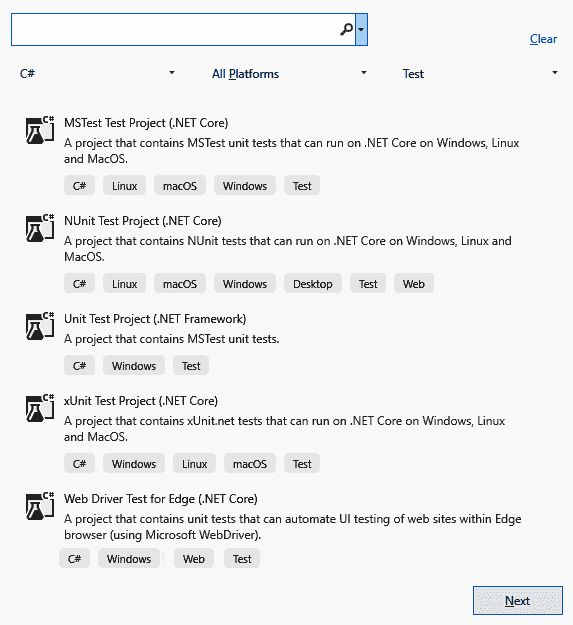
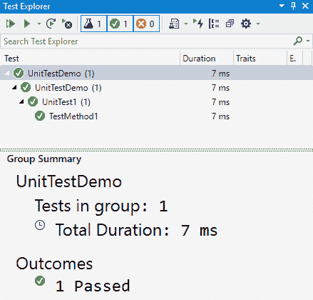
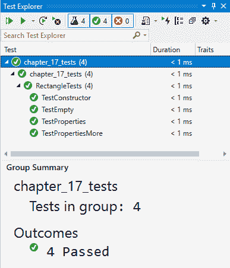
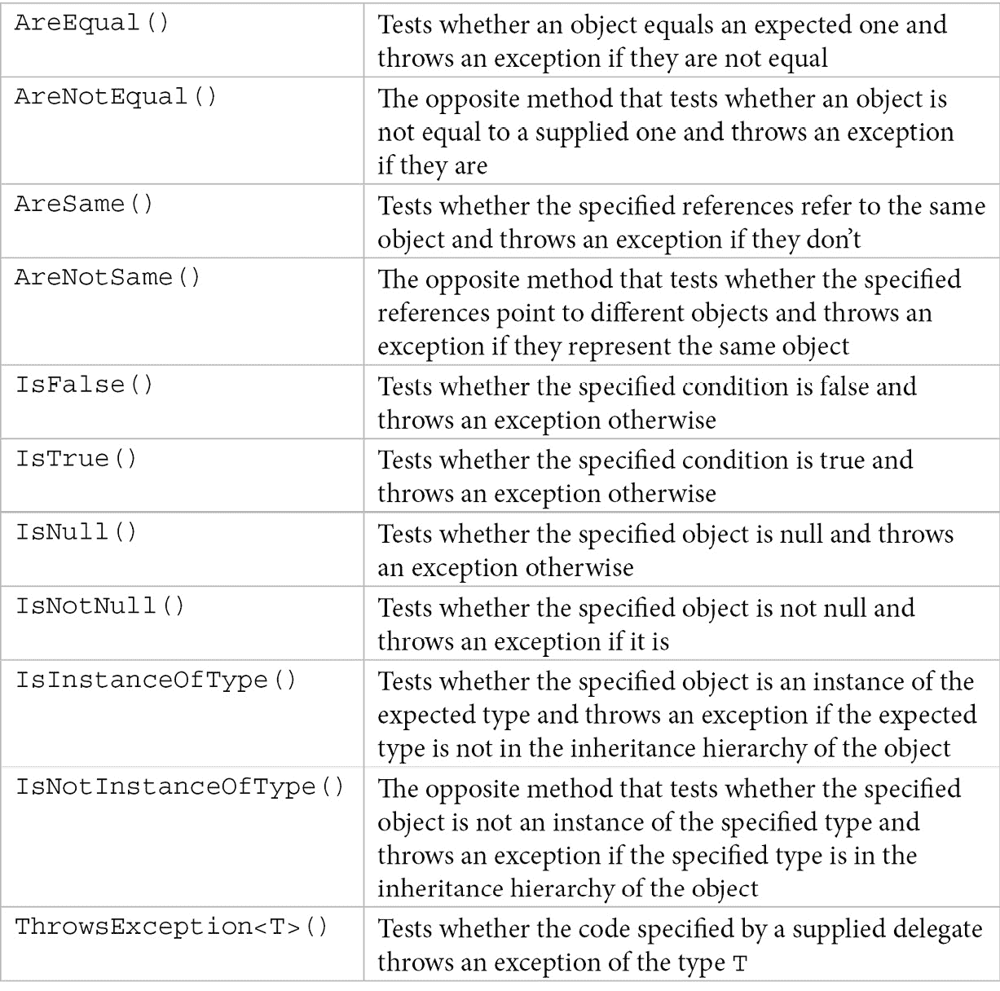

# 第十七章：单元测试

在整本书中，您已经学会了使用 C#语言进行编程所需的一切——从语句到类，从泛型到函数式编程，从反射到并发等等。我们还涵盖了许多与.NET Framework 和.NET Core 相关的主题，包括集合、正则表达式、文件和流、资源管理以及**语言集成查询**（**LINQ**）。

然而，编程的一个关键方面是确保代码的行为符合预期。没有经过适当测试的代码容易出现意外错误。有各种类型和级别的测试，但通常由开发人员在开发过程中执行的是*单元测试*。这是本书最后一章涵盖的主题。在本章中，您将学习什么是单元测试，以及用于编写 C#单元测试的内置工具。然后，我们将详细了解如何利用这些工具来对我们的 C#代码进行单元测试。

在本章中，我们将重点关注以下主题：

+   什么是单元测试？

+   微软的单元测试工具有哪些？

+   创建 C#单元测试项目

+   编写单元测试

+   编写数据驱动的单元测试

让我们从单元测试的概述开始。

# 什么是单元测试？

单元测试是一种软件测试类型，其中测试单个代码单元以验证它们是否按设计工作。单元测试是软件测试的第一级，其他级别包括集成测试、系统测试和验收测试。讨论这些测试类型超出了本书的范围。单元测试通常由软件开发人员执行。

执行单元测试具有重要的好处：

+   它有助于在开发周期的早期识别和修复错误，从而有助于节省时间和金钱。

+   它有助于开发人员更好地理解代码，并允许他们快速更改代码库。

+   它通过要求更模块化来帮助代码重用。

+   它可以作为项目文档。

+   它有助于加快开发速度，因为使用开发人员手动测试的各种方法来识别错误的工作量大于编写单元测试所花费的时间。

+   它简化了调试，因为当测试失败时，只需要查看和调试最新的更改。

测试的单元可能不同。它可以是一个*函数*（通常是在命令式编程中）或一个*类*（在面向对象编程中）。单元是单独和独立地进行测试的。这要求单元被设计为松散耦合，但也需要使用替代品，如存根、模拟和伪造。虽然这些概念的定义可能有所不同，但存根是作为其他函数的替代品，模拟它们的行为。示例可能包括用于从 Web 服务检索数据的函数的存根，或者用于稍后添加的功能的临时替代品。模拟是模拟其他对象行为的对象，通常是复杂的，不适合用于单元测试。术语**伪造**可能指的是*存根*或*模拟*，用于指示一个不真实的实体。

除了使用替代品，单元测试通常需要使用测试工具。测试工具是一种自动化测试框架，通过支持测试的创建、执行测试和生成报告来实现测试的自动化。

代码库被单元测试覆盖的程度被称为**代码覆盖率**。代码覆盖率通过提供定量度量来指示代码库已经经过测试的程度。代码覆盖率帮助我们识别程序中未经充分测试的部分，并允许我们创建更多的测试来增加覆盖率。

# 微软的单元测试工具有哪些？

如果您正在使用 Visual Studio，有几个工具可以帮助您为您的 C#代码编写单元测试。这些工具包括以下内容：

+   **Test Explorer**：这是 IDE 的一个组件，允许您查看单元测试，运行它们并查看它们的结果。**Test Explorer**不仅适用于 MSTest（Microsoft 的测试单元框架）。它有一个可扩展的 API，允许为第三方框架开发适配器。一些提供**Test Explorer**适配器的框架包括**NUnit**和**xUnit**。

+   **Microsoft 托管代码单元测试框架或 MSTest**：这是与 Visual Studio 一起安装的，也可以作为 NuGet 包使用。还有一个类似功能的本地代码单元测试框架。

+   **代码覆盖工具**：它们允许您确定单元测试覆盖的代码量。

+   **Microsoft Fakes 隔离框架**：这允许您为类和方法创建替代品。目前，这仅适用于.NET Framework 和 Visual Studio Enterprise。目前，不支持.NET 标准项目。

在撰写本书时，使用 Microsoft 测试框架进行.NET Framework 和.NET Core 的测试体验有些不同，因为.NET Core 测试项目没有单元测试模板。这意味着您需要手动创建测试类和方法，并使用适当的属性进行修饰，我们很快就会看到。

# 创建一个 C#单元测试项目

在本节中，我们将一起看一下如何在 Visual Studio 2019 中创建一个单元测试项目。当您打开**文件**|**新建项目**菜单时，您可以在各种测试项目之间进行选择：



图 17.1 - Visual Studio 2019 单元测试项目模板

如果您需要测试一个.NET Framework 项目，那么您选择**Unit Test Project (.NET Framework)**。

一个项目会为您创建一个包含以下内容的单元测试文件：

```cs
using System;
using Microsoft.VisualStudio.TestTools.UnitTesting;
namespace UnitTestDemo
{
    [TestClass]
    public class UnitTest1
    {
        [TestMethod]
        public void TestMethod1()
        {
        }
    }
}
```

在这里，`UnitTest1`是一个包含测试方法的类。这个类被标记为`TestClassAttribute`属性。另一个属性`TestMethodAttribute`被用来标记`TestMethod1()`方法。这些属性被测试框架用来识别包含测试的类和方法。然后它们会显示在**Test Explorer**中，您可以在那里运行或调试它们并查看它们的结果，就像您在下面的截图中看到的那样：



图 17.2 - Visual Studio 中的 Test Explorer 显示了从所选模板创建的空单元测试的执行结果

您可以通过手动方式或使用 Visual Studio 中可用的测试模板来添加更多的单元测试类，就像下面的截图所示：


图 17.3 - Visual Studio 中的添加新项对话框，其中包含一些单元测试项目

如果您正在测试一个.NET Core 项目，那么在创建测试项目时，您应该选择名为**MSTest Test Project (.NET Core)**的模板（参考本节开头的截图）。结果是一个包含单个文件和之前显示的相同内容的项目。然而，使用向导添加更多的单元测试项目是不可能的，您必须手动创建一切。目前，MSTest 对.NET Core 没有可用的项目模板。

在本章的其余部分，我们将专注于测试.NET Core 项目。

# 编写单元测试

在本节中，我们将看一下如何为您的 C#代码编写单元测试。为此，我们将考虑一个矩形的以下实现：

```cs
public struct Rectangle
{
    public readonly int Left;
    public readonly int Top;
    public readonly int Right;
    public readonly int Bottom;
    public int Width => Right - Left;
    public int Height => Bottom - Top;
    public int Area => Width * Height;
    public Rectangle(int left, int top, int right, int bottom)
    {
        Left = left;
        Top = top;
        Right = right;
        Bottom = bottom;
    }
    public static Rectangle Empty => new Rectangle(0, 0, 0, 0); 
}
```

这个实现应该是直接的，不需要进一步的解释。这是一个简单的类，关于矩形并没有提供太多的功能。我们可以通过扩展方法提供更多功能。以下清单显示了增加和减少矩形大小的扩展，以及检查两个矩形是否相交，并确定它们相交的结果矩形：

```cs
public static class RectangleExtensions
{
    public static Rectangle Inflate(this Rectangle r, 
                                    int left, int top, 
                                    int right, int bottom) =>
        new Rectangle(r.Left + left, r.Top + top, 
                      r.Right + right, r.Bottom + bottom);
    public static Rectangle Deflate(this Rectangle r, 
                                    int left, int top, 
                                    int right, int bottom) =>
        new Rectangle(r.Left - left, r.Top - top, 
                      r.Right - right, r.Bottom - bottom);
    public static Rectangle Interset(
      this Rectangle a, Rectangle b)
    {
        int l = Math.Max(a.Left, b.Left);
        int r = Math.Min(a.Right, b.Right);
        int t = Math.Max(a.Top, b.Top);
        int bt = Math.Min(a.Bottom, b.Bottom);
        if (r >= l && bt >= t)
            return new Rectangle(l, t, r, bt);
        return Rectangle.Empty;
    }
    public static bool IntersectsWith(
       this Rectangle a, Rectangle b) =>
        ((b.Left < a.Right) && (a.Left < b.Right)) &&
        ((b.Top < a.Bottom) && (a.Top < b.Bottom));
}
```

我们将从测试`Rectangle`结构开始，为此，我们将不得不创建一个单元测试项目，如前一节所述。创建项目后，我们可以编辑生成的存根，使用以下代码：

```cs
[TestClass]
public class RectangleTests
{
    [TestMethod]
    public void TestEmpty()
    {
        var rectangle = Rectangle.Empty;
        Assert.AreEqual(0, rectangle.Left);
        Assert.AreEqual(0, rectangle.Top);
        Assert.AreEqual(0, rectangle.Right);
        Assert.AreEqual(0, rectangle.Bottom);
    }
    [TestMethod]
    public void TestConstructor()
    {
        var rectangle = new Rectangle(1, 2, 3, 4);
        Assert.AreEqual(1, rectangle.Left);
        Assert.AreEqual(2, rectangle.Top);
        Assert.AreEqual(3, rectangle.Right);
        Assert.AreEqual(4, rectangle.Bottom);
    }
    [TestMethod]
    public void TestProperties()
    {
      var rectangle = new Rectangle(1, 2, 3, 4);
      Assert.AreEqual(2, rectangle.Width, "With must be 2");
      Assert.AreEqual(2, rectangle.Height, "Height must be 2");
      Assert.AreEqual(4, rectangle.Area, "Area must be 4"); 
    }
    [TestMethod]
    public void TestPropertiesMore()
    {
        var rectangle = new Rectangle(1, 2, -3, -4);
        Assert.IsTrue(rectangle.Width < 0,
                      "Width should be negative");
        Assert.IsFalse(rectangle.Height > 0,
                       "Height should be negative");
    }
}
```

在此列表中，我们有一个名为`RectangleTests`的测试类，其中包含几个测试方法：

+   `TestEmpty()`

+   `TestConstructor()`

+   `TestProperties()`

+   `TestPropertiesMore()`

这些方法中的每一个都测试了`Rectangle`类的一部分。为此，我们使用了`Microsoft.VisualStudio.TestTools.UnitTesting`中的`Assert`类。该类包含一系列静态方法，帮助我们执行测试。当测试失败时，将引发异常，并且测试方法的执行将停止，并继续下一个测试方法。

在下一个截图中，我们可以看到执行我们之前编写的测试方法的结果。您可以看到所有测试都已成功执行：



图 17.4 - 测试资源管理器显示先前编写的测试方法成功执行

当测试失败时，它将显示为红色的圆点，您可以检查`TestProperties()`方法，看看以下不正确的测试：

```cs
Assert.AreEqual(6, rectangle.Area, "Area must be 6");
```

这将导致`TestProperties()`测试方法失败，如下一个截图所示：


图 17.5 - 测试资源管理器显示 TestProperties()方法执行失败的测试方法

失败的原因在**测试详细摘要**窗格中有详细说明，如下一个截图所示。单击失败的测试时，将显示此窗格：


图 17.6 - 测试资源管理器的测试详细摘要窗格显示了有关失败测试的详细信息

从此窗格中的报告中，我们可以看到`RectangleTests.cs`中`第 30 行`的`Assert.AreEqual()`失败，因为期望的结果是`6`，但实际值是`4`。我们还得到了我们提供给`Assert.AreEqual()`方法的消息。前一个截图中的整个文本消息如下：

```cs
TestProperties
   Source: RectangleTests.cs line 30
   Duration: 29 ms
  Message: 
    Assert.AreEqual failed. Expected:<6>. Actual:<4>. Area must be 6
  Stack Trace: 
    RectangleTests.TestProperties() line 35
```

到目前为止编写的测试代码中，我们使用了几种断言方法——`AreEqual()`、`IsTrue()`和`IsFalse()`。然而，这些并不是唯一可用的断言方法；还有很多。以下表格显示了一些最常用的断言方法：



此表中列出的所有方法实际上都是重载方法。您可以通过在线文档获得完整的参考资料。

## 分析代码覆盖率

当我们创建`Rectangle`类时，还为其创建了几个扩展方法，因此我们应该编写更多的单元测试来覆盖这两个。我们可以将这些测试放入另一个测试类中。尽管附带本书的源代码包含更多的单元测试，但为简洁起见，我们在这里只列出了其中一些：

```cs
[TestClass]
public class RectangleExtensionsTests
{
    [TestMethod]
    public void TestInflate()
    {
        var rectangle1 = Rectangle.Empty.Inflate(1, 2, 3, 4);
        Assert.AreEqual(1, rectangle1.Left);
        Assert.AreEqual(2, rectangle1.Top);
        Assert.AreEqual(3, rectangle1.Right);
        Assert.AreEqual(4, rectangle1.Bottom);
    }
    [TestMethod]
    public void TestDeflate()
    {
        var rectangle1 = Rectangle.Empty.Deflate(1, 2, 3, 4);
        Assert.AreEqual(-1, rectangle1.Left);
        Assert.AreEqual(-2, rectangle1.Top);
        Assert.AreEqual(-3, rectangle1.Right);
        Assert.AreEqual(-4, rectangle1.Bottom);
    }
    [TestMethod]
    public void TestIntersectsWith()
    {
        var rectangle = new Rectangle(1, 2, 10, 12);
        var rectangle1 = new Rectangle(3, 4, 5, 6);
        var rectangle2 = new Rectangle(5, 10, 20, 13);
        var rectangle3 = new Rectangle(11, 13, 15, 16);
        Assert.IsTrue(rectangle.IntersectsWith(rectangle1));
        Assert.IsTrue(rectangle.IntersectsWith(rectangle2));
        Assert.IsFalse(rectangle.IntersectsWith(rectangle3));
    }
    [TestMethod]
    public void TestIntersect()
    {
        var rectangle = new Rectangle(1, 2, 10, 12);
        var rectangle1 = new Rectangle(3, 4, 5, 6);
        var rectangle3 = new Rectangle(11, 13, 15, 16);
        var intersection1 = rectangle.Intersect(rectangle1);
        var intersection3 = rectangle.Intersect(rectangle3);
        Assert.AreEqual(3, intersection1.Left);
        Assert.AreEqual(4, intersection1.Top);
        Assert.AreEqual(5, intersection1.Right);
        Assert.AreEqual(6, intersection1.Bottom);
        Assert.AreEqual(0, intersection3.Left);
        Assert.AreEqual(0, intersection3.Top);
        Assert.AreEqual(0, intersection3.Right);
        Assert.AreEqual(0, intersection3.Bottom);
    }
}
```

编译单元测试项目后，新的单元测试类和方法将出现在**测试资源管理器**中，因此您可以运行或调试它们。以下截图显示了所有测试方法的成功执行：


图 17.7 - 测试资源管理器窗口显示了所有单元测试的成功执行，包括为矩形扩展方法编写的单元测试

我们还可以根据您编写的单元测试来获取代码覆盖率。您可以从**测试资源管理器**或**测试**顶级菜单触发代码覆盖。根据我们目前所见的单元测试，我们得到以下覆盖范围：


图 17.8 - Visual Studio 中显示我们单元测试代码覆盖率的代码覆盖结果窗格

在这里，我们可以看到`Rectangle`类完全被单元测试覆盖。然而，包含扩展的静态类只覆盖了`IntersectsWith()`，有一个八分之一的代码块没有被我们编写的单元测试覆盖。我们可以使用这份报告来识别代码中未被测试覆盖的部分，以便您可以编写更多测试。

## 测试的解剖学

到目前为止，我们编写的测试中，我们已经看到了测试类和测试方法。然而，测试类可能具有在不同阶段执行的其他方法。下面的代码显示了一个完整的示例：

```cs
[TestClass]
public class YourUnitTests
{
   [AssemblyInitialize]
   public static void AssemblyInit(TestContext context) { }
   [AssemblyCleanup]
   public static void AssemblyCleanup() { }
   [ClassInitialize]
   public static void TestFixtureSetup(TestContext context) { }
   [ClassCleanup]
   public static void TestFixtureTearDown() { }
   [TestInitialize]
   public void Setup() { }
   [TestCleanup]
   public void TearDown() { }

   [TestMethod]
   public void TestMethod1() { }
   TestMethod]
   public void TestMethod2() { }
}
```

这些方法的名称是无关紧要的。这里重要的是用于标记它们的属性。这些属性由测试框架反映，并确定方法被调用的顺序。对于这个特定的例子，顺序如下：

```cs
AssemblyInit()          // once per assembly
  TestFixtureSetup()    // once per test class
    Setup()             // before each test of the class
      TestMethod1()
    TearDown()          // after each test of the class
    Setup()
      TestMethod2()
    TearDown()
  TestFixtureTearDown() // once per test class
AssemblyCleanup()       // once per assembly
```

用于标记这些方法的属性列在下表中：


当您想要对同一个函数进行多个不同数据集的测试时，您可以从数据源中检索它们。托管代码的单元测试框架使这成为可能，我们将在下一节中看到。

# 编写数据驱动的单元测试

如果您再看一下之前的测试，比如`TestIntersectsWith()`测试方法，您会发现我们尝试测试各种情况，比如一个矩形与其他几个矩形的交集，一些相交，一些不相交。这是一个简单的例子，在实践中，应该有更多的矩形需要测试，以覆盖所有可能的矩形交集情况。

一般来说，随着代码的发展，测试也会发展，您经常需要添加更多的测试数据集。与其像我们之前的例子中那样在测试方法中明确地编写数据，您可以从数据源中获取数据。然后，测试方法针对数据源中的每一行执行一次。托管代码的单元测试框架支持三种不同的场景。

## 属性数据

第一种选项是通过代码提供数据，但通过一个名为`DataRowAttribute`的属性。这个属性有一个构造函数，允许我们指定任意数量的参数。然后，这些参数按照相同的顺序转发到它所用于的测试方法的参数中。让我们看一个例子：

```cs
[DataTestMethod]
[DataRow(true, 3, 4, 5, 6)]
[DataRow(true, 5, 10, 20, 13)]
[DataRow(false, 11, 13, 15, 16)]
public void TestIntersectsWith_DataRows(
    bool result, 
    int left, int top, int right, int bottom)
{
    var rectangle = new Rectangle(1, 2, 10, 12);
    Assert.AreEqual(
        result,
        rectangle.IntersectsWith(
            new Rectangle(left, top, right, bottom)));
}
```

在这个例子中有几件事情需要注意。首先，用于指示这是一个数据驱动测试方法的属性是`DataTestMethodAttribute`。然而，为了向后兼容，也支持`TestMethodAttribute`，尽管不鼓励使用。第二件需要注意的事情是`DataRowAttribute`的使用。我们用它来提供几个矩形的数据，以及与测试方法中的参考矩形相交的预期结果。如前所述，该方法对数据源中的每一行执行一次，这种情况下，即`DataRow`属性的每次出现。

以下清单显示了执行测试方法的输出：

```cs
Test has multiple result outcomes
   4 Passed
Results
    1) TestIntersectsWith_DataRows
      Duration: 8 ms
    2) TestIntersectsWith_DataRows (True,3,4,5,6)
      Duration: < 1 ms
    3) TestIntersectsWith_DataRows (True,5,10,20,13)
      Duration: < 1 ms
    4) TestIntersectsWith_DataRows (False,11,13,15,16)
      Duration: < 1 ms
```

如果数据源中的一行使测试失败，则会报告这种情况，但是方法的执行将重复进行，直到数据源中的下一行。

## 动态数据

使用`DataRow`属性是一种改进，因为它使测试代码更简单，但并非最佳选择。稍微更好的选择是动态地从类的方法或属性中获取数据。这可以使用另一个名为`DynamicDataAttribute`的属性来实现。您必须指定数据源的名称和类型（方法或属性）。下面的代码示例：

```cs
public static IEnumerable<object[]> GetData()
{
    yield return new object[] { true, 3, 4, 5, 6 };
    yield return new object[] { true, 5, 10, 20, 13 };
    yield return new object[] { false, 11, 13, 15, 16 };
}
[DataTestMethod]
[DynamicData(nameof(GetData), DynamicDataSourceType.Method)]
public void TestIntersectsWith_DynamicData(
    bool result, 
    int left, int top, int right, int bottom)
{
    var rectangle = new Rectangle(1, 2, 10, 12);
    Assert.AreEqual(
        result,
        rectangle.IntersectsWith(
            new Rectangle(left, top, right, bottom)));
} 
```

在本例中，我们定义了一个名为`GetData()`的方法，该方法返回一个对象数组的可枚举序列。我们用矩形边界和与参考矩形的交集的结果填充这些数组。然后，在测试方法中，我们使用`DynamicData`属性，并向其提供提供数据的方法的名称和数据源类型（`DynamicDataSourceType.Method`）。实际的测试代码与前一个示例中的代码没有任何不同。

然而，这种替代方案也依赖于硬编码数据。最理想的解决方案是从外部数据源读取数据。

## 来自外部源的数据

测试数据可以从外部源获取，例如 SQL Server 数据库、CSV 文件、Excel 文档或 XML。为此，我们必须使用另一个名为`DataSourceAttribute`的属性。此属性有几个构造函数，允许您指定到源的连接字符串和其他必要的参数。

注意

在撰写本书时，此解决方案和此属性仅适用于.NET Framework，并且尚不支持.NET Core。

要编写一个从外部源获取数据的测试方法，您需要能够访问有关此数据源的信息。这可以通过`TestContext`对象来实现，该对象由框架作为参数传递给标有`AssemblyInitialize`或`ClassInitialize`属性的方法。获取对该对象的引用的一个更简单的解决方案是，在测试类中提供一个名为`TestContext`的公共属性，并将其类型设置为`TestContext`，如下面的代码所示。框架将自动使用对测试上下文对象的引用来设置它：

```cs
public TestContext TestContext { get; set; }
```

然后，我们可以使用上下文来访问数据源信息。在接下来的示例中，我们将重写测试方法，以从与测试应用程序位于同一文件夹中的名为`TestData.csv`的 CSV 文件中获取数据。该文件的内容如下：

```cs
expected,left,top,right,bottom
true,3,4,5,6
true,5,10,20,13
false,11,13,15,16
```

第一列是与参考矩形的交集的预期结果，每行中的其他值是矩形的边界。从此 CSV 文件中获取数据执行的测试方法如下所示：

```cs
[DataTestMethod]
[DataSource("Microsoft.VisualStudio.TestTools.DataSource.CSV",
          "TestData.csv",
          "TestData#csv",
          DataAccessMethod.Sequential)]
public void TestIntersectsWith_CsvData()
{
    var rectangle = new Rectangle(1, 2, 10, 12);
    bool result = Convert.ToBoolean(
      TestContext.DataRow["Expected"]);
    int left = Convert.ToInt32(TestContext.DataRow["left"]);
    int top = Convert.ToInt32(TestContext.DataRow["top"]);
    int right = Convert.ToInt32(TestContext.DataRow["right"]);
    int bottom = Convert.ToInt32(
        TestContext.DataRow["bottom"]);
    Assert.AreEqual(
        result,
        rectangle.IntersectsWith(
            new Rectangle(left, top, right, bottom)));
}
```

您可以看到，与以前的方法不同，此方法没有参数。数据可通过`TestContext`对象的`DataRow`属性获得，并且此方法对 CSV 文件中的每一行调用一次。

如果您不希望在源代码中指定数据源信息（例如连接字符串），则可以使用应用程序配置文件来提供。为此，您必须添加一个自定义部分，然后定义一个连接字符串（带有名称、字符串和提供程序名称）和数据源（带有名称、连接字符串名称、表名称和数据访问方法）。对于我们在前面示例中使用的 CSV 文件，`App.config`文件将如下所示：

```cs
<?xml version="1.0" encoding="utf-8" ?>
<configuration>
   <configSections>
      <section name="microsoft.visualstudio.testtools"
               type="Microsoft.VisualStudio.TestTools.UnitTesting.TestConfigurationSection, Microsoft.VisualStudio.TestPlatform.TestFramework.Extensions"/>
   </configSections>
   <connectionStrings>
         <add name="MyCSVConn"
              connectionString="TestData.csv"
              providerName="Microsoft.VisualStudio.TestTools.DataSource.CSV" />
      </connectionStrings>
   <microsoft.visualstudio.testtools>
      <dataSources>
         <add name="MyCSVDataSource"
              connectionString="MyCSVConn"
              dataTableName="TestData#csv"
              dataAccessMethod="Sequential"/>
      </dataSources>
   </microsoft.visualstudio.testtools>
</configuration>
```

有了这个定义，我们唯一需要对测试方法进行的更改就是更改`DataSource`属性，指定来自`.config`文件的数据源的名称（在我们的示例中为`MyCSVDataSource`）。如下面的代码所示。

```cs
[DataTestMethod]
[DataSource("MyCSVDataSource")]
public void TestIntersectsWith_CsvData()
{
    /* ... */
}
```

要获取有关如何为各种类型的数据源提供连接字符串的更多信息，您应该阅读在线文档。

# 摘要

这本书的最后一章专门讲述了单元测试，这对于编写高质量的代码至关重要。我们从基本介绍单元测试开始，了解了微软用于编写单元测试的工具，包括托管代码的单元测试框架。我们看到了如何使用这个框架创建单元测试项目，无论是针对.NET Framework 还是.NET Core。然后我们看了单元测试框架的最重要特性，并学习了如何编写单元测试。在最后一节中，我们了解了数据驱动测试，并学习了如何使用各种数据源编写测试。

随着这本书在这里结束，我们作为作者，要感谢你抽出时间来阅读。通过撰写这本书，我们试图为您提供成为 C#语言专家所必需的一切。我们希望这本书对您学习和掌握 C#语言是一个宝贵的资源。

# 检验你所学到的内容。

1.  什么是单元测试，它的最重要的好处是什么？

1.  Visual Studio 提供了哪些工具来帮助编写单元测试？

1.  Visual Studio 的测试资源管理器提供了哪些功能？

1.  如何指定单元测试项目中的类包含单元测试？

1.  你可以使用哪些类和方法来执行断言？

1.  如何检查单元测试的代码覆盖率？

1.  如何编写测试夹具，使其每个测试类执行一次？每个方法的测试夹具又是怎样的？

1.  什么是数据驱动的单元测试？

1.  `DynamicDataAttribute`是做什么的？`DataSourceAttribute`又是什么？

1.  支持的测试数据外部来源有哪些？
