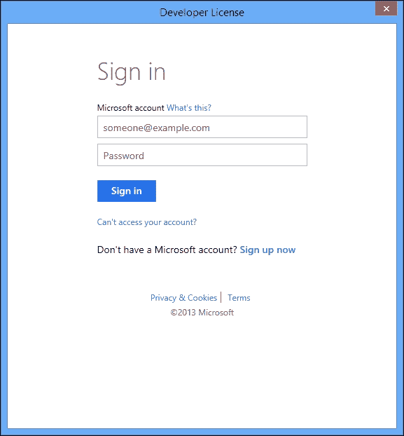
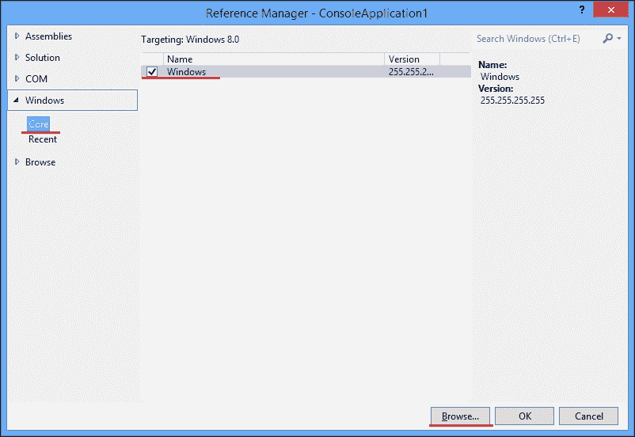

# 第十一章。还有更多

在这一章中，我们将看到 Windows 8 操作系统中的一种新的编程范式。您将学习到：

+   在 Windows Store 应用程序中使用定时器

+   从通常的应用程序中使用 WinRT

+   在 Windows Store 应用程序中使用 BackgroundTask

# 介绍

微软于 2011 年 9 月 13 日在 BUILD 大会上发布了 Windows 8 的第一个公共测试版。新操作系统试图通过引入响应式 UI、适用于触摸的平板设备、低功耗、新的应用程序模型、新的异步 API 和更严格的安全性等功能来解决 Windows 几乎所有的问题。

Windows API 改进的核心是一个新的多平台组件系统**WinRT**，它是 COM 的逻辑发展。使用 WinRT，程序员可以使用本机 C++代码、C#和.NET，甚至 JavaScript 和 HTML 来开发应用程序。另一个变化是引入了一个集中的应用商店，这在 Windows 平台之前是不存在的。

作为一个新的应用程序平台，Windows 8 具有向后兼容性，并允许运行通常的 Windows 应用程序。这导致了两类主要的应用程序：Windows Store 应用程序，其中新程序通过 Windows Store 分发，以及自上一版本 Windows 以来没有改变的通常的经典应用程序。

在本章中，我们将看到 Windows Store 应用程序。开发范式发生了很大的变化，作为程序员，您必须遵守特定的规则。程序必须在有限的时间内响应启动或完成，保持整个操作系统和其他应用程序的响应。为了节省电池，您的应用程序不再默认在后台运行；而是被暂停并实际停止执行。

新的 Windows API 是异步的，您只能在应用程序中使用白名单 API 函数。例如，您不允许再创建一个`Thread`类实例。您必须使用系统管理的线程池。许多通常的 API 不再能够使用，您必须学习以前实现相同目标的新方法。

在这一章中，我们将看到 Windows Store 应用程序与通常的 Windows 应用程序有何不同，我们如何可以在通常的应用程序中使用一些 WinRT 的好处，并通过一个简化的具有后台通知的 Windows Store 应用程序的场景。

# 在 Windows Store 应用程序中使用定时器

这个示例展示了如何在 Windows Store 应用程序中使用一个简单的定时器。

## 准备就绪

要完成这个示例，您需要 Visual Studio 2012 和 Windows 8+操作系统。不需要其他先决条件。此示例的源代码可以在`7644_Code\Chapter11\Recipe1`中找到。

## 如何做...

要理解如何在 Windows Store 应用程序中使用定时器，请执行以下步骤：

1.  启动 Visual Studio 2012。在**Windows Store**下创建一个新的 C# **空白应用（XAML）**项目。

1.  如果要求您更新开发人员许可证，您必须同意微软的隐私条款。

1.  然后，登录您的 Microsoft 账户（或首先创建一个）。

1.  最后，您会收到一个确认对话框，开发人员许可证已成功更新。

1.  在`MainPage.xaml`文件中，为`Grid`元素添加`Name`属性：

```cs
<Grid Name="Grid" Background="{StaticResourceApplicationPageBackgroundThemeBrush}">
```

1.  在`MainPage.xaml.cs`文件中，添加以下`using`指令：

```cs
using System;
using Windows.UI.Xaml;
using Windows.UI.Xaml.Controls;
using Windows.UI.Xaml.Navigation;
```

1.  在`MainPage`构造函数定义之前添加以下代码片段：

```cs
private readonly DispatcherTimer _timer;
private int _ticks;
```

1.  用以下代码片段替换`MainPage()`构造函数：

```cs
public MainPage()
{
  InitializeComponent();
  _timer = new DispatcherTimer();
  _ticks = 0;
}
```

1.  在`OnNavigatedTo`方法中添加以下代码片段：

```cs
Grid.Children.Clear();
var commonPanel = new StackPanel
{
  Orientation = Orientation.Vertical,
  HorizontalAlignment = HorizontalAlignment.Center
};

var buttonPanel = new StackPanel
{
  Orientation = Orientation.Horizontal,
  HorizontalAlignment = HorizontalAlignment.Center
};

var textBlock = new TextBlock
{
  Text = "Sample timer application",
  FontSize = 32,
  HorizontalAlignment = HorizontalAlignment.Center,
  Margin = new Thickness(40)
};

var timerTextBlock = new TextBlock
{
  Text = "0",
  FontSize = 32,
  HorizontalAlignment = HorizontalAlignment.Center,
  Margin = new Thickness(40)
};

var timerStateTextBlock = new TextBlock
{
  Text = "Timer is enabled",
  FontSize = 32,
  HorizontalAlignment = HorizontalAlignment.Center,
  Margin = new Thickness(40)
};

var startButton = new Button { Content = "Start",FontSize = 32};
var stopButton = new Button { Content = "Stop",FontSize = 32};

buttonPanel.Children.Add(startButton);
buttonPanel.Children.Add(stopButton);

commonPanel.Children.Add(textBlock);
commonPanel.Children.Add(timerTextBlock);
commonPanel.Children.Add(timerStateTextBlock);
commonPanel.Children.Add(buttonPanel);

_timer.Interval = TimeSpan.FromSeconds(1);
_timer.Tick += (sender, eventArgs) =>
{
  timerTextBlock.Text = _ticks.ToString(); _ticks++;
};
_timer.Start();

startButton.Click += (sender, eventArgs) =>
{
  timerTextBlock.Text = "0";
  _timer.Start();
  _ticks = 1;
  timerStateTextBlock.Text = "Timer is enabled";
};

stopButton.Click += (sender, eventArgs) =>
{
  _timer.Stop();
  timerStateTextBlock.Text = "Timer is disabled";
};

Grid.Children.Add(commonPanel);
```

1.  运行程序。

## 它是如何工作的...

当程序运行时，它会创建一个`MainPage`类的实例。在构造函数中，我们实例化了`DispatcherTimer`，并将`ticks`计数器初始化为零。然后，在`OnNavigatedTo`事件处理程序中，我们创建了 UI 控件，并将开始和停止按钮绑定到相应的 lambda 表达式，其中包含`start`和`stop`逻辑。

如您所见，`timer`事件处理程序直接与 UI 控件一起工作。这是可以的，因为`DispatcherTimer`是以这样一种方式实现的，即`timer`的`Tick`事件的处理程序由 UI 线程运行。然而，如果您运行程序然后切换到其他内容，并在几分钟后切换到程序删除，您可能会注意到秒表比实际经过的时间要慢得多。这是因为 Windows 8 应用程序，或者通常被称为 Windows Store 应用程序，具有完全不同的生命周期。

### 注意

请注意，Windows Store 应用程序的行为与智能手机和平板电脑平台上的应用程序非常相似。它们在后台运行而不是在一段时间后变得暂停，这意味着它们实际上被冻结，直到用户切换回它们。在它们变得暂停之前，您有有限的时间来保存当前应用程序状态，并且在应用程序再次运行时能够恢复状态。

虽然这种行为可以节省电源和 CPU 资源，但它会给那些应该在后台进行一些处理的应用程序的编程带来重大困难。Windows 8 有一组特殊的 API 用于编程这些应用程序。我们将在本章后面讨论这样的情景。

# 使用 WinRT 从普通应用程序中

这个示例展示了如何创建一个控制台应用程序，可以使用 WinRT API。

## 准备工作

要完成这个示例，您需要 Visual Studio 2012 和 Windows 8+操作系统。没有其他先决条件。此示例的源代码可以在`7644_Code\Chapter11\Recipe2`找到。

## 操作步骤如下：

要了解如何从普通应用程序中使用 WinRT，请执行以下步骤：

1.  启动 Visual Studio 2012。创建一个新的 C# **控制台应用程序**项目。

1.  在 Visual Studio 的**解决方案资源管理器**中右键单击创建的项目，选择**卸载项目...**菜单选项。

1.  右键单击未加载的项目，选择**编辑 ProjectName.csproj**菜单选项。

1.  在`<TargetFrameworkVersion>`元素下方添加以下 XML：

```cs
<TargetPlatformVersion>8.0</TargetPlatformVersion>
```

1.  保存`.csproj`文件，在 Visual Studio 的**解决方案资源管理器**中右键单击未加载的项目，选择**重新加载项目**菜单选项。

1.  右键单击项目，从**Windows**下的**核心**库中选择**添加引用**。然后点击**浏览**按钮。

1.  导航到`C:\Program Files\Reference Assemblies\Microsoft\Framework\.NETCore\v4.5`，然后点击`System.Runtime.WindowsRuntime.dll`。

1.  在`Program.cs`文件中添加以下`using`指令：

```cs
using System;
using System.IO;
using System.Threading.Tasks;
using Windows.Storage;
```

1.  在`Main`方法下方添加以下代码片段：

```cs
async static Task AsynchronousProcessing()
{
  StorageFolder folder = KnownFolders.DocumentsLibrary;

  if (await folder.DoesFileExistAsync("test.txt"))
  {
    var fileToDelete = await folder.GetFileAsync("test.txt");
    await fileToDelete.DeleteAsync(StorageDeleteOption.PermanentDelete);
  }

  var file = await folder.CreateFileAsync("test.txt",CreationCollisionOption.ReplaceExisting);
  using (var stream = await file.OpenAsync(FileAccessMode.ReadWrite))
  using (var writer = new StreamWriter(stream.AsStreamForWrite()))
  {
    await writer.WriteLineAsync("Test content");
    await writer.FlushAsync();
  }

  using (var stream = await file.OpenAsync(FileAccessMode.Read))
  using (var reader = new StreamReader(stream.AsStreamForRead()))
  {
    string content = await reader.ReadToEndAsync();
    Console.WriteLine(content);
  }

  Console.WriteLine("Enumerating Folder Structure:");

  var itemsList = await folder.GetItemsAsync();
  foreach (var item in itemsList)
  {
    if (item is StorageFolder)
    {
      Console.WriteLine("{0} folder", item.Name);
    }
    else
    {
      Console.WriteLine(item.Name);
    }
  }
}
```

1.  在`Main`方法内添加以下代码片段：

```cs
var t = AsynchronousProcessing();
t.GetAwaiter().GetResult();
Console.WriteLine();
Console.WriteLine("Press ENTER to continue");
Console.ReadLine();
```

1.  在`Program`类定义下方添加以下代码片段：

```cs
static class Extensions
{
  public static async Task<bool> DoesFileExistAsync(thisStorageFolder folder, string fileName)
  {
    try
    {
      await folder.GetFileAsync(fileName);
      return true;
    }
    catch (FileNotFoundException)
    {
      return false;
    }
  }
}
```

1.  运行程序。

## 工作原理如下：

在这里，我们使用了一种相当巧妙的方法，从普通的.NET 控制台应用程序中使用 WinRT API。不幸的是，并非所有可用的 API 都适用于这种情况，但仍然可以用于处理运动传感器、GPS 定位服务等。

要在 Visual Studio 中引用 WinRT，我们手动编辑`.csproj`文件，指定应用程序的目标平台为 Windows 8。然后我们手动引用`System.Runtime.WindowsRuntime.dll`来利用 WinRT 异步操作的`GetAwaiter`扩展方法实现。这使我们能够直接在 WinRT API 上使用`await`。也有反向转换。当我们创建一个 WinRT 库时，我们必须公开 WinRT 本机`IAsyncOperation`接口系列，以便以一种与语言无关的方式从 JavaScript 和 C++中使用异步操作。

WinRT 中的文件操作相当自我描述；这里我们有异步文件创建和删除操作。然而，在 WinRT 中的文件操作包含安全限制，鼓励您使用特殊的 Windows 文件夹来进行应用程序开发，并不允许您使用磁盘驱动器上的任何文件路径。

# 在 Windows Store 应用程序中使用 BackgroundTask

这个操作指南介绍了在 Windows Store 应用程序中创建后台任务的过程，该任务会在桌面上更新应用程序的动态磁贴。

## 准备工作

要执行此操作，您需要 Visual Studio 2012 和 Windows 8+操作系统。没有其他先决条件。此操作的源代码可以在`7644_Code\Chapter11\Recipe3`中找到。

## 如何运作...

为了理解如何在 Windows Store 应用程序中使用`BackgroundTask`，执行以下步骤：

1.  启动 Visual Studio 2012。在**Windows Store**下创建一个新的 C# **空白应用程序（XAML）**项目。如果需要更新开发者许可证，请参考*在 Windows Store 应用程序中使用定时器*的详细说明。

1.  在**Assets**文件夹中，使用 Paint 编辑器打开**SmallLogo.png**文件，将其裁剪为 24 x 24 像素大小，将其另存为`SmallLogo-Badge.png`，并将其包含在项目中。

1.  打开`Package.appxmanifest`文件。在**声明**选项卡中，将**后台任务**添加到**支持的声明**中。在**属性**下，检查支持的属性**系统事件**和**定时器**，并将**入口点**的名称设置为`YourNamespace.TileSchedulerTask`。`YourNamespace`应该是您的应用程序的命名空间。

1.  在**应用程序 UI**选项卡中，将**锁定屏幕通知**选择为**徽章**，并将**徽章标志**选择为**Assets\SmallLogo-Badge.png**。

1.  在`MainPage.xaml`文件中，在`Grid`元素中插入以下 XAML：

```cs
<StackPanel Margin="50">
  <TextBlock Name="Clock"Text="HH:mm"HorizontalAlignment="Center"VerticalAlignment="Center"Style="{StaticResource HeaderTextStyle}"/></StackPanel>
```

1.  在`MainPage.xaml.cs`文件中添加以下`using`指令：

```cs
using System;
using System.Diagnostics;
using System.Globalization;
using System.Linq;
using System.Xml.Linq;
using Windows.ApplicationModel.Background;
using Windows.Data.Xml.Dom;
using Windows.System.UserProfile;
using Windows.UI.Notifications;
using Windows.UI.Xaml;
using Windows.UI.Xaml.Controls;
using Windows.UI.Xaml.Navigation;
```

1.  在`MainPage`构造函数定义之前添加以下代码片段：

```cs
private const string TASK_NAME_USERPRESENT ="TileSchedulerTask_UserPresent";
private const string TASK_NAME_TIMER ="TileSchedulerTask_Timer";

private readonly CultureInfo _cultureInfo;
private readonly DispatcherTimer _timer;
```

1.  用以下代码片段替换`MainPage`构造函数：

```cs
public MainPage()
{
InitializeComponent();

string language = GlobalizationPreferences.Languages.First();
_cultureInfo = new CultureInfo(language);

_timer = new DispatcherTimer();
_timer.Interval = TimeSpan.FromSeconds(1);
_timer.Tick += (sender, e) => UpdateClockText();
}
```

1.  在`OnNavigatedTo`方法之前添加以下代码片段：

```cs
private void UpdateClockText()
{
  Clock.Text = DateTime.Now.ToString(_cultureInfo.DateTimeFormat.FullDateTimePattern);
}

private static async void CreateClockTask()
{
  BackgroundAccessStatus result = awaitBackgroundExecutionManager.RequestAccessAsync();
  if (result == BackgroundAccessStatus.AllowedMayUseActiveRealTimeConnectivity ||result == BackgroundAccessStatus.AllowedWithAlwaysOnRealTimeConnectivity)
  {
    TileSchedulerTask.CreateSchedule();

    EnsureUserPresentTask();
    EnsureTimerTask();
  }
}

private static void EnsureUserPresentTask()
{
  foreach (var task in BackgroundTaskRegistration.AllTasks)
    if (task.Value.Name == TASK_NAME_USERPRESENT)
      return;

  var builder = new BackgroundTaskBuilder();
  builder.Name = TASK_NAME_USERPRESENT;
  builder.TaskEntryPoint =(typeof(TileSchedulerTask)).FullName;
  builder.SetTrigger(new SystemTrigger(SystemTriggerType.UserPresent, false));
  builder.Register();
}

private static void EnsureTimerTask()
{
  foreach (var task in BackgroundTaskRegistration.AllTasks)
    if (task.Value.Name == TASK_NAME_TIMER)
      return;

  var builder = new BackgroundTaskBuilder();
  builder.Name = TASK_NAME_TIMER;
  builder.TaskEntryPoint = (typeof(TileSchedulerTask)).FullName;
  builder.SetTrigger(new TimeTrigger(180, false));
  builder.Register();
}
```

1.  在`OnNavigatedTo`方法内添加以下代码片段：

```cs
_timer.Start();
UpdateClockText();
CreateClockTask();
```

1.  在`MainPage`类定义之后添加以下代码片段：

```cs
public sealed class TileSchedulerTask : IBackgroundTask
{
  public void Run(IBackgroundTaskInstance taskInstance)
  {
    var deferral = taskInstance.GetDeferral();
    CreateSchedule();
    deferral.Complete();
  }

  public static void CreateSchedule()
  {
    var tileUpdater = TileUpdateManager.CreateTileUpdaterForApplication();
    var plannedUpdated = tileUpdater.GetScheduledTileNotifications();

    DateTime now = DateTime.Now;
    DateTime planTill = now.AddHours(4);

    DateTime updateTime = new DateTime(now.Year, now.Month,now.Day, now.Hour, now.Minute, 0).AddMinutes(1);
    if (plannedUpdated.Count > 0)
      updateTime = plannedUpdated.Select(x =>x.DeliveryTime.DateTime).Union(new[] { updateTime}).Max();
    XmlDocument documentNow = GetTilenotificationXml(now);

    tileUpdater.Update(new TileNotification(documentNow) {ExpirationTime = now.AddMinutes(1) });

    for (var startPlanning = updateTime;startPlanning < planTill; startPlanning =startPlanning.AddMinutes(1))
    {
      Debug.WriteLine(startPlanning);
      Debug.WriteLine(planTill);

      try
      {
        XmlDocument document = GetTilenotificationXml(startPlanning);

        var scheduledNotification = newScheduledTileNotification(document,new DateTimeOffset(startPlanning))
        {
          ExpirationTime = startPlanning.AddMinutes(1)
        };

        tileUpdater.AddToSchedule(scheduledNotification);
      }
      catch (Exception ex)
      {
        Debug.WriteLine("Error: " + ex.Message);
      }
    }
  }

  private static XmlDocument GetTilenotificationXml(DateTime dateTime)
  {
    string language =GlobalizationPreferences.Languages.First();
    var cultureInfo = new CultureInfo(language);

    string shortDate = dateTime.ToString(cultureInfo.DateTimeFormat.ShortTimePattern);
    string longDate = dateTime.ToString(cultureInfo.DateTimeFormat.LongDatePattern);

    var document = XElement.Parse(string.Format(@"<tile>
    <visual>
      <binding template=""TileSquareText02"">
        <text id=""1"">{0}</text>
        <text id=""2"">{1}</text>
      </binding>
      <binding template=""TileWideText01"">
        <text id=""1"">{0}</text>
        <text id=""2"">{1}</text>
        <text id=""3""></text>
        <text id=""4""></text>
      </binding>  
    </visual>
  </tile>", shortDate, longDate));

    return document.ToXmlDocument();
  }
}

public static class DocumentExtensions
{
  public static XmlDocument ToXmlDocument(thisXElement xDocument)
  {
    var xmlDocument = new XmlDocument();
    xmlDocument.LoadXml(xDocument.ToString());
    return xmlDocument;
  }
} 
```

1.  运行程序。

## 如何运作...

上述程序显示了如何创建后台基于时间的任务，以及如何在 Windows 8 开始屏幕上的动态磁贴上显示来自此任务的更新。编写 Windows Store 应用程序本身就是一项相当具有挑战性的任务——您必须关心应用程序的暂停/恢复状态等许多其他问题。在这里，我们将专注于我们的主要任务，把次要问题留在后面。

我们的主要目标是在应用程序本身不在前台时运行一些代码。首先，我们创建了`IBackgroundTask`接口的实现。这是我们的代码，`Run`方法将在收到触发信号时被调用。重要的是，如果`Run`方法中包含带有`await`的异步代码，我们必须使用一个特殊的延迟对象，如食谱中所示，明确指定我们何时开始和结束`Run`方法的执行。在我们的情况下，方法调用是同步的，但为了说明这一要求，我们使用延迟对象。

在我们的任务中，我们在`Run`方法中每分钟创建一组磁贴更新，持续 4 小时，并借助`ScheduledTaskNotification`类将其注册到`TileUpdateManager`中。磁贴使用特殊的 XML 格式来指定文本在其上的位置。当我们从系统触发任务时，它会为接下来的 4 小时安排每分钟的磁贴更新。然后，我们需要注册我们的后台任务。我们进行了两次注册；一次注册提供了`UserPresent`触发器，这意味着当用户登录时将触发此任务。下一个触发器是时间触发器，每 3 小时运行一次任务。

当程序运行时，它会创建一个定时器，在应用程序在前台时运行。与此同时，它正在尝试注册后台任务；要注册这些任务，程序需要用户权限，并且将显示一个对话框请求用户的权限。现在我们已经安排了接下来 4 小时的动态磁贴更新。如果我们关闭应用程序，动态磁贴将继续每分钟显示新的时间。在接下来的 3 小时内，时间触发器将再次运行我们的后台任务，并且我们将安排另一个动态磁贴更新。
