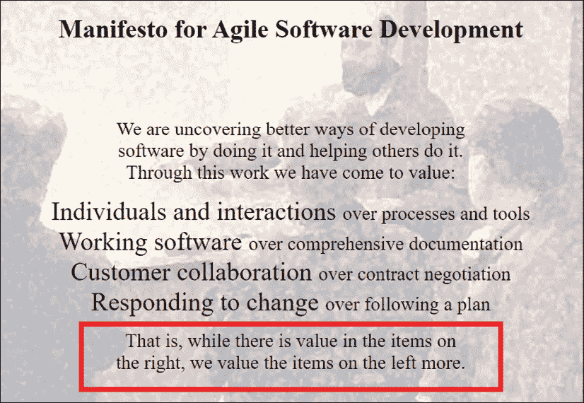
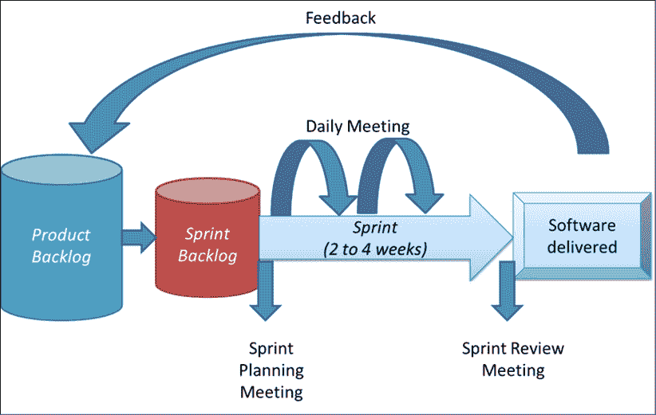
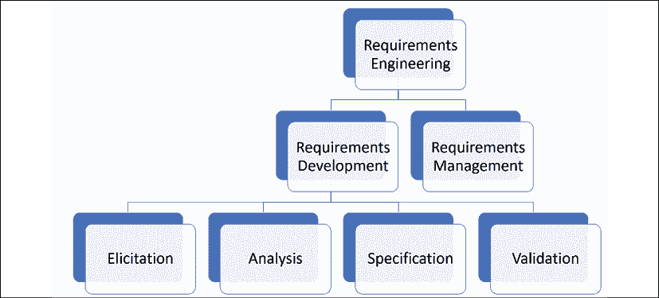

# 第一章：1

# 理解软件架构的重要性

软件架构是当今软件行业中讨论最多的话题之一，它的重要性将来肯定会增长。我们建造的解决方案越复杂、奇妙，我们就越需要出色的软件架构来维护它们。但是，新功能被添加到这��软件解决方案的速度不断增加，新的架构机会也不断出现。这就是你决定阅读这本书的原因；也是我们决定写第二版的原因。

写这个重要的话题并不是一件简单的任务，因为它提供了许多替代技术和解决方案。本书的主要目标不是建立一个详尽而永无止境的可用技术和解决方案清单，而是展示各种技术家族是如何相关的，以及它们如何在实践中影响可维护和可持续解决方案的构建。

我们需要将注意力集中在创建实际、有效的企业解决方案上的需求不断增加；用户总是需要他们的应用程序中的更多新功能。此外，由于市场变化迅速，需要频繁交付应用程序版本的需求增加了我们对复杂软件架构和开发技术的义务。

本章将涵盖以下主题：

+   对软件架构的理解

+   一些可能对软件架构师有帮助的软件开发过程模型

+   收集设计高质量软件所需的正确信息的过程

+   帮助开发过程的设计技术

+   需求影响系统结果的情况

+   本书案例研究的介绍

本书的案例研究将带你了解为名为**World Wild Travel Club**（**WWTravelClub**）的旅行社创建软件架构的过程。这个案例研究的目的是帮助你理解每一章节中解释的理论，并提供一个如何使用 Azure、Azure DevOps、C# 9、.NET 5、ASP.NET 和其他本书中介绍的技术开发企业应用的示例。

在本章结束时，你将能够准确理解软件架构的使命。你还将学习 Azure 是什么，以及如何在平台上创建你的账户。你还将获得关于软件流程、模型和其他技术的概述，这些将使你能够管理你的团队。

# 什么是软件架构？

如果你今天在阅读这本书，你应该感谢那些决定将软件开发视为工程领域的计算机科学家。这发生在上个世纪，更具体地说，是在六十年代末，当他们提出我们开发软件的方式很像我们建造建筑物的方式时。这就是为什么我们有了**软件架构**这个名字。就像建筑师设计建筑并监督其建造一样，软件架构师的主要目标是确保软件应用程序的良好实施；而良好的实施需要设计一个出色的解决方案。

在专业开发项目中，你必须做以下几件事情：

+   定义解决方案的客户需求

+   设计一个出色的解决方案来满足这些要求

+   实施设计好的解决方案

+   与客户验证解决方案

+   在工作环境中交付解决方案

软件工程将这些活动定义为软件开发生命周期。所有的理论软件开发过程模型（瀑布、螺旋、增量、敏捷等）都与这个周期有某种关联。无论你使用哪种模型，如果你在项目期间不使用前面提到的基本任务，你将无法交付可接受的软件解决方案。

设计出色解决方案的主要点是本书的目的。您必须了解伟大的现实世界解决方案伴随着一些基本的约束：

+   解决方案需要满足用户需求

+   解决方案需要按时交付

+   解决方案需要符合项目预算

+   解决方案需要提供良好的质量

+   解决方案需要保证安全和有效的未来发展

出色的解决方案需要可持续发展，您必须了解没有伟大的软件架构就没有可持续的软件。如今，出色的软件架构取决于现代工具和现代环境，以完美地满足用户的需求。

因此，本书将使用微软提供的一些优秀工具。该公司已宣布.NET 5 作为软件开发的统一平台，这为我们创造了一个巨大的机会来创建出色的解决方案。


图 1.1：.NET 5 平台

.NET 5 与 C# 9 一起发布。考虑到.NET 面向如此多的平台和设备，C#现在是世界上使用最多的编程语言之一，并在不同的操作系统和环境中运行在小型设备上到大型服务器上。

本书还将使用**Azure**，这是微软的云平台，在那里您将找到公司提供的所有组件，用于构建先进的软件架构解决方案。其中之一是**Azure DevOps**，这是一个应用程序生命周期管理环境，您可以在其中使用最新的软件开发方法构建解决方案。

作为软件架构师意味着理解上述技术，以及其他许多技术。本书将指导您进行一次旅程，在这次旅程中，作为团队中的软件架构师，您将使用所列工具提供最佳解决方案。让我们通过创建您的 Azure 账户开始这次旅程。

## 创建 Azure 账户

**Microsoft Azure**是目前市场上最好的云解决方案之一。重要的是要知道，在 Azure 内部，我们将找到一系列组件，可以帮助我们定义 21 世纪解决方案的架构。

如果您想了解 Microsoft Azure 拥有的各种组件，只需查看 Alexey Polkovnikov 开发的这个令人难以置信的网站：[`azurecharts.com/`](https://azurecharts.com/)。

本小节将指导您创建 Azure 账户。如果您已经有一个，可以跳过这部分。

使用网站地址[`azure.microsoft.com`](https://azure.microsoft.com)开始访问 Azure。在那里，您将找到开始订阅所需的信息。通常会自动设置为您的母语翻译。

1.  一旦您访问了这个门户，就可以注册。如果您以前从未这样做过，可以选择**免费开始**，这样您就可以在不花钱的情况下使用一些 Azure 功能。请查看[`azure.microsoft.com/en-us/free/`](https://azure.microsoft.com/en-us/free/)上的免费计划选项。

1.  创建免费账户的过程非常简单，您将通过一个表格进行引导，该表格要求您拥有**Microsoft 账户**或**GitHub 账户**。

1.  在过程中，您还将被要求提供信用卡号，以验证您的身份并防止垃圾邮件和机器人。但是，除非您升级账户，否则不会收取费用。

1.  要完成任务，您需要接受订阅协议、优惠详情和隐私声明。

一旦您填写完表格，您就可以访问 Azure 门户。正如您在下面的截图中所看到的，面板显示了一个您可以自定义的仪表板，以及左侧的菜单，您可以在其中设置您将在解决方案中使用的 Azure 组件。在本书中，我们将回到这个截图来设置组件，以帮助我们创建现代软件架构。要找到下一页，只需选择左侧菜单图标（汉堡菜单）并单击**所有服务**。


图 1.2：Azure 门户

一旦您创建了 Azure 账户，您就可以了解软件架构师如何引导团队利用 Azure 提供的所有机会来开发软件。然而，重要的是要记住，软件架构师需要超越技术，因为这个角色是由人来扮演的，他们被期望定义软件的交付方式。

如今，软件架构师不仅要设计软件的基础，还要确定整个软件开发和部署过程的进行方式。下一个主题将涵盖全球范围内使用最广泛的软件开发范式之一。我们将首先描述社区所称的传统软件工程。之后，我们将介绍改变了我们如今构建软件方式的敏捷模型。

# 软件开发流程模型

作为软件架构师，了解当前大多数企业中使用的一些常见开发流程是很重要的。软件开发流程定义了团队中的人员如何生产和交付软件。一般来说，这个流程与一个被称为**软件开发流程模型**的软件工程理论相关。自软件开发被定义为工程过程以来，已经提出了许多用于开发软件的过程模型。让我们回顾一下传统的软件模型，然后再看看目前常见的敏捷模型。

## 审查传统软件开发过程模型

软件工程理论中引入的一些模型已经被认为是传统的和相当过时的。本书并不旨在涵盖所有这些模型，但在这里，我们将简要解释一些仍然在一些公司中使用的模型-瀑布和增量模型。

### 了解瀑布模型原则

这个主题在 2020 年的软件架构书中可能看起来有些奇怪，但是是的，您可能仍然会发现一些公司仍然将最传统的软件过程模型作为软件开发的指导方针。这个过程按顺序执行所有基本任务。任何软件开发项目都包括以下步骤：

+   需求，创建产品需求文档，这是软件开发的基础

+   设计，根据需求开发软件架构

+   实施，编写软件

+   验证，应用测试

+   维护，在交付后再次开始循环

让我们看一下这个图表的表示：


图 1.3：瀑布式开发周期（https://en.wikipedia.org/wiki/Waterfall_model）

通常，瀑布模型的使用会导致与软件功能版本交付延迟相关的问题，以及由于期望与最终交付的产品之间的差距而导致用户不满。此外，根据我的经验，只有在开发完成后才开始应用测试总是让人感到非常有压力。

### 分析增量模型

增量开发是一种试图克服瀑布模型最大问题的方法：用户只能在项目结束时测试解决方案。这种模型的理念是尽早给用户与解决方案互动的机会，以便他们能够提供有用的反馈，这将有助于软件的开发。


图 1.4：增量开发周期（https://en.wikipedia.org/wiki/Incremental_build_model）

在前面图片中介绍的增量模型被引入作为瀑布方法的一种替代方案。该模型的理念是为每个增量运行一组与软件开发相关的实践（**沟通**，**规划**，**建模**，**构建**和**部署**）。尽管它减轻了与客户沟通不足相关的问题，但对于大型项目来说，较少的增量仍然是一个问题，因为增量仍然太长。

当增量方法被大规模使用时——主要是在上个世纪末——由于需要大量文档，报告了许多与项目官僚主义相关的问题。这种笨重的情况导致了软件开发行业中一个非常重要的运动的兴起——**敏捷**。

## 理解敏捷软件开发过程模型

在本世纪初，开发软件被认为是工程中最混乱的活动之一。软件项目失败的比例非常高，这一事实证明了需要一种不同的方法来处理软件开发项目所需的灵活性。

2001 年，敏捷宣言被引入世界，从那时起，各种敏捷过程模型被提出。其中一些一直存活至今，并且仍然非常普遍。

敏捷宣言已被翻译成 60 多种语言。请查看其链接[`agilemanifesto.org/`](https://agilemanifesto.org/)。

敏捷模型和传统模型之间最大的区别之一是开发人员与客户互动的方式。所有敏捷模型传达的信息是，你把软件更快地交付给用户，就越好。这个想法有时会让软件开发人员感到困惑，他们会把这理解为——*让我们试着编码，然后就这样了，伙计们！*

然而，敏捷宣言中有一个重要观察，许多人在开始使用敏捷时没有读到：



图 1.5：敏捷软件开发宣言

软件架构师始终需要记住这一点。敏捷过程并不意味着缺乏纪律。此外，当你使用敏捷过程时，你会很快意识到，没有纪律就无法开发出优秀的软件。另一方面，作为软件架构师，你需要明白*软*意味着灵活性。一个拒绝灵活的软件项目往往会随着时间的推移而毁掉自己。

敏捷背后的 12 个原则是这种灵活方法的基础：

1.  持续交付有价值的软件以满足客户的需求必须是任何开发人员的最高优先级。

1.  需求的变化需要被理解为使客户更有竞争力的机会。

1.  使用每周的时间表来交付软件。

1.  软件团队必须由商业人员和开发人员组成。

1.  软件团队需要被信任，并且应该有正确的环境来完成项目。

1.  与软件团队沟通的最佳方式是面对面。

1.  你可以理解最伟大的软件团队成就是当软件真正在生产中运行。

1.  敏捷在可持续发展时是有效的。

1.  你投入的技术和良好设计越多，你就越敏捷。

1.  简单至关重要。

1.  团队自组织程度越高，交付的质量就越好。

1.  软件团队倾向于不断改进他们的行为，分析和调整他们的流程。

即使在敏捷宣言发布 20 年后，其重要性和与软件团队当前需求的联系仍然保持完好。当然，有许多公司不接受这种方法，但作为软件架构师，您应该将其视为改变实践和与您一起工作的团队发展的机会。

有许多技术和模型被提出给敏捷方法的软件社区。接下来的子主题将讨论精益软件开发、极限编程和 Scrum，以便您作为软件架构师决定您可能使用哪些来改进软件交付。

### 精益软件开发

在敏捷宣言之后，精益软件开发方法被引入社区，作为汽车工程中一个著名运动——丰田汽车制造模式的一种适应。全球精益制造方法即使资源有限也能提供高质量。

Mary 和 Tom Poppendieck 列出了软件开发的七个精益原则，与敏捷和本世纪许多公司的方法真正相关。我在这里列出了它们：

1.  **消除浪费**：您可能认为浪费是任何可能干扰实际客户需求交付的事物。

1.  **内建质量**：一个希望保证质量的组织需要在从一开始构建代码的过程中促进质量，而不仅仅是在代码被测试后考虑它。

1.  **创造知识**：取得卓越成就的公司通常通过有纪律的实验、记录和确保知识在整个组织中传播来生成新知识。

1.  **推迟承诺**：在造成项目损害之前，计划决策到最后一刻。

1.  **快速交付**：软件交付得越快，浪费就会越少。竞争频率高的公司比竞争对手具有明显优势。

1.  **尊重人**：给团队合理的目标，以及指导他们自组织日常工作的计划，是尊重你一起工作的人的问题。

1.  **优化整体**：精益公司改进整个价值循环；从接收新需求的时刻到软件完成交付的时刻。

精益原则导致团队或公司的方法改进客户真正需要的功能的质量。它还减少了在软件交付给客户时不会使用的功能上花费的时间。在精益中，决定对客户重要的功能指导团队交付重要的软件，这正是敏捷宣言在软件团队中意图促进的内容。

### 极限编程

就在敏捷宣言发布之前，一些设计该文件的参与者，特别是肯特·贝克，向世界展示了开发软件的**极限编程**（**XP**）**方法论**。

XP 基于简单性、沟通、反馈、尊重和勇气的价值观。根据贝克在他关于这个主题的第二本书中的说法，它后来被认为是编程中的社会变革。它确实促进了开发流程的巨大变革。

XP 指出每个团队都应该有简单性，只做被要求的事情，每天面对面交流，早期演示软件以获得反馈，尊重团队每个成员的专业知识，并有勇气就进展和估计告诉真相，将团队的工作视为一个整体。

XP 还提供了一套规则。如果团队发现某些规则不起作用，可以进行更改，但始终保持方法论的价值观是很重要的。

这些规则分为规划、管理、设计、编码和测试。唐·韦尔斯在网站[`www.extremeprogramming.org/`](http://www.extremeprogramming.org/)上绘制了 XP。尽管这种方法论的一些想法受到许多公司和专家的强烈批评，但今天仍有许多好的实践：

+   **使用用户故事编写软件需求**：用户故事被认为是描述用户需求的敏捷方法，以及用于保证正确实施的验收测试。

+   **将软件分成迭代并交付小版本**：在瀑布模型之后，所有方法论都支持软件开发的迭代实践。更快地交付版本降低了未能实现客户期望的风险。

+   **避免加班并保证可持续速度**：尽管这可能是软件架构师所面临的最艰巨的任务之一，加班工作表明流程中有些地方出了问题。

+   **保持简单**：在开发解决方案时，很常见地试图预测客户想要的功能。这种方法增加了开发的复杂性和解决方案上市的时间。采用不同的方法会导致高成本，可能在你正在开发的系统中使用的功能水平较低。

+   **重构**：持续重构代码的方法很好，因为它能够使软件不断发展，并保证由于你用来开发的平台的正常技术变化而真正需要的设计改进。

+   **始终保持客户可用**：如果你遵循 XP 的规则，你应该在团队内有一个专家客户。这当然是难以获得和处理的，但这种方法的主要思想是确保客户参与到开发的所有部分中。另外，让客户接近你的团队意味着他们了解团队所面临的困难和专业知识，从而增加了双方之间的信任。

+   **持续集成**：这种实践是当前 DevOps 方法的基础之一。你个人的代码库和主要代码库之间的差异越小，越好。

+   **先编写单元测试代码**：单元测试是一种方法，你可以为测试项目的单个单元（类/方法）编写特定的代码。这在一种当前的开发方法论中被称为**测试驱动开发**（**TDD**）。这里的主要目标是确保每个业务规则都有自己的单元测试用例。

+   **编写的代码必须符合约定的标准**：确定编码标准的需要与这样一个想法相关联，即无论你有哪个开发人员在项目的特定部分工作，代码必须编写得让他们中的任何一个都能理解。

+   **配对编程**：配对编程是另一种在软件项目的每一分钟都难以实现的方法，但这种技术本身——一个程序员编码，另一个积极观察并提供评论、批评和建议——在关键场景中是有用的。

+   **验收测试**：采用验收测试来满足用户故事是确保新发布版本的软件不会损害其当前需求的好方法。更好的选择是将这些验收测试自动化。

值得一提的是，这些规则中的许多今天被认为是不同软件开发方法论中的重要实践，包括 DevOps 和 Scrum。我们将在本书的后面讨论 DevOps，在*第二十章*，*理解 DevOps 原则*。现在让我们进入 Scrum 模型。

### 进入 Scrum 模型

Scrum 是用于管理软件开发项目的敏捷模型。该模型源自精益原则，是当今广泛使用的软件开发方法之一。

请查看此链接以获取有关 Scrum 框架的更多信息：[`www.scrum.org/`](https://www.scrum.org/)。

正如你在下图中所看到的，Scrum 的基础是你有一个灵活的用户需求待办事项(**产品待办事项**)，需要在每个敏捷周期（称为**冲刺**）中讨论。**冲刺目标**（**冲刺待办事项**）由 Scrum 团队确定，由产品负责人、Scrum 大师和开发团队组成。**产品负责人**负责确定在该冲刺中将交付什么。在冲刺期间，这个人将帮助团队开发所需的功能。在 Scrum 过程中领导团队的人被称为**Scrum 大师**。所有的会议和流程都由这个人进行。



图 1.6：Scrum 过程

重要的是要注意，Scrum 过程不讨论软件需要如何实现，也不讨论将完成哪些活动。再次强调，你必须记住软件开发的基础，这是本章开头讨论的；这意味着 Scrum 需要与一个过程模型一起实施。DevOps 是一种可能帮助你将软件开发过程模型与 Scrum 一起使用的方法之一。查看*第二十章*，*了解 DevOps 原则*，以更好地理解它。

# 收集正确的信息来设计高质量的软件

太棒了！你刚刚开始了一个软件开发项目。现在，是时候利用你所有的知识来交付你能做到的最好的软件了。你的第一个问题可能是 - *我该如何开始？* 好吧，作为软件架构师，你将成为回答这个问题的人。你可以肯定，你的答案将随着你领导的每个软件项目的发展而不断发展。

定义软件开发过程是第一个任务。这通常是在项目规划过程中完成的，或者可能在项目开始之前完成。

另一个非常重要的任务是收集软件需求。无论你决定使用哪种软件开发过程，收集真实的用户需求都是一个困难且持续的工作的一部分。当然，有一些技术可以帮助你，你可以肯定，收集需求将帮助你定义软件架构的重要方面。

这两个任务被大多数软件开发专家认为是开发项目旅程结束时成功的关键。作为软件架构师，你需要使它们能够尽可能避免尽可能多的问题，同时指导你的团队。

## 了解需求收集过程

有许多不同的方式来表示需求。最传统的方法是在分析开始之前你必须写出完美的规范。敏捷方法建议，你需要在准备开始开发周期时立即编写用户故事。

**记住**：你不仅为用户编写需求；你也为你和你的团队编写需求。

事实上，无论你决定在你的项目中采用什么方法，你都必须遵循一些步骤来收集需求。这就是我们所说的**需求工程**。



图 1.7：需求工程过程

在这个过程中，你需要确保解决方案是可行的。在某些情况下，可行性分析也是项目规划过程的一部分，当你开始需求获取时，你已经完成了可行性报告。因此，让我们检查这个过程的其他部分，这将为软件架构提供许多重要信息。

## 检测确切的用户需求

有很多方法可以检测特定情景下用户的确切需求。这个过程被称为引出。一般来说，这可以通过帮助您理解我们所说的用户需求的技术来完成。在这里，您有一个常见技术清单：

+   **想象力的力量**：如果您是在您提供解决方案的领域的专家，您可以使用自己的想象力来发现新的用户需求。可以一起进行头脑风暴，这样一群专家就可以定义用户需求。

+   **问卷调查**：这个工具对于检测常见和重要的需求非常有用，比如用户数量和类型，系统的高峰使用情况，以及常用的**操作系统**（**OS**）和 Web 浏览器。

+   **面试**：与用户进行面试可以帮助您作为架构师发现用户需求，也许问卷调查和您的想象力无法覆盖的需求。

+   **观察**：了解用户的日常工作方式最好的方法就是和他们一起度过一天。

一旦您应用了这些技术中的一个或多个，您将获得关于用户需求的重要和有价值的信息。

**记住**：您可以在任何需要收集需求的情况下使用这些技术，无论是为整个系统还是为单个故事。

在那时，您将能够开始分析这些用户需求，并检测用户和系统需求。让我们在下一节看看如何做到这一点。

## 分析需求

当您发现用户需求时，就是开始分析需求的时候了。为此，您可以使用以下技术：

+   **原型制作**：原型制作非常好，可以澄清和实现系统需求。今天，我们有许多工具可以帮助您模拟界面。一个很好的开源工具是**Pencil Project**。您可以在[`pencil.evolus.vn/`](https://pencil.evolus.vn/)找到更多信息。

+   **用例**：如果需要详细的文档，**统一建模语言**（**UML**）用例模型是一个选择。该模型由详细规范和图表组成。**ArgoUML**是另一个可以帮助您的开源工具。您可以在*图 1.8*中看到创建的模型：

图 1.8：用例图示例

当您分析系统的需求时，您将能够准确澄清用户的需求。当您不确定需要解决的真正问题时，这是很有帮助的，比起直接开始编程系统并希望一切顺利，这要好得多。在需求分析上投入的时间是以后编写更好代码的时间。

## 编写规范

完成分析后，将其记录为规范很重要。规范文档可以使用传统需求或用户故事来编写，在敏捷项目中通常使用。

需求规范代表用户和团队之间的技术合同。这份文件需要遵循一些基本规则：

+   所有利益相关方都需要确切理解技术合同中的内容，即使他们不是技术人员。

+   文件需要清晰明了。

+   您需要对每个需求进行分类。

+   使用简单的将来时代表每个需求：

+   不好的例子：普通用户注册自己。

+   好的例子：普通用户应该注册自己。

+   需要避免模棱两可和争议。

一些额外的信息可以帮助团队了解他们将要处理的项目的背景。以下是一些关于如何添加有用信息的提示：

+   编写一个引言章节，以便全面了解解决方案。

+   创建术语表以便更容易理解。

+   描述解决方案将覆盖的用户类型。

+   编写功能和非功能需求：

+   功能需求相当容易理解，因为它们准确描述了软件将要做的事情。另一方面，非功能性需求确定了与软件相关的限制，这意味着可扩展性、健壮性、安全性和性能。我们将在下一节中涵盖这些方面。

+   附上可以帮助用户理解规则的文件。

如果您决定编写用户故事，一个好的建议是按照以下方式编写短句，代表系统中每个用户的每个时刻：

```cs
As <user>, I want <feature>, so that <reason> 
```

这种方法将准确解释为什么要实现该功能。这也是帮助您分析最关键的故事，并优先考虑项目成功的好工具。它们也可以很好地通知应该构建的自动验收测试。

### 理解可扩展性、健壮性、安全性和性能的原则

检测需求是一个让您了解您将要开发的软件的任务。然而，作为软件架构师，您必须关注不仅仅是该系统的功能需求。理解非功能性需求很重要，也是软件架构师最早的活动之一。

我们将在*第二章* *非功能性需求*中更详细地讨论这一点，但在这一点上，重要的是要知道可扩展性、健壮性、安全性和性能的原则需要应用于需求收集过程。让我们来看看每个概念：

+   **可扩展性**：作为软件开发人员，全球化为您提供了让您的解决方案在全球范围内运行的机会。这很棒，但作为软件架构师，您需要设计一个能够提供这种可能性的解决方案。可扩展性是应用程序在必要时增加其处理能力的可能性，这是由于正在消耗的资源数量。

+   **健壮性**：无论您的应用程序有多可扩展，如果它无法保证稳定和始终可用的解决方案，您将无法获得任何平静。健壮性对于关键解决方案非常重要，因为您没有机会随时进行维护，因为应用程序解决的问题类型。在许多行业中，软件不能停止，许多例行程序在没有人员可用时运行（过夜、假期等）。设计一个健壮的解决方案将使您在软件运行良好时获得自由。

+   **安全性**：这是另一个非常重要的领域，在需求阶段之后需要讨论。每个人都担心安全性，并且世界各地都有不同的法律与之相关。作为软件架构师，您必须了解安全性需要通过设计提供。这是应对安全社区目前正在讨论的所有需求的唯一途径。

+   **性能**：了解您将要开发的系统的过程可能会给您一个很好的想法，您需要做些什么才能从系统中获得所需的性能。这个话题需要与用户讨论，以确定在开发阶段将面临的大部分瓶颈。

值得一提的是，所有这些概念都是世界所需要的新一代解决方案的要求。优秀软件与令人难以置信的软件之间的区别在于满足项目要求所做的工作量。

## 审查规范

一旦编写了规范，就是时候与利益相关者确认他们是否同意了。这可以在审查会议中完成，也可以使用协作工具在线完成。

这时，您将展示您收集到的所有原型、文件和信息。一旦每个人都同意了规范，您就可以开始研究实施项目的最佳方式。

值得一提的是，你可以使用这里描述的过程来完成整个软件或其中的一小部分。

# 使用设计技术作为一个有用的工具

定义解决方案并不容易。确定其技术增加了这样做的难度。在你作为软件架构师的职业生涯中，你会发现许多项目，你的客户会给你一个“准备开发”的解决方案。如果你把这个解决方案视为正确的解决方案，情况可能会变得非常复杂；大多数时候，会有架构和功能上的错误，这将在未来导致解决方案出现问题。

有些情况下问题更严重——当客户不知道问题的最佳解决方案时。一些设计技术可以帮助我们解决这个问题，我们将在这里介绍其中的两种：设计思维和设计冲刺。

你必须明白的是，这些技术可以是发现真实需求的一个绝佳选择。作为软件架构师，你有责任帮助你的团队在正确的时间使用正确的工具，而这些工具可能是确保项目成功的正确选择。

## 设计思维

设计思维是一个允许你直接从用户那里收集数据，专注于实现最佳结果来解决问题的过程。在这个过程中，团队将有机会发现将与系统互动的所有人物。这将对解决方案产生美妙的影响，因为你可以通过专注于用户体验来开发软件，这对结果可能会产生美妙的影响。

这个过程基于以下步骤：

+   共情：在这一步中，你必须进行现场调研，以发现用户的关注点。这是你了解系统用户的地方。这个过程有助于让你理解为什么以及为谁开发这个软件。

+   定义：一旦你了解了用户的关注点，就是时候定义他们的需求来解决它们了。

+   构思：需求将提供一个机会，来对一些可能的解决方案进行头脑风暴。

+   原型：这些解决方案可以���发成模型，以确认它们是否是好的解决方案。

+   测试：测试原型将帮助你了解最符合用户真实需求的原型。

这种技术的重点是加速发现正确产品的过程，考虑到“最小可行产品”（MVP）。原型过程将帮助利益相关者理解最终产品，并同时鼓励团队提供最佳解决方案。

## 设计冲刺

设计冲刺是一个专注于通过设计在五天冲刺中解决关键业务问题的过程。这个技术是由谷歌提出的，它是一个允许你快速测试和学习一个想法的替代方案，需要构建和推出一个解决方案到市场上。

这个过程是基于专家们致力于解决所提到的问题的一周时间，在一个为此目的准备的战争室中进行的。这一周分为以下几个部分：

+   星期一：这一天的重点是确定冲刺的目标，并将挑战映射到实现它的地方。

+   星期二：在了解了冲刺的目标之后，参与者开始勾画可能解决问题的解决方案。现在是时候找到客户来测试新的解决方案了。

+   星期三：这是团队需要决定哪些解决方案有最大机会解决问题的时间。此外，星期三团队必须将这些解决方案绘制成故事板，为原型制定计划。

+   星期四：现在是在故事板上计划的想法的原型制作时间。

+   星期五：完成了原型后，团队向客户展示它，通过从客户对设计的反应中获取信息来学习。

正如你在这两种技术中所看到的，从客户那里收集反馈的加速来自原型，这将使你的团队的想法更具体化，更贴近最终用户。

# 需求收集过程影响系统结果的常见情况

到目前为止在本章讨论的所有信息对于想要遵循良好工程原则设计软件是有用的。这个讨论与使用传统或敏捷方法开发无关，而是专注于专业或业余地构建软件。

了解一些未能执行你所读的活动导致软件项目出现问题的案例也是一个好主意。以下案例旨在描述可能出现的问题，以及先前的技术如何帮助开发团队解决问题。

在大多数情况下，简单的行动可能会保证团队和客户之间更好的沟通，这种简单的沟通流程将把一个大问题转化为一个真正的解决方案。让我们来看看三种常见情况，需求收集如何影响了性能、功能和可用性的结果。

## 案例 1 - 我的网站打开那个页面太慢了！

性能是你作为软件架构师在职业生涯中将要处理的最大问题之一。任何软件的这一方面如此棘手的原因在于我们没有无限的计算资源来解决问题。此外，计算成本仍然很高，特别是当你谈论具有大量同时用户的软件时。

你不能通过编写需求来解决性能问题。然而，如果你正确地书写它们，你就不会陷入麻烦。这里的想法是需求必须呈现系统的期望性能。一个简单的句子，描述这一点，可以帮助整个项目团队：

**非功能性需求**：性能 - 该软件的任何网页在有 1,000 个用户同时访问时，至少应在 2 秒内响应。

前面的句子只是让每个人（用户、测试人员、开发人员、架构师、经理等等）确信任何网页都有一个要达到的目标。这是一个良好的开始，但还不够。一个既能开发又能部署你的应用程序的良好环境也很重要。这就是.NET 5 可以帮助你的地方；特别是如果你谈论的是 Web 应用程序，ASP.NET Core 被认为是今天提供解决方案的最快选项之一。

如果你谈论性能，作为软件架构师，你应该考虑使用以下部分列出的技术以及特定测试来保证这一非功能性需求。同时，重要的是要提到 ASP.NET Core 将帮助你轻松使用它们，以及微软 Azure 提供的一些**平台即服务**（**PaaS**）解决方案。

### 理解缓存

缓存是一种很好的技术，可以避免可能消耗时间并且通常会给出相同结果的查询。例如，如果你在数据库中获取可用的汽车型号，数据库中的汽车数量可能会增加，但它们不会改变。一旦你有一个不断访问汽车型号的应用程序，一个好的做法是对这些信息进行缓存。

重要的是要理解缓存存储在后端，并且缓存由整个应用程序共享（*内存缓存*）。一个要关注的重点是，当你在开发可扩展的解决方案时，你可以使用 Azure 平台配置*分布式缓存*来解决问题。事实上，ASP.NET 提供了两者，因此你可以选择最适合你需求的那个。*第二章*，*非功能性需求*，涵盖了 Azure 平台的可扩展性方面。

### 应用异步编程

当您开发 ASP.NET 应用程序时，需要记住您的应用程序需要设计为能够同时被许多用户访问。异步编程让您可以简单地做到这一点，给您提供了`async`和`await`这两个关键字。

这些关键字背后的基本概念是，`async`使任何方法能够异步运行。另一方面，`await`允许您同步调用异步方法，而不会阻塞调用它的线程。这种易于开发的模式将使您的应用程序在没有性能瓶颈和更好的响应性的情况下运行。本书将在*第二章* *非功能性需求*中更多地涵盖这个主题。

### 处理对象分配

避免性能不足的一个很好的提示是了解**垃圾收集器**（**GC**）的工作原理。当您使用完内存时，GC 是会自动释放内存的引擎。由于 GC 的复杂性，这个主题有一些非常重要的方面。

如果您不释放它们，某些类型的对象将不会被 GC 收集。这个列表包括与 I/O 交互的任何对象，比如文件和流。如果您没有正确使用 C#语法来创建和销毁这种对象，您将会有内存泄漏，这将损害您的应用程序性能。

处理 I/O 对象的不正确方式是：

```cs
System.IO.StreamWriter file = new System.IO.StreamWriter(@"C:\sample.txt");
file.WriteLine("Just writing a simple line"); 
```

处理 I/O 对象的正确方式是：

```cs
using (System.IO.StreamWriter file = new System.IO.StreamWriter(@"C:\sample.txt"))
{
file.WriteLine("Just writing a simple line");
} 
```

值得注意的是，这种正确的方法还确保文件被写入（它调用 Flush）。在不正确的示例中，内容甚至可能都没有被写入文件。尽管对 I/O 对象来说，前面的做法是强制性的，但强烈建议您在所有可处置的对象中继续这样做。事实上，在解决方案中使用警告作为错误的代码分析器将防止您意外地犯这些错误！这将有助于 GC，并将使您的应用程序以正确的内存量运行。根据对象的类型，这里的错误可能会滚雪球，您最终可能会遇到其他不良情况，例如端口/连接耗尽。

另一个重要的方面是，GC 花费在收集对象上的时间会干扰应用程序的性能。因此，避免分配大型对象；否则，它可能会导致您等待 GC 完成其任务。

### 改进数据库访问

数据库访问是最常见的性能弱点之一。为什么这仍然是一个大问题是因为在编写查询或 lambda 表达式以从数据库获取信息时缺乏注意。本书将在*第八章* *使用 C#与数据交互-Entity Framework Core*中涵盖 Entity Framework Core，但重要的是要知道如何选择以及从数据库中读取正确的数据信息。对于希望提供性能的应用程序来说，过滤列和行是必不可少的。

好消息是，与缓存、异步编程和对象分配相关的最佳实践完全适用于数据库环境。只需要选择正确的模式，就能获得更好的性能软件。

## 情况 2-用户的需求没有���到正确实现

技术在各种领域的广泛应用，使得精确满足用户需求变得更加困难。也许这句话对您听起来很奇怪，但您必须明白，开发人员一般来说学习如何开发软件，但很少学习如何满足特定领域的需求。当然，学习如何开发软件并不容易，但要理解特定领域的特定需求更加困难。如今，软件开发为所有可能的行业提供软件。问题在于*开发人员，无论是软件架构师还是其他人，如何能够进步到足以在他们负责的领域交付软件？*

收集软件需求将帮助你完成这项艰巨的任务；编写它们将使你理解和组织系统的架构。有几种方法可以最小化实施与用户真正需求不同的风险：

+   原型界面以更快地理解用户界面

+   设计数据流以检测系统和用户操作之间的差距

+   经常开会以了解用户当前的需求并对增量交付进行调整

同样，作为软件架构师，你将不得不定义软件的实现方式。大多数情况下，你不会是编程的人，但你始终是负责的人。因此，一些技术可以帮助避免错误的实现：

+   与开发人员一起审查需求，以确保他们理解他们需要开发什么。

+   代码检查以验证预定义的代码标准。我们将在*第十九章*，*使用工具编写更好的代码*中介绍这一点。

+   开会消除障碍。

记住，实现符合用户需求是你的责任。利用你能够满足它的每一个工具。

## 案例 3-系统的可用性不符合用户需求

可用性是软件项目成功的关键点。软件的呈现方式以及它如何解决问题可以帮助用户决定他们是否想要使用它。作为软件架构师，你必须记住，现在交付具有良好可用性的软件是强制性的。

本书不打算涵盖可用性的基本概念，但在涉及可用性时满足正确的用户需求的一个好方法是了解谁将使用软件。设计思维可以在这方面帮助你很多，正如本章前面讨论的那样。

了解用户将帮助你决定软件是否将在网页上运行，还是在手机上，甚至在后台。这种理解对于软件架构师非常重要，因为如果你正确地映射谁将使用它，系统的元素将呈现得更好。

另一方面，如果你不在乎这一点，你只会交付能够运行的软件。这在短期内可能是好的，但它不会完全满足让一个人要求你设计软件的真正需求。你必须记住选项并理解，优秀的软件是设计用于在许多平台和设备上运行的。

你会很高兴知道，.NET 5 是一个令人难以置信的跨平台选择。因此，你可以开发解决方案在 Linux、Windows、Android 和 iOS 上运行你的应用程序。你可以在大屏幕、平板电脑、手机甚至无人机上运行你的应用程序！你可以将应用程序嵌入到自动化板上，或者在 HoloLens 上进行混合现实。软件架构师必须开放思维，设计出用户真正需要的东西。

# 案例研究-介绍 World Wild Travel Club

正如我们在本章开头提到的，本书的案例研究将带你走上为一家名为**World Wild Travel Club**（**WWTravelClub**）的旅行社创建软件架构的旅程。

WWTravelClub 是一家旅行社，旨在改变人们对他们的度假和世界各地其他旅行做出决定的方式。为此，他们正在开发一个在线服务，其中每次旅行体验的每个细节都将由专门为每个目的地精选的专家俱乐部协助。

这个平台的概念是你可以同时成为游客和目的地专家。你在一个目的地作为专家参与的越多，你得分就越高。这些分数可以在平台上购买的门票上兑换。

客户提出了平台的以下要求。重要的是要知道，一般来说，客户并不会为开发准备好需求。这就是为什么需求收集过程如此重要：

+   普通用户视图：

+   主页上的促销套餐

+   搜索套餐

+   每个套餐的详情：

+   购买套餐

+   购买包含专家俱乐部的套餐：

+   评论您的经验

+   询问专家

+   评估专家

+   注册为普通用户

+   目的地专家视图：

+   与普通用户视图相同

+   回答询问你目的地专业知识的问题

+   管理您回答问题得分的积分：

+   兑换积分以换取门票

+   管理员视图：

+   管理套餐

+   管理普通用户

+   管理目的地专家

最后，重要的是要注意，WWTravelClub 打算每个套餐拥有超过 100 名目的地专家，并将在全球提供大约 1,000 个不同的套餐。

## 了解用户需求和系统要求

要总结 WWTravelClub 的用户需求，您可以阅读以下用户故事：

+   `US_001`: 作为普通用户，我想要在主页上查看促销套餐，这样我就可以轻松找到我的下一个假期

+   `US_002`: 作为普通用户，我想要搜索主页上找不到的套餐，这样我就可以探索其他旅行机会

+   `US_003`: 作为普通用户，我想要查看套餐的详情，这样我就可以决定购买哪个套餐

+   `US_004`: 作为普通用户，我想要注册自己，这样我就可以开始购买套餐

+   `US_005`: 作为注册用户，我想要处理付款，这样我就可以购买套餐

+   `US_006`: 作为注册用户，我想要购买包���专家推荐的套餐，这样我就可以拥有独特的旅行体验

+   `US_007`: 作为注册用户，我想要询问专家，这样我就可以找到我旅行中可以做的最好的事情

+   `US_008`: 作为注册用户，我想要评论我的经验，这样我就可以从我的旅行中得到反馈

+   `US_009`: 作为注册用户，我想要评价帮助我的专家，这样我就可以与他人分享他们有多棒

+   `US_010`: 作为注册用户，我想要注册为目的地专家视图，这样我就可以帮助到来我城市旅行的人

+   `US_011`: 作为一个专家用户，我想要回答关于我的城市的问题，这样我就可以得分，以便将来兑换

+   `US_012`: 作为一个专家用户，我想要兑换积分以换取门票，这样我就可以更多地环游世界

+   `US_013`: 作为管理员用户，我想要管理套餐，这样用户可以有机会进行梦幻般的旅行

+   `US_014`: 作为管理员用户，我想要管理注册用户，这样 WWTravelClub 可以保证良好的服务质量

+   `US_015`: 作为管理员用户，我想要管理专家用户，这样我们所有关于目的地的问题都能得到回答

+   `US_016`: 作为管理员用户，我想要在全球提供超过 1,000 个套餐，这样不同的国家可以体验 WWTravelClub 的服务

+   `US_017`: 作为 CEO，我想要有超过 1,000 名用户同时访问网站，这样业务可以有效扩展

+   `US_018`: 作为用户，我想要用我的母语访问 WWTravelClub，这样我就可以轻松理解所提供的套餐

+   `US_019`: 作为用户，我想要在 Chrome、Firefox 和 Edge 网页浏览器中访问 WWTravelClub，这样我就可以使用我喜欢的网页浏览器

+   `US_020`: 作为用户，我想要知道我的信用卡信息被安全存储，这样我就可以安全购买套餐

请注意，当您开始编写故事时，可以包括与非功能性需求相关的信息，如安全性、环境、性能和可扩展性。

然而，当您编写用户故事时，可能会忽略一些系统需求，这些需求需要包含在软件规范中。这些需求可能涉及法律方面、硬件和软件先决条件，甚至是正确系统交付的注意事项。它们需要被映射和列出，就像用户故事一样。WWTravelClub 系统需求列在以下清单中。请注意，由于系统尚不存在，因此需求是以未来时态书写的：

+   `SR_001`: 该系统应使用 Microsoft Azure 组件以提供所需的可伸缩性

+   `SR_002`: 系统应遵守**通用数据保护条例**（**GDPR**）的要求

+   `SR_003`: 该系统应在 Windows、Linux、iOS 和 Android 平台上运行

+   `SR_004`: 该系统的任何网页应在至少 2 秒内响应，同时具有 1,000 个用户的并发访问

列出用户故事和系统需求的目的是帮助您了解，如果从架构的角度思考，平台的开发可能有多复杂。

# 总结

在本章中，您学习了软件架构师在软件开发团队中的作用。此外，本章涵盖了软件开发过程模型的基础知识和需求收集过程。您还有机会学习如何创建 Azure 帐户，该帐户将在本书的案例研究中使用，该案例研究在上一节中向您介绍。此外，您甚至学习了功能和非功能需求以及如何使用用户故事来创建它们。这些技术将帮助您交付更好的软件项目。

在下一章中，您将有机会了解功能和非功能需求对软件架构的重要性。

# 问题

1.  软件架构师需要具备哪些专业知识？

1.  Azure 如何帮助软件架构师？

1.  软件架构师如何决定在项目中使用最佳的软件开发过程模型？

1.  软件架构师如何为需求收集做出贡献？

1.  软件架构师需要在需求规范中检查哪些类型的需求？

1.  设计思维和设计冲刺如何帮助软件架构师收集需求？

1.  用户故事如何帮助软件架构师编写需求？

1.  开发非常好的性能软件的好技术是什么？

1.  软件架构师如何检查用户需求是否被正确实现？

# 进一步阅读

在这里，您可以阅读一些书籍和链接，以获取有关本章的更多信息。

有关 Azure 信息，请查看以下链接：

+   [`www.packtpub.com/virtualization-and-cloud/hands-azure-developers`](https://www.packtpub.com/virtualization-and-cloud/hands-azure-developers)

+   [`azure.microsoft.com/en-us/overview/what-is-azure/`](https://azure.microsoft.com/en-us/overview/what-is-azure/)

+   [`azure.microsoft.com/en-us/services/devops/`](https://azure.microsoft.com/en-us/services/devops/)

+   [`www.microsoft.com/en-us/hololens`](https://www.microsoft.com/en-us/hololens)

+   [`azurecharts.com/`](https://azurecharts.com/)

.NET 5 的信息可以在这里找到：

+   [`docs.microsoft.com/en-us/dotnet/`](https://docs.microsoft.com/en-us/dotnet/)

+   [`docs.microsoft.com/en-us/aspnet/`](https://docs.microsoft.com/en-us/aspnet/)

+   [`www.packtpub.com/web-development/hands-full-stack-web-development-aspnet-core`](https://www.packtpub.com/web-development/hands-full-stack-web-development-aspnet-core)

+   [`docs.microsoft.com/en-us/aspnet/core/performance/performance-best-practices`](https://docs.microsoft.com/en-us/aspnet/core/performance/performance-best-practices )

软件开发过程模型链接：

+   [`agilemanifesto.org/`](https://agilemanifesto.org/)

+   [`www.amazon.com/Software-Engineering-10th-Ian-Sommerville/dp/0133943038`](https://www.amazon.com/Software-Engineering-10th-Ian-Sommerville/dp/0133943038)

+   [`www.amazon.com/Software-Engineering-Practitioners-Roger-Pressman/dp/0078022126/`](https://www.amazon.com/Software-Engineering-Practitioners-Roger-Pressman/dp/0078022126/)

+   [`scrumguides.org/`](https://scrumguides.org/)

+   [`www.packtpub.com/application-development/professional-scrummasters-handbook`](https://www.packtpub.com/application-development/professional-scrummasters-handbook)

+   [`en.wikipedia.org/wiki/Incremental_build_model`](https://en.wikipedia.org/wiki/Incremental_build_model)

+   [`en.wikipedia.org/wiki/Waterfall_model`](https://en.wikipedia.org/wiki/Waterfall_model)

+   [`www.extremeprogramming.org/`](http://www.extremeprogramming.org/)

+   [`www.gv.com/sprint/`](https://www.gv.com/sprint/)
