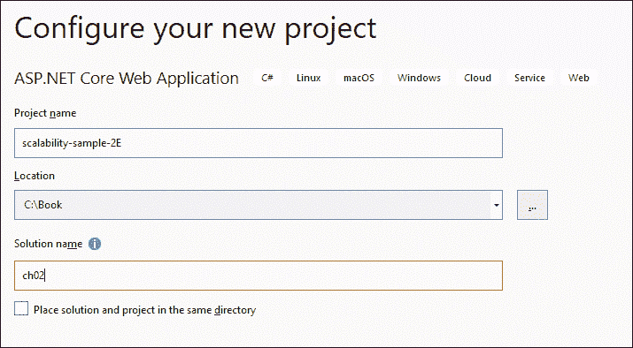

# 第二章：2

# 非功能性需求

一旦您收集了系统需求，就是时候考虑它们对架构设计的影响了。可伸缩性、可用性、弹性、性能、多线程、互操作性、安全性和其他主题需要进行分析，以便我们能够满足用户需求。我们将这些方面称为非功能性需求。

本章将涵盖以下主题：

+   .NET 5 和 Azure 如何实现可伸缩性、可用性和弹性？

+   在使用 C#编程时需要考虑的性能问题

+   软件的可用性，也就是如何设计有效的用户界面

+   .NET 5 和互操作性

+   通过设计实现安全性

+   书籍用例-了解.NET Core 项目的主要类型

# 技术要求

本章提供的示例将需要安装有.NET 5 SDK 的 Visual Studio 2019 社区版。

您可以在[`github.com/PacktPublishing/Software-Architecture-with-C-9-and-.NET-5`](https://github.com/PacktPublishing/Software-Architecture-with-C-9-and-.NET-5)找到本章的示例代码。

# 使用 Azure 和.NET 5 实现可伸缩性、可用性和弹性

对可伸缩性的简短搜索返回了这样的定义，即*系统在需求增加时保持良好运行的能力*。一旦开发人员读到这一点，他们中的许多人错误地得出结论*可伸缩性只意味着添加更多硬件以使应用程序在不停止的情况下继续工作*。

可伸缩性依赖于涉及硬件解决方案的技术。然而，作为软件架构师，您必须意识到良好的软件将保持可伸缩性在可持续模型中，这意味着良好架构的软件可以节省大量资金。因此，这不仅仅是硬件的问题，也是整体软件设计的问题。这里的重点是系统的运行成本也应该是架构决策的一个因素。

在*第一章* *理解软件架构的重要性*中，我们在讨论软件性能时提出了一些克服性能问题的好建议。相同的建议也将帮助您实现可伸缩性。我们在每个过程上花费的资源越少，应用程序就能处理更多用户。

尽管可伸缩性很重要，但云计算应用程序必须设计为能够处理系统故障。每当您确保应用程序从故障中恢复而不向最终用户暴露这种故障时，您就在创建一个弹性应用程序。

您可以在[`docs.microsoft.com/en-us/azure/architecture/patterns/category/resiliency`](https://docs.microsoft.com/en-us/azure/architecture/patterns/category/resiliency)找到云架构弹性模式。

在云场景中，弹性尤为重要的原因是因为提供给您的基础设施可能需要一小段时间来管理更新、重置，甚至硬件升级。您还更有可能与多个系统一起工作，并且在与它们通信时可能会发生瞬态错误。这就是为什么这种非功能性需求在最近几年开始传播。

当您能够在系统中实现高可用性时，具有可伸缩性和弹性解决方案的可能性变得更加令人兴奋。本书中提出的所有方法都将指导您设计具有良好可用性的解决方案，但在某些情况下，您需要设计特定的替代方案来实现您的目标。

您可以在[`docs.microsoft.com/en-us/azure/architecture/patterns/category/availability`](https://docs.microsoft.com/en-us/azure/architecture/patterns/category/availability)找到云架构可用性模式。

值得知道的是，Azure 和.NET 5 Web 应用程序可以配置以实现这些非功能性需求。让我们在以下小节中进行检查。

## 在 Azure 中创建可伸缩的 Web 应用程序

在 Azure 中创建一个可扩展的 Web 应用程序非常简单。您必须这样做的原因是能够在不同季节维护不同数量的用户。用户越多，您就需要更多的硬件。让我们向您展示如何在 Azure 中创建一个可扩展的 Web 应用程序。

一旦您登录到 Azure 帐户，您就可以创建新资源（Web 应用程序、数据库、虚拟机等），如下屏幕截图所示：


图 2.1：Microsoft Azure - 创建资源

之后，您可以在**热门选项**中选择**Web 应用程序**，或者在**搜索市场**文本框中输入它。此操作将带您到以下屏幕：


图 2.2：Microsoft Azure - 创建 Web 应用

所需的**项目详细信息**如下：

+   **订阅**：这是将为所有应用程序成本收费的帐户。

+   **资源组**：这是您可以定义的资源集合，用于组织策略和权限。您可以指定新的资源组名称，或者将 Web 应用程序添加到在定义其他资源时指定的组中。

此外，**实例详细信息**如下：

+   **名称**：如您所见，Web 应用程序名称是在创建后您的解决方案将采用的 URL。将检查名称以确保其可用。

+   **发布**：此参数指示 Web 应用程序是否将直接交付，或者是否将使用 Docker 技术来发布内容。 Docker 将在*第五章*“将微服务架构应用于企业应用程序”中进行更详细的讨论。如果选择 Docker 容器发布，您将能够配置**图像源**，**访问类型**和**图像**以及标记信息，以便将其部署到 Web 应用程序。

+   **运行时堆栈**：显然，此选项仅在您决定直接交付代码时才可用。在撰写本章时，您可以为.NET Core、ASP.NET、Java 11、Java 8、Node、PHP、Python 和 Ruby 定义堆栈。

+   **操作系统**：这是用于托管 Web 应用程序的操作系统的选项。 Windows 和 Linux 都可以用于 ASP.NET Core 项目。

+   **区域**：您可以考虑要部署应用程序的位置，考虑到 Azure 在世界各地有许多不同的数据中心。

+   **应用服务计划**：这是您定义用于处理 Web 应用程序和服务器区域的硬件计划的地方。此选择定义应用程序的可扩展性、性能和成本。

+   **监控**：这是一个用于监控和故障排除 Web 应用程序的有用的 Azure 工具集。在本节中，您将能够启用应用程序洞察。建议您始终为解决方案的不同组件保持相同的区域，因为这将节省从一个数据中心到另一个数据中心的流量交换成本。

创建 Web 应用程序后，可以以两种概念上不同的方式扩展此应用程序：垂直**（向上扩展）**和水平**（向外扩展）**。如您在以下屏幕截图中所见，这两种方式都可以在 Web 应用程序设置中找到：


图 2.3：Web 应用程序的扩展选项

让我们来看看两种扩展类型。

### 垂直扩展（向上扩展）

扩展意味着更改将托管您的应用程序的硬件规格。在 Azure 中，您有机会从免费共享硬件开始，并在几次点击后转移到独立的机器。以下屏幕截图显示了扩展 Web 应用程序的用户界面：


图 2.4：垂直扩展选项

通过选择提供的选项之一，您可以选择更强大的硬件（具有更多 CPU、存储和 RAM 的机器）。监视您的应用程序及其应用服务计划将指导您决定运行您正在验证的解决方案的最佳基础设施。它还将提供关键见解，例如可能的 CPU、内存和 I/O 瓶颈。

### 水平扩展（扩展）

扩展意味着将所有请求分配给更多具有相同容量的服务器，而不是使用更强大的机器。所有服务器的负载都会被 Azure 基础架构自动平衡。当整体负载可能在未来发生相当大的变化时，建议使用这种解决方案，因为水平扩展可以自动适应当前负载。下面的屏幕截图显示了由两个简单规则定义的自动**扩展**策略，该策略由 CPU 使用率触发：


图 2.5：水平扩展示例

值得强调的是，您可以选择具有硬编码实例计数或实现自动缩放规则。

所有可用自动缩放规则的完整描述超出了本书的目的。但是，它们相当容易理解，*进一步阅读*部分包含了完整文档的链接。

*扩展*功能仅适用于付费服务计划。

总的来说，水平扩展是一种确保应用程序即使在大量同时访问的情况下也可用的方法。当然，它的使用并不是保持系统可用性的唯一方法，但它肯定会有所帮助。

## 使用.NET 5 创建可扩展的 Web 应用程序

在所有可用的实现 Web 应用程序的框架中，使用 ASP.NET Core 5 运行可以确保良好的性能，同时具有较低的生产和维护成本。C#作为一种强类型和先进的通用语言，与框架中实现的持续性能改进相结合，使得这个选择在近年来成为企业开发中最佳选择之一。

接下来的步骤将指导您创建基于 ASP.NET Core Runtime 5 的 Web 应用程序。所有步骤都非常简单，但一些细节需要注意。

值得一提的是，.NET 5 为开发提供了在任何平台上进行开发的机会-桌面（WPF，Windows Forms 和 UWP），Web（ASP.NET），云（Azure），移动（Xamarin），游戏（Unity），物联网（ARM32 和 ARM64）和人工智能（ML.NET 和.NET for Apache Spark）。因此，从现在开始的建议是只使用.NET 5。在这种情况下，您可以在 Windows 和更便宜的 Linux 服务器上运行 Web 应用程序。

如今，微软建议使用经典的.NET，以防您需要的功能在.NET Core 中不可用，或者当您在不支持.NET Core 的环境中部署 Web 应用程序时。在其他情况下，您应该优先选择.NET Core 框架，因为它允许您执行以下操作：

+   在 Windows、Linux、macOS 或 Docker 容器中运行您的 Web 应用程序

+   设计您的解决方案与微服务

+   拥有高性能和可伸缩的系统

容器和微服务将在*第五章* *将微服务架构应用于企业应用程序*中进行介绍。在那里，您将更好地了解这些技术的优势。目前，可以说.NET 5 和微服务是为性能和可伸缩性而设计的，这就是为什么您应该在所有新项目中优先选择.NET 5 的原因。

以下步骤将向您展示如何在 Visual Studio 2019 中使用.NET 5 创建 ASP.NET Core Web 应用程序：

+   当您启动 VS 2019 时，您将能够点击**创建新项目**。

+   一旦您选择**ASP.NET Core Web 应用程序**，您将被引导到一个屏幕，在那里您将被要求设置**项目名称**、**位置**和**解决方案名称**：

图 2.6：创建 ASP.NET Core Web 应用程序

+   之后，您将能够选择要使用的 .NET 版本。选择**ASP.NET Core 5.0**以获得最先进和全新的平台。对于此演示，您可以选择**Web 应用程序**模板。

+   现在我们已经添加了基本细节，您可以将您的 Web 应用项目连接到您的 Azure 帐户并将其发布。

+   如果您右键单击您创建的项目，在**解决方案资源管理器**中，您将有**发布**选项：

图 2.7：发布 ASP.NET Core Web 应用程序

+   您将找到不同的目标来发布您的 Web 应用。选择**Azure**作为目标。

+   然后，您将能够决定要发布的**具体目标**。为此演示选择**Azure App Service (Windows)**。

+   此时可能需要定义您的 Microsoft 帐户凭据。这是因为 Visual Studio 与 Azure 之间有完全集成。这使您有机会在开发环境中查看您在 Azure 门户中创建的所有资源！[](img/B16756_02_08.png)

图 2.8：Visual Studio 与 Azure 的集成

+   一旦您决定了您的**发布**设置，也就是发布配置文件，当您点击**发布**时，Web 应用将会自动发布。请注意在这里选择 F1 定价层，以便此过程不会产生任何费用：

图 2.9：发布配置文件选项

+   您目前有两种部署模式。第一种是 Framework-dependent，将需要配置目标框架的 Web 应用。第二种是 self-contained，将不再需要此功能，因为框架的二进制文件将与应用程序一起发布。

+   值得一提的是，为了以 Framework-dependent 模式发布 ASP.NET 预览版本，您必须在 Azure 门户中的 Web 应用设置面板中添加一个扩展，如下截图所示。但是，在预览版本下，考虑使用自包含模式！[](img/B16756_02_10.png)

图 2.10：在 Azure Web 应用服务中添加扩展

有关将 ASP.NET Core 5.0 部署到 Azure App Service 的更多信息，请参阅以下链接：[`docs.microsoft.com/en-us/aspnet/core/host-and-deploy/azure-apps/?view=aspnetcore-5.0&tabs=visual-studio`](https://docs.microsoft.com/en-us/aspnet/core/host-and-deploy/azure-apps/?view=aspnetcore-5.0&tabs=vi)。

在这里，我们描述了部署 Web 应用的最简单方法。在*第二十章*，*理解 DevOps 原则*和*第二十一章*，*应用 CI 场景的挑战*中，我们将向您介绍 Azure DevOps **持续集成/持续交付**（**CI/CD**）管道。这个管道是一个进一步的 Azure 工具集，它自动化了将应用程序投入生产所需的所有步骤，即构建、测试、部署到暂存区和部署到生产环境。

# 在 C# 编程中需要考虑的性能问题

如今，C# 是全球最常用的编程语言之一，因此关于 C# 编程的良好建议对于设计满足最常见非功能性需求的良好架构至关重要。

以下部分提到了一些简单但有效的提示-相关的代码示例可在本书的 GitHub 存储库中找到。

## 字符串连接

这是一个经典的例子！使用`+`字符串运算符天真地连接字符串可能会导致严重的性能问题，因为每次连接两个字符串时，它们的内容都会被复制到一个新的字符串中。

因此，如果我们连接，例如，平均长度为 100 的 10 个字符串，第一个操作的成本为 200，第二个操作的成本为*200+100=300*，第三个操作的成本为*300+100=400*，依此类推。很容易让你相信总体成本增长像*m***n*²，其中*n*是字符串的数量，*m*是它们的平均长度。*n*²对于小*n*（比如，*n* < 10）来说并不算太大，但当*n*达到 100-1,000 数量级时，它就变得相当大，当*n*达到 10,000-100,000 数量级时就变得不可接受。

让我们用一些测试代码来看看这个问题，比较天真的连接和使用`StringBuilder`类执行相同操作的代码（该代码可在本书的 GitHub 存储库中找到）：


图 2.11：连接测试代码结果

如果你创建一个类似`var sb =new System.Text.StringBuilder()`的`StringBuilder`类，然后用`sb.Append(currString)`将每个字符串添加到其中，那么字符串不会被复制；相反，它们的指针会排队在一个列表中。它们只在你调用`sb.ToString()`获取最终结果时被复制到最终字符串中。因此，基于`StringBuilder`的连接成本简单地增长为*m*n*。

当然，你可能永远不会找到一个像前面那个连接 100,000 个字符串的函数的软件片段。然而，你需要识别类似这些的代码片段，比如在同时处理多个请求的 Web 服务器中连接 20-100 个字符串可能会导致损害性能的瓶颈。

## 异常

永远记住，异常比正常代码流慢得多！因此，使用`try-catch`需要简洁和必要，否则，你将会创建大的性能问题。

以下两个示例比较了使用`try-catch`和`Int32.TryParse`来检查字符串是否可以转换为整数：

```cs
private static string ParseIntWithTryParse()
{
    string result = string.Empty; 
    if (int.TryParse(result, out var value))
        result = value.ToString();
    else
        result = "There is no int value";
    return $"Final result: {result}";
}
private static string ParseIntWithException()
{
    string result = string.Empty;
    try
    {
        result = Convert.ToInt32(result).ToString();
    }
    catch (Exception)
    {
        result = "There is no int value";
    }
    return $"Final result: {result}";
} 
```

第二个函数看起来并不危险，但比第一个函数慢上千倍：


图 2.12：异常测试代码结果

总之，异常必须用于处理打破正常控制流的异常情况，例如，操作必须因某些意外原因而中止，控制必须返回调用堆栈中的几个级别。

## 更好的多线程环境-做和不做

如果你想充分利用正在构建的系统提供的所有硬件，你必须使用多线程。这样，当一个线程在等待操作完成时，应用程序可以将 CPU 留给其他线程，而不是浪费 CPU 时间。

另一方面，无论微软如何努力帮助解决这个问题，并行代码都不像吃蛋糕那样简单：它容易出错，难以测试和调试。当你开始考虑使用线程时，作为软件架构师最重要的事情是*你的系统是否需要它们？*非功能性和一些功能性需求会为你解答这个问题。

一旦你确定需要一个多线程系统，你应该决定哪种技术更合适。这里有几个选项，如下：

+   **创建** `System.Threading.Thread`的实例：这是在 C#中创建线程的经典方式。整个线程生命周期将由你掌控。当你确定自己要做什么时，这是很好的，但你需要担心实现的每一个细节。结果代码很难构思和调试/测试/维护。因此，为了保持开发成本可接受，这种方法应该局限于一些基本的、性能关键的模块。

+   **使用** `System.Threading.Tasks.Parallel` **类进行编程**：自.NET Framework 4.0 以来，您可以使用并行类以更简单的方式启用线程。这很好，因为您不需要担心创建的线程的生命周期，但这将使您对每个线程中发生的事情控制更少。

+   **使用异步编程进行开发**：这无疑是开发多线程应用程序的最简单方式，因为编译器承担了大部分工作。根据您调用异步方法的方式，您可能会创建的`Task`与用于调用它的`Thread`并行运行，甚至可能会有这个`Thread`等待而不挂起，直到创建的任务结束。这样，异步代码模仿了经典同步代码的行为，同时保留了一般并行编程的大部分性能优势：

+   总体行为是确定性的，不取决于每个任务完成所花费的时间，因此不可重现的错误更难发生，生成的代码易于测试/调试/维护。将方法定义为异步任务与否是程序员留下的唯一选择；其他一切都由运行时自动处理。您唯一需要关注的是哪些方法应该具有异步行为。值得一提的是，将方法定义为`async`并不意味着它将在单独的线程上执行。您可以在[`docs.microsoft.com/en-us/dotnet/csharp/programming-guide/concepts/async/`](https://docs.microsoft.com/en-us/dotnet/csharp/programming-guide/concepts/async/)上找到有用的信息。

+   在本书的后面，我们将提供一些异步编程的简单示例。有关异步编程及其相关模式的更多信息，请查看 Microsoft 文档中的*基于任务的异步模式*([`docs.microsoft.com/en-us/dotnet/standard/asynchronous-programming-patterns/task-based-asynchronous-pattern-tap`](https://docs.microsoft.com/en-us/dotnet/standard/asynchronous-programming-patterns/task-based-asynch))。

无论您选择哪个选项，作为软件架构师，您都必须注意一些要点和禁忌。具体如下：

+   **使用并发集合**(`System.Collections.Concurrent`)：一旦启动多线程应用程序，您就必须使用这些集合。原因是您的程序可能会从不同的线程管理相同的列表、字典等。使用并发集合是开发线程安全程序的最方便选项。

+   **担心静态变量**：无法说静态变量在多线程开发中是被禁止的，但您应该注意它们。同样，多个线程处理相同的变量可能会引起很多麻烦。如果您使用`[ThreadStatic]`属性修饰静态变量，每个线程将看到该变量的不同副本，从而解决了多个线程竞争相同值的问题。然而，`ThreadStatic`变量不能用于额外的线程通信，因为一个线程写入的值不能被其他线程读取。在异步编程中，`AsyncLocal<T>`是执行类似操作的选项。

+   在多线程实现后测试系统性能：线程使您能够充分利用硬件，但在某些情况下，编写不良的线程可能会浪费 CPU 时间，什么也不做！类似的情况可能导致几乎 100%的 CPU 使用率和不可接受的系统减速。在某些情况下，可以通过在一些线程的主循环中添加简单的`Thread.Sleep(1)`调用来减轻或解决问题，以防止它们浪费太多 CPU 时间，但您需要测试这一点。这种实现的一个用例是在其后台运行许多线程的 Windows 服务。

+   不要认为多线程很容易：多线程并不像在某些语法实现中看起来那么简单。在编写多线程应用程序时，你应该考虑诸如用户界面同步、线程终止和协调等问题。在许多情况下，由于多线程的糟糕实现，程序会停止正常工作。

+   不要忘记规划系统应该有多少线程：这对于 32 位程序尤其重要。在任何环境中，你可以拥有多少线程都有限制。在设计系统时，你应该考虑这一点。

+   不要忘记结束你的线程：如果你没有为每个线程正确的终止程序，你可能会在内存和处理泄漏方面遇到麻烦。

# 可用性-为什么插入数据需要太长时间

可扩展性、性能提示和多线程是我们可以用来调整机器性能的主要工具。然而，你设计的系统的有效性取决于整个处理流水线的整体性能，其中包括人和机器。

作为软件架构师，你无法提高人类的表现，但你可以通过设计一个有效的用户界面（UI）来提高人机交互的表现，这意味着以下内容：

+   UI 必须易于学习，以减少学习所需的时间和目标用户快速操作之前的时间浪费。如果 UI 更改频繁，并且需要吸引尽可能多的用户的公共网站，这一约束是基本的。

+   UI 不得在数据插入中引起任何类型的减速；数据输入速度必须仅受用户输入能力的限制，而不受系统延迟或可以避免的额外手势的限制。

值得一提的是，市场上有 UX 专家。作为软件架构师，你必须决定他们对项目成功至关重要的时候。以下是在设计易于学习的用户界面时的一些建议：

+   每个输入屏幕必须清楚地说明其目的。

+   使用用户的语言，而不是开发者的语言。

+   避免复杂化。设计 UI 时要考虑一般情况；更复杂的情况可以通过只在需要时出现的额外输入来处理。将复杂的屏幕分割成更多的输入步骤。

+   使用过去的输入来理解用户意图，并通过消息和自动 UI 更改将用户引导到正确的路径；例如，级联下拉菜单。

+   错误消息不是系统给用户的坏笔记，而是必须解释如何插入正确输入的消息。

快速的用户界面是通过对以下三个要求的有效解决方案实现的：

+   输入字段必须按照通常填写的顺序放置，并且应该可以使用 Tab 键或 Enter 键移动到下一个输入。此外，通常保持为空的字段应该放在表单的底部。简而言之，在填写表单时应尽量减少使用鼠标。这样，用户手势的数量就会被最小化。在 Web 应用程序中，一旦确定了输入字段的最佳放置位置，只需使用`tabindex`属性即可定义用户使用 Tab 键从一个输入字段移动到下一个输入字段的正确方式。

+   系统对用户输入的反应必须尽可能快。错误消息（或信息消息）必须在用户离开输入字段后立即出现。实现这一点的最简单方法是将大部分帮助和输入验证逻辑移至客户端，以便系统反应不需要通过通信线路和服务器。

+   有效的选择逻辑。选择现有项目应尽可能简单；例如，在提供的数千种产品中选择一种产品必须能够通过几个手势轻松完成，而无需记住确切的产品名称或其条形码。下一小节分析了我们可以使用的技术，以减少复杂性以实现快速选择。

在*第十六章*，*Blazor WebAssembly*中，我们将讨论这项微软技术如何帮助我们解决使用 C#代码构建基于 Web 的应用程序的挑战。

## 设计快速选择逻辑

当所有可能的选择都在 1-50 的数量级时，通常的下拉菜单就足够了。例如，这个货币选择下拉菜单：


图 2.13：简单的下拉菜单

当数量级更高但不超过几千时，通常最好选择一个自动完成菜单，显示所有以用户输入字符开头的项目名称：


图 2.14：复杂的下拉菜单

类似的解决方案可以以较低的计算成本实现，因为所有主要数据库都可以高效地选择以给定子字符串开头的字符串。

当名称非常复杂时，当搜索用户输入的字符时，它们应该在每个项目字符串内进行扩展。这种操作无法在通常的数据库中高效执行，需要专门的数据结构。

最后，当我们在由几个单词组成的描述中进行搜索时，需要更复杂的搜索模式。例如，产品描述就是这种情况。如果所选的数据库支持全文搜索，系统可以高效地在所有描述中搜索用户输入的几个单词的出现。

然而，当描述由名称而不是常见单词组成时，用户可能很难记住目标描述中包含的几个确切名称。例如，多国公司名称就是如此。在这些情况下，我们需要找到最适合用户输入字符的算法。用户输入的字符串的子字符串必须在每个描述的不同位置进行搜索。通常情况下，类似的算法无法有效地在基于索引的数据库中实现，而是需要将所有描述加载到内存中，并对用户输入的字符串进行某种排名。

这个类别中最著名的算法可能是**Levenshtein**算法，大多数拼写检查器使用它来找到一个最适合用户错误输入的单词。该算法最小化了描述和用户输入的字符串之间的 Levenshtein 距离，即将一个字符串转换为另一个字符串所需的最小字符删除和添加次数。

Levenshtein 算法效果很好，但计算成本很高。在这里，我们提供了一个更快的算法，用于在描述中搜索字符出现次数。用户输入的字符不需要在描述中连续出现，但必须按相同顺序出现。有些字符可能会缺失。每个描述都会根据缺失的字符和用户输入的字符出现的距离给予惩罚。更具体地说，该算法对每个描述进行了两个数字的排名：

+   用户输入的字符在描述中出现的次数：描述中包含的字符越多，排名越高。

+   每个描述都被赋予一个惩罚，等于描述中用户输入字符之间的总距离。

以下屏幕截图显示了单词**Ireland**与用户输入的字符串**ilad**的排名：


图 2.15：Levenshtein 用法示例

出现次数为四（4），而字符出现之间的总距离为三（3）。

一旦所有描述都被评分，它们将根据出现次数进行排序。出现次数相同的描述将根据最低的惩罚进行排序。以下是实现前述算法的自动完成功能：


图 2.16：Levenshtein 算法用户界面体验

完整的类代码以及一个测试控制台项目都可以在本书的 GitHub 存储库中找到。

## 从大量项目中进行选择

在这里，“巨大”并不是指存储数据所需的空间量，而是指用户在记住每个项目的特性时所遇到的困难。当需要从 10,000-100,000 个项目中选择一个项目时，通过在描述中搜索字符出现的次数来寻找它是没有希望的。在这种情况下，用户必须通过一系列类别来选择正确的项目。

在这种情况下，需要进行多个用户手势才能进行单个选择。换句话说，每个选择都需要与多个输入字段进行交互。一旦确定无法使用单个输入字段进行选择，最简单的选择就是级联下拉菜单，即一系列下拉菜单，其选择列表取决于先前下拉菜单中选择的值。

例如，如果用户需要在世界任何地方选择一个城镇，我们可以使用第一个下拉菜单来选择国家，一旦选择了国家，我们可以使用这个选择来填充第二个下拉菜单，其中包含所选国家中的所有城镇。一个简单的例子如下：


图 2.17：级联下拉菜单示例

显然，每个下拉菜单在需要时都可以被自动完成所取代，因为它具有大量选项。

如果通过交叉几个不同的层次来做出正确的选择，级联下拉菜单也变得低效，我们需要一个筛选表单，如下所示：


图 2.18：筛选表单示例

现在，让我们了解与.NET Core 的互操作性。

# 与.NET Core 的互操作性的奇妙世界

.NET Core 为 Windows 开发人员带来了将其软件交付到各种平台的能力。作为软件架构师，您需要注意这一点。对于 C#爱好者来说，Linux 和 macOS 不再是问题 - 它比这好多了 - 它们是向新客户交付的绝佳机会。因此，我们需要确保性能和多平台支持，这是几个系统中常见的非功能性需求。

在 Windows 中使用.NET Core 设计的控制台应用程序和 Web 应用程序在 Linux 和 macOS 上几乎完全兼容。这意味着您不必重新构建应用程序以在这些平台上运行。此外，非常特定于平台的行为现在也具有多平台支持，例如，从.NET Core 3.0 开始，在 Linux 上就有`System.IO.Ports.SerialPort`类。

微软提供了脚本来帮助您在 Linux 和 macOS 上安装.NET Core。您可以在[`docs.microsoft.com/dotnet/core/tools/dotnet-install-script`](https://docs.microsoft.com/dotnet/core/tools/dotnet-install-script)找到它们。一旦安装了 SDK，您只需要像在 Windows 中一样调用**dotnet**。

但是，您必须注意一些在 Linux 和 macOS 系统上不完全兼容的功能。例如，在这些操作系统中不存在 Windows 注册表的等效项，您必须自己开发替代方案。如果需要，加密的 JSON 配置文件可能是一个不错的选择。

另一个重要的一点是 Linux 区分大小写，而 Windows 不区分大小写。请记住这一点，当您处理文件时。另一个重要的事情是 Linux 路径分隔符与 Windows 分隔符不同。您可以使用`Path.PathSeparator`字段和`Path`类的所有其他成员来确保您的代码是多平台的。

此外，您还可以通过使用.NET Core 提供的运行时检查来调整您的代码以适应底层操作系统，具体如下：

```cs
using System;
using System.Runtime.InteropServices;
namespace CheckOS
{
    class Program
    {
        static void Main()
        {
            if (RuntimeInformation.IsOSPlatform(OSPlatform.Windows))
                Console.WriteLine("Here you have Windows World!");
            else if(RuntimeInformation.IsOSPlatform(OSPlatform.Linux))
                Console.WriteLine("Here you have Linux World!");
            else if (RuntimeInformation.IsOSPlatform(OSPlatform.OSX))
                Console.WriteLine("Here you have macOS World!");
        }
    }
} 
```

## 在 Linux 中创建服务

以下脚本可用于在 Linux 中封装命令行.NET Core 应用程序。这项服务的理念是该服务类似于 Windows 服务。考虑到大多数 Linux 安装只能通过命令行运行且无需用户登录，这可能非常有用：

+   第一步是创建一个将运行命令行应用程序的文件。该应用程序的名称是`app.dll`，并且安装在`appfolder`中。该应用程序将每 5000 毫秒进行一次检查。此服务是在 CentOS 7 系统上创建的。使用 Linux 终端，您可以输入以下内容：

```cs
cat >sample.service<<EOF
[Unit]
Description=Your Linux Service
After=network.target
[Service]
ExecStart=/usr/bin/dotnet $(pwd)/appfolder/app.dll 5000
Restart=on-failure
[Install]
WantedBy=multi-user.target
EOF 
```

+   创建文件后，您必须将服务文件复制到系统位置。之后，您必须重新加载`system`并启用服务，以便在重新启动时重新启动：

```cs
sudo cp sample.service /lib/systemd/system
sudosystemctl daemon-reload 
sudosystemctl enable sample 
```

+   完成！现在，您可以使用以下命令启动、停止和检查服务。您在命令行应用程序中需要提供的整个输入如下：

```cs
# Start the service
sudosystemctl start sample
# View service status
sudosystemctl status sample
# Stop the service
sudosystemctl stop sample 
```

现在我们已经学习了一些概念，让我们学习如何在我们的用例中实现它们。

# 通过设计实现安全

正如我们在本书中所看到的，我们用于开发软件的机会和技术是令人难以置信的。如果您在接下来的章节中阅读有关云计算的所有信息，您将会发现机会不断增加，与此同时，维护所有这些计算环境的复杂性也在增加。

作为软件架构师，您必须理解这些机会伴随着许多责任。在过去的几年里，世界发生了很大变化。21 世纪的第二个十年需要大量的技术。应用程序、社交媒体、工业 4.0、大数据和人工智能不再是未来的目标，而主要是您将在日常工作中领导和处理的当前项目。

考虑到这种情况，安全必须有不同的方法。世界已经开始监管管理个人数据的公司。例如，GDPR - 《通用数据保护条例》 - 不仅在欧洲领土上是强制性的，因为它已经改变了软件开发的方式，不仅在欧洲，而且在全球范围内。有许多类似于 GDPR 的倡议必须列入我们的技术和法规范围，考虑到您设计的软件将受到它们的影响。

安全设计必须是您设计新应用程序时关注的一个领域。这个主题很庞大，在这本书中不可能完全涵盖，但作为软件架构师，您必须理解在您的团队中有信息安全领域的专家是确保遵守政策和实践以避免网络攻击并保持服务的机密性、隐私、完整性、真实性和可用性的必要性。

在保护 ASP.NET Core 应用程序方面，值得一提的是该框架具有许多功能来帮助我们。例如，它包括身份验证和授权模式。在 OWASP Cheat Sheet Series 中，您将能够阅读关于许多其他.NET 实践的信息。

开放网络应用安全项目®（OWASP）是一个致力于改善软件安全的非营利基金会。请查看其信息网站[`owasp.org/`](https://owasp.org/)。

ASP.NET 还提供了帮助我们遵守 GDPR 的功能。基本上，有 API 和模板来指导您实施政策声明和 cookie 使用同意。

## 实现安全架构的实践清单

以下与安全相关的实践清单当然并未涵盖整个主题。但是，这些实践肯定会帮助您作为软件架构师探索与此主题相关的一些解决方案。

### 认证

为您的 Web 应用程序定义身份验证方法。现在有许多身份验证选项可供选择，从 ASP.NET Core Identity 到外部提供者身份验证方法，例如 Facebook 或 Google。作为软件架构师，您必须考虑应用程序的目标受众是谁。如果选择这条路，考虑使用 Azure Active Directory 也是值得考虑的起点。

您可能会发现将身份验证与 Azure AD 相关联很有用，这是一个用于管理您所在公司的 Active Directory 的组件。在某些场景中，特别是内部使用，这种替代方案非常好。Azure 目前提供用于**B2B** - **企业对企业**或**B2C** - **企业对消费者**的 Active Directory。

根据您正在构建的解决方案的情景，您将需要实施**MFA** - **多因素身份验证**。这种模式的想法是在允许解决方案使用之前要求至少两种身份证明形式。值得一提的是，Azure AD 为您简化了这一点。

不要忘记您必须为您提供的 API 确定身份验证方法。 JSON Web Token 是一个非常好的模式，其使用完全跨平台。

您必须确定您将在 Web 应用程序中使用的授权模型。有四种模型选项：

1.  **简单**，您只需在类或方法中使用`[Authorize]`属性；

1.  **基于角色**，您可以为访问您正在开发的`Controller`声明`Roles`；

1.  **基于声明**，您可以定义在身份验证期间必须接收的值，以指示用户是否被授权；

1.  **基于策略**，其中有一个旨在定义`Controller`中的访问权限的策略。

您还可以将控制器或类中的方法定义为对任何用户���全可访问，方法是定义属性`[AllowAnonymous]`。确保这种实现不会在您设计的系统中造成任何漏洞。

您决定使用的模型将确切地定义每个用户在应用程序中能够做什么。

### 敏感数据

在设计时，作为软件架构师，您将不得不决定存储的数据的哪一部分是敏感的，并且需要受到保护。通过连接到 Azure，您的 Web 应用程序将能够在诸如 Azure 存储和 Azure Key Vault 之类的组件中存储受保护的数据。 Azure 存储将在*第九章*“如何在云中选择您的数据存储”中讨论。

值得一提的是，Azure Key Vault 用于保护您的应用可能具有的秘密。当您有这种要求时，请考虑使用这种解决方案。

### Web 安全

在没有启用 HTTPS 协议的情况下部署生产解决方案是完全不可接受的。 Azure Web 应用程序和 ASP.NET Core 解决方案有各种可能性，不仅可以使用，而且可以强制使用这种安全协议。

有许多已知的攻击和恶意模式，例如跨站点请求伪造，开放式重定向和跨站点脚本。 ASP.NET Core 保证并提供了解决它们的 API。您需要检测对您的解决方案有用的那些。

通过在查询中使用参数来避免 SQL 注入等良好的编程实践是另一个重要目标。

您可以在[`docs.microsoft.com/en-us/azure/architecture/patterns/category/security`](https://docs.microsoft.com/en-us/azure/architecture/patterns/category/security)找到云架构安全模式。

最后，值得一提的是，安全性需要使用洋葱方法来处理，这意味着需要实现许多层安全性。您必须有一个确定的策略来保证访问数据的过程，包括使用您正在开发的系统的人员的物理访问。此外，您还必须开发一个灾难恢复解决方案，以防系统遭受攻击。灾难恢复解决方案将取决于您的云解决方案。我们将在*第四章*，*决定最佳基于云的解决方案*中讨论这一点。

# 书籍用例 - 了解主要类型的.NET Core 项目

本书用例的开发将基于各种类型的.NET Core Visual Studio 项目。本节描述了它们。让我们在 Visual Studio 的**文件**菜单中选择**新项目**。

您可以通过在搜索引擎中输入来筛选**.NET Core**项目类型：


图 2.19：在 Visual Studio 中搜索.NET Core 项目类型

在那里，您将找到常见的 C#项目（控制台、类库、Windows Form、WPF），以及基于不同测试框架的各种类型的测试项目：xUnit、NUnit 和 MSTest。在各种测试框架中进行选择只是一种偏好，因为它们都提供了可比较的功能。向解决方案中的每个软件组件添加测试是一种常见做法，可以使软件经常修改而不危及其可靠性。

您还可以在**.NET Standard**下定义您的类库项目，这将在*第十三章*，*在 C# 9 中实现代码重用性*中讨论。这些类库基于标���，使它们与多个.NET 版本兼容。例如，基于 2.0 标准的库与所有大于或等于 2.0 的.NET Core 版本兼容，并与所有大于 4.6 的.NET Framework 版本兼容。这种兼容性优势是以功能较少为代价的。

除了将**项目类型**筛选为**云**，我们还有几种项目类型。其中一些将使我们能够定义微服务。基于微服务的架构允许将应用程序拆分为几个独立的微服务。可以创建并分布在多台机器上的同一微服务的多个实例，以微调每个应用程序部分的性能。微服务将在以下章节中描述：

+   *第五章*，*将微服务架构应用于企业应用程序*

+   *第六章*，*Azure Service Fabric*

+   *第七章*，*Azure Kubernetes Service*

最后，测试将在*第十八章*，*使用单元测试用例和 TDD 测试您的代码*和*第二十二章*，*功能测试的自动化*中详细讨论。最后，我们已经在*使用.NET 5 创建可扩展的 Web 应用程序*小节中描述了 ASP.NET Core 应用程序。在那里，我们定义了一个 ASP.NET Core 应用程序，但是 Visual Studio 还包含基于 RESTful API 和最重要的单页应用程序框架（如 Angular、React、Vue.js 和基于 WebAssembly 的 Blazor 框架）的项目模板，这将在*第十六章*，*Blazor WebAssembly*中讨论。其中一些可以在标准的 Visual Studio 安装中找到，而其他一些则需要安装 SPA 包。

# 总结

描述系统行为的功能要求必须与约束系统性能、可扩展性、可用性、弹性、互操作性、可用性和安全性的非功能性需求一起完成。

性能要求来自响应时间和系统负载要求。作为软件架构师，您应该确保以最低成本获得所需的性能，构建高效的算法，并充分利用多线程的可用硬件资源。

可伸缩性是系统适应增加负载的能力。系统可以通过提供更强大的硬件来进行垂直扩展，也可以通过复制和负载平衡相同的硬件来进行水平扩展，从而增加可用性。总的来说，云和 Azure 可以帮助我们实现动态策略，而无需停止应用程序。

像.NET Core 这样在多个平台上运行的工具可以确保互操作性，也就是您的软件能够在不同的目标机器上以及不同的操作系统（Windows、Linux、macOS、Android 等）上运行。

通过关注输入字段的顺序、项目选择逻辑的有效性以及系统的易学性来确保可用性。

此外，您的解决方案越复杂，它应该具有更好的弹性。弹性的理念不是保证解决方案不会失败，而是保证解决方案在软件的每个部分失败时都有一个定义好的操作。

作为软件架构师，您必须从设计的最开始考虑安全性。遵循确定正确模式的指南，并在您的团队中有一个安全专家，将是实现我们目前所有法规的一个很好的选择。

在下一章中，您将了解 Azure DevOps 工具如何帮助我们收集、定义和记录我们的需求。

# 问题

1.  有哪两种概念上的系统扩展方式？

1.  您能否从 Visual Studio 自动将您的 Web 应用程序部署到 Azure？

1.  多线程有什么用处？

1.  异步模式相对于其他多线程技术的主要优势是什么？

1.  为什么输入字段的顺序如此重要？

1.  .NET Core 的`Path`类为何对互操作性如此重要？

1.  .NET 标准类库相对于.NET Core 类库的优势是什么？

1.  列出各种类型的.NET Core Visual Studio 项目。

# 进一步阅读

以下是一些书籍和链接，您可以考虑阅读以收集更多与本章相关的信息：

+   [`www.packtpub.com/virtualization-and-cloud/hands-azure-developers`](https://www.packtpub.com/virtualization-and-cloud/hands-azure-developers)

+   [`docs.microsoft.com/en-us/azure/architecture/best-practices/auto-scaling`](https://docs.microsoft.com/en-us/azure/architecture/best-practices/auto-scaling)

+   [`docs.microsoft.com/en-us/aspnet/core/host-and-deploy/azure-apps/`](https://docs.microsoft.com/en-us/aspnet/core/host-and-deploy/azure-apps/)

+   [`docs.microsoft.com/en-us/dotnet/standard/parallel-processing-and-concurrency`](https://docs.microsoft.com/en-us/dotnet/standard/parallel-processing-and-concurrency)

+   [`docs.microsoft.com/en-us/dotnet/standard/parallel-programming/`](https://docs.microsoft.com/en-us/dotnet/standard/parallel-programming/)

+   [`devblogs.microsoft.com/dotnet/performance-improvements-in-net-5/`](https://devblogs.microsoft.com/dotnet/performance-improvements-in-net-5/)

+   [`docs.microsoft.com/en-us/dotnet/standard/security/`](https://docs.microsoft.com/en-us/dotnet/standard/security/)

+   [`docs.microsoft.com/en-us/aspnet/core/security/`](https://docs.microsoft.com/en-us/aspnet/core/security/)

+   [`owasp.org/`](https://owasp.org/)

+   [`cheatsheetseries.owasp.org/cheatsheets/DotNet_Security_Cheat_Sheet.html`](https://cheatsheetseries.owasp.org/cheatsheets/DotNet_Security_Cheat_Sheet.html)

+   [`docs.microsoft.com/en-us/aspnet/core/security/gdpr`](https://docs.microsoft.com/en-us/aspnet/core/security/gdpr)

+   [`docs.microsoft.com/en-us/azure/architecture/patterns/category/resiliency`](https://docs.microsoft.com/en-us/azure/architecture/patterns/category/resiliency)

+   [`docs.microsoft.com/en-us/azure/architecture/patterns/category/availability`](https://docs.microsoft.com/en-us/azure/architecture/patterns/category/availability)
