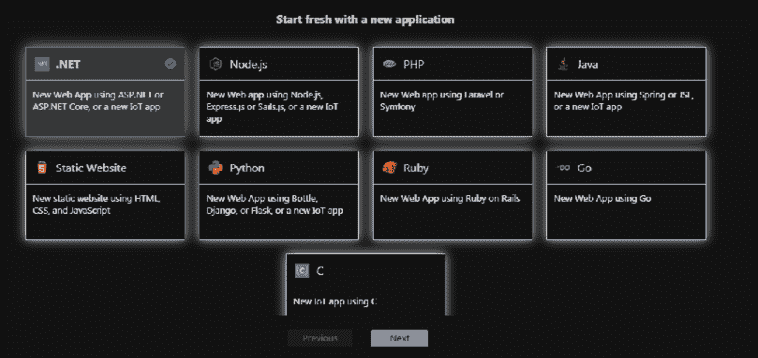
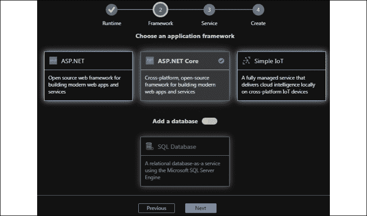
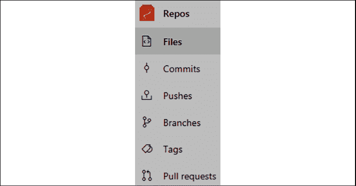
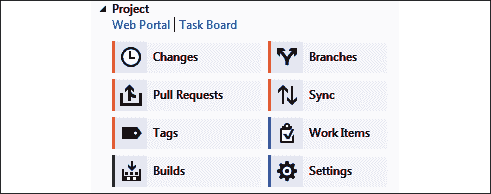
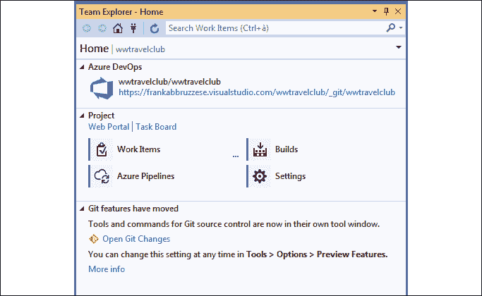
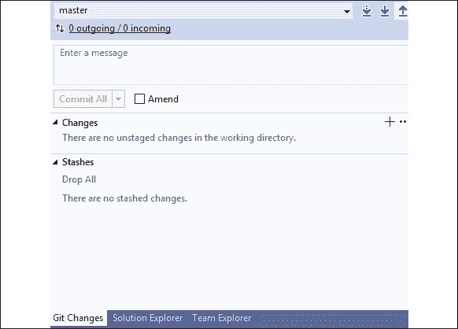
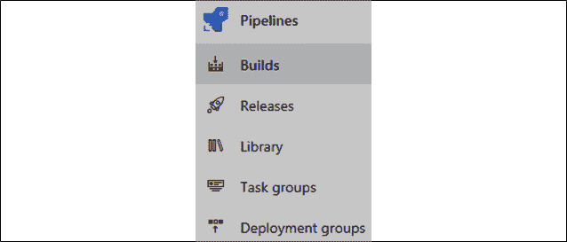
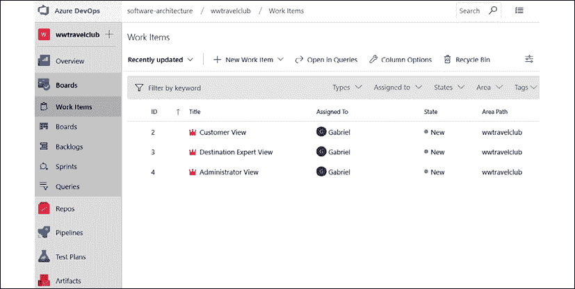

# 第三章：使用 Azure DevOps 记录需求

Azure DevOps 是 Visual Studio Team Services 的演进，它提供了各种新功能，可以帮助开发人员记录和组织他们的软件。本章的目的是介绍 Microsoft 提供的这个工具的概述。

本章将涵盖以下主题：

+   使用您的 Azure 帐户创建 Azure DevOps 项目

+   了解 Azure DevOps 提供的功能

+   使用 Azure DevOps 组织和管理需求

+   在 Azure DevOps 中提出用例

本章的前两节总结了 Azure DevOps 提供的所有功能，而其余部分专注于文档需求和支持整个开发过程的工具。在其他章节中，将更详细地分析在前两节中介绍的大部分功能。

# 技术要求

本章要求您创建一个新的免费 Azure 帐户或使用现有的帐户。*第一章*的*了解软件架构的重要性*部分解释了如何创建一个。*Azure DevOps 存储库*子部分还需要 Visual Studio 2019 社区版（免费）或更高版本。

# 介绍 Azure DevOps

Azure DevOps 是 Microsoft 的**软件即服务**（**SaaS**）平台，使您能够为客户持续提供价值。通过在那里创建一个帐户，您将能够轻松规划项目，安全存储代码，测试代码，将解决方案发布到暂存环境，然后将解决方案发布到实际的生产基础设施。

当然，Azure DevOps 是一个完整的框架，它提供了当前可用的软件开发生态系统。自动化软件生产中涉及的所有步骤确保不断改进和改善现有解决方案，以使其适应市场需求。

您可以在 Azure 门户中开始该过程。如果您不知道如何创建 Azure 门户帐户，请查看*第一章*的*了解软件架构的重要性*。创建 Azure DevOps 帐户的步骤非常简单：

1.  选择**创建资源**，然后选择**DevOps Starter**：

图 3.1：DevOps 起始页

1.  一旦开始创建项目的向导，您可以从几种不同的平台中选择如何交付您的系统。这是 Azure DevOps 的最大优势之一，因为您不仅限于 Microsoft 工具和产品，而是可以从市场上所有常见的平台、工具和产品中进行选择：

图 3.2：DevOps 技术选择

1.  可用的选项将取决于第一步选择的平台。在某些情况下，您可以从几种部署选项中进行选择，如下面的屏幕截图所示，如果您选择.NET 平台：

图 3.3：DevOps 技术选择，更多细节

图 3.4：DevOps 部署选项

1.  设置完成后，您将能够根据您提供的信息使用项目门户管理项目。值得一提的是，如果您没有 Azure DevOps 服务，此向导将创建一个。此外，还会自动创建所选的部署资源，例如，如果您选择**Windows Web App**，将创建一个 Web 应用程序，如果您选择**虚拟机**，将创建一个虚拟机。Azure DevOps 组织是您可以组织所有 Azure DevOps 项目的地方。整个过程不到 20 分钟：

图 3.5：Web 应用程序项目的 DevOps 详细信息

图 3.6：虚拟机项目的 DevOps 详细信息

1.  之后，您将能够开始规划您的项目。以下屏幕截图显示了 Azure DevOps 项目创建完成后出现的页面。在本书的其余部分，我们将多次回到这个页面，以介绍和描述各种有用的功能，以确保更快速和更有效的部署：

图 3.7：DevOps 项目页面

正如您从前面的屏幕截图中所看到的，创建 Azure DevOps 帐户并开始开发最佳的 DevOps 工具的过程非常简单。值得一提的是，只要您的团队中没有超过五名开发人员，加上任意数量的利益相关者，您就可以免费使用这个出色的工具。

值得一提的是，利益相关者的数量没有限制，因为他们可以使用的功能非常有限。基本上，他们对面板和工作项具有只读权限，并且几乎没有修改它们的可能性。具体来说，他们可以添加新的工作项和现有标签到工作项，并且可以提供反馈。关于构建和发布，他们只能批准发布（在撰写本书时，还有一些其他有限的功能处于预览状态）。

# 使用 Azure DevOps 组织您的工作

DevOps 将在*第二十章*中进行详细讨论，*理解 DevOps 原则*，但您需要将其理解为一种专注于为客户提供价值的哲学。它是人、流程和产品的结合，使用**持续集成和持续部署**（**CI/CD**）方法来对交付给生产环境的软件应用程序进行持续改进。Azure DevOps 是一个强大的工具，其应用范围涵盖了应用程序的初始开发和随后的 CI/CD 过程中涉及的所有步骤。

Azure DevOps 包含用于收集需求和组织整个开发过程的工具。它们可以通过单击 Azure DevOps 页面上的**面板**菜单来访问，并将在接下来的两个小节中进行更详细的描述：

图 3.8：面板菜单

Azure DevOps 中的所有其他功能在以下小节中进行了简要回顾。它们将在其他章节中进行详细讨论。具体来说，CI 和构建/测试管道在*第十八章*中讨论，*使用单元测试用例和 TDD 测试您的代码*，以及*第二十一章*，*应用 CI 场景的挑战*，而 DevOps 原则和发布管道在*第二十章*中讨论，*理解 DevOps 原则*。

## Azure DevOps 存储库

**存储库**菜单项让您访问默认的 Git 存储库，您可以在其中放置项目的代码：

图 3.9：存储库菜单

单击**文件**项目，您将进入默认存储库的初始页面。它是空的，并包含有关如何连接到此默认存储库的说明。

您可以通过页面顶部的下拉菜单添加更多的存储库：

图 3.10：添加新存储库

所有创建的存储库都可以通过同一个下拉菜单访问。

如前面的屏幕截图所示，每个存储库的初始页面包含存储库地址和一个按钮，用于生成特定于存储库的凭据，因此您可以使用您喜欢的 Git 工具连接到您的 DevOps 存储库。但是，您也可以从 Visual Studio 内部以非常简单的方式连接：

1.  启动 Visual Studio，并确保您已登录到与定义 DevOps 项目相同的 Microsoft 帐户（或用于将您添加为团队成员的帐户）。

1.  选择**团队资源管理器**选项卡，然后单击连接按钮：

图 3.11：添加新存储库

1.  单击 Azure DevOps 的**连接...**链接，您将被引导设置与您的 Azure DevOps 项目之一的连接。

一旦连接到您的 DevOps 远程存储库，您可以使用 Visual Studio Git 工具，并且还可以从 Visual Studio 内部与其他 DevOps 功能进行交互。在撰写本书时，交互的类型取决于 Visual Studio 选项中的**新 Git 用户体验**复选框设置：

图 3.12：新的 Git 用户体验复选框

如果未经检查，您将拥有“经典”的 Visual Studio 体验，其中您可以使用 Team Explorer 访问 Git 和其他 DevOps 功能：

1.  单击 Team Explorer 的**主页**按钮。现在，您将看到执行 Git 操作和与其他 Azure DevOps 区域进行交互的命令：

图 3.13：Team Explorer 选项

1.  如果您被指定为初始化 DevOps 存储库的人，请创建一个起始解决方案，并通过单击**更改**按钮并按照随后的说明提交您的代码。

1.  单击**同步**按钮，将本地存储库与远程 Azure DevOps 存储库同步。

1.  一旦所有团队成员都使用上述步骤初始化了他们的本地机器存储库和 Azure DevOps 存储库，现在可以打开 Visual Studio。在**Team Explorer**窗口的底部区域中将显示在本地存储库中创建的解决方案。

1.  单击窗口以在本地计算机上打开解决方案。然后，与远程存储库同步，以确保您正在修改的代码是最新的。

相反，如果**新 Git 用户体验**复选框被选中，则**Team Explorer**窗口只有用于非 Git DevOps 操作的命令，以及用于打开专门用于 Git 操作的新窗口的**打开 Git 更改**链接：

图 3.14：新 Team Explorer 窗口

一旦进入此窗口，您将被要求克隆或创建一个新的存储库。在两种情况下，您将被提示提供远程 DevOps 存储库的地址。一旦您创建了连接到远程 DevOps 存储库的本地存储库，您可以开始使用新的 Git 窗口，该窗口提供的选项比经典的 Team Explorer 窗口提供的选项更多，总体上提供了更完整的用户体验：

图 3.15：Git 更改窗口

当您有要提交的更改时，您可以在窗口顶部的文本框中插入消息，并通过单击**提交所有**按钮在本地提交，或者您可以单击此按钮旁边的下拉菜单以访问更多选项：

图 3.16：提交选项

您可以提交和推送，或者提交和同步，但也可以暂存您的更改。Git 更改窗口右上角的三个箭头分别触发获取、拉取和推送。与此同时，窗口顶部的下拉菜单负责分支操作：

图 3.17：分支操作

## 软件包源

**Artifacts**菜单处理项目使用或创建的软件包。在那里，您可以为基本上所有类型的软件包定义 feeds，包括 NuGet、Node.js 和 Python。由于商业项目也使用私有软件包，因此需要私有 feeds，因此您需要一个放置它们的地方。此外，构建过程中生成的软件包也放置在这些 feeds 中，因此具有这些软件包作为依赖项的其他模块可以立即使用它们。

一旦进入**Artifacts**区域，您可以通过单击**+创建 Feed**按钮创建多个 feeds，每个 feed 可以处理多种类型的软件包，如*图 3.18*所示：

图 3.18：Feed 创建

如果选择连接到公共来源的软件包选项，默认情况下，feed 会连接到`npmjs`、`nuget.org`和`pypi.org`。但是，您可以转到**Feed**设置页面中的上游来源选项卡，删除/添加软件包来源。通过单击 feed 页面右上角的设置图标可以进入设置页面。以下是新创建的 feed 页面的截图：

图 3.19：Feed 页面

每个 feed 的**连接到 feed**按钮显示一个窗口，解释了如何连接到 feed 的每种软件包类型。特别是对于 NuGet 软件包，您应该将所有项目 feed 添加到您的 Visual Studio 项目/解决方案的`nuget.config`文件中，以便本地机器也可以使用它们，否则，您的本地构建将失败：

图 3.20：Feed 连接信息

## 测试计划

**测试计划**部分允许您定义要使用的测试计划及其设置。测试在*第十八章*“使用单元测试用例和 TDD 测试代码”和*第二十二章*“功能测试自动化”中有详细讨论，但在这里，我们想总结一下 Azure DevOps 提供的机会。测试相关的操作和设置可以通过**测试计划**菜单项访问：

图 3.21：Feed 测试计划菜单

在这里，您可以定义、执行和跟踪由以下内容组成的测试计划：

+   手动验收测试

+   自动单元测试

+   负载测试

自动单元测试必须在 Visual Studio 解决方案中包含的测试项目中定义，并基于诸如 NUnit、xUnit 和 MSTest 之类的框架（Visual Studio 为所有这些都有项目模板）。测试计划让您有机会在 Azure 上执行这些测试，并定义以下内容：

+   一些配置设置

+   何时执行它们

+   如何跟踪它们以及在整个项目文档中报告它们的结果

对于手动测试，您可以在项目文档中为操作员定义完整的指令，涵盖执行它们的环境（例如操作系统）以及报告结果的位置。您还可以定义如何执行负载测试以及如何测量结果。

## 管道

管道是自动操作计划，指定从代码构建到软件部署到生产环境的所有步骤。它们可以在**管道**区域中定义，通过**管道**菜单项访问：

图 3.22：管道菜单

在那里，您可以定义一系列任务的完整管道，以及它们的触发事件，其中包括代码构建、启动测试计划以及测试通过后的操作。

通常，在测试通过后，应用程序会自动部署到一个暂存区，在那里可以进行 Beta 测试。您还可以定义自动部署到生产环境的标准。这些标准包括但不限于以下内容：

+   应用程序进行 Beta 测试的天数

+   在 Beta 测试期间发现的错误数量和/或最后一次代码更改删除的错误数量

+   一个或多个经理/团队成员的手动批准

决策标准将取决于公司希望管理正在开发的产品的方式。作为软件架构师，您必须了解，当涉及将代码移至生产环境时，越安全越好。

# 在 Azure DevOps 中管理系统需求

Azure DevOps 使您能够使用工作项记录系统需求。工作项存储在项目中，可以分配给某人。它们被分类为各种类型，可能包含所需的开发工作量、状态和它们所属的开发阶段（迭代）的度量。

DevOps 通常与敏捷方法相结合，因此 Azure DevOps 使用迭代，并且整个开发过程组织为一组冲刺。可用的工作项取决于您在创建 Azure DevOps 项目时选择的*工作项流程*。以下各小节包含在选择**敏捷**或**Scrum** *工作项流程*时出现的最常见工作项类型的描述（默认为**敏捷**）。

## 史诗级工作项

想象一下，您正在开发由各种子系统组成的系统。您可能不会在单个迭代中完成整个系统。因此，我们需要一个跨越多个迭代的大伞来包含每个子系统的所有特性。每个史诗级工作项代表这些大伞中的一个，可以包含在各种开发迭代中实现的多个特性。

在史诗级工作项中，您可以定义状态和验收标准，以及开始日期和目标日期。此外，您还可以提供优先级和工作量估计。所有这些详细信息都有助于利益相关者跟踪开发过程。这对于项目的宏观视图非常有用。

## 特性工作项

您在史诗级工作项中提供的所有信息也可以放在特性工作项中。因此，这两种类型的工作项之间的区别不是与它们包含的信息类型有关，而是与它们的角色和您的团队将达到的目标有关。史诗可能跨越多个迭代，并且在特性之上具有层次结构，也就是说，每个史诗级工作项与多个子特性相关联，而每个特性工作项通常在几个迭代中实现，并且是单个史诗级工作项的一部分。

值得一提的是，所有工作项都有团队讨论的部分。在那里，您可以通过输入`@`字符（就像在许多论坛/社交媒体应用程序中一样）找到讨论区域的团队成员。在每个工作项内，您可以链接和附加各种信息。您还可以在特定部分检查当前工作项的历史记录。

特性工作项是记录用户需求的起点。例如，您可以编写一个名为**访问控制**的特性工作项，以定义实现系统访问控制所需的完整功能。

## 产品积压项/用户故事工作项

这些工作项中的哪些是可用的取决于所选的*工作项流程*。它们之间存在细微差异，但它们的目的基本相同。它们包含了与它们连接的特性工作项描述的功能的详细要求。更具体地说，每个产品积压/用户故事工作项都指定了作为其父特性工作项描述的行为的一部分的单个功能的要求。例如，在用于系统访问控制的特性工作项中，用户的维护和登录界面应该是两个不同的用户故事/产品积压项。这些要求将指导其他子工作项的创建：

+   **任务**：这些是描述需要完成的工作的重要工作项，以满足父产品积压项/用户故事工作项中规定的要求。任务工作项可以包含有助于团队容量管理和整体安排的时间估计。

+   **测试用例**：这些项目描述了如何测试由需求描述的功能。

您将为每个产品积压项/用户故事工作项创建的任务和测试用例的数量将根据您使用的开发和测试场景而变化。

# 用例 - 在 Azure DevOps 中呈现用例

本节通过 WWTravelClub 的实际示例澄清了前一节中概念。考虑到*第一章*中描述的场景，*理解软件架构的重要性*，我们决定定义三个史诗级工作项，如下所示：

图 3.23：用户案例史诗

创建这些工作项非常简单：

1.  在每个工作项内部，我们链接不同类型的工作项，就像您在*图 3.24*中看到的那样。

1.  了解工作项之间的连接在软件开发过程中非常重要。因此，作为软件架构师，您必须向团队提供这些知识，而且更重要的是，您必须激励他们建立这些连接！

图 3.24：定义链接

1.  一旦您创建了一个特性工作项，您将能够将其连接到几个详细说明其规格的产品积压工作项。以下截图显示了产品积压工作项的详细信息！

图 3.25：产品积压工作项

1.  之后，可以为每个产品积压工作项创建任务和测试用例工作项。Azure DevOps 提供的用户界面非常有效，因为它使您能够跟踪功能链和它们之间的关系！

图 3.26：看板视图

1.  一旦您完成了产品积压和任务工作项的输入，您将能够与团队一起规划项目冲刺。计划视图使您能够将产品积压工作项拖放到每个计划的冲刺中！

图 3.27：积压视图

通过在右侧点击特定的冲刺，您将只看到分配给该冲刺的工作项。每个冲刺页面与积压页面非常相似，但包含更多选项卡：

图 3.28：用户案例史诗

左侧的冲刺菜单也非常有用，它使每个用户能够立即跳转到他们参与的所有项目的当前冲刺。

这就是这些工作项是如何创建的。一旦您了解了这个机制，您就能够创建和规划任何软件项目。值得一提的是，工具本身不会解决与团队管理相关的问题。然而，该工具是激励团队更新项目状态的一个很好的方式，这样您就可以保持对项目进展的清晰视角。

# 总结

本章介绍了如何为软件开发项目创建 Azure DevOps 帐户，以及如何开始使用 Azure DevOps 管理您的项目。它还简要回顾了所有 Azure DevOps 功能，并解释了如何通过 Azure DevOps 主菜单访问它们。本章更详细地描述了如何管理系统需求，以及如何使用各种工作项规划和组织可以提供史诗解决方案和许多特性的冲刺。

下一章将讨论软件架构的不同模型。我们还将了解在开发解决方案基础架构时，如何从 Azure 等复杂云平台提供的选项中选择基本提示和标准。

# 问题

1.  Azure DevOps 仅适用于.NET 项目吗？

1.  Azure DevOps 中有哪些测试计划可用？

1.  DevOps 项目可以使用私有 NuGet 包吗？

1.  我们为什么使用工作项？

1.  史诗和特性工作项之间有什么区别？

1.  任务和产品积压项/用户故事工作项之间存在什么样的关系？

# 进一步阅读

以下是一些您可能考虑阅读的书籍和链接，以获取有关本章的更多信息：

+   [`go.microsoft.com/fwlink/?LinkID=825688`](https://go.microsoft.com/fwlink/?LinkID=825688)

+   [`www.packtpub.com/virtualization-and-cloud/hands-devops-azure-video`](https://www.packtpub.com/virtualization-and-cloud/hands-devops-azure-video)

+   [`www.packtpub.com/application-development/mastering-non-functional-requirements`](https://www.packtpub.com/application-development/mastering-non-functional-requirements)
