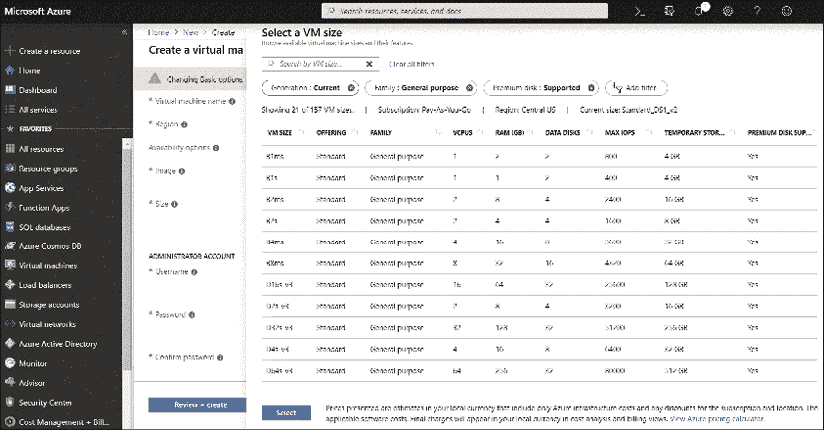
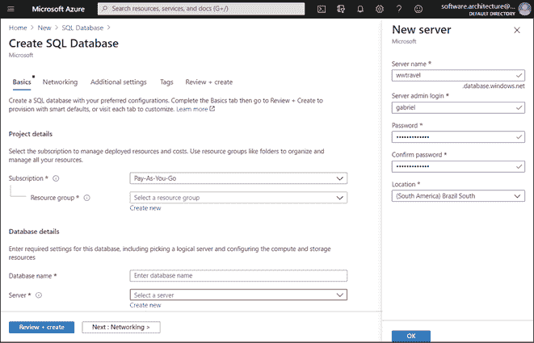
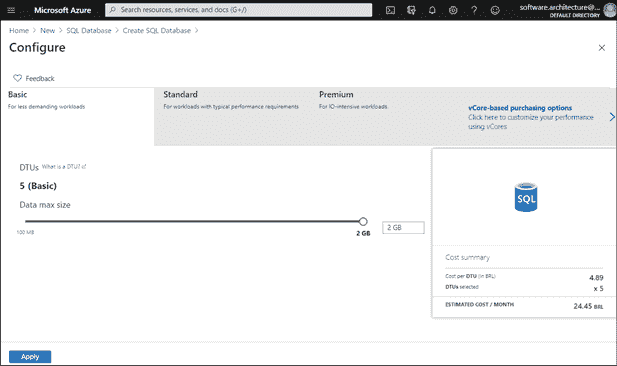
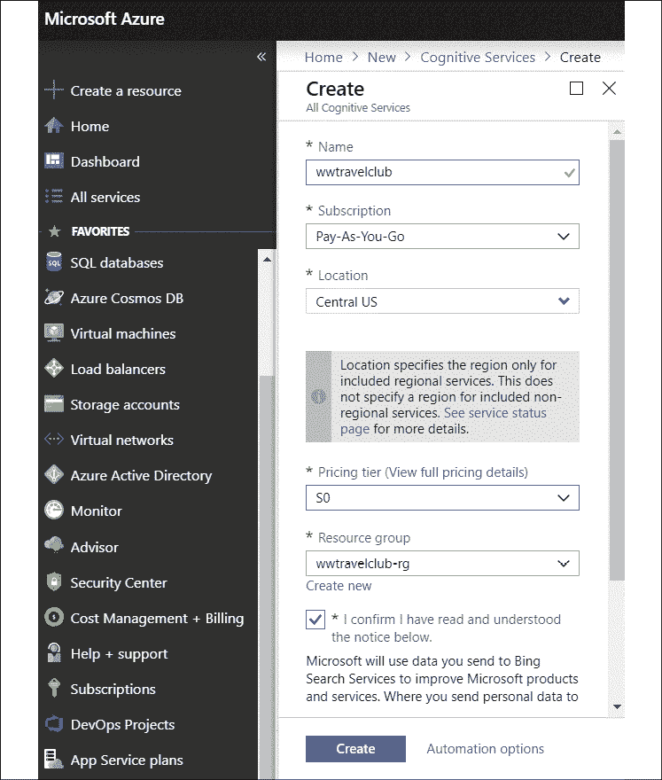

# 第四章：选择最佳的基于云的解决方案

在设计应用程序使其基于云时，你必须了解不同的架构设计，从最简单到最复杂。本章讨论了不同的软件架构模型，并教会你如何利用云所提供的机会来解决问题。本章还将讨论我们在开发基础设施时可以考虑的不同类型的云服务，理想的场景是什么，以及我们可以在哪些地方使用它们。

本章将涵盖以下主题：

+   基础设施即服务解决方案

+   平台即服务解决方案

+   软件即服务解决方案

+   无服务器解决方案

+   如何使用混合解决方案以及它们为何如此有用

值得一提的是，在这些选项之间的选择取决于项目场景的不同方面。这也将在本章中讨论。

# 技术要求

在本章的实际内容中，你必须创建或使用 Azure 账户。我们在*第一章*，*理解软件架构的重要性*，*创建 Azure 账户*部分中解释了账户创建过程。

# 不同的软件部署模型

云解决方案可以使用不同的模型进行部署。你决定如何部署你的应用程序取决于你所在团队的类型。在有基础设施工程师的公司，你可能会发现更多的人使用**基础设施即服务**（**IaaS**）。另一方面，在 IT 不是核心业务的公司，你会发现一堆**软件即服务**（**SaaS**）系统。对于开发人员来说，决定使用**平台即服务**（**PaaS**）选项或者无服务器选项是很常见的，因为在这种情况下他们不需要交付基础设施。

作为软件架构师，你必须应对这种环境，并确保你在解决方案的初始开发期间以及在维护期间都在优化成本和工作因素。此外，作为架构师，你必须了解你系统的需求，并努力将这些需求与一流的外围解决方案连接起来，以加快交付速度，并使解决方案尽可能接近客户的规格。

## IaaS 和 Azure 的机会

基础设施即服务是许多不同云服务提供商提供的云服务的第一代。它的定义在许多地方都很容易找到，但我们可以总结为“通过互联网提供的计算基础设施”。就像我们在本地数据中心中有服务的虚拟化一样，IaaS 也会为你提供云中的虚拟化组件，如服务器、存储和防火墙。

在 Azure 中，提供了几种基于 IaaS 模型的服务。其中大部分是收费的，在测试时需要注意这一点。值得一提的是，本书并不打算详细描述 Azure 提供的所有 IaaS 服务。然而，作为软件架构师，你只需要了解到你会找到以下这些服务：

+   **虚拟机**：Windows Server、Linux、Oracle、数据科学和机器学习

+   **网络**：虚拟网络、负载均衡器和 DNS 区域

+   **存储**：文件、表、数据库和 Redis

要在 Azure 中创建任何服务，你必须找到最适合你需求的服务，然后创建一个资源。下面的截图显示了正在配置 Windows Server 虚拟机。


图 4.1：在 Azure 中创建虚拟机

按照 Azure 提供的向导设置你的虚拟机，你将能够使用**远程桌面协议**（**RDP**）连接到它。下一张截图展示了你部署虚拟机的一些硬件选项。考虑到我们只需点击**选择**按钮就可以获得不同的容量，这是一个有趣的想法。



图 4.2：Azure 中可用的虚拟机大小

如果你将本地交付硬件的速度与云交付的速度进行比较，你会意识到在上市时间方面，没有比云更好的了。例如，截图底部呈现的**D64s_v3**机器，具有 64 个 CPU，256GB 的 RAM 和 512GB 的临时存储，这是你在本地数据中心可能找不到的。此外，在某些用例中，这台机器可能只在一个月中的某些小时内使用，因此在本地场景中无法证明其购买是合理的。这就是云计算如此令人惊叹的原因！

### IaaS 中的安全责任

安全责任是关于 IaaS 平台的另一个重要事项。许多人认为一旦你决定转向云端，所有安全问题都由提供商解决了。然而，这是不正确的，正如你在下面的截图中所看到的：


图 4.3：云计算中的安全管理

IaaS 将迫使你从操作系统到应用程序都要关注安全。在某些情况下，这是不可避免的，但你必须明白这将增加你的系统成本。

如果你只想将已经存在的本地结构转移到云端，IaaS 可能是一个不错的选择。这使得可伸缩性成为可能，因为 Azure 提供给你的工具以及所有其他服务。然而，如果你计划从头开始开发一个应用程序，你也应该考虑 Azure 上其他可用的选项。

让我们在下一节看看其中一个最快的系统，也就是 PaaS。

## PaaS-开发者的无限机会

如果你正在学习或已经学习了软件架构，你可能完全理解下一句的意思：当涉及软件开发时，世界要求高速！如果你同意这一点，你会喜欢 PaaS。

正如你在前面的截图中所看到的，PaaS 使你只需要担心与你的业务更密切相关的安全方面：你的数据和应用程序。对于开发人员来说，这意味着不必实施一堆使你的解决方案安全运行的配置。

安全处理并不是 PaaS 的唯一优势。作为软件架构师，你可以将这些服务作为提供更丰富解决方案的机会。上市时间肯定可以证明许多基于 PaaS 运行的应用程序的成本。

现在在 Azure 中有很多作为 PaaS 交付的服务，再次强调，本书的目的不是列举所有这些服务。然而，有些确实需要提到。列表不断增长，建议是：尽可能多地使用和测试这些服务！确保你会以此为考虑来提供更好设计的解决方案。

另一方面，值得一提的是，使用 PaaS 解决方案，你将无法完全控制操作系统。事实上，在许多情况下，你甚至无法连接到它。大多数情况下这是好事，但在某些调试情况下，你可能会错过这个功能。好消息是，PaaS 组件每天都在不断发展，微软最关注的问题之一就是使它们广泛可见。

以下部分介绍了微软为.NET Web 应用程序提供的最常见的 PaaS 组件，例如 Azure Web 应用程序和 Azure SQL Server。我们还描述了 Azure 认知服务，这是一个非常强大的 PaaS 平台，展示了 PaaS 世界中开发的美妙之处。我们将在本书的其余部分深入探讨其中一些。

### Web 应用程序

Web 应用程序是您可以用来部署 Web 应用程序的 PaaS 选项。您可以部署不同类型的应用程序，如.NET、.NET Core、Java、PHP、Node.js 和 Python。这在*第一章*，*理解软件架构的重要性*中有所介绍。

好处在于创建 Web 应用程序不需要任何结构和/或 IIS Web 服务器设置。在某些情况下，如果您使用 Linux 来托管您的.NET 应用程序，您根本不需要 IIS。

此外，Web 应用程序还有一个计划选项，您无需支付使用费。当然，也有一些限制，比如只能运行 32 位应用程序，无法实现可伸缩性，但这对于原型设计来说可能是一个很好的场景。

### SQL 数据库

想象一下，如果您拥有完整的 SQL 服务器的强大功能，而无需为部署此数据库而支付大型服务器的费用，您可以多快部署解决方案。这适用于 SQL 数据库。使用它们，您可以使用 Microsoft SQL Server 执行您最需要的功能-存储和数据处理。在这种情况下，Azure 负责备份数据库。

SQL 数据库甚至可以自行管理性能。这被称为自动调整。同样，使用 PaaS 组件，您将能够专注于对您的业务至关重要的事情：非常快速的上市时间。

创建 SQL 数据库的步骤非常简单，就像我们之前为其他组件所见的那样。但是，有两件事情需要注意：服务器本身的创建以及如何收费。

当您**创建资源**时，您可以搜索`SQL 数据库`，您将找到此向导来帮助您：



图 4.4：在 Azure 中创建 SQL 数据库

SQL 数据库依赖于 SQL 服务器来托管它。因此，正如您所看到的，您必须创建（至少对于第一个数据库）一个`database.windows.net`服务器，您的数据库将托管在那里。该服务器将提供您访问 SQL 服务器数据库所需的所有参数，如 Visual Studio、SQL Server 管理工作室和 Azure 数据工作室等当前工具。值得一提的是，您有许多关于安全性的功能，如透明数据加密和 IP 防火墙。

一旦您决定数据库服务器的名称，您将能够选择系统将收费的定价层。特别是在 SQL 数据库中，有几种不同的定价选项，如您在下面的截图中所见。您应该仔细研究每一个，因为根据您的情况，通过优化定价层，您可能会节省一些费用：



图 4.5：配置 Azure SQL 数据库定价层

有关 SQL 配置的更多信息，您可以使用此链接：[`azure.microsoft.com/en-us/services/sql-database/`](https://azure.microsoft.com/en-us/services/sql-database/)。

一旦您完成配置，您将能够以与在本地安装 SQL 服务器时相同的方式连接到此服务器数据库。您需要注意的唯一细节是 Azure SQL 服务器防火墙的配置，但这很容易设置，并且很好地展示了 PaaS 服务的安全性。

### Azure 认知服务

**人工智能**（**AI**）是软件架构中最经常讨论的话题之一。我们离一个真正伟大的世界只有一步之遥，那里人工智能将无处不在。为了实现这一目标，作为软件架构师，您不能一直把人工智能视为您需要一直从头开始重新发明的软件。

Azure 认知服务可以帮助您解决这个问题。在这组 API 中，您将找到各种开发视觉、知识、语音、搜索和语言解决方案的方法。其中一些需要进行训练才能实现，但这些服务也提供了相应的 API。

PaaS 的优点从这个场景中可以看出。在本地环境或 IaaS 环境中，您需要执行大量任务来准备应用程序。在 PaaS 中，您无需担心这个。您完全专注于作为软件架构师真正关心的问题：解决业务问题的解决方案。

在 Azure 帐户中设置 Azure 认知服务也非常简单。首先，您需要像添加其他 Azure 组件一样添加认知服务，如下图所示：



图 4.6：在 Azure 中创建认知服务 API

一旦完成这一步，您就可以使用服务器提供的 API。您将在创建的服务中找到两个重要的功能：端点和访问密钥。它们将在您的代码中用于访问 API。


图 4.7：创建的认知服务端点

以下代码示例展示了如何使用认知服务来翻译句子。这个翻译服务的主要概念是，您可以根据设置服务的密钥和区域，发布您想要翻译的句子。以下代码使您能够向服务 API 发送请求：

```cs
private static async Task<string> PostAPI(string api, string key, string region, string textToTranslate)
{
   using var client = new HttpClient();
   using var request = new HttpRequestMessage(HttpMethod.Post, api);
   request.Headers.Add("Ocp-Apim-Subscription-Key", key);
   request.Headers.Add("Ocp-Apim-Subscription-Region", region);
   client.Timeout = TimeSpan.FromSeconds(5);
   var body = new[] { new { Text = textToTranslate } };
   var requestBody = JsonConvert.SerializeObject(body);
   request.Content = new StringContent(requestBody, Encoding.UTF8, "application/json");
   var response = await client.SendAsync(request);
      response.EnsureSuccessStatusCode();
        return await response.Content.ReadAsStringAsync();
} 
```

值得一提的是，上述代码将允许您将任何文本翻译为任何语言，前提是您在参数中定义了它。以下是调用前面方法的主程序：

```cs
static async Task Main()
{
   var host = "https://api.cognitive.microsofttranslator.com";
   var route = "/translate?api-version=3.0&to=es";
   var subscriptionKey = "[YOUR KEY HERE]";
   var region = "[YOUR REGION HERE]";

   var translatedSentence = await PostAPI(host + route,
   subscriptionKey,region, "Hello World!");

   Console.WriteLine(translatedSentence);

} 
```

有关更多信息，请访问[`docs.microsoft.com/en-us/azure/cognitive-services/translator/reference/v3-0-languages`](https://docs.microsoft.com/en-us/azure/cognitive-services/translator/reference/v3-0-languages)。

这是一个完美的例子，展示了您可以多么轻松快速地使用此类服务来构建项目。此外，这种开发方法非常好，因为您使用的是已经经过其他解决方案测试和使用的代码片段。

## SaaS - 只需登录并开始使用！

SaaS 可能是使用基于云的服务最简单的方式。云服务提供商为其最终用户提供了许多解决公司常见问题的好选择。

Office 365 是这种类型服务的一个很好的例子。这些平台的关键点在于您无需担心应用程序的维护。这在您的团队完全专注于开发应用程序的核心业务的场景中特别方便。例如，如果您的解决方案需要提供良好的报告，也许您可以使用 Power BI 进行设计（Power BI 包含在 Office 365 中）。

另一个很好的 SaaS 平台例子是 Azure DevOps。作为软件架构师，在 Azure DevOps 之前，您需要安装和配置 Team Foundation Server（TFS）（甚至是更早的工具，如 Microsoft Visual SourceSafe），以便团队使用共享存储库和应用程序生命周期管理工具。

我们过去花了很多时间，要么是为 TFS 安装准备服务器，要么是升级和持续维护已安装的 TFS。由于 SaaS Azure DevOps 的简单性，这不再需要。

## 理解无服务器的含义

无服务器解决方案是一种不关注代码运行位置的解决方案。即使在“无服务器”解决方案中，仍然存在服务器。问题在于，您不知道或不关心代码在哪个服务器上执行。

您现在可能会认为无服务器只是另一种选择——当然，这是真的，因为这种架构并没有提供完整的解决方案。但这里的关键是，在无服务器解决方案中，您拥有一个非常快速、简单和灵活的应用程序生命周期，因为几乎所有无服务器代码都是无状态的，并且与系统的其余部分松散耦合。一些作者将此称为**函数即服务**（**FaaS**）。

当然，服务器总是运行在某个地方。这里的关键是您不需要担心这一点，甚至扩展性。这将使您完全专注于您的应用业务逻辑。再次强调，世界需要快速开发和良好的客户体验。您越专注于客户需求，就越好！

在*第十章*“使用 Azure 函数”中，您将探索微软在 Azure 中提供的最佳无服务器实现之一——Azure 函数。在那里，我们将重点介绍如何开发无服务器解决方案以及它们的优缺点。

# 为什么在许多情况下混合应用如此有用？

混合解决方案是指其部分不共享统一的架构选择的解决方案；每个部分都做出不同的架构选择。在云中，混合一词主要指混合云子系统与本地子系统的解决方案。然而，它也可以指混合网络子系统与特定设备子系统，如移动设备或任何运行代码的其他设备。

由于 Azure 可以提供的服务数量以及可以实现的设计架构数量，混合应用可能是本章主要讨论的主要问题的最佳答案，即如何在项目中利用云所提供的机会。如今，许多当前项目正在从本地解决方案转移到云架构，并且根据您将要交付这些项目的地方，您仍然会发现许多关于转移到云的错误先入之见。其中大部分与成本、安全性和服务可用性有关。

您需要了解这些先入之见中有一些真理，但人们的想法并非如此。当然，作为软件架构师，您不能忽视它们。特别是在开发关键系统时，您必须决定是否一切都可以在云上运行，还是最好将系统的一部分交付到边缘。

边缘计算范式是一种用于在更靠近所需位置的机器或设备上部署系统部分的方法。这有助于减少响应时间和带宽消耗。

移动解决方案可以被视为混合应用的经典示例，因为它们将基于 Web 的架构与基于设备的架构混合在一起，以提供更好的用户体验。有许多情况可以用响应式网站替换移动应用程序。然而，当涉及界面质量和性能时，也许响应式网站无法给最终用户真正需要的东西。

在下一节中，我们将讨论书中用例的实际示例。

# 书中用例——哪种云解决方案最好？

如果您回到*第一章*“理解软件架构的重要性”，您将找到一个系统要求，描述了我们的 WWTravelClub 示例应用程序应该运行的系统环境。

SR_003：系统应该在 Windows、Linux、iOS 和 Android 平台上运行。

乍一看，任何开发人员都会回答：Web 应用。然而，iOS 和 Android 平台也需要您作为软件架构师的关注。在这种情况下，就像在几种情况下一样，用户体验是项目成功的关键。决策不仅需要由开发速度驱动，而且还需要由提供出色用户体验所获得的好处驱动。

在这个项目中，软件架构师必须做出的另一个决定与移动应用程序的技术相关，如果他们决定开发一个的话。同样，这将是在混合和本地应用程序之间做出选择，因为在这种情况下，可以使用诸如 Xamarin 之类的跨平台解决方案。因此，对于移动应用程序，您也可以选择继续使用 C#编写代码。

以下屏幕截图代表了 WWTravelClub 架构的第一个选择。依赖 Azure 组件的决定与成本和维护考虑相关。这些项目中的每一项将在本书的后续部分中讨论，在*第八章*，*在 C#中与数据交互-Entity Framework Core*，*第九章*，*如何在云中选择您的数据存储*，以及*第十章*，*使用 Azure Functions*，以及选择的原因。现在，知道 WWTravelClub 是一个混合应用程序，在移动设备上运行 Xamarin 应用程序，并在服务器端运行 ASP.NET Core Web 应用程序就足够了。


图 4.8：WWTravelClub 架构

正如您在图片中所看到的，WWTravelClub 架构主要是由 Azure 提供的 PaaS 和无服务器组件设计的。所有的开发将在 Azure DevOps SaaS Microsoft 平台上进行。

在我们设想的 WWTravelClub 场景中，赞助商已经指出 WWTravelClub 团队中没有人专门从事基础设施。因此，软件架构使用 PaaS 服务。考虑到这种情况和所需的开发速度，这些组件肯定会表现良好。

当我们在本书讨论的章节和技术中飞速前进时，这种架构将会发生变化和演变，而不会受到任何早期选择的限制。这是 Azure 和现代架构设计提供的绝佳机会。随着解决方案的演变，您可以轻松更改组件和结构。

# 总结

在本章中，您学会了如何利用云中提供的服务以及您可以选择的各种选项来解决问题。

本章介绍了以云为基础结构提供相同应用程序的不同方式。我们还注意到微软是如何迅速为其客户提供所有这些选项的，因为您可以在实际应用程序中体验所有这些选项，并选择最适合您需求的选项，因为没有适用于所有情况的*灵丹妙药*。作为软件架构师，您需要分析您的环境和团队，然后决定在解决方案中实施最佳的云架构。

下一章专门讲述了如何构建由称为微服务的小型可扩展软件模块组成的灵活架构。

# 问题

1.  为什么应该在解决方案中使用 IaaS？

1.  为什么应该在解决方案中使用 PaaS？

1.  为什么应该在解决方案中使用 SaaS？

1.  为什么应该在解决方案中使用无服务器？

1.  使用 Azure SQL Server 数据库的优势是什么？

1.  如何在应用程序中使用 Azure 加速 AI？

1.  混合架构如何帮助您设计更好的解决方案？

# 进一步阅读

您可以查看这些网页链接，以决定在本章中涵盖的哪些主题您应该深入学习：

+   [`visualstudio.microsoft.com/xamarin/`](https://visualstudio.microsoft.com/xamarin/)

+   [`www.packtpub.com/application-development/xamarin-cross-platform-application-development`](https://www.packtpub.com/application-development/xamarin-cross-platform-application-development)

+   [`www.packtpub.com/virtualization-and-cloud/learning-azure-functions`](https://www.packtpub.com/virtualization-and-cloud/learning-azure-functions)

+   [`azure.microsoft.com/overview/what-is-iaas/`](https://azure.microsoft.com/overview/what-is-iaas/)

+   [`docs.microsoft.com/en-us/azure/security/azure-security-iaas`](https://docs.microsoft.com/en-us/azure/security/azure-security-iaas)

+   https://azure.microsoft.com/services/app-service/web/

+   https://azure.microsoft.com/services/sql-database/

+   https://azure.microsoft.com/en-us/services/virtual-machines/data-science-virtual-machines/

+   https://docs.microsoft.com/azure/sql-database/sql-database-automatic-tuning

+   https://azure.microsoft.com/en-us/services/cognitive-services/

+   https://docs.microsoft.com/en-us/azure/architecture/

+   https://powerbi.microsoft.com/

+   https://office.com

+   https://azure.microsoft.com/en-us/overview/what-is-serverless-computing/

+   https://azure.microsoft.com/en-us/pricing/details/sql-database/

+   https://www.packtpub.com/virtualization-and-cloud/professional-azure-sql-database-administration
