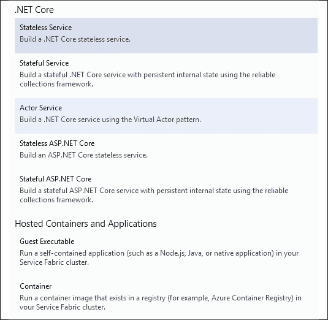
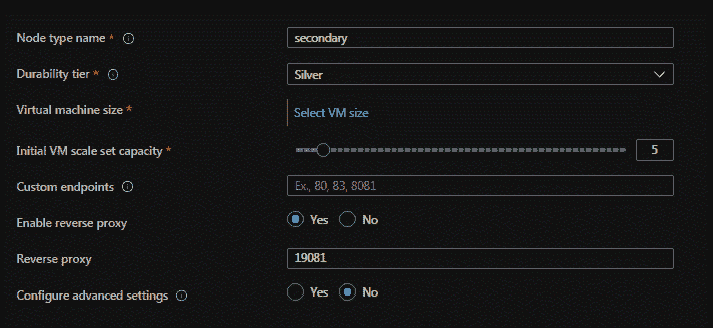
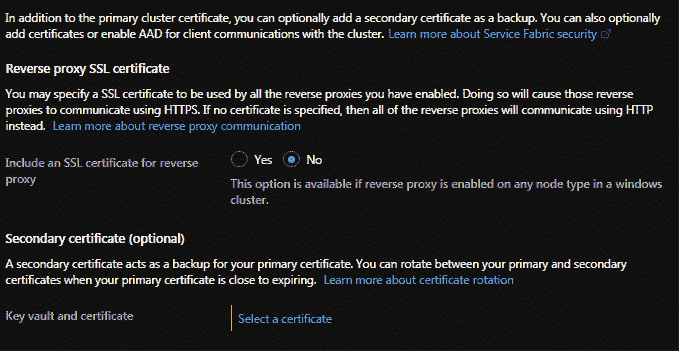

# 第六章：6

# Azure Service Fabric

本章专门描述了 Azure Service Fabric，它是微软的一种主观的微服务编排器。它在 Azure 上可用，但 Service Fabric 软件也可以下载，这意味着用户可以使用它来定义自己的本地微服务集群。

虽然 Service Fabric 并不像 Kubernetes 那样广泛使用，但它具有更好的学习曲线，使您能够尝试微服务的基本概念，并在很短的时间内构建复杂的解决方案。此外，它提供了一个集成的部署环境，包括您实现完整应用所需的一切。更具体地说，它还提供了集成的通信协议和一种简单可靠的存储状态信息的方式。

在本章中，我们将涵盖以下主题：

+   Visual Studio 对 Azure Service Fabric 应用程序的支持

+   如何定义和配置 Azure Service Fabric 集群

+   如何通过“日志微服务”使用案例来实践编写可靠的服务及其通信

通过本章的学习，您将学会如何基于 Azure Service Fabric 实现一个完整的解决方案。

# 技术要求

在本章中，您将需要以下内容：

+   Visual Studio 2019 免费社区版或更高版本，已安装所有数据库工具和 Azure 开发工作负载。

+   一个免费的 Azure 账户。*第一章*的*理解软件架构的重要性*中的*创建 Azure 账户*部分解释了如何创建账户。

+   在 Visual Studio 中调试微服务时，需要一个用于 Azure Service Fabric 的本地仿真器。它是免费的，可以从[`docs.microsoft.com/en-us/azure/service-fabric/service-fabric-get-started#install-the-sdk-and-tools`](https://docs.microsoft.com/en-us/azure/service-fabric/service-fabric-get-started#install-the-sdk-and)下载。

为了避免安装问题，请确保您的 Windows 版本是最新的。此外，仿真器使用 PowerShell 高特权级命令，默认情况下被 PowerShell 阻止。要启用它们，您需要在 Visual Studio 包管理器控制台或任何 PowerShell 控制台中执行以下命令。为了使以下命令成功，必须以*管理员*身份启动 Visual Studio 或外部 PowerShell 控制台：

```cs
Set-ExecutionPolicy -ExecutionPolicy Unrestricted -Force -Scope CurrentUser 
```

## Visual Studio 对 Azure Service Fabric 的支持

Visual Studio 具有针对微服务应用程序的特定项目模板，基于 Service Fabric 平台，您可以在其中定义各种微服务，配置它们，并将它们部署到 Azure Service Fabric，这是一个微服务编排器。Azure Service Fabric 将在下一节中详细介绍。

在本节中，我们将描述在 Service Fabric 应用程序中可以定义的各种类型的微服务。本章最后一节将提供一个完整的代码示例。如果您想在开发机器上调试微服务，您需要安装本章技术要求中列出的 Service Fabric 仿真器。

可以通过在“Visual Studio 项目类型下拉筛选器”中选择**云**来找到 Service Fabric 应用程序：


图 6.1：选择 Service Fabric 应用程序

选择项目并选择项目和解决方案名称后，您可以选择多种服务：



图 6.2：服务选择

所有基于.NET Core 的项目都使用了针对 Azure Service Fabric 特定的微服务模型。Guest Executable 在现有的 Windows 应用程序周围添加了一个包装器，将其转换为可以在 Azure Service Fabric 中运行的微服务。Container 应用程序允许在 Service Fabric 应用程序中添加任何 Docker 镜像。所有其他选择都提供了一个模板，允许您使用 Service Fabric 特定的模式编写微服务。

如果您选择**无状态服务**并填写所有请求信息，Visual Studio 将创建两个项目：一个包含整个应用程序的配置信息的应用程序项目，以及一个包含您选择的特定服务的服务代码和特定服务配置的项目。如果您想向应用程序添加更多微服务，请右键单击应用程序项目，然后选择**添加** | **新的 Service Fabric 服务**。

如果您右键单击解决方案并选择**添加** | **新项目**，将创建一个新的 Service Fabric 应用程序，而不是将新服务添加到已经存在的应用程序中。

如果您选择**Guest Executable**，您需要提供以下内容：

+   服务名称。

+   一个包含主可执行文件的文件夹，以及为了正常工作而需要的所有文件。如果您想要在项目中创建此文件夹的副本，或者只是链接到现有文件夹，您需要这个。

+   是否要添加一个链接到此文件夹，或者将所选文件夹复制到 Service Fabric 项目中。

+   主可执行文件。

+   要传递给可执行文件的命令行参数。

+   要在 Azure 上使用作为工作文件夹的文件夹。您可以使用包含主可执行文件（`CodeBase`）的文件夹，Azure Service Fabric 将在其中打包整个微服务的文件夹（`CodePackage`），或者命名为`Work`的新子文件夹。

如果您选择**容器**，您需要提供以下内容：

+   服务名称。

+   您私有 Azure 容器注册表中的 Docker 镜像的完整名称。

+   将用于连接到 Azure 容器注册表的用户名。密码将在与用户名自动创建的应用程序配置文件的相同`RepositoryCredentials` XML 元素中手动指定。

+   您可以访问服务的端口（主机端口）以及主机端口必须映射到的容器内部的端口（容器端口）。容器端口必须是在 Dockerfile 中公开并用于定义 Docker 镜像的相同端口。

之后，您可能需要添加进一步的手动配置，以确保您的 Docker 应用程序正常工作。*进一步阅读*部分包含指向官方文档的链接，您可以在其中找到更多详细信息。

有五种.NET Core 本机 Service Fabric 服务类型。Actor 服务模式是由 Carl Hewitt 几年前构思的一种主观模式。我们不会在这里讨论它，但*进一步阅读*部分包含一些提供更多信息的链接。

其余四种模式是指使用（或不使用）ASP.NET（Core）作为主要交互协议，以及服务是否具有内部状态。事实上，Service Fabric 允许微服务使用分布式队列和字典，这些队列和字典对于声明它们的微服务的所有实例都是全局可访问的，与它们运行的硬件节点无关（在需要时它们被序列化和分发到所有可用的实例）。

有状态和无状态模板在配置方面主要有所不同。所有本机服务都是指定了两个方法的类。有状态服务指定：

```cs
protected override IEnumerable<ServiceReplicaListener> CreateServiceReplicaListeners()
protected override async Task RunAsync(CancellationToken cancellationToken) 
```

而无状态服务则需要指定：

```cs
protected override IEnumerable< ServiceInstanceListener > CreateServiceInstanceListeners()
protected override async Task RunAsync(CancellationToken cancellationToken) 
```

`CreateServiceReplicaListeners`和`CreateServiceInstanceListeners`方法指定了微服务用于接收消息和处理这些消息的代码的监听器列表。监听器可以使用任何协议，但它们需要指定相对套接字的实现。

`RunAsync`包含用于异步运行由接收到的消息触发的任务的后台线程的代码。在这里，您可以构建一个运行多个托管服务的主机。

ASP.NET Core 模板遵循相同的模式；但是，它们使用基于 ASP.NET Core 的唯一侦听器和没有`RunAsync`实现，因为可以从 ASP.NET Core 内部启动后台任务，其侦听器定义了一个完整的`WebHost`。但是，您可以将更多侦听器添加到由 Visual Studio 创建的`CreateServiceReplicaListeners`实现返回的侦听器数组中，还可以添加自定义的`RunAsync`覆盖。

值得指出的是，由于`RunAsync`是可选的，并且由于 ASP.NET Core 模板没有实现它，因此`CreateServiceReplicaListeners`和`CreateServiceInstanceListeners`也是可选的，例如，基于计时器的后台工作程序不需要实现它们中的任何一个。

有关 Service Fabric 的本机服务模式的更多详细信息将在下一节中提供，而本章的*用例-日志记录微服务*部分将提供一个完整的代码示例，专门针对本书的用例。

# 定义和配置 Azure Service Fabric 集群

Azure Service Fabric 是主要的微软编排器，可以托管 Docker 容器、本地.NET 应用程序和一种名为**可靠服务**的分布式计算模型。我们已经在*Visual Studio 支持 Azure Service Fabric*部分中解释了如何创建包含这三种类型服务的应用程序。在本节中，我们将解释如何在 Azure 门户中创建 Azure Service Fabric 集群，并提供一些关于可靠服务的详细信息。有关*可靠服务*的更多实际细节将在*用例-日志记录微服务*部分中提供。

您可以通过在 Azure 搜索栏中输入`Service Fabric`并选择**Service Fabric Cluster**来进入 Azure 的 Service Fabric 部分。

显示了所有 Service Fabric 集群的摘要页面，对于您的情况，应该是空的。当您点击**添加**按钮创建第一个集群时，将显示一个多步骤向导。以下小节描述了可用的步骤。

## 第 1 步-基本信息

以下截图显示了 Azure Service Fabric 的创建过程：


图 6.3：Azure Service Fabric 创建

在这里，您可以选择操作系统、资源组、订阅、位置以及要用于连接远程桌面到所有集群节点的用户名和密码。

您需要选择一个集群名称，该名称将用于组成集群 URI，格式为`<集群名称>.<位置>.cloudapp.azure.com`，其中`位置`是您选择的数据中心位置的名称。由于 Service Fabric 主要是为 Windows 设计的，所以选择 Windows 是一个更好的选择。对于 Linux 机器来说，更好的选择是 Kubernetes，这将在下一章中介绍。

然后，您需要选择节点类型，即您想要为主节点使用的虚拟机类型，以及初始规模集，即要使用的虚拟机的最大数量。请选择一个廉价的节点类型，最多不超过三个节点，否则您可能很快就会耗尽所有的免费 Azure 信用额。

有关节点配置的更多详细信息将在下一小节中给出。

最后，您可以选择一个证书来保护节点之间的通信。让我们点击**选择证书**链接，在打开的窗口中选择自动创建新密钥保管库和新证书。有关安全性的更多信息将在*第 3 步-安全配置*部分中提供。

## 第 2 步-集群配置

在第二步中，您可以对集群节点类型和数量进行微调：


图 6.4：集群配置

更具体地说，在上一步中，我们选择了集群的主节点。在这里，我们可以选择是否添加各种类型的辅助节点及其规模容量。一旦您创建了不同的节点类型，您可以配置服务仅在其需求所需的能力足够的特定节点类型上运行。

让我们点击**添加**按钮来添加一个新的节点类型：



图 6.5：添加一个新的节点类型

不同节点类型的节点可以独立进行扩展，**主节点**类型是 Azure Service Fabric 运行时服务的托管位置。对于每个节点类型，您可以指定机器类型（**耐久性层**）、机器规格（CPU 和 RAM）和初始节点数。

您还可以指定所有从集群外部可见的端口（**自定义端点**）。

托管在集群的不同节点上的服务可以通过任何端口进行通信，因为它们是同一本地网络的一部分。因此，**自定义端点**必须声明需要接受来自集群外部的流量的端口。在**自定义端点**中公开的端口是集群的公共接口，可以通过集群 URI（即`<cluster name>.<location>.cloudapp.azure.com`）访问。它们的流量会自动重定向到由集群负载均衡器打开相同端口的所有微服务。

要理解**启用反向代理**选项，我们必须解释在服务的物理地址在其生命周期中发生变化时，如何将通信发送到多个实例。在集群内部，服务通过`fabric://<application name>/<service name>`这样的 URI 进行标识。也就是说，这个名称允许我们访问`<service name>`的多个负载均衡实例之一。然而，这些 URI 不能直接用于通信协议。相反，它们用于从 Service Fabric 命名服务获取所需资源的物理 URI，以及其所有可用的端口和协议。

稍后，我们将学习如何使用*可靠服务*执行此操作。然而，对于没有专门为 Azure Service Fabric 运行而设计的 Docker 化服务来说，这个模型是不合适的，因为它们不知道 Service Fabric 特定的命名服务和 API。

因此，Service Fabric 提供了另外两个选项，我们可以使用它们来标准化 URL，而不是直接与其命名服务交互：

+   **DNS**：每个服务可以指定其`hostname`（也称为**DNS 名称**）。DNS 服务负责将其转换为实际的服务 URL。例如，如果一个服务指定了一个`order.processing`的 DNS 名称，并且它在端口`80`上有一个 HTTP 端点和一个`/purchase`路径，我们可以使用`http://order.processing:80/purchase`来访问此端点。默认情况下，DNS 服务是活动的，但您可以通过在辅助节点屏幕上点击**配置高级设置**来显示高级设置选择，或者转到**高级**选项卡来禁用它。

+   **反向代理**：Service Fabric 的反向代理拦截所有被定向到集群地址的调用，并使用名称服务将它们发送到正确的应用程序和该应用程序中的服务。由反向代理服务解析的地址具有以下结构：`<cluster name>.<location>.cloudapp.azure.com: <port>//<app name>/<service name>/<endpoint path>?PartitionKey=<value>& PartitionKind=value`。在这里，分区键用于优化有状态的可靠服务，并将在本小节末尾进行解释。这意味着无状态服务缺少前一个地址的查询字符串部分。因此，由反向代理解析的典型地址可能类似于`myCluster.eastus.cloudapp.azure.com: 80//myapp/myservice/<endpoint path>?PartitionKey=A & PartitionKind=Named`。如果从同一集群上托管的服务调用前面的端点，我们可以指定`localhost`而不是完整的集群名称（即从同一集群，而不是从同一节点）：`localhost: 80//myapp/myservice/<endpoint path>?PartitionKey=A & PartitionKind=Named`。默认情况下，反向代理未启用。

由于我们将使用 Service Fabric 可靠服务与 Service Fabric 内置通信设施，并且由于这些内置通信设施不需要反向代理或 DNS，请避免更改这些设置。

此外，如果您只是为了在本章末尾的简单示例中进行实验而创建 Service Fabric 集群，请仅使用主节点，并避免通过创建辅助节点来浪费您的免费 Azure 信用。

## 第 3 步-安全配置

完成第二步后，我们来到一个安全页面：



图 6.6：安全页面

在第一步中，我们已经定义了主要的证书。在这里，您可以选择一个次要的证书，在主要证书接近到期时使用。您还可以添加一个证书，用于在反向代理上启用 HTTPS 通信。由于在我们的示例中，我们不使用 Docker 化服务（因此不需要反向代理），所以我们不需要这个选项。

在这一点上，我们可以点击“审查和创建”按钮来创建集群。提交您的批准将创建集群。请注意：一个集群可能会在短时间内消耗您的免费 Azure 信用，所以在测试时请保持您的集群开启。之后，您应该删除它。

我们需要将主要证书下载到开发机器上，因为我们需要它来部署我们的应用程序。一旦证书下载完成，只需双击它即可将其安装在我们的机器上。在部署应用程序之前，您需要将以下信息插入到 Visual Studio Service Fabric 应用程序的**Cloud Publish Profile**中（有关更多详细信息，请参见本章的*用例-日志记录微服务*部分）：

```cs
<ClusterConnectionParameters 
    ConnectionEndpoint="<cluster name>.<location 
    code>.cloudapp.azure.com:19000"
    X509Credential="true"
    ServerCertThumbprint="<server certificate thumbprint>"
    FindType="FindByThumbprint"
    FindValue="<client certificate thumbprint>"
    StoreLocation="CurrentUser"
    StoreName="My" /> 
```

由于客户端（Visual Studio）和服务器使用相同的证书进行身份验证，因此服务器和客户端的指纹是相同的。证书指纹可以从 Azure 密钥保管库中复制。值得一提的是，您还可以通过在*第 3 步*中选择相应的选项来将特定于客户端的证书添加到主服务器证书中。

正如我们在*Visual Studio 对 Azure Service Fabric 的支持*小节中提到的，Azure Service Fabric 支持两种类型的*可靠服务*：无状态和有状态。无状态服务要么不存储永久数据，要么将其存储在外部支持中，例如 Redis 缓存或数据库（有关 Azure 提供的主要存储选项，请参见*第九章*，*如何选择云中的数据存储*）。

另一方面，有状态服务使用 Service Fabric 特定的分布式字典和队列。每个分布式数据结构可以从服务的所有*相同*副本中访问，但只允许一个副本，称为主副本，在其上进行写操作，以避免对这些分布式资源的同步访问，这可能会导致瓶颈。

所有其他副本，即辅助副本，只能从这些分布式数据结构中读取。

您可以通过查看您的代码从 Azure Service Fabric 运行时接收到的上下文对象来检查副本是否为主副本，但通常情况下，您不需要这样做。实际上，当您声明服务端点时，您需要声明那些只读的端点。只读端点应该接收请求，以便它可以从共享数据结构中读取数据。因此，由于只有只读端点被激活用于辅助副本，如果您正确实现了它们，写/更新操作应该自动在有状态辅助副本上被阻止，无需进行进一步的检查。

在有状态服务中，辅助副本可以在读操作上实现并行处理，因此为了在写/更新操作上实现并行处理，有状态服务被分配了不同的数据分区。具体来说，对于每个有状态服务，Service Fabric 会为每个分区创建一个主实例。然后，每个分区可能有多个辅助副本。

分布式数据结构在每个分区的主实例和其辅助副本之间共享。可以根据对要存储的数据进行哈希算法生成的分区键将有状态服务中可以存储的全部数据范围划分为所选的分区数。

通常，分区键是属于给定间隔的整数，该间隔在所有可用分区之间进行划分。例如，可以通过调用一个众所周知的哈希算法对一个或多个字符串字段进行哈希运算来生成分区键，以获得然后处理为唯一整数的整数（例如，对整数位进行异或运算）。然后，可以通过取整数除法的余数来限制该整数在选择的分区键的整数间隔中（例如，除以 1,000 的余数将是 0-999 间隔中的整数）。确保所有服务使用完全相同的哈希算法非常重要，因此更好的解决方案是为所有服务提供一个公共的哈希库。

假设我们想要四个分区，这些分区将在 0-999 的整数键中进行选择。在这里，Service Fabric 将自动创建我们有状态服务的四个主实例，并将它们分配给以下四个分区键子区间：0-249，250-499，500-749 和 750-999。

在代码中，您需要计算发送到有状态服务的数据的分区键。然后，Service Fabric 的运行时将为您选择正确的主实例。下面的部分将提供更多关于此的实际细节以及如何在实践中使用可靠服务。

# 用例 - 日志微服务

在本节中，我们将看一个基于微服务的系统，该系统记录与我们的 WWTravelClub 用例中的各个目的地相关的购买数据。特别是，我们将设计微服务来计算每个位置的每日收入。在这里，我们假设这些微服务从同一 Azure Service Fabric 应用程序中托管的其他子系统接收数据。具体来说，每个购买日志消息由位置名称、总体套餐费用以及购买日期和时间组成。

首先，让我们确保我们在本章*技术要求*部分提到的 Service Fabric 模拟器已经安装并在您的开发机器上运行。现在，我们需要将其切换，以便它运行**5 个节点**：右键单击您在 Windows 通知区域中拥有的小 Service Fabric 集群图标，在打开的上下文菜单中，选择**切换集群模式** -> **5 个节点**。

现在，我们可以按照*Visual Studio 对 Azure Service Fabric 的支持*部分中列出的步骤来创建一个名为`PurchaseLogging`的 Service Fabric 项目。选择一个.NET Core 有状态可靠服务，并将其命名为`LogStore`。

由 Visual Studio 创建的解决方案由一个代表整体应用程序的`PurchaseLogging`项目和一个包含在`PurchaseLogging`应用程序中的第一个微服务的实现的`LogStore`项目组成。

在`PackageRoot`文件夹下，`LogStore`服务和每个可靠服务都包含`ServiceManifest.xml`配置文件和一个`Settings.xml`文件夹（在`Config`子文件夹下）。`Settings.xml`文件夹包含一些将从服务代码中读取的设置。初始文件包含了 Service Fabric 运行时所需的预定义设置。让我们添加一个新的`Settings`部分，如下面的代码所示：

```cs
<?xml version="1.0" encoding="utf-8" ?>
<Settings xmlns:xsd="http://www.w3.org/2001/XMLSchema" 
          xmlns:xsi="http://www.w3.org/2001/XMLSchema-instance" 
          xmlns="http://schemas.microsoft.com/2011/01/fabric">
<!-- This is used by the StateManager's replicator. -->
<Section Name="ReplicatorConfig">
<Parameter Name="ReplicatorEndpoint" Value="ReplicatorEndpoint" />
</Section>
<!-- This is used for securing StateManager's replication traffic. -->
<Section Name="ReplicatorSecurityConfig" />
<!-- Below the new Section to add -->
<Section Name="Timing">
<Parameter Name="MessageMaxDelaySeconds" Value="" />
</Section>
</Settings> 
```

我们将使用`MessageMaxDelaySeconds`的值来配置系统组件，并确保消息的幂等性。设置值为空，因为大多数设置在服务部署时会被`PurchaseLogging`项目中包含的整体应用程序设置所覆盖。

`ServiceManifest.xml`文件包含了一些由 Visual Studio 自动处理的配置标签，以及一些端点的列表。由于这些端点被 Service Fabric 运行时使用，因此有两个端点是预配置的。在这里，我们必须添加我们的微服务将监听的所有端点的配置细节。每个端点定义的格式如下：

```cs
<Endpoint Name="<endpoint name>" PathSuffix="<the path of the endpoint URI>" Protocol="<a protcol like Tcp, http, https, etc.>" Port="the exposed port" Type="<Internal or Input>"/> 
```

如果`Type`是`Internal`，则端口将仅在集群的本地网络中打开；否则，端口也将从集群外部可用。在前一种情况下，我们还必须在 Azure Service Fabric 集群的配置中声明该端口，否则集群负载均衡器/防火墙将无法将消息转发到该端口。

公共端口可以直接从集群 URI(`<cluster name>.<location code>.cloudapp.azure.com`)到达，因为每个集群的负载均衡器将把接收到的输入流量转发到它们。

在这个例子中，我们不会定义端点，因为我们将使用预定义的基于远程通信，但我们将在本节的后面向您展示如何使用它们。

`PurchaseLogging`项目在*services*解决方案资源管理器节点下包含对`LogStore`项目的引用，并包含各种包含各种 XML 配置文件的文件夹。具体来说，我们有以下文件夹：

+   `ApplicationPackageRoot`包含名为`ApplicationManifest.xml`的整体应用程序清单。该文件包含一些初始参数定义，然后进行进一步的配置。参数的格式如下：

```cs
<Parameter Name="<parameter name>" DefaultValue="<parameter definition>" /> 
```

+   一旦定义，参数可以替换文件的其余部分中的任何值。参数值通过将参数名称括在方括号中来引用，如下面的代码所示：

```cs
<UniformInt64Partition PartitionCount="[LogStore_PartitionCount]" LowKey="0" HighKey="1000" /> 
```

一些参数定义了每个服务的副本和分区的数量，并且由 Visual Studio 自动创建。让我们用以下代码片段中的值替换 Visual Studio 建议的这些初始值：

```cs
<Parameter Name="LogStore_MinReplicaSetSize" DefaultValue="1" />
<Parameter Name="LogStore_PartitionCount" DefaultValue="2" />
<Parameter Name="LogStore_TargetReplicaSetSize" DefaultValue="1" /> 
```

我们将使用两个分区来展示分区是如何工作的，但您可以增加此值以提高写入/更新并行性。`LogStore`服务的每个分区不需要多个副本，因为副本可以提高读取操作的性能，而此服务并非设计为提供读取服务。在类似情况下，您可以选择两到三个副本，使系统具有冗余性并更加健壮。但是，由于这只是一个示例，我们不关心故障，所以我们只留下一个。

前述参数用于定义整个应用程序中`LogStore`服务的角色。此定义是由 Visual Studio 在同一文件中自动生成的，位于 Visual Studio 创建的初始定义下方，只是分区间隔更改为 0-1,000：

```cs
<Service Name="LogStore" ServicePackageActivationMode="ExclusiveProcess">
<StatefulService ServiceTypeName="LogStoreType" 
    TargetReplicaSetSize=
    "[LogStore_TargetReplicaSetSize]" 
    MinReplicaSetSize="[LogStore_MinReplicaSetSize]">
<UniformInt64Partition PartitionCount="
        [LogStore_PartitionCount]" 
        LowKey="0" HighKey="1000" />
</StatefulService>
</Service> 
```

+   `ApplicationParameters`包含在各种部署环境（即实际的 Azure Service Fabric 集群和具有一个或五个节点的本地仿真器）中为`ApplicationManifest.xml`中定义的参数提供可能的覆盖。

+   `PublishProfiles`包含发布应用程序所需的设置，这些设置与`ApplicationParameters`文件夹处理的相同环境相关。您只需要使用实际的 Azure Service Fabric URI 名称和在 Azure 集群配置过程中下载的身份验证证书来自定义云发布配置文件：

```cs
<ClusterConnectionParameters 
    ConnectionEndpoint="<cluster name>.<location 
    code>.cloudapp.azure.com:19000"
    X509Credential="true"
    ServerCertThumbprint="<server certificate thumbprint>"
    FindType="FindByThumbprint"
    FindValue="<client certificate thumbprint>"
    StoreLocation="CurrentUser"
    StoreName="My" /> 
```

需要遵循的其余步骤已经组织成几个子部分。让我们首先看看如何确保消息的幂等性。

## 确保消息的幂等性

由于故障或负载平衡引起的小超时，消息可能会丢失。在这里，我们将使用预定义的基于远程通信的通信，以在发生故障时执行自动消息重试。但是，这可能导致相同的消息被接收两次。由于我们正在对采购订单的收入进行汇总，因此必须防止多次对同一采购进行汇总。

为此，我们将实现一个包含必要工具的库，以确保消息副本被丢弃。

让我们向解决方案添加一个名为**IdempotencyTools**的新的.NET Standard 2.0 库项目。现在，我们可以删除 Visual Studio 生成的初始类。该库需要引用与`LogStore`引用的`Microsoft.ServiceFabric.Services` NuGet 包相同版本，因此让我们验证版本号并将相同的 NuGet 包引用添加到`IdempotencyTools`项目中。

确保消息幂等性的主要工具是`IdempotentMessage`类：

```cs
using System;
using System.Runtime.Serialization;
namespace IdempotencyTools
{
    [DataContract]
    public class IdempotentMessage<T>
    {
        [DataMember]
        public T Value { get; protected set; }
        [DataMember]
        public DateTimeOffset Time { get; protected set; }
        [DataMember]
        public Guid Id { get; protected set; }
        public IdempotentMessage(T originalMessage)
        {
            Value = originalMessage;
            Time = DateTimeOffset.Now;
            Id = Guid.NewGuid();
        }
    }
} 
```

我们添加了`DataContract`和`DataMember`属性，因为它们是我们将用于所有内部消息的远程通信序列化器所需的。基本上，前述类是一个包装器，它向传递给其构造函数的消息类实例添加了`Guid`和时间标记。

`IdempotencyFilter`类使用分布式字典来跟踪它已经收到的消息。为了避免这个字典的无限增长，较旧的条目会定期删除。在字典中找不到的太旧的消息会自动丢弃。

时间间隔条目保存在字典中，并在`IdempotencyFilter`静态工厂方法中传递，该方法创建新的过滤器实例，以及字典名称和`IReliableStateManager`实例，这些都是创建分布式字典所需的：

```cs
public class IdempotencyFilter
{
    protected IReliableDictionary<Guid, DateTimeOffset> dictionary;
    protected int maxDelaySeconds;
    protected DateTimeOffset lastClear;
    protected IReliableStateManager sm;
    protected IdempotencyFilter() { }
    public static async Task<IdempotencyFilter> NewIdempotencyFilter(
        string name, 
        int maxDelaySeconds, 
        IReliableStateManager sm)
    {
        return new IdempotencyFilter()
            {
                dictionary = await
                sm.GetOrAddAsync<IReliableDictionary<Guid,
                DateTimeOffset>>(name),
                maxDelaySeconds = maxDelaySeconds,
                lastClear = DateTimeOffset.UtcNow,
                sm = sm,
            };
}
...
... 
```

字典包含每条消息的时间标记，由消息`Guid`索引，并通过调用`IReliableStateManager`实例的`GetOrAddAsync`方法以字典类型和名称创建。`lastClear`包含删除所有旧消息的时间。

当新消息到达时，`NewMessage`方法会检查是否必须丢弃该消息。如果必须丢弃消息，则返回`null`；否则，将新消息添加到字典中，并返回不带`IdempotentMessage`包装的消息：

```cs
public async Task<T> NewMessage<T>(IdempotentMessage<T> message)
{
    DateTimeOffset now = DateTimeOffset.Now;
    if ((now - lastClear).TotalSeconds > 1.5 * maxDelaySeconds)
    {
        await Clear();
    }
    if ((now - message.Time).TotalSeconds > maxDelaySeconds)
        return default(T);
    using (var tx = this.sm.CreateTransaction())
    {
        ...
        ...
    }
 } 
```

首先，该方法验证是否是清除字典的时间以及消息是否太旧。然后，它启动事务以访问字典。所有分布式字典操作都必须包含在事务中，如下面的代码所示：

```cs
using (ITransaction tx = this.sm.CreateTransaction())
{
    if (await dictionary.TryAddAsync(tx, message.Id, message.Time))
    {
         await tx.CommitAsync();
         return message.Value;
    }
    else
    {
         return default;
    }
} 
```

如果在字典中找到消息`Guid`，则事务将被中止，因为不需要更新字典，并且该方法返回`default(T)`，实际上是`null`，因为不必处理消息。否则，将消息条目添加到字典中，并返回未包装的消息。

`Clear`方法的代码可以在与本书关联的 GitHub 存储库中找到。

## 交互库

有一些类型必须在所有微服务之间共享。如果内部通信是使用远程调用或 WCF 实现的，每个微服务必须公开一个接口，其中包含其他微服务调用的所有方法。这些接口必须在所有微服务之间共享。此外，对于所有通信接口，实现消息的类也必须在所有微服务之间共享（或在它们的一些子集之间共享）。因此，所有这些结构都在外部库中声明，并由微服务引用。

现在，让我们向我们的解决方案添加一个名为`Interactions`的新的.NET Standard 2.0 库项目。由于此库必须使用`IdempotentMessage`泛型类，因此我们必须将其添加为对`IdempotencyTools`项目的引用。我们还必须添加对包含在`Microsoft.ServiceFabric.Services.Remoting` NuGet 包中的远程通信库的引用，因为用于公开微服务远程方法的所有接口必须继承自此包中定义的`IService`接口。

`IService`是一个空接口，声明了继承接口的通信角色。`Microsoft.ServiceFabric.Services.Remoting` NuGet 包的版本必须与其他项目中声明的`Microsoft.ServiceFabric.Services`包的版本匹配。

以下代码显示了需要由`LogStore`类实现的接口声明：

```cs
using System;
using System.Collections.Generic;
using System.Text;
using System.Threading.Tasks;
using IdempotencyTools;
using Microsoft.ServiceFabric.Services.Remoting;
namespace Interactions
{
    public interface ILogStore: IService
    {
        Task<bool> LogPurchase(IdempotentMessage<PurchaseInfo>
        idempotentMessage);
    }
} 
```

以下是`PurchaseInfo`消息类的代码，该类在`ILogStore`接口中被引用：

```cs
using System;
using System.Collections.Generic;
using System.Runtime.Serialization;
using System.Text;
namespace Interactions
{
    [DataContract]
    public class PurchaseInfo
    {
        [DataMember]
        public string Location { get; set; }
        [DataMember]
        public decimal Cost { get; set; }
        [DataMember]
        public DateTimeOffset Time { get; set; }
    }
} 
```

现在，我们准备实现我们的主要`LogStore`微服务。

## 实现通信接收端

要实现`LogStore`微服务，我们必须添加对`Interaction`库的引用，该库将自动创建对远程库和`IdempotencyTools`项目的引用。

然后，`LogStore`类必须实现`ILogStore`接口：

```cs
internal sealed class LogStore : StatefulService, ILogStore
...
...
private IReliableQueue<IdempotentMessage<PurchaseInfo>> LogQueue;
public async Task<bool>
    LogPurchase(IdempotentMessage<PurchaseInfo> idempotentMessage)
{
    if (LogQueue == null) return false;
    using (ITransaction tx = this.StateManager.CreateTransaction())
    {
        await LogQueue.EnqueueAsync(tx, idempotentMessage);
        await tx.CommitAsync();
        return true;
    }
} 
```

一旦服务从远程运行时接收到`LogPurchase`调用，它将消息放入`LogQueue`中，以避免调用者保持阻塞，等待消息处理完成。通过这种方式，我们既实现了同步消息传递协议的可靠性（调用者知道消息已被接收），又实现了异步消息处理的性能优势，这是异步通信的典型特点。

作为所有分布式集合的最佳实践，`LoqQueue`在`RunAsync`方法中创建，因此如果第一个调用在 Azure Service Fabric 运行时调用`RunAsync`之前到达，则`LogQueue`可能为空。在这种情况下，该方法返回`false`以表示服务尚未准备好，发送方将稍等一会然后重新发送消息。否则，将创建事务以将新消息加入队列。

然而，如果我们不提供一个返回服务想要激活的所有监听器的`CreateServiceReplicaListeners()`的实现，我们的服务将不会接收任何通信。在远程通信的情况下，有一个预定义的方法来执行整个工作，所以我们只需要调用它：

```cs
protected override IEnumerable<ServiceReplicaListener>
    CreateServiceReplicaListeners()
{
    return this.CreateServiceRemotingReplicaListeners<LogStore>();
} 
```

在这里，`CreateServiceRemotingReplicaListeners`是在远程通信库中定义的扩展方法。它为主副本和辅助副本（用于只读操作）创建监听器。在创建客户端时，我们可以指定它的通信是针对主副本还是辅助副本。

如果您想使用不同的监听器，您必须创建`ServiceReplicaListener`实例的`IEnumerable`。对于每个监听器，您必须使用三个参数调用`ServiceReplicaListener`构造函数：

+   一个接收可靠服务上下文对象作为输入并返回`ICommunicationListener`接口实现的函数。

+   监听器的名称。当服务有多个监听器时，这第二个参数就变得必须。

+   一个布尔值，如果监听器必须在辅助副本上激活，则为 true。

例如，如果我们想要添加自定义和 HTTP 监听器，代码就会变成以下的样子：

```cs
return new ServiceReplicaListener[]
{
    new ServiceReplicaListener(context =>
    new MyCustomHttpListener(context, "<endpoint name>"),
    "CustomWriteUpdateListener", true),
    new ServiceReplicaListener(serviceContext =>
    new KestrelCommunicationListener(serviceContext, "<endpoint name>",
    (url, listener) =>
        {
           ...
        })
        "HttpReadOnlyListener",
    true)
}; 
```

`MyCustomHttpListener`是`ICommunicationListener`的自定义实现，而`KestrelCommunicationListener`是基于 Kestrel 和 ASP.NET Core 的预定义 HTTP 监听器。以下是定义`KestrelCommunicationListener`监听器的完整代码：

```cs
new ServiceReplicaListener(serviceContext =>
new KestrelCommunicationListener(serviceContext, "<endpoint name>", (url, listener) =>
{
    return new WebHostBuilder()
    .UseKestrel()
    .ConfigureServices(
        services => services
        .AddSingleton<StatefulServiceContext>(serviceContext)
        .AddSingleton<IReliableStateManager>(this.StateManager))
    .UseContentRoot(Directory.GetCurrentDirectory())
    .UseStartup<Startup>()
    .UseServiceFabricIntegration(listener, 
    ServiceFabricIntegrationOptions.UseUniqueServiceUrl)
    .UseUrls(url)
    .Build();
})
"HttpReadOnlyListener",
true) 
```

`ICommunicationListener`的实现也必须有一个`Close`方法，它必须关闭已打开的通信通道，以及一个`Abort`方法，它必须**立即**关闭通信通道（不优雅地，也就是说，不通知连接的客户端等）。

现在我们已经打开了通信，我们可以实现服务逻辑。

## 实现服务逻辑

服务逻辑由在`RunAsync`被 Service Fabric 运行时启动的独立线程执行。当您只需要实现一个任务时，创建`IHost`并将所有任务设计为`IHostedService`实现是一个好的做法。事实上，`IHostedService`实现是独立的软件块，更容易进行单元测试。`IHost`和`IHostedService`在*使用通用主机*的*第五章*的*将微服务架构应用于企业应用程序*的子章节中有详细讨论。

在本节中，我们将实现计算每个位置的日收入的逻辑，这个逻辑位于名为`ComputeStatistics`的`IHostedservice`中，它使用一个分布式字典，其键是位置名称，值是一个名为`RunningTotal`的类的实例。这个类存储当前的运行总数和正在计算的日期：

```cs
namespace LogStore
{
    public class RunningTotal
    {
        public DateTime Day { get; set; }
        public decimal Count { get; set; }
        public RunningTotal 
                Update(DateTimeOffset time, decimal value)
        {
            ...
        }
    }
} 
```

这个类有一个`Update`方法，当接收到新的购买消息时更新实例。首先，传入消息的时间被标准化为世界标准时间。然后，这个时间的日期部分被提取出来，并与运行总数的当前`Day`进行比较，如下面的代码所示：

```cs
public RunningTotal Update(DateTimeOffset time, decimal value)
        {
            var normalizedTime = time.ToUniversalTime();
            var newDay = normalizedTime.Date;           
           ... 
           ...
        } 
```

如果是新的一天，我们假设前一天的运行总数计算已经完成，所以`Update`方法将它返回到一个新的`RunningTotal`实例中，并重置`Day`和`Count`，以便它可以计算新一天的运行总数。否则，新值将被添加到运行的`Count`中，并且该方法返回`null`，表示当天的总数还没有准备好。这个实现可以在下面的代码中看到：

```cs
public RunningTotal Update(DateTimeOffset time, decimal value)
{
    ...
    ...
    var result = newDay > Day && Day != DateTime.MinValue ? 
    new RunningTotal
    {
        Day=Day,
        Count=Count
    } 
    : null;
    if(newDay > Day) Day = newDay;
    if (result != null) Count = value;
    else Count += value;
    return result;
} 
```

`ComputeStatistics`的`IHostedService`实现需要一些参数才能正常工作，如下所示：

+   包含所有传入消息的队列

+   `IReliableStateManager`服务，这样它就可以创建分布式字典来存储数据

+   `ConfigurationPackage`服务，以便它可以读取在`Settings.xml`服务文件中定义的设置，以及可能在应用程序清单中被覆盖的设置

在通过依赖注入由`IHost`创建`ComputeStatistics`实例时，必须将前面的参数传递给`ComputeStatistics`构造函数。我们将在下一小节中回到`IHost`的定义。现在，让我们专注于`ComputeStatistics`构造函数及其字段：

```cs
namespace LogStore
{
    public class ComputeStatistics : BackgroundService
    {
        IReliableQueue<IdempotentMessage<PurchaseInfo>> queue;
        IReliableStateManager stateManager;
        ConfigurationPackage configurationPackage;
        public ComputeStatistics(
            IReliableQueue<IdempotentMessage<PurchaseInfo>> queue,
            IReliableStateManager stateManager,
            ConfigurationPackage configurationPackage)
        {
            this.queue = queue;
            this.stateManager = stateManager;
            this.configurationPackage = configurationPackage;
        } 
```

所有构造函数参数都存储在私有字段中，以便在调用`ExecuteAsync`时可以使用它们：

```cs
protected async override Task ExecuteAsync(CancellationToken stoppingToken)
{
    bool queueEmpty = false;
    var delayString=configurationPackage.Settings.Sections["Timing"]
        .Parameters["MessageMaxDelaySeconds"].Value;
    var delay = int.Parse(delayString);
    var filter = await IdempotencyFilter.NewIdempotencyFilterAsync(
        "logMessages", delay, stateManager);
    var store = await
        stateManager.GetOrAddAsync<IReliableDictionary<string, RunningTotal>>("partialCount");
....
... 
```

在进入循环之前，`ComputeStatistics`服务准备一些结构和参数。它声明队列不为空，意味着可以开始出队消息。然后，它从服务设置中提取`MessageMaxDelaySeconds`并将其转换为整数。这个参数的值在`Settings.xml`文件中为空。现在，是时候覆盖它并在`ApplicationManifest.xml`中定义其实际值了：

```cs
<ServiceManifestImport>
<ServiceManifestRef ServiceManifestName="LogStorePkg" ServiceManifestVersion="1.0.0" />
<!--code to add start -->
<ConfigOverrides>
<ConfigOverride Name="Config">
<Settings>
<Section Name="Timing">
<Parameter Name="MessageMaxDelaySeconds" Value="[MessageMaxDelaySeconds]" />
</Section>
</Settings>
</ConfigOverride>
</ConfigOverrides>
<!--code to add end-->
</ServiceManifestImport> 
```

`ServiceManifestImport`将服务清单导入应用程序并覆盖一些配置。每当更改其内容和/或服务定义并重新部署到 Azure 时，必须更改其版本号，因为版本号更改告诉 Service Fabric 运行时在群集中要更改什么。版本号还出现在其他配置设置中。每当它们所引用的实体发生更改时，必须更改它们。

`MessageMaxDelaySeconds`与已接收消息的字典的名称以及`IReliableStateManager`服务的实例一起传递给幂等性过滤器的实例。最后，创建用于存储累计总数的主分布式字典。

之后，服务进入循环，并在`stoppingToken`被标记时结束，即当 Service Fabric 运行时发出信号表示服务将被停止时：

```cs
while (!stoppingToken.IsCancellationRequested)
    {
        while (!queueEmpty && !stoppingToken.IsCancellationRequested)
        {
            RunningTotal total = null;
            using (ITransaction tx = stateManager.CreateTransaction())
            {
                ...
                ... 
                ...
            }
        }
        await Task.Delay(100, stoppingToken);
        queueEmpty = false;
    }
} 
```

内部循环运行直到队列变为空，然后退出并等待 100 毫秒，然后验证是否有新的消息被入队。

以下是封装在事务中的内部循环的代码：

```cs
RunningTotal finalDayTotal = null;
using (ITransaction tx = stateManager.CreateTransaction())
{
    var result = await queue.TryDequeueAsync(tx);
    if (!result.HasValue) queueEmpty = true;
    else
    {
        var item = await filter.NewMessage<PurchaseInfo>(result.Value);
        if(item != null)
        {
            var counter = await store.TryGetValueAsync(tx, 
            item.Location);
            //counter update
            ...
        }
        ...
        ...
    }
} 
```

在这里，服务尝试出队一条消息。如果队列为空，则将`queueEmpty`设置为`true`以退出循环；否则，它通过幂等性过滤器传递消息。如果消息在此步骤中幸存下来，它将使用它来更新消息中引用的位置的累计总数。然而，分布式字典的正确操作要求每次更新条目时将旧计数器替换为新计数器。因此，将旧计数器复制到新的`RunningTotal`对象中。如果调用`Update`方法，可以使用新数据更新此新对象：

```cs
 //counter update    
    var newCounter = counter.HasValue ? 
    new RunningTotal
    {
        Count=counter.Value.Count,
        Day= counter.Value.Day
    }
    : new RunningTotal();
    finalDayTotal = newCounter.Update(item.Time, item.Cost);
    if (counter.HasValue)
        await store.TryUpdateAsync(tx, item.Location, 
        newCounter, counter.Value);
    else
        await store.TryAddAsync(tx, item.Location, newCounter); 
```

然后，事务被提交，如下所示：

```cs
if(item != null)
{
  ...
  ...
}
await tx.CommitAsync();
if(finalDayTotal != null)
{
    await SendTotal(finalDayTotal, item.Location);
} 
```

当`Update`方法返回完整的计算结果时，即`total != null`时，将调用以下方法：

```cs
protected async Task SendTotal(RunningTotal total, string location)
{
   //Empty, actual application would send data to a service 
   //that exposes daily statistics through a public Http endpoint
} 
```

`SendTotal`方法将总数发送到一个通过 HTTP 端点公开所有统计信息的服务。在阅读了专门介绍 Web API 的*第十四章*《使用.NET Core 应用服务导向架构》之后，您可能希望使用连接到数据库的无状态 ASP.NET Core 微服务实现类似的服务。无状态 ASP.NET Core 服务模板会自动为您创建一个基于 ASP.NET Core 的 HTTP 端点。

然而，由于该服务必须从`SendTotal`方法接收数据，它还需要基于远程的端点。因此，我们必须创建它们，就像我们为`LogStore`微服务所做的那样，并将基于远程的端点数组与包含 HTTP 端点的预先存在的数组连接起来。

## 定义微服务的主机

现在我们已经准备好定义微服务的`RunAsync`方法了：

```cs
protected override async Task RunAsync(CancellationToken cancellationToken)
{
    LogQueue = await 
        this.StateManager
        .GetOrAddAsync<IReliableQueue
<IdempotentMessage<PurchaseInfo>>>("logQueue");
    var configurationPackage = Context
        .CodePackageActivationContext
        .GetConfigurationPackageObject("Config");
    ...
    ... 
```

在这里，创建了服务队列，并将服务设置保存在`configurationPackage`中。

之后，我们可以创建`IHost`服务，就像我们在*第五章*的*将微服务架构应用于企业应用程序*的*使用通用主机*子部分中所解释的那样：

```cs
var host = new HostBuilder()
    .ConfigureServices((hostContext, services) =>
    {
        services.AddSingleton(this.StateManager);
        services.AddSingleton(this.LogQueue);
        services.AddSingleton(configurationPackage);
        services.AddHostedService<ComputeStatistics>();
    })
    .Build();
await host.RunAsync(cancellationToken); 
```

`ConfigureServices`定义了所有`IHostedService`实现所需的所有单例实例，因此它们被注入到引用其类型的所有实现的构造函数中。然后，`AddHostedService`声明了微服务的唯一`IHostedService`。一旦构建了`IHost`，我们就运行它，直到`RunAsync`取消令牌被标记。当取消令牌被标记时，关闭请求被传递给所有`IHostedService`实现。

## 与服务通信

由于我们尚未实现整个购买逻辑，我们将实现一个无状态的微服务，向`LogStore`服务发送随机数据。右键单击**Solution Explorer**中的`PurchaseLogging`项目，然后选择**Add** | **Service Fabric Service**。然后，选择.NET Core 无状态模板，并将新的微服务项目命名为`FakeSource`。

现在，让我们添加对`Interaction`项目的引用。在转到服务代码之前，我们需要在`ApplicationManifest.xml`中更新新创建的服务的副本计数，以及所有其他环境特定参数覆盖（云端，一个本地集群节点，五个本地集群节点）：

```cs
<Parameter Name="FakeSource_InstanceCount" DefaultValue="2" /> 
```

这个虚假服务不需要侦听器，它的`RunAsync`方法很简单：

```cs
string[] locations = new string[] { "Florence", "London", "New York", "Paris" };
protected override async Task RunAsync(CancellationToken cancellationToken)
{
    Random random = new Random();
    while (true)
    {
        cancellationToken.ThrowIfCancellationRequested();
        PurchaseInfo message = new PurchaseInfo
        {
            Time = DateTimeOffset.UtcNow,
            Location= locations[random.Next(0, locations.Length)],
            Cost= 200m*random.Next(1, 4)
        };
        //Send message to counting microservices 
        ...
        ...
        await Task.Delay(TimeSpan.FromSeconds(1), cancellationToken);
    }
} 
```

在每个循环中，创建一个随机消息并发送到计数微服务。然后，线程休眠一秒钟并开始新的循环。发送创建的消息的代码如下：

```cs
//Send message to counting microservices 
var partition = new ServicePartitionKey(Math.Abs(message.Location.GetHashCode()) % 1000);
var client = ServiceProxy.Create<ILogStore>(
    new Uri("fabric:/PurchaseLogging/LogStore"), partition);
try
{
    while (!await client.LogPurchase(new  
    IdempotentMessage<PurchaseInfo>(message)))
    {
        await Task.Delay(TimeSpan.FromMilliseconds(100),
        cancellationToken);
    }
}
catch
{
} 
```

在这里，从位置字符串计算出 0-9,999 区间内的一个密钥。我们使用`GetHashCode`，因为我们确信所有涉及的服务都使用相同的.NET Core 版本，因此我们确信它们使用相同的`GetHashCode`实现，以完全相同的方式计算哈希。然而，一般来说，最好提供一个具有标准哈希码实现的库。

这个整数被传递给`ServicePartitionKey`构造函数。然后，创建一个服务代理，并传递要调用的服务的 URI 和分区键。代理使用这些数据向命名服务请求给定分区值的主要实例的物理 URI。

`ServiceProxy.Create`还接受第三个可选参数，该参数指定代理发送的消息是否也可以路由到辅助副本。默认情况下，消息只路由到主要实例。如果消息目标返回`false`，表示它尚未准备好（请记住，当`LogStore`消息队列尚未创建时，`LogPurchase`返回`false`），则在 100 毫秒后尝试相同的传输。

向远程目标发送消息非常容易。然而，其他通信侦听器要求发送者手动与命名服务交互，以获取物理服务 URI。可以使用以下代码完成：

```cs
ServicePartitionResolver resolver = ServicePartitionResolver.GetDefault();
ResolvedServicePartition partition =     
await resolver.ResolveAsync(new Uri("fabric:/MyApp/MyService"), 
    new ServicePartitionKey(.....), cancellationToken);
//look for a primary service only endpoint
var finalURI= partition.Endpoints.First(p =>
    p.Role == ServiceEndpointRole.StatefulPrimary).Address; 
```

此外，在通用通信协议的情况下，我们必须使用 Polly 这样的库手动处理故障和重试（有关更多信息，请参见*第五章*的*将微服务架构应用于企业应用程序*的*具有弹性的任务执行*子部分）。

## 测试应用程序

为了测试应用程序，您需要以管理员权限启动 Visual Studio。因此，关闭 Visual Studio，然后右键单击 Visual Studio 图标，并选择以管理员身份启动的选项。一旦您再次进入 Visual Studio，加载`PurchaseLogging`解决方案，并在`ComputeStatistics.cs`文件中设置断点：

```cs
total = newCounter.Update(item.Time, item.Cost);
if (counter.HasValue)...//put breakpoint on this line 
```

每次断点被触发时，查看`newCounter`的内容，以验证所有位置的运行总数如何变化。在调试模式下启动应用程序之前，请确保本地集群正在运行五个节点。如果您从一个节点更改为五个节点，则本地集群菜单会变灰，直到操作完成，请等待菜单恢复正常。

一旦启动应用程序并构建应用程序，控制台将出现，并且您将开始在 Visual Studio 中接收操作完成的通知。应用程序需要一些时间在所有节点上加载；之后，您的断点应该开始被触发。

# 摘要

在本章中，我们描述了如何在 Visual Studio 中定义 Service Fabric 解决方案，以及如何在 Azure 中设置和配置 Service Fabric 集群。

我们描述了 Service Fabric 的构建模块、可靠服务、各种类型的可靠服务以及它们在 Service Fabric 应用程序中的角色。

最后，我们通过实现 Service Fabric 应用程序将这些概念付诸实践。在这里，我们提供了关于每个可靠服务架构的更多实际细节，以及如何组织和编写它们的通信。

下一章描述了另一个著名的微服务编排器 Kubernetes 及其在 Azure Cloud 中的实现。

# 问题

1.  什么是可靠服务？

1.  您能列出可靠服务的不同类型及其在 Service Fabric 应用程序中的角色吗？

1.  什么是`ConfigureServices`？

1.  在定义 Azure Service Fabric 集群时必须声明哪些端口类型？

1.  为什么需要可靠有状态服务的分区？

1.  我们如何声明远程通信必须由辅助副本处理？其他类型的通信呢？

# 进一步阅读

+   Azure Service Fabric 的官方文档可以在这里找到：[`docs.microsoft.com/en-US/azure/service-fabric/`](https://docs.microsoft.com/en-US/azure/service-fabric/)。

+   Azure Service Fabric 可靠服务的官方文档可以在这里找到：[`docs.microsoft.com/en-us/azure/service-fabric/service-fabric-reliable-services-introduction`](https://docs.microsoft.com/en-us/azure/service-fabric/service-fabric-reliable-services-introduction)。

+   有关 Actor 模型的更多信息可以在这里找到：[`www.researchgate.NET/publication/234816174_Actors_A_conceptual_foundation_for_concurrent_object-oriented_programming`](https://www.researchgate.NET/publication/234816174_Actors_A_conceptual_foundation_for_concurrent_obj)。

+   可以在这里找到可以在 Azure Service Fabric 中实现的 Actor 模型的官方文档：[`docs.microsoft.com/en-US/azure/service-fabric/service-fabric-reliable-actors-introduction`](https://docs.microsoft.com/en-US/azure/service-fabric/service-fabric-reliable-actors-introduction)。

微软还实现了一个独立于 Service Fabric 的高级 Actor 模型，称为 Orleans 框架。有关 Orleans 的更多信息可以在以下链接找到：

+   **Orleans - 虚拟演员**：[`www.microsoft.com/en-us/research/project/orleans-virtual-actors/?from=https%3A%2F%2Fresearch.microsoft.com%2Fen-us%2Fprojects%2Forleans%2F`](https://www.microsoft.com/en-us/research/project/orleans-virtual-actors/?from=https%3A%2F%2Fresearch).

+   **Orleans** **文档**：[`dotnet.github.io/orleans/docs/index.html`](https://dotnet.github.io/orleans/docs/index.html)
