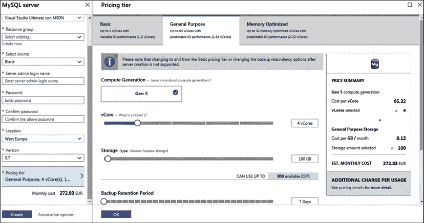
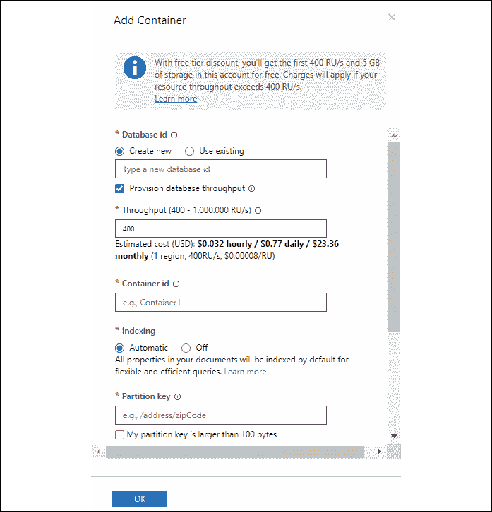
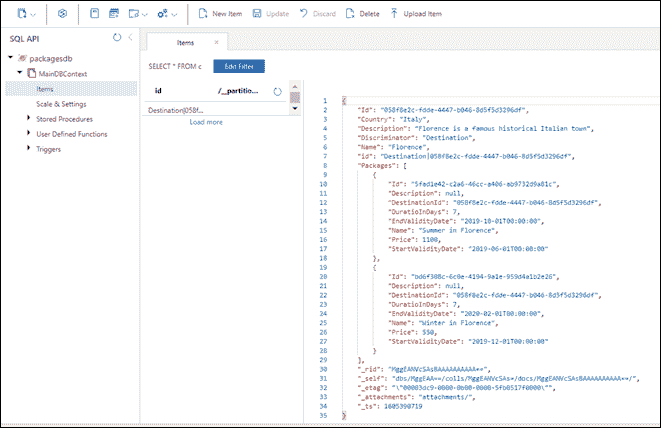

# 第九章：9

# 如何在云中选择您的数据存储

与其他云一样，Azure 提供了各种存储设备。最简单的方法是在云中定义一组可扩展的虚拟机，我们可以在其中实现自定义解决方案。例如，我们可以在云托管的虚拟机上创建 SQL Server 集群，以增加可靠性和计算能力。然而，通常情况下，自定义架构并不是最佳解决方案，并且无法充分利用云基础设施提供的机会。

因此，本章不会讨论这些自定义架构，而主要关注云中和 Azure 上可用的各种**平台即服务**（**PaaS**）存储方案。这些方案包括基于普通磁盘空间、关系型数据库、NoSQL 数据库和 Redis 等内存数据存储的可扩展解决方案。

选择更合适的存储类型不仅基于应用程序的功能要求，还基于性能和扩展要求。事实上，尽管在处理资源时进行扩展会导致性能线性增加，但扩展存储资源并不一定意味着性能会有可接受的增加。简而言之，无论您如何复制数据存储设备，如果多个请求影响相同的数据块，它们将始终排队等待相同的时间来访问它！

扩展数据会导致读操作吞吐量线性增加，因为每个副本可以处理不同的请求，但对于写操作的吞吐量并不意味着同样的增加，因为相同数据块的所有副本都必须更新！因此，需要更复杂的技术来扩展存储设备，并非所有存储引擎都能够同样良好地扩展。

在所有场景中，关系型数据库并不都能很好地扩展。因此，扩展需求和地理数据分布的需求在选择存储引擎以及 SaaS 提供方面起着基本作用。

在本章中，我们将涵盖以下主题：

+   了解不同用途的不同存储库

+   在关系型或 NoSQL 存储之间进行选择

+   Azure Cosmos DB - 管理多大陆数据库的机会

+   用例 - 存储数据

让我们开始吧！

# 技术要求

本章需要您具备以下内容：

+   Visual Studio 2019 免费社区版或更高版本，安装了所有数据库工具组件。

+   免费的 Azure 账户。*第一章*的*创建 Azure 账户*小节解释了如何创建账户。

+   为了获得更好的开发体验，我们建议您还安装 Cosmos DB 的本地模拟器，可以在[`aka.ms/cosmosdb-emulator`](https://aka.ms/cosmosdb-emulator)找到。

# 了解不同用途的不同存储库

本节描述了最流行的数据存储技术提供的功能。主要关注它们能够满足的功能要求。性能和扩展功能将在下一节中进行分析，该节专门比较关系型和 NoSQL 数据库。

在 Azure 中，可以通过在所有 Azure 门户页面顶部的搜索栏中输入产品名称来找到各种产品。

以下小节描述了我们在 C#项目中可以使用的各种数据库类型。

## 关系型数据库

关系数据库是最常见和研究的存储类型。随着它们的发展，社会保证了高水平的服务和无数的存储数据。已经设计了数十种应用程序来存储这种类型的数据库中的数据，我们可以在银行、商店、工业等领域找到它们。当您将数据存储在关系数据库中时，基本原则是定义您将在其中保存的实体和属性，并定义这些实体之间的正确关系。

几十年来，关系数据库是设计大型项目所想象的唯一选择。世界上许多大公司都建立了自己的数据库管理系统。Oracle、MySQL 和 MS SQL Server 被许多人列为您可以信任存储数据的数据库。

通常，云提供多种数据库引擎。Azure 提供各种流行的数据库引擎，如 Oracle、MySQL 和 SQL Server（Azure SQL）。

关于 Oracle 数据库引擎，Azure 提供可配置的虚拟机，上面安装了各种 Oracle 版本，您可以通过在 Azure 门户搜索栏中键入`Oracle`后获得的建议轻松验证。Azure 的费用不包括 Oracle 许可证；它们只包括计算时间，因此您必须自行携带许可证到 Azure。

在 Azure 上使用 MySQL，您需要支付使用私有服务器实例的费用。您产生的费用取决于您拥有的核心数、必须分配的内存量以及备份保留时间。

MySQL 实例是冗余的，您可以选择本地或地理分布式冗余：



图 9.1：在 Azure 上创建 MySQL 服务器

Azure SQL 是最灵活的选择。在这里，您可以配置每个数据库使用的资源。创建数据库时，您可以选择将其放置在现有服务器实例上，或创建一个新实例。在定义解决方案时，您可以选择几种定价选项，Azure 会不断增加它们，以确保您能够处理云中的数据。基本上，它们因您需要的计算能力而异。

例如，在**数据库事务单位**（**DTUs**）模型中，费用基于已预留的数据库存储容量和由参考工作负载确定的 I/O 操作、CPU 使用率和内存使用率的线性组合。粗略地说，当您增加 DTUs 时，最大的数据库性能会线性增加。


图 9.2：创建 Azure SQL 数据库

您还可以通过启用读取扩展来配置数据复制。这样，您可以提高读取操作的性能。备份保留对于每个提供级别（基本、标准和高级）都是固定的。

如果您选择**是**作为**是否要使用 SQL 弹性池？**的答案，数据库将被添加到弹性池中。添加到同一弹性池的数据库将共享其资源，因此未被数据库使用的资源可以在其他数据库的 CPU 使用高峰期间使用。值得一提的是，弹性池只能包含托管在同一服务器实例上的数据库。弹性池是优化资源使用以减少成本的有效方式。

## NoSQL 数据库

关系数据库带来的最大挑战之一是与数据库结构模式更改相关的问题。本世纪初所需的变化的灵活性带来了使用新数据库样式的机会，称为 NoSQL。这里有几种类型的 NoSQL 数据库：

+   **面向文档的数据库**：最常见的数据库类型，其中您有一个称为文档的键和复杂数据。

+   **图数据库**：社交媒体倾向于使用这种类型的数据库，因为数据存储为图形。

+   **键值数据库**：用于实现缓存的有用数据库，因为您有机会存储键值对。

+   **宽列存储数据库**：每行中相同的列可以存储不同的数据。

在 NoSQL 数据库中，关系表被更一般的集合所取代，这些集合可以包含异构的 JSON 对象。也就是说，集合没有预定义的结构，也没有预定义的字段长度约束（对于字符串），但可以包含任何类型的对象。与每个集合关联的唯一结构约束是充当主键的属性的名称。

更具体地说，每个集合条目都可以包含嵌套对象和嵌套在对象属性中的对象集合，即在关系数据库中包含在不同表中并通过外部键连接的相关实体。在 NoSQL 中，数据库可以嵌套在其父实体中。由于集合条目包含复杂的嵌套对象而不是简单的属性/值对，因此条目不被称为元组或行，而是*文档*。

无法在属于同一集合或不同集合的文档之间定义关系和/或外部键约束。如果文档在其属性中包含另一个文档的主键，那么它就自担风险。开发人员有责任维护和保持这些一致的引用。

最后，由于 NoSQL 存储相当便宜，整个二进制文件可以作为文档属性的值存储为 Base64 字符串。开发人员可以定义规则来决定在集合中索引哪些属性。由于文档是嵌套对象，属性是树路径。通常，默认情况下，所有路径都被索引，但您可以指定要索引的路径和子路径的集合。

NoSQL 数据库可以使用 SQL 的子集或基于 JSON 的语言进行查询，其中查询是 JSON 对象，其路径表示要查询的属性，其值表示已应用于它们的查询约束。

在关系数据库中，可以通过一对多关系来模拟在文档中嵌套子对象的可能性。但是，在关系数据库中，我们被迫重新定义所有相关表的确切结构，而 NoSQL 集合不对其包含的对象施加任何预定义的结构。唯一的约束是每个文档必须为主键属性提供唯一值。因此，当我们的对象结构非常可变时，NoSQL 数据库是唯一的选择。

然而，通常它们被选择是因为它们在扩展读写操作方面的性能优势，更一般地说，在分布式环境中的性能优势。它们的性能特性将在下一节中进行讨论，该节将它们与关系数据库进行比较。

图形数据模型是完全无结构文档的极端情况。整个数据库是一个图形，其中查询可以添加、更改和删除图形文档。

在这种情况下，我们有两种文档：节点和关系。虽然关系具有明确定义的结构（由关系连接的节点的主键加上关系的名称），但节点根本没有结构，因为在节点更新操作期间，属性及其值会被添加在一起。图形数据模型旨在表示人和他们操纵的对象（媒体、帖子等）以及它们在*社交应用程序*中的关系的特征。Gremlin 语言是专门为查询图形数据模型而设计的。我们不会在本章中讨论这一点，但在*进一步阅读*部分中有参考资料。

NoSQL 数据库将在本章的其余部分中进行详细分析，这些部分专门描述了 Azure Cosmos DB 并将其与关系数据库进行比较。

## Redis

`Redis`是基于键值对的分布式并发内存存储，支持分布式排队。它可以用作永久的内存存储，以及数据库数据的 Web 应用程序缓存。或者，它可以用作预渲染内容的缓存。

`Redis`还可以用于存储 Web 应用程序的用户会话数据。事实上，`ASP.NET Core`支持会话数据，以克服`HTTP`协议是无状态的事实。更具体地说，保持在页面更改之间的用户数据存储在服务器端存储中，例如`Redis`，并由存储在`cookies`中的会话密钥索引。

与云中的`Redis`服务器的交互通常基于提供易于使用界面的客户端实现。`.NET`和`.NET Core`的客户端可以通过`StackExchange.Redis` `NuGet`包获得。`StackExchange.Redis`客户端的基本操作已在[`stackexchange.github.io/StackExchange.Redis/Basics`](https://stackexchange.github.io/StackExchange.Redis/Basics)中记录，完整文档可以在[`stackexchange.github.io/StackExchange.Redis`](https://stackexchange.github.io/StackExchange.Redis)中找到。

在`Azure`上定义`Redis`服务器的用户界面非常简单：


图 9.3：创建`Redis`缓存

**定价层**下拉菜单允许我们选择可用的内存/复制选项之一。可以在[`docs.microsoft.com/en-us/azure/azure-cache-for-redis/cache-dotnet-core-quickstart`](https://docs.microsoft.com/en-us/azure/azure-cache-for-redis/cache-dotnet-core-quickstart)找到一个快速入门指南，该指南解释了如何在`.NET Core`客户端中使用`Azure Redis`凭据和`URI`。

## `Azure`存储账户

所有云都提供可扩展和冗余的通用磁盘内存，您可以将其用作虚拟机中的虚拟磁盘和/或外部文件存储。`Azure`的*存储账户*磁盘空间也可以结构化为**表**和**队列**。如果您需要廉价的`blob`存储，可以考虑使用此选项。但是，正如我们之前提到的，还有更复杂的选项。根据您的情况，`Azure NoSQL`数据库比表更好，`Azure Redis`比`Azure`存储队列更好。


图 9.4：创建存储账户

在本章的其余部分，我们将专注于`NoSQL`数据库以及它们与关系数据库的区别。接下来，我们将看看如何在两者之间进行选择。

# 在结构化或`NoSQL`存储之间进行选择

作为软件架构师，您可能会考虑结构化和`NoSQL`存储的一些方面，以决定最适合您的存储选项。在许多情况下，两者都是需要的。关键点在于您的数据有多有组织以及数据库将变得多大。

在前一节中，我们指出当数据几乎没有预定义的结构时，应优先选择`NoSQL`数据库。`NoSQL`数据库不仅使可变属性靠近其所有者，而且还使一些相关对象靠近，因为它们允许将相关对象嵌套在属性和集合中。

在关系数据库中可以表示非结构化数据，因为元组`t`的可变属性可以放在一个包含属性名称、属性值和`t`的外部键的连接表中。然而，在这种情况下的问题是性能。事实上，属于单个对象的属性值将分散在可用内存空间中。在小型数据库中，“分散在可用内存空间中”意味着远离但在同一磁盘上；在较大的数据库中，它意味着远离但在不同的磁盘单元中；在分布式云环境中，它意味着远离但在不同的 - 也可能是地理分布的 - 服务器中。

在 NoSQL 数据库设计中，我们总是试图将所有可能一起处理的相关对象放入单个条目中。访问频率较低的相关对象放在不同的条目中。由于外部键约束不会自动执行，而且 NoSQL 事务非常灵活，开发人员可以在性能和一致性之间选择最佳折衷方案。

因此，我们可以得出结论，当通常一起访问的表可以被存储在一起时，关系数据库的表现良好。另一方面，NoSQL 数据库会自动确保相关数据保持在一起，因为每个条目都将大部分相关数据作为嵌套对象保存在其中。因此，当它们分布到不同的内存和不同地理分布的服务器时，NoSQL 数据库的表现更好。

不幸的是，扩展存储写操作的唯一方法是根据*分片键*的值将集合条目分布到多个服务器上。例如，我们可以将所有以**A**开头的用户名记录放在一个服务器上，将以**B**开头的用户名记录放在另一个服务器上，依此类推。这样，具有不同起始字母的用户名的写操作可以并行执行，确保写吞吐量随着服务器数量的增加而线性增加。

然而，如果一个*分片*集合与其他几个集合相关联，就无法保证相关记录会被放在同一台服务器上。此外，将不同的集合放在不同的服务器上而不使用集合分片会使写吞吐量线性增加，直到达到单个服务器上的单个集合的限制，但这并不能解决被迫在不同服务器上执行多个操作以检索或更新通常一起处理的数据的问题。

这个问题对关系数据库的性能造成了灾难性的影响，如果访问相关的分布式对象必须是事务性的和/或必须确保结构约束（如外部键约束）不被违反。在这种情况下，所有相关的对象在事务期间必须被阻塞，防止其他请求在耗时的分布式操作的整个生命周期内访问它们。

NoSQL 数据库不会遇到这个问题，并且在分片和因此写扩展输出方面表现更好。这是因为它们不会将相关数据分布到不同的存储单元，而是将它们存储为同一数据库条目的嵌套对象。另一方面，它们遇到了不支持事务的不同问题。

值得一提的是，有些情况下关系数据库在分片时表现良好。一个典型的例子是多租户应用。在多租户应用中，所有条目集合可以被分成不重叠的集合，称为**租户**。只有属于同一个租户的条目才能相互引用，因此如果所有集合都按照它们的对象租户以相同的方式分片，那么所有相关记录最终都会在同一个分片中，也就是在同一个服务器上，并且可以被高效地导航。

多租户应用在云中并不罕见，因为所有为多个不同用户提供相同服务的应用通常都是作为多租户应用实现的，其中每个租户对应一个用户订阅。因此，关系数据库被设计为在云中工作，例如 Azure SQL Server，并通常为多租户应用提供分片选项。通常，分片不是云服务，必须使用数据库引擎命令来定义。在这里，我们不会描述如何使用 Azure SQL Server 定义分片，但*进一步阅读*部分包含了官方微软文档的链接。

总之，关系数据库提供了数据的纯逻辑视图，与实际存储方式无关，并使用声明性语言来查询和更新数据。这简化了开发和系统维护，但在需要写入扩展的分布式环境中可能会导致性能问题。在 NoSQL 数据库中，您必须手动处理有关如何存储数据以及所有更新和查询操作的一些过程性细节，但这使您能够在需要读取和写入扩展的分布式环境中优化性能。

在下一节中，我们将介绍 Azure Cosmos DB，这是 Azure 的主要 NoSQL 产品。

# Azure Cosmos DB - 管理多大陆数据库的机会

Azure Cosmos DB 是 Azure 的主要 NoSQL 产品。Azure Cosmos DB 具有自己的界面，是 SQL 的子集，但可以配置为具有 MongoDB 接口。它还可以配置为可以使用 Gremlin 查询的图形数据模型。Cosmos DB 允许复制以实现容错和读取扩展，并且副本可以在地理上分布以优化通信性能。此外，您可以指定所有副本放置在哪个数据中心。用户还可以选择启用所有副本的写入，以便在进行写入的地理区域立即可用。通过分片实现写入扩展，用户可以通过定义要用作分片键的属性来配置分片。

## 创建 Azure Cosmos DB 帐户

您可以通过在 Azure 门户搜索栏中键入`Cosmos DB`并单击**添加**来定义 Cosmos DB 帐户。将出现以下页面：


图 9.5：创建 Azure Cosmos DB 帐户

您选择的帐户名称将在资源 URI 中用作`{account_name}.documents.azure.com`。**API**下拉菜单可让您选择所需的接口类型（例如 SQL、MongoDB 或 Gremlin）。然后，您可以决定主数据库将放置在哪个数据中心，以及是否要启用地理分布式复制。启用地理分布式复制后，您可以选择要使用的副本数量以及放置它们的位置。

微软一直在改进其许多 Azure 服务。在撰写本书时，容量模式和笔记本的无服务器选项处于预览状态。了解任何 Azure 组件的新功能的最佳方法是不时查看其文档。

**多区域写入**切换允许您在地理分布的副本上启用写入。如果不这样做，所有写操作将被路由到主数据中心。最后，您还可以在创建过程中定义备份策略和加密。

## 创建 Azure Cosmos 容器

创建帐户后，选择**Data Explorer**来创建数据库和其中的容器。容器是预留吞吐量和存储的可扩展单位。

由于数据库只有名称而没有配置，您可以直接添加一个容器，然后将其放置在希望放置它的数据库中：



图 9.6：在 Azure Cosmos DB 中添加容器

在这里，您可以决定数据库和容器的名称以及用于分片的属性（分区键）。由于 NoSQL 条目是对象树，因此属性名称被指定为路径。您还可以添加值必须唯一的属性。

然而，唯一性 ID 在每个分片内进行检查，因此此选项仅在某些情况下有用，例如多租户应用程序（其中每个租户包含在单个分片中）。费用取决于您选择的集合吞吐量。

这是您需要将所有资源参数定位到您的需求的地方。吞吐量以每秒请求单位表示，其中每秒请求单位定义为执行每秒 1 KB 读取时的吞吐量。因此，如果选择*预留数据库吞吐量*选项，则所选的吞吐量将与整个数据库共享，而不是作为单个集合保留。

## 访问 Azure Cosmos 数据

创建 Azure Cosmos 容器后，您将能够访问数据。要获取连接信息，您可以选择**Keys**菜单。在那里，您将看到连接到您的应用程序的 Cosmos DB 帐户所需的所有信息。**连接信息页面**将为您提供帐户 URI 和两个连接密钥，这两个密钥可以互换使用以连接到帐户。


图 9.7：连接信息页面

还有具有只读权限的密钥。每个密钥都可以重新生成，每个帐户都有两个等效的密钥，就像许多其他 Azure 组件一样。这种方法使操作能够有效地处理；也就是说，当一个密钥被更改时，另一个密钥被保留。因此，在升级到新密钥之前，现有应用程序可以继续使用另一个密钥。 

## 定义数据库一致性

考虑到您处于分布式数据库的上下文中，Azure Cosmos DB 使您能够定义您将拥有的默认读一致性级别。通过在 Cosmos DB 帐户的主菜单中选择**默认一致性**，您可以选择要应用于所有容器的默认复制一致性。

可以在数据资源管理器或以编程方式中覆盖每个容器的默认设置。读/写操作中的一致性问题是数据复制的结果。具体来说，如果读操作在接收到不同部分更新的不同副本上执行，则各种读操作的结果可能不一致。

以下是可用的一致性级别。这些级别已经按从最弱到最强的顺序排列：

+   **最终一致性**：足够的时间过去后，如果没有进一步的写操作，所有读取将收敛并应用所有写操作。写入的顺序也不能保证，因此在处理写入时，您可能会读取先前读取的较早版本。

+   **一致性前缀**：所有写操作在所有副本上以相同的顺序执行。因此，如果有`n`个写操作，每次读取都与应用前`m`个写操作的结果一致，其中`m`小于或等于`n`。

+   **会话**：这与一致性前缀相同，但还保证每个写入者在所有后续读取操作中看到其自己写入的结果，并且每个读取者的后续读取是一致的（要么是相同的数据库，要么是更新的版本）。

+   **有界陈旧性**：这与延迟时间`Delta`或多个操作`N`相关联。每次读取都会看到在时间`Delta`（或最后`N`次操作）之前执行的所有写操作的结果。也就是说，它的读取与最大时间延迟`Delta`（或最大操作延迟`N`）的所有写操作的结果收敛。

+   **强一致性**：这是有界陈旧性与`Delta = 0`相结合。在这里，每次读取都反映了所有先前的写操作的结果。

最强的一致性可以通过牺牲性能来获得。默认情况下，一致性设置为**Session**，这是一致性和性能之间的良好折衷。较低级别的一致性在应用程序中很难处理，通常只有在会话是只读或只写时才可接受。

如果您在数据库容器的**Data Explorer**菜单中选择**Settings**选项，您可以配置要对哪些路径进行索引以及对每个路径的每种数据类型应用哪种类型的索引。配置由 JSON 对象组成。让我们分析其各种属性：

```cs
{
    "indexingMode": "consistent",
    "automatic": true,
    ... 
```

如果将`indexingMode`设置为`none`而不是`consistent`，则不会生成索引，并且集合可以用作由集合主键索引的键值字典。在这种情况下，不会生成**次要**索引，因此无法有效地进行搜索。当`automatic`设置为`true`时，所有文档属性都会自动索引：

```cs
{
    ...
    "includedPaths": [
        {
            "path": "/*",
            "indexes": [
                {
                    "kind": "Range",
                    "dataType": "Number",
                    "precision": -1
                },
                {
                    "kind": "Range",
                    "dataType": "String",
                    "precision": -1
                },
                {
                    "kind": "Spatial",
                    "dataType": "Point"
                }
            ]
        }
    ]
},
... 
```

`IncludedPaths`中的每个条目都指定了一个路径模式，例如`/subpath1/subpath2/?`（设置仅适用于`/subpath1/subpath2/property`）或`/subpath1/subpath2/*`（设置适用于以`/subpath1/subpath2/`开头的所有路径）。

当需要将设置应用于集合属性中包含的子对象时，模式包含`[]`符号；例如，`/subpath1/subpath2/[]/?`，`/subpath1/subpath2/[]/childpath1/?`等。设置指定要应用于每种数据类型（字符串、数字、地理点等）的索引类型。范围索引用于比较操作，而哈希索引在需要进行相等比较时更有效。

可以指定精度，即在所有索引键中使用的最大字符或数字的数量。`-1`表示最大精度，始终建议使用：

```cs
 ...
    "excludedPaths": [
   {
            "path": "/\"_etag\"/?"
        }
    ] 
```

`excludedPaths`中包含的路径根本不被索引。索引设置也可以以编程方式指定。

在这里，您有两种连接到 Cosmos DB 的选项：使用首选编程语言的官方客户端的版本，或者使用 Cosmos DB 的 Entity Framework Core 提供程序。在接下来的小节中，我们将看看这两个选项。然后，我们将描述如何使用 Cosmos DB 的 Entity Framework Core 提供程序，并提供一个实际示例。

## Cosmos DB 客户端

.NET 5 的 Cosmos DB 客户端可通过`Microsoft.Azure.Cosmos` NuGet 包获得。它提供了对所有 Cosmos DB 功能的完全控制，而 Cosmos DB Entity Framework 提供程序更易于使用，但隐藏了一些 Cosmos DB 的特殊性。按照以下步骤通过.NET 5 的官方 Cosmos DB 客户端与 Cosmos DB 进行交互。

以下代码示例显示了使用客户端组件创建数据库和容器。任何操作都需要创建客户端对象。不要忘记，当您不再需要它时，必须通过调用其`Dispose`方法（或将引用它的代码封装在`using`语句中）来处理客户端：

```cs
 public static async Task CreateCosmosDB()
{
    using var cosmosClient = new CosmosClient(endpoint, key);
    Database database = await 
        cosmosClient.CreateDatabaseIfNotExistsAsync(databaseId);
    ContainerProperties cp = new ContainerProperties(containerId,
        "/DestinationName");
    Container container = await database.CreateContainerIfNotExistsAsync(cp);
    await AddItemsToContainerAsync(container);
} 
```

在创建集合时，可以传递`ContainerProperties`对象，其中可以指定一致性级别、如何对属性进行索引以及所有其他集合功能。

然后，您必须定义与您需要在集合中操作的 JSON 文档结构相对应的.NET 类。如果它们不相等，您还可以使用`JsonProperty`属性将类属性名称映射到 JSON 名称：

```cs
public class Destination
{
    [JsonProperty(PropertyName = "id")]
    public string Id { get; set; }
    public string DestinationName { get; set; }
    public string Country { get; set; }
    public string Description { get; set; }
    public Package[] Packages { get; set; }
} 
```

一旦您拥有所有必要的类，您可以使用客户端方法`ReadItemAsync`，`CreateItemAsync`和`DeleteItemAsync`。您还可以使用接受 SQL 命令的`QueryDefinition`对象来查询数据。您可以在[`docs.microsoft.com/en-us/azure/cosmos-db/sql-api-get-started`](https://docs.microsoft.com/en-us/azure/cosmos-db/sql-api-get-started)找到有关此库的完整介绍。

## Cosmos DB Entity Framework Core 提供程序

Entity Framework Core 的 Cosmos DB 提供程序包含在`Microsoft.EntityFrameworkCore.Cosmos` NuGet 包中。一旦将其添加到项目中，您可以以类似的方式进行操作，就像在*第八章*中使用 SQL Server 提供程序时一样，但有一些不同之处。让我们看看：

+   由于 Cosmos DB 数据库没有结构需要更新，因此没有迁移。相反，它们有一种方法可以确保数据库以及所有必要的集合被创建：

```cs
context.Database.EnsureCreated(); 
```

+   默认情况下，从`DBContext`映射到唯一容器的`DbSet<T>`属性，因为这是最便宜的选项。您可以通过显式指定要将某些实体映射到哪个容器来覆盖此默认设置，方法是使用以下配置指令：

```cs
builder.Entity<MyEntity>()
     .ToContainer("collection-name"); 
```

+   实体类上唯一有用的注释是`Key`属性，当主键不叫`Id`时，它就变得强制性了。

+   主键必须是字符串，不能自动增加以避免在分布式环境中出现同步问题。主键的唯一性可以通过生成 GUID 并将其转换为字符串来确保。

+   在定义实体之间的关系时，您可以指定一个实体或实体集合是由另一个实体拥有的，这种情况下它将与父实体一起存储。

我们将在下一节中查看 Cosmos DB 的 Entity Framework 提供程序的用法。

# 用例-存储数据

现在我们已经学会了如何使用 NoSQL，我们必须决定 NoSQL 数据库是否适合我们的书籍使用案例 WWTravelClub 应用程序。我们需要存储以下数据系列：

+   **有关可用目的地和套餐的信息**：此数据的相关操作是读取，因为套餐和目的地不经常更改。但是，它们必须尽可能快地从世界各地访问，以确保用户在浏览可用选项时有愉快的体验。因此，可能存在具有地理分布副本的分布式关系数据库，但并非必需，因为套餐可以存储在更便宜的 NoSQL 数据库中。

+   **目的地评论**：在这种情况下，分布式写操作会产生不可忽略的影响。此外，大多数写入都是添加，因为评论通常不会更新。添加受益于分片，并且不像更新那样会导致一致性问题。因此，这些数据的最佳选择是 NoSQL 集合。

+   **预订**：在这种情况下，一致性错误是不可接受的，因为它们可能导致超额预订。读取和写入具有可比较的影响，但我们需要可靠的事务和良好的一致性检查。幸运的是，数据可以组织在一个多租户数据库中，其中租户是目的地，因为属于不同目的地的预订信息是完全不相关的。因此，我们可以使用分片的 SQL Azure 数据库实例。

总之，第一和第二个要点的数据的最佳选择是 Cosmos DB，而第三个要点的最佳选择是 Azure SQL Server。实际应用可能需要对所有数据操作及其频率进行更详细的分析。在某些情况下，值得为各种可能的选项实施原型，并在所有选项上使用典型工作负载执行性能测试。

在本节的其余部分，我们将迁移我们在*第八章* *与 C#中的数据交互-Entity Framework Core*中查看的目的地/套餐数据层到 Cosmos DB。

## 使用 Cosmos DB 实现目的地/套餐数据库

让我们继续按照以下步骤将我们在*第八章* *与 C#中的数据交互-Entity Framework Core*中构建的数据库示例迁移到 Cosmos DB：

1.  首先，我们需要复制 WWTravelClubDB 项目，并将`WWTravelClubDBCosmo`作为新的根文件夹。

1.  打开项目并删除迁移文件夹，因为不再需要迁移。

1.  我们需要用 Cosmos DB 提供程序替换 SQL Server Entity Framework 提供程序。为此，请转到**管理 NuGet 包**并卸载`Microsoft.EntityFrameworkCore.SqlServer` NuGet 包。然后，安装`Microsoft.EntityFrameworkCore.Cosmos` NuGet 包。

1.  然后，在`Destination`和`Package`实体上执行以下操作：

+   删除所有数据注释。

+   为它们的 `Id` 属性添加 `[Key]` 属性，因为这对于 Cosmos DB 提供程序是强制性的。

+   将 `Package` 和 `Destination` 的 `Id` 属性的类型，以及 `PackagesListDTO` 类从 `int` 转换为 `string`。我们还需要将 `Package` 和 `PackagesListDTO` 类中的 `DestinationId` 外部引用转换为 `string`。实际上，在分布式数据库中，使用 GUID 生成的字符串作为键是最佳选择，因为在表数据分布在多个服务器之间时，很难维护标识计数器。

1.  在 `MainDBContext` 文件中，我们需要指定与目的地相关的包必须存储在目的地文档本身内。这可以通过在 `OnModelCreatingmethod` 方法中替换 Destination-Package 关系配置来实现，代码如下：

```cs
builder.Entity<Destination>()
    .OwnsMany(m =>m.Packages); 
```

1.  在这里，我们必须用 `OwnsMany` 替换 `HasMany`。没有等效于 `WithOne`，因为一旦实体被拥有，它必须只有一个所有者，并且 `MyDestination` 属性包含对父实体的指针的事实从其类型中显而易见。Cosmos DB 也允许使用 `HasMany`，但在这种情况下，这两个实体不是相互嵌套的。还有一个用于将单个实体嵌套在其他实体内的 `OwnOne` 配置方法。

1.  实际上，对于关系数据库，`OwnsMany` 和 `OwnsOne` 都是可用的，但在这种情况下，`HasMany` 和 `HasOne` 之间的区别在于子实体会自动包含在返回其父实体的所有查询中，无需指定 `Include` LINQ 子句。但是，子实体仍然存储在单独的表中。

1.  `LibraryDesignTimeDbContextFactory` 必须修改为使用 Cosmos DB 连接数据，如下所示的代码：

```cs
using Microsoft.EntityFrameworkCore;
using Microsoft.EntityFrameworkCore.Design;
namespace WWTravelClubDB
{
    public class LibraryDesignTimeDbContextFactory
        : IDesignTimeDbContextFactory<MainDBContext>
    {
        private const string endpoint = "<your account endpoint>";
        private const string key = "<your account key>";
        private const string databaseName = "packagesdb";
        public "MainDBContext CreateDbContext"(params string[] args)
        {
            var builder = new DbContextOptionsBuilder<Main
DBContext>();
builder.UseCosmos(endpoint, key, databaseName);
            return new MainDBContext(builder.Options);
        }
    }
} 
```

1.  最后，在我们的测试控制台中，我们必须明确使用 GUID 创建所有实体主键：

```cs
var context = new LibraryDesignTimeDbContextFactory()
    .CreateDbContext();
context.Database.EnsureCreated();
var firstDestination = new Destination
{
    Id = Guid.NewGuid().ToString(),
    Name = "Florence",
    Country = "Italy",
    Packages = new List<Package>()
    {
    new Package
    {
        Id=Guid.NewGuid().ToString(),
        Name = "Summer in Florence",
        StartValidityDate = new DateTime(2019, 6, 1),
        EndValidityDate = new DateTime(2019, 10, 1),
        DuratioInDays=7,
        Price=1000
    },
    new Package
    {
        Id=Guid.NewGuid().ToString(),
        Name = "Winter in Florence",
        StartValidityDate = new DateTime(2019, 12, 1),
        EndValidityDate = new DateTime(2020, 2, 1),
        DuratioInDays=7,
        Price=500
    }
    }
}; 
```

1.  在这里，我们调用 `context.Database.EnsureCreated()` 而不是应用迁移，因为我们只需要创建数据库。一旦数据库和集合被创建，我们可以从 Azure 门户微调它们的设置。希望未来版本的 Cosmos DB Entity Framework Core 提供程序将允许我们指定所有集合选项。

1.  最后，以 `context.Packages.Where...` 开头的最终查询必须进行修改，因为查询不能以嵌套在其他文档中的实体（在我们的情况下是 `Packages` 实体）开头。因此，我们必须从我们的 `DBContext` 中唯一的根 `DbSet<T>` 属性开始查询，即 `Destinations`。我们可以通过 `SelectMany` 方法从列出外部集合转到列出所有内部集合，该方法执行所有嵌套 `Packages` 集合的逻辑合并。但是，由于 `CosmosDB` SQL 不支持 `SelectMany`，我们必须强制在客户端上模拟 `SelectMany`，如下所示的代码：

```cs
var list = context.Destinations
    .AsEnumerable() // move computation on the client side
    .SelectMany(m =>m.Packages)
    .Where(m => period >= m.StartValidityDate....)
    ... 
```

1.  查询的其余部分保持不变。如果现在运行项目，您应该看到与 SQL Server 情况下收到的相同输出（除了主键值）。

1.  执行程序后，转到您的 Cosmos DB 帐户。您应该看到类似以下内容的内容：

图 9.8：执行结果

根据要求，包已嵌套在其目的地内，并且 Entity Framework Core 创建了一个与 `DBContext` 类同名的唯一集合。

如果您想继续尝试 Cosmos DB 开发而不浪费所有免费的 Azure 门户信用，您可以安装位于以下链接的 Cosmos DB 模拟器：[`aka.ms/cosmosdb-emulator`](https://aka.ms/cosmosdb-emulator)。

# 总结

在本章中，我们了解了 Azure 中可用的主要存储选项，并学会了何时使用它们。然后，我们比较了关系数据库和 NoSQL 数据库。我们指出，关系数据库提供自动一致性检查和事务隔离，但 NoSQL 数据库更便宜，性能更好，特别是在分布式写入占平均工作负载的高比例时。

然后，我们描述了 Azure 的主要 NoSQL 选项 Cosmos DB，并解释了如何配置它以及如何与客户端连接。

最后，我们学习了如何使用实体框架核心与 Cosmos DB 进行交互，并查看了基于 WWTravelClubDB 用例的实际示例。在这里，我们学习了如何在应用程序中涉及的所有数据族之间决定关系和 NoSQL 数据库之间的选择。这样，您可以选择确保在每个应用程序中数据一致性、速度和并行访问之间取得最佳折衷的数据存储方式。

在下一章中，我们将学习有关无服务器和 Azure 函数的所有内容。

# 问题

1.  Redis 是否是关系数据库的有效替代品？

1.  NoSQL 数据库是否是关系数据库的有效替代品？

1.  在关系数据库中，哪种操作更难扩展？

1.  NoSQL 数据库的主要弱点是什么？它们的主要优势是什么？

1.  您能列出所有 Cosmos DB 的一致性级别吗？

1.  我们可以在 Cosmos DB 中使用自增整数键吗？

1.  哪种实体框架配置方法用于将实体存储在其相关的父文档中？

1.  在 Cosmos DB 中，可以有效地搜索嵌套集合吗？

# 进一步阅读

+   在本章中，我们没有讨论如何在 Azure SQL 中定义分片。如果您想了解更多信息，请访问官方文档链接：[`docs.microsoft.com/en-us/azure/sql-database/sql-database-elastic-scale-introduction`](https://docs.microsoft.com/en-us/azure/sql-database/sql-database-elastic-scale-introduction)。

+   Cosmos DB 在本章中有详细描述，但更多细节可以在官方文档中找到：[`docs.microsoft.com/en-us/azure/cosmos-db/`](https://docs.microsoft.com/en-us/azure/cosmos-db/)。

+   以下是 Gremlin 语言的参考，它受 Cosmos DB 支持：[`tinkerpop.apache.org/docs/current/reference/#graph-traversal-steps`](http://tinkerpop.apache.org/docs/current/reference/#graph-traversal-steps)。

+   以下是 Cosmos DB 图形数据模型的一般描述：[`docs.microsoft.com/en-us/azure/cosmos-db/graph-introduction`](https://docs.microsoft.com/en-us/azure/cosmos-db/graph-introduction)。

+   有关如何使用 Cosmos DB 的官方.NET 客户端的详细信息，请参阅[`docs.microsoft.com/en-us/azure/cosmos-db/sql-api-dotnetcore-get-started`](https://docs.microsoft.com/en-us/azure/cosmos-db/sql-api-dotnetcore-get-started)。我们在本章中提到的`MvcControlsToolkit.Business.DocumentDB` NuGet 包的良好介绍是 DNCMagazine 第 34 期中包含的*使用 DocumentDB 包快速进行 Azure Cosmos DB 开发*文章。可从[`www.dotnetcurry.com/microsoft-azure/aspnet-core-cosmos-db-documentdb`](https://www.dotnetcurry.com/microsoft-azure/aspnet-core-cosmos-db-documentdb)下载。
