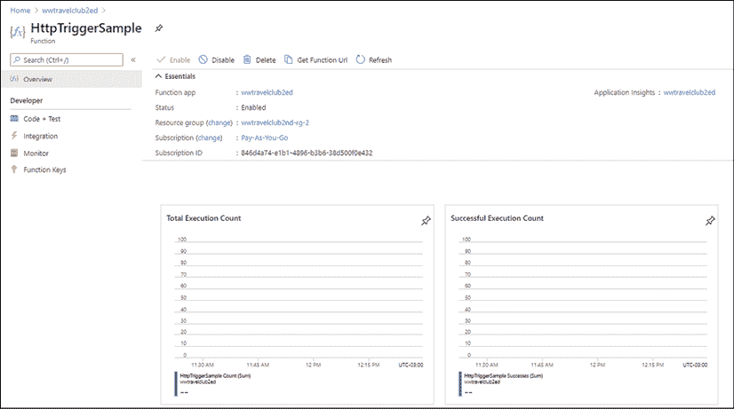
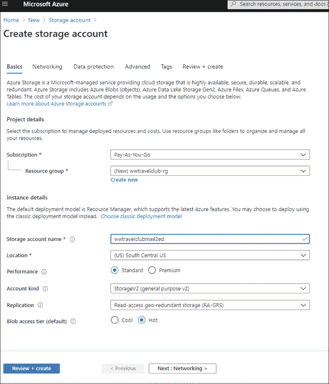
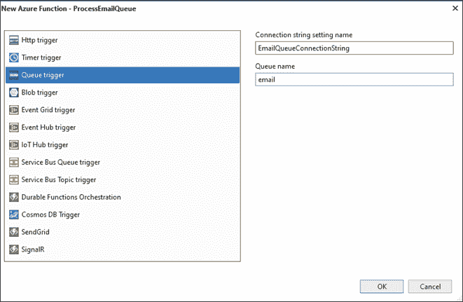
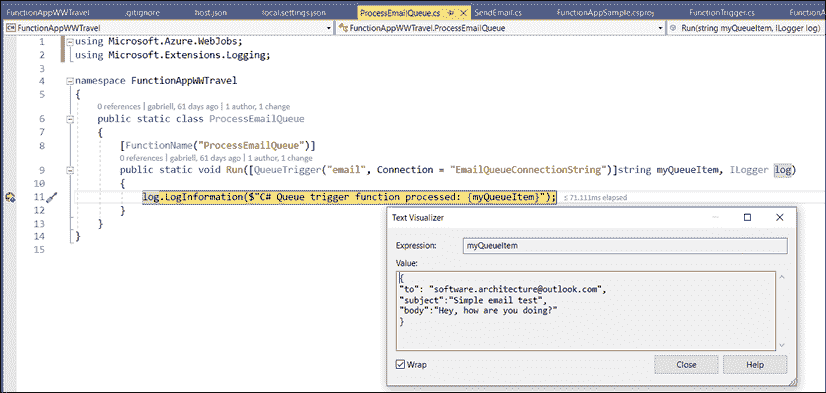

# 第十章：10

# 使用 Azure Functions

正如我们在*第四章*中提到的，无服务器架构是提供灵活软件解决方案的最新方式之一。为此，Microsoft Azure 提供了 Azure Functions，这是一种事件驱动、无服务器且可扩展的技术，可以加速您的项目开发。本章的主要目标是让您熟悉 Azure Functions 以及在使用它时可以实施的最佳实践。值得一提的是，使用 Azure Functions 是一个很好的选择，可以加速您的开发，为您提供无服务器实现的替代方案。借助它们，您可以更快地部署 API，启用由定时器触发的服务，甚至通过接收存储事件来触发流程。

在本章中，我们将涵盖以下主题：

+   了解 Azure Functions 应用程序

+   使用 C#编程 Azure Functions

+   维护 Azure Functions

+   用例-实现 Azure Functions 发送电子邮件

通过本章结束时，您将了解如何使用 C#中的 Azure Functions 来加快开发周期。

# 技术要求

本章要求您具备以下条件：

+   Visual Studio 2019 免费社区版或更高版本，所有 Azure 工具都已安装。

+   一个免费的 Azure 账户。*第一章*的*创建 Azure 账户*部分解释了如何创建。

您可以在[`github.com/PacktPublishing/Software-Architecture-with-C-9-and-.NET-5/tree/master/ch10`](https://github.com/PacktPublishing/Software-Architecture-with-C-9-and-.NET-5/tree/master/ch10)找到本章的示例代码。

# 了解 Azure Functions 应用程序

Azure Functions 应用程序是 Azure PaaS，您可以在其中构建代码片段（函数），并将它们连接到您的应用程序，并使用触发器启动它们。这个概念非常简单-您可以用您喜欢的语言编写函数，并决定启动它的触发器。您可以在系统中编写尽可能多的函数。有些情况下，整个系统都是用函数编写的。

创建必要环境的步骤与创建函数本身的步骤一样简单。以下屏幕截图显示了创建环境时必须决定的参数。在 Azure 中选择**创建资源**并按**Function App**进行筛选，然后单击**创建**按钮，您将看到以下屏幕：


图 10.1：创建 Azure 函数

在创建 Azure Functions 环境时，有几个关键点需要考虑。随着时间的推移，运行函数的可能性不断增加，编程语言选项和发布样式也在不断增加。我们最重要的配置之一是托管计划，这是您运行函数的地方。托管计划有三个选项：消耗（无服务器）、高级和应用服务计划。现在让我们来谈谈这些。

## 消耗计划

如果您选择消耗计划，您的函数只会在执行时消耗资源。这意味着只有在函数运行时才会收费。可扩展性和内存资源将由 Azure 自动管理。这确实是我们所说的无服务器。

在编写此计划中的函数时，我们需要注意超时。默认情况下，函数将在 5 分钟后超时。您可以使用`host.json`文件中的`functionTimeout`参数更改超时值。最大值为 10 分钟。

当您选择消耗计划时，您将被收取费用的方式取决于您执行的内容、执行时间和内存使用情况。有关更多信息，请访问[`azure.microsoft.com/en-us/pricing/details/functions/`](https://azure.microsoft.com/en-us/pricing/details/functions/)。

请注意，当您的环境中没有应用服务，并且您正在运行低周期性的函数时，这可能是一个不错的选择。另一方面，如果您需要持续处理，您可能需要考虑应用服务计划。

## 高级计划

根据您使用函数的方式，特别是如果它们需要持续运行或几乎持续运行，或者如果某些函数执行时间超过 10 分钟，您可能需要考虑使用高级计划。此外，您可能需要将函数连接到 VNET/VPN 环境，在这种情况下，您将被迫在此计划中运行。

您可能还需要比消耗计划提供的更多 CPU 或内存选项。高级计划为您提供了一个核心、两个核心和四个核心的实例选项。

值得一提的是，即使您有无限的时间来运行函数，如果您决定使用 HTTP 触发函数，响应请求的最大允许时间为 230 秒。这个限制的原因与 Azure 负载均衡器有关。在这种情况下，您可能需要重新设计您的解决方案，以符合 Microsoft 设置的最佳实践（[`docs.microsoft.com/en-us/azure/azure-functions/functions-best-practices`](https://docs.microsoft.com/en-us/azure/azure-functions/functions-best-practices)）。

## 应用服务计划

应用服务计划是您在创建 Azure 函数应用时可以选择的选项之一。以下是一些（由 Microsoft 建议的）您应该使用应用服务计划而不是消耗计划来维护函数的原因列表：

+   您可以使用未充分利用的现有应用服务实例。

+   您想在自定义镜像上运行函数应用。

在应用服务计划方案中，`functionTimeout`值根据 Azure 函数运行时版本而变化。但是，该值至少为 30 分钟。您可以在[`docs.microsoft.com/en-us/azure/azure-functions/functions-scale#timeout`](https://docs.microsoft.com/en-us/azure/azure-functions/functions-scale#timeout)找到每个消耗计划中超时的表格比较。

# 使用 C#编程 Azure 函数

在本节中，您将学习如何创建 Azure 函数。值得一提的是，有几种使用 C#创建函数的方法。第一种方法是在 Azure 门户中创建函数并在其中开发它们。为此，让我们假设您已经创建了一个 Azure 函数应用，并且配置与本章开头的屏幕截图类似。

通过选择创建的资源并导航到**函数**菜单，您将能够在此环境中**添加**新的函数，如下面的屏幕截图所示：


图 10.2：添加函数

在这里，您需要决定要使用的触发器类型来启动执行。最常用的是**HTTP 触发器**和**定时器触发器**。第一个可以创建一个将触发函数的 HTTP API。第二个意味着函数将由根据您的决定设置的定时器触发。

当您决定要使用的触发器时，您必须为函数命名。根据您决定的触发器，您将不得不设置一些参数。例如，HTTP 触发器要求您设置授权级别。有三个选项可用，即**函数**、**匿名**和**管理员**：


图 10.3：配置 HTTP 函数

值得一提的是，本书并未涵盖在构建函数时可用的所有选项。作为软件架构师，您应该了解 Azure 在函数方面提供了良好的无服务器架构服务。这在几种情况下都可能很有用。这在*第四章*，*决定最佳基于云的解决方案*中有更详细的讨论。

其结果如下。请注意，Azure 提供了一个编辑器，允许我们运行代码，检查日志，并测试我们创建的函数。这是一个用于测试和编写基本函数的良好界面：



图 10.4：HTTP 函数环境

然而，如果您想创建更复杂的函数，您可能需要一个更复杂的环境，以便您可以更有效地编写和调试它们。这就是 Visual Studio Azure 函数项目可以帮助您的地方。此外，使用 Visual Studio 执行函数的开发将使您朝着为函数使用源代码控制和 CI/CD 的方向迈进。

在 Visual Studio 中，您可以通过转到**创建新项目**来创建一个专用于 Azure 函数的项目：


图 10.5：在 Visual Studio 2019 中创建 Azure 函数项目

提交项目后，Visual Studio 将询问您正在使用的触发器类型以及您的函数将在哪个 Azure 版本上运行：


图 10.6：创建新的 Azure 函数应用程序

值得一提的是，Azure 函数支持不同的平台和编程语言。在撰写本文时，Azure 函数有三个运行时版本，C#可以在所有这些版本中运行。第一个版本兼容.NET Framework 4.7。在第二个版本中，您可以创建在.NET Core 2.2 上运行的函数。在第三个版本中，您将能够运行.NET Core 3.1 和.NET 5。

作为软件架构师，您必须牢记代码的可重用性。在这种情况下，您应该注意选择在哪个版本的 Azure 函数项目中构建您的函数。然而，建议您始终使用最新版本的运行时，一旦它获得一般可用性状态。

默认情况下，生成的代码与在 Azure 门户中创建 Azure 函数时生成的代码相似：

```cs
using System;
using Microsoft.Azure.WebJobs;
using Microsoft.Extensions.Logging;
namespace FunctionAppSample
{
    public static class FunctionTrigger
    {
        [FunctionName("FunctionTrigger")]
        public static void Run([TimerTrigger("0 */5 * * * *")]
            TimerInfo myTimer, ILogger log)
        {
             log.LogInformation($"C# Timer trigger function " +
                 $"executed at: {DateTime.Now}");
        }
    }
} 
```

发布方法遵循与我们在《第一章》*理解软件架构的重要性*中描述的 Web 应用程序的发布过程相同的步骤。然而，建议始终使用 CI/CD 管道，正如我们将在《第二十章》*理解 DevOps 原则*中描述的那样。

## 列出 Azure 函数模板

Azure 门户中有几个模板可供您使用以创建 Azure 函数。您可以不断更新可选择的模板数量。以下只是其中的一些：

+   Blob 触发器：您可能希望在文件上传到 blob 存储时立即处理某些内容。这可以是 Azure 函数的一个很好的用例。

+   Cosmos DB 触发器：您可能希望将到达 Cosmos DB 数据库的数据与处理方法同步。Cosmos DB 在《第九章》*如何选择云中的数据存储*中有详细讨论。

+   事件网格触发器：这是管理 Azure 事件的一种好方法。函数可以被触发以便它们管理每个事件。

+   事件中心触发器：使用此触发器，您可以构建与将数据发送到 Azure 事件中心的任何系统相关联的函数。

+   HTTP 触发器：此触发器对于构建无服务器 API 和 Web 应用程序事件非常有用。

+   IoT Hub 触发器：当您的应用程序通过 IoT Hub 与设备连接时，您可以在设备中收到新事件时使用此触发器。

+   队列触发器：您可以使用函数作为服务解决方案来处理队列处理。

+   服务总线队列触发器：这是另一个可以成为函数触发器的消息传递服务。Azure 服务总线将在《第十一章》*设计模式和.NET 5 实现*中进行更详细的介绍。

+   定时器触发器：这通常与函数一起使用，您可以在其中指定时间触发器，以便可以持续处理来自系统的数据。

# 维护 Azure 函数

创建和编程函数后，您需要监视和维护它。为此，您可以使用各种工具，所有这些工具都可以在 Azure 门户中找到。这些工具将帮助您解决问题，因为您将能够收集大量信息。

在监视函数时的第一个选项是在 Azure 门户中的 Azure 函数界面内使用“监视”菜单。在那里，您将能够检查所有函数执行，包括成功的结果和失败的结果：


图 10.7：监控函数

任何结果可用需要大约 5 分钟。网格中显示的日期是 UTC 时间。

通过单击“在 Application Insights 中运行查询”，相同的界面允许您连接到此工具。这将带您进入一个几乎无限的选项世界，您可以使用它来分析您的函数数据。Application Insights 是当今最好的“应用程序性能管理”（APM）系统之一：


图 10.8：使用 Application Insights 进行监控

除了查询界面，您还可以使用 Azure 门户中的 Insights 界面检查函数的所有性能问题。在那里，您可以分析和过滤已收到的所有请求，并检查它们的性能和依赖关系。当您的一个端点发生异常时，您还可以触发警报：


图 10.9：使用 Application Insights 实时指标监控

作为软件架构师，您会发现这个工具对您的项目是一个很好的日常助手。值得一提的是，Application Insights 还适用于其他几个 Azure 服务，例如 Web 应用程序和虚拟机。这意味着您可以使用 Azure 提供的出色功能来监视系统的健康状况并进行维护。

# 用例 - 实现 Azure 函数发送电子邮件

在这里，我们将使用我们之前描述的 Azure 组件的子集。WWTravelClub 的用例提出了该服务的全球实施，并且有可能该服务将需要不同的架构设计来应对我们在*第一章*“理解软件架构的重要性”中描述的所有性能关键点。

如果您回顾一下在*第一章*“理解软件架构的重要性”中描述的用户故事，您会发现许多需求与通信有关。因此，在解决方案中通常会通过电子邮件提供一些警报。本章的用例将重点介绍如何发送电子邮件。该架构将完全无服务器。

以下图表显示了架构的基本结构。为了给用户带来良好的体验，应用程序发送的所有电子邮件都将以异步方式排队，从而防止系统响应出现显着延迟：


图 10.10：发送电子邮件的架构设计

请注意，没有服务器管理 Azure 函数来对 Azure 队列存储中的消息进行入队或出队操作。这正是我们所说的无服务器。值得一提的是，这种架构不仅限于发送电子邮件 - 它也可以用于处理任何 HTTP`POST`请求。

现在，我们将学习如何在 API 中设置安全性，以便只有经过授权的应用程序可以使用给定的解决方案。

## 第一步 - 创建 Azure 队列存储

在 Azure 门户中创建存储非常简单。让我们来学习如何操作。首先，您需要通过单击 Azure 门户主页上的**创建资源**来创建一个存储账户，并搜索**存储账户**。然后，您可以设置其基本信息，如**存储账户名称**和**位置**。此向导还可以检查有关**网络**和**数据保护**的信息，如下图所示。这些设置有默认值，将覆盖演示：



图 10.11：创建 Azure 存储账户

一旦您设置好存储账户，您就可以设置一个队列。您可以通过单击存储账户中的**概述**链接并选择**队列**选项，或者通过存储账户菜单选择**队列**来找到此选项。然后，您将找到一个添加队列的选项（**+队列**），您只需要提供其名称即可：


图 10.12：定义监视电子邮件的队列

创建的队列将在 Azure 门户中为您提供概览。在那里，您将找到您的队列的 URL 并使用 Storage Explorer：


图 10.13：创建的队列

请注意，您还可以使用 Microsoft Azure Storage Explorer 连接到此存储（[`azure.microsoft.com/en-us/features/storage-explorer/`](https://azure.microsoft.com/en-us/features/storage-explorer/)）：


图 10.14：使用 Microsoft Azure Storage Explorer 监视队列

如果您没有连接到 Azure 门户，此工具尤其有用。

## 第二步 - 创建发送电子邮件的函数

现在，您可以认真开始编程，通知队列等待发送电子邮件。在这里，我们需要使用 HTTP 触发器。请注意，该函数是一个静态类，可以异步运行。以下代码正在收集来自 HTTP 触发器的请求数据，并将数据插入稍后将处理的队列中：

```cs
public static class SendEmail
{
    [FunctionName(nameof(SendEmail))]
    public static async Task<HttpResponseMessage>RunAsync( [HttpTrigger(AuthorizationLevel.Function, "post")] HttpRequestMessage req, ILogger log)
    {
        var requestData = await req.Content.ReadAsStringAsync();
        var connectionString = Environment.GetEnvironmentVariable("AzureQueueStorage");
        var storageAccount = CloudStorageAccount.Parse(connectionString);
        var queueClient = storageAccount.CreateCloudQueueClient();
        var messageQueue = queueClient.GetQueueReference("email");
        var message = new CloudQueueMessage(requestData);
        await messageQueue.AddMessageAsync(message);
        log.LogInformation("HTTP trigger from SendEmail function processed a request.");
        var responseObj = new { success = true };
        return new HttpResponseMessage(HttpStatusCode.OK)
        {
            Content = new StringContent(JsonConvert.SerializeObject(responseObj), Encoding.UTF8, "application/json"),
         };
    }
} 
```

在某些情况下，您可以尝试避免使用前面代码中指示的队列设置，而是使用队列输出绑定。在[`docs.microsoft.com/en-us/azure/azure-functions/functions-bindings-storage-queue-output?tabs=csharp`](https://docs.microsoft.com/en-us/azure/azure-functions/functions-bindings-storage-queue-output?tabs=)上查看详细信息。

您可以使用诸如 Postman 之类的工具通过运行 Azure Functions 模拟器来测试函数：


图 10.15：Postman 函数测试

结果将出现在 Microsoft Azure Storage Explorer 和 Azure 门户中。在 Azure 门户中，您可以管理每条消息并出列每条消息，甚至清除队列存储：


图 10.16：HTTP 触发器和队列存储测试

## 第三步 - 创建队列触发函数

之后，您可以创建第二个函数。这个函数将由进入队列的数据触发。值得一提的是，对于 Azure Functions v3，您将自动将`Microsoft.Azure.WebJobs.Extensions.Storage`库添加为 NuGet 引用：



图 10.17：创建队列触发

一旦您在`local.settings.json`中设置了连接字符串，您就可以运行这两个函数并使用 Postman 进行测试。不同之处在于，如果第二个函数正在运行，如果您在其开头设置断点，您将检查消息是否已发送：



图 10.18：在 Visual Studio 2019 中触发队列

从这一点开始，发送电子邮件的方式将取决于您拥有的邮件选项。您可以决定使用代理或直接连接到您的电子邮件服务器。

以这种方式创建电子邮件服务有几个优势：

+   一旦您的服务已编码并经过测试，您就可以使用它从任何应用程序发送电子邮件。这意味着您的代码可以始终被重用。

+   使用此服务的应用程序不会因为在 HTTP 服务中发布异步优势而停止发送电子邮件。

+   不需要池化队列来检查数据是否准备好进行处理。

最后，队列进程并发运行，这在大多数情况下提供了更好的体验。可以通过在`host.json`中设置一些属性来关闭它。所有这些选项都可以在本章末尾的*进一步阅读*部分找到。

# 总结

在本章中，我们看了一些使用无服务器 Azure 函数开发功能的优势。您可以将其用作检查 Azure Functions 中可用的不同类型触发器和计划如何监视它们的指南。我们还看到了如何编程和维护 Azure 函数。最后，我们看了一个架构示例，其中您可以连接多个函数以避免池化数据并实现并发处理。

在下一章中，我们将分析设计模式的概念，了解它们为什么如此有用，并了解一些常见模式。

# 问题

1.  Azure 函数是什么？

1.  Azure 函数的编程选项是什么？

1.  可以与 Azure 函数一起使用的计划是什么？

1.  如何使用 Visual Studio 部署 Azure 函数？

1.  可以使用哪些触发器来开发 Azure 函数？

1.  Azure Functions v1、v2 和 v3 有什么区别？

1.  应用程序洞察如何帮助我们维护和监视 Azure 函数？

# 进一步阅读

如果您想了解有关创建 Azure 函数的更多信息，请查看以下链接：

+   Azure 函数的规模和托管：[`docs.microsoft.com/en-us/azure/azure-functions/functions-scale`](https://docs.microsoft.com/en-us/azure/azure-functions/functions-scale)

+   *Azure Functions – Essentials [Video]*，作者 Praveen Kumar Sreeram：[`www.packtpub.com/virtualization-and-cloud/azure-functions-essentials-video`](https://www.packtpub.com/virtualization-and-cloud/azure-functions-essentials-video)

+   Azure Functions 运行时概述：[`docs.microsoft.com/en-us/azure/azure-functions/functions-versions`](https://docs.microsoft.com/en-us/azure/azure-functions/functions-versions)

+   Azure 事件网格概述：[`azure.microsoft.com/en-us/resources/videos/an-overview-of-azure-event-grid/`](https://azure.microsoft.com/en-us/resources/videos/an-overview-of-azure-event-grid/)

+   Azure Functions 的定时器触发器：[`docs.microsoft.com/en-us/azure/azure-functions/functions-bindings-timer`](https://docs.microsoft.com/en-us/azure/azure-functions/functions-bindings-timer)

+   书籍*Azure for Architects*中的应用程序洞察部分，作者 Ritesh Modi：[`subscription.packtpub.com/book/virtualization_and_cloud/9781788397391/12/ch12lvl1sec95/application-insights`](https://subscription.packtpub.com/book/virtualization_and_cloud/9781788397391/12/ch12lvl1sec95/appli)

+   使用书籍*Azure Serverless Computing Cookbook*中的应用程序洞察部分监视 Azure 函数，作者 Praveen Kumar Sreeram：[`subscription.packtpub.com/book/virtualization_and_cloud/9781788390828/6/06lvl1sec34/monitoring-azure-functions-using-application-insights`](https://subscription.packtpub.com/book/virtualization_and_cloud/9781788390828/6/06lvl1sec34/monitori)

+   使用.NET 开始使用 Azure 队列存储：[`docs.microsoft.com/en-us/azure/storage/queues/storage-dotnet-how-to-use-queues`](https://docs.microsoft.com/en-us/azure/storage/queues/storage-dotnet-how-to-use-queues)

+   Azure Functions 触发器和绑定概念：[`docs.microsoft.com/en-us/azure/azure-functions/functions-triggers-bindings`](https://docs.microsoft.com/en-us/azure/azure-functions/functions-triggers-bindings)

+   Azure 函数的 Azure 队列存储绑定：[`docs.microsoft.com/en-us/azure/azure-functions/functions-bindings-storage-queue`](https://docs.microsoft.com/en-us/azure/azure-functions/functions-bindings-storage-queue)
