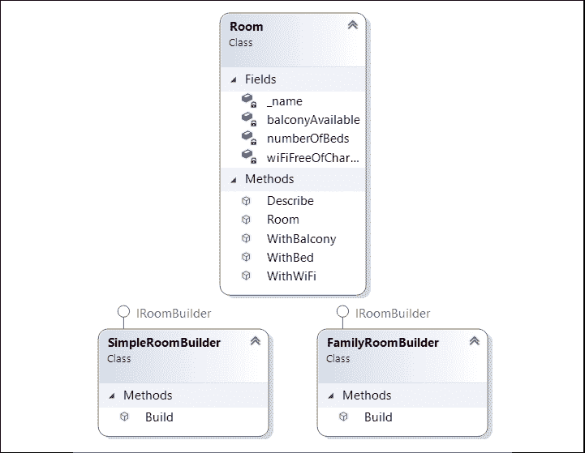
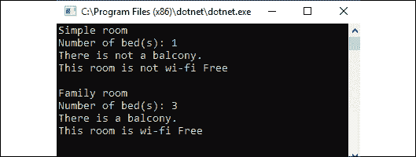
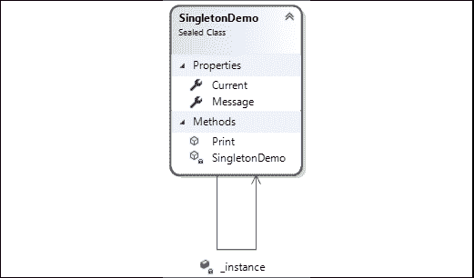
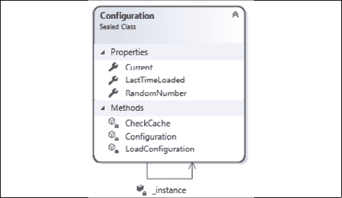
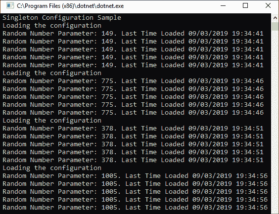
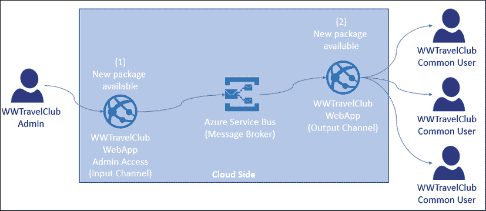

# 第十一章：设计模式和.NET 5 实现

设计模式可以被定义为常见问题的现成架构解决方案，在软件开发过程中遇到这些问题是必不可少的。它们对于理解.NET Core 架构至关重要，并且对于解决我们在设计任何软件时面临的普通问题非常有用。在本章中，我们将看一些设计模式的实现。值得一提的是，本书并未解释我们可以使用的所有已知模式。重点在于解释学习和应用它们的重要性。

在本章中，我们将涵盖以下主题：

+   理解设计模式及其目的

+   了解.NET 5 中可用的设计模式

在本章结束时，您将学习到一些可以用设计模式实现的**WWTravelClub**的用例。

# 技术要求

要完成本章，您需要免费的 Visual Studio 2019 社区版或更高版本，安装了所有数据库工具，以及一个免费的 Azure 账户。*第一章*的*理解软件架构的重要性*中的*创建 Azure 账户*小节解释了如何创建账户。

您可以在[`github.com/PacktPublishing/Software-Architecture-with-C-9-and-.NET-5`](https://github.com/PacktPublishing/Software-Architecture-with-C-9-and-.NET-5)找到本章的示例代码。

# 理解设计模式及其目的

决定系统设计是具有挑战性的，与此任务相关的责任是巨大的。作为软件架构师，我们必须始终牢记，诸如良好的可重用性、良好的性能和良好的可维护性等功能对于提供良好的解决方案至关重要。这就是设计模式帮助并加速设计过程的地方。

正如我们之前提到的，设计模式是已经讨论和定义的解决常见软件架构问题的解决方案。这种方法在《设计模式-可复用面向对象软件的元素》一书发布后变得越来越受欢迎，**四人帮**（**GoF**）将这些模式分为三种类型：创建型、结构型和行为型。

稍后，Bob 大叔向开发者社区介绍了 SOLID 原则，使我们有机会有效地组织每个系统的函数和数据结构。SOLID 设计原则指示软件组件应该如何设计和连接。值得一提的是，与 GoF 提出的设计模式相比，SOLID 原则并不提供代码配方。相反，它们给出了在设计解决方案时要遵循的基本原则，保持软件结构的强大和可靠。它们可以被定义如下：

+   **单一职责原则**：一个模块或函数应该负责一个单一的目的

+   **开闭原则**：软件构件应该对扩展开放，但对修改关闭

+   **里氏替换原则**：当你用一个由原始对象的超类型定义的另一个组件替换一个组件时，程序的行为需要保持不变

+   **接口隔离原则**：创建庞大的接口会导致依赖关系的发生，而在构建具体对象时，这对系统架构是有害的

+   **依赖倒置原则**：最灵活的系统是那些对象依赖仅指向抽象的系统

随着技术和软件问题的变化，会产生更多的模式。云计算的发展带来了大量模式，所有这些模式都可以在[`docs.microsoft.com/en-us/azure/architecture/patterns/`](https://docs.microsoft.com/en-us/azure/architecture/patterns/)找到。新模式出现的原因与我们在开发新解决方案时面临的挑战有关。今天，可用性、数据管理、消息传递、监控、性能、可伸缩性、弹性和安全性是我们在交付云解决方案时必须处理的方面。

你应该始终考虑使用设计模式的原因非常简单——作为软件架构师，你不能花时间重新发明轮子。然而，使用和理解它们的另一个很好的原因是：你会发现许多这些模式已经在.NET 5 中实现了。

在接下来的几个小节中，我们将介绍一些最著名的模式。然而，本章的目的是让你知道它们的存在，并且需要学习它们，以便加速和简化你的项目。此外，每个模式都将以 C#代码片段的形式呈现，以便你可以在你的项目中轻松实现它们。

## 建造者模式

有些情况下，你会有一个由于其配置而具有不同行为的复杂对象。你可能希望将该对象的配置与其使用分离，使用已经构建好的自定义配置。这样，你就有了正在构建的实例的不同表示。这就是你应该使用建造者模式的地方。

以下的类图显示了为本书使用案例中的场景实现的模式。这个设计选择背后的想法是简化对 WWTravelClub 房间的描述方式：



图 11.1：建造者模式

如下面的代码所示，这个代码是以一种不在主程序中设置实例的配置的方式实现的。相反，你只需使用`Build()`方法构建对象。这个例子模拟了在 WWTravelClub 中创建不同房间样式（单人房和家庭房）的过程：

```cs
using DesignPatternsSample.BuilderSample;
using System;
namespace DesignPatternsSample
{
    class Program
    {
        static void Main()
        {
          #region Builder Sample
          Console.WriteLine("Builder Sample");
          var simpleRoom = new SimpleRoomBuilder().Build();
          simpleRoom.Describe();

          var familyRoom = new FamilyRoomBuilder().Build();
          familyRoom.Describe();
          #endregion
          Console.ReadKey();
        }
    }
} 
```

这个实现的结果非常简单，但澄清了为什么需要实现模式：



图 11.2：建造者模式示例结果

一旦你有了实现，进化这段代码就变得更简单、更容易。例如，如果你需要构建不同风格的房间，你只需为该类型的房间创建一个新的建造者，然后你就可以使用它了。

这个实现变得非常简单的原因与在`Room`类中使用链式方法有关：

```cs
 public class Room
    {
        private readonly string _name;
        private bool wiFiFreeOfCharge;
        private int numberOfBeds;
        private bool balconyAvailable;
        public Room(string name)
        {
            _name = name;
        }
        public Room WithBalcony()
        {
            balconyAvailable = true;
            return this;
        }
        public Room WithBed(int numberOfBeds)
        {
            this.numberOfBeds = numberOfBeds;
            return this;
        }
        public Room WithWiFi()
        {
            wiFiFreeOfCharge = true;
            return this;
        }
    ...
    } 
```

幸运的是，如果需要增加产品的配置设置，之前使用的所有具体类都将在建造者接口中定义并存储在那里，以便你可以轻松更新它们。

我们还将在.NET 5 中看到建造者模式的一个很好的实现，在*了解.NET 5 中可用的设计模式*部分。在那里，你将能够了解如何使用`HostBuilder`实现了通用主机。

## 工厂模式

工厂模式在有多个来自相同抽象的对象，并且在编码开始时不知道需要创建哪个对象的情况下非常有用。这意味着你将不得不根据特定的配置或软件当前所处的位置来创建实例。

例如，让我们看看 WWTravelClub 示例。在这里，有一个用户故事描述了该应用程序将有来自世界各地的客户支付他们的旅行。然而，在现实世界中，每个国家都有不同的付款服务可用。每个国家的支付过程都类似，但该系统将有多个可用的付款服务。简化此付款实现的一种好方法是使用工厂模式。以下图表显示了其架构实现的基本思想：


图 11.3：工厂模式

请注意，由于您有一个描述应用程序的付款服务的接口，您可以使用工厂模式根据可用的服务更改具体类：

```cs
static void Main()
{
    #region Factory Sample
    ProcessCharging(PaymentServiceFactory.ServicesAvailable.Brazilian,
        "gabriel@sample.com", 178.90f, EnumChargingOptions.CreditCard);

    ProcessCharging(PaymentServiceFactory.ServicesAvailable.Italian,
        "francesco@sample.com", 188.70f, EnumChargingOptions.DebitCard);
    #endregion
    Console.ReadKey();
}
private static void ProcessCharging
    (PaymentServiceFactory.ServicesAvailable serviceToCharge,
    string emailToCharge, float moneyToCharge, 
    EnumChargingOptions optionToCharge)
{
    PaymentServiceFactory factory = new PaymentServiceFactory();
    var service = factory.Create(serviceToCharge);
    service.EmailToCharge = emailToCharge;
    service.MoneyToCharge = moneyToCharge;
    service.OptionToCharge = optionToCharge;
    service.ProcessCharging();
} 
```

再次，由于实现的模式，服务的使用变得更加简单。如果您必须在真实世界的应用程序中使用此代码，您可以通过在工厂模式中定义所需的服务来更改实例的行为。

## 单例模式

当您在应用程序中实现单例时，您将在整个解决方案中实现对象的单个实例。这可以被认为是每个应用程序中最常用的模式之一。原因很简单-有许多用例需要一些类只有一个实例。单例通过提供比全局变量更好的解决方案来解决这个问题。

在单例模式中，类负责创建和提供应用程序将使用的单个对象。换句话说，单例类创建一个单一实例：



图 11.4：单例模式

为此，创建的对象是`static`，并在静态属性或方法中提供。以下代码实现了具有`Message`属性和`Print()`方法的单例模式：

```cs
public sealed class SingletonDemo
{
    #region This is the Singleton definition
    private static SingletonDemo _instance;
    public static SingletonDemo Current => _instance ??= new 
        SingletonDemo();
    #endregion
    public string Message { get; set; }
    public void Print()
    {
        Console.WriteLine(Message);
    }
} 
```

它的使用很简单-每次需要使用单例对象时，只需调用静态属性：

```cs
SingletonDemo.Current.Message = "This text will be printed by " +
  "the singleton.";
SingletonDemo.Current.Print(); 
```

您可能使用此模式的一个场景是需要以可以轻松从解决方案的任何地方访问的方式提供应用程序配置。例如，假设您有一些配置参数存储在应用程序需要在多个决策点查询的表中。您可以创建一个单例类来帮助您，而不是直接查询配置表。



图 11.5：单例模式的使用

此外，您需要在此单例中实现缓存，从而提高系统的性能，因为您可以决定系统是否每次需要时都会检查数据库中的每个配置，还是使用缓存。以下屏幕截图显示了缓存的实现，其中配置每 5 秒加载一次。在这种情况下读取的参数只是一个随机数：



图 11.6：单例模式内部的缓存实现

这对应用程序的性能非常有利。此外，在代码中的多个地方使用参数更简单，因为您不必在代码的各处创建配置实例。

值得一提的是，由于.NET 5 中的依赖注入实现，单例模式的使用变得不太常见，因为您可以设置依赖注入来处理您的单例对象。我们将在本章的后面部分介绍.NET 5 中的依赖注入。

## 代理模式

代理模式用于在需要提供控制对另一个对象访问的对象时使用。为什么要这样做的最大原因之一与创建被控制对象的成本有关。例如，如果被控制的对象创建时间过长或消耗过多内存，可以使用代理来确保只有在需要时才会创建对象的大部分。

以下类图是**代理**模式实现从**Room**加载图片的示例，但只有在请求时：


图 11.7：代理模式实现

该代理的客户端将请求其创建。在这里，代理只会从真实对象中收集基本信息（`Id`，`FileName`和`Tags`），而不会查询`PictureData`。当请求`PictureData`时，代理将加载它：

```cs
static void Main()
{
    Console.WriteLine("Proxy Sample");
    ExecuteProxySample(new ProxyRoomPicture());
}
private static void ExecuteProxySample(IRoomPicture roomPicture)
{
    Console.WriteLine($"Picture Id: {roomPicture.Id}");
    Console.WriteLine($"Picture FileName: {roomPicture.FileName}");
    Console.WriteLine($"Tags: {string.Join(";", roomPicture.Tags)}");
    Console.WriteLine($"1st call: Picture Data");
    Console.WriteLine($"Image: {roomPicture.PictureData}");
    Console.WriteLine($"2nd call: Picture Data");
    Console.WriteLine($"Image: {roomPicture.PictureData}");
} 
```

如果再次请求`PictureData`，由于图像数据已经就位，代理将保证不会重复加载图像。以下截图显示了运行上述代码的结果：


图 11.8：代理模式结果

这种技术也可以称为另一个众所周知的模式：**惰性加载**。事实上，代理模式是实现惰性加载的一种方式。实现惰性加载的另一种方法是使用`Lazy<T>`类型。例如，在 Entity Framework Core 5 中，正如*第八章*，*在 C#中与数据交互-Entity Framework Core*中讨论的那样，你可以使用代理打开惰性加载。你可以在[`docs.microsoft.com/en-us/ef/core/querying/related-data#lazy-loading`](https://docs.microsoft.com/en-us/ef/core/querying/related-data#lazy-loading)找到更多信息。

## 命令模式

有许多情况下，你需要执行一个会影响对象行为的**命令**。命令模式可以通过封装这种请求到一个对象中来帮助你。该模式还描述了如何处理请求的撤销/重做支持。

例如，让我们想象一下，在 WWTravelClub 网站上，用户可能有能力通过指定他们喜欢、不喜欢，甚至是喜爱他们的体验来评估套餐。

以下类图是一个示例，可以实现使用命令模式创建此评分系统：


图 11.9：命令模式

注意这种模式的工作方式——如果你需要一个不同的命令，比如`Hate`，你不需要更改使用命令的代码和类。`Undo`方法可以以类似的方式添加到`Redo`方法。这方面的完整代码示例可以在本书的 GitHub 存储库中找到。

还值得一提的是，ASP.NET Core MVC 使用命令模式来处理其`IActionResult`层次结构。此外，*第十二章*，*理解软件解决方案中的不同领域*中描述的业务操作将使用该模式来执行业务规则。

## 发布者/订阅者模式

将对象的信息提供给一组其他对象在所有应用程序中都很常见。当有大量组件（订阅者）将接收包含对象发送的信息的消息时，发布者/订阅者模式几乎是必不可少的。

这里的概念非常简单易懂，并且在下图中有所展示：



图 11.10：发布者/订阅者示例案例

当你有无数个可能的订阅者时，将广播信息的组件与消费信息的组件解耦是至关重要的。发布者/订阅者模式为我们做到了这一点。

实施这种模式是复杂的，因为分发环境并不是一个简单的任务。因此，建议您考虑已经存在的技术来实现连接输入通道和输出通道的消息代理，而不是从头开始构建它。Azure Service Bus 是这种模式的可靠实现，所以你只需要连接到它。

我们在*第五章*中提到的 RabbitMQ，*将微服务架构应用于企业应用程序*，是另一个可以用来实现消息代理的服务，但它是该模式的较低级别实现，并且需要进行多个相关任务，例如手动编码重试以处理错误。

## 依赖注入模式

依赖注入模式被认为是实现依赖反转原则的一种好方法。一个有用的副作用是，它强制任何实现遵循所有其他 SOLID 原则。

这个概念非常简单。您只需要定义它们的依赖关系，声明它们的接口，并通过**注入**启用对象的接收，而不是创建组件所依赖的对象的实例。

有三种方法可以执行依赖注入：

+   使用类的构造函数接收对象

+   标记一些类属性以接收对象

+   定义一个具有注入所有必要组件的方法的接口

以下图表显示了依赖注入模式的实现：


图 11.11：依赖注入模式

除此之外，依赖注入还可以与**控制反转**（**IoC**）容器一起使用。该容器在被要求时自动注入依赖项。市场上有几个 IoC 容器框架可用，但是在.NET Core 中，无需使用第三方软件，因为它包含一组库来解决`Microsoft.Extensions.DependencyInjection`命名空间中的问题。

这个 IoC 容器负责创建和处理被请求的对象。依赖注入的实现基于构造函数类型。对于被注入组件的生命周期，有三个选项：

+   **瞬态**：每次请求时都会创建对象。

+   **作用域**：为应用程序中定义的每个作用域创建对象。在 Web 应用程序中，**作用域**是通过 Web 请求标识的。

+   **单例**：每个对象具有相同的应用程序生命周期，因此重用单个对象来为给定类型的所有请求提供服务。如果您的对象包含状态，则不应使用此对象，除非它是线程安全的。

您将如何使用这些选项取决于您正在开发的项目的业务规则。这也取决于您将如何注册应用程序的服务。在决定正确的选项时，您需要小心，因为应用程序的行为将根据您注入的对象类型而改变。

# 了解.NET 5 中可用的设计模式

在前面的部分中，我们发现 C#允许我们实现任何模式。 .NET 5 在其 SDK 中提供了许多实现，遵循我们讨论过的所有模式，例如 Entity Framework Core 代理延迟加载。自.NET Core 2.1 以来可用的另一个很好的例子是.NET 通用主机。

在*第十五章*中，*介绍 ASP.NET Core MVC*，我们将详细介绍.NET 5 中 Web 应用程序可用的托管。这个 Web 主机在应用程序的启动和生命周期管理方面对我们很有帮助。.NET 通用主机的想法是为不需要 HTTP 实现的应用程序启用这种模式。通过这个通用主机，任何.NET Core 程序都可以有一个启动类，我们可以在其中配置依赖注入引擎。这对于创建多服务应用程序非常有用。

您可以在[`docs.microsoft.com/en-us/aspnet/core/fundamentals/host/generic-host`](https://docs.microsoft.com/en-us/aspnet/core/fundamentals/host/generic-host)找到更多关于.NET 通用主机的信息，其中包含一些示例代码，并且是微软目前的推荐。GitHub 存储库中提供的代码更简单，但它侧重于创建一个可以运行监视服务的控制台应用程序。这种方法的伟大之处在于控制台应用程序的设置方式，生成器配置了应用程序提供的服务，以及日志记录的管理方式。

这在以下代码中显示：

```cs
public static void Main()
{
    var host = new HostBuilder()
        .ConfigureServices((hostContext, services) =>
        {
            services.AddHostedService<HostedService>();
            services.AddHostedService<MonitoringService>();
        })
        .ConfigureLogging((hostContext, configLogging) =>
        {
            configLogging.AddConsole();
        })
        .Build();
    host.Run();
    Console.WriteLine("Host has terminated. Press any key to finish the App.");
    Console.ReadKey();
} 
```

上述代码让我们了解了.NET Core 如何使用设计模式。使用生成器模式，.NET 通用主机允许您设置将作为服务注入的类。除此之外，生成器模式还帮助您配置其他一些功能，例如日志的显示/存储方式。此配置允许服务将`ILogger<out TCategoryName>`对象注入到任何实例中。

# 总结

在本章中，我们了解了为什么设计模式有助于系统部分的可维护性和可重用性。我们还看了一些典型的用例和代码片段，您可以在项目中使用。最后，我们介绍了.NET 通用主机，这是.NET 使用设计模式实现代码重用和执行最佳实践的一个很好的例子。

所有这些内容都将帮助您在设计新软件或维护现有软件时，因为设计模式已经是软件开发中一些现实问题的已知解决方案。

在下一章中，我们将介绍领域驱动设计方法。我们还将学习如何使用 SOLID 设计原则，以便将不同的领域映射到我们的软件解决方案中。

# 问题

1.  什么是设计模式？

1.  设计模式和设计原则之间有什么区别？

1.  何时实现生成器模式是一个好主意？

1.  何时实现工厂模式是一个好主意？

1.  何时实现单例模式是一个好主意？

1.  何时实现代理模式是一个好主意？

1.  何时实现命令模式是一个好主意？

1.  何时实现发布者/订阅者模式是一个好主意？

1.  何时实现依赖注入模式是一个好主意？

# 进一步阅读

以下是一些书籍和网站，您可以在其中找到有关本章内容的更多信息：

+   *Clean Architecture: A Craftsman's Guide to Software Structure and Design*，Martin, Robert C., Pearson Education, 2018.

+   *Design Patterns: Elements of Reusable Object-Oriented Software*，Erica Gamma 等人，Addison-Wesley，1994 年。

+   *Design Principles and Design Patterns*，Martin, Robert C., 2000.

+   如果您需要获取有关设计模式和架构原则的更多信息，请查看以下链接：

+   [`www.packtpub.com/application-development/design-patterns-using-c-and-net-core-video`](https://www.packtpub.com/application-development/design-patterns-using-c-and-net-core-video)

+   [`docs.microsoft.com/en-us/dotnet/standard/modern-web-apps-azure-architecture/architectural-principles`](https://docs.microsoft.com/en-us/dotnet/standard/modern-web-apps-azure-architecture/architectural-pr)

+   如果您想查看特定的云设计模式，可以在以下链接找到：

+   [`docs.microsoft.com/en-us/azure/architecture/patterns/`](https://docs.microsoft.com/en-us/azure/architecture/patterns/)

+   如果您想更好地理解通用主机的概念，请访问此链接：

+   https://docs.microsoft.com/en-us/aspnet/core/fundamentals/host/generic-host

+   在此链接中有关于服务总线消息传递的非常好的解释：

+   [`docs.microsoft.com/en-us/azure/service-bus-messaging/service-bus-dotnet-how-to-use-topics-subscriptions`](https://docs.microsoft.com/en-us/azure/service-bus-messaging/service-bus-dotnet-how-to-use-topics-su)

+   你可以通过查看这些链接来了解更多关于依赖注入的信息：

+   [`docs.microsoft.com/en-us/aspnet/core/fundamentals/dependency-injection`](https://docs.microsoft.com/en-us/aspnet/core/fundamentals/dependency-injection)

+   [`www.martinfowler.com/articles/injection.html`](https://www.martinfowler.com/articles/injection.html)
