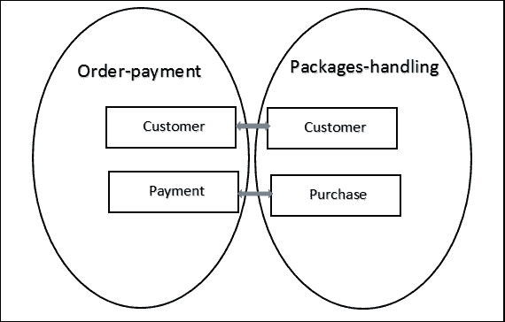
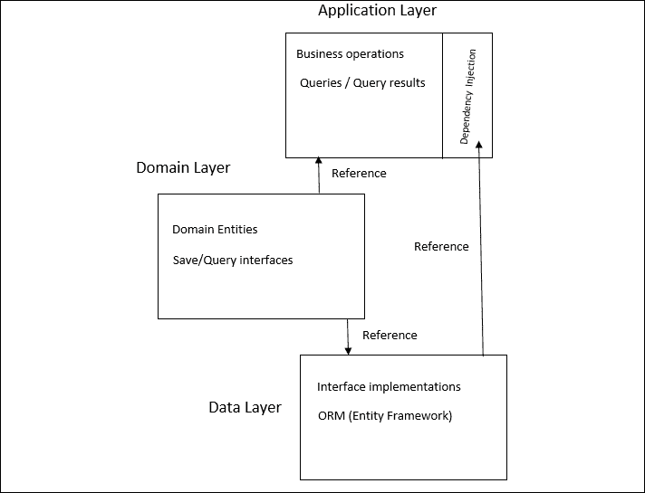
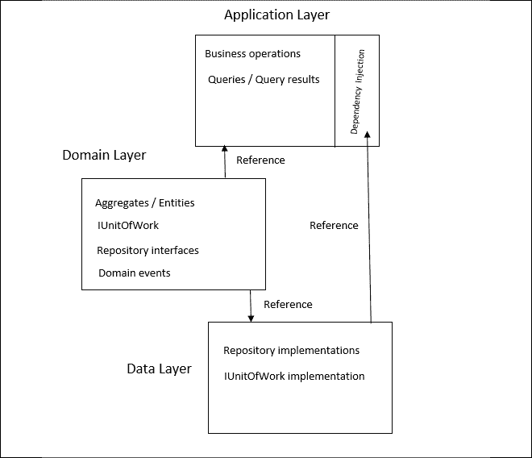
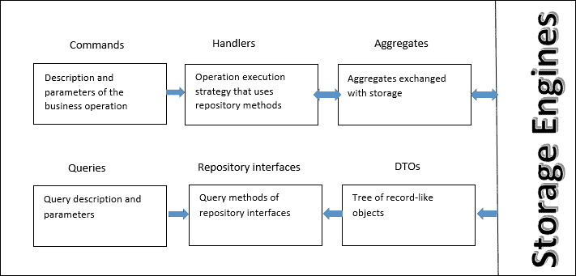

# 第十二章：理解软件解决方案中的不同领域

本章专门介绍了一种称为**领域驱动设计**（**DDD**）的现代软件开发技术，这是由 Eric Evans 首次提出的。虽然 DDD 已经存在了 15 年以上，但由于其解决了两个重要问题的能力，它在过去几年取得了巨大成功。

第一个问题是对复杂系统进行建模。没有一个专家对整个领域有深入的了解；相反，这种知识分散在几个人之间。正如我们将看到的，DDD 通过将整个 CI/CD 周期分成独立的部分分配给不同的团队来解决这个问题。这样，每个团队可以专注于特定的知识领域，只与该领域的专家进行互动。

DDD 很好地解决了第二个问题，即涉及多个开发团队的大型项目。项目被分成几个团队有很多原因，最常见的原因是团队的规模以及所有成员具有不同的技能和/或不同的地点。事实上，经验已经证明，超过 6-8 人的团队并不高效，而不同的技能和地点阻止了紧密的互动。团队分裂阻止了所有参与项目的人之间的紧密互动。

反过来，上述两个问题的重要性在过去几年中不断增加。软件系统一直占据着每个组织内大量的空间，并且变得越来越复杂和地理分布。与此同时，对频繁更新的需求增加，以便这些复杂的软件系统能够适应快速变化的市场需求。

这些问题导致了更复杂的 CI/CD 周期的构想和复杂分布式架构的采用，这些架构可以利用可靠性、高吞吐量、快速更新以及逐渐演变传统子系统的能力。是的——我们谈论的是微服务和基于容器的架构，我们在*第五章*、*将微服务架构应用于企业应用程序*中进行了分析。

在这种情况下，常见的做法是实现与快速 CI/CD 周期相关的复杂软件系统，这些系统始终需要���多的人来进行演进和维护。反过来，这就产生了对适用于高复杂性领域以及对几个松散耦合的开发团队进行合作的技术的需求。

在本章中，我们将分析与 DDD 相关的基本原则、优势和常见模式，以及如何在我们的解决方案中使用它们。更具体地，我们将涵盖以下主题：

+   什么是软件领域？

+   理解领域驱动设计

+   使用 SOLID 原则来映射您的领域

+   用例——理解用例的领域

让我们开始吧。

# 技术要求

本章需要安装了所有数据库工具的 Visual Studio 2019 免费社区版或更高版本。

本章中的所有代码片段都可以在与本书相关的 GitHub 存储库中找到，[`github.com/PacktPublishing/Software-Architecture-with-C-9-and-.NET-5`](https://github.com/PacktPublishing/Software-Architecture-with-C-9-and-.NET-5)。

# 什么是软件领域？

正如我们在*第二章*、*非功能性需求*和*第三章*、*使用 Azure DevOps 记录需求*中讨论的，从领域专家到开发团队的知识传递在软件设计中起着基础性作用。开发人员试图与专家沟通，并用领域专家和利益相关者能够理解的语言描述他们的解决方案。然而，通常情况下，同一个词在组织的不同部分有不同的含义，在不同的上下文中，看似相同的概念实体在不同的情境中完全不同。

例如，在我们的 WWTravelClub 用例中，订单支付和包裹处理子系统使用完全不同的客户模型。订单支付通过支付方式和货币、银行账户和信用卡来描述客户，而包裹处理更关注过去访问和/或购买的位置和包裹、用户的偏好以及其地理位置。此外，订单支付涉及各种概念，使用的语言可以粗略地定义为**银行语言**，而包裹处理使用的语言则是旅行社/运营商的典型语言。

应对这些差异的经典方式是使用一个称为**客户**的唯一抽象实体，它投影到两个不同的视图——订单-支付视图和包裹处理视图。每个投影操作都从**客户**抽象实体中获取一些操作和一些属性，并更改它们的名称。由于领域专家只给我们提供了投影视图，作为系统设计师的主要任务是创建一个能够解释所有视图的概念模型。下图显示了如何处理不同的视图：


图 12.1：创建一个唯一模型

经典方法的主要优势在于我们对领域数据有一个独特和一致的表示。如果成功构建了这个概念模型，所有操作都将有一个正式的定义和目的，整个抽象将是整个组织应该工作的合理化，可能会突出和纠正错误，并简化一些程序。

然而，这种方法有什么不足之处呢？

对于一个小组织来说，快速采用新的单体数据模型可能会产生可接受的影响，当软件面向整个组织的一小部分，或者当软件自动化了数据流的足够小的百分比时。然而，如果软件成为复杂的地理分布式组织的支柱，急剧的变化变得不可接受和不可行。复杂结构的公司需要从旧组织逐渐过渡到新组织。反过来，只有在旧数据模型可以与新数据模型共存，并且组织的各个组成部分都被允许以自己的速度变化时，逐渐过渡才是可能的，也就是说，组织的每个组成部分都可以独立于其他部分发展。

此外，随着软件系统复杂性的增加，还会出现其他一些问题，例如：

+   **一致性问题**：当我们将这些任务分解为更小、松散耦合的任务时，要达到数据的统一一致视图变得更加困难，因为我们无法保留复杂性。

+   **更新困难**：随着复杂性的增长，系统需要频繁变更，但更新和维护一个唯一的全局模型是相当困难的。此外，由于系统中某些小部分的变更引入的错误可能通过唯一共享的模型传播到整个组织。

+   **团队组织问题**：系统建模必须分配给几个团队，并且只能给予分离的松散耦合任务；如果两个任务紧密耦合，它们需要分配给同一个团队。

+   **并行问题**：需要转向基于微服务的架构，这使得唯一数据库的瓶颈变得更加不可接受。

+   **语言问题**：随着系统的增长，我们需要与更多的领域专家进行沟通，每个人说着不同的语言，对数据模型有不同的看法。因此，我们需要将我们唯一模型的属性和操作从更多的语言翻译成/翻译出来，以便与他们进行沟通。

随着系统的增长，处理具有数百/数千个字段的记录变得更加低效。这种低效性源于数据库引擎对具有多个字段的大记录的低效处理（内存碎片化，与太多相关索引的问题等）。然而，主要的低效性发生在**对象关系映射**（**ORMs**）和业务层，它们被迫在其更新操作中处理这些大记录。事实上，虽然查询操作通常只需要从存储引擎中检索出的少数字段，但更新和业务处理涉及整个实体。

随着数据存储子系统中的流量增长，我们需要在所有数据操作中实现读取和更新/写入并行性。正如我们在*第九章*中讨论的*如何在云中选择数据存储*，读取并行性可以通过数据复制轻松实现，而写入并行性则需要分片，对于一个独特的单片和紧密连接的数据模型来说，分片是困难的。

这些问题是 DDD 在过去几年取得成功的原因，因为它们被更复杂的软件系统所特征，这些系统成为整个组织的支柱。DDD 的基本原则将在下一节中详细讨论。

# 理解领域驱动设计

DDD 是关于构建一个独特的领域模型，将所有视图保持为单独的模型。因此，整个应用程序领域被分割成更小的领域，每个领域都有一个单独的模型。这些单独的领域被称为**有界上下文**。每个领域都以专家所使用的语言为特征，并用于命名所有领域概念和操作。因此，每个领域定义了一个专家和开发团队都使用的通用语言，称为**普遍语言**。不再需要翻译，如果开发团队使用接口作为代码的基础，领域专家能够理解和验证它们，因为所有操作和属性都用专家使用的相同语言表达。

在这里，我们摆脱了繁琐的唯一抽象模型，但现在我们有几个分离的模型，我们需要以某种方式进行关联。DDD 建议将处理所有这些分离的模型，即所有有界上下文，如下所示：

+   每当语言术语的含义发生变化时，我们需要添加有界上下文边界。例如，在 WWTravelClub 的用例中，订单支付和套餐处理属于不同的有界上下文，因为它们赋予了**客户**这个词不同的含义。

+   我们需要明确表示有界上下文之间的关系。不同的开发团队可能在不同的有界上下文上工作，但每个团队必须清楚地了解其所在的有界上下文与所有其他模型之间的关系。因此，这些关系在一个共享给每个团队的唯一文档中表示。

+   我们需要保持所有有界上下文与 CI 保持一致。会议被组织起来，简化的系统原型被构建，以验证所有有界上下文是否一致地发展，即所有有界上下文是否能够集成到所需的应用程序行为中。

以下图表显示了我们在前一节中讨论的 WWTravelClub 示例在采用 DDD 后的变化：



图 12.2：DDD 有界上下文之间的关系

每个有界上下文的客户实体之间存在关系，而套餐处理有界上下文的购买实体与支付相关。确定在各个有界上下文中映射到彼此的实体是正式定义代表上下文之间所有可能通信的接口的第一步。

例如，从前面的图表中，我们知道购买后会进行付款，因此我们可以推断订单-付款有界上下文必须有一个为特定客户创建付款的操作。在此领域中，如果新客户不存在，则会创建新客户。购买后立即触发付款创建操作。由于购买商品后会触发多个操作，我们可以使用我们在*第十一章*，*设计模式和.NET 5 实现*中解释的发布者/订阅者模式来实现与购买事件相关的所有通信。这在 DDD 中被称为**领域事件**。使用事件来实现有界上下文之间的通信非常常见，因为它有助于保持有界上下文之间的松耦合。

一旦在有界上下文界面中定义的事件或操作的实例跨越上下文边界，它立即被转换为接收上下文的普遍语言。在输入数据开始与其他领域实体交互之前执行此转换非常重要，以避免其他领域的普遍语言被额外的上下文术语污染。

每个有界上下文实现必须包含一个完全以有界上下文普遍语言（类和接口名称以及属性和方法名称）表达的数据模型层，不受其他有界上下文普遍语言的污染，也不受编程技术内容的污染。这对于确保与领域专家的良好沟通以及确保领域规则被正确地转换为代码以便领域专家轻松验证是必要的。

当通信语言与目标普遍语言之间存在严重不匹配时，会在接收有界上下文边界添加一个反腐层。这个反腐层的唯一目的是执行语言翻译。

包含所有有界上下文的表示，以及有界上下文的相互关系和接口定义的文档称为**上下文映射**。上下文之间的关系包含组织约束，指定了在不同有界上下文上工作的团队之间所需的合作方式。这些关系不限制有界上下文的接口，但会影响它们在软件 CI/CD 周期中可能发展的方式。它们代表了团队合作的模式。最常见的模式如下：

+   **合作伙伴**：这是 Eric Evans 建议的最初模式。其想法是两个团队在交付方面相互依赖。换句话说，他们共同决定，并在软件 CI/CD 周期中如有需要，更改有界上下文的相互通信规范。

+   **客户/供应商开发团队**：在这种情况下，一个团队充当客户，另一个充当供应商。两个团队定义了有界上下文客户端的接口以及一些自动化验收测试来验证它。之后，供应商可以独立工作。当客户的有界上下文是唯一激活的部分，调用其他有界上下文公开的接口方法时，此模式适用。这对于订单-付款和包裹处理上下文之间的交互是足够的，其中订单-付款充当供应商，因为其功能从属于包裹处理的需求。当可以应用此模式时，它完全解耦了两个有界上下文。

+   **顺从者**：这类似于客户/供应商，但在这种情况下，客户方接受了供应方强加的接口，没有谈判阶段。这种模式对其他模式没有优势，但有时我们被迫处于模式所描述的情况，因为供应方的有界上下文是在无法进行太多配置/修改的现有产品中实现的，或者因为它是我们不想修改的遗留子系统。

值得指出的是，如果结果的有界上下文松散耦合，那么有界上下文的分离才是有效的；否则，通过将整个系统分解为子部分而获得的复杂性减少将被协调和通信过程的复杂性所淹没。

然而，如果有界上下文是根据语言标准来定义的，也就是说，每当**普遍语言**发生变化时，就会添加有界上下文边界，那么实际情况应该是这样。事实上，不同的语言可能会由于组织子部分之间的松散交互而产生，因为每个子部分内部的紧密交互越多，与其他子部分的松散交互越多，每个子部分最终就会定义和使用自己的内部语言，这与其他子部分使用的语言不同。

此外，所有人类组织都可以通过演变成松散耦合的子部分来增长，原因是复杂软件系统可以作为松散耦合的子模块的合作来实现：这是人类应对复杂性的唯一方式。由此，我们可以得出结论，复杂的组织/人工系统总是可以分解成松散耦合的子部分。我们只需要了解*如何*。

除了我们迄今提到的基本原则之外，DDD 还提供了一些基本原语来描述每个有界上下文，以及一些实现模式。虽然有界上下文原语是 DDD 的一个组成部分，但这些模式是我们在实现中可以使用的有用启发式方法，因此一旦我们选择 DDD 采用，它们在一些或所有有界上下文中的使用并不是强制性的。

在下一节中，我们将描述原始和模式。

# 实体和值对象

DDD 实体代表具有明确定义身份的领域对象，以及定义在它们上面的所有操作。它们与其他更经典的方法中的实体��没有太大的区别。此外，DDD 实体是存储层设计的起点。

主要区别在于 DDD 强调它们的面向对象性质，而其他方法主要将它们用作**记录**，其属性可以在不受太多约束的情况下被编写/更新。另一方面，DDD 强制将强大的 SOLID 原则应用于它们，以确保只有特定信息封装在其中，并且只有特定信息可以从外部访问，以规定允许对其进行哪些操作，并设置哪些业务级别的验证标准适用于它们。

换句话说，DDD 实体比基于记录的方法中的实体更丰富。在其他方法中，操作操纵实体的操作是在代表业务和/或领域操作的类之外定义的。在 DDD 中，这些操作被移动到实体定义中作为它们的类方法。原因是它们提供更好的模块化，并将相关的软件块放在同一个地方，以便可以轻松地进行维护和测试。

出于同样的原因，业务验证规则被移至 DDD 实体内部。DDD 实体验证规则是业务级别的规则，因此不应与数据库完整性规则或用户输入验证规则混淆。它们通过编码所代表的对象必须遵守的约束，有助于实体表示领域对象的方式。在.NET（Core）中，可以使用以下技术进行业务验证：

+   在修改实体的所有类方法中调用验证方法

+   将验证方法挂钩到所有属性设置器

+   使用自定义验证属性装饰类和/或其属性，然后在每次修改实体时调用`System.ComponentModel.DataAnnotations.Validator`类的`TryValidateObject`静态方法

一旦检测到验证错误，必须以某种方式处理；也就是说，当前操作必须中止，并且错误必须报告给适当的错误处理程序。处理验证错误的最简单方法是抛出异常。通过这种方式，可以轻松实现两个目的，并且可以选择在何处拦截和处理它们。不幸的是，正如我们在*第二章* *非功能需求*的*C#编程中需要考虑的性能问题*部分中讨论的那样，异常会带来很大的性能损失，因此通常会考虑不同的选项。在控制流的正常处理中处理错误会通过在引起错误的方法堆栈中传播所需的处理错误的代码来破坏模块化，代码中到处都是永无止境的条件。因此，需要更复杂的选项。

一个很好的替代方案是将错误通知到依赖注入引擎中定义的错误处理程序，而不是使用异常。由于作用域限定，当每个请求被处理时，相同的服务实例被返回，以便控制整个调用堆栈的处理程序在控制流返回时检查可能的错误，并适当地处理它们。不幸的是，这种复杂的技术无法立即中止操作的执行或将其返回给控制处理程序。这就是为什么在这种情况下建议使用异常，尽管它们存在性能问题。

业务级别验证不应与输入验证混淆，输入验证将在*第十五章* *介绍 ASP.NET Core MVC*中更详细地讨论，因为这两种验证类型具有不同且互补的目的。虽然业务级别验证规则编码领域规则，但输入验证强制执行每个输入的格式（字符串长度，正确的电子邮件和 URL 格式等），确保提供了所有必要的输入，强制执行所选择的用户-机器交互协议，并提供快速和即时的反馈，以驱使用户与系统进行交互。

由于 DDD 实体必须具有明确定义的标识，它们必须具有充当主键的属性。通常会以这样一种方式重写所有 DDD 实体的`Object.Equals`方法，即当两个对象具有相同的主键时，它们被视为相等。这很容易通过让所有实体继承自一个抽象的`Entity`类来实现，如下面的代码所示：

```cs
public abstract class Entity<K>: IEntity<K>
    where K: IEquatable<K>
{

    public virtual K Id { get; protected set; }
    public bool IsTransient()
    {
        return Object.Equals(Id, default(K));
    }
    public override bool Equals(object obj)
    {
        return obj is Entity<K> entity &&
          Equals(entity); 
    }
    public bool Equals(IEntity<K> other)
    {
        if (other == null || 
            other.IsTransient() || this.IsTransient())
            return false;
        return Object.Equals(Id, other.Id);
    }
    int? _requestedHashCode;
    public override int GetHashCode()
    {
        if (!IsTransient())
        {
            if (!_requestedHashCode.HasValue)
                _requestedHashCode = HashCode.Combine(Id);
            return _requestedHashCode.Value;
        }
        else
            return base.GetHashCode();
    }
    public static bool operator ==(Entity<K> left, Entity<K> right)
    {
        if (Object.Equals(left, null))
            return (Object.Equals(right, null));
        else
            return left.Equals(right);
    }
    public static bool operator !=(Entity<K> left, Entity<K> right)
    {
        return !(left == right);
    }
} 
```

值得指出的是，一旦我们在`Entity`类中重新定义了`Object.Equals`方法，我们还可以重写`==`和`!=`运算符。

`IsTransient`谓词在实体最近创建并且尚未记录在永久存储中时返回`true`，因此其主键仍未定义。

在.NET 中，一个良好的做法是，每当重写类的`Object.Equals`方法时，也要重写其`Object.GetHashCode`方法，以便类实例可以有效地存储在诸如字典和集合之类的数据结构中。这就是为什么`Entity`类对其进行了重写。

此外，值得实现一个定义`Entity<K>`的所有属性/方法的`IEntity<K>`接口。每当我们需要在接口后面隐藏数据类时，这个接口就很有用。

另一方面，值对象代表无法用数字或字符串编码的复杂类型。因此，它们没有身份和主键。它们没有在其上定义的操作，并且是不可变的；也就是说，一旦它们被创建，所有字段都可以被读取，但不能被修改。因此，它们通常被编码为具有受保护/私有设置器的类。当所有独立属性都相等时，两个值对象被认为是相等的（有些属性不是独立的，因为它们只显示以不同方式由其他属性编码的数据，就像`DateTime`的刻度和其日期和时间字段的表示方式一样）。

由于所有`record`类型都会自动重写`Equals`方法，因此很容易使用 C# 9 的`record`类型来实现值类型，以便进行逐属性比较。此外，`record`类型的行为类似于`structs`，在每次赋值时都会创建一个新实例。但是，`record`类型也是不可变的；也就是说，一旦初始化，改变它们的值的唯一方法是创建一个新实例。以下是如何修改`record`的示例：

```cs
var modifiedAddress = myAddress with {Street = "new street"} 
```

以下是如何定义`record`的示例：

```cs
public record Address
{
   public string Country {get; init;}
   public string Town {get; init;}
   public string Street {get; init;}
} 
```

`init`关键字使`record`类型的属性不可变，因为它意味着它们只能被初始化。

典型的值对象包括以数字和货币符号表示的成本，以经度和纬度表示的位置，地址和联系信息。当存储引擎的接口是 Entity Framework 时，我们在第八章《使用 C#与数据交互-Entity Framework Core》和第九章《如何选择云中的数据存储》中进行了分析，值对象通过`OwnsMany`和`OwnsOne`关系与使用它们的实体相连。事实上，这样的关系也接受没有主键定义的类。

当存储引擎是 NoSQL 数据库时，值对象存储在使用它们的实体的记录中。另一方面，在关系数据库的情况下，它们可以通过分离的表来实现，其主键由 Entity Framework 自动处理并对开发人员隐藏（没有属性被声明为主键），或者在`OwnsOne`的情况下，它们被展开并添加到使用它们的实体相关的表中。

# 使用 SOLID 原则来映射您的领域

在接下来的小节中，我们将描述一些常用的 DDD 模式。其中一些可以在所有项目中采用，而另一些只能用于特定的 Bounded Contexts。总体思想是业务层分为两层：

+   应用层

+   领域层

在这里，领域层是基于普遍语言对数据层的抽象。这是定义 DDD 实体和值对象以及检索和保存它们的操作的地方。这些操作在接口中定义，并在底层数据层（在我们的案例中是 Entity Framework）中实现。

应用层定义了使用领域层接口的操作，以获取 DDD 实体和值对象，并对它们进行操作以实现应用程序业务逻辑。

正如我们将在本章后面看到的那样，通常只使用领域层中的接口来实现领域层。因此，数据层必须引用领域层，因为它必须实现其接口，而应用层是通过应用层依赖注入引擎的记录将每个领域层接口与其实现连接起来的地方。更具体地说，应用层引用的唯一数据层对象是仅在依赖注入引擎中引用的这些接口实现。

每个应用层操作都需要从依赖引擎中获取所需的接口，使用它们获取 DDD 实体和值对象，对它们进行操作，并可能通过相同的接口保存它们。下面是一个显示本节讨论的三个层之间关系的图表：



图 12.3：层之间的关系

因此，领域层包含领域对象的表示、在其上使用的方法、验证约束以及与各种实体的关系。为了增加模块化和解耦，实体之间的通信通常使用事件进行编码，即发布者/订阅者模式。这意味着实体更新可以触发已连接到业务操作的事件，并且这些事件会对其他实体进行操作。

这种分层架构使我们能够更改整个数据层而不影响领域层，后者仅依赖于领域规范和语言，不依赖于数据处理的技术细节。

应用层包含可能影响多个实体的所有操作的定义，以及应用程序所需的所有查询的定义。业务操作和查询都使用领域层中定义的接口与数据层交互。

然而，虽然业务操作通过这些接口操作和交换实体，查询则向它们发送查询规范，并从它们接收通用的**数据传输对象**（**DTOs**）。事实上，查询的目的只是向用户显示数据，而不是对其进行操作；因此，查询操作不需要整个实体及其所有方法、属性和验证规则，而只需要属性元组。

业务操作可以由其他层（通常是表示层）或通信操作调用。业务操作也可以连接到由其他操作修改实体时触发的事件。

总之，应用层在领域层中定义的接口上操作，而不是直接与数据层实现交互，这意味着应用层与数据层解耦。更具体地说，数据层对象仅在依赖注入引擎定义中提到。所有其他应用层组件都引用领域层中定义的接口，依赖注入引擎注入适当的实现。

应用层通过以下一种或多种模式与其他应用组件通信：

+   它在通信端点上公开业务操作和查询，比如 HTTP Web API（参见*第十四章*，*使用.NET Core 应用服务导向架构*）。在这种情况下，表示层可以连接到这个端点，或者连接到其他端点，这些端点反过来从这个和其他端点获取信息。从几个端点收集信息并在一个唯一端点中公开它们的应用组件称为网关。它们可以是自定义的，也可以是通用的，比如 Ocelot。

+   它被应用程序作为库引用，直接实现表示层，比如 ASP.NET Core MVC Web 应用程序。

+   它不通过端点公开所有信息，并将其处理/创建的一些数据传递给其他应用程序组件，这些组件反过来公开端点。这种通信通常使用发布者/订阅者模式来增加模块化。

在描述这些模式之前，我们需要了解聚合的概念。

# 聚合

到目前为止，我们已经谈到了实体作为基于 DDD 的业务层处理的**单元**。然而，可以操作并组成单个实体的多个实体。一个例子是采购订单及其所有项目。事实上，独立处理单个订单项而不考虑其所属的订单是毫无意义的。这是因为订单项实际上是订单的子部分，而不是独立的实体。

没有任何交易可能会影响单个订单项而不影响该项所在的订单。想象一下，同一家公司的两个不同的人试图增加水泥的总数量，但一个人增加了 1 型水泥（项目 1）的数量，而另一个人增加了 2 型水泥（项目 2）的数量。如果每个项目都被处理为独立实体，那么两个数量都将增加，这可能导致不一致的采购订单，因为水泥的总数量将增加两次。

另一方面，如果整个订单及其所有订单项都在每个交易中加载和保存，那么两者中的一个将覆盖另一个的更改，因此最终进行更改的人将满足其要求。在 Web 应用程序中，不可能锁定用户查看和修改订单的整个时间，因此使用乐观并发策略。如果数据层基于**Entity Framework**（**EF**）Core，我们可以使用 EF 并发检查属性。如果我们使用`[ConcurrencyCheck]`属性修饰属性，当 EF 保存更改时，如果数据库中的属性值与检索实体时的值不同时，事务将中止并生成并发异常。

例如，只需为每个采购订单添加一个带有`[ConcurrencyCheck]`修饰的版本号，并执行以下操作：

1.  在不打开任何交易的情况下阅读订单，并更新它。

1.  在保存更新后的采购订单之前，我们会递增计数器。

1.  当我们保存所有更改时，如果其他人在我们能够保存更改之前递增了此计数器，则会生成并发异常并中止操作。

1.  重复从*步骤 1*开始，直到不再发生并发异常。

也可以使用自动生成的`TimeStamp`代替计数器。然而，正如我们将很快看到的，我们需要计数器来实现**命令查询责任分离**（**CQRS**）模式。

采购订单及其所有子部分（订单项）称为**聚合**，而订单实体称为聚合的根。聚合始终具有根，因为它们是由**子部分**关系连接的实体的层次结构。

由于每个聚合表示单个复杂实体，因此必须通过唯一接口公开对其进行的所有操作。因此，聚合根通常表示整个聚合，聚合上的所有操作都被定义为根实体的方法。

当使用聚合模式时，业务层和数据层之间传输的信息单元称为聚合、查询和查询结果。因此，聚合取代了单个实体。

那么我们在第八章《使用 C#与数据交互-Entity Framework Core》和第九章《如何选择云中的数据存储》中看到的 WWTravelClub 位置和套餐实体呢？套餐是否是根植于其关联位置的唯一聚合的一部分？不是！实际上，位置很少更新，对套餐所做的更改对其位置或与同一位置关联的其他套餐都没有影响。

# 仓库和工作单元模式

仓库模式是领域层接口定义的以实体为中心的方法：每个聚合都有自己的仓库接口，定义了如何检索和保存它，并定义了涉及聚合中实体的所有查询。每个仓库接口的数据层实现称为仓库。

使用仓库模式，每个操作都有一个易于找到的位置来定义：操作所在的聚合的接口，或者在查询的情况下，包含查询根实体的聚合。

通常，跨多个聚合的应用层操作，因此使用多个不同的仓库接口，必须在唯一事务中执行。**工作单元**模式是保持领域层独立于底层数据层的解决方案。它规定每个仓库接口还必须包含对表示当前事务标识的工作单元接口的引用。这意味着具有相同工作单元引用的多个仓库属于同一事务。

仓库模式和工作单元模式都可以通过定义一些种子接口来实现：

```cs
public interface IUnitOfWork 
{ 
    Task<bool> SaveEntitiesAsync();
    Task StartAsync();
    Task CommitAsync();
    Task RollbackAsync();
}
public interface IRepository<T>: IRepository
{
   IUnitOfWork UnitOfWork { get; }
} 
```

所有仓库接口都继承自`IRepository<T>`，并将`T`绑定到它们关联的聚合根，而工作单元只是实现`IUnitOfWork`。在使用 Entity Framework 时，`IUnitOfWork`通常与`DBContext`一起实现，这意味着`SaveEntitiesAsync()`可以执行其他操作，然后调用`DBContext`的`SaveChangeAsync`方法，以便将所有未决更改保存在单个事务中。如果需要启动从存储引擎检索数据时开始的更广泛的事务，则必须由应用程序层处理程序启动并提交/中止，该处理程序借助`IUnitOfWork`的`StartAsync`、`CommitAsync`和`RollbackAsync`方法来处理整个操作。`IRepository<T>`继承自一个空的`IRepository`接口，以帮助自动发现仓库。与本书相关联的 GitHub 仓库包含一个`RepositoryExtensions`类，其`AddAllRepositories` `IServiceCollection`扩展方法会自动发现包含在程序集中的所有仓库实现，并将它们添加到依赖注入引擎中。

以下是基于仓库和工作单元模式的应用层/领域层/数据层架构的图表：



图 12.4：层责任和相互引用

避免直接引用仓库实现的主要优势是，如果我们模拟这些接口，各个模块可以很容易地进行测试。领域层中提到的领域事件是实现*理解领域驱动设计*部分中提到的不同边界上下文之间通信的事件。

# 领域驱动设计实体和 Entity Framework Core

DDD 要求以一种与我们在*第八章* *在 C#中与数据交互-Entity Framework Core*中定义实体的方式不同的方式定义实体。实际上，Entity Framework 实体是类似记录的公共属性列表，几乎没有方法，而 DDD 实体应该具有编码领域逻辑、更复杂的验证逻辑和只读属性的方法。虽然可以在不破坏 Entity Framework 操作的情况下添加进一步的验证逻辑和方法，但添加不能映射到数据库属性的只读属性可能会产生必须适当处理的问题。防止属性映射到数据库非常容易——我们只需要用`NotMapped`属性装饰它们。

只读属性存在的问题有点复杂，可以通过三种基本方式解决：

+   **将 EF 实体映射到不同的类**。将 DDD 实体定义为不同的类，并在实体返回/传递给存储库方法时复制数据。这是最简单的解决方案，但它需要编写一些代码，以便可以在两种格式之间转换实体。DDD 实体在领域层中定义，而 EF 实体继续在数据层中定义。这是更干净的解决方案，但它会在编写和维护代码方面产生非常大的开销。我建议在有多个复杂聚合和多个复杂方法时使用它。

+   **将表字段映射到私有属性**。让 Entity Framework Core 将字段映射到私有类字段，以便您可以决定如何通过编写自定义 getter 和/或 setter 将它们暴露为属性。只需给这些私有字段命名为`_<属性名称>`或`_<属性名称的驼峰命名法>`，Entity Framework 就会使用它们而不是它们关联的属性。在这种情况下，在领域层中定义的 DDD 实体也用作数据层实体。这种方法的主要缺点是我们不能使用数据注释来配置每个属性，因为 DDD 实体不能依赖底层数据层的实现方式。因此，我们必须在`OnModelCreating` `DbContext`方法中配置所有数据库映射。这是更简单的解决方案，但它会生成不可读且难以维护的代码，因此我不建议完全采用它。

+   **定义 DDD 接口**。使用接口隐藏每个 Entity Framework 类及其所有公共属性，当需要时，只暴露属性的 getter。接口在领域层中定义，而实体继续在数据层中定义。在这种情况下，存储库必须暴露一个`Create`方法，该方法返回接口的实现；否则，更高层将无法创建可以添加到存储引擎的新实例，因为接口不能使用`new`创建。当存在多个简单实体时，这是我更喜欢的解决方案。

例如，假设我们想要为*第八章* *在 C#中与数据交互-Entity Framework Core*的*定义 DB 实体*子部分中定义的`Destination`类定义一个名为`IDestination`的 DDD 接口，并且假设我们想要将`Id`、`Name`和`Country`属性暴露为只读，因为一旦创建了目的地，就不能再修改了。在这里，让`Destination`实现`IDestination`并在`IDestination`中将`Id`、`Name`和`Country`定义为只读就足够了：

```cs
public interface IDestination
{ 
    int Id { get; }
    string Name { get; }   
    string Country { get; }
    string Description { get; set; }
    ...
} 
```

现在我们已经讨论了 DDD 的基本模式以及如何调整 Entity Framework 以满足 DDD 的需求，我们可以讨论更高级的 DDD 模式。在下一节中，我们将介绍 CQRS 模式。

# 命令查询职责分离（CQRS）模式

在其一般形式中，使用此模式非常简单：使用不同的结构存储和查询数据。在这里，关于如何存储和更新数据的要求与查询的要求不同。在 DDD 的情况下，存储单元是**聚合**，因此添加、删除和更新涉及聚合，而查询通常涉及从多个聚合中获取的属性的更多或更少复杂的转换。

此外，通常情况下，我们不会对查询结果执行业务操作。我们只是用它们来计算其他数据（平均值、总和等）。因此，虽然更新需要具有完整面向对象语义（方法、验证规则、封装信息等）的实体，但查询结果只需要一组属性/值对，因此只具有公共属性而没有方法的**数据传输对象**（**DTOs**）可以很好地工作。

在其常见形式中，该模式可以描述如下：



图 12.5：命令和查询处理

从中可以得出的主要观点是，提取查询结果不需要经过实体和聚合的构造，而是必须从存储引擎中提取查询中显示的字段，并投影到特定的 DTO 中。如果使用 LINQ 实现查询，我们需要使用`Select`子句将必要的属性投影到 DTO 中：

```cs
ctx.MyTable.Where(...)....Select(new MyDto{...}).ToList(); 
```

然而，在更复杂的情况下，CQRS 可以以更强大的形式实现。换句话说，我们可以使用不同的有界上下文存储预处理的查询结果。当查询涉及存储在不同有界上下文中的数据，并由不同的分布式微服务处理时，这种方法很常见。

事实上，另一个选择是使用聚合器微服务查询所有必要的微服务，以组装每个查询结果。然而，对其他微服务进行递归调用以构建答案可能会导致无法接受的响应时间。此外，分解一些预处理可以更好地利用可用资源。该模式的实现如下：

1.  查询处理被委托给专门的微服务。

1.  每个查询处理微服务为其必须处理的每个查询使用一个数据库表。在那里，它存储查询返回的所有字段。这意味着查询不会在每个请求时计算，而是预先计算并存储在特定的数据库表中。显然，具有子集合的查询需要额外的表，每个子集合一个。

1.  所有处理更新的微服务都将所有更改转发给感兴趣的查询处理微服务。记录被版本化，因此接收更改的查询处理微服务可以按正确顺序将其应用于其查询处理表。实际上，由于通信是异步的以提高性能，无法保证更改会按照发送的顺序接收。

1.  每个查询处理微服务接收的更改在等待应用更改时被缓存。每当一个更改具有紧随最后应用的更改的版本号时，它就会被应用到正确的查询处理表中。

使用这种更强大形式的 CQRS 模式将通常的本地数据库事务转换为复杂耗时的分布式事务，因为单个查询预处理微服务的失败应该使整个事务无效。正如我们在*第五章*中解释的，将分布式事务通常不可接受，因为性能原因，有时根本不支持，因此常见的解决方案是放弃立即一致的整体数据库的想法，并接受每次更新后整体数据库最终一致。瞬态故障可以通过我们在*第五章*中分析的重试策略来解决，而永久故障则通过对已提交的本地事务执行纠正操作来处理，而不是假装实现整体全局分布式事务。

正如我们在*第五章*中讨论的，微服务之间的通信通常使用发布者/订阅者模式来实现，以改善微服务的分离。

此时，您可能会问以下问题：

“*一旦我们拥有了所有预处理的查询结果，为什么我们还需要保留原始数据呢？我们永远不会用它来回答查询！*”

对这个问题的一些答案如下：

+   它们是我们可能需要从失败中恢复的真相来源。

+   我们需要它们来在添加新查询时计算新的预处理结果。

+   我们需要它们来处理新的更新。实际上，处理更新通常需要从数据库中检索一些数据，可能向用户显示，然后进行修改。例如，要修改现有采购订单中的项目，我们需要整个订单，以便我们可以向用户显示它并计算更改，以便我们可以将其转发给其他微服务。此外，每当我们修改或向存储引擎添加数据时，我们必须验证整体数据库的一致性（唯一键约束，外键约束等）。

在下一节中，我们将描述用于处理跨多个聚合和多个有界上下文的操作的常见模式。

# 命令处理程序和领域事件

通常，为了保持聚合分离，与其他聚合和其他有界上下文的交互是通过事件完成的。在处理每个聚合期间创建事件时，最好将所有事件存储起来，而不是立即执行它们，以防止事件执行干扰正在进行的聚合处理。这可以通过将以下代码添加到本章*实体和值对象*子部分中定义的抽象`Entity`类中轻松实现，如下所示：

```cs
public List<IEventNotification> DomainEvents { get; private set; }
public void AddDomainEvent(IEventNotification evt)
{
    DomainEvents ??= new List<IEventNotification>(); 
    DomainEvents.Add(evt);
}
public void RemoveDomainEvent(IEventNotification evt)
{
    DomainEvents?.Remove(evt);
} 
```

在这里，`IEventNotification`是一个空接口，用于将类标记为事件。

事件处理通常是在更改存储在存储引擎中之前立即执行的。因此，执行事件处理的好地方是在命令处理程序调用每个`IUnitOfWork`实现的`SaveEntitiesAsync()`方法之前（请参阅*存储库和工作单元模式*子部分）。同样，如果事件处理程序可以创建其他事件，它们必须在完成处理所有聚合后处理它们。

对事件`T`的订阅可以作为`IEventHandler<T>`接口的实现提供：

```cs
public interface IEventHandler<T>: IEventHandler
    where T: IEventNotification
{
    Task HandleAsync(T ev);
} 
```

类似地，业务操作可以由`command`对象描述，该对象包含操作的所有输入数据，而实现实际操作的代码可以通过实现`ICommandHandler<T>`接口提供：

```cs
public interface ICommandHandler<T>: ICommandHandler
    where T: ICommand
{
    Task HandleAsync(T command);
} 
```

在这里，`ICommand`是一个空接口，用于将类标记为命令。`ICommandHandler<T>`和`IEventHandler<T>`是我们在*第十一章*《设计模式和.NET 5 实现》中描述的命令模式的例子。

每个`ICommandHandler<T>`都可以在依赖注入引擎中注册，以便需要执行命令`T`的类可以在其构造函数中使用`ICommandHandler<T>`。这样，我们将命令的抽象定义（`command`类）与其执行方式解耦。

同样的构造不能应用于事件`T`及其`IEventHandler<T>`，因为当事件被触发时，我们需要检索多个`IEventHandler<T>`实例，而不仅仅是一个。我们需要这样做，因为每个事件可能有多个订阅。然而，几行代码可以轻松解决这个困难。首先，我们需要定义一个类，用于承载给定事件类型的所有处理程序：

```cs
public class EventTrigger<T>
        where T: IEventNotification
    {
        private IEnumerable<IEventHandler<T>> handlers;
        public EventTrigger(IEnumerable<IEventHandler<T>> handlers)
        {
            this.handlers = handlers;
        }
        public async Task Trigger(T ev)
        {
            foreach (var handler in handlers)
                await handler.HandleAsync(ev);
        }
    } 
```

这个想法是，每个需要触发事件`T`的类都需要`EventTrigger<T>`，然后将要触发的事件传递给它的`Trigger`方法，该方法依次调用所有处理程序。

然后，我们需要在依赖注入引擎中注册`EventTrigger<T>`。一个好主意是定义依赖注入扩展，我们可以调用它来声明每个事件，如下所示：

```cs
 service.AddEventHandler<MyEventType, MyHandlerType>() 
```

这个`AddEventHandler`扩展必须自动为`EventTrigger<T>`生成一个依赖注入定义，并且必须处理使用`AddEventHandler`声明的每种类型`T`的所有处理程序。

以下扩展类为我们执行此操作：

```cs
public static class EventDIExtensions
{
    public static IServiceCollection AddEventHandler<T, H>
        (this IServiceCollection services)
        where T : IEventNotification
        where H: class, IEventHandler<T> 
    {
        services.AddScoped<H>();
        services.TryAddScoped(typeof(EventTrigger<>));
        return services;
    }
    ...
    ...
} 
```

传递给`AddEventHandler`的`H`类型被记录在依赖注入引擎中，第一次调用`AddEventHandler`时，`EventTrigger<>`也被添加到依赖注入引擎中。然后，当依赖注入引擎需要`EventTrigger<T>`实例时，所有添加到依赖注入引擎中的`IEventHandler<T>`类型都会被创建、收集，并传递给`EventTrigger(IEnumerable<IEventHandler<T>> handlers)`构造函数。

当程序启动时，所有`ICommandHandler<T>`和`IEventHandler<T>`的实现都可以通过反射自动检索和注册。为了帮助自动发现，它们继承自`ICommandHandler`和`IEventHandler`，这两个都是空接口。`EventDIExtensions`类，该类在本书的 GitHub 存储库中可用，包含了用于自动发现和注册命令处理程序和事件处理程序的方法。GitHub 存储库还包含了`IEventMediator`接口及其`EventMediator`实现，其`TriggerEvents(IEnumerable<IEventNotification> events)`方法从依赖注入引擎中检索与其参数中接收到的事件相关的所有处理程序，并执行它们。只需将`IEventMediator`注入到一个类中，就可以触发事件。`EventDIExtensions`还包含一个扩展方法，用于发现实现空`IQuery`接口的所有查询，并将它们添加到依赖注入引擎中。

`MediatR` NuGet 包提供了更复杂的实现。下一小节将专门介绍 CQRS 模式的极端实现。

# 事件溯源

事件溯源是更强的 CQRS 的极端实现。当原始有界上下文数据库根本不用于检索信息，而仅用作**真相的来源**时，即用于从故障中恢复和进行软件维护时，它是有用的。在这种情况下，我们不是更新数据，而是简单地添加描述已执行操作的事件：删除`记录 Id 15`，将名称更改为`Id 21 中的 John`等。这些事件立即发送到所有依赖的有界上下文，而在故障和/或添加新查询的情况下，我们只需重新处理其中的一些事件。如果事件是幂等的，即多次处理相同的事件与处理一次具有相同的效果，那么事件重新处理不会引起问题。

正如在*第五章* *将微服务架构应用于企业应用程序*中讨论的那样，幂等性是通过事件通信的微服务的标准要求。

尽管我们到目前为止描述的所有技术都可以在每种类型的项目中使用，只要进行一些小的修改，但事件溯源需要进行深入分析才能被采用，因为在几种情况下，它可能会带来比它能解决的问题更大的问题。要了解它被滥用时可能引起的问题，可以想象我们将其应用于已被多个用户修改和验证后才被批准的采购订单。由于需要在更新/验证之前检索采购订单，采购订单的有界上下文不仅仅用作真相的来源，因此不应将事件溯源应用于它。如果不是这种情况，那么我们可以将事件溯源应用于它，在这种情况下，我们的代码将被迫每次更新订单时从记录的事件中重建整个订单。

我们在*第五章* *将微服务架构应用于企业应用程序*的结尾描述了其使用示例是收入记录系统。单个收入使用事件溯源记录，然后发送到我们在*第五章* *将微服务架构应用于企业应用程序*中描述的微服���，该微服务又用于预处理未来的查询，即计算每日收入。

在接下来的部分中，我们将学习如何应用 DDD 来定义本书 WWTravelClub 用例的有界上下文。本书中描述的大部分模式和代码的有界上下文的完整示例可以在*第十五章* *介绍 ASP.NET Core MVC*的*用例-在 ASP.NET Core MVC 中实现 Web 应用程序*部分找到。

# 用例-理解用例的领域

根据*第一章* *理解软件架构的重要性*中列出的要求以及*第九章* *如何在云中选择数据存储*中的*用例-存储数据*部分的分析，我们知道 WWTravelClub 系统由以下部分组成：

+   有关可用目的地和套餐的信息。我们在*第九章* *如何在云中选择数据存储*中实现了该子系统数据层的第一个原型。

+   预订/购买订单子系统。

+   与专家/评论子系统的通信。

+   支付子系统。我们在本章的*理解领域驱动设计*部分开始时简要分析了该子系统的特性以及与预订购买子系统的关系。

+   用户帐户子系统。

+   统计报告子系统。

上述子系统代表不同的**有界上下文**吗？一些子系统可以分成不同的有界上下文吗？这些问题的答案取决于每个子系统使用的语言。

+   子系统 1 中使用的语言是**旅行社**的语言。没有客户的概念，只有位置、套餐及其特点。

+   子系统 2 中使用的语言适用于所有服务购买，如可用资源、预订和购买订单。这是一个独立的有界上下文。

+   子系统 3 中使用的语言与子系统 1 的语言有很多共同之处。然而，也有典型的**社交媒体**概念，如评分、聊天、帖子分享、媒体分享等。该子系统可以分为两部分：一个具有新有界上下文的社交媒体子系统和一个属于子系统 1 有界上下文的可用信息子系统。

+   正如我们在*理解领域驱动设计*部分中指出的，子系统 4 中我们使用**银行**的语言。该子系统与预订购买子系统通信，并执行执行购买所需的任务。从这些观察中，我们可以看到它是一个不同的有界上下文，并且与购买/预订系统有客户/供应商关系。

+   子系统 5 绝对是一个独立的有界上下文（几乎所有 Web 应用程序都是如此）。它与所有具有用户概念或客户概念的有界上下文都有关系，因为用户账户的概念总是映射到这些概念。但是如何呢？简单——当前登录的用户被假定为社交媒体有界上下文的社交媒体用户，预订/购买有界上下文的客户，以及支付有界上下文的付款人。

+   仅查询子系统，即 6，使用分析和统计的语言，与其他子系统使用的语言有很大不同。然而，它与几乎所有有界上下文都有连接，因为它的所有输入都来自它们。前面的约束迫使我们采用 CQRS 的强形式，因此将其视为一个仅查询的独立有界上下文。我们在*第五章* *将微服务架构应用于企业应用程序*中实现了部分内容，使用了符合 CQRS 强形式的微服务。

总之，列出的每个子系统都定义了一个不同的有界上下文，但必须将与专家/评论子系统的通信部分包含在可用目的地和套餐有界上下文的信息中。

随着分析的继续和原型的实施，一些有界上下文可能会分裂，而其他一些可能会被添加，但是立即开始对系统进行建模，并立即开始分析有界上下文之间的关系是至关重要的，因为这将推动进一步的调查，并帮助我们定义所需的通信协议和普遍语言，以便我们可以与领域专家进行交互。

以下是领域地图的基本初步草图：


图 12.6：WWTravelClub 领域地图

为简单起见，我们省略了**统计报告**有界上下文。在这里，我们假设**用户账户**和**社交**有界上下文与所有与它们通信的其他有界上下文具有**顺从**关系，因为它们是使用已经存在的软件实现的，所以所有其他组件必须适应它们。

正如我们之前提到的，**预订**和**支付**之间的关系是**客户/供应商**，因为**支付**提供用于执行**预订**任务的服务。所有其他关系都被归类为**合作伙伴**。大多数有界上下文具有的各种客户/用户概念由**用户账户**授权令牌协调，间接地负责在所有有界上下文之间映射这些概念。

**Packages/locations**子系统不仅传达了执行预订/购买所需的包裹信息，还负责通知待处理的购买订单可能的价格变化。最后，我们可以看到社交互动是从现有的评论或位置开始的，从而与**Packages/locations** Bounded Context 进行通信。

# 摘要

在本章中，我们分析了采用 DDD 的主要原因，以及它为什么以及如何满足市场需求。我们描述了如何识别领域以及如何协调在同一应用程序的不同领域上工作的团队与领域映射。然后，我们分析了 DDD 如何用实体、值对象和聚合表示数据，并提供建议和代码片段，以便我们可以在实践中实现它们。

我们还介绍了一些与 DDD 一起使用的典型模式，即仓库和工作单元模式、领域事件模式、CQRS 和事件溯源。然后，我们学习了如何在实践中实现它们。我们还向您展示了如何实现领域事件和命令模式，以及解耦处理，以便我们可以将代码片段添加到实际项目中。

最后，我们在实践中使用 DDD 原则来定义领域，并为本书的 WWTravelClub 用例创建了第一个领域映射的草图。

在下一章中，您将学习如何在项目中最大程度地重用代码。

# 问题

1.  是什么提供了主要提示，以便我们可以发现领域边界？

1.  用于协调单独 Bounded Context 开发的主要工具是什么？

1.  每个组成聚合的条目是否都通过自己的方法与系统的其余部分进行通信？

1.  为什么只有一个聚合根？

1.  有多少个仓库可以管理一个聚合？

1.  仓库如何与应用层交互？

1.  为什么需要工作单元模式？

1.  轻量级 CQRS 的原因是什么？最强形式的原因呢？

1.  允许我们将命令/领域事件与其处理程序耦合的主要工具是什么？

1.  事件溯源是否可以用于实现任何 Bounded Context？

# 进一步阅读

+   有关 DDD 的更多资源可以在这里找到：[`domainlanguage.com/ddd/`](https://domainlanguage.com/ddd/)

+   有关 CQRS 设计原则的详细讨论可以在这里找到：[`udidahan.com/2009/12/09/clarified-cqrs/`](http://udidahan.com/2009/12/09/clarified-cqrs/)

+   有关 MediatR 的更多信息可以在 MediatR 的 GitHub 仓库中找到：[`github.com/jbogard/MediatR`](https://github.com/jbogard/MediatR)

+   马丁·福勒在以下博客文章中对事件溯源进行了很好的描述，并提供了一个示例：[`martinfowler.com/eaaDev/EventSourcing.html`](https://martinfowler.com/eaaDev/EventSourcing.html)
