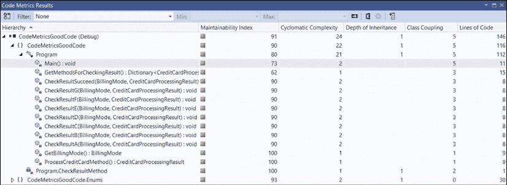
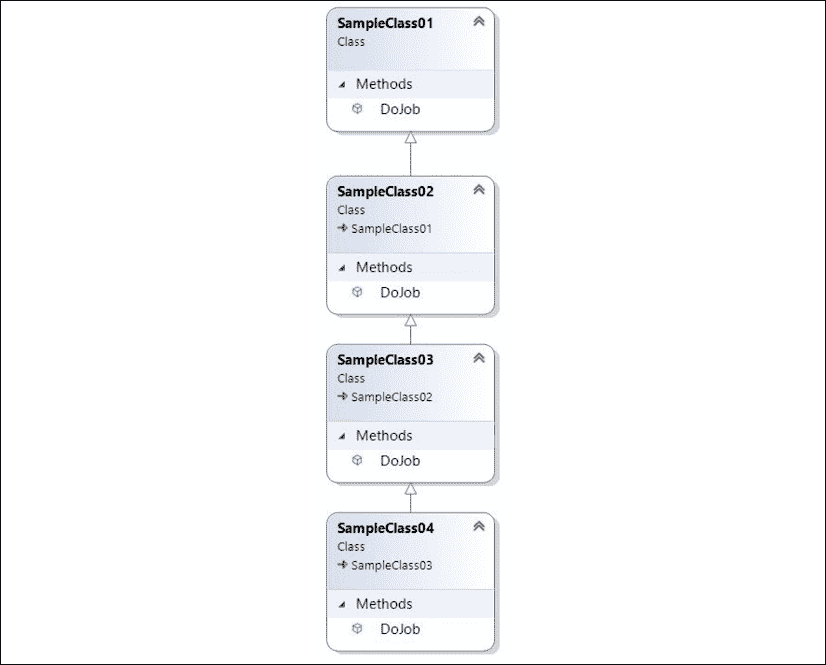
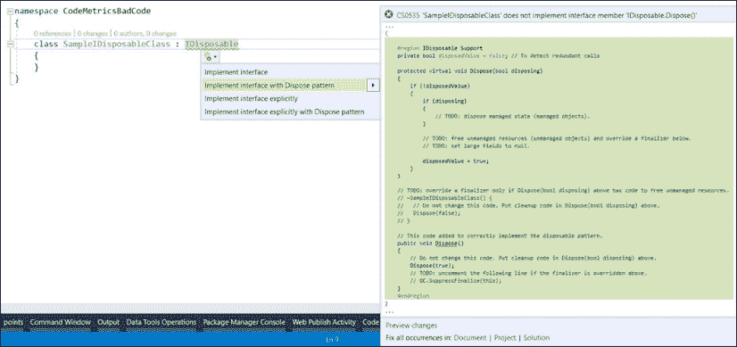

# 第十七章：C# 9 的最佳编码实践

当你在项目中担任软件架构师时，你有责任定义和/或维护一个编码标准，指导团队按照公司的期望进行编程。本章涵盖了一些编码的最佳实践，将帮助像你这样的开发人员编写安全、简单和可维护的软件。它还包括了在 C#中编码的技巧和窍门。

本章将涵盖以下主题：

+   你的代码复杂性如何影响性能

+   使用版本控制系统的重要性

+   在 C#中编写安全代码

+   编码的.NET 核心技巧和窍门

+   书中用例-编写代码的 Dos 和 Don'ts

C# 9 与.NET 5 一起推出。然而，这里介绍的实践可以在许多版本的.NET 中使用，但它们涉及 C#编程的基础。

# 技术要求

本章需要使用 Visual Studio 2019 免费的社区版或更高版本，并安装所有数据库工具。你可以在[`github.com/PacktPublishing/Software-Architecture-with-C-9-and-.NET-5`](https://github.com/PacktPublishing/Software-Architecture-with-C-9-and-.NET-5)找到本章的示例代码。

# 你的代码越复杂，你就是一个越糟糕的程序员

对于许多人来说，一个优秀的程序员是那种编写复杂代码的人。然而，软件开发成熟度的演变意味着有一种不同的思考方式。复杂性并不意味着工作做得好；它意味着代码质量差。一些令人难以置信的科学家和研究人员已经证实了这一理论，并强调专业代码需要专注于时间、高质量和预算内完成。

即使你手头上有一个复杂的情景，如果你减少模糊不清的地方并澄清你编写的过程，特别是使用良好的方法和变量名称，并遵守 SOLID 原则，你将把复杂性转化为简单的代码。

因此，如果你想编写优秀的代码，你需要专注于如何做到这一点，考虑到你不是唯一一个以后会阅读它的人。这是一个改变你编写代码方式的好建议。这就是我们将讨论本章的每个要点的方式。

如果你对编写优秀代码的重要性的理解与在编写代码时的简单和清晰的想法一致，你应该看一下 Visual Studio 工具**代码度量**：


图 17.1：在 Visual Studio 中计算代码度量

**代码度量**工具将提供度量标准，让你了解你正在交付的软件的质量。该工具提供的度量标准可以在此链接找到：[`docs.microsoft.com/en-us/visualstudio/code-quality/code-metrics-values?view=vs-2019`](https://docs.microsoft.com/en-us/visualstudio/code-quality/code-metrics-values?view=vs-2019)。以下小节重点描述了它们在一些实际场景中的用途。

## 可维护性指数

这个指数表示维护代码的难易程度-代码越容易，指数越高（限制为 100）。易于维护是保持软件健康的关键点之一。显然，任何软件都将需要未来的更改，因为变化是不可避免的。因此，如果你的可维护性水平低，考虑重构你的代码。编写专门负责单一职责的类和方法，避免重复代码，限制每个方法的代码行数是你可以提高可维护性指数的例子。

## 圈复杂度

《圈复杂度指标》的作者是 Thomas J. McCabe。他根据软件函数可用的代码路径数量（图节点）来定义函数的复杂性。路径越多，函数就越复杂。McCabe 认为每个函数的复杂度得分必须小于 10。这意味着，如果代码有更复杂的方法，您必须对其进行重构，将这些代码的部分转换为单独的方法。有一些真实的场景可以很容易地检测到这种行为：

+   循环内的循环

+   大量连续的`if-else`

+   在同一个方法中处理每个`case`的`switch`

例如，看一下处理信用卡交易的不同响应的此方法的第一个版本。正如您所看到的，圈复杂度大于 McCabe 所考虑的基数。这种情况发生的原因是主`switch`的每个`case`内部的`if-else`的数量：

```cs
/// <summary>
/// This code is being used just for explaining the concept of cyclomatic complexity. 
/// It makes no sense at all. Please Calculate Code Metrics for understanding 
/// </summary>
private static void CyclomaticComplexitySample()
{
  var billingMode = GetBillingMode();
  var messageResponse = ProcessCreditCardMethod();
  switch (messageResponse)
    {
      case "A":
        if (billingMode == "M1")
          Console.WriteLine($"Billing Mode {billingMode} for " +
            $"Message Response {messageResponse}");
        else
          Console.WriteLine($"Billing Mode {billingMode} for " +
            $"Message Response {messageResponse}");
        break;
      case "B":
        if (billingMode == "M2")
          Console.WriteLine($"Billing Mode {billingMode} for " +
            $"Message Response {messageResponse}");
        else
          Console.WriteLine($"Billing Mode {billingMode} for " +
            $"Message Response {messageResponse}");
        break;
      case "C":
        if (billingMode == "M3")
          Console.WriteLine($"Billing Mode {billingMode} for " +
            $"Message Response {messageResponse}");
        else
          Console.WriteLine($"Billing Mode {billingMode} for " +
            $"Message Response {messageResponse}");
        break;
      case "D":
        if (billingMode == "M4")
          Console.WriteLine($"Billing Mode {billingMode} for " +
            $"Message Response {messageResponse}");
        else
          Console.WriteLine($"Billing Mode {billingMode} for " +
            $"Message Response {messageResponse}");
        break;
      case "E":
        if (billingMode == "M5")
          Console.WriteLine($"Billing Mode {billingMode} for " +
            $"Message Response {messageResponse}");
        else
          Console.WriteLine($"Billing Mode {billingMode} for " +
            $"Message Response {messageResponse}");
        break;
      case "F":
        if (billingMode == "M6")
          Console.WriteLine($"Billing Mode {billingMode} for " +
            $"Message Response {messageResponse}");
        else
          Console.WriteLine($"Billing Mode {billingMode} for " +
            $"Message Response {messageResponse}");
        break;
      case "G":
        if (billingMode == "M7")
          Console.WriteLine($"Billing Mode {billingMode} for " +
            $"Message Response {messageResponse}");
        else
          Console.WriteLine($"Billing Mode {billingMode} for " +
            $"Message Response {messageResponse}");
        break;
      case "H":
        if (billingMode == "M8")
          Console.WriteLine($"Billing Mode {billingMode} for " +
            $"Message Response {messageResponse}");
        else
          Console.WriteLine($"Billing Mode {billingMode} for " +
            $"Message Response {messageResponse}");
        break;
      default:
        Console.WriteLine("The result of processing is unknown");
        break;
    }
} 
```

如果您计算此代码的代码指标，您将发现在圈复杂度方面的结果很糟糕，正如以下屏幕截图所示：


图 17.2：高圈复杂度

代码本身没有意义，但这里的重点是向您展示可以通过编写更好的代码来进行多少改进：

+   `switch-case`中的选项可以使用`Enum`来编写

+   每个`case`处理可以在一个特定的方法中完成

+   `switch-case`可以用`Dictionary<Enum, Method>`来替换

通过使用前述技术重构此代码，结果是一段更容易理解的代码，如下面的主方法的代码片段所示：

```cs
static void Main()
{
    var billingMode = GetBillingMode();
    var messageResponse = ProcessCreditCardMethod();
Dictionary<CreditCardProcessingResult, CheckResultMethod>
methodsForCheckingResult =GetMethodsForCheckingResult();
    if (methodsForCheckingResult.ContainsKey(messageResponse))
        methodsForCheckingResultmessageResponse;
    else
        Console.WriteLine("The result of processing is unknown");
} 
```

完整的代码可以在本章的 GitHub 存储库中找到，并演示了如何实现更低复杂度的代码。以下屏幕截图显示了这些结果，根据代码指标：



图 17.3：重构后的圈复杂度减少

正如您在前面的屏幕截图中所看到的，重构后复杂性大大减少。在第十三章《在 C# 9 中实现代码重用性》中，我们讨论了重构对于代码重用的重要性。我们在这里做这个的原因是一样的-我们想要消除重复。

关键点在于，通过应用这些技术，代码的理解增加了，复杂性减少了，证明了圈复杂度的重要性。

## 继承深度

这个指标代表了与正在分析的类连接的类的数量。您继承的类越多，指标就会越糟。这就像类耦合一样，表明了更改代码有多困难。例如，以下屏幕截图中有四个继承类：



图 17.4：继承深度示例

您可以在以下屏幕截图中看到，更深的类具有更糟糕的指标，因为有三个其他类可以更改其行为：


图 17.5：继承深度指标

继承是基本的面向对象分析原则之一。然而，它有时可能对您的代码不利，因为它可能导致依赖性。因此，如果有意义的话，考虑使用组合而不是继承。

## 类耦合

当您在一个类中连接太多类时，显然会产生耦合，这可能会导致代码维护不良。例如，参考以下屏幕截图。它显示了一个已经执行了大量聚合的设计。代码本身没有意义：


图 17.6：类耦合示例

一旦您计算了前述设计的代码指标，您将看到`ProcessData()`方法的类耦合实例数，该方法调用`ExecuteTypeA()`、`ExecuteTypeB()`和`ExecuteTypeC()`，等于三（`3`）：


图 17.7：类耦合度指标

一些论文指出，类耦合实例的最大数量应为九（`9`）。聚合比继承更好的实践，使用接口将解决类耦合问题。例如，相同的代码在以下设计中将给出更好的结果：


图 17.8：减少类耦合

注意，在设计中使用接口将允许您增加执行类型的数量，而不增加解决方案的类耦合度：


图 17.9：应用聚合后的类耦合结果

作为软件架构师，您必须考虑设计您的解决方案具有更多的内聚性而不是耦合性。文献表明，良好的软件具有低耦合和高内聚。在软件开发中，高内聚表示一个场景，其中每个类必须具有其方法和数据，并且它们之间有良好的关系。另一方面，低耦合表示软件中的类不是紧密和直接连接的。这是一个基本原则，可以指导您获得更好的架构模型。

## 代码行数

这个指标在让您了解您正在处理的代码规模方面是有用的。代码行数和复杂性之间没有联系，因为行数并不表示复杂性。另一方面，代码行数显示了软件的规模和软件设计。例如，如果一个类中有太多的代码行数（超过 1000 行代码-1KLOC），这表明它是一个糟糕的设计。

# 使用版本控制系统

你可能会觉得这本书中的这个主题有点显而易见，但许多人和公司仍然不将拥有版本控制系统视为软件开发的基本工具！写这个主题的想法是强迫你去理解它。如果你不使用版本控制系统，没有任何架构模型或最佳实践可以拯救软件开发。

在过去的几年里，我们一直在享受在线版本控制系统的优势，比如 GitHub、BitBucket 和 Azure DevOps。事实上，您必须在软件开发生命周期中拥有这样的工具，而且现在没有理由不拥有它，因为大多数提供商为小团队提供免费版本。即使您是独自开发，这些工具也可以用于跟踪您的更改，管理您的软件版本，并保证代码的一致性和完整性。

## 团队中处理版本控制系统

当你独自一人时使用版本控制系统工具是显而易见的。你想保护你的代码。但这种系统是为了解决编写代码时的团队问题而开发的。因此，一些功能，比如分支和合并，被引入以保持代码的完整性，即使在开发人员数量相当大的情况下也是如此。

作为软件架构师，您将不得不决定在团队中进行哪种分支策略。Azure DevOps 和 GitHub 提出了不同的交付方式，并且在某些场景中都是有用的。

关于 Azure DevOps 团队如何处理这个问题，可以在这里找到：[`devblogs.microsoft.com/devops/release-flow-how-we-do-branching-on-the-vsts-team/`](https://devblogs.microsoft.com/devops/release-flow-how-we-do-branching-on-the-vsts-team/)。GitHub 在[`guides.github.com/introduction/flow/`](https://guides.github.com/introduction/flow/)中描述了它的流程。我们不知道哪一个最适合您的需求，但我们希望您明白您需要有控制代码的策略。

在*第二十章*，*理解 DevOps 原则*中，我们将更详细地讨论这个问题。

# 在 C#中编写安全的代码

C#可以被认为是一种安全的编程语言。除非强制使用，否则不需要指针，并且在大多数情况下，内存释放由垃圾收集器管理。即便如此，您应该小心，以便从代码中获得更好和更安全的结果。让我们看一些确保 C#代码安全的常见做法。

## try-catch

编码中的异常是如此频繁，以至于每当它们发生时，您都应该有一种管理它们的方式。`try-catch`语句是用于管理异常的，并且对于保持代码安全非常重要。有很多情况下，应用程序崩溃的原因是缺乏使用`try-catch`。以下代码显示了缺乏使用`try-catch`语句的示例。值得一提的是，这只是一个例子，用于理解没有正确处理的异常概念。考虑使用`int.TryParse(textToConvert, out int result)`来处理解析不成功的情况：

```cs
private static int CodeWithNoTryCatch(string textToConvert)
{
    return Convert.ToInt32(textToConvert);
} 
```

另一方面，不正确使用`try-catch`也可能对您的代码造成损害，特别是因为您将看不到该代码的正确行为，并且可能会误解提供的结果。

以下代码显示了一个空的`try-catch`语句：

```cs
private static int CodeWithEmptyTryCatch(string textToConvert)
{
    try
    {
        return Convert.ToInt32(textToConvert);
    }
    catch
    {
        return 0;
    }
} 
```

`try-catch`语句必须始终与日志记录解决方案连接，以便您可以从系统获得响应，指示正确的行为，并且不会导致应用程序崩溃。以下代码显示了具有日志管理的理想`try-catch`语句。值得一提的是，尽可能捕获特定异常，因为捕获一般异常会隐藏意外异常：

```cs
private static int CodeWithCorrectTryCatch(string textToConvert)
{
    try
    {
        return Convert.ToInt32(textToConvert);
    }
    catch (FormatException err)
    {
        Logger.GenerateLog(err);
        return 0;
    }
} 
```

作为软件架构师，您应该进行代码检查，以修复代码中发现的这种行为。系统的不稳定性通常与代码中缺乏`try-catch`语句有关。

## try-finally 和 using

内存泄漏可以被认为是软件的最糟糕行为之一。它们会导致不稳定性，计算机资源的不良使用和不希望的应用程序崩溃。C#试图通过垃圾收集器解决这个问题，一旦它意识到对象可以被释放，就会自动释放内存中的对象。

与 I/O 交互的对象通常不受垃圾收集器管理：文件系统，套接字等。以下代码是`FileStream`对象的不正确使用示例，因为它认为垃圾收集器会释放所使用的内存，但实际上不会：

```cs
private static void CodeWithIncorrectFileStreamManagement()
{
    FileStream file = new FileStream("C:\\file.txt",
        FileMode.CreateNew);
    byte[] data = GetFileData();
    file.Write(data, 0, data.Length);
} 
```

此外，垃圾收集器与需要释放的对象交互需要一段时间，有时您可能希望自己执行。对于这两种情况，使用`try-finally`或`using`语句是最佳实践：

```cs
private static void CorrectFileStreamManagementFirstOption()
{
    FileStream file = new FileStream("C:\\file.txt",
        FileMode.CreateNew);
    try
    {
        byte[] data = GetFileData();
        file.Write(data, 0, data.Length);
    }
    finally
    {
        file.Dispose();
    }
}
private static void CorrectFileStreamManagementSecondOption()
{
    using (FileStream file = new FileStream("C:\\file.txt", 
        FileMode.CreateNew))
    {
        byte[] data = GetFileData();
        file.Write(data, 0, data.Length);
    }
}
private static void CorrectFileStreamManagementThirdOption()
{
    using FileStream file = new FileStream("C:\\file.txt", 
        FileMode.CreateNew);
    byte[] data = GetFileData();
    file.Write(data, 0, data.Length);
} 
```

前面的代码准确显示了如何处理垃圾收集器未管理的对象。您同时实现了`try-finally`和`using`。作为软件架构师，您确实需要注意这种代码。缺乏`try-finally`或`using`语句可能会在运行时对软件行为造成巨大损害。值得一提的是，使用代码分析工具（现在与.NET 5 一起分发）将自动提醒您这类问题。

## IDisposable 接口

与在方法中创建的对象不使用`try-finally`/`using`语句进行管理会导致问题类似，未正确实现`IDisposable`接口的类中创建的对象可能会导致应用程序中的内存泄漏。因此，当您有一个处理和创建对象的类时，应该实现可释放模式以确保释放其创建的所有资源：



图 17.10：IDisposable 接口实现

```cs
indicating it in your code and right-clicking on the Quick Actions and Refactoring option, as you can see in the preceding screenshot. 
```

插入代码后，您需要按照 TODO 说明执行，以实现正确的模式。

# .NET 5 编码技巧和窍门

.NET 5 实现了一些有助于我们编写更好代码的好功能。其中最有用的之一是**依赖注入**（**DI**），这已经在*第十一章*，*设计模式和.NET 5 实现*中讨论过。有一些很好的理由可以考虑这一点。首先，您不需要担心处理注入的对象，因为您不会是它们的创建者。

此外，DI 使您能够注入`ILogger`，这是一个用于调试异常的有用工具，需要在代码中通过`try-catch`语句进行管理。此外，在 C#中使用.NET 5 进行编程必须遵循任何编程语言的通用最佳实践。以下列表显示了其中一些：

+   **类、方法和变量应具有可理解的名称**：名称应该解释读者需要了解的一切。除非这些声明是公共的，否则不应该需要解释性注释。

+   **方法不能具有高复杂性级别**：应检查圈复杂度，以便方法不具有太多行的代码。

+   **成员必须具有正确的可见性**：作为面向对象的编程语言，C#允许使用不同的可见性关键字进行封装。C# 9.0 正在提供*Init-only setters*，因此您可以创建`init`属性/索引访问器而不是`set`，在对象构造后将这些成员定义为只读。

+   **应避免重复的代码**：在 C#等高级编程语言中没有理由存在重复的代码。

+   **在使用之前应检查对象**：由于可能存在空对象，代码必须进行空类型检查。值得一提的是，自 C# 8 以来，我们有可空引用类型，以避免与可空对象相关的错误。

+   **应使用常量和枚举器**：避免在代码中使用魔术数字和文本的一个好方法是将这些信息转换为常量和枚举器，这通常更容易理解。

+   **应避免使用不安全的代码**：不安全的代码使您能够在 C#中处理指针。除非没有其他实现解决方案的方法，否则应避免使用不安全的代码。

+   **try-catch 语句不能是空的**：`try-catch`语句在`catch`区域没有处理是没有理由的。此外，捕获的异常应尽可能具体，而不仅仅是一个“异常”，以避免吞噬意外的异常。

+   **处理您创建的对象，如果它们是可处置的**：即使对于垃圾收集器将处理已处置对象的对象，也要考虑处理您自己负责创建的对象。

+   **至少应该对公共方法进行注释**：考虑到公共方法是在您的库之外使用的方法，必须对其进行解释以进行正确的外部使用。

+   **switch-case 语句必须有默认处理**：由于`switch-case`语句可能在某些情况下接收到未知的入口变量，因此默认处理将确保在这种情况下代码不会中断。

您可以参考[`docs.microsoft.com/en-us/dotnet/csharp/language-reference/builtin-types/nullable-reference-types`](https://docs.microsoft.com/en-us/dotnet/csharp/language-reference/builtin-types/nullable-reference-t)获取有关可空引用类型的更多信息。

作为软件架构师，您可以考虑为开发人员提供代码模式的良好实践，以保持代码风格的一致性。您还可以将此代码模式用作编码检查的检查表，从而提高软件代码质量。

# WWTravelClub - 编写代码的 DOs 和 DON'Ts

作为软件架构师，您必须定义符合您所工作公司需求的代码标准。

在本书的示例项目中（在*第一章*，*了解软件架构的重要性*中了解更多关于 WWTravelClub 项目的信息），情况并无不同。我们决定为其制定标准的方式是描述我们在编写生成的示例时遵循的 DO 和 DON'T 的列表。值得一提的是，这个列表是开始制定标准的好方法，作为软件架构师，您应该与团队中的开发人员讨论这个列表，以便以实际和良好的方式发展它。

此外，这些语句旨在澄清团队成员之间的沟通，并改善您正在开发的软件的性能和可维护性：

+   用英文编写代码

+   遵循 C#编码规范，使用驼峰命名法

+   用易懂的名称编写类、方法和变量

+   注释公共类、方法和属性

+   尽可能使用`using`语句

+   尽可能使用`async`实现

+   不要编写空的`try-catch`语句

+   不要编写循环复杂度得分超过 10 的方法

+   不要在`for/while/do-while/foreach`语句中使用`break`和`continue`

这些 DO 和 DON'T 非常简单，而且比这更好的是，将为您的团队编写的代码产生很好的结果。在*第十九章*，*使用工具编写更好的代码*中，我们将讨论帮助您实施这些规则的工具。

# 总结

在本章中，我们讨论了编写安全代码的一些重要提示。本章介绍了一个用于分析代码指标的工具，以便您可以管理正在开发的软件的复杂性和可维护性。最后，我们提出了一些好的建议，以确保您的软件不会因内存泄漏和异常而崩溃。在现实生活中，软件架构师总是会被要求解决这类问题。

在下一章中，我们将学习一些单元测试技术，单元测试的原则，以及一个专注于 C#测试项目的软件过程模型。

# 问题

1.  我们为什么需要关注可维护性？

1.  循环复杂度是什么？

1.  列出使用版本控制系统的优势。

1.  垃圾收集器是什么？

1.  实现`IDisposable`接口的重要性是什么？

1.  在编码方面，.NET 5 给我们带来了哪些优势？

# 进一步阅读

这些是一些书籍和网站，您可以在本章的主题中找到更多信息：

+   *代码整洁之道：敏捷软件工艺的手册*，作者 Martin, Robert C. Pearson Education, 2012。

+   *嵌入式系统设计艺术*，作者 Jack G. Ganssle。Elsevier, 1999。

+   *重构*，作者 Martin Fowler。Addison-Wesley, 2018。

+   *复杂度测量*，作者 Thomas J. McCabe。IEEE Trans. Software Eng. 2(4): 308-320, 1976 ([`dblp.uni-trier.de/db/journals/tse/tse2.html`](https://dblp.uni-trier.de/db/journals/tse/tse2.html))。

+   [`blogs.msdn.microsoft.com/zainnab/2011/05/25/code-metrics-class-coupling/`](https://blogs.msdn.microsoft.com/zainnab/2011/05/25/code-metrics-class-coupling/)

+   [`docs.microsoft.com/en-us/visualstudio/code-quality/code-metrics-values?view=vs-2019`](https://docs.microsoft.com/en-us/visualstudio/code-quality/code-metrics-values?view=vs-2019)

+   [`github.com/`](https://github.com/)

+   [`bitbucket.org/`](https://bitbucket.org/)

+   [`azure.microsoft.com/en-us/services/devops/`](https://azure.microsoft.com/en-us/services/devops/)

+   [`guides.github.com/introduction/flow/`](https://guides.github.com/introduction/flow/)

+   [`blogs.msdn.microsoft.com/devops/2018/04/19/release-flow-how-we-do-branching-on-the-vsts-team/`](https://blogs.msdn.microsoft.com/devops/2018/04/19/release-flow-how-we-do-branching-on-the-vsts-team)

+   [`docs.microsoft.com/aspnet/core/fundamentals/logging/`](https://docs.microsoft.com/aspnet/core/fundamentals/logging/)

+   [`docs.microsoft.com/en-us/dotnet/csharp/whats-new/csharp-9`](https://docs.microsoft.com/en-us/dotnet/csharp/whats-new/csharp-9)
