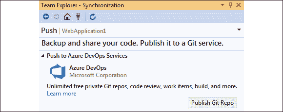
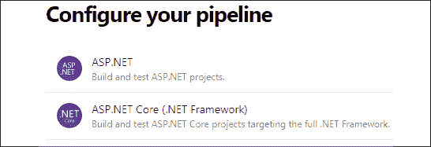
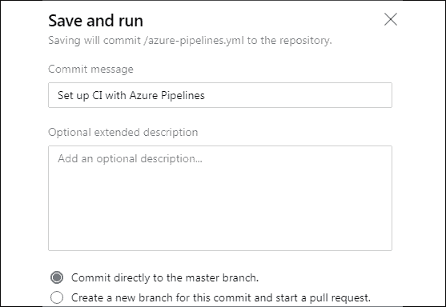
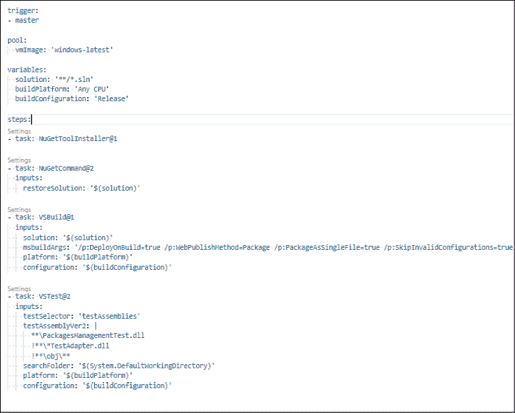
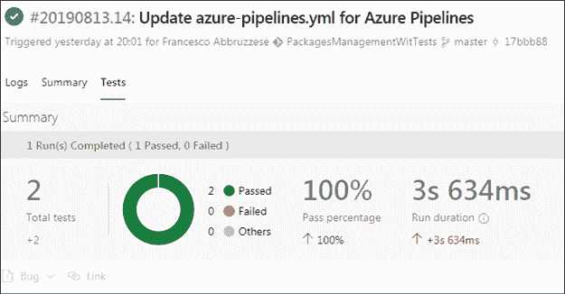

# 第十八章：使用单元测试用例和 TDD 测试您的代码

在开发软件时，确保应用程序没有错误并且满足所有要求是至关重要的。这可以通过在开发过程中测试所有模块，或者在整个应用程序已经完全或部分实现时进行测试来完成。

手动执行所有测试并不可行，因为大多数测试必须在应用程序修改时每次执行，并且正如本书中所解释的那样，现代软件正在不断修改以适应快速变化的市场需求。本章讨论了交付可靠软件所需的所有类型的测试，以及如何组织和自动化它们。

更具体地说，本章涵盖以下主题：

+   了解单元测试和集成测试及其用法

+   了解**测试驱动开发**（**TDD**）的基础知识

+   在 Visual Studio 中定义 C#测试项目

+   用例 - 在 DevOps Azure 中自动化单元测试

在本章中，我们将看到哪些类型的测试值得实施，以及什么是单元测试。我们将看到可用的不同类型的项目以及如何在其中编写单元测试。在本章结束时，本书的用例将帮助我们在 Azure DevOps 中执行我们的测试，自动执行我们应用程序的**持续集成/持续交付**（**CI/CD**）周期中的测试。

# 技术要求

本章需要安装 Visual Studio 2019 免费社区版或更高版本，并安装所有数据库工具。还需要一个免费的 Azure 帐户。如果您还没有创建，请参阅*第一章*中的*创建 Azure 帐户*部分。

本章中的所有概念都以基于 WWTravelClub 书用例的实际示例进行了澄清。本章的代码可在[`github.com/PacktPublishing/Software-Architecture-with-C-9-and-.NET-5`](https://github.com/PacktPublishing/Hands-On-Software-Architecture-with-C-9-and-.NET-5)上找到。

# 了解单元测试和集成测试

延迟应用程序测试直到大部分功能已完全实现必须避免以下原因：

+   如果一个类或模块设计或实现不正确，它可能已经影响了其他模块的实现方式。因此，在这一点上，修复问题可能会有很高的成本。

+   测试所有可能执行路径所需的输入组合随着一起测试的模块或类的数量呈指数增长。因此，例如，如果类方法`A`的执行可以有三条不同的路径，而另一个方法`B`的执行可以有四条路径，那么测试`A`和`B`将需要 3 x 4 个不同的输入。一般来说，如果我们一起测试几个模块，要测试的路径总数是每个模块中要测试的路径数的乘积。相反，如果模块分开测试，所需的输入数量只是测试每个模块所需的路径的总和。

+   如果由*N*个模块组成的聚合的测试失败，那么在*N*个模块中定位错误的来源通常是一项非常耗时的活动。

+   当一起测试*N*个模块时，我们必须重新定义涉及*N*个模块的所有测试，即使*N*个模块中的一个发生了变化。

这些考虑表明，更方便的是分别测试每个模块方法。不幸的是，验证所有方法而不考虑它们的上下文的一系列测试是不完整的，因为一些错误可能是由模块之间的不正确交互引起的。

因此，测试分为两个阶段：

+   **单元测试**：这些测试验证每个模块的所有执行路径是否正常。它们非常完整，通常覆盖所有可能的路径。这是因为与整个应用程序的可能执行路径相比，每个方法或模块的可能执行路径并不多。

+   **集成测试**：这些测试在软件通过所有单元测试后执行。集成测试验证所有模块是否正确交互以获得预期结果。集成测试不需要完整，因为单元测试已经验证了每个模块的所有执行路径是否正常工作。它们需要验证所有交互模式，也就是各种模块可能合作的所有可能方式。

通常，每种交互模式都有多个与之关联的测试：一种是典型的模式激活，另一种是一些极端情况下的激活。例如，如果整个交互模式接收一个数组作为输入，我们将编写一个测试来测试数组的典型大小，一个测试用`null`数组，一个测试用空数组，以及一个测试用非常大的数组。这样，我们可以验证单个模块的设计是否与整个交互模式的需求相匹配。

有了前面的策略，如果我们修改一个单个模块而不改变其公共接口，我们需要修改该模块的单元测试。

如果改变涉及到一些模块的交互方式，那么我们还需要添加新的集成测试或修改现有的集成测试。然而，通常情况下，这并不是一个大问题，因为大多数测试都是单元测试，因此重写所有集成测试的大部分并不需要太大的努力。此外，如果应用程序是根据**单一职责**、**开闭原则**、**里氏替换原则**、**接口隔离原则**或**依赖倒置原则**（**SOLID**）原则设计的，那么在单个代码修改后必须更改的集成测试数量应该很小，因为修改应该只影响直接与修改的方法或类交互的几个类。

## 自动化单元和集成测试

在这一点上，应该清楚地知道单元测试和集成测试都必须在软件的整个生命周期中得到重复使用。这就是为什么值得自动化它们。自动化单元和集成测试可以避免手动测试执行可能出现的错误，并节省时间。几千个自动化测试可以在每次对现代软件的 CI/CD 周期中所需的频繁更改中，在几分钟内验证软件的完整性，从而使得频繁更改成为可能。

随着发现新的错误，会添加新的测试来发现它们，以便它们不会在软件的未来版本中重新出现。这样，自动化测试总是变得更加可靠，并更好地保护软件免受由于新更改而引入的错误。因此，添加新错误的概率（不会立即被发现的错误）大大降低了。

下一节将为我们提供组织和设计自动化单元和集成测试的基础，以及如何在*C#测试项目定义*部分中编写测试的实际细节。

## 编写自动化（单元和集成）测试

测试不是从头开始编写的；所有软件开发平台都有工具，可以帮助我们编写测试并运行它们（或其中一些）。一旦选择的测试被执行，所有工具都会显示报告，并提供调试所有失败测试代码的可能性。

更具体地说，所有单元和集成测试框架都由三个重要部分组成：

+   **定义所有测试的设施**：它们验证实际结果是否与预期结果相符。通常，测试被组织成测试类，每个测试调用要么测试单个应用程序类，要么测试单个类方法。每个测试分为三个阶段：

1.  测试准备：准备测试所需的一般环境。这个阶段只是为测试准备全局环境，比如要注入到类构造函数中的对象或数据库表的模拟；它不准备我们要测试的每个方法的单独输入。通常，相同的准备过程用于多个测试，因此测试准备被分解成专门的模块。

1.  测试执行：使用适当的输入调用要测试的方法，并将其执行的所有结果与预期结果进行比较，使用诸如`Assert.Equal(x, y)`和`Assert.NotNull(x)`之类的结构。

1.  拆卸：清理整个环境，以避免一个测试的执行影响其他测试。这一步是*步骤 1*的相反。

+   模拟设施：集成测试使用涉及对象协作模式的所有（或几乎所有）类，而单元测试则禁止使用其他应用程序类。因此，如果被测试的类 A 使用另一个应用程序类 B 的方法，该方法在其构造函数或方法 M 中被注入，那么为了测试 M，我们必须注入 B 的一个虚假实现。值得指出的是，只有在单元测试期间，才不允许执行一些处理的类使用另一个类，而纯数据类可以。模拟框架包含定义接口和接口方法实现的设施，这些实现返回可以在测试中定义的数据。通常，模拟实现还能够报告所有模拟方法调用的信息。这样的模拟实现不需要定义实际的类文件，而是通过调用诸如`new Mock<IMyInterface>()`之类的方法在线上测试代码中完成。

+   执行和报告工具：这是一个基于可视化配置的工具，开发人员可以用来决定何时启动哪些测试以及何时启动它们。此外，它还显示了测试的最终结果，包括所有成功的测试、所有失败的测试、每个测试的执行时间以及依赖于特定工具和配置方式的其他信息的报告。通常，在开发 IDE（如 Visual Studio）中执行的执行和报告工具还可以让您在每个失败的测试上启动调试会话。

由于只有接口允许完全模拟定义其所有方法，我们应该在类的构造函数和方法中注入接口或纯数据类（不需要模拟）；否则，类将无法进行单元测试。因此，对于我们想要注入到另一个类中的每个协作类，我们必须定义一个相应的接口。

此外，类应该使用在它们的构造函数或方法中注入的实例，而不是其他类的公共静态字段中可用的类实例；否则，在编写测试时可能会忘记隐藏的交互，这可能会使测试的准备步骤变得复杂。

以下部分描述了软件开发中使用的其他类型的测试。

## 编写验收和性能测试

验收测试定义了项目利益相关者和开发团队之间的合同。它们用于验证开发的软件实际上是否与他们达成的协议一致。验收测试不仅验证功能规范，还验证了软件可用性和用户界面的约束。由于它们还有展示软件在实际计算机监视器和显示器上的外观和行为的目的，它们永远不是完全自动的，而主要由操作员遵循的食谱和验证列表组成。

有时，自动测试是为了验证功能规范而开发的，但这些测试通常绕过用户界面，并直接将测试输入注入到用户界面后面的逻辑中。例如，在 ASP.NET Core MVC 应用程序的情况下，整个网站在包含填充了测试数据的所有必要存储的完整环境中运行。输入不是提供给 HTML 页面，而是直接注入到 ASP.NET Core 控制器中。绕过用户界面的测试称为皮下测试。ASP.NET Core 提供了各种工具来执行皮下测试，以及自动化与 HTML 页面交互的工具。

在自动化测试的情况下，通常首选皮下测试，而全面测试是手动执行的原因如下：

+   没有自动测试可以验证用户界面的外观和可用性。

+   自动化实际与用户界面的交互是一项非常耗时的任务。

+   用户界面经常更改以改善其可用性并添加新功能，对单个应用程序屏幕的小改动可能会迫使对该屏幕上的所有测试进行完全重写。

简而言之，用户界面测试非常昂贵，可重用性低，因此很少值得自动化。但是，ASP.NET Core 提供了`Microsoft.AspNetCore.Mvc.Testing` NuGet 包，以在测试环境中运行整个网站。与`AngleSharp` NuGet 包一起使用，可以编写具有可接受的编程工作的自动化全面测试。自动化的 ASP.NET Core 验收测试将在*第二十二章* *功能测试自动化*中详细描述。

性能测试对应用程序施加虚拟负载，以查看其是否能够处理典型的生产负载，发现其负载限制，并定位瓶颈。该应用程序部署在一个与硬件资源相同的实际生产环境的分期环境中。

然后，虚拟请求被创建并应用于系统，并收集响应时间和其他指标。虚拟请求批次应该与实际生产批次具有相同的组成。如果可用，它们可以从实际生产请求日志中生成。

如果响应时间不令人满意，将收集其他指标以发现可能的瓶颈（低内存、慢存储或慢软件模块）。一旦找到，就可以在调试器中分析负责问题的软件组件，以测量典型请求中涉及的各种方法调用的执行时间。

性能测试中的失败可能导致重新定义应用程序所需的硬件，或者优化一些软件模块、类或方法。

Azure 和 Visual Studio 都提供了创建虚拟负载和报告执行指标的工具。但是，它们已被宣布过时，并将被停用，因此我们不会对其进行描述。作为替代方案，有开源和第三方工具可供使用。其中一些列在*进一步阅读*部分。

下一节描述了一种给测试赋予中心作用的软件开发方法论。

# 理解测试驱动开发（TDD）

**测试驱动开发**（**TDD**）是一种软件开发方法论，它赋予单元测试中心作用。根据这种方法论，单元测试是对每个类的规范的正式化，因此必须在编写类的代码之前编写。实际上，覆盖所有代码路径的完整测试唯一地定义了代码行为，因此可以被视为代码的规范。它不是通过某种正式语言定义代码行为的正式规范，而是基于行为示例的规范。

测试软件的理想方式是编写整个软件行为的正式规范，并使用一些完全自动化的工具验证实际生成的软件是否符合这些规范。过去，一些研究工作花费在定义描述代码规范的正式语言上，但用类似语言表达开发人员心中的行为是一项非常困难且容易出错的任务。因此，这些尝试很快被放弃，转而采用基于示例的方法。当时，主要目的是自动生成代码。

如今，自动生成代码已经大幅被放弃，并在小型应用领域中得以存留，例如创建设备驱动程序。在这些领域，将行为形式化为正式语言的工作量值得花费时间，因为这样做可以节省测试难以重现的并行线程行为的时间。

单元测试最初被构想为一种完全独立的编码示例规范的方式，作为一种名为**极限编程**的特定敏捷开发方法的一部分。然而，如今，TDD 独立于极限编程使用，并作为其他敏捷方法的强制规定。

尽管毫无疑问，经过发现数百个错误后细化的单元测试可以作为可靠的代码规范，但开发人员很难设计可以立即用作代码可靠规范的单元测试。事实上，通常情况下，如果随机选择示例，你需要无限或至少大量的示例来明确定义代码的行为。

只有在理解了所有可能的执行路径之后，才能用可接受的数量的示例来定义行为。事实上，在这一点上，只需为每个执行路径选择一个典型示例即可。因此，在完全编写了方法之后为该方法编写单元测试很容易：只需为已存在的代码的每个执行路径选择一个典型实例。然而，以这种方式编写单元测试并不能防止执行路径设计中的错误。可以说，事先编写测试并不能防止某人忘记测试一个值或值的组合-没有人是完美的！然而，它确实迫使您在实施之前明确考虑它们，这就是为什么您不太可能意外地忽略测试用例。

我们可以得出结论，编写单元测试时，开发人员必须以某种方式预测所有执行路径，寻找极端情况，并可能添加比严格需要的更多的示例。然而，开发人员在编写应用程序代码时可能会犯错误，而在设计单元测试时也可能会犯错误，无法预测所有可能的执行路径。

我们已经确定了 TDD 的主要缺点：单元测试本身可能是错误的。也就是说，不仅应用程序代码，而且其相关的 TDD 单元测试可能与开发人员心中的行为不一致。因此，在开始阶段，单元测试不能被视为软件规范，而是软件行为可能错误和不完整的描述。因此，我们对心中的行为有两种描述：应用程序代码本身以及在应用程序代码之前编写的 TDD 单元测试。

TDD 起作用的原因在于在编写测试和编写代码时犯同样错误的概率非常低。因此，每当测试失败时，测试或应用程序代码中都存在错误，反之亦然，如果应用程序代码或测试中存在错误，测试将失败的概率非常高。也就是说，使用 TDD 可以确保大多数错误立即被发现！

使用 TDD 编写类方法或一段代码是由三个阶段组成的循环：

+   红色阶段：在这个阶段，开发人员编写空方法，要么抛出`NotImplementedException`，要么有空的方法体，并为它们设计新的单元测试，这些测试必须失败，因为此时还没有实现它们描述的行为的代码。

+   绿色阶段：在这个阶段，开发人员编写最少的代码或对现有代码进行最少的修改，以通过所有单元测试。

+   **重构阶段**：一旦测试通过，代码将被重构以确保良好的代码质量和最佳实践和模式的应用。特别是在这个阶段，一些代码可以被提取到其他方法或其他类中。在这个阶段，我们可能还会发现需要其他单元测试，因为发现或创建了新的执行路径或新的极端情况。

一旦所有测试通过而没有编写新代码或修改现有代码，循环就会停止。

有时，设计初始单元测试非常困难，因为很难想象代码可能如何工作以及可能采取的执行路径。在这种情况下，您可以通过编写应用程序代码的初始草图来更好地理解要使用的特定算法。在这个初始阶段，我们只需要专注于主要的执行路径，完全忽略极端情况和输入验证。一旦我们清楚了应该工作的算法背后的主要思想，我们就可以进入标准的三阶段 TDD 循环。

在下一节中，我们将列出 Visual Studio 中提供的所有测试项目，并详细描述 xUnit。

# 定义 C#测试项目

Visual Studio 包含三种类型的单元测试框架的项目模板，即 MSTest、xUnit 和 NUnit。一旦启动新项目向导，为了可视化它们中的适用于.NET Core C#应用程序的版本，将**项目类型**设置为**测试**，**语言**设置为**C#**，**平台**设置为**Linux**，因为.NET Core 项目是唯一可以部署在 Linux 上的项目。

以下屏幕截图显示了应该出现的选择：


图 18.1：添加测试项目

所有前述项目都自动包含用于在 Visual Studio 测试用户界面（Visual Studio 测试运行器）中运行所有测试的 NuGet 包。但它们不包含任何用于模拟接口的设施，因此您需要添加`Moq`NuGet 包，其中包含一个流行的模拟框架。

所有测试项目必须包含对要测试的项目的引用。

在接下来的部分中，我们将描述 xUnit，因为它可能是这三个框架中最受欢迎的。然而，这三个框架都非常相似，主要区别在于用于装饰各种测试类和方法的属性的名称以及断言方法的名称。

## 使用 xUnit 测试框架

在 xUnit 中，测试是用`[Fact]`或`[Theory]`属性装饰的方法。测试会被测试运行器自动发现，并在用户界面中列出所有测试，因此用户可以运行所有测试或只运行其中的一部分。

在运行每个测试之前，会创建测试类的一个新实例，因此在类构造函数中包含的*测试准备*代码会在类的每个测试之前执行。如果您还需要*拆卸*代码，测试类必须实现`IDisposable`接口，以便将拆卸代码包含在`IDisposable.Dispose`方法中。

测试代码调用要测试的方法，然后使用`Assert`静态类的方法测试结果，例如`Assert.NotNull(x)`、`Assert.Equal(x, y)`和`Assert.NotEmpty(IEnumerable x)`。还有一些方法可以验证调用是否引发了特定类型的异常，例如：

```cs
 Assert.Throws<MyException>(() => {/* test code */ ...}). 
```

当断言失败时，会抛出异常。如果测试代码或断言抛出未拦截的异常，则测试失败。

以下是定义单个测试的方法示例：

```cs
[Fact]
public void Test1()
{
    var myInstanceToTest = new ClassToTest();
    Assert.Equal(5, myInstanceToTest.MethodToTest(1));
} 
```

当一个方法只定义一个测试时，使用 `[Fact]` 属性，而当同一个方法定义多个测试时，每个测试都在不同的数据元组上使用时，使用 `[Theory]` 属性。数据元组可以以多种方式指定，并作为方法参数注入到测试中。

可以修改上述代码以在多个输入上测试 `MethodToTest`，如下所示：

```cs
[Theory]
[InlineData(1, 5)]
[InlineData(3, 10)]
[InlineData(5, 20)]
public void Test1(int testInput, int testOutput)
{
    var myInstanceToTest = new ClassToTest();
    Assert.Equal(testOutput, 
        myInstanceToTest.MethodToTest(testInput));
} 
```

每个 `InlineData` 属性指定要注入到方法参数中的元组。由于属性参数只能包含简单的常量数据，xUnit 还允许您从实现 `IEnumerable` 的类中获取所有数据元组，如下例所示：

```cs
public class Test1Data: IEnumerable<object[]>
{
    public IEnumerator<object[]> GetEnumerator()
    {
        yield return new object[] { 1, 5};
        yield return new object[] { 3, 10 };
        yield return new object[] { 5, 20 };
    }
    IEnumerator IEnumerable.GetEnumerator()=>GetEnumerator();

}
...
...
[Theory]
[ClassData(typeof(Test1Data))]
public void Test1(int testInput, int testOutput)
{
    var myInstanceToTest = new ClassToTest();
    Assert.Equal(testOutput, 
        myInstanceToTest.MethodToTest(testInput));
} 
```

提供测试数据的类的类型由 `ClassData` 属性指定。

还可以使用 `MemberData` 属性从返回 `IEnumerable` 的类的静态方法中获取数据，如下例所示：

```cs
[Theory]
[MemberData(nameof(MyStaticClass.Data), 
    MemberType= typeof(MyStaticClass))]
public void Test1(int testInput, int testOutput)
{
    ... 
```

`MemberData` 属性将方法名作为第一个参数传递，并在 `MemberType` 命名参数中指定类类型。如果静态方法是同一个测试类的一部分，则可以省略 `MemberType` 参数。

下一节将展示如何处理一些高级的准备和清理场景。

## 高级测试准备和清理场景

有时，准备代码包含非常耗时的操作，例如打开与数据库的连接，这些操作不需要在每个测试之前重复执行，但可以在同一个类中的所有测试之前执行一次。在 xUnit 中，这种类型的测试准备代码不能包含在测试类构造函数中；因为在每个单独的测试之前都会创建测试类的不同实例，所以必须将其分解到一个称为 fixture 类的单独类中。

如果我们还需要相应的清理代码，fixture 类必须实现 `IDisposable`。在其他测试框架（如 NUnit）中，测试类实例只会创建一次，因此不需要将 fixture 代码分解到其他类中。然而，不会在每个测试之前创建新实例的测试框架（如 NUnit）可能会因为测试方法之间的不必要交互而出现 bug。

以下是一个打开和关闭数据库连接的 xUnit fixture 类示例：

```cs
public class DatabaseFixture : IDisposable
{
    public DatabaseFixture()
    {
        Db = new SqlConnection("MyConnectionString");
    }
    public void Dispose()
    {
        Db.Close()
    }
    public SqlConnection Db { get; private set; }
} 
```

由于 fixture 类的实例在执行与 fixture 相关的所有测试之前只创建一次，并且在测试后立即被销毁，因此当 fixture 类被创建时数据库连接也只会创建一次，并且在 fixture 对象被销毁后立即被销毁。

通过让测试类实现空的 `IClassFixture<T>` 接口，fixture 类与每个测试类相关联，如下所示：

```cs
public class MyTestsClass : IClassFixture<DatabaseFixture>
{
    private readonly DatabaseFixture fixture;
    public MyDatabaseTests(DatabaseFixture fixture)
    {
        this.fixture = fixture;
    }
    ...
    ...
} 
```

为了使 fixture 测试准备中计算的所有数据对测试可用，fixture 类的实例会自动注入到测试类的构造函数中。例如，在我们之前的例子中，我们可以获取数据库连接实例，以便类的所有测试方法都可以使用它。

如果我们想要在测试类的集合中执行一些测试准备代码，而不是单个测试类，我们必须将 fixture 类与表示测试类集合的空类关联起来，如下所示：

```cs
[CollectionDefinition("My Database collection")]
public class DatabaseCollection : ICollectionFixture<DatabaseFixture>
{
    // this class is empty, since it is just a placeholder
} 
```

`CollectionDefinition` 属性声明了集合的名称，`IClassFixture<T>` 接口已被 `ICollectionFixture<T>` 取代。

然后，我们通过将 `Collection` 属性应用到测试类，声明测试类属于先前定义的集合，如下所示：

```cs
[Collection("My Database collection")]
public class MyTestsClass 
{
    DatabaseFixture fixture;
    public MyDatabaseTests(DatabaseFixture fixture)
    {
        this.fixture = fixture;
    }
    ...
    ...
} 
```

`Collection` 属性声明要使用的集合，而测试类构造函数中的 `DataBaseFixture` 参数提供了一个实际的 fixture 类实例，因此它可以在所有类测试中使用。

接下来的部分将展示如何使用`Moq`框架模拟接口。

## 使用 Moq 模拟接口

模拟能力不包括在我们在本节中列出的任何测试框架中，因为它们不包括在 xUnit 中。因此，它们必须通过安装特定的 NuGet 包来提供。`Moq`框架可在`Moq` NuGet 包中获得，是.NET 中最流行的模拟框架。它非常容易使用，并将在本节中简要描述。

一旦我们安装了 NuGet 包，我们需要在测试文件中添加`using Moq`语句。模拟实现很容易定义，如下所示：

```cs
 var myMockDependency = new Mock<IMyInterface>(); 
```

可以使用`Setup/Return`方法对特定输入的特定方法的模拟依赖行为进行定义，如下所示：

```cs
myMockDependency.Setup(x=>x.MyMethod(5)).Returns(10); 
```

我们可以为同一个方法添加多个`Setup/Return`指令。这样，我们可以指定无限数量的输入/输出行为。

我们可以使用通配符来匹配特定类型，而不是特定的输入值，如下所示：

```cs
myMockDependency.Setup(x => x.MyMethod(It.IsAny<int>()))
                  .Returns(10); 
```

配置了模拟依赖之后，我们可以从其`Object`属性中提取模拟的实例，并将其用作实际实现，如下所示：

```cs
var myMockedInstance=myMockDependency.Object;
...
myMockedInstance.MyMethod(10); 
```

然而，模拟的方法通常由测试中的代码调用，所以我们只需要提取模拟的实例并在测试中使用它作为输入。

我们也可以模拟属性和异步方法，如下所示：

```cs
myMockDependency.Setup(x => x.MyProperty)
                  .Returns(42);
...
myMockDependency.Setup(x => x.MyMethodAsync(1))
                    .ReturnsAsync("aasas");
var res=await myMockDependency.Object
    .MyMethodAsync(1); 
```

对于异步方法，`Returns`必须替换为`ReturnsAsync`。

每个模拟的实例都记录其方法和属性的所有调用，因此我们可以在测试中使用这些信息。以下代码显示了一个例子：

```cs
myMockDependency.Verify(x => x.MyMethod(1), Times.AtLeast(2)); 
```

上述语句断言`MyMethod`至少被给定参数调用了两次。还有`Times.Never`和`Times.Once`（断言方法只被调用了一次），以及更多。

到目前为止，Moq 文档总结应该涵盖了你在测试中可能遇到的 99%的需求，但 Moq 还提供了更复杂的选项。*进一步阅读*部分包含了完整文档的链接。

接下来的部分将展示如何实践定义单元测试以及如何在 Visual Studio 和 Azure DevOps 中运行它们，以书中用例的帮助。

# 用例 - 在 DevOps Azure 中自动化单元测试

在本节中，我们将向我们在*第十五章* *介绍 ASP.NET Core MVC*中构建的示例应用程序添加一些单元测试项目。如果你没有它，你可以从与本书相关的 GitHub 存储库的*第十五章* *介绍 ASP.NET Core MVC*部分下载它。

首先，让我们复制解决方案文件夹并将其命名为`PackagesManagementWithTests`。然后，打开解决方案并将其添加到一个名为`PackagesManagementTest`的 xUnit .NET Core C#测试项目中。最后，添加对 ASP.NET Core 项目（`PackagesManagement`）的引用，因为我们将对其进行测试，并添加对`Moq` NuGet 包的最新版本的引用，因为我们需要模拟能力。在这一点上，我们已经准备好编写我们的测试了。

例如，我们将为`ManagePackagesController`控制器的带有`[HttpPost]`装饰的`Edit`方法编写单元测试，如下所示：

```cs
[HttpPost]
public async Task<IActionResult> Edit(
    PackageFullEditViewModel vm,
    [FromServices] ICommandHandler<UpdatePackageCommand> command)
{
    if (ModelState.IsValid)
    {
        await command.HandleAsync(new UpdatePackageCommand(vm));
        return RedirectToAction(
            nameof(ManagePackagesController.Index));
    }
    else
        return View(vm);
} 
```

在编写我们的测试方法之前，让我们将自动包含在测试项目中的测试类重命名为`ManagePackagesControllerTests`。

第一个测试验证了如果`ModelState`中存在错误，那么操作方法将使用相同的模型呈现一个视图，以便用户可以纠正所有错误。让我们删除现有的测试方法，并编写一个空的`DeletePostValidationFailedTest`方法，如下所示：

```cs
[Fact]
public async Task DeletePostValidationFailedTest()
{
} 
```

由于我们要测试的`Edit`方法是`async`的，方法必须是`async`，返回类型必须是`Task`。在这个测试中，我们不需要模拟对象，因为不会使用任何注入的对象。因此，作为测试的准备，我们只需要创建一个控制器实例，并且必须向`ModelState`添加一个错误，如下所示：

```cs
var controller = new ManagePackagesController();
controller.ModelState
    .AddModelError("Name", "fake error"); 
```

然后我们调用该方法，注入`ViewModel`和一个`null`命令处理程序作为它的参数，因为命令处理程序将不会被使用：

```cs
var vm = new PackageFullEditViewModel();
var result = await controller.Edit(vm, null); 
```

在验证阶段，我们验证结果是`ViewResult`，并且它包含在控制器中注入的相同模型：

```cs
var viewResult = Assert.IsType<ViewResult>(result);
Assert.Equal(vm, viewResult.Model); 
```

现在，我们还需要一个测试来验证，如果没有错误，命令处理程序被调用，然后浏览器被重定向到`Index`控制器的操作方法。我们调用`DeletePostSuccessTest`方法：

```cs
[Fact]
public async Task DeletePostSuccessTest()
{
} 
```

这次准备代码必须包括命令处理程序模拟的准备工作，如下所示：

```cs
var controller = new ManagePackagesController();
var commandDependency =
    new Mock<ICommandHandler<UpdatePackageCommand>>();
commandDependency
    .Setup(m => m.HandleAsync(It.IsAny<UpdatePackageCommand>()))
    .Returns(Task.CompletedTask);
var vm = new PackageFullEditViewModel(); 
```

由于处理程序`HandleAsync`方法没有返回`async`值，我们不能使用`ReturnsAsync`，而是必须使用`Returns`方法返回一个完成的`Task`(`Task.Complete`)。要测试的方法被调用时，传入了`ViewModel`和模拟的处理程序：

```cs
var result = await controller.Edit(vm, 
    commandDependency.Object); 
```

在这种情况下，验证代码如下：

```cs
commandDependency.Verify(m => m.HandleAsync(
    It.IsAny<UpdatePackageCommand>()), 
    Times.Once);
var redirectResult=Assert.IsType<RedirectToActionResult>(result);
Assert.Equal(nameof(ManagePackagesController.Index), 
    redirectResult.ActionName);
Assert.Null(redirectResult.ControllerName); 
```

作为第一步，我们验证命令处理程序是否实际被调用了一次。更好的验证还应包括检查它是否被调用，并且传递给操作方法的命令包括`ViewModel`。我们将把它作为一个练习来进行。

然后我们验证操作方法返回`RedirectToActionResult`，并且具有正确的操作方法名称，没有指定控制器名称。

一旦所有测试准备就绪，如果测试窗口没有出现在 Visual Studio 的左侧栏中，我们可以简单地从 Visual Studio 的**测试**菜单中选择**运行所有测试**项目。一旦测试窗口出现，进一步的调用可以从这个窗口内启动。

如果测试失败，我们可以在其代码中添加断点，这样我们就可以通过在测试窗口中右键单击它，然后选择**调试选定的测试**来启动调试会话。

## 连接到 Azure DevOps 存储库

测试在应用程序的 CI/CD 周期中发挥着基础作用，特别是在持续集成中。它们必须至少在每次应用程序存储库的主分支被修改时执行，以验证更改不会引入错误。

以下步骤显示了如何将我们的解决方案连接到 Azure DevOps 存储库，并且我们将定义一个 Azure DevOps 流水线来构建项目并启动其测试。这样，每天在所有开发人员推送他们的更改之后，我们可以启动流水线来验证存储库代码是否编译并通过了所有测试：

1.  作为第一步，我们需要一个免费的 DevOps 订阅。如果你还没有，请点击此页面上的**开始免费**按钮创建一个：[`azure.microsoft.com/en-us/services/devops/`](https://azure.microsoft.com/en-us/services/devops/)。在这里，让我们定义一个组织，但在创建项目之前停下来，因为我们将从 Visual Studio 内部创建项目。

1.  确保你已经用 Azure 账户登录到 Visual Studio（与创建 DevOps 账户时使用的相同）。在这一点上，你可以通过右键单击解决方案并选择**配置到 Azure 的持续交付...**来为你的解决方案创建一个 DevOps 存储库。在出现的窗口中，一个错误消息会告诉你你的代码没有配置存储库：

图 18.2：没有存储库错误消息

1.  点击**立即添加到源代码控制**链接。之后，DevOps 屏幕将出现在 Visual Studio 的**Team Explorer**选项卡中：

图 18.3：发布存储库到 DevOps 面板

如*第三章*所示，*使用 Azure DevOps 记录需求*，Team Explorer 正在被 Git Changes 取代，但如果这个自动向导带你到 Team Explorer，就用它来创建你的存储库。然后你可以使用 Git Changes 窗口。

1.  单击“发布 Git 存储库”按钮后，将提示您选择 DevOps 组织和存储库的名称。成功将代码发布到 DevOps 存储库后，DevOps 屏幕应该会发生以下变化：

图 18.4：发布后的 DevOps 按钮

DevOps 屏幕显示了您在线 DevOps 项目的链接。将来，当您打开解决方案时，如果链接没有出现，请单击 DevOps 屏幕的“连接”按钮或“管理连接”链接（以后出现的那个）来选择并连接您的项目。

1.  单击此链接转到在线项目。一旦进入那里，如果单击左侧菜单上的“存储库”项目，您将看到刚刚发布的存储库。

1.  现在，单击“管道”菜单项来创建一个用于构建和测试项目的 DevOps 管道。在出现的窗口中，单击按钮创建新的管道：

图 18.5：管道页面

1.  您将被提示选择存储库的位置：

图 18.6：存储库选择

1.  选择“Azure Repos Git”，然后选择您的存储库。然后会提示您关于项目性质的信息：

图 18.7：管道配置

1.  选择“ASP.NET Core”。将为您自动创建一个用于构建和测试项目的管道。通过将新创建的`.yaml`文件提交到存储库来保存它：

图 18.8：管道属性

1.  可以通过选择“排队”按钮来运行管道，但由于 DevOps 标准管道在存储库的主分支上有一个触发器，每次提交更改或修改管道时都会自动启动。可以通过单击“编辑”按钮来修改管道：

图 18.9：管道代码

1.  一旦进入编辑模式，所有管道步骤都可以通过单击每个步骤上方出现的“设置”链接进行编辑。可以按以下方式添加新的管道步骤：

1.  在新步骤必须添加的地方写“- 任务：”，然后在输入任务名称时接受出现的建议之一。

1.  一旦编写了有效的任务名称，新步骤上方将出现“设置”链接。单击它。

1.  在出现的窗口中插入所需的任务参数，然后保存。

1.  为了使我们的测试工作，我们需要指定定位包含测试的所有程序集的条件。在我们的情况下，由于我们有一个包含测试的唯一的`.dll`文件，只需指定其名称即可。单击`VSTest@2`测试任务的“设置”链接，并用以下内容替换自动建议的“测试文件”字段的内容：

```cs
**\PackagesManagementTest.dll
!**\*TestAdapter.dll
!**\obj\** 
```

1.  然后单击“添加”以修改实际的管道内容。一旦在“保存并运行”对话框中确认了更改，管道就会启动，如果没有错误，测试结果就会被计算出来。可以通过在管道“历史”选项卡中选择特定构建，并单击出现的页面上的“测试”选项卡来分析特定构建期间启动的测试结果。在我们的情况下，应该看到类似以下截图的内容：

图 18.10：测试结果

1.  如果单击管道页面的“分析”选项卡，您将看到与所有构建相关的分析，包括有关测试结果的分析：

图 18.11：构建分析

1.  单击“分析”页面的测试区域会得到有关所有管道测试结果的详细报告。

总结一下，我们创建了一个新的 Azure DevOps 存储库，将解决方案发布到新存储库，然后创建了一个构建管道，在每次构建后执行我们的测试。构建管道一旦保存就会执行，并且每当有人提交到主分支时都会执行。

# 摘要

在本章中，我们解释了为什么值得自动化软件测试，然后我们专注于单元测试的重要性。我们还列出了所有类型的测试及其主要特点，主要关注单元测试。我们分析了 TDD 的优势，以及如何在实践中使用它。有了这些知识，您应该能够编写既可靠又易于修改的软件。

最后，我们分析了.NET Core 项目可用的所有测试工具，重点介绍了 xUnit 和 Moq 的描述，并展示了如何在实践中使用它们，无论是在 Visual Studio 还是在 Azure DevOps 中，都是通过本书的用例。

下一章将讨论如何测试和衡量代码的质量。

# 问题

1.  为什么值得自动化单元测试？

1.  TDD 能够立即发现大多数错误的主要原因是什么？

1.  `[Theory]`和`[Fact]`属性在 xUnit 中有什么区别？

1.  在测试断言中使用了哪个 xUnit 静态类？

1.  哪些方法允许定义 Moq 模拟的依赖项？

1.  是否可以使用 Moq 模拟异步方法？如果可以，如何？

# 进一步阅读

尽管本章中包含的 xUnit 文档非常完整，但它并未包括 xUnit 提供的少量配置选项。完整的 xUnit 文档可在[`xunit.net/`](https://xunit.net/)找到。MSTest 和 NUnit 的文档分别可在[`github.com/microsoft/testfx`](https://github.com/microsoft/testfx)和[`github.com/nunit/docs/wiki/NUnit-Documentation`](https://github.com/nunit/docs/wiki/NUnit-Documentation)找到。

Moq 的完整文档可在[`github.com/moq/moq4/wiki/Quickstart`](https://github.com/moq/moq4/wiki/Quickstart)找到。

以下是一些用于 Web 应用程序的性能测试框架的链接：

+   [`jmeter.apache.org/`](https://jmeter.apache.org/)（免费且开源）

+   [`www.neotys.com/neoload/overview`](https://www.neotys.com/neoload/overview)

+   [`www.microfocus.com/en-us/products/loadrunner-load-testing/overview`](https://www.microfocus.com/en-us/products/loadrunner-load-testing/overview)

+   [`www.microfocus.com/en-us/products/silk-performer/overview`](https://www.microfocus.com/en-us/products/silk-performer/overview)
