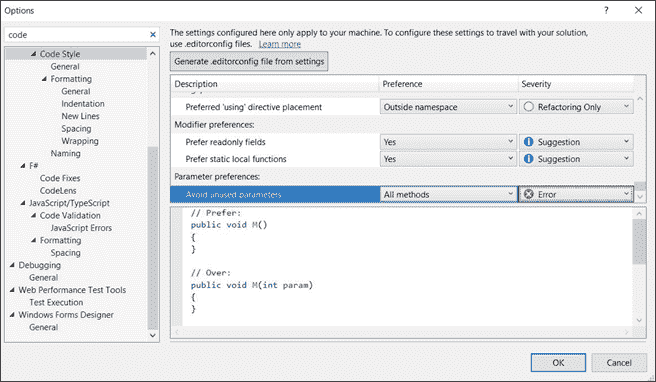
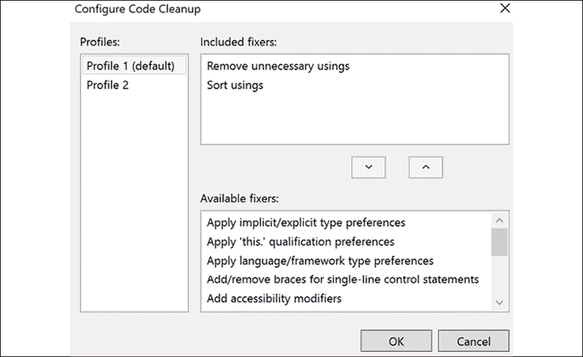
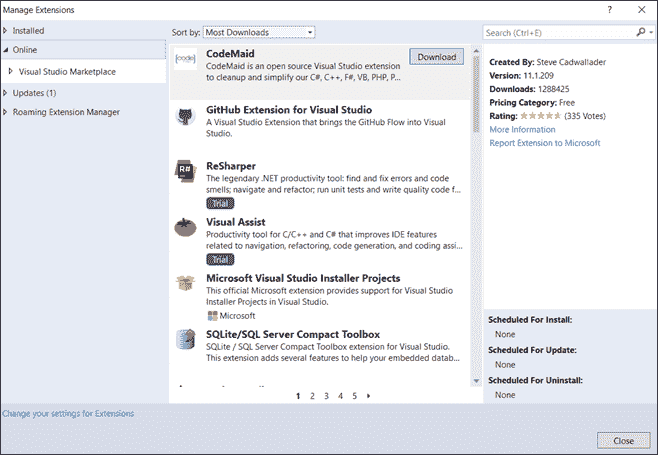
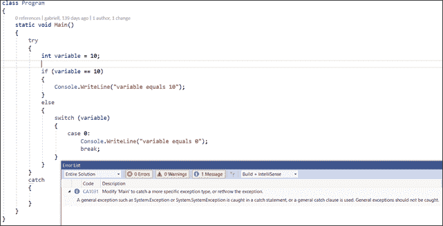
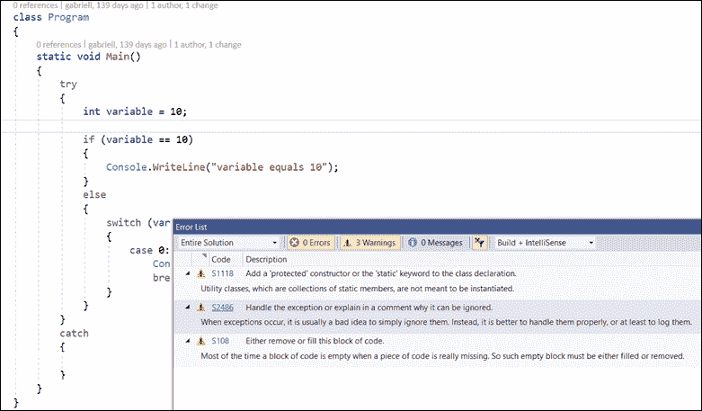
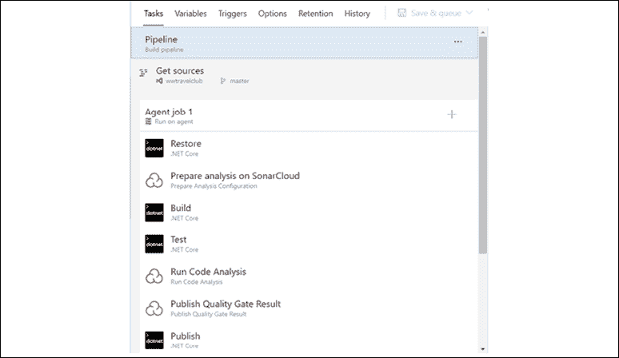

# 第十九章：使用工具编写更好的代码

正如我们在*第十七章*中看到的，*C# 9 编码的最佳实践*，编码可以被视为一种艺术，但编写易懂的代码更像是哲学。在那一章中，我们讨论了作为软件架构师需要遵守的实践。在本章中，我们将描述代码分析的技术和工具，以便您为项目编写出良好的代码。

本章将涵盖以下主题：

+   识别写得好的代码

+   理解可以在过程中使用的工具，以使事情变得更容易

+   应用扩展工具来分析代码

+   在分析后检查最终代码

+   用例——在发布应用程序之前实施代码检查

在本章结束时，您将能够确定要将哪些工具纳入软件开发生命周期，以便简化代码分析。

# 技术要求

本章需要使用 Visual Studio 2019 免费的 Community Edition 或更高版本。您可以在[`github.com/PacktPublishing/Software-Architecture-with-C-9-and-.NET-5/tree/master/ch19`](https://github.com/PacktPublishing/Software-Architecture-with-C-9-and-.NET-5/tree/master/ch19)找到本章的示例代码。

# 识别写得好的代码

很难定义代码是否写得好。*第十七章*中描述的最佳实践肯定可以指导您作为软件架构师为团队定义标准。但即使有了标准，错误也会发生，而且您可能只会在代码投入生产后才发现它们。因为代码不符合您定义的所有标准而决定在生产中重构代码并不是一个容易的决定，特别是如果涉及的代码正常运行。有些人得出结论，写得好的代码就是在生产中正常运行的代码。然而，这肯定会对软件的生命周期造成损害，因为开发人员可能会受到那些非标准代码的启发。

因此，作为软件架构师，您需要找到方法来强制执行您定义的编码标准。幸运的是，如今我们有许多工具可以帮助我们完成这项任务。它们被视为静态代码分析的自动化。这种技术被视为改进开发的软件和帮助开发人员的重大机会。

您的开发人员将通过代码分析而进步的原因是，您开始在代码检查期间在他们之间传播知识。我们现在拥有的工具也有同样的目的。更好的是，通过 Roslyn，它们可以在您编写代码时执行此任务。Roslyn 是.NET 的编译器平台，它使您能够开发一些用于分析代码的工具。这些分析器可以检查样式、质量、设计和其他问题。

例如，看看下面的代码。它毫无意义，但您仍然可以看到其中存在一些错误：

```cs
using System;
static void Main(string[] args)
{
    try
    {
        int variableUnused = 10;
        int variable = 10;
        if (variable == 10)
        {
             Console.WriteLine("variable equals 10");
        }
        else
        {
            switch (variable)
            {
                case 0:
                    Console.WriteLine("variable equals 0");
                    break;
            }
        }
    }
    catch
    {
    }
} 
```

这段代码的目的是向您展示一些工具的威力，以改进您正在交付的代码。让我们在下一节中研究每一个工具，包括如何设置它们。

# 理解和应用可以评估 C#代码的工具

Visual Studio 中代码分析的演变是持续的。这意味着 Visual Studio 2019 肯定比 Visual Studio 2017 等版本具有更多用于此目的的工具。

您（作为软件架构师）需要处理的问题之一是*团队的编码风格*。这肯定会导致对代码的更好理解。例如，如果您转到**Visual Studio 菜单**，**工具->选项**，然后在左侧菜单中转到**文本编辑器->C#**，您将找到设置如何处理不同代码样式模式的方法，而糟糕的编码风格甚至被指定为**代码样式**选项中的错误，如下所示：



图 19.1：代码样式选项

前面的截图表明**避免未使用的参数**被视为错误。

在这种改变之后，与本章开头呈现的相同代码的编译结果是不同的，您可以在以下截图中看到：


图 19.2：代码样式结果

您可以导出您的编码样式配置并将其附加到您的项目，以便它遵循您定义的规则。

Visual Studio 2019 提供的另一个好工具是**分析和代码清理**。使用此工具，您可以设置一些代码标准，以清理您的代码。例如，在下面的截图中，它被设置为删除不必要的代码：



图 19.3：配置代码清理

运行代码清理的方法是通过在**解决方案资源管理器**区域中右键单击选择它，然后在要运行它的项目上运行。之后，此过程将在您拥有的所有代码文件中运行：


图 19.4：运行代码清理

在解决了代码样式和代码清理工具指示的错误之后，我们正在处理的示例代码有一些最小的简化，如下所示：

```cs
using System;
try
{
    int variable = 10;
    if (variable == 10)
    {
        Console.WriteLine("variable equals 10");
    }
    else
    {
        switch (variable)
        {
            case 0:
                Console.WriteLine("variable equals 0");
                break;
        }
    }
}
catch
{
} 
```

值得一提的是，前面的代码有许多改进仍需要解决。Visual Studio 允许您通过安装扩展来为 IDE 添加附加工具。这些工具可以帮助您提高代码质量，因为其中一些是为执行代码分析而构建的。本节将列出一些免费选项，以便您可以决定最适合您需求的选项。当然还有其他选项，甚至是付费选项。这里的想法不是指示特定的工具，而是给您一个对它们能力的概念。

要安装这些扩展，您需要在 Visual Studio 2019 中找到**扩展**菜单。以下是**管理扩展**选项的截图：



图 19.5：Visual Studio 2019 中的扩展

有许多其他很酷的扩展可以提高您的代码和解决方案的生产力和质量。在此管理器中搜索它们。

选择要安装的扩展后，您需要重新启动 Visual Studio。大多数扩展在安装后很容易识别，因为它们修改了 IDE 的行为。其中，Microsoft Code Analysis 2019 和 SonarLint for Visual Studio 2019 可以被认为是不错的工具，并将在下一节中讨论。

# 应用扩展工具来分析代码

尽管在代码样式和代码清理工具之后交付的示例代码比我们在本章开头呈现的代码要好，但显然远远不及*第十七章*中讨论的最佳实践。在接下来的章节中，您将能够检查两个扩展的行为，这些扩展可以帮助您改进这段代码：Microsoft Code Analysis 2019 和 SonarLint for Visual Studio 2019。

## 使用 Microsoft Code Analysis 2019

这个扩展由 Microsoft DevLabs 提供，是对我们过去自动化的 FxCop 规则的升级。它也可以作为 NuGet 包添加到项目中，因此可以成为应用程序 CI 构建的一部分。基本上，它有超过 100 个规则，用于在您输入代码时检测代码中的问题。

例如，仅通过启用扩展并重新构建我们在本章中使用的小样本，代码分析就发现了一个新的问题需要解决，如下截图所示：



图 19.6：代码分析用法

值得一提的是，我们在*第十七章*中讨论了空的`try-catch`语句的使用作为反模式。因此，如果能以这种方式暴露这种问题，对代码的健康将是有益的。

## 应用 SonarLint for Visual Studio 2019

SonarLint 是 Sonar Source 社区的开源倡议，用于在编码时检测错误和质量问题。它支持 C#、VB.NET、C、C++和 JavaScript。这个扩展的好处是它提供了解决检测到的问题的解释，这就是为什么我们说开发人员在使用这些工具时学会了如何编写良好的代码。查看以下屏幕截图，其中包含对样本代码进行的分析：



图 19.7：SonarLint 使用

我们可以验证此扩展能够指出错误，并且如承诺的那样，对每个警告都有解释。这不仅有助于检测问题，还有助于培训开发人员掌握良好的编码实践。

# 在分析后检查最终代码

在分析了两个扩展之后，我们终于解决了所有出现的问题。我们可以检查最终代码，如下所示：

```cs
using System;
try
{
    int variable = 10;
    if (variable == 10)
    {
        Console.WriteLine("variable equals 10");
    }
    else
    {
        switch (variable)
        {
            case 0:
                Console.WriteLine("variable equals 0");
                break;
            default:
                Console.WriteLine("Unknown behavior");
                break;
        }
    }
}
catch (Exception err)
{
    Console.WriteLine(err);
} 
```

正如您所看到的，前面的代码不仅更容易理解，而且更安全，并且能够考虑编程的不同路径，因为`switch-case`的默认值已经编程。这种模式也在*第十七章* *C# 9 编码最佳实践*中讨论过，因此可以轻松地通过使用本章中提到的一个（或全部）扩展来遵循最佳实践。

# 用例-在发布应用程序之前评估 C#代码

在*第三章* *使用 Azure DevOps 记录需求*中，我们在平台上创建了 WWTravelClub 存储库。正如我们在那里看到的，Azure DevOps 支持持续集成，这可能很有用。在本节中，我们将讨论 DevOps 概念和 Azure DevOps 平台之所以如此有用的更多原因。

目前，我们想介绍的唯一一件事是，在开发人员提交代码后，但尚未发布时分析代码的可能性。如今，在面向应用程序生命周期工具的 SaaS 世界中，这仅仅是由于我们拥有一些 SaaS 代码分析平台才可能实现的。此用例将使用 Sonar Cloud。

Sonar Cloud 对于开源代码是免费的，并且可以分析存储在 GitHub、Bitbucket 和 Azure DevOps 中的代码。用户需要在这些平台上注册。一旦您登录，假设您的代码存储在 Azure DevOps 中，您可以按照以下文章中描述的步骤创建您的 Azure DevOps 和 Sonar Cloud 之间的连接：[`sonarcloud.io/documentation/analysis/scan/sonarscanner-for-azure-devops/`](https://sonarcloud.io/documentation/analysis/scan/sonarscanner-for-azure-devops/)。

在设置 Azure DevOps 中项目与 Sonar Cloud 之间的连接后，您将拥有一个类似以下的构建管道：



图 19.8：Azure 构建管道中的 Sonar Cloud 配置

值得一提的是，C#项目没有 GUID 号码，而 Sonar Cloud 需要这个。您可以使用此链接（[`www.guidgenerator.com/`](https://www.guidgenerator.com/)）轻松生成一个，并且需要将其放置在以下屏幕截图中：


图 19.9：SonarQube 项目 GUID

一旦构建完成，代码分析的结果将在 Sonar Cloud 中呈现，如下屏幕截图所示。如果您想浏览此项目，可以访问[`sonarcloud.io/dashboard?id=WWTravelClubNet50`](https://sonarcloud.io/dashboard?id=WWTravelClubNet50)：


图 19.10：Sonar Cloud 结果

此时，经过分析的代码尚未发布，因此在发布系统之前，这对于获得下一个质量步骤非常有用。您可以将此方法用作在提交期间自动化代码分析的参考。

# 总结

本章介绍了可以用来应用*C# 9 编码最佳实践*中描述的最佳编码实践的工具。我们看了 Roslyn 编译器，它使开发人员在编码的同时进行代码分析，并且我们看了一个用例，即在发布应用程序之前评估 C#代码，该应用程序在 Azure DevOps 构建过程中实现代码分析使用 Sonar Cloud。

一旦您将本章学到的一切应用到您的项目中，代码分析将为您提供改进您交付给客户的代码质量的机会。这是作为软件架构师角色中非常重要的一部分。

在下一章中，您将使用 Azure DevOps 部署您的应用程序。

# 问题

1.  软件如何被描述为写得很好的代码？

1.  什么是 Roslyn？

1.  什么是代码分析？

1.  代码分析的重要性是什么？

1.  Roslyn 如何帮助进行代码分析？

1.  什么是 Visual Studio 扩展？

1.  为代码分析提供的扩展工具有哪些？

# 进一步阅读

以下是一些网站，您将在其中找到有关本章涵盖的主题的更多信息：

+   [`marketplace.visualstudio.com/items?itemName=VisualStudioPlatformTeam.MicrosoftCodeAnalysis2019`](https://marketplace.visualstudio.com/items?itemName=VisualStudioPlatformTeam.MicrosoftCodeAnalysis20)

+   [`marketplace.visualstudio.com/items?itemName=SonarSource.SonarLintforVisualStudio2019`](https://marketplace.visualstudio.com/items?itemName=SonarSource.SonarLintforVisualStudio2019)

+   [`github.com/dotnet/roslyn-analyzers`](https://github.com/dotnet/roslyn-analyzers)

+   [`docs.microsoft.com/en-us/visualstudio/ide/code-styles-and-code-cleanup`](https://docs.microsoft.com/en-us/visualstudio/ide/code-styles-and-code-cleanup)

+   [`sonarcloud.io/documentation/analysis/scan/sonarscanner-for-azure-devops/`](https://sonarcloud.io/documentation/analysis/scan/sonarscanner-for-azure-devops/)

+   [`www.guidgenerator.com/`](https://www.guidgenerator.com/)
