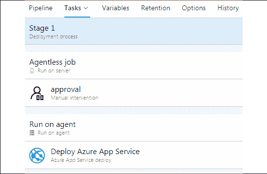
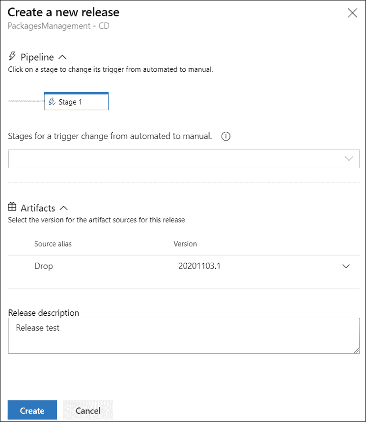
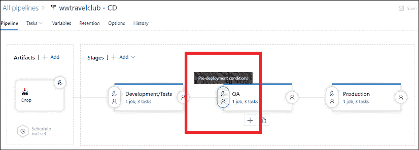
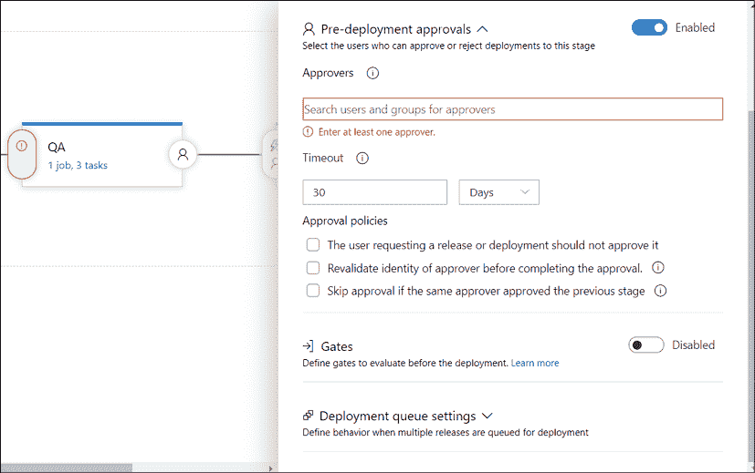
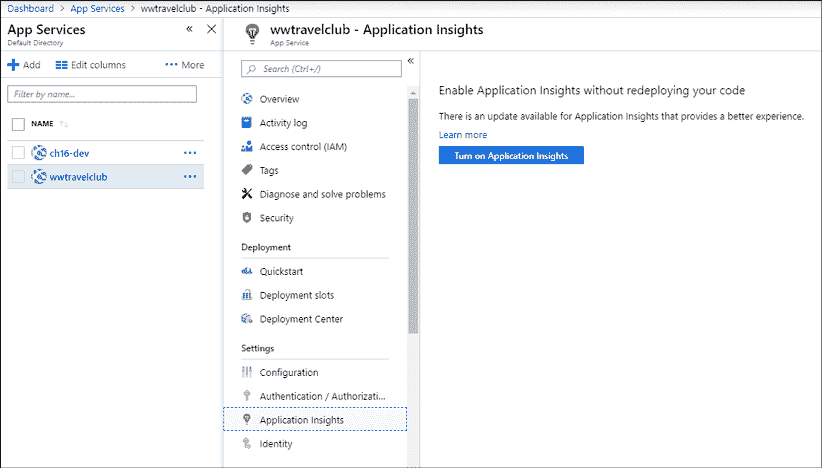
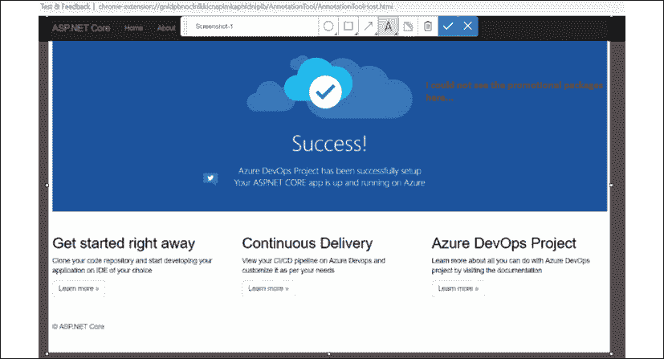
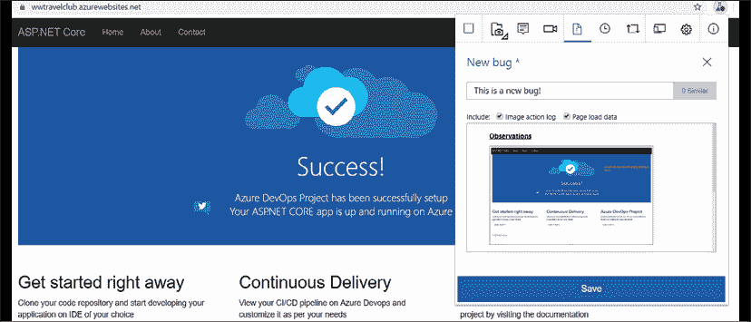

# 第二十章：理解 DevOps 原则

DevOps 是一个每个人都在学习和实践的过程。但作为软件架构师，您需要理解并传播 DevOps，不仅作为一个过程，而且作为一种理念。本章将涵盖您开发和交付软件所需的主要概念、原则和工具。

在考虑 DevOps 理念时，本章将专注于所谓的**服务设计思维**，即将您设计的软件视为向组织/部分组织提供的服务。这种方法的主要收获是您的软件为目标组织提供的价值最为重要。此外，您不仅提供可工作的代码和修复错误的协议，还提供了您的软件构思的所有需求的解决方案。换句话说，您的工作包括满足这些需求所需的一切，例如监控用户满意度并在用户需求变化时调整软件。最后，更容易监控软件以发现问题和新需求，并迅速修改以适应不断变化的需求。

服务设计思维与我们在*第四章* *决定最佳基于云的解决方案*中讨论的**软件即服务**（**SaaS**）模型紧密相关。事实上，基于 Web 服务提供解决方案的最简单方式是提供 Web 服务的使用作为服务，而不是销售实现它们的软件。

本章将涵盖以下主题：

+   描述 DevOps 是什么，并查看如何在 WWTravelClub 项目中应用它的示例

+   理解 DevOps 原则和部署阶段以利用部署过程

+   理解使用 Azure DevOps 进行持续交付

+   定义持续反馈，并讨论 Azure DevOps 中相关工具

+   理解 SaaS 并为服务场景准备解决方案

+   用例 - 使用 Azure Pipelines 部署我们的软件包管理应用程序

与其他章节不同，WWTravelClub 项目将在主题中呈现，并且我们将在章节结束时提供额外的结论，让您有机会了解如何实施 DevOps 理念。所有展示 DevOps 原则的截图都来自本书的主要用例，因此您将能够轻松理解 DevOps 原则。在本章结束时，您将能够根据服务设计思维原则设计软件，并使用 Azure Pipelines 部署应用程序。

# 技术要求

本章需要安装 Visual Studio 2019 社区版或更高版本，并安装所有 Azure 工具。您可能还需要一个 Azure DevOps 帐户，如*第三章* *使用 Azure DevOps 记录需求*中所述。还需要一个免费的 Azure 帐户。如果您尚未创建，*第一章* *了解软件架构的重要性*中的*创建 Azure 帐户*子章节解释了如何创建。本章使用与*第十八章* *使用单元测试案例和 TDD 测试代码*相同的代码，可在此处找到：[`github.com/PacktPublishing/Software-Architecture-with-C-9-and-.NET-5`](https://github.com/PacktPublishing/Software-Architecture-with-C-9-and-.NET-5)。

# 描述 DevOps

DevOps 源自*开发和运维*这两个词的结合，因此这个过程简单地统一了这两个领域的行动。然而，当您开始更深入地研究它时，您会意识到仅仅连接这两个领域是不足以实现这一理念的真正目标的。

我们还可以说，DevOps 是回答当前人类关于软件交付的需求的过程。

微软的首席 DevOps 经理 Donovan Brown 对 DevOps 有一个精彩的定义：*DevOps 是人员、流程和产品的结合，以实现向最终用户持续交付价值*。[`donovanbrown.com/post/what-is-devops`](http://donovanbrown.com/post/what-is-devops)。

持续向我们的最终用户交付价值的方法，使用流程、人员和产品：这是对 DevOps 哲学的最佳描述。我们需要开发和交付以客户为导向的软件。一旦公司的所有部门都明白关键点是最终用户，作为软件架构师，您的任务就是提供能够促进交付过程的技术。

值得一提的是，本书的所有内容都与这种方法相关。这绝不是了解一堆工具和技术的问题。作为软件架构师，您必须明白，这总是一种更快地为最终用户带来解决方案的方式，与他们的真实需求联系在一起。因此，您需要学习 DevOps 原则，这将在本章讨论。

# 了解 DevOps 原则

将 DevOps 视为一种哲学，值得一提的是，有一些原则可以使这个过程在您的团队中运行良好。这些原则是持续集成、持续交付和持续反馈。

微软有一个专门的网页来定义 DevOps 概述、文化、实践、工具及其与云的关系。请查看[`azure.microsoft.com/en-us/overview/what-is-devops/`](https://azure.microsoft.com/en-us/overview/what-is-devops)。

在许多书籍和技术文章中，DevOps 以无限符号表示。这个符号代表软件开发生命周期中持续方法的必要性。在整个周期中，您需要计划、构建、持续集成、部署、运营、获得反馈，然后重新开始。这个过程必须是协作的，因为每个人都有同样的关注点——为最终用户提供价值。除了这些原则，作为软件架构师，您还需要决定最适合这种方法的最佳软件开发流程。我们在*第一章* *理解软件架构的重要性*中讨论了这些流程。

## 定义持续集成

当您开始构建企业解决方案时，协作是更快地完成任务和满足用户需求的关键。版本控制系统，正如我们在*第十七章* *C# 9 编码最佳实践*中讨论的那样，对于这个过程至关重要，但工具本身并不能完成工作，特别是如果工具没有很好地配置。

作为软件架构师，**持续集成**（**CI**）将帮助您对软件开发协作有一个具体的方法。当您实施它时，一旦开发人员提交他们的代码，主要代码就会自动构建和测试。

应用 CI 的好处在于可以激励开发人员尽快合并他们的更改，以最小化合并冲突。此外，他们可以共享单元测试，这将提高软件的质量。

在 Azure DevOps 中设置 CI 非常简单。在构建管道中，您可以通过编辑配置找到该选项，如下面的屏幕截图所示：


图 20.1：启用持续集成复选框

值得一提的是，如果您的解决方案设置了单元测试和功能测试，一旦提交代码，它将自动编译和测试。这将使您的主分支在团队的每次提交后都保持稳定和安全。

CI 的关键点是能够更快地识别问题。当您允许他人测试和分析代码时，您将有这个机会。DevOps 方法的唯一帮助是确保这一切尽快发生。

# 了解使用 Azure DevOps 进行持续交付

一旦你的应用程序的每次提交都构建完成，并且这段代码经过了单元测试和功能测试，你可能也想要持续部署它。这不仅仅是配置工具的问题。作为软件架构师，你需要确保团队和流程准备好进行这一步。但让我们首先检查如何启用使用案例的第一个部署场景。

## 使用 Azure 管道部署我们的包管理应用程序

在本节中，我们将为在*第十八章*末尾定义的 DevOps 项目配置自动部署到 Azure App Service 平台。Azure DevOps 也可以自动创建新的 Web 应用程序，但为了防止配置错误（可能会消耗所有免费信用），我们将手动创建它，并让 Azure DevOps 只是部署应用程序。所有必需的步骤都被组织成各种小节，如下所示。

### 创建 Azure Web 应用程序和 Azure 数据库

可以通过以下简单的步骤定义 Azure Web 应用程序：

1.  转到 Azure 门户，并选择**应用服务**，然后点击**添加**按钮创建一个新的 Web 应用程序。填写所有数据如下：

图 20.2：创建 Azure Web 应用程序

1.  显然，你可以使用你已经拥有的**资源组**和对你来说最方便的区域。对于**运行时堆栈**，请选择与你在 Visual Studio 解决方案中使用的相同的.NET Core 版本。

1.  现在，如果你有足够的信用，让我们为应用程序创建一个 SQL Server 数据库，并将其命名为`PackagesManagementDatabase`。如果你没有足够的信用，不要担心——你仍然可以测试应用程序部署，但当它尝试访问数据库时，应用程序将返回错误。请参考*第九章*的*关系数据库*小节，了解如何创建 SQL Server 数据库。

### 配置你的 Visual Studio 解决方案

一旦你定义了 Azure Web 应用程序，你需要按照以下简单的步骤配置应用程序在 Azure 中运行：

1.  如果你定义了 Azure 数据库，你需要在你的 Visual Studio 解决方案中有两个不同的连接字符串，一个用于开发的本地数据库，另一个用于你的 Azure Web 应用程序。

1.  现在，在你的 Visual Studio 解决方案中打开`appsettings.Development.json`和`appsettings.json`，如下所示：

图 20.3：在 Visual Studio 中打开设置

1.  然后，将`appsettings.json`的整个`ConnectionStrings`节点复制到`appsettings.Development.json`中，如下所示：

```cs
"ConnectionStrings": {
        "DefaultConnection": "Server=(localdb)....."
}, 
```

1.  现在你在开发设置中有本地连接字符串，所以你可以将`appsettings.json`中的`DefaultConnection`更改为 Azure 数据库之一。

1.  转到 Azure 门户中的数据库，复制连接字符串，并用你在定义数据库服务器时获得的用户名和密码填写它。

1.  最后，本地提交你的更改，然后与远程存储库同步。现在，你的更改已经在 DevOps 管道上处理，以获得一个新的构建。

### 配置 Azure 管道

最后，通过以下步骤配置 Azure 管道，自动在 Azure 上交付你的应用程序：

1.  通过点击 Visual Studio **Team Explorer**窗口的**连接**选项卡中的**管理连接**链接，将 Visual Studio 与你的 DevOps 项目连接起来。然后，点击 DevOps 链接进入你的在线项目。

1.  修改`PackagesManagementWithTest`构建管道，添加一个单元测试步骤之后的进一步步骤。实际上，我们需要一个准备所有文件以在 ZIP 文件中部署的步骤。

1.  点击`PackagesManagementWithTest`管道的**编辑**按钮，然后转到文件末尾并写入以下内容：

```cs
- task: PublishBuildArtifacts@1 
```

1.  当新任务上方出现**设置**链接时，点击它来配置新任务：

图 20.4：配置发布构建构件窗格

1.  接受默认的**发布路径**，因为它已与将部署应用程序的任务的路径同步，插入构件名称，然后选择**Azure 管道**作为位置。保存后，管道将启动，并且新添加的任务应该成功。

1.  部署和其他发布构件被添加到称为**发布管道**的不同管道中，以将它们与构建相关的构件解耦。使用**发布管道**，您无法编辑`.yaml`文件，但您将使用图形界面进行操作。

1.  单击**发布**左侧菜单选项卡以创建新的**发布管道**。一旦单击**添加新管道**，您将被提示添加第一个阶段的第一个任务。事实上，整个发布管道由不同的阶段组成，每个阶段都包含一系列任务。虽然每个阶段只是一系列任务，但阶段图可以分支，我们可以在每个阶段后添加几个分支。这样，我们可以部署到每个需要不同任务的不同平台。在我们的简单示例中，我们将使用单个阶段。

1.  选择**部署 Azure 应用服务**任务。一旦添加此任务，您将被提示填写缺少的信息。

1.  单击**错误链接**并填写缺少的参数：

图 20.5：配置发布阶段

1.  选择您的订阅，然后，如果出现授权按钮，请单击它以**授权**Azure 管道访问您的订阅。然后，选择 Windows 作为部署平台，最后，从**应用服务名称**下拉列表中选择您创建的应用服务。任务设置在编写时会自动保存，因此您只需为整个管道单击**保存**按钮。

1.  现在，我们需要将此管道连接到源构件。单击**添加构件**按钮，然后选择**构建**作为源类型，因为我们需要将新的发布管道与我们的构建管道创建的 ZIP 文件连接起来。将出现设置窗口：

图 20.6：定义要发布的构件

1.  从下拉列表中选择我们之前的构建管道，并将**最新**保留为版本。接受**源别名**中的建议名称。

1.  我们的发布管道已经准备就绪，可以直接使用。您刚刚添加的源构件的图像在其右上角包含一个触发图标，如下所示：

图 20.7：准备发布的构件

1.  如果单击触发图标，您将有选项在新构建可用时自动触发发布管道：

图 20.8：启用持续部署触发器

1.  保持其禁用；我们可以在完成并手动测试发布管道后启用它。

正如我们之前提到的，为了准备自动触发，我们需要在应用程序部署之前添加一个人工批准任务。

### 为发布添加手动批准

由于任务通常由软件代理执行，我们需要在手动作业中嵌入人工批准。让我们按照以下步骤添加它：

1.  单击**阶段 1**标题右侧的三个点：

图 20.9：向阶段添加人工批准

1.  然后，选择**添加无代理作业**。添加无代理作业后，单击**添加**按钮并添加**手动干预**任务。以下屏幕截图显示了**手动干预**设置：

图 20.10：配置阶段的人工批准

1.  为操作员添加说明，并在**通知用户**字段中选择您的帐户。

1.  现在，使用鼠标拖动整个**无代理作业**并将其放置在应用程序部署任务之前。它应该看起来像这样：

图 20.11：设置人工批准部署任务列表

1.  完成！点击左上角的**保存**按钮保存管道。

现在，一切都准备好了，可以创建我们的第一个自动发布。

### 创建发布

一旦你准备好了一切，新的发布可以按照以下步骤准备和部署：

1.  点击**创建发布**按钮开始创建新的发布，如下截图所示：

图 20.12：创建新发布

1.  验证**源别名**是否是最后一个可用的，添加**发布描述**，然后点击**创建**。不久后，你应该会收到一封发布批准的电子邮件。点击其中包含的链接，进入批准页面：

图 20.13：批准发布

1.  点击**批准**按钮批准发布。等待**部署**完成。你应该看到所有任务都成功完成，如下截图所示：

图 20.14：发布部署

1.  你已经运行了你的第一个成功的发布管道！

在现实项目中，发布管道将包含一些额外的任务。事实上，应用程序（在实际生产环境中部署之前）会在一个分级环境中进行部署，在那里进行测试。因此，可能在这次首次部署之后，会有一些手动测试，手动授权进行生产部署，以及最终的生产部署。

## 多阶段环境

与**持续交付**（**CD**）相关的方法需要保证每次新部署都能保持生产环境的安全。为此，需要采用多阶段管道。下面的截图显示了一种常见阶段的方法，使用书籍用例作为演示：


图 20.15：使用 Azure DevOps 发布阶段

正如你所看到的，这些阶段是使用 Azure DevOps 发布管道进行配置的。每个阶段都有其自己的目的，这将提高最终交付产品的质量。让我们来看看这些阶段：

+   **开发/测试：**这个阶段是开发人员和测试人员用来构建新功能的。这个环境肯定是最容易暴露出错误和不完整功能的环境。

+   **质量保证：**这个环境为团队中与开发和测试无关的领域提供了新功能的简要版本。项目经理、市场营销、供应商等可以将其用作研究、验证甚至预生产的区域。此外，开发和质量团队可以保证新版本的正确部署，考虑到功能和基础设施。

+   **生产：**这是客户运行其解决方案的阶段。根据 CD 的要求，一个良好的生产环境的目标是尽快更新。更新的频率会根据团队规模而有所不同，但有一些方法是这个过程每天发生多次。

采用这三个部署应用程序的阶段将影响解决方案的质量。它还将使团队能够拥有更安全的部署过程，减少风险，提高产品的稳定性。这种方法乍看起来可能有点昂贵，但如果没有它，糟糕的部署结果通常会比这个投资更昂贵。

除了所有的安全性，你还必须考虑多阶段的情况。你可以设置管道，只有在定义的授权下，你才能从一个阶段移动到另一个阶段：



图 20.16：定义预部署条件

正如你在前面的截图中所看到的，设置预部署条件非常简单，而且你可以在下面的截图中看到，有多个选项来自定义授权方法。这使你有可能完善 CD 方法，确切地满足你所处理的项目的需求。

以下屏幕截图显示了 Azure DevOps 提供的预部署批准选项。您可以定义可以批准阶段并为其设置策略的人员，即在完成流程之前重新验证批准者身份。作为软件架构师，您需要确定适合使用此方法创建的项目的配置：



图 20.17：预部署批准选项

值得一提的是，尽管这种方法远比单阶段部署好得多，但 DevOps 管道将引导您作为软件架构师进入另一个监控阶段。持续反馈将是一个令人难以置信的工具，我们将在下一节讨论这种方法。

# 定义持续反馈和相关的 DevOps 工具

一旦您在上一节描述的部署方案中完美运行的解决方案，反馈将对您的团队至关重要，以了解发布的结果以及版本对客户的运行情况。为了获得这种反馈，一些工具可以帮助开发人员和客户，将这些人聚集在一起，加快反馈过程。让我们来看看这些工具。

## 使用 Azure Monitor Application Insights 监控软件

**Azure Monitor Application Insights**是软件架构师需要持续反馈的工具。值得一提的是，应用程序洞察是 Azure Monitor 的一部分，它还包括警报、仪表板和工作簿等更广泛的监控功能。一旦您将应用程序连接到它，您就会开始收到有关对软件的每个请求的反馈。这使您不仅能够监视所做的请求，还能够监视数据库性能、应用程序可能遭受的错误以及处理时间最长的调用。

显然，将此工具插入到您的环境中将会产生成本，但工具提供的便利将是值得的。值得注意的是，对于简单的应用程序，甚至可能是免费的，因为您支付的是数据摄入费用，而有免费配额。此外，您需要了解，由于存储数据在**应用程序洞察**中的所有请求都在单独的线程中运行，因此性能成本非常小。

值得注意的是，一些服务，如应用服务、函数等，在初始创建过程中将有添加应用程序洞察的选项，因此您可能已经在阅读本书时创建了它。即便如此，下面的屏幕截图显示了您如何在您的环境中轻松创建一个工具。


图 20.18：在 Azure 中创建应用程序洞察资源

如果您想使用 Visual Studio 在应用程序中设置应用程序洞察，您可能会发现这篇微软教程有用：[`docs.microsoft.com/en-us/azure/azure-monitor/learn/dotnetcore-quick-start#configure-app-insights-sdk`](https://docs.microsoft.com/en-us/azure/azure-monitor/learn/dotnetcore-quick-start#configure-app-insi)。

例如，假设您需要分析应用程序中花费更多时间的请求。将应用程序洞察附加到您的 Web 应用程序的过程非常简单：只需在设置 Web 应用程序时立即完成。如果您不确定应用程序洞察是否已为您的 Web 应用程序配置，可以使用 Azure 门户进行查找。导航到**应用服务**并查看**应用程序洞察**设置，如下面的屏幕截图所示：



图 20.19：在应用服务中启用应用程序洞察

界面将让您有机会为您的 Web 应用程序创建或附加一个已创建的监视服务。值得一提的是，您可以将多个 Web 应用程序连接到同一个 Application Insights 组件。以下截图显示了如何将 Web 应用程序添加到已创建的 Application Insights 资源中：


图 20.20：在应用服务中启用应用洞察

一旦您为您的 Web 应用程序配置了 Application Insights，您将在应用服务中找到以下屏幕：


图 20.21：应用服务中的应用洞察

一旦它连接到您的解决方案，数据收集将持续进行，您将在组件提供的仪表板中看到结果。您可以在两个地方找到这个屏幕：

+   与您配置 Application Insights 的地方相同，在 Web 应用程序门户内

+   在 Azure 门户中，浏览 Application Insights 资源后：


图 20.22：应用洞察的实际应用

这个仪表板让您了解失败的请求、服务器响应时间和服务器请求。您还可以打开可用性检查，它将从 Azure 数据中心中的任何一个向您选择的 URL 发出请求。

但 Application Insights 的美妙之处在于它对系统进行了深入的分析。例如，在下面的截图中，它正在向您反馈网站上的请求次数。您可以通过排名来分析哪些请求处理时间更长，或者哪些请求更频繁：


图 20.23：使用 Application Insights 分析应用程序性能

考虑到这个视图可以以不同的方式进行过滤，并且您在 Web 应用程序中发生事件后立即收到信息，这无疑是一个定义持续反馈的工具。这是您可以使用 DevOps 原则实现客户需求的最佳方式之一。

Application Insights 是一个技术工具，正是您作为软件架构师需要的，用于监视现代应用程序的真实分析模型。它是基于用户在您正在开发的系统上的行为的持续反馈方法。

## 使用测试和反馈工具启用反馈

在持续反馈过程中另一个有用的工具是由微软设计的测试和反馈工具，旨在帮助产品所有者和质量保证用户分析新功能。

使用 Azure DevOps，您可以通过在每个工作项内选择一个选项来为您的团队请求反馈，如下截图所示：


图 20.24：使用 Azure DevOps 请求反馈

一旦您收到反馈请求，您可以使用测试和反馈工具来分析并向团队提供正确的反馈。您将能够将该工具连接到您的 Azure DevOps 项目，从而在分析反馈请求时获得更多功能。值得一提的是，这个工具是一个需要安装的网页浏览器扩展。以下截图显示了如何为测试和反馈工具设置 Azure DevOps 项目 URL：

您可以从[`marketplace.visualstudio.com/items?itemName=ms.vss-exploratorytesting-web`](https://marketplace.visualstudio.com/items?itemName=ms.vss-exploratorytesting-web)下载此工具。


图 20.25：将测试和反馈连接到 Azure DevOps 组织

这个工具非常简单。您可以截图、记录一个过程，甚至做一个笔记。以下截图显示了您如何在截图中轻松写下一条消息：



图 20.26：使用测试和反馈工具提供反馈

好处是您可以在会话时间轴中记录所有这些分析。正如您在下一个截图中所看到的，您可以在同一个会话中获得更多反馈，这对分析过程很有帮助：


图 20.27：使用测试和反馈工具提供反馈

一旦您完成了分析并连接到 Azure DevOps，您将能够报告错误，创建任务，甚至开始一个新的测试用例：



图 20.28：在 Azure DevOps 中打开错误

创建的错误结果可以在 Azure DevOps 的**工作项**面板上进行检查。值得一提的是，您不需要 Azure DevOps 开发人员许可证即可访问环境中的这一区域。这使您作为软件架构师能够将这个基本而有用的工具传播给您所拥有的解决方案的许多关键用户。以下截图显示了一旦您将其连接到 Azure DevOps 项目后工具创建的错误：


图 20.29：Azure DevOps 中新报告的错误

拥有这样的工具对于获得项目的良好反馈是很重要的。但是，作为软件架构师，您可能需要找到加速这个过程的最佳解决方案。本书中探讨的工具是加速这一过程的好方法。每当您需要在开发过程中实施一个新步骤时，您都可以考虑这种方法。持续反馈是开发软件过程中的一个重要步骤，它将不断获得新功能。另一个可以利用 DevOps 的非常重要的方法是 SaaS。让我们在下一节中了解更多。

# 了解 SaaS

作为服务销售/使用软件涉及到一组更广泛的解决方案设计原则，称为**服务设计思维**。服务设计思维不仅仅是一种软件开发技术和/或软件部署方法，而且它影响到几个业务领域，即组织和人力资源、软件开发流程，最后是硬件基础设施和软件架构。

在接下来的小节中，我们将简要讨论我们列出的每个业务领域的影响，而在最后一个小节中，我们将专门关注 SaaS 部署模型。

## 使您的组织适应服务场景

第一个组织影响来自于需要优化软件对目标组织的价值。这需要一个人力资源或团队负责规划和监控软件对目标组织的影响，以最大化软件增加的价值。这种战略角色不仅在初始设计阶段需要，而且在应用的整个生命周期中都需要。事实上，这个角色负责保持软件与目标组织不断变化的需求保持一致。

另一个重要的影响领域是人力资源管理。事实上，由于主要优先考虑的是软件增加的价值（而不是利用现有资源和能力），人力资源必须根据项目需求进行调整。这意味着在需要时立即获取新人员，并通过适当的培训开发所需的能力。

下一小节涉及软件开发中涉及的所有流程的影响。

## 在服务场景中开发软件

影响软件开发流程的主要约束是需要将软件调整到组织的需求。这种需求可以通过基于 CI/CD 方法的任何敏捷方法来满足。有关 CI/CD 的简要介绍，请参阅《第三章》《使用 Azure DevOps 组织您的工作》部分，《使用 Azure DevOps 记录需求》。值得指出的是，任何设计良好的 CI/CD 周期都应包括处理用户反馈和用户满意度报告。

此外，为了优化软件增加的价值，最佳实践是组织阶段，其中开发团队（或其中的一部分）与系统用户密切联系，以便开发人员更好地理解软件对目标组织的影响。

在编写功能和非功能需求时，始终要记住软件的附加值。因此，有必要使用“用户故事”注释“为什么”和“如何”它们对价值的贡献。需求收集过程在“第二章”，“非功能需求”中讨论。

更多技术含义将在下一小节中讨论。

## 服务场景的技术含义

在服务场景中，硬件基础设施和软件架构都受到三个主要原则的约束，这是将软件调整到组织需求的要求的直接结果，即以下内容：

+   需要监视软件以发现可能由系统故障或软件使用/用户需求变化引起的任何问题。这意味着从所有硬件/软件组件中提取健康检查和负载统计。用户执行的操作统计数据也可以提供有关组织需求变化的良好线索，具体来说，是用户和应用程序在每个操作实例上花费的平均时间，以及每个操作实例在单位时间（天、周或月）内执行的次数。

+   还需要监控用户满意度。可以通过在每个应用程序屏幕上添加链接到易于填写的用户满意度报告页面来获得有关用户满意度的反馈。

+   最后，有必要快速调整硬件和软件，以适应每个应用模块接收的流量以及组织需求的变化。这意味着以下内容：

+   极度关注软件的模块化

+   保持数据库引擎变更的可能性，并更喜欢面向服务的架构（SOA）或基于微服务的解决方案，而不是单片软件

+   为新技术敞开大门

使硬件易于调整意味着允许硬件扩展，这又意味着要么采用云基础设施，要么采用硬件集群，或者两者兼而有之。同样重要的是要保持对云服务供应商变化的可能性，这意味着将对云平台的依赖封装在少量软件模块中。

通过选择最佳技术来实现每个模块，可以实现软件附加值的最大化，这意味着能够混合不同的技术。这就是容器化技术（如 Docker）发挥作用的地方。 Docker 和相关技术在以下进行了描述：

+   第五章，将微服务架构应用于企业应用程序

+   第六章，Azure 服务布局

+   第七章，Azure Kubernetes 服务

总之，我们列出的所有要求都趋向于本书中描述的大多数先进技术，如云服务、可扩展的 Web 应用程序、分布式/可扩展数据库、Docker、Kubernetes、SOA 和微服务架构。

如何为服务环境准备软件的更多细节将在下一节中给出，而下一小节专门关注 SaaS 应用程序的优缺点。

## 决定何时采用 SaaS 解决方案

SaaS 解决方案的主要吸引力在于其灵活的付款模式，它提供以下优势：

+   您可以避免放弃大笔投资，转而选择更实惠的月度付款

+   您可以从一个便宜的系统开始，然后只有在业务增长时才转向更昂贵的解决方案

然而，SaaS 解决方案还提供其他优势，即以下内容：

+   在所有云解决方案中，您可以轻松扩展您的解决方案

+   应用程序会自动更新

+   由于 SaaS 解决方案是通过公共互联网提供的，因此可以从任何位置访问它们

不幸的是，SaaS 的优势是有代价的，因为 SaaS 也有一些不可忽视的缺点，即以下内容：

+   您的业务严重依赖于 SaaS 提供商，他们可能会停止提供服务和/或以您不接受的方式进行修改。

+   通常，您无法实现任何定制，只能使用 SaaS 供应商提供的少数标准选项。然而，有时 SaaS 供应商也提供添加自定义模块的可能性，这些模块可以由他们或您编写。

总之，SaaS 解决方案提供了有趣的优势，但也存在一些缺点，因此作为软件架构师，您必须进行详细分析以决定如何采用它们。

接下来的部分将解释如何调整软件以在服务场景中使用。

## 为服务场景准备解决方案

首先，*为服务场景准备解决方案*意味着专门为云和/或分布式环境设计。这意味着要考虑可伸缩性、容错性和自动故障恢复。

前面三点的主要影响与*状态*的处理方式有关。无状态的模块实例易于扩展和替换，因此您应该仔细规划哪些模块是无状态的，哪些模块有状态。此外，正如*第九章*中所解释的，您必须记住写入和读取操作的扩展方式完全不同。读取操作更容易通过复制进行扩展，而写入操作在关系数据库中扩展不佳，通常需要 NoSQL 解决方案。

在分布式环境中，高可伸缩性阻止了使用分布式事务和一般同步操作。因此，只能通过基于异步消息的更复杂技术来实现数据一致性和容错性，例如以下内容：

+   一种技术是将要发送的所有消息存储在队列中，以便在出现错误或超时时可以重试异步传输。消息可以在收到接收确认时或模块决定中止产生消息的操作时从队列中移除。

+   另一个问题是处理同一消息由于超时导致多次接收的可能性。

+   如果需要，可以使用乐观并发和事件溯源等技术来最小化数据库中的并发问题。乐观并发在*第十五章*的用例的*定义数据层*子部分中有解释，而事件溯源则与其他数据层内容一起在*第十二章*的*使用 SOLID 原则来映射您的领域*部分中描述。

前面列表中的前两点与其他分布式处理技术一起在*第五章*的*如何处理.NET Core 微服务*部分中详细讨论。

容错性和自动故障恢复要求软件模块实现健康检查接口，云框架可能会调用这些接口，以验证模块是否正常工作，或者是否需要被终止并由另一个实例替换。ASP.NET Core 和所有 Azure 微服务解决方案都提供基本的即插即用健康检查，因此开发人员不需要关心它们。然而，可以通过实现一个简单的接口来添加更详细的自定义健康检查。

如果您的目标是可能更改某些应用程序模块的云提供商，则难度会增加。在这种情况下，对云平台的依赖必须封装在只有少数模块中，并且过于严格依赖特定云平台的解决方案必须被丢弃。

如果您的应用程序是为服务场景设计的，则一切都必须自动化：新版本的测试和验证，应用程序所需的整个云基础设施的创建以及应用程序在该基础设施上的部署。

所有云平台都提供语言和设施来自动化整个软件 CI/CD 周期，即构建代码，测试代码，触发手动版本批准，硬件基础设施创建和应用程序部署。

Azure Pipelines 允许完全自动化列出的所有步骤。*第十八章*中的用例*使用单元测试用例和 TDD 测试代码*展示了如何使用 Azure Pipelines 自动化所有步骤，包括软件测试。下一节中的用例将展示如何在 Azure Web Apps 平台上自动化应用程序部署。

在 SaaS 应用程序中，自动化扮演着更为基础的角色，因为必须通过客户订阅自动触发为每个新客户创建新租户的整个过程。更具体地说，多租户 SaaS 应用程序可以通过三种基本技术实现：

+   所有客户共享相同的硬件基础设施和数据存储。这种解决方案最容易实现，因为它需要实现标准的 Web 应用程序。然而，这只适用于非常简单的 SaaS 服务，因为对于更复杂的应用程序来说，确保存储空间和计算时间在用户之间均匀分配变得越来越困难。此外，随着数据库变得越来越复杂，保持不同用户的数据安全隔离也变得越来越困难。

+   所有客户共享相同的基础设施，但每个客户都有自己的数据存储。此选项解决了上一个解决方案的所有数据库问题，并且很容易自动化，因为创建新租户只需要创建新数据库。此解决方案提供了一种简单的方式来定义定价策略，将其与存储消耗联系起来。

+   每个客户都有自己的私人基础设施和数据存储。这是最灵活的策略。从用户的角度来看，它唯一的缺点是更高的价格。因此，只有在每个用户所需的计算能力达到最低阈值以上时才方便。它更难自动化，因为必须为每个新客户创建整个基础设施，并在其上部署应用程序的新实例。

无论选择哪种策略，您都需要能够随着消费者增加而扩展您的云资源。

如果您还需要确保您的基础设施创建脚本可以跨多个云提供商使用，那么一方面，您不能使用太特定于单个云平台的功能，另一方面，您需要一种独特的基础设施创建语言，可以转换为更常见的云平台的本地语言。 Terraform 和 Ansible 是描述硬件基础设施的两种非常常见的选择。

# WWTravelClub 项目方法

在本章中，WWTravelClub 项目的屏幕截图显示了实施良好的 DevOps 周期所需的步骤。WWTravelClub 团队决定使用 Azure DevOps，因为他们了解到该工具对于获得整个周期的最佳 DevOps 体验至关重要。

需求是使用用户故事编写的，可以在 Azure DevOps 的**工作项**部分找到。代码放在 Azure DevOps 项目的存储库中。这两个概念在*第三章*中*使用 Azure DevOps 记录需求*中有解释。

用于完成任务的管理生命周期是 Scrum，在*第一章*《理解软件架构的重要性》中介绍。这种方法将实施分为 Sprints，这迫使需要在每个周期结束时交付价值。使用本章学到的持续集成设施，每当团队完成对存储库主分支的开发时，代码都将被编译。

一旦代码被编译和测试，部署的第一阶段就完成了。第一阶段通常被称为开发/测试，因为您可以为内部测试启用它。Application Insights 和测试与反馈可以用于获取新版本的第一反馈。

如果新版本的测试和反馈通过，那么就是时候进入第二阶段，质量保证。Application Insights 和测试与反馈现在可以再次使用，但现在是在一个更稳定的环境中。

循环以在生产阶段部署的授权结束。这无疑是一个艰难的决定，但 DevOps 表明您必须持续这样做，以便从客户那里获得更好的反馈。Application Insights 仍然是一个有用的工具，因为您可以监视新版本在生产中的演变，甚至将其与过去的版本进行比较。

这里描述的 WWTravelClub 项目方法可以用于许多其他现代应用程序开发生命周期。作为软件架构师，您必须监督这个过程。工具已经准备就绪，取决于您是否做对了！

# 总结

在本章中，我们了解到 DevOps 不仅是一堆技术和工具，用于连续交付软件，而且是一种哲学，可以实现对您正在开发的项目的最终用户持续交付价值。

考虑到这种方法，我们看到持续集成、持续交付和持续反馈对 DevOps 的目的至关重要。我们还看到 Azure、Azure DevOps 和 Microsoft 工具如何帮助您实现目标。

我们描述了*服务设计思维*原则和 SaaS 软件部署模型。现在，您应该能够分析这些方法对组织的所有影响，并且您应该能够调整现有的软件开发流程和硬件/软件架构，以利用它们提供的机会。

我们还解释了软件周期、云硬件基础架构配置和应用程序部署的自动化的需求和涉及的技术。

一旦您实施了所示的示例，您应该能够使用 Azure Pipelines 自动化基础架构配置和应用程序部署。本章以 WWTravelClub 为例阐明了这种方法，实现了 Azure DevOps 内的 CI/CD，并使用 Application Insights 和测试与反馈工具进行技术和功能反馈。在现实生活中，这些工具将使您能够更快地了解您正在开发的系统的当前行为，因为您将对其进行持续反馈。

在下一章中，我们将详细了解持续集成，这在服务场景和 SaaS 应用程序的维护中起着基础性的作用。

# 问题

1.  什么是 DevOps？

1.  什么是持续集成？

1.  什么是持续交付？

1.  什么是持续反馈？

1.  构建和发布管道之间有什么区别？

1.  在 DevOps 方法中，Application Insights 的主要目的是什么？

1.  测试与反馈工具如何帮助 DevOps 的过程？

1.  服务设计思维的主要目标是什么？

1.  服务设计思维是否要求充分利用公司已有的所有能力？

1.  为什么完全自动化对 SaaS 应用程序的生命周期至关重要？

1.  是否可以使用平台无关的语言定义硬件云基础架构？

1.  什么是首选的 Azure 工具，用于整个应用程序生命周期的自动化？

1.  如果两个 SaaS 供应商提供相同的软件产品，您应该使用最可靠的还是最便宜的？

1.  在服务场景中，可伸缩性是唯一重要的要求吗？

# 进一步阅读

这些是一些网站，您可以在本章涵盖的主题中找到更多信息：

+   [`donovanbrown.com/`](http://donovanbrown.com/)

+   [`azure.microsoft.com/en-us/overview/what-is-devops/`](https://azure.microsoft.com/en-us/overview/what-is-devops/)

+   [`www.packtpub.com/networking-and-servers/devops-fundamentals-video`](https://www.packtpub.com/networking-and-servers/devops-fundamentals-video)

+   [`docs.microsoft.com/en-us/azure/devops/learn/what-is-devops`](https://docs.microsoft.com/en-us/azure/devops/learn/what-is-devops)

+   [`azuredevopslabs.com/labs/devopsserver/exploratorytesting/`](https://azuredevopslabs.com/labs/devopsserver/exploratorytesting/)

+   [`docs.microsoft.com/en-us/azure/azure-monitor/app/app-insights-overview`](https://docs.microsoft.com/en-us/azure/azure-monitor/app/app-insights-overview)

+   [`marketplace.visualstudio.com/items?itemName=ms.vss-exploratorytesting-web`](https://marketplace.visualstudio.com/items?itemName=ms.vss-exploratorytesting-web)

+   [`docs.microsoft.com/en-us/azure/devops/test/request-stakeholder-feedback`](https://docs.microsoft.com/en-us/azure/devops/test/request-stakeholder-feedback)

+   [`docs.microsoft.com/en-us/azure/devops/pipelines/?view=azure-devops`](https://docs.microsoft.com/en-us/azure/devops/pipelines/?view=azure-devops)

+   [`www.terraform.io/`](https://www.terraform.io/)

+   [`www.ansible.com/`](https://www.ansible.com/)
