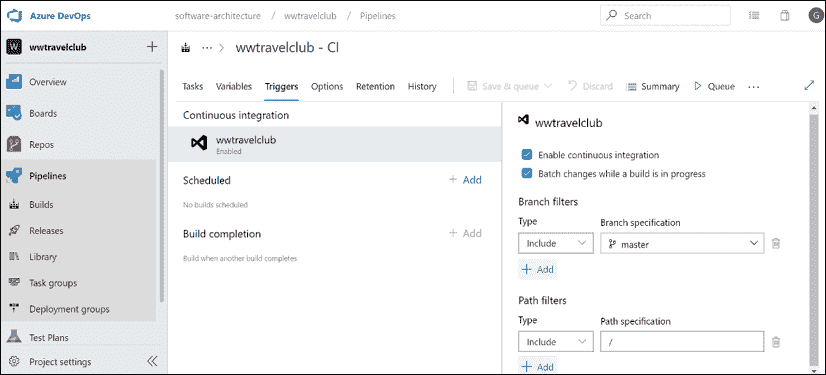
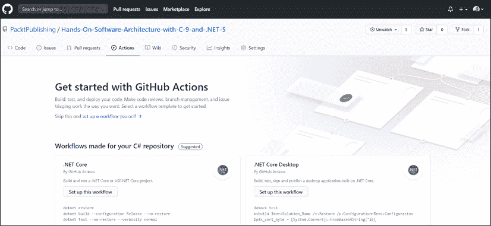
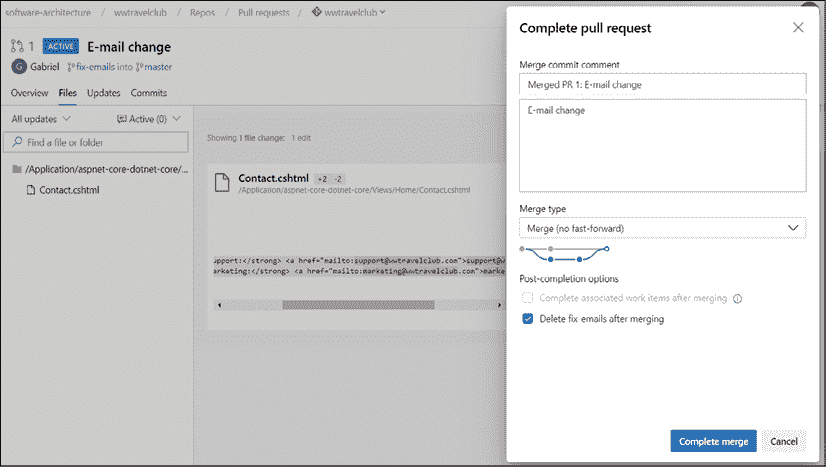

# 第二十一章：应用 CI 场景的挑战

**持续集成**（**CI**）有时被视为 DevOps 的先决条件。在上一章中，我们讨论了 CI 的基础知识以及 DevOps 对其的依赖。它的实施也在*第二十章*“理解 DevOps 原则”中进行了介绍。但与其他实践章节不同，本章的目的是讨论如何在实际场景中启用 CI，考虑到您作为软件架构师需要处理的挑战。

本章涵盖的主题如下：

+   理解 CI

+   持续集成和 GitHub

+   了解在使用 CI 时面临的风险和挑战

+   理解 WWTravelClub 项目在本章的方法

与上一章类似，在解释本章内容时，将介绍 WWTravelClub 的示例，因为用于说明 CI 的所有屏幕截图都来自它。除此之外，我们将在本章末尾提供结论，以便您能够轻松理解 CI 的原则。

到本章结束时，您将能够决定是否在项目环境中使用 CI。此外，您将能够定义成功使用此方法所需的工具。

# 技术要求

本章需要 Visual Studio 2019 社区版或更高版本。您可能还需要一个 Azure DevOps 帐户，如*第三章*“使用 Azure DevOps 记录需求”中所述。您可以在以下网址找到本章的示例代码：[`github.com/PacktPublishing/Software-Architecture-with-C-9-and-.NET-5`](https://github.com/PacktPublishing/Software-Architecture-with-C-9-and-.NET-5)。

# 理解 CI

一旦您开始使用 Azure DevOps 这样的平台，启用 CI 肯定会很容易，当然，只需点击相应的选项即可，就像我们在*第二十章*“理解 DevOps 原则”中所看到的那样。因此，技术并不是实施这一流程的阿喀琉斯之踵。

以下截图显示了使用 Azure DevOps 启用 CI 有多么容易。通过点击构建管道并对其进行编辑，您将能够设置触发器，以便在一些点击后启用 CI：



图 21.1：启用持续集成触发器

事实是，CI 将帮助您解决一些问题。例如，它将迫使您测试您的代码，因为您需要更快地提交更改，这样其他开发人员就可以使用您正在编程的代码。

另一方面，您不能只是在 Azure DevOps 中启用 CI 构建。当然，一旦您提交了更改并完成了代码，您就可以启动构建的可能性，但这远非意味着您的解决方案中有可用的 CI。

作为软件架构师，您需要更多地关注这一点的原因与对 DevOps 的真正理解有关。正如在*第二十章*“理解 DevOps 原则”中所讨论的，向最终用户提供价值的需求将始终是决定和制定开发生命周期的良好方式。因此，即使启用 CI 很容易，但启用此功能对最终用户的真正业务影响是什么？一旦您对这个问题有了所有的答案，并且知道如何减少其实施的风险，那么您就能够说您已经实施了 CI 流程。

值得一提的是，CI 是一个原则，可以使 DevOps 工作更加高效和快速，正如在*第二十章* *理解 DevOps 原则*中所讨论的那样。然而，一旦你不确定你的流程是否足够成熟，可以启用持续交付代码，DevOps 肯定可以在没有它的情况下运行。更重要的是，如果你在一个还不够成熟以处理其复杂性的团队中启用 CI，你可能会导致对 DevOps 的误解，因为在部署解决方案时，你可能会开始遇到一些风险。关键是，CI 不是 DevOps 的先决条件。一旦启用了 CI，你可以在 DevOps 中加快速度。然而，你可以在没有它的情况下实践 DevOps。

这就是为什么我们要专门为 CI 增加一个额外的章节。作为软件架构师，你需要了解开启 CI 的关键点。但在我们检查这个之前，让我们学习另一个工具，可以帮助我们进行持续集成 - GitHub。

# 持续集成和 GitHub

自从 GitHub 被微软收购以来，许多功能已经发展，并且提供了新的选项，增强了这个强大工具的功能。可以使用 Azure 门户网站，特别是使用 GitHub Actions 来检查这个集成。

GitHub Actions 是一组工具，用于自动化软件开发。它可以在任何平台上快速启用 CI/持续部署（CD）服务，使用 YAML 文件定义工作流程。你可以将 GitHub Actions 视为 Azure DevOps Pipelines 的替代方案。然而，值得一提的是，你可以使用 GitHub Actions 自动化任何 GitHub 事件，在 GitHub Marketplace 上有数千种可用的操作：



图 21.2：GitHub Actions

通过 GitHub Actions 界面创建构建.NET Core Web 应用程序的工作流程非常简单。正如你在前面的截图中所看到的，已经创建了一些工作流程来帮助我们。我们下面的 YAML 是通过在**.NET Core**下点击**设置此工作流程**选项生成的：

```cs
name: .NET Core
on:
  push:
    branches: [ master ]
  pull_request:
    branches: [ master ]
jobs:
  build:
    runs-on: ubuntu-latest
    steps:
    - uses: actions/checkout@v2
    - name: Setup .NET Core
      uses: actions/setup-dotnet@v1
      with:
        dotnet-version: 3.1.301
    - name: Install dependencies
      run: dotnet restore
    - name: Build
      run: dotnet build --configuration Release --no-restore
    - name: Test
      run: dotnet test --no-restore --verbosity normal 
```

通过下面的调整，可以构建本章特定创建的应用程序。

```cs
name: .NET Core Chapter 21
on:
  push:
    branches: [ master ]
  pull_request:
    branches: [ master ]
jobs:
  build:
    runs-on: ubuntu-latest
    steps:
    - uses: actions/checkout@v2
    - name: Setup .NET Core
      uses: actions/setup-dotnet@v1
      with:
        dotnet-version: 5.0.100-preview.3.20216.6
    - name: Install dependencies
      run: dotnet restore ./ch21 
    - name: Build
      run: dotnet build ./ch21 --configuration Release --no-restore
    - name: Test
      run: dotnet test ./ch21 --no-restore --verbosity normal 
```

如你所见，一旦脚本更新，就可以检查工作流程的结果。如果你愿意，也可以启用持续部署。这只是定义正确脚本的问题：


图 21.3：使用 GitHub Actions 进行简单应用程序编译

微软专门提供文档来介绍 Azure 和 GitHub 的集成。在[`docs.microsoft.com/en-us/azure/developer/github`](https://docs.microsoft.com/en-us/azure/developer/github)查看。

作为软件架构师，你需要了解哪种工具最适合你的开发团队。Azure DevOps 为启用持续集成提供了一个很好的环境，GitHub 也是如此。关键在于，无论你决定选择哪个选项，一旦启用 CI，你将面临风险和挑战。让我们在下一个主题中看看它们。

# 了解使用 CI 时的风险和挑战

现在，你可能会考虑风险和挑战，作为避免使用 CI 的一种方式。但是，如果它可以帮助你创建更好的 DevOps 流程，为什么我们要避免使用它呢？这不是本章的目的。本节的目的是帮助你作为软件架构师，减轻风险，并找到通过良好的流程和技术来应对挑战的更好方式。

本节将讨论的风险和挑战列表如下：

+   持续生产部署

+   生产中的不完整功能

+   测试中的不稳定解决方案

一旦你有了处理这些问题的技术和流程，就没有理由不使用 CI。值得一提的是，DevOps 并不依赖于 CI。然而，它确实可以使 DevOps 工作更加顺畅。现在，让我们来看一下它们。

## 禁用持续生产部署

持续生产部署是一个过程，在提交了新的代码片段并经过一些管道步骤后，你将在**生产**环境中拥有这段代码。这并非不可能，但是很难且成本高昂。此外，你需要一个成熟的团队来实现它。问题在于，大多数在互联网上找到的演示和示例都会向你展示一个快速部署代码的捷径。CI/CD 的演示看起来如此简单和容易！这种*简单性*可能会暗示你应该尽快开始实施。然而，如果你再多考虑一下，如果直接部署到生产环境，这种情况可能是危险的！在一个需要 24 小时、7 天全天候可用的解决方案中，这是不切实际的。因此，你需要担心这一点，并考虑不同的解决方案。

第一个是使用多阶段场景，如*第二十章*中所述，*理解 DevOps 原则*。多阶段场景可以为你构建的部署生态系统带来更多的安全性。此外，你将有更多的选择来避免不正确的部署到生产环境，比如预部署批准：


图 21.4：生产环境安全的多阶段场景

值得一提的是，你可以构建一个部署管道，通过这个工具更新所有的代码和软件结构。然而，如果你有一些超出这种情况的东西，比如数据库脚本和环境配置，一个不正确的发布可能会对最终用户造成损害。此外，生产环境何时更新的决定需要计划，并且在许多情况下，所有平台用户需要被通知即将发生的变化。在这些难以决定的情况下使用*变更管理*程序。

因此，将代码交付到生产环境的挑战将让你考虑一个时间表。无论你的周期是每月、每天，甚至每次提交。关键点在于你需要创建一个流程和管道，确保只有良好和经过批准的软件在生产阶段。然而，值得注意的是，你离开部署的时间越长，以前部署版本和新版本之间的偏差就会越大，一次推出的变化也会越多。你能够更频繁地管理这一点，就越好。

## 不完整的功能

当你的团队的开发人员正在创建一个新的功能或修复一个错误时，你可能会考虑生成一个分支，以避免使用为持续交付设计的分支。分支可以被认为是代码存储库中可用的功能，以启用独立的开发线，因为它隔离了代码。如下截图所示，使用 Visual Studio 创建一个分支非常简单：


图 21.5：在 Visual Studio 中创建分支

这似乎是一个不错的方法，但让我们假设开发人员认为实现已经准备好部署，并且刚刚将代码合并到主分支。如果这个功能还没有准备好，只是因为遗漏了一个需求呢？如果错误导致了不正确的行为呢？结果可能是发布一个不完整的功能或不正确的修复。

避免主分支中出现损坏的功能甚至不正确的修复的一个好的做法是使用拉取请求。拉取请求将让其他团队开发人员知道你开发的代码已经准备好合并。以下截图显示了如何使用 Azure DevOps 创建一个你所做更改的**新拉取请求**：


图 21.6：创建拉取请求

一旦创建了拉取请求并确定了审阅者，每个审阅者都将能够分析代码，并决定这段代码是否足够健康，可以合并到主分支中。以下截图显示了使用比较工具来分析更改的方法：


图 21.7：分析拉取请求

一旦所有的批准都完成了，你就可以安全地将代码合并到主分支，就像你在下面的截图中所看到的那样。要合并代码，你需要点击“完成合并”。如果 CI 触发器已启用，就像在本章前面所示的那样，Azure DevOps 将启动一个构建流水线：



图 21.8：合并拉取请求

毫无疑问，如果没有这样的流程，主分支将遭受大量可能会造成损害的糟糕代码，尤其是在 CD 的情况下。值得一提的是，代码审查在 CI/CD 场景中是一个很好的实践，也被认为是创建高质量软件的绝佳实践。

你需要关注的挑战是确保只有完整的功能才会呈现给最终用户。你可以使用特性标志原则来解决这个问题，这是一种确保只有准备好的功能呈现给最终用户的技术。我们再次强调的不是 CI 作为一种工具，而是作为一种在每次需要为生产交付代码时定义和使用的过程。

值得一提的是，在控制环境中的特性可用性方面，特性标志比使用分支/拉取请求要安全得多。两者都有各自的用处，但拉取请求是关于在 CI 阶段控制代码质量，而特性标志是在 CD 阶段控制特性可用性。

## 一个不稳定的测试解决方案

考虑到你已经减轻了本主题中提出的另外两个风险，你可能会发现在 CI 之后出现糟糕的代码是不太常见的。确实，早前提到的担忧肯定会减轻，因为你正在处理一个多阶段的情景，并且在推送到第一个阶段之前进行了拉取请求。

但是有没有一种方法可以加速发布的评估，确保这个新版本已经准备好供利益相关者测试？是的，有！从技术上讲，你可以在第十八章“使用单元测试用例和 TDD 测试你的代码”和第二十二章“功能测试自动化”中找到这样做的方法。

在这两章讨论中，自动化软件的每一个部分都是不切实际的，考虑到所需的努力。此外，在用户界面或业务规则经常变化的情况下，自动化的维护成本可能更高。虽然这是一个艰难的决定，作为软件架构师，你必须始终鼓励自动化测试的使用。

为了举例说明，让我们看一下下面的截图，它显示了由 Azure DevOps 项目模板创建的 WWTravelClub 的单元测试和功能测试样本：


图 21.9：单元测试和功能测试项目

在第十一章“设计模式和.NET 5 实现”中介绍了一些架构模式，比如 SOLID，以及一些质量保证方法，比如同行评审，这些方法会给你比软件测试更好的结果。

然而，这些方法并不否定自动化实践。事实上，所有这些方法都将有助于获得稳定的解决方案，特别是在运行 CI 场景时。在这种环境中，你能做的最好的事情就是尽快检测错误和错误行为。正如前面所示，单元测试和功能测试都将帮助你做到这一点。

单元测试将在构建流水线期间帮助你发现业务逻辑错误。例如，在下面的截图中，你会发现一个模拟错误，导致单元测试未通过而取消了构建：


图 21.10：单元测试结果

获得此错误的方法非常简单。您需要编写一些不符合单元测试检查的代码。一旦提交，假设您已经启用了持续部署触发器，代码将在流水线中构建。我们创建的 Azure DevOps 项目向导提供的最后一步之一是执行单元测试。因此，在构建代码之后，将运行单元测试。如果代码不再符合测试，您将收到错误。

同时，以下截图显示了在**开发/测试**阶段功能测试中出现的错误。此时，**开发/测试**环境存在一个错误，被功能测试迅速检测到：


图 21.11：功能测试结果

但这不是在 CI/CD 过程中应用功能测试的唯一好处，一旦您用这种方法保护了其他部署阶段。例如，让我们看一下 Azure DevOps 中**Releases**流水线界面的以下截图。如果您查看**Release-9**，您将意识到，由于此错误发生在**开发/测试**环境中发布之后，多阶段环境将保护部署的其他阶段：


图 21.12：多阶段环境保护

CI 过程成功的关键是将其视为加速软件交付的有用工具，并且不要忘记团队始终需要为最终用户提供价值。采用这种方法，之前介绍的技术将为您的团队实现其目标提供令人难以置信的方式。

# 理解 WWTravelClub 项目的方法

在这一章中，展示了 WWTravelClub 项目的截图，示范了采用更安全的方法来实现 CI 的步骤。即使将 WWTravelClub 视为假设的情景，建立它时也考虑了一些问题：

+   CI 已启用，但多阶段场景也已启用。

+   即使有多阶段场景，拉取请求也是确保只有高质量代码会出现在第一阶段的一种方式。

+   为了在拉取请求中做好工作，进行了同行评审。

+   同行评审检查，例如在创建新功能时是否存在功能标志。

+   同行评审检查在创建新功能期间开发的单元测试和功能测试。

上述步骤不仅适用于 WWTravelClub。作为软件架构师，您需要定义一种方法来确保安全的 CI 场景。您可以将此作为起点。

# 总结

本章介绍了在软件开发生命周期中启用 CI 的重要性，考虑到您作为软件架构师决定为解决方案使用它时将面临的风险和挑战。

此外，本章介绍了一些可以使这个过程更容易的解决方案和概念，例如多阶段环境、拉取请求审查、功能标志、同行评审和自动化测试。理解这些技术和流程将使您能够在 DevOps 场景中引导项目朝着更安全的行为方向发展。

在下一章中，我们将看到软件测试的自动化是如何工作的。

# 问题

1.  什么是 CI？

1.  没有 CI，你能有 DevOps 吗？

1.  在非成熟团队启用 CI 的风险是什么？

1.  多阶段环境如何帮助 CI？

1.  自动化测试如何帮助 CI？

1.  拉取请求如何帮助 CI？

1.  拉取请求只能与 CI 一起使用吗？

# 进一步阅读

以下是一些网站，您可以在其中找到有关本章涵盖主题的更多信息：

+   有关 CI/CD 的官方微软文档：

+   [`azure.microsoft.com/en-us/solutions/architecture/azure-devops-continuous-integration-and-continuous-deployment-for-azure-web-apps/`](https://azure.microsoft.com/en-us/solutions/architecture/azure-devops-continuous-integration-and-con)

+   [`docs.microsoft.com/en-us/azure/devops-project/azure-devops-project-github`](https://docs.microsoft.com/en-us/azure/devops-project/azure-devops-project-github)

+   [`docs.microsoft.com/en-us/aspnet/core/azure/devops/cicd`](https://docs.microsoft.com/en-us/aspnet/core/azure/devops/cicd)

+   [`docs.microsoft.com/en-us/azure/devops/repos/git/pullrequest`](https://docs.microsoft.com/en-us/azure/devops/repos/git/pullrequest)

+   Azure 和 GitHub 集成：

+   [`docs.microsoft.com/en-us/azure/developer/github`](https://docs.microsoft.com/en-us/azure/developer/github)

+   关于 DevOps 的优秀 Packt 材料：

+   [`www.packtpub.com/virtualization-and-cloud/professional-microsoft-azure-devops-engineering`](https://www.packtpub.com/virtualization-and-cloud/professional-microsoft-azure-devops-engineering)

+   [`www.packtpub.com/virtualization-and-cloud/hands-devops-azure-video`](https://www.packtpub.com/virtualization-and-cloud/hands-devops-azure-video)

+   [`www.packtpub.com/networking-and-servers/implementing-devops-microsoft-azure`](https://www.packtpub.com/networking-and-servers/implementing-devops-microsoft-azure )

+   关于 Azure Pipelines 的一些新信息：

+   [`devblogs.microsoft.com/devops/whats-new-with-azure-pipelines/`](https://devblogs.microsoft.com/devops/whats-new-with-azure-pipelines/)

+   关于功能标志的解释：

+   [`martinfowler.com/bliki/FeatureToggle.html`](https://martinfowler.com/bliki/FeatureToggle.html)
