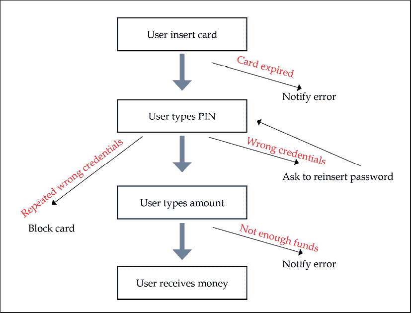

# 第二十二章：功能测试的自动化

在之前的章节中，我们讨论了单元测试和集成测试在软件开发中的重要性，并讨论了它们如何确保代码库的可靠性。我们还讨论了单元测试和集成测试如何成为所有软件生产阶段的组成部分，并且在每次代码库修改时运行。

还有其他重要的测试，称为功能测试。它们仅在每个冲刺结束时运行，以验证冲刺的输出实际上是否满足与利益相关者达成的规格。

本章专门致力于功能测试以及定义、执行和自动化它们的技术。更具体地，本章涵盖以下主题：

+   理解功能测试的目的

+   在 C#中使用单元测试工具自动化功能测试

+   用例-自动化功能测试

在本章结束时，您将能够设计手动和自动测试，以验证冲刺产生的代码是否符合其规格。

# 技术要求

在继续本章之前，建议您阅读*第十八章*，*使用单元测试用例和 TDD 测试您的代码*。

本章需要 Visual Studio 2019 的免费社区版或更高版本，并安装了所有数据库工具。在这里，我们将修改*第十八章*中的代码，*使用单元测试用例和 TDD 测试您的代码*，该代码可在[`github.com/PacktPublishing/Software-Architecture-with-C-9-and-.NET-5`](https://github.com/PacktPublishing/Software-Architecture-with-C-9-and-.NET-5)上找到。

# 理解功能测试的目的

在*第十八章*中，*使用单元测试用例和 TDD 测试您的代码*，我们讨论了自动测试的优势，如何设计它们以及它们的挑战。功能测试使用与单元测试和集成测试相同的技术和工具，但它们与它们不同之处在于它们仅在每个冲刺结束时运行。它们的基本作用是验证当前版本的整个软件是否符合其规格。

由于功能测试还涉及**用户界面**（**UI**），它们需要进一步的工具来模拟用户在 UI 中的操作方式。我们将在整个章节中进一步讨论这一点。需要额外工具的需求并不是 UI 带来的唯一挑战，因为 UI 也经常发生重大变化。因此，我们不应设计依赖于 UI 图形细节的测试，否则我们可能会被迫在每次 UI 更改时完全重写所有测试。这就是为什么有时放弃自动测试并回归手动测试会更好。

无论是自动还是手动，功能测试都必须是一个正式的过程，用于以下目的：

+   功能测试代表了利益相关者和开发团队之间合同的最重要部分，另一部分是验证非功能规格。这份合同的形式化方式取决于开发团队和利益相关者之间关系的性质：

+   在供应商-客户关系的情况下，功能测试成为每个冲刺的供应商-客户业务合同的一部分，由为客户工作的团队编写。如果测试失败，那么冲刺将被拒绝，供应商必须进行补充冲刺以解决所有问题。

+   如果没有供应商-客户业务关系，因为开发团队和利益相关者属于同一家公司，那么就没有业务合同。在这种情况下，利益相关者与团队一起编写一份内部文件，正式规定了冲刺的要求。如果测试失败，通常不会拒绝冲刺，而是使用测试结果来驱动下一个冲刺的规格。当然，如果失败率很高，冲刺可能会被拒绝并且需要重复。

+   在每个冲刺结束时运行的正式功能测试可以防止之前冲刺取得的结果被新代码破坏。

+   在使用敏捷开发方法时，保持更新的功能测试库是获得最终系统规范的正式表示的最佳方式，因为在敏捷开发过程中，最终系统的规范并不是在开发开始之前决定的，而是系统演变的结果。

由于最初阶段的前几个冲刺的输出可能与最终系统有很大不同，因此不值得花费太多时间编写详细的手动测试和/或自动化测试。因此，您可以将用户故事限制为仅有几个示例，这些示例将被用作软件开发的输入和手动测试。

随着系统功能变得更加稳定，值得投入时间编写详细和正式的功能测试。对于每个功能规范，我们必须编写验证其在极端情况下操作的测试。例如，在取款用例中，我们必须编写验证所有可能性的测试：

+   资金不足

+   卡已过期

+   凭证错误

+   重复的错误凭证

以下图片勾勒了整个过程及所有可能的结果：



图 22.1：取款示例

对于手动测试，对于前述每个场景，我们必须给出每个操作涉及的所有步骤的详细信息，以及每个步骤的预期结果。

一个重要的决定是是否要自动化所有或部分功能测试，因为编写模拟人操作与系统 UI 交互的自动化测试非常昂贵。最终决定取决于测试实施的成本除以预期使用次数。

在 CI/CD 的情况下，同一个功能测试可以被执行多次，但不幸的是，功能测试严格地与 UI 的实现方式相关联，而在现代系统中，UI 经常发生变化。因此，在这种情况下，测试与完全相同的 UI 执行不超过几次。

为了克服与 UI 相关的所有问题，一些功能测试可以被实施为**皮下测试**，也就是绕过 UI 的测试。例如，ASP.NET Core 应用程序的一些功能测试可以直接调用控制器动作方法，而不是通过浏览器发送实际请求。

不幸的是，皮下测试无法验证所有可能的实现错误，因为它们无法检测 UI 本身的错误。此外，在 Web 应用程序的情况下，皮下测试通常受到其他限制的影响，因为它们绕过了整个 HTTP 协议。

特别是在 ASP.NET Core 应用程序的情况下，如果我们直接调用控制器动作方法，就会绕过整个 ASP.NET Core 管道，该管道在将请求传递给正确的动作方法之前处理每个请求。因此，身份验证、授权、CORS 和 ASP.NET Core 管道中其他中间件的行为将不会被测试分析。

Web 应用程序的完整自动化功能测试应该执行以下操作：

1.  在要测试的 URL 上启动实际浏览器

1.  等待页面上的任何 JavaScript 执行完成

1.  然后，向浏览器发送命令，模拟人操作的行为

1.  最后，在与浏览器的每次交互之后，自动化测试应该等待任何由交互触发的 JavaScript 完成

虽然存在浏览器自动化工具，但是如前所述，使用浏览器自动化实现的测试非常昂贵且难以实现。因此，ASP.NET Core MVC 建议的方法是使用.NET HTTP 客户端向 Web 应用程序的实际副本发送实际的 HTTP 请求，而不是使用浏览器。一旦 HTTP 客户端接收到 HTTP 响应，它会将其解析为 DOM 树，并验证它是否收到了正确的响应。

与浏览器自动化工具的唯一区别是，HTTP 客户端无法运行任何 JavaScript。然而，其他测试可以添加以测试 JavaScript 代码。这些测试基于特定于 JavaScript 的测试工具，如**Jasmine**和**Karma**。

下一节将解释如何使用.NET HTTP 客户端自动化 Web 应用程序的功能测试，而最后一节将展示功能测试自动化的实际示例。

# 使用 C#中的单元测试工具来自动化功能测试

自动化功能测试使用与单元测试和集成测试相同的测试工具。也就是说，这些测试可以嵌入到与我们在*第十八章*中描述的 xUnit、NUnit 或 MSTests 项目中。然而，在这种情况下，我们必须添加进一步的工具，这些工具能够与 UI 进行交互和检查。

在本章的其余部分，我们将专注于 Web 应用程序，因为它们是本书的主要焦点。因此，如果我们正在测试 Web API，我们只需要`HttpClient`实例，因为它们可以轻松地与 XML 和 JSON 格式的 Web API 端点进行交互。

对于返回 HTML 页面的 ASP.NET Core MVC 应用程序，交互更加复杂，因为我们还需要用于解析和与 HTML 页面 DOM 树交互的工具。`AngleSharp` NuGet 包是一个很好的解决方案，因为它支持最先进的 HTML 和最小的 CSS，并且具有用于外部提供的 JavaScript 引擎（如 Node.js）的扩展点。然而，我们不建议在测试中包含 JavaScript 和 CSS，因为它们严格绑定到目标浏览器，所以最好的选择是使用 JavaScript 特定的测试工具，可以直接在目标浏览器中运行它们。

使用`HttpClient`类测试 Web 应用程序有两个基本选项：

+   **分段应用程序**。一个`HttpClient`实例通过互联网/内联网连接到实际的*分段*Web 应用程序，与所有其他正在进行软件测试的人一起。这种方法的优势在于你正在测试*真实内容*，但是测试更难构思，因为你无法控制每个测试之前应用程序的初始状态。

+   **受控应用程序**。一个`HttpClient`实例连接到一个本地应用程序，该应用程序在每次单独的测试之前都被配置、初始化和启动。这种情况与单元测试场景完全类似。测试结果是可重现的，每个测试之前的初始状态是固定的，测试更容易设计，并且实际数据库可以被更快、更容易初始化的内存数据库替换。然而，在这种情况下，你离实际系统的运行很远。

一个好的策略是使用**受控应用程序**，在这里你完全控制初始状态，用于测试所有极端情况，然后使用**分段应用程序**来测试*真实内容*上的随机平均情况。

接下来的两个部分描述了这两种方法。这两种方法的唯一区别在于你如何定义测试的固定装置。

## 测试分段应用程序

在这种情况下，您的测试只需要一个`HttpClient`的实例，因此您必须定义一个有效的夹具，提供`HttpClient`的实例，避免耗尽 Windows 连接的风险。我们在*第十四章*的*.NET Core HTTP 客户端*部分中遇到了这个问题，*应用 Service-Oriented Architectures with .NET Core*。可以通过使用`IHttpClientFactory`管理`HttpClient`实例并通过依赖注入注入它们来解决这个问题。

一旦我们有了一个依赖注入容器，我们就可以使用以下代码片段来丰富它，以有效地处理`HttpClient`实例：

```cs
services.AddHttpClient(); 
```

在这里，`AddHTTPClient`扩展属于`Microsoft.Extensions.DependencyInjection`命名空间，并且在`Microsoft.Extensions.Http` NuGet 包中定义。因此，我们的测试夹具必须创建一个依赖注入容器，调用`AddHttpClient`，最后构建容器。以下的夹具类完成了这个工作（如果您不记得夹具类，请参考*第十八章*的*使用单元测试用例和 TDD 测试准备和拆卸高级场景*部分）：

```cs
public class HttpClientFixture
{
    public HttpClientFixture()
    {
        var serviceCollection = new ServiceCollection();
        serviceCollection
            .AddHttpClient();
         ServiceProvider = serviceCollection.BuildServiceProvider();
    }
    public ServiceProvider ServiceProvider { get; private set; }
} 
```

在上述定义之后，您的测试应该如下所示：

```cs
public class UnitTest1:IClassFixture<HttpClientFixture>
{
    private readonly ServiceProvider _serviceProvider;
    public UnitTest1(HttpClientFixture fixture)
    {
        _serviceProvider = fixture.ServiceProvider;
    }
    [Fact]
    public void Test1()
    {
        var factory = 
            _serviceProvider.GetService<IHttpClientFactory>())

            HttpClient client = factory.CreateClient();
            //use client to interact with application here

    }
} 
```

在`Test1`中，一旦获得了一个 HTTP 客户端，您可以通过发出 HTTP 请求来测试应用程序，然后通过分析应用程序返回的响应来测试应用程序。有关如何处理服务器返回的响应的更多细节将在*用例*部分中给出。

接下来的部分解释了如何测试在受控环境中运行的应用程序。

## 测试受控应用程序

在这种情况下，我们在测试应用程序中创建一个 ASP.NET Core 服务器，并使用`HTTPClient`实例对其进行测试。`Microsoft.AspNetCore.Mvc.Testing` NuGet 包包含了我们创建 HTTP 客户端和运行应用程序的服务器所需的一切。

`Microsoft.AspNetCore.Mvc.Testing`包含一个夹具类，用于启动本地 Web 服务器并提供用于与其交互的客户端。预定义的夹具类是`WebApplicationFactory<T>`。泛型`T`参数必须实例化为您的 Web 项目的`Startup`类。

测试看起来像以下的类：

```cs
public class UnitTest1 
    : IClassFixture<WebApplicationFactory<MyProject.Startup>>
{
    private readonly 
        WebApplicationFactory< MyProject.Startup> _factory;
    public UnitTest1 (WebApplicationFactory<MyProject.Startup> factory)
    {
        _factory = factory;
    }
    [Theory]
    [InlineData("/")]
    [InlineData("/Index")]
    [InlineData("/About")]
    ....
    public async Task MustReturnOK(string url)
    {
        var client = _factory.CreateClient();
        // here both client and server are ready
        var response = await client.GetAsync(url);
        //get the response
        response.EnsureSuccessStatusCode(); 
        // verify we got a success return code.
    }
    ...
    ---
} 
```

如果您想分析返回页面的 HTML，还必须引用`AngleSharp` NuGet 包。我们将在下一节的示例中看到如何使用它。在这种类型的测试中处理数据库的最简单方法是用内存数据库替换它们，这样可以更快地自动清除每当本地服务器关闭和重新启动时。

这可以通过创建一个新的部署环境，比如`AutomaticStaging`，以及一个特定于测试的关联配置文件来完成。创建了这个新的部署环境后，转到应用程序的`Startup`类的`ConfigureServices`方法，并找到您添加`DBContext`配置的地方。一旦找到了那个地方，在那里添加一个`if`，如果应用程序在`AutomaticStaging`环境中运行，则用类似于这样的东西替换您的`DBContext`配置：

```cs
services.AddDbContext<MyDBContext>(options =>  options.UseInMemoryDatabase(databaseName: "MyDatabase")); 
```

作为替代方案，您还可以将清除标准数据库的所有必需指令添加到从`WebApplicationFactory<T>`继承的自定义夹具的构造函数中。请注意，删除所有数据库数据并不像看起来那么容易，因为存在完整性约束。您有各种选择，但没有一种适用于所有情况：

1.  删除整个数据库并使用迁移重新创建它，即`DbContext.Database.Migrate()`。这总是有效的，但速度慢，并且需要具有高权限的数据库用户。

1.  禁用数据库约束，然后以任何顺序清除所有表。这种技术有时不起作用，并且需要具有高权限的数据库用户。

1.  按正确顺序删除所有数据，因此不违反所有数据库约束。如果您保持一个有序的删除列表，其中包含数据库增长时添加到数据库的所有表，这并不难。这个删除列表是一个有用的资源，您也可以用它来修复数据库更新操作中的问题，并在生产数据库维护期间删除旧条目。不幸的是，这种方法在很少出现的循环依赖的情况下也会失败，例如一个具有指向自身的外键的表。

我更喜欢方法 3，并且只在由于循环依赖引起的困难的罕见情况下才返回到方法 2。作为方法 3 的示例，我们可以编写一个从`WebApplicationFactory<Startup>`继承的 fixture，删除*第十八章*中应用程序的所有测试记录，*使用单元测试用例和 TDD 测试您的代码*。

如果您不需要测试身份验证/授权子系统，则删除包、目的地和事件的数据就足够了。删除顺序很简单；首先必须删除事件，因为没有任何依赖于它们，然后我们可以删除依赖于目的地的包，最后删除目的地本身。代码非常简单：

```cs
public class DBWebFixture: WebApplicationFactory<Startup>
{
    public DBWebFixture() : base()
    {
        var context = Services
            .GetService(typeof(MainDBContext))
                as MainDBContext;
        using (var tx = context.Database.BeginTransaction())
        {
            context.Database
                .ExecuteSqlRaw
                    ("DELETE FROM dbo.PackgeEvents");
            context.Database
                .ExecuteSqlRaw
                    ("DELETE FROM dbo.Packges");
            context.Database
                 .ExecuteSqlRaw
                    ("DELETE FROM dbo.Destinations");
            tx.Commit();
        }
    }
} 
```

我们从继承自`WebApplicationFactory<Startup>`的服务中获取`DBContext`实例，因此可以执行数据库操作。从表中同时删除所有数据的唯一方法是通过直接的数据库命令。因此，在这种情况下，我们无法使用`SaveChanges`方法将所有更改封装在单个事务中，我们被迫手动创建事务。

您可以通过将其添加到下一章的用例中来测试上面的类，该用例基于*第十八章*的代码，*使用单元测试用例和 TDD 测试您的代码*。

# 用例 - 自动化功能测试

在本节中，我们将向*第十八章*的 ASP.NET Core 测试项目中添加一个简单的功能测试。我们的测试方法基于`Microsoft.AspNetCore.Mvc.Testing`和`AngleSharp` NuGet 包。请制作整个解决方案的新副本。

测试项目已经引用了`test`下的 ASP.NET Core 项目和所有必需的 xUnit NuGet 包，因此我们只需要添加`Microsoft.AspNetCore.Mvc.Testing`和`AngleSharp` NuGet 包。

现在，让我们添加一个名为`UIExampleTest.cs`的新类文件。我们需要`using`语句来引用所有必要的命名空间。更具体地说，我们需要以下内容：

+   使用 PackagesManagement;：这是引用应用程序类所需的。

+   使用 Microsoft.AspNetCore.Mvc.Testing;：这是引用客户端和服务器类所需的。

+   使用 AngleSharp;和使用 AngleSharp.Html.Parser;：这是引用`AngleSharp`类所需的。

+   System.IO：这是为了从 HTTP 响应中提取 HTML 所需的。

+   使用 Xunit：这是引用所有`xUnit`类所需的。

总结一下，整个`using`块如下：

```cs
using PackagesManagement;
using System;
using System.Collections.Generic;
using System.Linq;
using System.Threading.Tasks;
using Xunit;
using Microsoft.AspNetCore.Mvc.Testing;
using AngleSharp;
using AngleSharp.Html.Parser;
using System.IO; 
```

我们将使用前面*测试受控应用程序*部分介绍的标准 fixture 类来编写以下测试类：

```cs
public class UIExampleTestcs:
         IClassFixture<WebApplicationFactory<Startup>>
{
    private readonly
       WebApplicationFactory<Startup> _factory;
    public UIExampleTestcs(WebApplicationFactory<Startup> factory)
    {
       _factory = factory;
    }
} 
```

现在，我们准备为主页编写一个测试！这个测试验证主页 URL 返回成功的 HTTP 结果，并且主页包含指向包管理页面的链接，即`/ManagePackages`相对链接。

基本原则是理解自动化测试不应依赖 HTML 的细节，而是必须验证逻辑事实，以避免在每次应用程序 HTML 进行小修改后频繁更改。这就是为什么我们只验证必要的链接是否存在，而不对它们的位置施加约束。

让我们称我们的主页测试为`TestMenu`：

```cs
[Fact]
public async Task TestMenu()
{
    var client = _factory.CreateClient();
    ...
    ...         
} 
```

每个测试的第一步是创建一个客户端。然后，如果测试需要分析一些 HTML，我们必须准备所谓的`AngleSharp`浏览上下文：

```cs
//Create an angleSharp default configuration
var config = Configuration.Default;
//Create a new context for evaluating webpages 
//with the given config
var context = BrowsingContext.New(config); 
```

配置对象指定选项，如 cookie 处理和其他与浏览器相关的属性。此时，我们已经准备好需要主页：

```cs
var response = await client.GetAsync("/"); 
```

作为第一步，我们验证收到的响应是否包含成功的状态代码，如下所示：

```cs
response.EnsureSuccessStatusCode(); 
```

在不成功的状态代码的情况下，前面的方法调用会引发异常，从而导致测试失败。需要从响应中提取 HTML 分析。以下代码显示了一种简单的方法：

```cs
string source = await response.Content.ReadAsStringAsync(); 
```

现在，我们必须将提取的 HTML 传递给我们之前的`AngleSharp`浏览上下文对象，以便它可以构建 DOM 树。以下代码显示了如何做到这一点：

```cs
var document = await context.OpenAsync(req => req.Content(source)); 
```

`OpenAsync`方法使用`context`中包含的设置执行 DOM 构建活动。构建 DOM 文档的输入由作为`OpenAsync`参数传递的 lambda 函数指定。在我们的情况下，`req.Content(...)`从客户端接收的响应中传递给`Content`方法的 HTML 字符串构建了 DOM 树。

一旦获得`document`对象，我们可以像在 JavaScript 中一样使用它。特别是，我们可以使用`QuerySelector`来查找具有所需链接的锚点：

```cs
var node = document.QuerySelector("a[href=\"/ManagePackages\"]"); 
```

现在只剩下验证`node`不为空了：

```cs
Assert.NotNull(node); 
```

我们做到了！如果您想分析需要用户登录或其他更复杂场景的页面，您需要在 HTTP 客户端中启用 cookie 和自动 URL 重定向。这样，客户端将表现得像一个正常的浏览器，存储和发送 cookie，并在收到`Redirect` HTTP 响应时转到另一个 URL。这可以通过将选项对象传递给`CreateClient`方法来实现，如下所示：

```cs
var client = _factory.CreateClient(
    new WebApplicationFactoryClientOptions
    {
        AllowAutoRedirect=true,
        HandleCookies=true
    }); 
```

通过前面的设置，您的测试可以执行普通浏览器可以执行的所有操作。例如，您可以设计需要 HTTP 客户端登录并访问需要身份验证的页面的测试，因为`HandleCookies=true`允许客户端存储身份验证 cookie，并在所有后续请求中发送。

# 摘要

本章解释了功能测试的重要性，以及如何定义详细的手动测试，以在每个迭代的输出上运行。此时，您应该能够定义自动测试，以验证在每个迭代结束时，您的应用程序是否符合其规格。

然后，本章分析了何时值得自动化一些或所有功能测试，并描述了如何在 ASP.NET Core 应用程序中自动化它们。

最后一个示例展示了如何使用`AngleSharp`编写 ASP.NET Core 功能测试来检查应用程序返回的响应。

## 结论

在讨论了使用 C# 9 和.NET 5 开发解决方案的最佳实践和方法以及 Azure 中最新的云环境之后，您终于到达了本书的结尾。

正如您在职业生涯中可能已经注意到的那样，按时、按预算开发软件并满足客户需求的功能并不简单。本书的主要目的不仅在于展示软件开发周期基本领域的最佳实践，还演示了如何使用所提到的工具的功能和优势，以帮助您设计可扩展、安全和高性能的企业应用程序，并考虑智能软件设计。这就是为什么本书涵盖了每个广泛领域中的不同方法，从用户需求开始，到生产中的软件，不断部署和监控。

谈到持续交付软件，本书强调了编码、测试和监控解决方案的最佳实践的必要性。这不仅仅是开发一个项目的问题；作为软件架构师，您将对您在软件停用之前所做的决定负责。现在，由您决定最适合您情况的实践和模式。

# 问题

1.  在快速 CI/CD 周期的情况下，自动化 UI 功能测试总是值得的吗？

1.  ASP.NET Core 应用程序的皮下测试的缺点是什么？

1.  编写 ASP.NET Core 功能测试的建议技术是什么？

1.  检查服务器返回的 HTML 的建议方式是什么？

# 进一步阅读

+   `Microsoft.AspNetCore.Mvc.Testing` NuGet 包和`AngleSharp`的更多详细信息可以在它们各自的官方文档中找到，网址分别为[`docs.microsoft.com/en-US/aspnet/core/test/integration-tests`](https://docs.microsoft.com/en-US/aspnet/core/test/integration-tests)和[`anglesharp.github.io/`](https://anglesharp.github.io)。

+   对 JavaScript 测试感兴趣的读者可以参考 Jasmine 文档：[`jasmine.github.io/`](https://jasmine.github.io)。

| **分享您的经验**感谢您抽出时间阅读本书。如果您喜欢这本书，请帮助其他人找到它。在[`www.amazon.com/dp/1800566042`](https://www.amazon.com/dp/1800566042)上留下评论。 |
| --- |
