# 第一章：Xamarin 简介

本章主要介绍 Xamarin 是什么以及可以从中期望什么。这是唯一的纯理论章节；其他章节将涵盖实际项目。您不需要在此时编写任何代码，而是简单地阅读本章，以开发对 Xamarin 是什么以及 Xamarin.Forms 与 Xamarin 的关系的高层理解。

我们将首先定义什么是原生应用程序以及.NET 作为一种技术带来了什么。之后，我们将看一下 Xamarin.Forms 如何适应更大的图景和

学习何时适合使用传统的 Xamarin 和 Xamarin.Forms。我们经常使用术语*传统的 Xamarin*来描述不使用 Xamarin.Forms 的应用程序，尽管 Xamarin.Forms 应用程序是通过传统的 Xamarin 应用程序引导的。

在本章中，我们将涵盖以下主题：

+   原生应用程序

+   Xamarin 和 Mono

+   Xamarin.Forms

+   设置开发机器

让我们开始吧！

# 原生应用程序

术语**原生应用程序**对不同的人有不同的含义。对一些人来说，这是使用平台创建者指定的工具开发的应用程序，例如使用 Objective-C 或 Swift 开发的 iOS 应用程序，使用 Java 或 Kotlin 开发的 Android 应用程序，或使用.NET 开发的 Windows 应用程序。其他人使用术语*原生应用程序*来指代编译为本机机器代码的应用程序。在本书中，我们将定义原生应用程序为具有本机用户界面、性能和 API 访问的应用程序。以下列表详细解释了这三个概念：

+   **原生用户界面**：使用 Xamarin 构建的应用程序使用每个平台的标准控件。这意味着，例如，使用 Xamarin 构建的 iOS 应用程序将看起来和行为与 iOS 用户期望的一样，使用 Xamarin 构建的 Android 应用程序将看起来和行为与 Android 用户期望的一样。

+   **原生性能**：使用 Xamarin 构建的应用程序经过本地性能编译，可以使用特定于平台的硬件加速。

+   **原生 API 访问：**原生 API 访问意味着使用 Xamarin 构建的应用程序可以使用目标平台和设备为开发人员提供的一切。

# Xamarin 和 Mono

Xamarin 是一个开发平台，用于开发 iOS（Xamarin.iOS）、Android（Xamarin.Android）和 macOS（Xamarin.Mac）的原生应用程序。它在这些平台的顶部技术上是一个绑定层。绑定到平台 API 使.NET 开发人员可以使用 C#（和 F#）开发具有每个平台完整功能的原生应用程序。我们在使用 Xamarin 开发应用程序时使用的 C# API 与平台 API 几乎相同，但它们是*.NET 化*的。例如，API 通常定制以遵循.NET 命名约定，并且 Android 的`set`和`get`方法通常被属性替换。这样做的原因是 API 应该更容易供.NET 开发人员使用。

Mono（[`www.mono-project.com`](https://www.mono-project.com/)）是 Microsoft .NET 框架的开源实现，基于 C#和公共语言运行时（CLR）的**欧洲计算机制造商协会**（**ECMA**）标准。Mono 的创建是为了将.NET 框架带到 Windows 以外的平台。它是.NET 基金会（[`www.dotnetfoundation.org`](http://www.dotnetfoundation.org/)）的一部分，这是一个支持涉及.NET 生态系统的开放发展和协作的独立组织。

通过 Xamarin 平台和 Mono 的组合，我们将能够同时使用所有特定于平台的 API 和.NET 的所有平台无关部分，包括例如命名空间、系统、`System.Linq`、`System.IO`、`System.Net`和`System.Threading.Tasks`。

有几个原因可以使用 Xamarin 进行移动应用程序开发，我们将在以下部分中看到。

# 代码共享

如果有一个通用的编程语言适用于多个移动平台，甚至服务器平台，那么我们可以在目标平台之间共享大量代码，如下图所示。所有与目标平台无关的代码都可以与其他.NET 平台共享。通常以这种方式共享的代码包括业务逻辑、网络调用和数据模型：


除了围绕.NET 平台的大型社区外，还有大量的第三方库和组件可以从 NuGet（[`nuget.org`](https://nuget.org)）下载并在.NET 平台上使用。

跨平台的代码共享将导致更短的开发时间。这也将导致更高质量的应用程序，因为我们只需要编写一次业务逻辑的代码。出现错误的风险会降低，我们还能够保证计算将返回相同的结果，无论用户使用什么平台。

# 利用现有知识

对于想要开始构建原生移动应用程序的.NET 开发人员来说，学习新平台的 API 比学习新旧平台的编程语言和 API 更容易。

同样，想要构建原生移动应用程序的组织可以利用其现有的具有.NET 知识的开发人员来开发应用程序。因为.NET 开发人员比 Objective-C 和 Swift 开发人员更多，所以更容易找到新的开发人员来进行移动应用程序开发项目。

# Xamarin.iOS

Xamarin.iOS 用于使用.NET 构建 iOS 应用程序，并包含了之前提到的 iOS API 的绑定。Xamarin.iOS 使用**提前编译**（**AOT**）将 C#代码编译为**高级精简机器**（**ARM**）汇编语言。Mono 运行时与 Objective-C 运行时一起运行。使用.NET 命名空间的代码，如`System.Linq`或`System.Net`，将由 Mono 运行时执行，而使用 iOS 特定命名空间的代码将由 Objective-C 运行时执行。Mono 运行时和 Objective-C 运行时都运行在由苹果开发的类 Unix 内核**X is Not Unix**（**XNU**）（[`en.wikipedia.org/wiki/XNU`](https://en.wikipedia.org/wiki/XNU)）之上。以下图表显示了 iOS 架构的概述：


# Xamarin.Android

Xamarin.Android 用于使用.NET 构建 Android 应用程序，并包含了对 Android API 的绑定。Mono 运行时和 Android 运行时并行运行在 Linux 内核之上。Xamarin.Android 应用程序可以是**即时编译**（**JIT**）或 AOT 编译的，但要对其进行 AOT 编译，需要使用 Visual Studio Enterprise。

Mono 运行时和 Android 运行时之间的通信通过**Java 本地接口**（**JNI**）桥接发生。有两种类型的 JNI 桥接：**管理可调用包装器**（**MCW**）和**Android 可调用包装器**（**ACW**）。当代码需要在**Android 运行时**（**ART**）中运行时，使用**MCW**，当**ART**需要在 Mono 运行时中运行代码时，使用**ACW**，如下图所示：


# Xamarin.Mac

Xamarin.Mac 用于使用.NET 构建 macOS 应用程序，并包含了对 macOS API 的绑定。Xamarin.Mac 与 Xamarin.iOS 具有相同的架构，唯一的区别是 Xamarin.Mac 应用程序是 JIT 编译的，而不像 Xamarin.iOS 应用程序是 AOT 编译的。如下图所示：

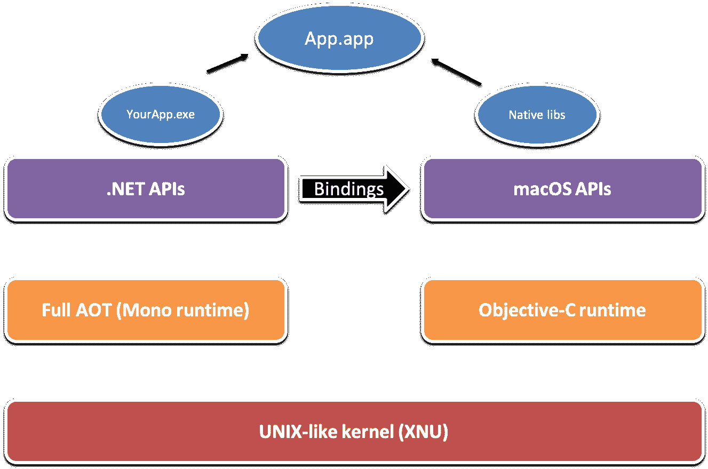

# Xamarin.Forms

**Xamarin.Forms**是建立在 Xamarin（用于 iOS 和 Android）和**通用 Windows 平台**（**UWP**）之上的 UI 框架。**Xamarin.Forms**使开发人员能够使用一个共享的代码库为 iOS、Android 和 UWP 创建 UI，如下图所示。如果我们正在使用**Xamarin.Forms**构建应用程序，我们可以使用 XAML、C#或两者的组合来创建 UI：

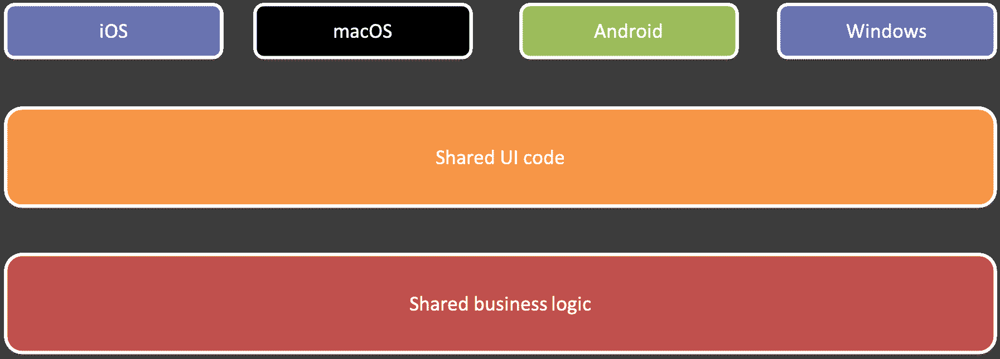

# **Xamarin.Forms**的架构

**Xamarin.Forms**基本上只是每个平台上的一个抽象层。**Xamarin.Forms**有一个共享层，被所有平台使用，以及一个特定于平台的层。特定于平台的层包含渲染器。渲染器是一个将**Xamarin.Forms**控件映射到特定于平台的本机控件的类。每个**Xamarin.Forms**控件都有一个特定于平台的渲染器。

以下图示了当在 iOS 应用中使用共享的 Xamarin.Forms 代码时，**Xamarin.Forms**中的输入控件是如何渲染为**UIKit**命名空间中的**UITextField**控件的。在 Android 中相同的代码会渲染为**Android.Widget**命名空间中的**EditText**控件：


# 使用 XAML 定义用户界面

在 Xamarin.Forms 中声明用户界面的最常见方式是在 XAML 文档中定义它。也可以通过 C#创建 GUI，因为 XAML 实际上只是用于实例化对象的标记语言。理论上，您可以使用 XAML 来创建任何类型的对象，只要它具有无参数的构造函数。XAML 文档是具有特定模式的**可扩展标记语言**(**XML**)文档。

# 定义一个标签控件

作为一个简单的例子，让我们来看一下以下 XAML 代码片段：

```cs
<Label Text="Hello World!" />
```

当 XAML 解析器遇到这个代码片段时，它将创建一个`Label`对象的实例，然后设置与 XAML 中的属性对应的对象的属性。这意味着如果我们在 XAML 中设置了`Text`属性，它将设置在创建的`Label`对象的实例上的`Text`属性。上面例子中的 XAML 将产生与以下相同的效果：

```cs
var obj = new Label()
{
    Text = "Hello World!"
};
```

XAML 的存在是为了更容易地查看您需要创建的对象层次结构，以便创建 GUI。GUI 的对象模型也是按层次结构设计的，因此 XAML 支持添加子对象。您可以简单地将它们添加为子节点，如下所示：

```cs
<StackLayout>
    <Label Text="Hello World" />
    <Entry Text="Ducks are us" />
</StackLayout>
```

`StackLayout`是一个容器控件，它将在该容器内垂直或水平地组织子元素。垂直组织是默认值，除非您另行指定。还有许多其他容器，如`Grid`和`FlexLayout`。这些将在接下来的章节中的许多项目中使用。

# 在 XAML 中创建页面

单个控件没有容器来承载它是不好的。让我们看看整个页面会是什么样子。在 XAML 中定义的完全有效的`ContentPage`是一个 XML 文档。这意味着我们必须从一个 XML 声明开始。之后，我们必须有一个，且只有一个，根节点，如下面的代码所示：

```cs
<?xml version="1.0" encoding="UTF-8"?>
<ContentPage
     xmlns="http://xamarin.com/schemas/2014/forms"
     xmlns:x="http://schemas.microsoft.com/winfx/2009/xaml"
     x:Class="MyApp.MainPage">

    <StackLayout>
        <Label Text="Hello world!" />
    </StackLayout>
</ContentPage>
```

在上面的例子中，我们定义了一个`ContentPage`，它在每个平台上都会被翻译成一个视图。为了使它成为有效的 XAML，您必须指定一个默认命名空间(`)然后添加`x`命名空间(`)。

默认命名空间允许您创建对象而无需为它们加前缀，就像`StackLayout`对象一样。`x`命名空间允许您访问属性，如`x:Class`，它告诉 XAML 解析器在创建`ContentPage`对象时实例化哪个类来控制页面。

`ContentPage`只能有一个子元素。在这种情况下，它是一个`StackLayout`控件。除非您另行指定，默认的布局方向是垂直的。因此，`StackLayout`可以有多个子元素。稍后，我们将介绍更高级的布局控件，如`Grid`和`FlexLayout`控件。

在这个特定的例子中，我们将创建一个`Label`控件作为`StackLayout`的第一个子元素。

# 在 C#中创建页面

为了清晰起见，以下代码展示了相同的内容在 C#中的写法：

```cs
public class MainPage : ContentPage
{
}
```

`page`是一个从`Xamarin.Forms.ContentPage`继承的类。如果你创建一个 XAML 页面，这个类会自动生成，但如果你只用代码，那么你就需要自己定义它。

让我们使用以下代码创建与之前定义的 XAML 页面相同的控件层次结构：

```cs
var page = new MainPage();

var stacklayout = new StackLayout();
stacklayout.Children.Add(
    new Label()
    {
        Text = "Welcome to Xamarin.Forms"
    });

page.Content = stacklayout;
```

第一条语句创建了一个`page`。理论上，你可以直接创建一个`ContentPage`类型的新页面，但这会禁止你在其后写任何代码。因此，最好的做法是为你计划创建的每个页面创建一个子类。

紧接着第一条语句的是创建包含添加到`Children`集合中的`Label`控件的`StackLayout`控件的代码块。

最后，我们需要将`StackLayout`分配给页面的`Content`属性。

# XAML 还是 C#？

通常使用 XAML 会给你一个更好的概览，因为页面是对象的分层结构，而 XAML 是定义这种结构的一种非常好的方式。在代码中，结构会被颠倒，因为你必须先定义最内部的对象，这样就更难读取页面的结构。这在本章的早些例子中已经展示过了。话虽如此，如何定义 GUI 通常是一种偏好。本书将在以后的项目中使用 XAML 而不是 C#。

# Xamarin.Forms 与传统 Xamarin

虽然本书是关于 Xamarin.Forms 的，但我们将强调使用传统 Xamarin 和 Xamarin.Forms 之间的区别。当开发使用 iOS 和 Android SDK 而没有任何抽象手段的应用程序时，使用传统的 Xamarin。例如，我们可以创建一个 iOS 应用程序，在故事板或直接在代码中定义其用户界面。这段代码将无法在其他平台上重用，比如 Android。使用这种方法构建的应用程序仍然可以通过简单引用.NET 标准库来共享非特定于平台的代码。这种关系在下图中显示：


另一方面，Xamarin.Forms 是 GUI 的抽象，它允许我们以一种与平台无关的方式定义用户界面。它仍然建立在 Xamarin.iOS、Xamarin.Android 和所有其他支持的平台之上。Xamarin.Forms 应用程序可以创建为.NET 标准库或共享代码项目，其中源文件被链接为副本，并在当前构建的平台的同一项目中构建。这种关系在下图中显示：


话虽如此，没有传统的 Xamarin，Xamarin.Forms 就无法存在，因为它是通过每个平台的应用程序引导的。这使您能够通过接口将自定义渲染器和特定于平台的代码扩展到每个平台上的 Xamarin.Forms。我们将在本章后面详细讨论这些概念。

# 何时使用 Xamarin.Forms

我们可以在大多数情况下和大多数类型的应用中使用 Xamarin.Forms。如果我们需要使用 Xamarin.Forms 中没有的控件，我们可以随时使用特定于平台的 API。然而，有一些情况下 Xamarin.Forms 是无法使用的。我们可能希望避免使用 Xamarin.Forms 的最常见情况是，如果我们正在构建一个希望在目标平台上看起来非常不同的应用程序。

# 设置开发机器

开发一个适用于多个平台的应用程序对我们的开发机器提出了更高的要求。其中一个原因是我们经常希望在开发机器上运行一个或多个模拟器或仿真器。不同的平台对于开始开发所需的要求也不同。无论我们使用的是 Mac 还是 Windows，Visual Studio 都将是我们的集成开发环境。Visual Studio 有几个版本，包括免费的社区版。请访问[`visualstudio.microsoft.com/`](https://visualstudio.microsoft.com/)比较可用的 Visual Studio 版本。以下列表总结了我们为每个平台开始开发所需的内容：

+   **iOS**：要为 iOS 开发应用程序，我们需要一台 Mac。这可以是我们正在开发的机器，也可以是我们网络上的一台机器（如果我们正在使用）。我们需要连接到 Mac 的原因是我们需要 Xcode 来编译和调试应用程序。Xcode 还提供了 iOS 模拟器。

+   **Android**：Android 应用可以在 macOS 或 Windows 上开发。包括 SDK 和模拟器在内的一切都将与 Visual Studio 一起安装。

+   **UWP**：UWP 应用只能在 Windows 机器上的 Visual Studio 中开发。

# 设置 Mac

在 Mac 上开发使用 Xamarin 开发 iOS 和 Android 应用程序需要两个主要工具。这些工具是 Visual Studio for Mac（如果我们只开发 Android 应用程序，这是我们唯一需要的工具）和 Xcode。在接下来的部分中，我们将看看如何为应用程序开发设置 Mac。

# 安装 Xcode

在安装 Visual Studio 之前，我们需要下载并安装 Xcode。Xcode 是苹果的官方开发 IDE，包含了他们为 iOS 开发提供的所有工具，包括 iOS、macOS、tvOS 和 watchOS 的 SDK。

我们可以从苹果开发者门户([`developer.apple.com`](https://developer.apple.com))或苹果应用商店下载 Xcode。我建议您从应用商店下载，因为这将始终为您提供最新的稳定版本。从开发者门户下载 Xcode 的唯一原因是，如果我们想要使用 Xcode 的预发布版本，例如为 iOS 的预发布版本进行开发。

第一次安装后，以及每次更新 Xcode 后，打开它很重要。Xcode 经常需要在安装或更新后安装额外的组件。您还需要打开 Xcode 以接受与苹果的许可协议。

# 安装 Visual Studio

要安装 Visual Studio，我们首先需要从[`visualstudio.microsoft.com`](https://visualstudio.microsoft.com)下载它。

当我们通过下载的文件启动 Visual Studio 安装程序时，它将开始检查我们的机器上已安装了什么。检查完成后，我们将能够选择要安装的平台和工具。请注意，Xamarin Inspector 需要 Visual Studio 企业许可证。

一旦我们选择了要安装的平台，Visual Studio 将下载并安装我们使用 Xamarin 开始应用程序开发所需的一切，如下图所示：

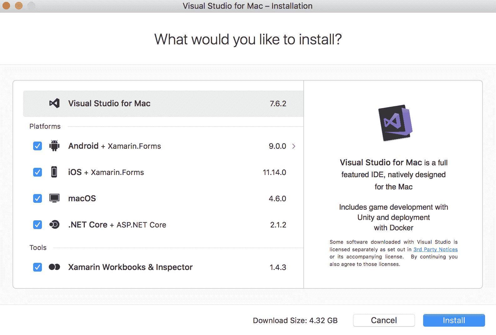

# 配置 Android 模拟器

Visual Studio 将使用 Google 提供的 Android 模拟器。如果我们希望模拟器运行速度快，那么我们需要确保它是硬件加速的。要对 Android 模拟器进行硬件加速，我们需要安装**Intel Hardware Accelerated Execution Manager**（**HAXM**），可以从[`software.intel.com/en-us/articles/intel-hardware-accelerated-execution-manager-intel-haxm`](https://software.intel.com/en-us/articles/intel-hardware-accelerated-execution-manager-intel-haxm)下载。

下一步是创建一个 Android 模拟器。首先，我们需要确保已安装了 Android 模拟器和 Android 操作系统映像。要做到这一点，请按照以下步骤进行：

1.  转到工具选项卡安装 Android 模拟器：


1.  我们还需要安装一个或多个图像以与模拟器一起使用。例如，如果我们想要在不同版本的 Android 上运行我们的应用程序，我们可以安装多个图像。我们将选择具有 Google Play 的模拟器（如下面的屏幕截图所示），以便在模拟器中运行应用程序时可以使用 Google Play 服务。例如，如果我们想要在应用程序中使用 Google 地图，则需要这样做：

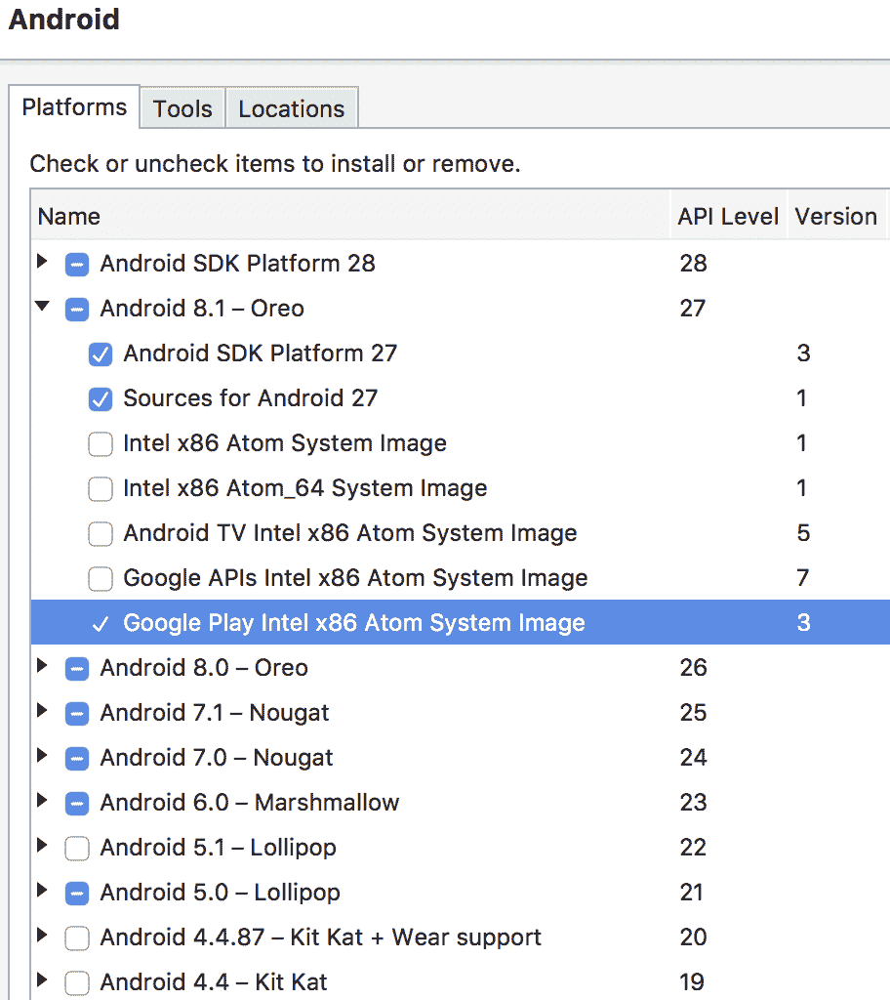

1.  然后，要创建和配置模拟器，请转到 Visual Studio 中的工具选项卡中的 Android 设备管理器。从 Android 设备管理器，如果我们已经创建了一个模拟器，我们可以启动一个模拟器，或者我们可以创建新的模拟器，如下面的屏幕截图所示：


1.  如果单击“新设备”按钮，我们可以创建一个具有我们需要的规格的新模拟器。在这里创建新模拟器的最简单方法是选择与我们需求匹配的基础设备。这些基础设备将被预先配置，通常足够。但是，也可以编辑设备的属性，以便获得与我们特定需求匹配的模拟器。

因为我们不会在具有 ARM 处理器的设备上运行模拟器，所以我们必须选择 x86 处理器或 x64 处理器，如下面的屏幕截图所示。如果我们尝试使用 ARM 处理器，模拟器将非常慢：


# 设置 Windows 机器

我们可以使用虚拟或物理 Windows 机器进行 Xamarin 开发。例如，我们可以在 Mac 上运行虚拟 Windows 机器。我们在 Windows 机器上进行应用程序开发所需的唯一工具是 Visual Studio。

# 安装 Visual Studio 的 Xamarin

如果我们已经安装了 Visual Studio，我们必须首先打开 Visual Studio 安装程序；否则，我们需要转到[`visualstudio.microsoft.com`](https://visualstudio.microsoft.com)下载安装文件。

在安装开始之前，我们需要选择要安装的工作负载。

如果我们想要为 Windows 开发应用程序，我们需要选择通用 Windows 平台开发工作负载，如下面的屏幕截图所示：

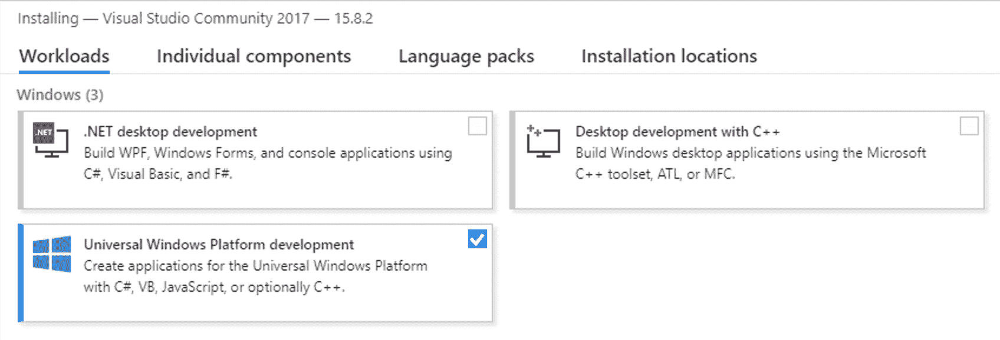

对于 Xamarin 开发，我们需要安装带有.NET 的移动开发。如果您想要使用 Hyper-V 进行硬件加速，我们可以在左侧的.NET 移动开发工作负载的详细描述中取消选择 Intel HAXM 的复选框，如下面的屏幕截图所示。当我们取消选择 Intel HAXM 时，Android 模拟器也将被取消选择，但我们可以稍后安装它：


当我们首次启动 Visual Studio 时，将询问我们是否要登录。除非我们想要使用 Visual Studio 专业版或企业版，否则我们不需要登录，否则我们必须登录以便验证我们的许可证。

# 将 Visual Studio 与 Mac 配对

如果我们想要运行，调试和编译我们的 iOS 应用程序，那么我们需要将其连接到 Mac。我们可以手动设置 Mac，如本章前面描述的那样，或者我们可以使用自动 Mac 配置。这将在我们连接的 Mac 上安装 Mono 和 Xamarin.iOS。它不会安装 Visual Studio IDE，但如果您只想将其用作构建机器，则不需要。但是，我们需要手动安装 Xcode。

要能够连接到 Mac（无论是手动安装的 Mac 还是使用自动 Mac 配置），Mac 需要通过我们的网络访问，并且我们需要在 Mac 上启用远程登录。要做到这一点，转到设置 | 共享，并选择远程登录的复选框。在窗口的左侧，我们可以选择允许连接远程登录的用户，如下截图所示：

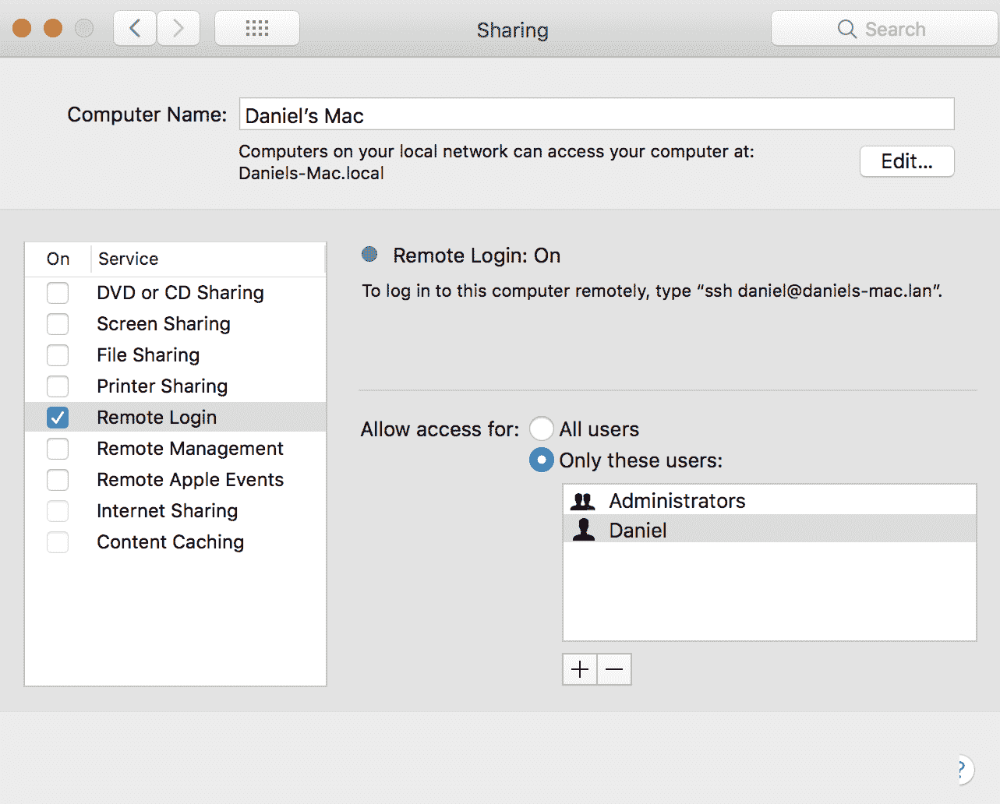

从 Visual Studio 连接到 Mac，可以在工具栏中使用“连接到 Mac”按钮（如下截图所示），或者在顶部菜单中选择工具 | iOS，最后选择连接到 Mac：


将显示一个对话框，显示可以在网络上找到的所有 Mac。如果 Mac 不出现在可用 Mac 列表中，我们可以使用左下角的“添加 Mac”按钮输入 IP 地址，如下截图所示：

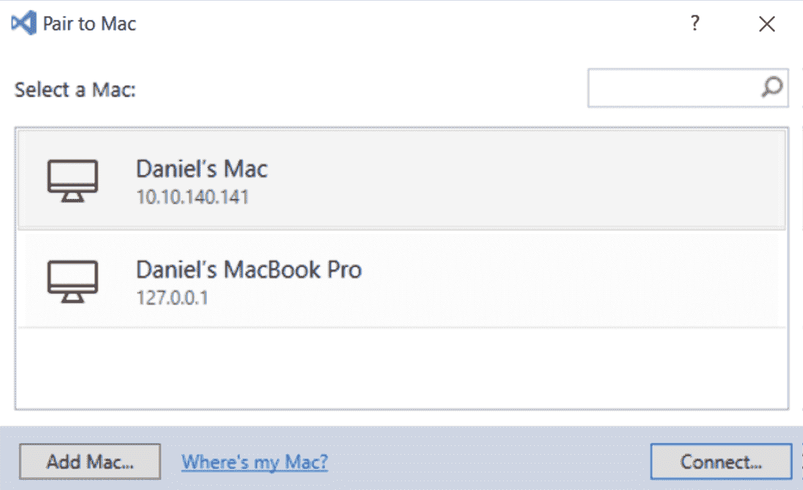

如果 Mac 上安装了您需要的一切，那么 Visual Studio 将连接，我们可以开始构建和调试我们的 iOS 应用程序。如果 Mac 上缺少 Mono，将会出现警告。此警告还将给我们安装它的选项，如下截图所示：


# 配置 Android 模拟器和硬件加速

如果我们想要一个运行流畅的快速 Android 模拟器，就需要启用硬件加速。这可以使用 Intel HAXM 或 Hyper-V 来实现。Intel HAXM 的缺点是它不能在装有**AMD**处理器的机器上使用；你必须有一台装有 Intel 处理器的机器。我们不能同时使用 Intel HAXM 和 Hyper-V。

因此，Hyper-V 是在 Windows 机器上硬件加速 Android 模拟器的首选方式。要在 Android 模拟器中使用 Hyper-V，我们需要安装 2018 年 4 月更新（或更高版本）的 Windows 和 Visual Studio 15.8 版本（或更高版本）。要启用 Hyper-V，需要按照以下步骤进行：

1.  打开开始菜单，键入“打开或关闭 Windows 功能”。单击出现的选项以打开它，如下截图所示：

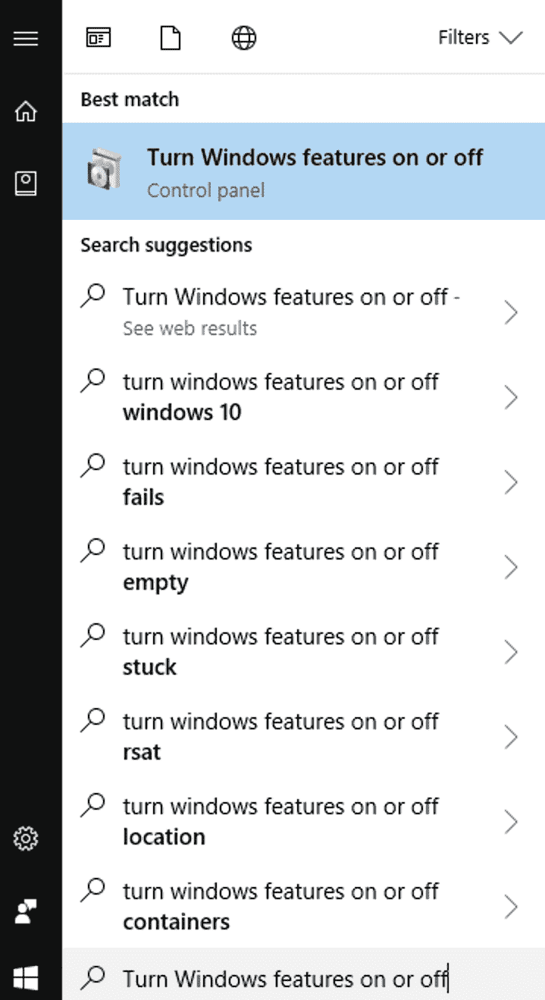

1.  要启用 Hyper-V，选择 Hyper-V 复选框。此外，展开 Hyper-V 选项并选中 Hyper-V 平台复选框。我们还需要选择 Windows Hypervisor Platform 复选框，如下截图所示：

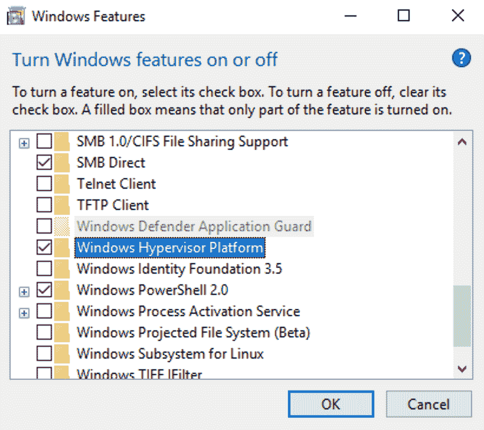

1.  当 Windows 提示时重新启动机器。

因为在安装 Visual Studio 时我们没有安装 Android 模拟器，所以现在需要安装它。转到 Visual Studio 的工具菜单，点击 Android，然后点击 Android SDK Manager。

在 Android SDK Manager 的工具中，我们可以通过选择 Android 模拟器来安装模拟器，如下截图所示。此外，我们应该确保安装了最新版本的 Android SDK 构建工具：

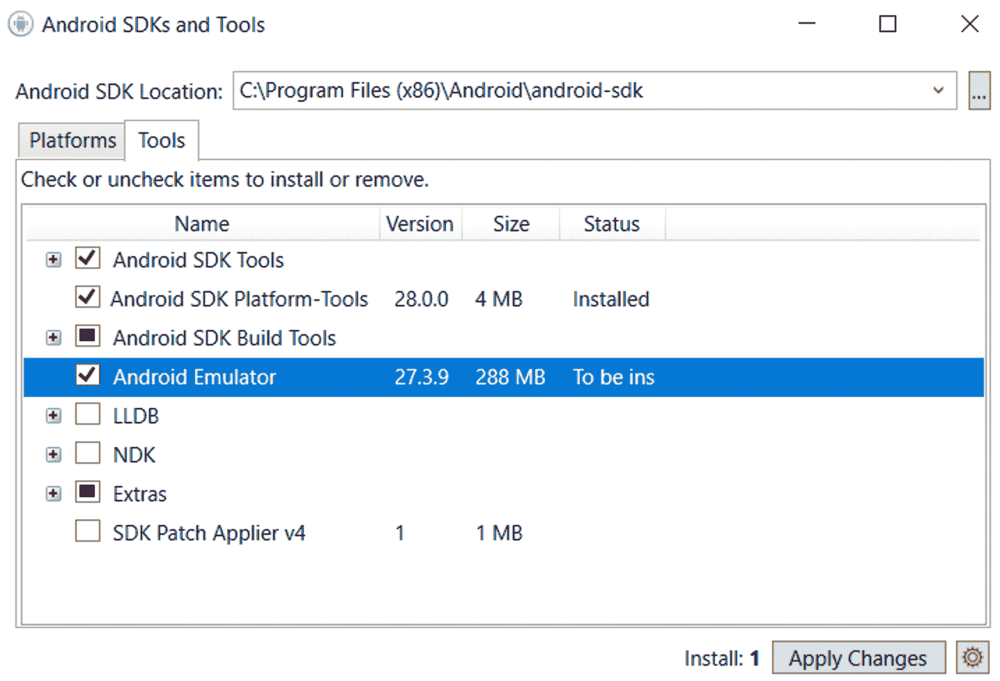

我们建议安装**NDK**（**Native Development Kit**）。NDK 使得可以导入用 C 或 C++编写的库。如果我们想要 AOT 编译应用程序，也需要 NDK。

Android SDK 允许同时安装多个模拟器映像。例如，如果我们想要在不同版本的 Android 上运行我们的应用程序，我们可以安装多个映像。选择带有 Google Play 的模拟器（如下截图所示），这样我们可以在模拟器中运行应用程序时使用 Google Play 服务。

如果我们想在应用程序中使用谷歌地图，就需要这样做：

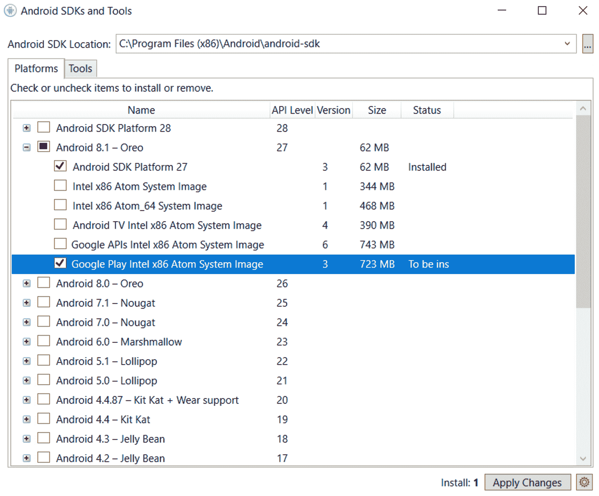

下一步是创建一个虚拟设备来使用模拟器图像。要创建和配置模拟器，请转到 Android 设备管理器，我们将从 Visual Studio 的工具选项卡中打开。从设备管理器，我们可以启动模拟器（如果我们已经创建了一个），或者我们可以创建新的模拟器，如下图所示：


如果我们点击“新设备”按钮，我们可以创建一个符合我们需求的新模拟器。在这里创建新模拟器的最简单方法是选择符合我们需求的基础设备。这些基础设备将被预先配置，通常已经足够了。但是，我们也可以编辑设备的属性，以便获得符合我们特定需求的模拟器。

我们必须选择 x86 处理器（如下图所示）或 x64 处理器，因为我们不会在 ARM 处理器的设备上运行模拟器。如果我们尝试使用 ARM 处理器，模拟器将非常慢：

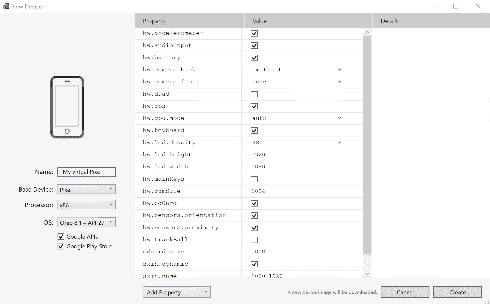

# 配置 UWP 开发者模式

如果我们想开发 UWP 应用程序，我们需要在开发机器上激活开发者模式。要做到这一点，请转到“设置”|“更新和安全”|“开发人员”，然后点击“开发人员模式”，如下图所示。这样我们就可以通过 Visual Studio 侧载和调试应用程序了。

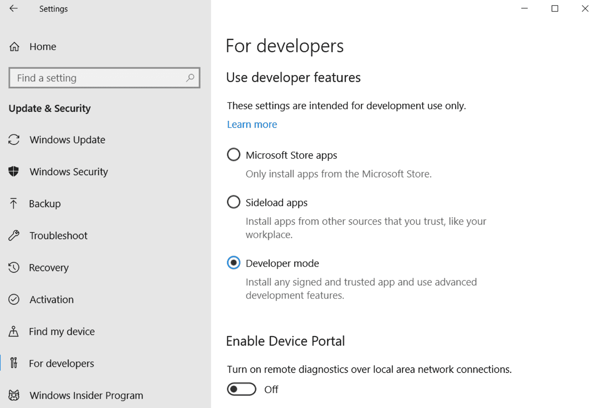

如果我们选择侧载应用程序而不是开发者模式，我们只能安装应用程序，而不需要经过 Microsoft Store。如果我们有一台用于测试而不是调试我们的应用程序的机器，我们可以选择侧载应用程序。

# 总结

阅读完本章后，您应该对 Xamarin 是什么以及 Xamarin.Forms 与 Xamarin 本身的关系有了一些了解。

在本章中，我们确定了我们对本地应用程序的定义，其中包括以下元素：

+   本地用户界面

+   本地性能

+   本地 API 访问

我们谈到了 Xamarin 是基于 Mono 构建的，Mono 是 .NET 框架的开源实现，并讨论了在其核心，Xamarin 是一组绑定到特定平台 API 的工具。然后我们详细了解了 Xamarin.iOS 和 Xamarin.Android 是如何工作的。

之后，我们开始接触本书的核心主题，即 Xamarin.Forms。我们首先概述了平台无关控件如何渲染为特定于平台的控件，以及如何使用 XAML 定义控件层次结构来组装页面。

然后我们花了一些时间来看 Xamarin.Forms 应用程序和传统 Xamarin 应用程序之间的区别。

传统的 Xamarin 应用程序直接使用特定于平台的 API，除了 .NET 添加的平台之外没有其他抽象。

Xamarin.Forms 是建立在传统 Xamarin API 之上的 API，允许我们在 XAML 或代码中定义平台无关的 GUI，然后渲染为特定于平台的控件。Xamarin.Forms 还有更多功能，但这是它的核心功能。

在本章的最后部分，我们讨论了如何在 Windows 或 macOS 上设置开发机器。

现在是时候将我们新获得的知识付诸实践了！我们将从头开始创建一个待办事项应用程序，这将是下一章的内容。我们将研究诸如 Model-View-ViewModel（MVVM）等概念，以实现业务逻辑和用户界面的清晰分离，以及 SQLite.NET，以将数据持久保存到设备上的本地数据库。我们将同时为三个平台进行开发，敬请期待！
