# 第八章：创建增强现实游戏

在本章中，我们将使用 Xamarin.Forms 探索**增强现实**（**AR**）。我们将使用自定义渲染器注入特定于平台的代码，使用**UrhoSharp**来渲染场景和处理输入，并使用`MessagingCenter`在应用程序中传递内部消息。

本章将涵盖以下主题：

+   设置项目

+   使用 ARKit

+   使用 ARCore

+   学习如何使用 UrhoSharp 来渲染图形和处理输入

+   使用自定义渲染器注入特定于平台的代码

+   使用`MessagingCenter`发送消息

# 技术要求

为了能够完成这个项目，我们需要安装 Visual Studio for Mac 或 PC，以及 Xamarin 组件。有关如何设置您的环境的更多详细信息，请参见第一章，*Xamarin 简介*。

您不能在模拟器上运行 AR。要运行 AR，您需要一个物理设备，以及以下软件：

+   在 iOS 上，您需要 iOS 11 或更高版本，以及一个 A9 处理器或更高版本的设备

+   在 Android 上，您需要 Android 8.1 和支持 ARCore 的设备

# 基本理论

本节将描述 AR 的工作原理。实现在不同平台之间略有不同。谷歌的实现称为**ARCore**，苹果的实现称为**ARKit**。

AR 的全部内容都是关于在相机反馈的基础上叠加计算机图形。这听起来是一件简单的事情，除了您必须以极高的精度跟踪相机位置。谷歌和苹果都编写了一些很棒的 API 来为您完成这个魔术，借助手机的运动传感器和相机数据。我们添加到相机反馈上的计算机图形与周围真实物体的坐标空间同步，使它们看起来就像是图像上看到的一部分。

# 项目概述

在本章中，我们将创建一个探索 AR 基础知识的游戏。我们还将学习如何在 Xamarin.Forms 中集成 AR 控制。Android 和 iOS 以不同的方式实现 AR，因此我们需要在途中统一平台。我们将使用 UrhoSharp，一个开源的 3D 游戏引擎，来进行渲染。这只是使用.NET 和 C#与 Urho3D 绑定的**Urho3D**引擎。

游戏将在 AR 中渲染盒子，用户需要点击以使其消失。然后，您可以通过学习 Urho3D 引擎来扩展游戏。

共享代码将放置在一个共享项目中。这与我们迄今为止采取的通常的.NET 标准库方法不同。这样做的原因是，UrhoSharp 在撰写本书时不支持.NET 标准。学习如何创建共享项目也是一个好主意。共享库中的代码本身不会编译。它需要链接到平台项目（如 iOS 或 Android），然后编译器可以编译所有源文件以及平台项目。这与直接将文件复制到该项目中完全相同。因此，通过定义一个共享项目，我们不需要重复编写代码。

这种策略还解锁了另一个强大的功能：**条件编译**。考虑以下示例：

```cs
#if __IOS__ 
   // Only compile this code on iOS
#elif __ANDROID__ 
   // Only compile this code on Android
#endif
```

上述代码显示了如何在共享代码文件中插入特定于平台的代码。这在这个项目中将非常有用。

该项目的预计构建时间为 90 分钟。

# 开始项目

是时候开始编码了！但首先，请确保您已经按照第一章中描述的设置好了开发环境，*Xamarin 简介*。

本章将是一个经典的*文件|新建项目*章节，将逐步指导您完成创建应用程序的过程。完全不需要下载。

# 创建项目

打开 Visual Studio，然后点击“文件”|“新建”|“项目”，如下截图所示：

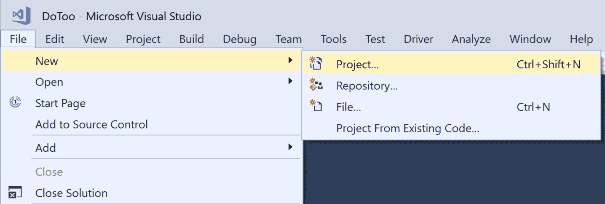

这将打开“新建项目”对话框。展开“Visual C#”节点，然后单击“跨平台”。在列表中选择“移动应用程序（Xamarin.Forms）”项目。通过为您的项目命名来完成表单。在本示例中，我们将称我们的应用程序为`WhackABox`。点击“确定”继续到下一个对话框，如下截图所示：

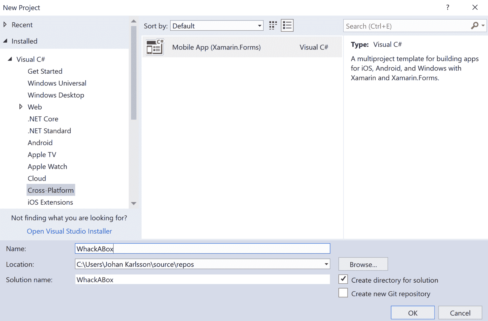

下一步是选择项目模板和代码共享策略。选择“空白模板”选项以创建最基本的 Xamarin.Forms 应用程序，并确保代码共享策略设置为“共享项目”。在“平台”标题下取消选中“Windows（UWP）”复选框，因为此应用程序只支持**iOS**和 Android。点击“确定”完成设置向导，让 Visual Studio 为您创建项目。这可能需要几分钟。请注意，本章我们将使用共享项目——这一点非常重要！您可以在以下截图中看到需要选择的字段和选项：

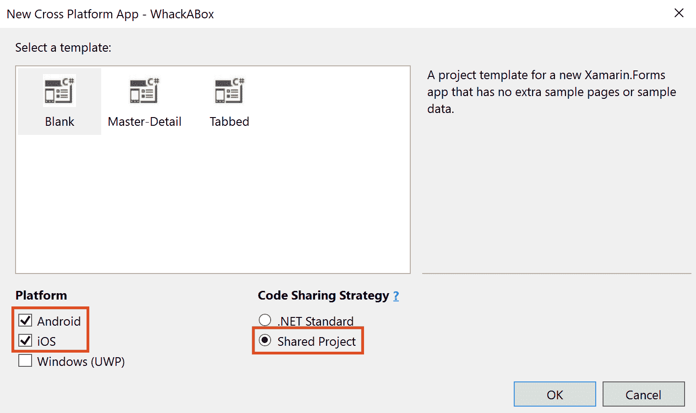

就这样，应用程序已经创建好了。让我们继续更新 Xamarin.Forms 到最新版本。

# 更新 Xamarin.Forms NuGet 包

目前，您的项目创建时使用的 Xamarin.Forms 版本很可能有点过时。为了纠正这一点，我们需要更新 NuGet 包。请注意，您应该只更新 Xamarin.Forms 包，而不是 Android 包；更新 Android 包可能导致包不同步，导致应用程序根本无法构建。要更新 NuGet 包，请按以下步骤操作：

1.  在“解决方案资源管理器”中右键单击我们的解决方案。

1.  点击“管理解决方案的 NuGet 包...”，如下截图所示：

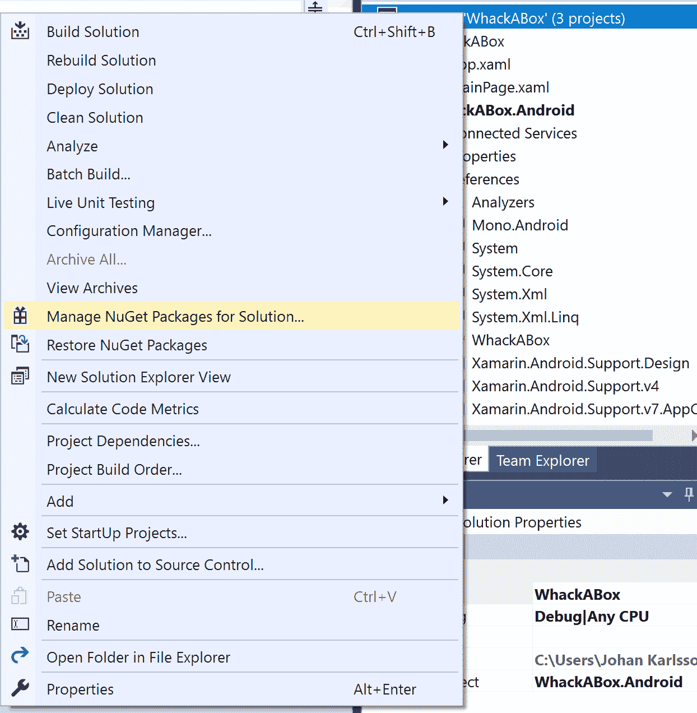

这将在 Visual Studio 中打开 NuGet 包管理器，如下截图所示：

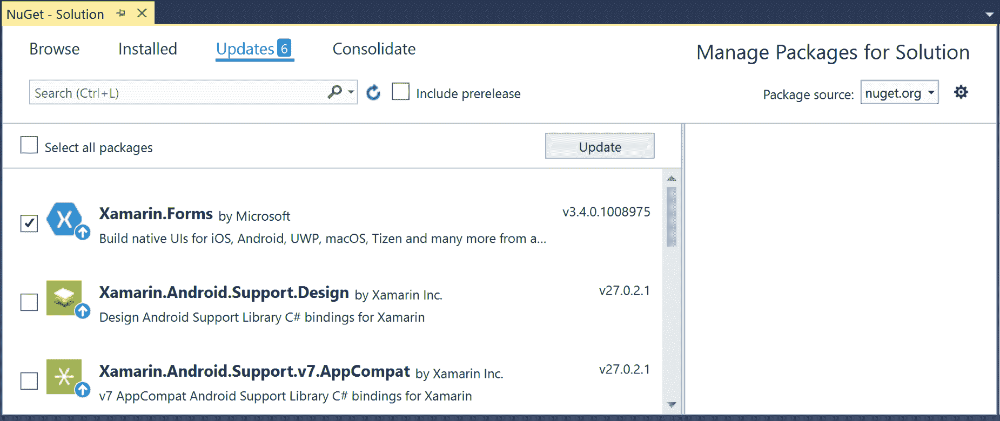

要将 Xamarin.Forms 更新到最新版本，请按以下步骤操作：

1.  点击“更新”选项卡。

1.  勾选“Xamarin.Forms”复选框，然后点击“更新”。

1.  接受任何许可协议。

更新最多需要几分钟。查看输出窗格以获取有关更新的信息。此时，我们可以运行应用程序以确保其正常工作。我们应该在屏幕中央看到“欢迎使用 Xamarin.Forms！”的文本。

# 将 Android 目标设置为 8.1

ARCore 可用于 Android 8.1 及更高版本。因此，我们将通过以下步骤验证 Android 项目的目标框架：

1.  在“解决方案资源管理器”中的 Android 项目下双击“属性”节点。

1.  验证目标框架版本至少为 Android 8.0（Oreo），如下截图所示：


如果目标框架不是至少 Android 8.0（Oreo），则需要选择 Android 8.1（或更高版本）。如果目标框架名称旁边有一个星号，则需要通过以下步骤安装该 SDK：

1.  在工具栏中找到 Android SDK Manager。

1.  点击突出显示的按钮打开 SDK Manager，如下截图所示：


这是系统上安装的所有 Android SDK 版本的控制中心：

1.  展开您想要安装的 SDK 版本。在我们的情况下，这应该至少是 Android 8.1 - Oreo。

1.  选择 Android SDK 平台<版本号>节点。您还可以安装模拟器映像，供模拟器运行所选版本的 Android。

1.  点击“应用更改”，如下截图所示：


# 向 Android 添加相机权限

为了在 Android 中访问相机，我们必须在 Android 清单中添加所需的权限。可以通过以下步骤完成：

1.  在解决方案资源管理器中打开 Android 项目节点。

1.  双击属性节点以打开 Android 的属性。

1.  单击左侧的 Android 清单选项卡，然后向下滚动，直到看到所需权限部分。

1.  定位相机权限并选中复选框。

1.  通过单击*Ctrl* +* S*或文件和保存来保存文件。

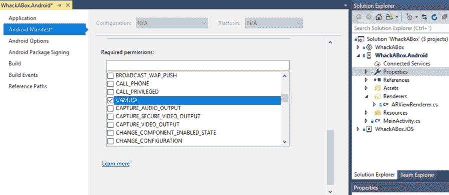

现在我们已经配置了 Android，在准备编写一些代码之前，我们只需要在 iOS 上做一个小小的改变。

# 为 iOS 添加相机使用说明

在 iOS 中，您需要指定为什么需要访问相机。这样做的方法是在 iOS 项目的根文件夹中的`info.plist`文件中添加条目。`info.plist`文件是一个 XML 文件，您可以在任何文本编辑器中编辑。但是，更简单的方法是使用 Visual Studio 提供的通用 PList 编辑器。

使用通用 PList 编辑器添加所需的相机使用说明，如下所示：

1.  定位`WhackABox.iOS`项目。

1.  右键单击`info.plist`，然后单击“使用...”，如下面的屏幕截图所示：

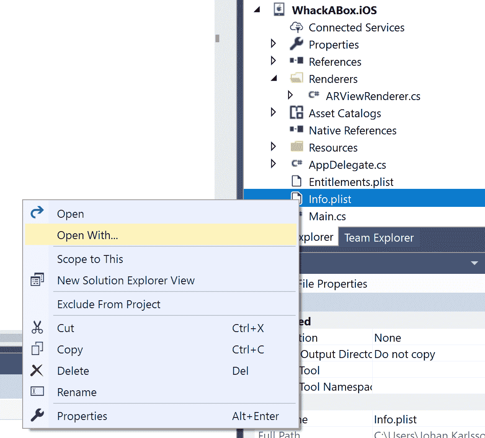

1.  选择通用 PList 编辑器，然后单击确定，如下面的屏幕截图所示：

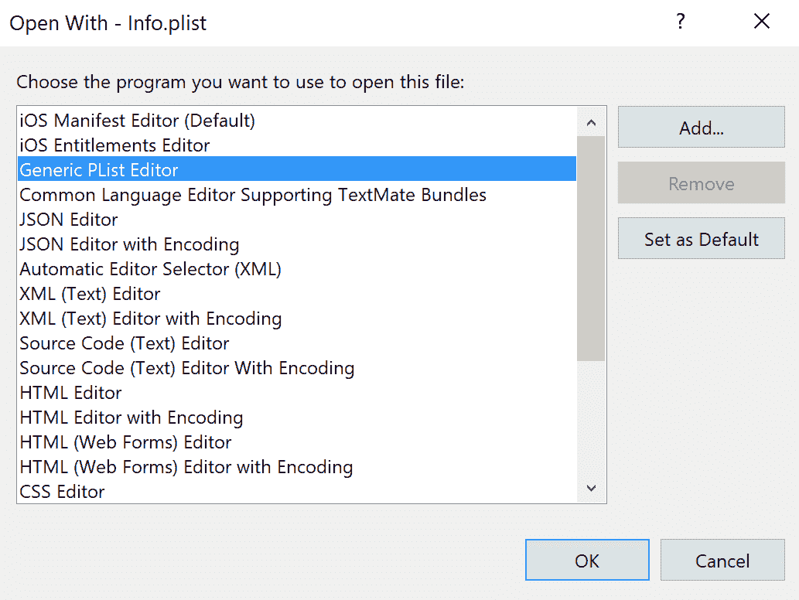

1.  在属性列表的底部找到加号（+）图标。

1.  单击加号（+）图标以添加新键。确保密钥位于文档的根目录下，而不是在另一个属性下，如下面的屏幕截图所示：

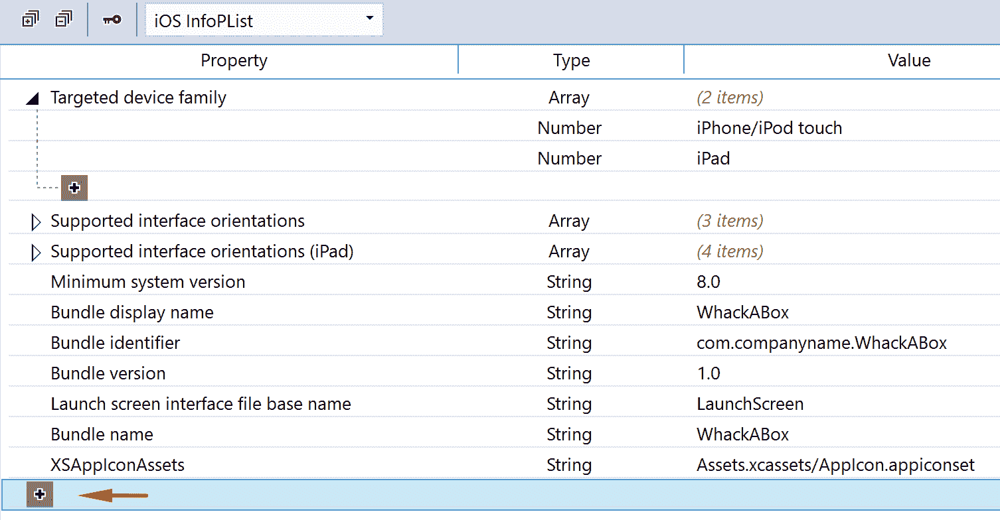

通用 PList 编辑器通过给属性提供更用户友好的名称来帮助您找到正确的属性。让我们添加我们需要的值来描述我们为什么要使用相机：

1.  在新创建的行上打开下拉菜单。

1.  选择隐私-相机使用说明。

1.  在右侧的值字段中写一个好的理由，如下面的屏幕截图所示。原因字段是一个自由文本字段，因此请使用简单的英语描述您的应用程序为什么需要访问相机：

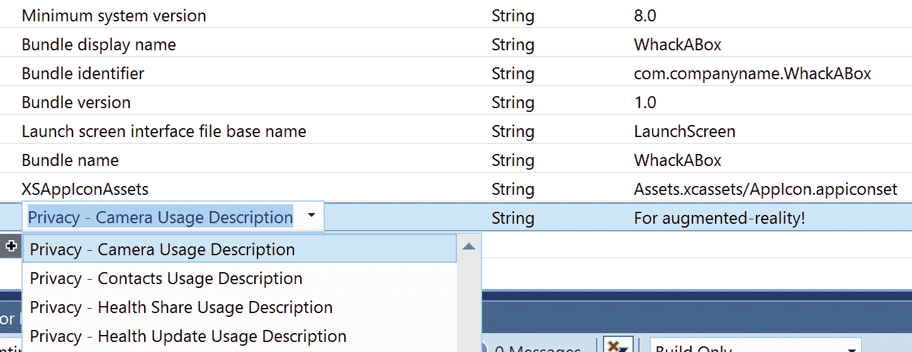

就是这样。 Android 和 iOS 的设置已经完成，现在我们可以专注于有趣的部分-编写代码！

您还可以在任何文本编辑器中打开`Info.plist`文件，因为它是一个 XML 文件。密钥的名称是

`NSCameraUsageDescription`，并且必须作为根节点的直接子节点添加。

# 定义用户界面

我们将首先定义将包装 AR 组件的用户界面。首先，我们将定义一个自定义控件，我们将使用它作为注入包含 AR 组件的`UrhoSurface`的占位符。然后，我们将在包含有关我们在 AR 中找到多少平面以及世界中有多少活动箱子的网格中添加此控件。游戏的目标是在 AR 中使用手机找到箱子，并点击它们使它们消失。

让我们首先定义自定义的`ARView`控件。

# 创建 ARView 控件

`ARView`控件属于共享项目，因为它将成为两个应用程序的一部分。它是一个标准的 Xamarin.Forms 控件，直接从`Xamarin.Forms.View`继承。它不会加载任何 XAML（因此它只是一个单一的类），也不会包含任何功能，只是简单地被定义，因此我们可以将它添加到主网格中。

转到 Visual Studio，并按照以下三个步骤创建`ARView`控件：

1.  在`WhackABox`项目中，添加一个名为`Controls`的文件夹。

1.  在`Controls`文件夹中创建一个名为`ARView`的新类。

1.  将以下代码添加到`ARView`类中：

```cs
using Xamarin.Forms;

namespace WhackABox.Controls
{
    public class ARView : View
    {
    }
} 
```

我们在这里创建了一个简单的类，没有实现，它继承自`Xamarin.Forms.View`。这样做的目的是利用每个平台的自定义渲染器，允许我们指定特定于平台的代码插入到我们放置这个控件的 XAML 中。您的项目现在应该如下所示：

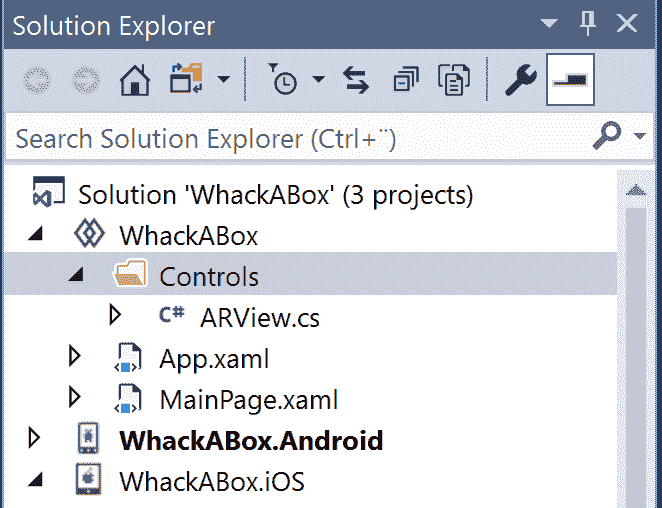

`ARView`控件就那样坐在那里是不行的。我们需要将它添加到`MainPage`中。

# 修改 MainPage

我们将替换`MainPage`的全部内容，并添加对`WhackABox.Controls`命名空间的引用，以便我们可以使用`ARView`控件。让我们通过以下步骤来设置这个：

1.  在`WhackABox`项目中，打开`MainPage.xaml`文件。

1.  编辑 XAML 以使其看起来像以下代码。粗体的 XAML 表示必须添加的新元素：

```cs
<?xml version="1.0" encoding="utf-8">
<ContentPage  

           x:Class="WhackABox.MainPage">

 **<Grid>**
 **<Grid.ColumnDefinitions>**
 **<ColumnDefinition Width="*" />**
 **<ColumnDefinition Width="*" />**
 **</Grid.ColumnDefinitions>**

 **<Grid.RowDefinitions>**
 **<RowDefinition Height="100" />**
 **<RowDefinition Height="*" />**
 **</Grid.RowDefinitions>**

 **<StackLayout Grid.Row="0" Padding="10">**
 **<Label Text="Plane count" />**
 **<Label Text="0" FontSize="Large"  
             x:Name="planeCountLabel" />**
 **</StackLayout>**

 **<StackLayout** **Grid.Row="0"** **Grid.Column="1" Padding="10">**
 **<Label Text="Box count" />**
 **<Label Text="0" FontSize="Large"   
          x:Name="boxCountLabel"/>**
 **</StackLayout>**

 **<controls:ARView Grid.Row="1" Grid.ColumnSpan="2" />**
 **</Grid>**
 </ContentPage> 
```

现在我们有了代码，让我们一步一步地来看：

+   首先，我们定义一个控件命名空间，指向代码中的`WhackABox.Controls`命名空间。这个命名空间用于在 XAML 末尾定位`ARView`控件。

+   然后，我们通过将其设置为`Grid`来定义内容元素。一个页面只能有一个子元素，在这种情况下是一个`Grid`。`Grid`定义了两列和两行。列将`Grid`分成两个相等的部分，其中有一行在顶部高度为`100`个单位，另一行占据了下面所有可用的空间。

+   我们使用前两个单元格来添加`StackLayout`的实例，其中包含游戏中平面数量和箱子数量的信息。这些`StackLayout`的实例在网格中的位置由`Grid.Row=".."`和`Grid.Column=".."`属性定义。请记住，行和列是从零开始的。实际上，您不必为行或列`0`添加属性，但有时为了提高代码可读性，这样做可能是一个好习惯。

+   最后，我们有`ARView`控件，它位于第 1 行，但通过指定`Grid.ColumnSpan="2"`跨越了两列。

下一步是安装 UrhoSharp，它将是我们用来渲染表示现实增强部分的图形的库。

# 添加 Urhosharp

Urho 是一个开源的 3D 游戏引擎。UrhoSharp 是一个包，其中包含了对 iOS 和 Android 二进制文件的绑定，使我们能够在.NET 中使用 Urho。这是一个非常有竞争力的软件，我们只会使用它的一小部分来在应用程序中渲染平面和箱子。我们建议您了解更多关于 UrhoSharp 的信息，以添加您自己的酷功能到应用程序中。

安装 UrhoSharp 只需要为每个平台下载一个 NuGet 包。iOS 平台使用 UrhoSharp NuGet 包，Android 使用 UrhoSharp.ARCore 包。此外，在 Android 中，我们需要添加一些代码来连接生命周期事件，但我们稍后会讲到。基本上，我们将在每个平台上设置一个`UrhoSurface`。我们将访问这个平台以向节点树添加节点。然后根据它们的类型和属性来渲染这些节点。

但首先，我们需要安装这些包。

# 为 iOS 安装 UrhoSharp NuGet 包

对于 iOS，我们只需要添加 UrhoSharp NuGet 包。这个包包含了我们 AR 应用所需的一切。您可以按照以下步骤添加该包：

1.  右键单击`WhackABox.iOS`项目。

1.  点击“管理 NuGet 包...”，如下截图所示：

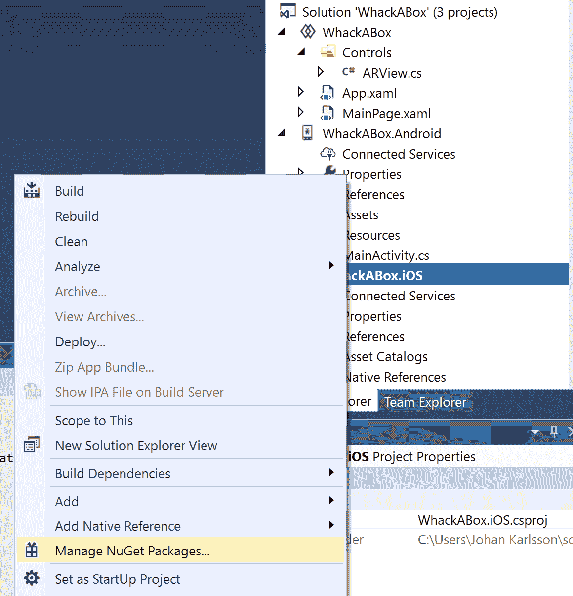

1.  这将打开 NuGet 包管理器。点击窗口左上角的“浏览”链接。

1.  在搜索框中输入`UrhoSharp`，然后按*Enter*。

1.  选择 UrhoSharp 包，并在窗口右侧点击“安装”，如下截图所示：

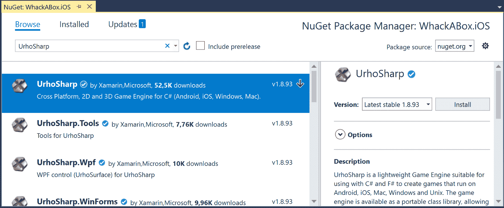

这就是 iOS 的全部内容。Android 设置起来有点棘手，因为它需要一个特殊的 UrhoSharp 包和一些代码来连接一切。

# 为 Android 安装 UrhoSharp.ARCore Nuget 包

对于 Android，我们将添加 UrhoSharp.ARCore 包，其中包含 ARCore 的扩展。它依赖于 UrhoSharp，因此我们不必专门添加该包。您可以按照以下方式添加 UrhoSharp.ARCore 包：

1.  右键单击`WhackABox.Android`项目。

1.  单击“管理 NuGet 包...”，如下截图所示：


1.  这将打开 NuGet 包管理器。单击窗口左上角的“浏览”链接。

1.  在搜索框中输入`UrhoSharp.ARCore`，然后按*Enter*。

1.  选择 UrhoSharp.ARCore 包，然后单击窗口右侧的“安装”，如下截图所示：


这就是全部——您的项目中所有对 UrhoSharp 的依赖项都已安装。现在我们必须连接一些生命周期事件。

# 添加 Android 生命周期事件

在 Android 中，`Urho`需要知道一些特定事件，并能够相应地做出响应。我们还需要使用`MessagingCenter`添加内部消息，以便稍后在应用程序中对`OnResume`事件做出反应。在初始化 ARCore 时我们将会做到这一点。但现在，按照以下方式添加 Android 事件的五个必需重写：

1.  在 Android 项目中，打开`MainActivity.cs`。

1.  在`MainActivity`类的任何位置添加以下代码中的五个重写。

1.  通过为`Urho.Droid`和`Xamarin.Forms`添加`using`语句来解决未解析的引用，如下所示：

```cs
protected override void OnResume()
{
    base.OnResume();
    UrhoSurface.OnResume();

    MessagingCenter.Send(this, "OnResume");
}

protected override void OnPause()
{
    UrhoSurface.OnPause();
    base.OnPause();
}

protected override void OnDestroy()
{
    UrhoSurface.OnDestroy();
    base.OnDestroy();
}

public override void OnBackPressed()
{
    UrhoSurface.OnDestroy();
    Finish();
}

public override void OnLowMemory()
{
    UrhoSurface.OnLowMemory();
    base.OnLowMemory();
} 
```

这些事件一一映射到内部的 UrhoSharp 事件，除了`OnBackPressed`，它调用`UrhoSharp.OnDestroy()`。这样做是为了内存管理，以便 UrhoSharp 知道何时清理。

`MessagingCenter`库是一个内置的 Xamarin.Forms 发布-订阅库，用于在应用程序中传递内部消息。它依赖于 Xamarin.Forms。我们创建了一个名为`TinyPubSub`的自己的库，它打破了这种依赖关系，并且具有稍微更容易的 API（以及一些附加功能）。您可以在 GitHub 上查看它：[`github.com/TinyStuff/TinyPubSub`](https://github.com/TinyStuff/TinyPubSub)。

# 定义 PlaneNode

在`Urho`中，您将使用包含节点树的场景。节点可以是游戏中的几乎任何东西，比如渲染器、声音播放器，或者只是子节点的占位符。

正如我们在讨论 AR 基础知识时所说的，平面是在平台之间共享的常见实体。我们需要创建一个代表平面的共同基础，这可以通过扩展`Urho`节点来实现。位置和旋转将由节点本身跟踪，但我们需要添加一个属性来跟踪平面的原点和大小，由 ARKit 和 ARCore 表示为平面的范围。

我们现在将添加这个类，并在每个平台上实现 AR 相关代码时使用它。这样做的代码很简单，可以通过以下步骤设置：

1.  在`WhackABox`项目中，在项目的根目录创建一个名为`PlaneNode.cs`的新文件。

1.  添加以下类的实现：

```cs
using Urho;

namespace WhackABox
{
    public class PlaneNode :Node
    {
        public string PlaneId { get; set; }
        public float ExtentX { get; set; }
        public float ExtentZ { get; set; }
    }
} 
```

`PlaneId`将是一个标识符，允许我们跟踪此节点代表的特定于平台的平面。在 iOS 中，这将是一个字符串，而在 Android 中，它将是转换为字符串的平面对象的哈希码。`ExtentY`和`ExtentZ`属性表示平面的大小（以米为单位）。我们现在准备开始创建游戏逻辑，并将我们的应用程序连接到 AR SDK。

# 为 ARView 控件添加自定义渲染器

自定义渲染器是将特定于平台的行为扩展到自定义控件的一种非常聪明的方式。它们还可以用于覆盖已定义的控件上的行为。事实上，Xamarin.Forms 中的所有控件都使用渲染器将 Xamarin.Forms 控件转换为特定于平台的控件。

我们将创建两个渲染器，一个用于 iOS，一个用于 Android，它们将初始化我们将要渲染的`UrhoSurface`。`UrhoSurface`的实例化在每个平台上都有所不同，这就是为什么我们需要两种不同的实现。

# 对于 iOS

自定义渲染器是从另一个渲染器继承的类。它允许我们为重要事件添加自定义代码，例如在解析 XAML 文件时创建 XAML 元素时。由于`ARView`控件继承自`View`，我们将使用`ViewRenderer`作为基类。通过以下步骤创建`ARViewRenderer`：

1.  在 iOS 项目中，创建一个名为`Renderers`的文件夹。

1.  在该文件夹中添加一个名为`ARViewRenderer`的新类。

1.  将以下代码添加到类中：

```cs
using System.Threading.Tasks;
using Urho.iOS;
using WhackABox.Controls;
using WhackABox.iOS.Renderers;using Xamarin.Forms;
using Xamarin.Forms.Platform.iOS;

 [assembly: ExportRenderer(typeof(ARView), typeof(ARViewRenderer))]

 namespace WhackABox.iOS.Renderers
{
    public class ARViewRenderer : ViewRenderer<ARView, UrhoSurface>
    {
          protected async override void 
          OnElementChanged(ElementChangedEventArgs<ARView> e)
        {
            base.OnElementChanged(e);

            if (Control == null)
            {
                await Initialize();
            }
         }

         private async Task Initialize()
         {
             var surface = new UrhoSurface();
             SetNativeControl(surface);
             await surface.Show<Game>();
         }
     }
}
```

`ExportRenderer`属性将此渲染器注册到 Xamarin.Forms，以便它知道当解析（或编译）`ARView`元素时，应该使用此特定的渲染器进行渲染。它接受两个参数：第一个是我们要注册渲染器的`Control`，第二个是渲染器的类型。此属性必须放在命名空间声明之外。

`ARViewRenderer`类继承自`ViewRenderer<ARView, UrhoSurface>`。这指定了此渲染器为哪个控件创建，以及它应该渲染哪个本地控件。在这种情况下，`ARView`将被一个`UrhoSurface`控件本地替换，这本身是一个 iOS 特定的`UIView`。

我们重写`OnElementChanged()`方法，该方法在`ARView`元素每次更改时被调用，无论是创建还是替换。然后我们可以检查`Control`属性是否已设置。控件是`UrhoSurface`类型，因为我们在类定义中声明了它。如果它是`null`，那么我们就调用`Initialize()`来创建它。

创建非常简单。我们只需创建一个新的`UrhoSurface`控件，并将本地控件设置为这个新创建的对象。然后我们调用`Show<Game>()`方法来启动游戏，指定代表我们的`Urho`游戏的类。请注意，`Game`类尚未定义，但它将很快定义，就在我们为 Android 创建自定义渲染器之后。

# 对于 Android

Android 的自定义渲染器与 iOS 的自定义渲染器做的事情相同，但还需要检查权限。通过以下步骤创建 Android 的`ARViewRenderer`：

1.  在 Android 项目中，创建一个名为`Renderers`的文件夹。

1.  在该文件夹中添加一个名为`ARViewRenderer`的新类。

1.  将以下代码添加到类中：

```cs
 using System.Threading.Tasks;
 using Android;
 using Android.App;
 using Android.Content;
 using Android.Content.PM;
 using Android.Support.V4.App;
 using Android.Support.V4.Content;
 using WhackABox.Droid.Renderers;
 using WhackABox;
 using WhackABox.Controls;
 using WhackABox.Droid;
 using Urho.Droid;
 using Xamarin.Forms;
 using Xamarin.Forms.Platform.Android;

  [assembly: ExportRenderer(typeof(ARView), 
  typeof(ARViewRenderer))]
  namespace WhackABox.Droid.Renderers
 {
     public class ARViewRenderer : ViewRenderer<ARView,  
     Android.Views.View>
     {
         private UrhoSurfacePlaceholder surface;
         public ARViewRenderer(Context context) : base(context)
         {
             MessagingCenter.Subscribe<MainActivity>(this,  
             "OnResume", async (sender) =>
             {
                 await Initialize();
             });
         }

         protected async override void 
         OnElementChanged(ElementChangedEventArgs<ARView> e)
         {
             base.OnElementChanged(e);

             if (Control == null)
             {
                 await Initialize();
             }
         }

         private async Task Initialize()
         {
             if (ContextCompat.CheckSelfPermission(Context, 
                 Manifest.Permission.Camera) != Permission.Granted)
             {
                 ActivityCompat.RequestPermissions(Context as  
                 Activity, new[] { Manifest.Permission.Camera },  
                 42);
                 return;
             }

             if (surface != null)
                 return;

             surface = UrhoSurface.CreateSurface(Context as 
             Activity);
             SetNativeControl(surface);

             await surface.Show<Game>();
         }
     }
 }

```

这个自定义渲染器也继承自`ViewRenderer<T1, T2>`，其中第一个类型是渲染器本身的类型，第二个是渲染器将生成的本地控件的类型。在这种情况下，本地控件将是一个继承自`Android.Views.View`的控件。渲染器创建一个`UrhoSurfacePlaceholder`实例，并将其分配为本地控件。`UrhoSurfacePlaceholder`是一个包装`Urho`在 Android 上使用的**Simple DirectMedia Layer**（**SDL**）库的一些功能的类，用于访问媒体功能。它的最后一步是基于即将存在的`Game`类启动游戏。我们将在本章的下一部分中定义这个类。

# 创建游戏

要编写一个使用`Urho`的应用程序，我们需要创建一个从`Urho.Application`继承的类。这个类定义了一些虚拟方法，我们可以用来设置场景。我们将使用的方法是`Start()`。然而，在那之前，我们需要创建这个类。这个类将被分成三个文件，使用部分类来描述，如下列表所述：

+   `Game.cs`文件中将包含跨平台的代码

+   `Game.iOS.cs`文件中将包含仅在应用的 iOS 版本中编译的代码

+   `Game.Android.cs`文件中将包含仅在应用的 Android 版本中编译的代码

我们将使用条件编译来实现。我们在项目介绍中讨论了条件编译。简单来说，这意味着我们可以使用称为**预处理指令**的东西来确定在编译时是否应该包含代码。实际上，这意味着我们将通过在`Game.iOS.cs`和`Game.Android.cs`中定义相同的`InitializeAR()`方法来在 Android 和 iOS 中编译不同的代码。在初始化期间，我们将调用此方法，并且根据我们在其上运行的平台，它将以不同的方式实现。这只能通过共享项目完成。

Visual Studio 对条件编译有很好的支持，并且将根据您设置为启动项目的项目或您在代码文件本身上方的工具栏中选择的项目来解析正确的引用。

对于这个项目，我们可以将`Game.iOS.cs`文件移动到 iOS 项目中，将`Game.Android.cs`文件移动到 Android 项目中，并删除条件编译预处理语句。应用程序将编译正常，但为了学习如何工作，我们将把它们包含在共享项目中。这也可能是一个积极的事情，因为我们将相关代码聚集在一起，使架构更容易理解。

# 添加共享的部分 Game 类

我们首先创建包含共享代码的`Game.cs`文件。让我们通过以下步骤设置这个：

1.  在`WhackABox`项目中，在项目的根目录下创建一个名为`Game.cs`的新文件。

1.  将以下代码添加到类中：

```cs
using System;
using System.Linq;
using Urho;
using Urho.Shapes;

namespace WhackABox
{
    public partial class Game : Application
    {
        private Scene scene; 

        public Game(ApplicationOptions options) : base(options)
        {
        } 
    }
}
```

首先要注意的是类中的`partial`关键字。这告诉编译器这不是整个实现，还会在其他文件中存在更多的代码。那些文件中的代码将被视为在这个文件中; 这是将大型实现拆分成不同文件的好方法。

`Game`继承自`Urho.Application`，它将处理关于游戏本身的大部分工作。我们定义了一个名为`scene`的`Scene`类型的属性。在`Urho`中，`Scene`代表游戏的一个屏幕（例如，我们可以为游戏的不同部分或菜单定义不同的场景）。在这个游戏中，我们只会定义一个场景，稍后将对其进行初始化。一个`scene`维护了组成它的节点的层次结构，每个节点可以有任意数量的子节点和任意数量的组件。它是组件在工作。例如，稍后我们将渲染盒子，这将由一个附加了`Box`组件的节点表示。

`Game`类本身是从我们在前面部分定义的自定义渲染器中实例化的，并且它在构造函数中以`ApplicationOptions`实例作为参数。这需要传递给基类。现在我们需要编写一些将是 AR 特定的并且将在以后编写的代码中使用的方法。

# CreateSubPlane

第一个方法是`CreateSubPlane()`方法。当应用程序找到可以放置对象的平面时，它将创建一个节点。我们很快将为每个平台编写该代码。该节点还定义了一个子平面，将定位一个代表该平面位置和大小的盒子。我们已经在本章前面定义了`PlaneNode`类。

让我们通过以下步骤添加代码：

1.  在`WhackABox`项目中，打开`Game.cs`类。

1.  将以下`CreateSubPlane()`方法添加到类中：

```cs
private void CreateSubPlane(PlaneNode planeNode)
{
    var node = planeNode.CreateChild("subplane");
    node.Position = new Vector3(0, 0.05f, 0);

    var box = node.CreateComponent<Box>();
    box.Color = Color.FromHex("#22ff0000");
} 
```

任何从**`Urho.Node`**继承的类，比如`PlaneNode`，都有`CreateChild()`方法。这允许我们创建一个子节点并为该节点指定一个名称。稍后将使用该名称来查找特定的子节点执行操作。我们将节点定位在与父节点相同的位置，只是将其提高`0.05`米（5 厘米）以上平面。

为了看到平面，我们添加了一个半透明红色的`box`组件。`box`是通过在我们的节点上调用`CreateComponent()`创建的组件。颜色以 AARRGGBB 模式定义，其中 AA 是 alpha 分量（透明度），RRGGBB 是标准的红绿蓝格式。我们使用颜色的十六进制表示。

# UpdateSubPlane

ARKit 和 ARCore 都会持续更新平面。我们感兴趣的是子平面位置和其范围的变化。通过扩展，我们指的是平面的大小。让我们通过以下步骤来设置这个：

1.  在`WhackABox`项目中，打开`Game.cs`类。

1.  在`Game.cs`类的任何位置添加`UpdateSubPlane()`方法，如下面的代码所示：

```cs
private void UpdateSubPlane(PlaneNode planeNode, Vector3 position)
{
    var subPlaneNode = planeNode.GetChild("subplane");
    subPlaneNode.Scale = new Vector3(planeNode.ExtentX, 0.05f, 
    planeNode.ExtentZ);
    subPlaneNode.Position = position;
}
```

该方法接受我们想要更新的`PlaneNode`以及一个新的位置。我们通过查询当前节点中名为`"subplane"`的任何节点来定位子平面。请记住，我们在`AddSubPlane()`方法中命名了子平面。现在我们可以很容易地通过名称访问节点。我们通过从`PlaneNode`中获取`ExtentX`和`ExtentZ`属性来更新子平面节点的比例。在调用`UpdateSubPlane()`之前，平面节点将通过一些特定于平台的代码进行更新。最后，我们将子平面的位置设置为传递的`position`参数。

# FindNodeByPlaneId

我们需要一个快速找到节点的方法。ARKit 和 ARCore 都会持续更新平面。我们感兴趣的是子平面位置和其范围的变化。通过扩展，我们指的是平面的大小。让我们通过以下步骤来设置这个：

`PlaneNode`是一个`string`，因为 ARKit 以类似**全局唯一标识符**（**GUID**）的形式定义了平面 ID。GUID 是一系列十六进制数字的结构化序列，可以以`string`格式表示，如下面的代码所示：

```cs
private PlaneNode FindNodeByPlaneId(string planeId) =>
                    scene.Children.OfType<PlaneNode>()
                    .FirstOrDefault(e => e.PlaneId == planeId); 
```

该方法使用`Linq`查询场景，并查找具有给定平面 ID 的第一个子节点。如果找不到，则返回`null`，因为`null`是引用类型对象的默认值。

这些都是我们在共享代码中下降到 ARKit 和 ARCore 之前需要的所有方法。

# 添加特定于平台的部分类

现在是利用条件编译的时候了。我们将创建两个部分类，一个用于 iOS，一个用于 Android，它们将有条件地编译到`Game`类中。

在这一部分，我们将简单地为这些文件设置骨架代码。

# 添加特定于 iOS 的部分类

让我们从在 iOS 上创建`Game`的`partial`类开始，并将整个代码文件包装在一个预处理指令中，指定这段代码只会在 iOS 上编译：

1.  在`WhackABox`项目中，添加一个名为`Game.iOS.cs`的新文件。

1.  如果 Visual Studio 没有自动完成，可以在代码中重命名`Game`类。

1.  使类`public`和`partial`。

1.  添加`#if`和`#endif`预处理指令，以允许条件编译，如下面的代码所示：

```cs
#if __IOS__ 
namespace WhackABox
{
    public partial class Game
    {
    }
}
#endif
```

代码的第一行是一个预处理指令，编译器将使用它来确定`#if`和`#endif`指令内的代码是否应该包含在编译中。如果包含，将定义一个`partial`类。这个类中的代码可以是特定于 iOS 的，即使我们在共享项目中定义它。Visual Studio 足够智能，可以将这个部分中的任何代码视为直接存在于 iOS 项目中。在这里实例化`UIView`不会有问题，因为该代码永远不会被编译到除 iOS 之外的任何平台。

# 添加特定于 Android 的部分类

同样适用于 Android：只有文件名和预处理指令会改变。让我们通过以下步骤来设置这个：

1.  在`WhackABox`项目中，添加一个名为`Game.Android.cs`的新文件。

1.  如果 Visual Studio 没有自动完成，就在代码中重命名`Game`类。

1.  使类`public`和`partial`。

1.  添加`#if`和`#endif`条件编译语句，如下面的代码所示：

```cs
#if __ANDROID__namespace WhackABox
{
    public partial class Game
    { 
    }
}
#endif
```

与 iOS 一样，只有在`#if`和`#endif`语句之间才会编译 Android 的代码。

现在让我们开始添加一些特定于平台的代码。

# 编写 ARKit 特定的代码

在本节中，我们将为 iOS 编写特定于平台的代码，该代码将初始化 ARKit，查找平面，并创建节点以供 UrhoSharp 在屏幕上渲染。我们将利用一个在 iOS 中包装 ARKit 的`Urho`组件。我们还将编写所有将定位、添加和移除节点的函数。ARKit 使用`anchors`，它们充当将叠加的图形粘合到现实世界的虚拟点。我们特别寻找`ARPlaneAnchor`，它代表 AR 世界中的平面。还有其他类型的锚点可用，但对于这个应用程序，我们只需要找到水平平面。

让我们首先定义`ARKitComponent`，以便以后可以使用它。

# 定义 ARKitComponent

我们首先添加一个将在稍后初始化的`ARKitComponent`的`private`字段。让我们通过以下步骤设置这一点：

1.  在`WhackABox`项目中，打开`Game.iOS.cs`。

1.  添加一个持有`ARKitComponent`的`private`字段，如下面的代码中所示：

```cs
#if __IOS__using System;
using System.Collections.Generic;
using System.Text;
using System.Linq;
using ARKit;
using Urho;
using Urho.iOS;

namespace WhackABox
{
    public partial class Game
    {
        private ARKitComponent arkitComponent;
    }
}
#endif
```

确保添加所有`using`语句，以确保我们后来使用的所有代码都解析正确的类型。

# 编写用于添加和更新锚点的处理程序

现在我们将添加必要的代码，以添加和更新锚点。我们还将添加一些方法来帮助设置节点在 ARKit 更新锚点后的方向。

# SetPositionAndRotation

`SetPositionAndRotation()`方法将被添加和更新锚点使用，因此我们需要在创建由 ARKit 引发的事件处理程序之前定义它。让我们通过以下步骤设置这一点：

1.  在`WhackABox`项目中，打开`Game.iOS.cs`文件。

1.  按照下面的代码，在类中添加`SetPositionAndRotation()`方法：

```cs
private void SetPositionAndRotation(ARPlaneAnchor anchor, PlaneNode 
                                    node)
{
     arkitComponent.ApplyOpenTkTransform(node, anchor.Transform, 
                                         true);

     node.ExtentX = anchor.Extent.X;
     node.ExtentZ = anchor.Extent.Z;

     var position = new Vector3(anchor.Center.X, anchor.Center.Y, -
                                anchor.Center.Z);
     UpdateSubPlane(node, position);
} 
```

该方法接受两个参数。第一个是由 ARKit 定义的`ARPlaneAnchor`，第二个是我们在场景中拥有的`PlaneNode`。该方法的目的是确保`PlaneNode`与 ARKit 传递的`ARPlaneAnchor`对象同步。`arkitComponent`有一个名为`ApplyOpenTkTransform()`的辅助方法，将`ARPlaneAnchor`对象的位置和旋转转换为`Urho`使用的位置和旋转对象。然后我们更新平面的`Extent`（大小）到`PlaneNode`，并从`ARPlaneAnchor`获取`anchor`中心位置。最后，我们调用之前定义的方法来更新持有`Box`组件的子平面节点，该组件将实际将平面渲染为半透明红色框。

我们需要一个处理更新和添加功能的方法。

# 更新或添加平面节点

`UpdateOrAddPlaneNode()`正如其名称所示：它以`ARPlaneAnchor`作为参数，要么更新要么添加一个新的`PlaneNode`到`scene`。让我们通过以下步骤设置这一点：

1.  在`WhackABox`项目中，打开`Game.iOS.cs`文件。

1.  按照下面的代码描述，添加`UpdateOrAddPlaneNode()`方法：

```cs
private void UpdateOrAddPlaneNode(ARPlaneAnchor anchor)
{
    var node = FindNodeByPlaneId(anchor.Identifier.ToString());

    if (node == null)
    {
        node = new PlaneNode()
        {
            PlaneId = anchor.Identifier.ToString(),
            Name = $"plane{anchor.GetHashCode()}"
        };

        CreateSubPlane(node);
        scene.AddChild(node);
    }

    SetPositionAndRotation(anchor, node);
} 
```

一个节点要么已经存在于场景中，要么需要被添加。代码的第一行调用`FindNodeByPlaneId()`来查询具有给定`PlaneId`的对象。对于 iOS，我们使用`anchor.Identifier`属性来跟踪 iOS 定义的平面。如果这个调用返回`null`，这意味着该平面不在场景中，我们需要创建它。为此，我们实例化一个新的`PlaneNode`，给它一个`PlaneId`和一个用于调试目的的用户友好的名称。然后我们通过调用`CreateSubPlane()`来创建子平面来可视化平面本身，我们之前定义过，并将节点添加到`scene`中。最后，我们更新位置和旋转。对于每次调用`UpdateOrAddPlaneNode()`方法，我们都这样做，因为对于新节点和现有节点来说都是一样的。现在是时候编写我们最终将直接连接到 ARKit 的处理程序了。

# OnAddAnchor

让我们添加一些代码。`OnAddAnchor()`方法将在每次 ARKit 更新描述我们在虚拟世界中使用的点的锚点集合时被调用。我们特别寻找`ARPlaneAnchor`类型的锚点。

通过以下两个步骤在`Game.iOS.cs`类中添加`OnAddAnchor()`方法：

1.  在`WhackABox`项目中，打开`Game.iOS.cs`文件。

1.  在类中的任何地方添加`OnAddAnchor()`方法，如下面的代码所示：

```cs
private void OnAddAnchor(ARAnchor[] anchors)
{
    foreach (var anchor in anchors.OfType<ARPlaneAnchor>())
    {
        UpdateOrAddPlaneNode(anchor);
    }
}
```

该方法以`ARAnchors`数组作为参数。我们过滤出`ARPlaneAnchor`类型的锚点，并遍历列表。对于每个`ARPlaneAnchor`，我们调用之前创建的`UpdateOrAddPlaneNode()`方法来向场景中添加一个节点。现在让我们为 ARKit 想要更新锚点时做同样的事情。

# OnUpdateAnchors

每当 ARKit 接收到关于锚点的新信息时，它将调用此方法。我们与之前的代码一样，遍历列表以更新场景中`anchor`的范围和位置：

1.  在`WhackABox`项目中，打开`Game.iOS.cs`文件。

1.  在类中的任何地方添加`OnUpdateAnchors()`方法，如下面的代码所示：

```cs
private void OnUpdateAnchors(ARAnchor[] anchors)
{
    foreach (var anchor in anchors.OfType<ARPlaneAnchor>())
    {
        UpdateOrAddPlaneNode(anchor);
    }
}
```

该代码是`OnAddAnchors()`方法的副本。它根据 ARKit 提供的信息更新场景中的所有节点。

我们还需要编写一些代码来移除 ARKit 已经移除的锚点。

# 编写一个处理移除锚点的处理程序

当 ARKit 决定一个锚点无效时，它将从场景中移除它。这种情况并不经常发生，但处理这个调用是一个好习惯。

# OnRemoveAnchors

让我们通过以下步骤添加一个处理移除`ARPlaneAnchor`的方法：

1.  在`WhackABox`项目中，打开`Game.iOS.cs`文件。

1.  在类中的任何地方添加`OnRemoveAnchors()`方法，如下面的代码所示：

```cs
private void OnRemoveAnchors(ARAnchor[] anchors)
{
    foreach (var anchor in anchors.OfType<ARPlaneAnchor>())
    {
        FindNodeByPlaneId(anchor.Identifier.ToString())?.Remove();
    }
} 
```

与`Add`和`Remove`函数一样，这个方法接受一个`ARAnchor`数组。我们遍历这个数组，寻找`ARPlaneAnchor`类型的锚点。然后我们调用`FindNodeByPlaneId()`方法寻找表示这个平面的节点。如果不是`null`，那么我们调用移除该节点。请注意在`Remove()`调用之前的空值检查运算符。

# 初始化 ARKit

现在我们来到了 iOS 特定代码的最后部分，这是我们初始化 ARKit 的地方。这个方法叫做`InitializeAR()`，不需要参数。它与 Android 的方法相同，但由于它们永远不会同时编译，因为使用了条件编译，调用这个方法的代码将不会知道区别。

初始化 ARKit 的代码很简单，`ARKitComponent`为我们做了很多工作。让我们通过以下步骤设置它：

1.  在`WhackABox`项目中，打开`Game.iOS.cs`文件。

1.  在类中的任何地方添加`InitializeAR()`方法，如下面的代码所示：

```cs
private void InitializeAR()
{
    arkitComponent = scene.CreateComponent<ARKitComponent>();
    arkitComponent.Orientation = 
    UIKit.UIInterfaceOrientation.Portrait;
    arkitComponent.ARConfiguration = new 
    ARWorldTrackingConfiguration
    {
        PlaneDetection = ARPlaneDetection.Horizontal
    };
    arkitComponent.DidAddAnchors += OnAddAnchor;
    arkitComponent.DidUpdateAnchors += OnUpdateAnchors;
    arkitComponent.DidRemoveAnchors += OnRemoveAnchors;
    arkitComponent.RunEngineFramesInARKitCallbakcs = 
    Options.DelayedStart;
    arkitComponent.Run();
} 
```

代码首先创建了一个`ARKitComponent`。然后我们设置了允许的方向，并创建了一个`ARWorldTrackingConfiguration`类，说明我们只对水平平面感兴趣。为了响应平面的添加、更新和移除，我们附加了之前创建的事件处理程序。

我们指示 ARKit 组件延迟调用回调函数，以便 ARKit 能够正确初始化。请注意`RunEngineFramesInARKitCallbakcs`属性中的拼写错误。这是一个很好的例子，说明为什么需要对代码进行审查，因为更改这个名称将很难保持向后兼容。命名是困难的。

最后一件事是告诉 ARKit 开始运行。我们通过调用`arkitComponent.Run()`方法来实现这一点。

# 编写特定于 ARCore 的代码

现在是时候为 Android 与 ARCore 做同样的事情了。就像 iOS 一样，我们将把所有特定于 Android 的代码放在自己的文件中。这个文件就是我们之前创建的`Game.Android.cs`。

# 定义 ARCoreComponent

首先，我们将添加一个字段，用于存储对`ARCoreComponent`的引用。这个组件包装了与 ARCore 的大部分交互。`ARCoreComponent`定义在我们在本章开头安装的 UrhoSharp.ARCore NuGet 包中。

通过以下步骤添加一些`using`语句和字段：

1.  在`WhackABox`项目中，打开`Game.Android.cs`文件。

1.  按照以下代码描述添加`arCore`私有字段。同时确保添加了粗体标记的`using`语句：

```cs
#if __ANDROID__
using Com.Google.AR.Core;
using Urho;
using Urho.Droid;

namespace WhackABox
{
    public partial class Game
    {
        private ARCoreComponent arCore;
    }
}
#endif

```

`using`语句将允许我们在这个文件中解析所需的类型，而`arCore`属性将是我们在访问 ARCore 函数时的简写。

我们将继续向这个类添加一些方法。

# SetPositionAndRotation

每当检测到或更新平面时，我们需要添加或更新一个`PlaneNode`。`SetPositionAndRotation()`方法会更新传递的`PlaneNode`，并根据`AR.Core.Plane`对象的内容设置该节点的属性。让我们通过以下步骤来设置这一点：

1.  在`WhackABox`项目中，打开`Game.Android.cs`文件。

1.  按照以下代码在类中添加`SetPositionAndRotation()`方法：

```cs
private void SetPositionAndRotation(Com.Google.AR.Core.Plane plane,  
                                    PlaneNode node)
{
    node.ExtentX = plane.ExtentX;
    node.ExtentZ = plane.ExtentZ;
    node.Rotation = new Quaternion(plane.CenterPose.Qx(),
                                   plane.CenterPose.Qy(),
                                   plane.CenterPose.Qz(),
                                   -plane.CenterPose.Qw());

    node.Position = new Vector3(plane.CenterPose.Tx(),
                                plane.CenterPose.Ty(),
                                -plane.CenterPose.Tz());
}
```

前面的代码更新了节点的平面范围并创建了一个旋转`Quaternion`。如果你不知道`Quaternion`是什么，不要担心，很少有人知道，但它们似乎以一种非常灵活的方式神奇地保存了模型的旋转信息。`plane.CenterPose`属性是一个包含平面位置和方向的矩阵。最后，我们根据`CenterPose`属性更新节点的位置。

下一步是创建一个处理来自 ARCore 的帧更新的方法。

# 编写 ARFrame 更新的处理程序

Android 处理来自 ARCore 的更新与 ARKit 有些不同，后者暴露了三种不同的事件，用于添加、更新和移除节点。当使用 ARCore 时，我们会在任何更改发生时被调用，而将处理这些更改的处理程序将是我们即将添加的处理程序。

通过以下步骤添加该方法：

1.  在`WhackABox`项目中，打开`Game.Android.cs`文件。

1.  按照以下代码在类中的任何位置添加`OnARFrameUpdated()`方法：

```cs
private void OnARFrameUpdated(Frame arFrame)
{
    var all = arCore.Session.GetAllTrackables(
                  Java.Lang.Class.FromType(
                  typeof(Com.Google.AR.Core.Plane)));

    foreach (Com.Google.AR.Core.Plane plane in all)
    {
        var node = 
        FindNodeByPlaneId(plane.GetHashCode().ToString());

        if (node == null)
        {
            node = new PlaneNode
            {
                PlaneId = plane.GetHashCode().ToString(),
                Name = $"plane{plane.GetHashCode()}"
            };

            CreateSubPlane(node);
            scene.AddChild(node);
        }

        SetPositionAndRotation(plane, node);
        UpdateSubPlane(node, Vector3.Zero);
    }
} 
```

我们首先查询`arCore`组件跟踪的所有平面。然后我们遍历这个列表，通过调用`FindNodeByPlaneId()`方法，使用平面的哈希码作为标识符，来查看我们在场景中是否有任何节点。如果找不到任何节点，我们就创建一个新的`PlaneNode`，并将哈希码分配为`PlaneId`。然后我们创建一个包含`Box`组件以可视化平面的子平面，最后将其添加到场景中。然后我们更新平面的位置和旋转，并调用更新子平面。现在我们已经编写了处理程序，需要将其连接起来。

# 初始化 ARCore

为了初始化 ARCore，我们将添加两种方法。第一种是一个方法，负责 ARCore 的配置，称为“OnConfigRequested（）”。第二种是将从共享的`Game`类中稍后调用的“InitializeAR（）”方法。这个方法也在 iOS 特定的代码中定义，但是正如我们之前讨论的，当我们为 Android 编译时，这个方法在 iOS 中永远不会被编译，因为我们使用条件编译，它会过滤掉未选择平台的代码。

# OnConfigRequested

ARCore 需要知道一些东西，就像 iOS 一样。在 Android 中，这是通过定义一个 ARCore 组件在初始化时调用的方法来完成的。要创建该方法，请按照以下步骤进行：

1.  在`WhackABox`项目中，打开`Game.Android.cs`文件。

1.  在类中的任何位置添加“OnConfigRequested（）”方法，如下面的代码所示：

```cs
private void OnConfigRequested(Config config)
{
    config.SetPlaneFindingMode(Config.PlaneFindingMode.Horizontal);
    config.SetLightEstimationMode

    (Config.LightEstimationMode.AmbientIntensity);
    config.SetUpdateMode(Config.UpdateMode.LatestCameraImage);
} 
```

该方法接受一个`Config`对象，该对象将存储您在此方法中进行的任何配置。首先，我们设置要查找的平面类型。对于这个游戏，我们对“水平”平面感兴趣。我们定义要使用的光估计模式的类型，最后，我们选择要使用的更新模式。在这种情况下，我们要使用最新的相机图像。您可以在配置期间进行很多微调，但这超出了本书的范围。一定要查看 ARCore 的文档，了解更多关于它强大功能的信息。

现在我们已经有了初始化 ARCore 所需的所有代码。

# InitializeAR

如前所述，“InitializeAR（）”方法与 iOS 特定的代码共享相同的名称，但由于使用条件编译，编译器只会在构建中包含其中一个。让我们按照以下步骤设置这个：

1.  在`WhackABox`项目中，打开`Game.Android.cs`文件。

1.  在类中的任何位置添加“InitializeAR（）”方法，如下面的代码所示：

```cs
private void InitializeAR()
{
    arCore = scene.CreateComponent<ARCoreComponent>();
    arCore.ARFrameUpdated += OnARFrameUpdated;
    arCore.ConfigRequested += OnConfigRequested;
    arCore.Run();
} 
```

第一步是创建 UrhoSharp 提供的`ARCoreComponent`。这个组件包装了本地 ARCore 类的初始化。然后我们添加两个事件处理程序：一个用于处理帧更新，一个在初始化期间调用。我们做的最后一件事是在`ARCoreComponent`上调用“Run（）”方法，以开始跟踪世界。

现在我们已经配置好了 ARKit 和 ARCore，准备开始编写实际的游戏了。

# 编写游戏

在这一部分，我们将通过设置相机、灯光和渲染器来初始化 Urho。相机是确定对象渲染位置的对象。AR 组件负责更新相机的位置，以虚拟跟踪您的手机，以便我们渲染的任何对象都在与您所看到的相同的坐标空间中。首先，我们需要一个相机，它将是场景的观察点。

# 添加相机

添加相机是一个简单的过程，如下面的步骤所示：

1.  在`WhackABox`项目中，打开`Game.cs`文件。

1.  在类中添加“相机”属性，如下面的代码所示。您应该将其放在类本身的声明之后，但在类内的任何位置放置它都可以。

1.  在类中的任何位置添加“InitializeCamera（）”方法，如下面的代码所示：

```cs
private Camera camera; 

private void InitializeCamera()
{
    var cameraNode = scene.CreateChild("Camera");
    camera = cameraNode.CreateComponent<Camera>();
} 
```

在 UrhoSharp 中，一切都是一个节点，就像在 Unity 中一切都是一个 GameObject，包括“相机”。我们创建一个新节点，称为“相机”，然后在该节点上创建一个“相机”组件，并保留对它的引用以供以后使用。

# 配置渲染器

UrhoSharp 需要将场景渲染到一个“视口”中。一个游戏可以有多个视口，基于多个摄像头。想象一下你开车的游戏。主要的“视口”将是驾驶员视角的游戏。另一个“视口”可能是后视镜，实际上它们本身就是摄像头，将它们所看到的渲染到主“视口”上。让我们按照以下步骤设置这个：

1.  在`WhackABox`项目中，打开`Game.cs`文件。

1.  添加`viewport`属性到类中，如下面的代码所示。您应该将其放在类本身的声明之后，但在类内的任何位置放置它都可以。

1.  在类中的任何位置添加`InitializeRenderer()`方法，如下面的代码所示：

```cs
private Viewport viewport; 

private void InitializeRenderer()
{
    viewport = new Viewport(Context, scene, camera, null);
    Renderer.SetViewport(0, viewport);
}
```

`viewport`属性将保存对`viewport`的引用，以备后用。`viewport`是通过实例化一个新的`viewport`类来创建的。该类的构造函数需要基类提供的`Context`，在初始化游戏时我们将创建的`scene`，一个相机以知道从空间的哪个点进行渲染，以及一个渲染路径，默认为`null`。渲染路径允许在渲染时对帧进行后处理。这也超出了本书的范围，但也值得一看。

现在，让光明存在。

# 添加光

为了使对象可见，我们需要定义一些光照。我们通过创建一个定义游戏中我们想要的光照类型的方法来实现这一点。让我们通过以下步骤来设置这一点：

1.  在`WhackABox`项目中，打开`Game.cs`文件。

1.  在类中的任何位置添加`InitializeLights()`方法，如下面的代码所示：

```cs
private void InitializeLights()
{
    var lightNode = camera.Node.CreateChild();
    lightNode.SetDirection(new Vector3(1f, -1.0f, 1f));
    var light = lightNode.CreateComponent<Light>();
    light.Range = 10;
    light.LightType = LightType.Directional;
    light.CastShadows = true;
    Renderer.ShadowMapSize *= 4;
} 
```

同样，UrhoSharp 中的一切都是节点，光也不例外。我们通过访问存储的相机组件并访问它所属的节点，在相机节点上创建一个通用节点。然后我们设置该节点的方向并创建一个`Light`组件来定义光。光的范围将是 10 个单位的长度。类型是方向性的，这意味着它将从节点的位置沿着定义的方向发光。它还将投射阴影。我们将`ShadowMapSize`设置为默认值的四倍，以给阴影贴图更多的分辨率。

在这一点上，我们已经有了初始化 UrhoSharp 和 AR 组件所需的一切。

# 实现游戏启动

`Game`类的基类提供了一些虚拟方法，我们可以重写。其中之一是`Start()`，它将在自定义渲染器设置`UrhoSurface`后不久被调用。

通过以下步骤添加方法：

1.  在`WhackABox`项目中，打开`Game.cs`文件。

1.  在类中的任何位置添加`Start()`方法，如下面的代码所示：

```cs
protected override void Start()
{
   scene = new Scene(Context);
   var octree = scene.CreateComponent<Octree>();

    InitializeCamera();
    InitializeLights();
    InitializeRenderer();

    InitializeAR();
} 
```

我们一直在谈论的场景是在这个方法的第一行创建的。这是我们在运行 UrhoSharp 时看到的场景。它跟踪我们添加到其中的所有节点。UrhoSharp 中的所有 3D 游戏都需要一个`Octree`，这是一个实现空间分区的组件。它被 3D 引擎用来在 3D 空间中快速找到对象，而不必在每一帧中查询每一个对象。方法的第二行直接在场景上创建了这个组件。

接下来，我们有四种方法来初始化相机、灯光和渲染器，并调用两种`InitializeAR()`方法中的一种，这取决于我们正在编译的平台。如果此时启动应用程序，您应该会看到它找到平面并对其进行渲染，但没有其他操作。是时候添加一些与之交互的东西了。

# 添加框

我们现在要专注于向我们的增强现实世界添加虚拟框。我们将编写两种方法。第一个是`AddBox()`方法，它将在平面上的随机位置添加一个新框。第二个是`OnUpdate()`方法的重写，UrhoSharp 在每帧调用它来执行游戏逻辑。

# AddBox()

要向平面添加框，我们需要添加一个方法来实现。这个方法叫做`AddBox()`。让我们通过以下步骤来设置这一点：

1.  在`WhackABox`项目中，打开`Game.cs`文件。

1.  在类中添加`random`属性（最好在顶部，但在类的任何位置都可以）。

1.  在类中的任何位置添加`AddBox()`方法，如下面的代码所示：

```cs
private static Random random = new Random(); 

private void AddBox(PlaneNode planeNode)
{
    var subPlaneNode = planeNode.GetChild("subplane");

    var boxNode = planeNode.CreateChild("Box");
    boxNode.SetScale(0.1f);

    var x = planeNode.ExtentX * (float)(random.NextDouble() - 0.5f);
    var z = planeNode.ExtentZ * (float)(random.NextDouble() - 0.5f);

    boxNode.Position = new Vector3(x, 0.1f, z) +  
    subPlaneNode.Position;

    var box = boxNode.CreateComponent<Box>();
    box.Color = Color.Blue;
} 
```

我们创建的静态`random`对象将用于随机化平面上方块的位置。我们想要使用静态的`Random`实例，因为我们不想冒险创建可能以相同值进行种子化的多个实例，因此返回完全相同的随机数序列。该方法首先通过调用`planeNode.GetChild("subplane")`找到我们传入的`PlaneNode`实例的子平面。然后我们创建一个将渲染方块的节点。为了使方块适应世界，我们需要将比例设置为`0.1`，这将使其大小为 10 厘米。

然后，我们使用`ExtentX`和`ExtentZ`属性随机化方块的位置，乘以一个介于`0`和`1`之间的新随机值，我们首先从中减去`0.5`。这是为了使位置居中，因为父节点的位置是平面的中心。然后，我们将方块节点的位置设置为随机位置，并且在平面上方 0.1 个单位。我们还需要添加子平面的位置，因为它可能与父节点有一点偏移。最后，我们添加要渲染的实际方块，并将颜色设置为蓝色。

现在让我们添加代码来调用`AddBox()`方法，基于一些游戏逻辑。

# OnUpdate()

大多数游戏使用游戏循环。这会调用一个`Update()`方法，该方法接受输入并计算游戏的状态。UrhoSharp 也不例外。我们游戏的基类有一个虚拟的`OnUpdate()`方法，我们可以覆盖它，以便我们可以编写每帧都会执行的代码。这个方法经常被调用，通常大约每秒 50 次。

现在我们将覆盖`Update()`方法，添加游戏逻辑，每隔一秒添加一个新的方块。让我们通过以下步骤设置这个逻辑：

1.  在`WhackABox`项目中，打开`Game.cs`文件。

1.  将`newBoxTtl`字段和`newBoxIntervalInSeconds`字段添加到代码顶部的类中。

1.  在类中的任何位置添加`OnUpdate()`方法，如下面的代码所示：

```cs
private float newBoxTtl;
private readonly float newBoxIntervalInSeconds = 2; 

protected override void OnUpdate(float timeStep)
{
    base.OnUpdate(timeStep);

    newBoxTtl -= timeStep;

    if (newBoxTtl < 0)
    {
        foreach (var node in scene.Children.OfType<PlaneNode>())
        {
            AddBox(node);
        }

        newBoxTtl += newBoxIntervalInSeconds;
    }
} 
```

第一个字段`newBoxTtl`，其中`Ttl`是**存活时间**（**TTL**），是一个内部计数器，将减去自上一帧以来经过的毫秒数。当它低于`0`时，我们将向场景的每个平面添加一个新的方块。我们通过查询场景的`Children`集合并仅返回`PlaneNode`类型的子项来找到所有`PlaneNode`的实例。第二个字段`newBoxIntervalInSeconds`表示`newBoxTtl`达到`0`后我们将添加多少秒到`newBoxTtl`。为了知道自上一帧以来经过了多少时间，我们使用 UrhoSharp 传递给`OnUpdate()`方法的`timeStep`参数。该参数的值是自上一帧以来的秒数。通常是一个小值，如果更新循环以每秒 50 帧运行，它将是`0.016`。它可能会有所不同，这就是为什么您会想要使用这个值来进行`newBoxTtl`的减法运算。

如果现在运行游戏，您将看到方块出现在检测到的平面上。但是，我们仍然无法与它们交互，它们看起来相当无聊。让我们继续使它们旋转。

# 使方块旋转

您可以通过创建一个从`Urho.Component`继承的类来向 UrhoSharp 添加自己的组件。我们将创建一个组件，使方块围绕三个轴旋转。

# 创建旋转组件

正如我们提到的，组件是从`Urho.Component`继承的类。这个基类定义了一个名为`OnUpdate()`的虚拟方法，其行为与`Game`类本身的`Update()`方法相同。这使我们能够向组件添加逻辑，以便它可以修改它所属节点的状态。

让我们通过以下步骤创建`rotate`组件：

1.  在`WhackABox`项目中，在项目的根目录中创建一个名为`Rotator.cs`的新类。

1.  添加以下代码：

```cs
using Urho;

namespace WhackABox
{
    public class Rotator : Component
    {
        public Vector3 RotationSpeed { get; set; }

        public Rotator()
        {
            ReceiveSceneUpdates = true;
        }

        protected override void OnUpdate(float timeStep)
        {
            Node.Rotate(new Quaternion(
                RotationSpeed.X * timeStep,
                RotationSpeed.Y * timeStep,
                RotationSpeed.Z * timeStep),
                TransformSpace.Local);
        }
    }
}
```

`RotationSpeed`属性将用于确定围绕任何特定轴的旋转速度。当我们在下一步中将组件分配给箱子节点时，它将被设置。为了使组件能够在每一帧接收到对`OnUpdate()`方法的调用，我们需要将`ReceiveSceneUpdates`属性设置为`true`。如果不这样做，组件将不会在每次更新时被 UrhoSharp 调用。出于性能原因，默认情况下它被设置为`false`。

所有有趣的事情都发生在`OnUpdate()`方法的`override`中。我们创建一个新的四元数来表示新的旋转状态。同样，我们不需要详细了解这是如何工作的，只需要知道四元数属于高等数学的神秘世界。我们将`RotationSpeed`向量中的每个轴乘以`timeStep`来生成一个新值。`timeStep`参数是自上一帧以来经过的秒数。我们还将旋转定义为围绕此框的本地坐标空间。

现在组件已经创建，我们需要将它添加到箱子中。

# 分配 Rotator 组件

添加`Rotator`组件就像添加任何其他组件一样简单。让我们通过以下步骤来设置这个：

1.  在`WhackABox`项目中，打开`Game.cs`文件。

1.  更新`AddBox()`方法，通过在以下代码中加粗标记的代码来添加：

```cs
private void AddBox(PlaneNode planeNode)
{
    var subPlaneNode = planeNode.GetChild("subplane");

    var boxNode = planeNode.CreateChild("Box");
    boxNode.SetScale(0.1f);

    var x = planeNode.ExtentX * (float)(random.NextDouble() - 0.5f);
    var z = planeNode.ExtentZ * (float)(random.NextDouble() - 0.5f);

    boxNode.Position = new Vector3(x, 0.1f, z) + 
    subPlaneNode.Position;

    var box = boxNode.CreateComponent<Box>();
    box.Color = Color.Blue;

 var rotationSpeed = new Vector3(10.0f, 20.0f, 30.0f);
 var rotator = new Rotator() { RotationSpeed = rotationSpeed };
 boxNode.AddComponent(rotator);
} 
```

首先，我们通过创建一个新的`Vector3`结构并将其分配给一个名为`rotationSpeed`的新变量来定义我们希望箱子如何旋转。在这种情况下，我们希望它围绕*x*轴旋转`10`个单位，围绕*y*轴旋转`20`个单位，围绕*z*轴旋转`30`个单位。我们使用`rotationSpeed`变量来设置我们在添加的代码的第二行中实例化的`Rotator`组件的`RotationSpeed`属性。

最后，我们将组件添加到`box`节点。现在箱子应该以有趣的方式旋转。

# 添加箱子命中测试

现在我们有了不断堆叠的旋转箱子。我们需要添加一种方法来移除箱子。最简单的方法是添加一个功能，当我们触摸它们时移除箱子，但我们要比这更花哨一点：每当我们触摸一个箱子时，我们希望它在从场景中移除之前缩小并消失。为此，我们将使用我们新获得的组件知识，然后添加一些代码来确定我们是否触摸到一个箱子。

# 添加死亡动画

我们即将添加的`Death`组件与我们在上一节中创建的`Rotator`组件具有相同的模板。让我们通过以下步骤来添加它并查看代码：

1.  在`WhackABox`项目中，创建一个名为`Death.cs`的新类。

1.  用以下代码替换类中的代码：

```cs
 using Urho;
 using System;

 namespace WhackABox
 {
     public class Death : Component
     {
         private float deathTtl = 1f;
         private float initialScale = 1;

         public Action OnDeath { get; set; }

         public Death()
         {
             ReceiveSceneUpdates = true;
         }

         public override void OnAttachedToNode(Node node)
         {
             initialScale = node.Scale.X;
         }

         protected override void OnUpdate(float timeStep)
         {
             Node.SetScale(deathTtl * initialScale);

             if (deathTtl < 0)
             {
                 Node.Remove();
             }

             deathTtl -= timeStep;
         }
     }
 } 
```

我们首先定义两个字段。`deathTtl`字段确定动画持续的时间（以秒为单位）。`initialScale`字段在组件附加到节点时跟踪节点的比例。为了接收更新，我们需要在构造函数中将`ReceiveSceneUpdates`设置为`true`。当组件附加到节点时，将调用重写的`OnAttachedToNode()`方法。我们使用这个方法来设置`initialScale`字段。组件附加后，我们开始在每一帧上调用`OnUpdate()`。在每次调用时，我们根据`deathTtl`字段乘以`initialScale`字段设置节点的新比例。当`deathTtl`字段达到零时，我们将节点从场景中移除。如果我们没有达到零，那么我们减去自上一帧被调用以来的时间量，这是由`timeStep`参数给出的。现在我们需要做的就是弄清楚何时向箱子添加`Death`组件。

# DetermineHit()

我们需要一个方法，可以解释屏幕 2D 表面上的触摸，并使用从摄像机到我们正在查看的场景的虚拟射线来找出我们击中的箱子。这个方法叫做`DetemineHit`。让我们通过以下步骤来设置这个方法：

1.  在`WhackABox`项目中，打开`Game.cs`文件。

1.  在类中的任何位置添加`DetemineHit()`方法，如下面的代码所示：

```cs
private void DetermineHit(float x, float y)
{
    var cameraRay = camera.GetScreenRay(x, y);
    var result = scene.GetComponent<Octree>
    ().RaycastSingle(cameraRay);

    if (result?.Node?.Name?.StartsWith("Box") == true)
    {
        var node = result?.Node;

        if (node.Components.OfType<Death>().Any())
        {
            return;
        }

        node.CreateComponent<Death>();
    }
} 
```

传递给方法的`x`和`y`参数的范围是从`0`到`1`，其中`0`表示屏幕的左边缘或顶部边缘，`1`表示屏幕的右边缘或底部边缘。屏幕的确切中心将是`x=0.5`和`y=0.5`。由于我们想从相机获取一个射线，我们可以直接在相机组件上使用一个叫做`GetScreenRay()`的方法。它返回一个从场景中相机的射线，与相机设置的方向相同。我们使用这个射线，并将其传递给`Octree`组件的`RaycastSingle()`方法，如果命中，则返回一个包含单个节点的结果。

我们检查结果，执行多个空值检查，最后检查节点的名称是否以`Box`开头。如果是这样，我们检查我们击中的箱子是否已经注定，通过检查是否附加了`Death`组件来判断。如果有，我们`return`。如果没有，我们创建一个`Death`组件并让箱子死去。

到目前为止一切看起来都很好。现在我们需要一些东西来调用`DetermineHit()`方法。

# OnTouchBegin()

在 UrhoSharp 中，触摸被处理为事件，这意味着它们需要事件处理程序。让我们通过以下步骤为`TouchBegin`事件创建一个处理程序：

1.  在`WhackABox`项目中，打开`Game.cs`文件。

1.  在代码中的任何位置添加`OnTouchBegin()`方法，如下所示：

```cs
private void OnTouchBegin(TouchBeginEventArgs e)
{
    var x = (float)e.X / Graphics.Width;
    var y = (float)e.Y / Graphics.Height;

    DetermineHit(x, y);
}
```

当触摸被注册时，将调用此方法，并将有关该触摸事件的信息作为参数发送。此参数有一个`X`和一个`Y`属性，表示我们触摸的屏幕上的点。由于`DetermineHit()`方法希望值在`0`到`1`的范围内，我们需要将屏幕的宽度和高度除以`X`和`Y`坐标。

完成后，我们调用`DetermineHit()`方法。要完成这一部分，我们只需要连接事件。

# 连接输入

现在剩下的就是将事件连接到 UrhoSharp 的`Input`子系统。这是通过在`Start()`方法中添加一行代码来完成的，如下所示的步骤：

1.  在`WhackABox`项目中，打开`Game.cs`文件。

1.  在`Start()`方法中，添加以下代码片段中加粗的代码：

```cs
protected override void Start()
{
 scene = new Scene(Context);
 var octree = scene.CreateComponent<Octree>();

 InitializeCamera();
 InitializeLights();
 InitializeRenderer();

 Input.TouchBegin += OnTouchBegin;

 InitializeAR();
} 
```

这将`TouchBegin`事件连接到我们的`OnTouchBegin`事件处理程序。

如果现在运行游戏，当你点击它们时，箱子应该会动画并消失。现在我们需要一些统计数据，显示有多少飞机和有多少箱子还活着。

# 更新统计数据

在本章的开头，我们在 XAML 中添加了一些控件，显示了游戏中存在的飞机和箱子的数量。现在是时候添加一些代码来更新这些数字了。我们将使用内部消息传递来解耦游戏和我们用来显示这些信息的 Xamarin.Forms 页面。

游戏将向主页发送一个包含我们需要的所有信息的类的消息。主页将接收此消息并更新标签。

# 定义一个统计类

我们将在 Xamarin.Forms 中使用`MessagingCenter`，它允许我们发送消息的同时发送一个对象。我们需要创建一个可以携带我们想要传递的信息的类。让我们通过以下步骤来设置这个：

1.  在`WhackABox`项目中，创建一个名为`GameStats.cs`的新类。

1.  将以下代码添加到类中：

```cs
public class GameStats
{
    public int NumberOfPlanes { get; set; }
    public int NumberOfBoxes { get; set; }
} 
```

这个类将是一个简单的数据载体，指示我们有多少飞机和箱子。

# 通过 MessagingCenter 发送更新

当一个节点被创建或移除时，我们需要将统计信息发送给任何正在监听的东西。为了做到这一点，我们需要一个新的方法，它将遍历场景并计算我们有多少飞机和箱子，然后发送一条消息。让我们通过以下步骤来设置这个方法：

1.  在`WhackABox`项目中，打开`Game.cs`文件。

1.  在类中的任何地方添加一个名为`SendStats()`的方法，如下面的代码所示：

```cs
private void SendStats()
{
    var planes = scene.Children.OfType<PlaneNode>();
    var boxCount = 0;

    foreach (var plane in planes)
    {
        boxCount += plane.Children.Count(e => e.Name == "Box");
    }

    var stats = new GameStats()
    {
        NumberOfBoxes = boxCount,
        NumberOfPlanes = planes.Count()
    };

    Xamarin.Forms.Device.BeginInvokeOnMainThread(() =>
    {
        Xamarin.Forms.MessagingCenter.Send(this, "stats_updated",  
        stats);
    });
} 
```

该方法检查`scene`对象的所有子节点，以查找`PlaneNode`类型的节点。我们遍历所有这些节点，并计算节点的子节点中有多少个名称为`Box`，然后在名为`boxCount`的变量中指示这个数字。当我们有了这个信息，我们创建一个`GameStats`对象，并用盒子计数和平面计数进行初始化。

最后一步是发送消息。我们必须确保我们正在使用 UI 线程（`MainThread`），因为我们将要更新 GUI。只有 UI 线程才允许触摸 GUI。这是通过将`MessagingCenter.Send()`调用包装在`BeginInvokeOnMainThread()`中来完成的。

发送的消息是`stats_updated`。它包含统计信息作为参数。现在让我们使用`SendStats()`方法。

# 连接事件

场景中有很多事件可以连接。我们将连接到`NodeAdded`和`NodeRemoved`以确定何时需要发送统计信息。让我们通过以下步骤设置这一点：

1.  在`WhackABox`项目中，打开`Game.cs`文件。

1.  在`Start()`方法中，添加以下代码中加粗的行：

```cs
protected override void Start()
{
    scene = new Scene(Context);
    scene.NodeAdded += (e) => SendStats();
 scene.NodeRemoved += (e) => SendStats();
    var octree = scene.CreateComponent<Octree>();

    InitializeCamera();
    InitializeLights();
    InitializeRenderer();

    Input.TouchEnd += OnTouchEnd;

    InitializeAR();
} 
```

每当节点被添加或移除时，都会向 GUI 发送一个新消息。

# 更新 GUI

这将是我们添加到游戏中的最后一个方法。它处理信息更新，并更新 GUI 中的标签。让我们通过以下步骤添加它：

1.  在`WhackABox`项目中，打开`MainPage.xaml.cs`文件。

1.  在代码中的任何地方添加一个名为`StatsUpdated()`的方法，如下面的片段所示：

```cs
private void StatsUpdated(Game sender, GameStats stats)
{
    boxCountLabel.Text = stats.NumberOfBoxes.ToString();
    planeCountLabel.Text = stats.NumberOfPlanes.ToString();
}
```

该方法接收我们发送的`GameStats`对象，并更新 GUI 中的两个标签。

# 订阅 MainForm 中的更新

要添加的最后一行代码将`StatsUpdated`处理程序连接到传入的消息。让我们通过以下步骤设置这一点：

1.  在`WhackABox`项目中，打开`MainPage.xaml.cs`文件。

1.  在构造函数中，添加以下代码中加粗的行：

```cs
public MainPage()
{
    InitializeComponent();
    MessagingCenter.Subscribe<Game, GameStats>(this,  
    "stats_updated", StatsUpdated);
} 
```

这行代码将传入消息与内容`stats_updated`连接到`StatsUpdated`方法。现在运行游戏，走出去寻找那些方块吧！

完成的应用程序看起来像以下截图，随机出现旋转的方块：

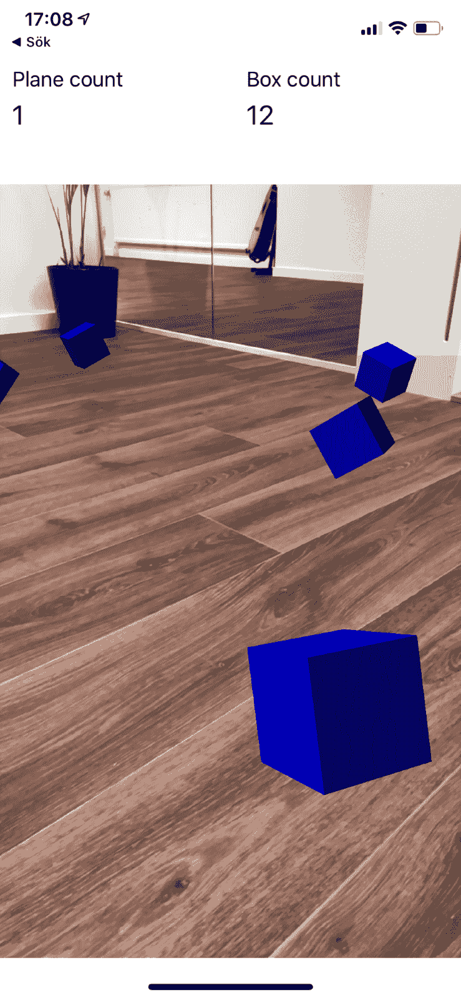

# 总结

在本章中，我们学习了如何通过使用自定义渲染器将 AR 集成到 Xamarin.Forms 中。我们利用了 UrhoSharp 来使用跨平台渲染、组件和输入管理来与世界交互。我们还学习了一些关于`MessagingCenter`的知识，它可以用于在应用程序的不同部分之间发送内部进程消息，以减少耦合。

接下来，我们将深入机器学习，并创建一个可以识别图像中的热狗的应用程序。
